# Ngspice User's Manual Version 46 (ngspice release version)

Holger Vogt, Giles Atkinson, Dietmar Warning, Paolo Nenzi March 31st, 2026

# Locations

The project and download pages of ngspice may be found at

Ngspice home page <https://ngspice.sourceforge.io/>

Project page at SourceForge <https://sourceforge.net/projects/ngspice/>

Download page at SourceForge <https://sourceforge.net/projects/ngspice/files/ng-spice-rework/>

Git source download <https://sourceforge.net/p/ngspice/ngspice/ci/master/tree/>

# Status

This manual is a work in progress. Some to-dos are listed in Chapt. [20.3.](#page-558-0) More is surely needed. You are invited to report bugs, missing items, wrongly described items, bad English style, etc. The preferred place for such reports is our [bug tracker.](https://sourceforge.net/p/ngspice/bugs/)

# How to use this Manual

The manual is a "work in progress." It may accompany a specific ngspice release, e.g. ngspice-44 as manual version 44. If its name contains 'Version xxplus', it describes the actual code status, found at the date of issue in the Git Source Code Management (SCM) tool. This manual is intended to provide a complete description of ngspice's functionality, features, commands, and procedures. This manual is not a book about learning SPICE usage, however the novice user may find some hints how to start using ngspice. Chapter [17.1](#page-528-0) gives a short introduction how to set up and simulate a small circuit. Chapter [28](#page-728-0) is about compiling and installing ngspice from a tarball or the actual Git source code, which you may find on the [ngspice web pages.](http://ngspice.sourceforge.net/download.html) If you are running a specific Linux distribution, you may check if it provides ngspice as part of the package. Some are listed [here.](http://ngspice.sourceforge.net/packages.html)

# License

This document is covered by the [Creative Commons Attribution Share-Alike \(CC-BY-SA\)](https://creativecommons.org/licenses/by-sa/4.0/) [v4.0..](https://creativecommons.org/licenses/by-sa/4.0/)

Part of chapters 12 and 25-29 are in the public domain.

Chapter 30 is covered by New BSD (chapt. [29.3.2\)](#page-749-0).

# Contents

| I |     |              | Ngspice User's Manual                        | 29 |
|---|-----|--------------|----------------------------------------------|----|
| 1 |     | Introduction |                                              | 35 |
|   | 1.1 |              | Simulation Algorithms                        | 36 |
|   |     | 1.1.1        | Analog Simulation                            | 36 |
|   |     | 1.1.2        | Matrix solvers                               | 36 |
|   |     | 1.1.3        | Device Models for Analog Simulation          | 37 |
|   |     | 1.1.4        | Digital Simulation                           | 37 |
|   |     | 1.1.5        | Mixed-Signal Simulation                      | 37 |
|   |     | 1.1.6        | Mixed-Level Simulation (Electronic and TCAD) | 38 |
|   | 1.2 |              | Supported Analyses                           | 39 |
|   |     | 1.2.1        | DC Analysis                                  | 40 |
|   |     | 1.2.2        | AC Small-Signal Analysis                     | 40 |
|   |     | 1.2.3        | Transient Analysis                           | 40 |
|   |     | 1.2.4        | Pole-Zero Analysis                           | 41 |
|   |     | 1.2.5        | Small-Signal Distortion Analysis             | 41 |
|   |     | 1.2.6        | Sensitivity Analysis                         | 41 |
|   |     | 1.2.7        | Noise Analysis                               | 42 |
|   |     | 1.2.8        | Periodic Steady State Analysis               | 42 |
|   | 1.3 |              | Analysis at Different Temperatures           | 42 |
|   |     | 1.3.1        | Introduction                                 | 42 |
|   |     | 1.3.2        | Controlling the temperature                  | 44 |
|   | 1.4 |              | Convergence                                  | 45 |
|   |     | 1.4.1        | Voltage convergence criterion                | 45 |
|   |     | 1.4.2        | Current convergence criterion                | 46 |
|   |     | 1.4.3        | Convergence failure                          | 46 |

| General Structure and Conventions<br>Input file structure<br>Syntax check<br>Some naming conventions<br>Topological constraints<br>Dot commands<br>Circuit elements (device instances)<br>.TITLE line<br>.END Line<br>Comments<br>End-of-line comments<br>Continuation lines<br>.MODEL Device Models<br>.SUBCKT Subcircuits | 47<br>47<br>47<br>48<br>49<br>49<br>51<br>53<br>53<br>53<br>54<br>54<br>54<br>55<br>56               |
|-----------------------------------------------------------------------------------------------------------------------------------------------------------------------------------------------------------------------------------------------------------------------------------------------------------------------------|------------------------------------------------------------------------------------------------------|
|                                                                                                                                                                                                                                                                                                                             |                                                                                                      |
|                                                                                                                                                                                                                                                                                                                             |                                                                                                      |
|                                                                                                                                                                                                                                                                                                                             |                                                                                                      |
|                                                                                                                                                                                                                                                                                                                             |                                                                                                      |
|                                                                                                                                                                                                                                                                                                                             |                                                                                                      |
|                                                                                                                                                                                                                                                                                                                             |                                                                                                      |
|                                                                                                                                                                                                                                                                                                                             |                                                                                                      |
|                                                                                                                                                                                                                                                                                                                             |                                                                                                      |
|                                                                                                                                                                                                                                                                                                                             |                                                                                                      |
|                                                                                                                                                                                                                                                                                                                             |                                                                                                      |
|                                                                                                                                                                                                                                                                                                                             |                                                                                                      |
|                                                                                                                                                                                                                                                                                                                             |                                                                                                      |
|                                                                                                                                                                                                                                                                                                                             |                                                                                                      |
|                                                                                                                                                                                                                                                                                                                             |                                                                                                      |
|                                                                                                                                                                                                                                                                                                                             |                                                                                                      |
| .SUBCKT Line                                                                                                                                                                                                                                                                                                                | 56                                                                                                   |
| .ENDS Line                                                                                                                                                                                                                                                                                                                  | 57                                                                                                   |
| Subcircuit Calls                                                                                                                                                                                                                                                                                                            | 57                                                                                                   |
|                                                                                                                                                                                                                                                                                                                             | 58                                                                                                   |
|                                                                                                                                                                                                                                                                                                                             | 58                                                                                                   |
|                                                                                                                                                                                                                                                                                                                             | 58                                                                                                   |
|                                                                                                                                                                                                                                                                                                                             | 59                                                                                                   |
| .PARAM Parametric netlists                                                                                                                                                                                                                                                                                                  | 59                                                                                                   |
| .param line                                                                                                                                                                                                                                                                                                                 | 59                                                                                                   |
| Brace expressions in circuit elements:                                                                                                                                                                                                                                                                                      | 60                                                                                                   |
| Subcircuit parameters                                                                                                                                                                                                                                                                                                       | 61                                                                                                   |
| Symbol scope                                                                                                                                                                                                                                                                                                                | 62                                                                                                   |
|                                                                                                                                                                                                                                                                                                                             | 62                                                                                                   |
|                                                                                                                                                                                                                                                                                                                             | 65                                                                                                   |
|                                                                                                                                                                                                                                                                                                                             | 65                                                                                                   |
|                                                                                                                                                                                                                                                                                                                             | 65                                                                                                   |
|                                                                                                                                                                                                                                                                                                                             | 66                                                                                                   |
|                                                                                                                                                                                                                                                                                                                             |                                                                                                      |
|                                                                                                                                                                                                                                                                                                                             | 67                                                                                                   |
|                                                                                                                                                                                                                                                                                                                             | Syntax of expressions<br>Reserved words<br>A word of caution on the three ngspice expression parsers |

|   | 2.16 |        | Parameters, functions, expressions, and command scripts       | 69 |
|---|------|--------|---------------------------------------------------------------|----|
|   |      | 2.16.1 | Parameters                                                    | 69 |
|   |      | 2.16.2 | Nonlinear sources                                             | 69 |
|   |      | 2.16.3 | Control commands, Command scripts                             | 69 |
| 3 |      |        | Circuit Elements and Models                                   | 71 |
|   | 3.1  |        | About netlists, device instances, models and model parameters | 71 |
|   | 3.2  |        | General options                                               | 73 |
|   |      | 3.2.1  | Paralleling devices with multiplier m                         | 73 |
|   |      | 3.2.2  | Instance and model parameters                                 | 75 |
|   |      | 3.2.3  | Model binning                                                 | 75 |
|   |      | 3.2.4  | Initial conditions                                            | 75 |
|   | 3.3  |        | Elementary Devices                                            | 76 |
|   |      | 3.3.1  | Resistors                                                     | 76 |
|   |      | 3.3.2  | Semiconductor Resistors                                       | 78 |
|   |      | 3.3.3  | Semiconductor Resistor Model (R)                              | 78 |
|   |      | 3.3.4  | Resistors, dependent on expressions (behavioral resistor)     | 80 |
|   |      | 3.3.5  | Resistor with nonlinear r2_cmc or r3_cmc models               | 80 |
|   |      | 3.3.6  | Capacitors                                                    | 81 |
|   |      | 3.3.7  | Semiconductor Capacitors                                      | 82 |
|   |      | 3.3.8  | Semiconductor Capacitor Model (C)                             | 82 |
|   |      | 3.3.9  | Capacitors, dependent on expressions (behavioral capacitor)   | 83 |
|   |      | 3.3.10 | Inductors                                                     | 85 |
|   |      | 3.3.11 | Inductor model                                                | 85 |
|   |      | 3.3.12 | Coupled (Mutual) Inductors                                    | 87 |
|   |      | 3.3.13 | Inductors, dependent on expressions (behavioral inductor)     | 88 |
|   |      | 3.3.14 | Capacitor or inductor with initial conditions                 | 89 |
|   |      | 3.3.15 | Switches                                                      | 90 |
|   |      | 3.3.16 | Switch Model (SW/CSW)                                         | 91 |
| 4 |      |        | Voltage and Current Sources                                   | 93 |
|   | 4.1  |        | Independent Sources for Voltage or Current                    | 93 |
|   |      | 4.1.1  | Pulse                                                         | 94 |
|   |      | 4.1.2  | Sinusoidal                                                    | 95 |
|   |      | 4.1.3  | Exponential                                                   | 96 |
|   |      | 4.1.4  | Piece-Wise Linear                                             | 96 |

|   |     | 4.1.5  | Single-Frequency FM                                     | 97  |
|---|-----|--------|---------------------------------------------------------|-----|
|   |     | 4.1.6  | Amplitude modulated source (AM)                         | 97  |
|   |     | 4.1.7  | Transient noise source                                  | 98  |
|   |     | 4.1.8  | Random voltage source                                   | 99  |
|   |     | 4.1.9  | External voltage or current input                       | 100 |
|   |     | 4.1.10 | Arbitrary Phase Sources                                 | 100 |
|   |     | 4.1.11 | RF Port                                                 | 101 |
|   | 4.2 |        | Linear Dependent Sources                                | 101 |
|   |     | 4.2.1  | Gxxxx: Linear Voltage-Controlled Current Sources (VCCS) | 101 |
|   |     | 4.2.2  | Exxxx: Linear Voltage-Controlled Voltage Sources (VCVS) | 102 |
|   |     | 4.2.3  | Fxxxx: Linear Current-Controlled Current Sources (CCCS) | 102 |
|   |     | 4.2.4  | Hxxxx: Linear Current-Controlled Voltage Sources (CCVS) | 102 |
|   |     | 4.2.5  | Polynomial Source Compatibility                         | 103 |
| 5 |     |        | Non-linear Dependent Sources (Behavioral Sources)       | 105 |
|   | 5.1 |        | Bxxxx: Nonlinear dependent source (ASRC)                | 105 |
|   |     | 5.1.1  | Syntax and usage                                        | 105 |
|   |     | 5.1.2  | Special B-Source Variables time, temper, hertz          | 109 |
|   |     | 5.1.3  | par('expression')                                       | 109 |
|   |     | 5.1.4  | Piecewise Linear Function: pwl                          | 109 |
|   | 5.2 |        | Exxxx: non-linear voltage source                        | 112 |
|   |     | 5.2.1  | VOL                                                     | 112 |
|   |     | 5.2.2  | VALUE                                                   | 113 |
|   |     | 5.2.3  | TABLE                                                   | 113 |
|   |     | 5.2.4  | POLY                                                    | 114 |
|   |     | 5.2.5  | LAPLACE                                                 | 114 |
|   |     | 5.2.6  | FREQ                                                    | 115 |
|   |     | 5.2.7  | AND/OR/NAND/NOR                                         | 115 |
|   | 5.3 |        | Gxxxx: non-linear current source                        | 116 |
|   |     | 5.3.1  | CUR                                                     | 116 |
|   |     | 5.3.2  | VALUE                                                   | 116 |
|   |     | 5.3.3  | TABLE                                                   | 116 |
|   |     | 5.3.4  | POLY                                                    | 117 |
|   |     | 5.3.5  | LAPLACE                                                 | 117 |
|   |     | 5.3.6  | FREQ                                                    | 117 |

|   |     | 5.3.7         | Example<br>117                                              |
|---|-----|---------------|-------------------------------------------------------------|
|   | 5.4 |               | Debugging a behavioral source<br>118                        |
|   | 5.5 |               | POLY Sources<br>119                                         |
|   |     | 5.5.1         | E voltage source, G current source<br>120                   |
|   |     | 5.5.2         | F voltage source, H current source<br>120                   |
| 6 |     |               | Transmission Lines<br>123                                   |
|   | 6.1 |               | Lossless Transmission Lines<br>123                          |
|   | 6.2 |               | Lossy Transmission Lines<br>124                             |
|   |     | 6.2.1         | Lossy Transmission Line Model (LTRA)<br>124                 |
|   | 6.3 |               | Uniform Distributed RC Lines<br>126                         |
|   |     | 6.3.1         | Uniform Distributed RC Model (URC)<br>126                   |
|   | 6.4 |               | KSPICE Lossy Transmission Lines<br>127                      |
|   |     | 6.4.1         | Single Lossy Transmission Line (TXL)<br>128                 |
|   |     | 6.4.2         | Coupled Multiconductor Line (CPL)<br>128                    |
| 7 |     | Device Models | 131                                                         |
|   | 7.1 |               | Instance lines and .model lines<br>131                      |
|   | 7.2 |               | Junction Diodes<br>132                                      |
|   |     | 7.2.1         | Diode Model (D)<br>132                                      |
|   |     | 7.2.2         | Diode Equations<br>136                                      |
|   |     | 7.2.3         | Diode models available via OpenVAF/OSDI<br>141              |
|   | 7.3 | BJT           | 142                                                         |
|   |     | 7.3.1         | Bipolar Junction Transistors (BJTs)<br>142                  |
|   |     | 7.3.2         | BJT Models (NPN/PNP)<br>142                                 |
|   |     | 7.3.3         | Gummel-Poon Models<br>143                                   |
|   |     | 7.3.4         | VBIC Model<br>148                                           |
|   |     | 7.3.5         | HICUM level 2 Model<br>150                                  |
|   |     | 7.3.6         | BJT models available via OpenVAF/OSDI<br>151                |
|   | 7.4 | JFETs         | 152                                                         |
|   |     | 7.4.1         | Junction Field-Effect Transistors (JFETs)<br>152            |
|   |     | 7.4.2         | JFET Models (NJF/PJF)<br>152                                |
|   |     | 7.4.3         | Basic model statement<br>152                                |
|   |     | 7.4.4         | JFET level 1 model with Parker Skellern modification<br>152 |
|   |     | 7.4.5         | JFET level 2 Parker Skellern model<br>155                   |
|   | 7.5 | MESFETs       | 157                                                         |

|     | 7.5.1      | MESFET devices<br>157                                                                   |
|-----|------------|-----------------------------------------------------------------------------------------|
|     | 7.5.2      | MESFET Models (NMF/PMF)<br>157                                                          |
|     | 7.5.3      | Model by Statz e.a.<br>157                                                              |
|     | 7.5.4      | Model by Ytterdal e.a.<br>158                                                           |
|     | 7.5.5      | hfet1 and hfet2<br>158                                                                  |
| 7.6 | MOSFETs    | 159                                                                                     |
|     | 7.6.1      | MOSFET devices<br>159                                                                   |
|     | 7.6.2      | MOSFET models (NMOS/PMOS)<br>160                                                        |
|     | 7.6.3      | BSIM Models<br>165                                                                      |
|     | 7.6.4      | BSIMSOI models (levels 10, 58, 55, 56, 57)<br>169                                       |
|     | 7.6.5      | SOI3 model (level 60)<br>169                                                            |
|     | 7.6.6      | HiSIM models of the University of Hiroshima<br>169                                      |
|     | 7.6.7      | MOS models available via OpenVAF/OSDI<br>169                                            |
| 7.7 |            | Power MOSFET model (VDMOS)<br>170                                                       |
|     |            | Mixed-Mode and Behavioral Modeling with XSPICE<br>177                                   |
|     |            | Code Model Element & .MODEL Cards<br>177                                                |
|     |            | Syntax<br>177                                                                           |
|     |            | Examples<br>181                                                                         |
|     |            | Search path for file input<br>182                                                       |
|     |            | Code model location and assessment<br>182                                               |
|     |            | Analog Models<br>183                                                                    |
|     |            | Gain<br>183                                                                             |
|     |            | Summer<br>184                                                                           |
|     |            | Multiplier<br>185                                                                       |
|     |            | Divider<br>186                                                                          |
|     | 8.2.5      | Limiter<br>187                                                                          |
|     | 8.2.6      | Controlled Limiter<br>189                                                               |
|     | 8.2.7      | PWL Controlled Source<br>190                                                            |
|     |            | PWL Time Controlled Source with optional edge smoothing<br>192                          |
|     | 8.2.9      | Filesource (PWL sourced from file)<br>195                                               |
|     | 8.2.10     | Multi_input_PWL_block<br>196                                                            |
|     |            | Analog Switch<br>197                                                                    |
|     | 8.2.12     | Alternative Analog Switch<br>199                                                        |
|     | 8.2.13     | Zener Diode<br>200                                                                      |
|     | 8.1<br>8.2 | 8.1.1<br>8.1.2<br>8.1.3<br>8.1.4<br>8.2.1<br>8.2.2<br>8.2.3<br>8.2.4<br>8.2.8<br>8.2.11 |

|     | 8.2.14 | Current Limiter                              | 201 |
|-----|--------|----------------------------------------------|-----|
|     | 8.2.15 | Hysteresis Block                             | 204 |
|     | 8.2.16 | Differentiator                               | 205 |
|     | 8.2.17 | Integrator                                   | 207 |
|     | 8.2.18 | S-Domain Transfer Function                   | 208 |
|     | 8.2.19 | PWL Transfer Function                        | 211 |
|     | 8.2.20 | Slew Rate Block                              | 213 |
|     | 8.2.21 | Inductive Coupling                           | 214 |
|     | 8.2.22 | Magnetic Core                                | 215 |
|     | 8.2.23 | Controlled Sine Wave Oscillator              | 219 |
|     | 8.2.24 | Controlled Triangle Wave Oscillator          | 220 |
|     | 8.2.25 | Controlled Square Wave Oscillator            | 221 |
|     | 8.2.26 | Controlled One-Shot                          | 223 |
|     | 8.2.27 | Capacitance Meter                            | 225 |
|     | 8.2.28 | Inductance Meter                             | 226 |
|     | 8.2.29 | Memristor                                    | 226 |
|     | 8.2.30 | 2D table model                               | 227 |
|     | 8.2.31 | 3D table model                               | 229 |
|     | 8.2.32 | Simple Diode Model                           | 231 |
|     | 8.2.33 | Analog delay                                 | 233 |
|     | 8.2.34 | Potentiometer                                | 234 |
|     | 8.2.35 | Delayed state of a node                      | 236 |
| 8.3 |        | Hybrid Models                                | 236 |
|     | 8.3.1  | Digital-to-Analog Node Bridge                | 237 |
|     | 8.3.2  | Analog-to-Digital Node Bridge                | 238 |
|     | 8.3.3  | Bidirectional Analog/Digital Node Bridge     | 239 |
|     | 8.3.4  | Controlled Digital Oscillator                | 243 |
|     | 8.3.5  | Node bridge from digital to real with enable | 244 |
|     | 8.3.6  | A Z**-1 block working on real data           | 245 |
|     | 8.3.7  | A gain block for event-driven real data      | 245 |
|     | 8.3.8  | Node bridge from real to analog voltage      | 246 |
|     | 8.3.9  | Controlled PWM Oscillator                    | 246 |
| 8.4 |        | Digital Models                               | 248 |
|     | 8.4.1  | Buffer                                       | 250 |
|     | 8.4.2  | Inverter                                     | 250 |
|     |        |                                              |     |

|     | 8.4.3  | And<br>251                                               |
|-----|--------|----------------------------------------------------------|
|     | 8.4.4  | Nand<br>252                                              |
|     | 8.4.5  | Or<br>252                                                |
|     | 8.4.6  | Nor<br>253                                               |
|     | 8.4.7  | Xor<br>253                                               |
|     | 8.4.8  | Xnor<br>254                                              |
|     | 8.4.9  | Tristate<br>254                                          |
|     | 8.4.10 | Pullup<br>256                                            |
|     | 8.4.11 | Pulldown<br>256                                          |
|     | 8.4.12 | D Flip Flop<br>257                                       |
|     | 8.4.13 | JK Flip Flop<br>259                                      |
|     | 8.4.14 | Toggle Flip Flop<br>261                                  |
|     | 8.4.15 | Set-Reset Flip Flop<br>263                               |
|     | 8.4.16 | D Latch<br>265                                           |
|     | 8.4.17 | Set-Reset Latch<br>267                                   |
|     | 8.4.18 | State Machine<br>269                                     |
|     | 8.4.19 | Frequency Divider<br>272                                 |
|     | 8.4.20 | RAM<br>273                                               |
|     | 8.4.21 | Digital Source<br>276                                    |
|     | 8.4.22 | LUT<br>277                                               |
|     | 8.4.23 | General LUT<br>278                                       |
|     | 8.4.24 | D_process<br>280                                         |
|     | 8.4.25 | d_cosim<br>282                                           |
| 8.5 |        | Transmission lines models<br>284                         |
|     | 8.5.1  | Generic transmission line<br>284                         |
|     | 8.5.2  | Generic coupled lines<br>286                             |
|     | 8.5.3  | Microstip line<br>289                                    |
|     | 8.5.4  | Coupled microstrip<br>293                                |
|     | 8.5.5  | Microstrip open end<br>298                               |
| 8.6 |        | Predefined Node Types for event driven simulation<br>300 |
|     | 8.6.1  | Digital Node Type<br>300                                 |
|     | 8.6.2  | Real Node Type<br>300                                    |
|     | 8.6.3  | Int Node Type<br>301                                     |
|     | 8.6.4  | (Digital) Input/Output<br>301                            |
| 8.7 |        | Automatic insertion of bridging devices<br>301           |

| 9  |      |              | Verilog-A Compact Device Models                                                   | 303 |
|----|------|--------------|-----------------------------------------------------------------------------------|-----|
|    | 9.1  | Introduction |                                                                                   | 303 |
|    | 9.2  |              | OSDI/OpenVAF                                                                      | 303 |
|    | 9.3  |              | How to create and apply OpenVAF models                                            | 304 |
|    |      | 9.3.1        | Preparing for simulation                                                          | 304 |
|    |      | 9.3.2        | OSDI/OpenVAF examples distributed with ngspice                                    | 306 |
| 10 |      |              | Digital Device Models                                                             | 307 |
|    | 10.1 |              | U devices (basic digital building blocks)                                         | 307 |
|    |      | 10.1.1       | General format                                                                    | 308 |
|    |      | 10.1.2       | List of devices available in ngspice (basic types)                                | 308 |
|    |      | 10.1.3       | URC transmission line versus U devices                                            | 309 |
|    | 10.2 |              | Support for standard digital devices                                              | 309 |
|    | 10.3 |              | Digital devices defined by a Hardware Description Language                        | 310 |
|    |      | 10.3.1       | Using Verilator, Verilog, and code model d_cosim                                  | 311 |
|    |      | 10.3.2       | Using Icarus Verilog, and code model d_cosim                                      | 312 |
|    |      | 10.3.3       | Using GHDL and code model d_cosim.                                                | 313 |
|    |      | 10.3.4       | Using independent processes (e.g.<br>C coded), pipes, and code model<br>d_process | 313 |
|    |      | 10.3.5       | Using Yosys to map digital Verilog onto basic code model cells                    | 314 |
| 11 |      |              | Analyses and Output Control (batch mode)                                          | 315 |
|    | 11.1 |              | Simulator Variables (.options)                                                    | 315 |
|    |      | 11.1.1       | General Options                                                                   | 316 |
|    |      | 11.1.2       | OP and DC Solution Options                                                        | 317 |
|    |      | 11.1.3       | AC Solution Options                                                               | 319 |
|    |      | 11.1.4       | Transient Analysis Options                                                        | 319 |
|    |      | 11.1.5       | ELEMENT Specific options                                                          | 320 |
|    |      | 11.1.6       | Transmission Lines Specific Options                                               | 321 |
|    |      | 11.1.7       | Precedence of option and .options commands                                        | 321 |
|    | 11.2 |              | Initial Conditions                                                                | 321 |
|    |      | 11.2.1       | .NODESET: Specify Initial Node Voltage Guesses                                    | 321 |
|    |      | 11.2.2       | .IC: Set Initial Conditions                                                       | 322 |
|    | 11.3 | Analyses     |                                                                                   | 323 |
|    |      | 11.3.1       | .AC: Small-Signal AC Analysis                                                     | 323 |
|    |      | 11.3.2       | .DC: DC Transfer Function                                                         | 324 |

|      | 11.3.3        | .DISTO: Distortion Analysis                          | 324 |
|------|---------------|------------------------------------------------------|-----|
|      | 11.3.4        | .NOISE: Noise Analysis                               | 326 |
|      | 11.3.5        | .OP: Operating Point Analysis                        | 327 |
|      | 11.3.6        | .PZ: Pole-Zero Analysis                              | 329 |
|      | 11.3.7        | .SENS: DC or Small-Signal AC Sensitivity Analysis    | 329 |
|      | 11.3.8        | .SP S-Parameter Analysis                             | 330 |
|      | 11.3.9        | .TF: Transfer Function Analysis                      | 331 |
|      |               | 11.3.10 .TRAN: Transient Analysis                    | 331 |
|      |               | 11.3.11 Transient noise analysis (at low frequency)  | 332 |
|      |               | 11.3.12 .PSS: Periodic Steady State Analysis         | 335 |
| 11.4 |               | Measurements after AC, DC and Transient Analysis     | 336 |
|      | 11.4.1        | .meas(ure)                                           | 336 |
|      | 11.4.2        | batch versus interactive mode                        | 336 |
|      | 11.4.3        | General remarks                                      | 336 |
|      | 11.4.4        | Input                                                | 337 |
|      | 11.4.5        | Trig Targ                                            | 337 |
|      | 11.4.6        | Find When                                            | 339 |
|      | 11.4.7        | AVG MIN MAX PP RMS MIN_AT MAX_AT                     | 340 |
|      | 11.4.8        | Integ                                                | 340 |
|      | 11.4.9        | param                                                | 341 |
|      |               | 11.4.10 par('expression'<br>)                        | 341 |
|      | 11.4.11 Deriv |                                                      | 342 |
|      |               | 11.4.12 More examples                                | 342 |
| 11.5 |               | Safe Operating Area (SOA) warning messages           | 343 |
|      | 11.5.1        | Resistor and Capacitor SOA model parameters          | 344 |
|      | 11.5.2        | Diode SOA model parameters                           | 344 |
|      | 11.5.3        | BJT SOA model parameters                             | 345 |
|      | 11.5.4        | MOS SOA model parameters                             | 346 |
|      | 11.5.5        | VDMOS SOA model parameters                           | 347 |
| 11.6 | Batch Output  |                                                      | 347 |
|      | 11.6.1        | .SAVE: Name vector(s) to be saved in raw file        | 347 |
|      | 11.6.2        | .PRINT Lines                                         | 348 |
|      | 11.6.3        | .PLOT Lines                                          | 349 |
|      | 11.6.4        | .FOUR: Fourier Analysis of Transient Analysis Output | 349 |

|    |      | 11.6.5             | .PROBE: Save device node currents, device power dissipation, or dif<br>ferential voltages between arbitrary nodes | 350 |
|----|------|--------------------|-------------------------------------------------------------------------------------------------------------------|-----|
|    |      | 11.6.6             | par('expression'): Algebraic expressions for output                                                               | 354 |
|    |      | 11.6.7             | .width                                                                                                            | 355 |
|    | 11.7 |                    | Measuring current through device terminals                                                                        | 355 |
|    |      | 11.7.1             | Using the .probe command                                                                                          | 355 |
|    |      | 11.7.2             | Adding a voltage source in series                                                                                 | 355 |
|    |      | 11.7.3             | Using option 'savecurrents'                                                                                       | 356 |
| 12 |      | Starting ngspice   |                                                                                                                   | 357 |
|    | 12.1 | Introduction       |                                                                                                                   | 357 |
|    | 12.2 |                    | Where to obtain ngspice                                                                                           | 357 |
|    | 12.3 |                    | Command line options for starting ngspice                                                                         | 358 |
|    | 12.4 |                    | Starting options                                                                                                  | 360 |
|    |      | 12.4.1             | Batch mode                                                                                                        | 360 |
|    |      | 12.4.2             | Interactive mode                                                                                                  | 360 |
|    |      | 12.4.3             | Control mode (Interactive mode with control file or control section)                                              | 360 |
|    | 12.5 |                    | Standard configuration file spinit                                                                                | 362 |
|    | 12.6 |                    | User defined configuration file .spiceinit                                                                        | 364 |
|    | 12.7 |                    | Environmental variables                                                                                           | 365 |
|    |      | 12.7.1             | Ngspice specific variables                                                                                        | 365 |
|    |      | 12.7.2             | Common environment variables                                                                                      | 366 |
|    | 12.8 |                    | Memory usage                                                                                                      | 366 |
|    | 12.9 |                    | Simulation time                                                                                                   | 366 |
|    |      |                    | 12.10Ngspice on multi-core processors using OpenMP                                                                | 367 |
|    |      |                    | 12.10.1 Introduction                                                                                              | 367 |
|    |      |                    | 12.10.2 Internals                                                                                                 | 368 |
|    |      |                    | 12.10.3 Some results                                                                                              | 368 |
|    |      | 12.10.4 Usage      |                                                                                                                   | 369 |
|    |      |                    | 12.10.5 Literature                                                                                                | 369 |
|    |      | 12.11Compatibility |                                                                                                                   | 370 |
|    |      |                    | 12.11.1 Compatibility mode                                                                                        | 370 |
|    |      |                    | 12.11.2 Missing functions                                                                                         | 371 |
|    |      |                    | 12.11.3 Devices                                                                                                   | 371 |
|    |      |                    | 12.11.4 Controls and commands                                                                                     | 372 |

|    | 12.11.5 PSPICE Compatibility mode                                                   | 373        |
|----|-------------------------------------------------------------------------------------|------------|
|    | 12.11.6 LTSPICE Compatibility mode                                                  | 375        |
|    | 12.11.7 LTSPICE/PSPICE Compatibility mode                                           | 376        |
|    | 12.11.8 KiCad Compatibility mode                                                    | 376        |
|    | 12.11.9 Spectre Compatibility mode                                                  | 377        |
|    | 12.11.10HSPICE Compatibility mode                                                   | 377        |
|    | 12.12Transient simulation time steps with voltage-based truncation error correction | 377        |
|    | 12.13Server mode option -s                                                          | 378        |
|    | 12.14Pipe mode option -p                                                            | 379        |
|    | 12.15Ngspice control via input, output fifos                                        | 380        |
|    | 12.16Tests                                                                          | 381        |
|    | 12.17Tools for debugging a circuit netlist                                          | 382        |
|    | 12.17.1 options and initial conditions                                              | 382        |
|    | 12.17.2 set debug                                                                   | 382        |
|    | 12.17.3 set ngdebug                                                                 | 382        |
|    | 12.17.4 miscellaneous                                                               | 383        |
|    | 12.18Reporting bugs and errors                                                      | 383        |
|    |                                                                                     |            |
|    |                                                                                     |            |
| 13 | Interactive Interpreter                                                             | 385        |
|    | 13.1<br>Introduction                                                                | 385        |
|    | 13.2<br>Expressions, Functions, and Constants                                       | 386        |
|    | 13.3<br>Plots                                                                       | 391        |
|    | 13.4<br>Command Interpretation                                                      | 392        |
|    | 13.4.1<br>On the console<br>13.4.2<br>Scripts                                       | 392<br>392 |
|    | 13.4.3<br>Add-on to circuit file                                                    | 392        |
|    | 13.5<br>Commands                                                                    | 393        |
|    | 13.5.1<br>Ac: Perform an AC, small-signal frequency response analysis               | 393        |
|    | 13.5.2<br>Alias: Create an alias for a command                                      | 394        |
|    | 13.5.3<br>Alter: Change a device or model parameter                                 | 394        |
|    | 13.5.4<br>Altermod: Change model parameter(s)                                       | 396        |
|    | 13.5.5<br>Alterparam: Change value of a global parameter                            | 397        |
|    | 13.5.6<br>Asciiplot: Plot values using old-style character plots                    | 398        |
|    | 13.5.7<br>Aspice*: Asynchronous ngspice run                                         | 398        |

| 13.5.9<br>Bg_halt**: halt a run<br>398                                             |
|------------------------------------------------------------------------------------|
| 13.5.10 Bg_run**: Run analysis from the input file in the background thread<br>399 |
| 13.5.11 Bug: Output URL for ngspice bug tracker<br>399                             |
| 13.5.12 Cd: Change directory<br>399                                                |
| 13.5.13 Cdump: Dump the control flow to the screen<br>399                          |
| 13.5.14 Circbyline: Enter a circuit line by line<br>400                            |
| 13.5.15 Codemodel: Load an XSPICE code model library<br>401                        |
| 13.5.16 Compose: Compose a vector<br>402                                           |
| 13.5.17 Cutout: Cut out a section of all vectors in a tran plot<br>403             |
| 13.5.18 Dc: Perform a DC-sweep analysis<br>403                                     |
| 13.5.19 Define: Define a function<br>403                                           |
| 13.5.20 Deftype: Define a new type for a vector or plot<br>404                     |
| 13.5.21 Delete: Remove a trace or breakpoint<br>404                                |
| 13.5.22 Destroy: Delete an output data set<br>404                                  |
| 13.5.23 Devhelp: information on available devices<br>405                           |
| 13.5.24 Diff: Compare vectors<br>406                                               |
| 13.5.25 Display: List known vectors and types<br>406                               |
| 13.5.26 Echo: Print text<br>406                                                    |
| 13.5.27 Edit*: Edit the current circuit<br>407                                     |
| 13.5.28 Edisplay: Print a list of all the event nodes<br>407                       |
| 13.5.29 Eprint: Print an event driven node<br>407                                  |
| 13.5.30 Eprvcd: Dump nodes in VCD format<br>407                                    |
| 13.5.31 Esave: Save a set of event node outputs<br>408                             |
| 13.5.32 Fclose: close an open file handle<br>408                                   |
| 13.5.33 FFT: fast Fourier transform of vectors<br>408                              |
| 13.5.34 Fopen: open a text file<br>410                                             |
| 13.5.35 Fourier: Perform a Fourier transform<br>410                                |
| 13.5.36 Fread: read into a variable from a text file<br>412                        |
| 13.5.37 Getcwd: Print the current working directory<br>412                         |
| 13.5.38 Gnuplot: Graphics output via gnuplot<br>412                                |
| 13.5.39 Hardcopy: Save a plot to a file for printing<br>412                        |
| 13.5.40 Help: Print summaries of Ngspice commands<br>413                           |
| 13.5.41 History: Review previous commands<br>413                                   |
| 13.5.42 Inventory: Print circuit inventory<br>415                                  |
| 13.5.43 Iplot*: Incremental plot<br>416                                            |

| 13.5.44 Let: Assign a value to a vector<br>416                                          |
|-----------------------------------------------------------------------------------------|
| 13.5.45 Linearize: Interpolate to a linear scale<br>417                                 |
| 13.5.46 Listing: Print a listing of the current circuit<br>418                          |
| 13.5.47 Load: Load rawfile data<br>419                                                  |
| 13.5.48 Mc_source: Reload the circuit netlist from an internal storage<br>419           |
| 13.5.49 Meas: Measurements on simulation data<br>419                                    |
| 13.5.50 Mdump: Dump the matrix values to a file (or to console)<br>420                  |
| 13.5.51 Mrdump: Dump the matrix right hand side values to a file (or to console)<br>420 |
| 13.5.52 Noise: Noise analysis<br>420                                                    |
| 13.5.53 Op: Perform an operating point analysis<br>421                                  |
| 13.5.54 Option: Set a ngspice option<br>421                                             |
| 13.5.55 Plot*: Plot vectors on the display<br>422                                       |
| 13.5.56 Pre_ <command/> : execute commands prior to parsing the circuit<br>424          |
| 13.5.57 Pre_OSDI: load a *.osdi compact device model shared library<br>424              |
| 13.5.58 Print: Print values<br>424                                                      |
| 13.5.59 Psd: power spectral density of vectors<br>425                                   |
| 13.5.60 Quit: Leave Ngspice<br>425                                                      |
| 13.5.61 Rehash: Reset internal hash tables<br>426                                       |
| 13.5.62 Remcirc: Remove the current circuit<br>426                                      |
| 13.5.63 Remzerovec: Remove zero length vectors<br>426                                   |
| 13.5.64 Reset: Reset an analysis<br>426                                                 |
| 13.5.65 Reshape: Alter the dimensionality or dimensions of a vector<br>427              |
| 13.5.66 Resume: Continue a simulation after a stop<br>427                               |
| 13.5.67 Run: Run analysis from the input file<br>428                                    |
| 13.5.68 Rusage: Resource usage<br>428                                                   |
| 13.5.69 Save: Save a set of outputs<br>429                                              |
| 13.5.70 Sens: Run a sensitivity analysis<br>430                                         |
| 13.5.71 Set: Set the value of a variable<br>431                                         |
| 13.5.72 Setcs: Set the value of a variable, case preserved<br>432                       |
| 13.5.73 Setcirc: Change the current circuit<br>432                                      |
| 13.5.74 Setplot: Switch the current set of vectors<br>433                               |
| 13.5.75 Setscale: Set the scale vector for the current plot<br>433                      |
| 13.5.76 Setseed: Set the seed value for the random number generator<br>433              |
| 13.5.77 Settype: Set the type of a vector<br>434                                        |
| 13.5.78 Shell: Call the command interpreter<br>434                                      |

|      | 13.5.79 Shift: Alter a list variable                                    | 434 |
|------|-------------------------------------------------------------------------|-----|
|      | 13.5.80 Show: List device state                                         | 435 |
|      | 13.5.81 Showmod: List model parameter values                            | 435 |
|      | 13.5.82 Snload: Load the snapshot file                                  | 436 |
|      | 13.5.83 Snsave: Save a snapshot file                                    | 436 |
|      | 13.5.84 Source: Read a ngspice input file                               | 437 |
|      | 13.5.85 Sp: S-Parameter Analysis                                        | 438 |
|      | 13.5.86 Spec: Create a frequency domain plot                            | 438 |
|      | 13.5.87 Status: Display breakpoint information                          | 439 |
|      | 13.5.88 Step: Run a fixed number of time-points                         | 439 |
|      | 13.5.89 Stop: Set a breakpoint                                          | 439 |
|      | 13.5.90 Strcmp: Compare two strings                                     | 440 |
|      | 13.5.91 Strslice: Extract a substring                                   | 440 |
|      | 13.5.92 Strstr: Find a substring                                        | 440 |
|      | 13.5.93 Sysinfo: Print system information                               | 440 |
|      | 13.5.94 Tf: Run a Transfer Function analysis                            | 441 |
|      | 13.5.95 Trace: Trace nodes                                              | 442 |
|      | 13.5.96 Tran: Perform a transient analysis                              | 442 |
|      | 13.5.97 Transpose: Swap the elements in a multi-dimensional data set    | 443 |
|      | 13.5.98 Unalias: Retract an alias                                       | 443 |
|      | 13.5.99 Undefine: Retract a definition                                  | 443 |
|      | 13.5.100Unlet: Delete the specified vector(s)                           | 443 |
|      | 13.5.101Unset: Clear a variable                                         | 444 |
|      | 13.5.102Version: Print the version of ngspice                           | 444 |
|      | 13.5.103Where: Identify troublesome node or device                      | 445 |
|      | 13.5.104Wrdata: Write data to a file (simple table)                     | 446 |
|      | 13.5.105Write: Write data to a file (Spice3f5 format)                   | 446 |
|      | 13.5.106Wrnodev: Write node voltage values to a file (.ic=xx format)    | 447 |
|      | 13.5.107Wrs2p: Write scattering parameters to file (Touchstone® format) | 448 |
| 13.6 | Control Structures                                                      | 448 |
|      | 13.6.1<br>While - End                                                   | 448 |
|      | 13.6.2<br>Repeat - End                                                  | 449 |
|      | 13.6.3<br>Dowhile - End                                                 | 450 |
|      | 13.6.4<br>Foreach - End                                                 | 450 |
|      | 13.6.5<br>If - Then - Else                                              | 451 |
|      |                                                                         |     |

|    |      | 13.6.6                               | Label   |           |                                                                       |  |  |  |  |  |  |  | 451 |
|----|------|--------------------------------------|---------|-----------|-----------------------------------------------------------------------|--|--|--|--|--|--|--|-----|
|    |      | 13.6.7                               | Goto    |           |                                                                       |  |  |  |  |  |  |  | 451 |
|    |      | 13.6.8                               |         | Continue  |                                                                       |  |  |  |  |  |  |  | 452 |
|    |      | 13.6.9                               | Break   |           |                                                                       |  |  |  |  |  |  |  | 452 |
|    | 13.7 | Internally predefined variables      |         |           |                                                                       |  |  |  |  |  |  |  | 452 |
|    | 13.8 | Scripts                              |         |           |                                                                       |  |  |  |  |  |  |  | 461 |
|    |      | 13.8.1                               |         | Variables |                                                                       |  |  |  |  |  |  |  | 461 |
|    |      | 13.8.2                               | Vectors |           |                                                                       |  |  |  |  |  |  |  | 462 |
|    |      | 13.8.3                               |         |           | Assessing vectors in subcircuits                                      |  |  |  |  |  |  |  | 462 |
|    |      | 13.8.4                               |         | Commands  |                                                                       |  |  |  |  |  |  |  | 463 |
|    |      | 13.8.5                               |         |           | control structures                                                    |  |  |  |  |  |  |  | 463 |
|    |      | 13.8.6                               |         |           | Example script 'spectrum'                                             |  |  |  |  |  |  |  | 467 |
|    |      | 13.8.7                               |         |           | Example script for random numbers                                     |  |  |  |  |  |  |  | 469 |
|    |      | 13.8.8                               |         |           | Parameter sweep                                                       |  |  |  |  |  |  |  | 470 |
|    |      | 13.8.9                               |         |           | Output redirection                                                    |  |  |  |  |  |  |  | 470 |
|    | 13.9 | Scattering parameters (S-parameters) |         |           |                                                                       |  |  |  |  |  |  |  | 472 |
|    |      | 13.9.1                               | Intro   |           |                                                                       |  |  |  |  |  |  |  | 472 |
|    |      | 13.9.2                               |         |           | S-parameter measurement basics                                        |  |  |  |  |  |  |  | 472 |
|    |      | 13.9.3                               |         |           | Usage of .sp and sp                                                   |  |  |  |  |  |  |  | 474 |
|    |      | 13.9.4                               |         |           | Usage of the script                                                   |  |  |  |  |  |  |  | 474 |
|    |      | 13.10Using shell variables           |         |           |                                                                       |  |  |  |  |  |  |  | 474 |
|    |      | 13.11MISCELLANEOUS                   |         |           |                                                                       |  |  |  |  |  |  |  | 475 |
|    |      | 13.12Bugs                            |         |           |                                                                       |  |  |  |  |  |  |  | 475 |
| 14 |      | Ngspice User Interfaces              |         |           |                                                                       |  |  |  |  |  |  |  | 477 |
|    | 14.1 | MS Windows Graphical User Interface  |         |           |                                                                       |  |  |  |  |  |  |  | 477 |
|    | 14.2 | MS Windows Console                   |         |           |                                                                       |  |  |  |  |  |  |  | 480 |
|    | 14.3 | Linux                                |         |           |                                                                       |  |  |  |  |  |  |  | 480 |
|    | 14.4 | CygWin                               |         |           |                                                                       |  |  |  |  |  |  |  | 480 |
|    | 14.5 | Error handling                       |         |           |                                                                       |  |  |  |  |  |  |  | 481 |
|    | 14.6 | Output-to-file options               |         |           |                                                                       |  |  |  |  |  |  |  | 481 |
|    |      | 14.6.1                               |         |           | Graphics files                                                        |  |  |  |  |  |  |  | 481 |
|    |      | 14.6.2                               |         |           | Tabulated files                                                       |  |  |  |  |  |  |  | 487 |
|    | 14.7 | Gnuplot                              |         |           |                                                                       |  |  |  |  |  |  |  | 490 |
|    |      | 14.7.1                               |         |           | Using Gnuplot to produce 1D graphs of (electrical) simulation results |  |  |  |  |  |  |  | 490 |
|    |      |                                      |         |           |                                                                       |  |  |  |  |  |  |  |     |

|    |      | 14.7.2 | Using gnuplot to produce 2D contour plots for Cider<br>491  |
|----|------|--------|-------------------------------------------------------------|
|    | 14.8 |        | Integration with CAD software and 'third party' GUIs<br>495 |
|    |      | 14.8.1 | KiCad<br>495                                                |
|    |      | 14.8.2 | Xschem<br>495                                               |
|    |      | 14.8.3 | Qucs-S<br>495                                               |
|    |      | 14.8.4 | GNU Spice GUI<br>495                                        |
|    |      | 14.8.5 | XCircuit<br>496                                             |
|    |      | 14.8.6 | NyanCAD Mosaic<br>496                                       |
|    |      | 14.8.7 | MSEspice<br>496                                             |
|    |      | 14.8.8 | GNU Octave<br>496                                           |
| 15 |      |        | ngspice as shared library or dynamic link library<br>497    |
|    | 15.1 |        | Compile options<br>497                                      |
|    |      | 15.1.1 | How to get the sources<br>497                               |
|    |      | 15.1.2 | Linux, MINGW, CYGWIN<br>497                                 |
|    |      | 15.1.3 | MS Visual Studio<br>498                                     |
|    | 15.2 |        | Linking shared ngspice to a calling application<br>498      |
|    |      | 15.2.1 | Linking during creating the caller<br>498                   |
|    |      | 15.2.2 | Loading at runtime<br>498                                   |
|    | 15.3 |        | Shared ngspice API<br>498                                   |
|    |      | 15.3.1 | structs and types defined for transporting data<br>498      |
|    |      | 15.3.2 | Exported functions<br>500                                   |
|    |      | 15.3.3 | Callback functions<br>504                                   |
|    | 15.4 |        | General remarks on using the API<br>508                     |
|    |      | 15.4.1 | Loading a netlist<br>508                                    |
|    |      | 15.4.2 | Running the simulation<br>510                               |
|    |      | 15.4.3 | Accessing data<br>511                                       |
|    |      | 15.4.4 | Altering model or device parameters<br>512                  |
|    |      | 15.4.5 | Output<br>512                                               |
|    |      | 15.4.6 | Error handling<br>512                                       |
|    | 15.5 |        | Example applications<br>512                                 |
|    | 15.6 |        | ngspice parallel<br>513                                     |
|    |      | 15.6.1 | Go parallel!<br>513                                         |
|    |      | 15.6.2 | Additional exported functions<br>514                        |
|    |      | 15.6.3 | Additional callback functions<br>515                        |
|    |      | 15.6.4 | Parallel ngspice example<br>515                             |

| 16 |      | TCLspice                                                           | 517 |
|----|------|--------------------------------------------------------------------|-----|
|    | 16.1 | tclspice framework                                                 | 517 |
|    | 16.2 | tclspice documentation                                             | 517 |
|    | 16.3 | spicetoblt                                                         | 517 |
|    | 16.4 | Running TCLspice                                                   | 518 |
|    | 16.5 | examples                                                           | 518 |
|    |      | 16.5.1<br>Active capacitor measurement                             | 518 |
|    |      | 16.5.2<br>Optimization of a linearization circuit for a Thermistor | 521 |
|    |      | 16.5.3<br>Progressive display                                      | 525 |
|    | 16.6 | Compiling                                                          | 526 |
|    |      | 16.6.1<br>Linux                                                    | 526 |
|    |      | 16.6.2<br>MS Windows                                               | 526 |
|    | 16.7 | MS Windows 32 Bit binaries                                         | 527 |
| 17 |      | Example Circuits                                                   | 529 |
|    | 17.1 | AC coupled transistor amplifier                                    | 529 |
|    | 17.2 | Differential Pair                                                  | 535 |
|    | 17.3 | MOSFET Characterization                                            | 535 |
|    | 17.4 | RTL Inverter                                                       | 535 |
|    | 17.5 | Four-Bit Binary Adder (Bipolar)                                    | 536 |
|    | 17.6 | Four-Bit Binary Adder (MOS)                                        | 538 |
|    | 17.7 | Transmission-Line Inverter                                         | 539 |
|    |      |                                                                    |     |
| 18 |      | Statistical circuit analysis                                       | 541 |
|    | 18.1 | Introduction                                                       | 541 |
|    | 18.2 | Using random param(eters)                                          | 541 |
|    | 18.3 | Behavioral sources (B, E, G, R, L, C) with random control          | 543 |
|    | 18.4 | ngspice control language                                           | 544 |
|    | 18.5 | Monte-Carlo Simulation                                             | 545 |
|    |      | 18.5.1<br>Varying model or instance parameters                     | 546 |
|    |      | 18.5.2<br>Using the ngspice control language                       | 546 |
|    | 18.6 | Data evaluation with Gnuplot                                       | 548 |

| 19 |       | Circuit optimization with ngspice           | 551 |
|----|-------|---------------------------------------------|-----|
|    | 19.1  | Optimization of a circuit                   | 551 |
|    | 19.2  | ngspice optimizer using ngspice scripts     | 552 |
|    | 19.3  | ngspice optimizer using tclspice            | 552 |
|    | 19.4  | ngspice optimizer using a Python script     | 552 |
|    | 19.5  | ngspice optimizer using ASCO                | 552 |
|    |       | 19.5.1<br>Three stage operational amplifier | 553 |
|    |       | 19.5.2<br>Digital inverter                  | 554 |
|    |       | 19.5.3<br>Bandpass                          | 556 |
|    |       | 19.5.4<br>Class-E power amplifier           | 556 |
| 20 | Notes |                                             | 557 |
|    | 20.1  | Glossary                                    | 557 |
|    | 20.2  | Acronyms and Abbreviations                  | 558 |
|    | 20.3  | To Do                                       | 559 |
| II |       | XSPICE Software User's Manual               | 565 |
|    |       |                                             |     |
| 21 |       | XSPICE Basics                               | 567 |
|    | 21.1  | ngspice with the XSPICE option              | 567 |
|    | 21.2  | The XSPICE Code Model Subsystem             | 567 |
|    | 21.3  | XSPICE Top-Level Diagram                    | 568 |
| 22 |       | Execution Procedures                        | 569 |
|    | 22.1  | Simulation and Modeling Overview            | 569 |
|    |       | 22.1.1<br>Describing the Circuit            | 569 |
|    | 22.2  | Circuit Description Syntax                  | 575 |
|    |       | 22.2.1<br>XSPICE Syntax Extensions          | 575 |
|    | 22.3  | How to create code models                   | 577 |
| 23 |       | Example circuits                            | 581 |
|    | 23.1  | Amplifier with XSPICE model 'gain'          | 581 |
|    | 23.2  | XSPICE advanced usage                       | 583 |
|    |       | 23.2.1<br>Circuit example C3                | 583 |

| 24 |      | Code Models and User-Defined Nodes                 | 591 |
|----|------|----------------------------------------------------|-----|
|    | 24.1 | Code Model Data Type Definitions                   | 592 |
|    | 24.2 | Creating Code Models                               | 592 |
|    | 24.3 | Creating User-Defined Nodes                        | 593 |
|    | 24.4 | Adding a new code model library                    | 594 |
|    | 24.5 | Compiling and loading the new code model (library) | 594 |
|    | 24.6 | Interface Specification File                       | 595 |
|    |      | 24.6.1<br>The Name Table                           | 597 |
|    |      | 24.6.2<br>The Port Table                           | 597 |
|    |      | 24.6.3<br>The Parameter Table                      | 599 |
|    |      | 24.6.4<br>Static Variable Table                    | 600 |
|    | 24.7 | Model Definition File                              | 602 |
|    |      | 24.7.1<br>Macros                                   | 602 |
|    |      | 24.7.2<br>Function Library                         | 611 |
|    | 24.8 | User-Defined Node Definition File                  | 621 |
|    |      | 24.8.1<br>Macros                                   | 621 |
|    |      | 24.8.2<br>Function Library                         | 622 |
|    |      | 24.8.3<br>Example UDN Definition File              | 624 |
|    |      |                                                    |     |
| 25 |      | Error Messages                                     | 629 |
|    | 25.1 | Preprocessor Error Messages                        | 629 |
|    | 25.2 | Simulator Error Messages                           | 634 |
|    | 25.3 | Code Model Error Messages                          | 635 |
|    |      | 25.3.1<br>Code Model aswitch                       | 635 |
|    |      | 25.3.2<br>Code Model climit                        | 636 |
|    |      | 25.3.3<br>Code Model core                          | 636 |
|    |      | 25.3.4<br>Code Model d_osc                         | 636 |
|    |      | 25.3.5<br>Code Model d_source                      | 637 |
|    |      | 25.3.6<br>Code Model d_state                       | 637 |
|    |      | 25.3.7<br>Code Model oneshot                       | 638 |
|    |      | 25.3.8<br>Code Model pwl                           | 638 |
|    |      | 25.3.9<br>Code Model s_xfer                        | 638 |
|    |      | 25.3.10 Code Model sine                            | 639 |
|    |      | 25.3.11 Code Model square                          | 639 |
|    |      | 25.3.12 Code Model triangle                        | 640 |

| III |      | CIDER                 | 641 |
|-----|------|-----------------------|-----|
| 26  |      | CIDER User's Manual   | 643 |
|     | 26.1 | SPECIFICATION         | 643 |
|     |      | 26.1.1<br>Examples    | 644 |
|     | 26.2 | BOUNDARY, INTERFACE   | 645 |
|     |      | 26.2.1<br>DESCRIPTION | 645 |
|     |      | 26.2.2<br>PARAMETERS  | 646 |
|     |      | 26.2.3<br>EXAMPLES    | 646 |
|     | 26.3 | COMMENT               | 646 |
|     |      | 26.3.1<br>DESCRIPTION | 647 |
|     |      | 26.3.2<br>EXAMPLES    | 647 |
|     | 26.4 | CONTACT               | 647 |
|     |      | 26.4.1<br>DESCRIPTION | 647 |
|     |      | 26.4.2<br>PARAMETERS  | 647 |
|     |      | 26.4.3<br>EXAMPLES    | 647 |
|     |      | 26.4.4<br>SEE ALSO    | 648 |
|     | 26.5 | DOMAIN, REGION        | 648 |
|     |      | 26.5.1<br>DESCRIPTION | 648 |
|     |      | 26.5.2<br>PARAMETERS  | 648 |
|     |      | 26.5.3<br>EXAMPLES    | 648 |
|     |      | 26.5.4<br>SEE ALSO    | 649 |
|     | 26.6 | DOPING                | 649 |
|     |      | 26.6.1<br>DESCRIPTION | 649 |
|     |      | 26.6.2<br>PARAMETERS  | 652 |
|     |      | 26.6.3<br>EXAMPLES    | 652 |
|     |      | 26.6.4<br>SEE ALSO    | 653 |
|     | 26.7 | ELECTRODE             | 653 |
|     |      | 26.7.1<br>DESCRIPTION | 653 |
|     |      | 26.7.2<br>PARAMETERS  | 654 |
|     |      | 26.7.3<br>EXAMPLES    | 654 |
|     |      | 26.7.4<br>SEE ALSO    | 654 |
|     | 26.8 | END                   | 654 |
|     |      | 26.8.1<br>DESCRIPTION | 655 |
|     | 26.9 | MATERIAL              | 655 |

| 26.9.1<br>DESCRIPTION<br>655 |
|------------------------------|
| 26.9.2<br>PARAMETERS<br>656  |
| 26.9.3<br>EXAMPLES<br>656    |
| 26.9.4<br>SEE ALSO<br>656    |
| 26.10METHOD<br>657           |
| 26.10.1 DESCRIPTION<br>657   |
| 26.10.2 Parameters<br>657    |
| 26.10.3 Examples<br>657      |
| 26.11Mobility<br>658         |
| 26.11.1 Description<br>658   |
| 26.11.2 Parameters<br>659    |
| 26.11.3 Examples<br>659      |
| 26.11.4 SEE ALSO<br>659      |
| 26.11.5 BUGS<br>660          |
| 26.12MODELS<br>660           |
| 26.12.1 DESCRIPTION<br>660   |
| 26.12.2 Parameters<br>660    |
| 26.12.3 Examples<br>660      |
| 26.12.4 See also<br>661      |
| 26.12.5 Bugs<br>661          |
| 26.13OPTIONS<br>661          |
| 26.13.1 DESCRIPTION<br>661   |
| 26.13.2 Parameters<br>662    |
| 26.13.3 Examples<br>662      |
| 26.13.4 See also<br>662      |
| 26.14OUTPUT<br>663           |
| 26.14.1 DESCRIPTION<br>663   |
| 26.14.2 Parameters<br>664    |
| 26.14.3 Examples<br>664      |
| 26.14.4 SEE ALSO<br>665      |
| 26.15TITLE<br>665            |
| 26.15.1 DESCRIPTION<br>665   |
| 26.15.2 EXAMPLES<br>665      |
| 26.15.3 BUGS<br>665          |
| 26.16X.MESH, Y.MESH<br>665   |

|    |      | 26.16.1 DESCRIPTION<br>666                       |  |
|----|------|--------------------------------------------------|--|
|    |      | 26.16.2 Parameters<br>667                        |  |
|    |      | 26.16.3 EXAMPLES<br>667                          |  |
|    |      | 26.16.4 SEE ALSO<br>667                          |  |
|    |      | 26.17NUMD<br>668                                 |  |
|    |      | 26.17.1 DESCRIPTION<br>668                       |  |
|    |      | 26.17.2 Parameters<br>669                        |  |
|    |      | 26.17.3 EXAMPLES<br>669                          |  |
|    |      | 26.17.4 SEE ALSO<br>670                          |  |
|    |      | 26.17.5 BUGS<br>670                              |  |
|    |      | 26.18NBJT<br>670                                 |  |
|    |      | 26.18.1 DESCRIPTION<br>670                       |  |
|    |      | 26.18.2 Parameters<br>671                        |  |
|    |      | 26.18.3 EXAMPLES<br>671                          |  |
|    |      | 26.18.4 SEE ALSO<br>672                          |  |
|    |      | 26.18.5 BUGS<br>672                              |  |
|    |      | 26.19NUMOS<br>672                                |  |
|    |      | 26.19.1 DESCRIPTION<br>672                       |  |
|    |      | 26.19.2 Parameters<br>673                        |  |
|    |      | 26.19.3 EXAMPLES<br>673                          |  |
|    |      | 26.19.4 SEE ALSO<br>674                          |  |
|    |      | 26.202D contour plots<br>674                     |  |
|    |      | 26.21Cider examples<br>674                       |  |
|    |      |                                                  |  |
| IV |      | Miscellaneous<br>675                             |  |
|    |      |                                                  |  |
| 27 |      | Model and Device Parameters<br>677               |  |
|    | 27.1 | Accessing internal device parameters<br>677      |  |
|    | 27.2 | Elementary Devices<br>679                        |  |
|    |      | 27.2.1<br>Resistor<br>679                        |  |
|    |      | 27.2.2<br>Capacitor - Fixed capacitor<br>681     |  |
|    |      | 27.2.3<br>Inductor - Fixed inductor<br>682       |  |
|    |      | 27.2.4<br>Mutual - Mutual Inductor<br>683        |  |
|    | 27.3 | Voltage and current sources<br>684               |  |
|    |      | 27.3.1<br>Bxxxx - Arbitrary source (ASRC)<br>684 |  |

|    |      | 27.3.2            | Isource - Independent current source                               | 685 |
|----|------|-------------------|--------------------------------------------------------------------|-----|
|    |      | 27.3.3            | Vsource - Independent voltage source                               | 686 |
|    |      | 27.3.4            | Fxxxx: Current-Controlled Current Source (CCCS)                    | 687 |
|    |      | 27.3.5            | Hxxxx: Current-Controlled Voltage Source (CCVS)                    | 687 |
|    |      | 27.3.6            | Gxxxx: Voltage-Controlled Current Source (VCCS)                    | 688 |
|    |      | 27.3.7            | Exxxx: Voltage-Controlled Voltage Source (VCVS)                    | 688 |
|    | 27.4 |                   | Transmission Lines                                                 | 689 |
|    |      | 27.4.1            | CplLines - Simple Coupled Multiconductor Lines                     | 689 |
|    |      | 27.4.2            | LTRA - Lossy transmission line                                     | 690 |
|    |      | 27.4.3            | Tranline - Lossless transmission line                              | 691 |
|    |      | 27.4.4            | TransLine - Simple Lossy Transmission Line                         | 692 |
|    |      | 27.4.5            | URC - Uniform R. C. line                                           | 693 |
|    | 27.5 | BJTs              |                                                                    | 694 |
|    |      | 27.5.1            | BJT - Bipolar Junction Transistor                                  | 694 |
|    |      | 27.5.2            | VBIC - Vertical Bipolar Inter-Company Model                        | 697 |
|    | 27.6 | MOSFETs           |                                                                    | 701 |
|    |      | 27.6.1            | MOS1 - Level 1 MOSFET model with Meyer capacitance model           | 701 |
|    |      | 27.6.2            | MOS2 - Level 2 MOSFET model with Meyer capacitance model           | 704 |
|    |      | 27.6.3            | MOS3 - Level 3 MOSFET model with Meyer capacitance model           | 708 |
|    |      | 27.6.4            | MOS6 - Level 6 MOSFET model with Meyer capacitance model           | 712 |
|    |      | 27.6.5            | MOS9 - Modified Level 3 MOSFET model                               | 715 |
|    |      | 27.6.6            | BSIM1 - Berkeley Short Channel IGFET Model                         | 719 |
|    |      | 27.6.7            | BSIM2 - Berkeley Short Channel IGFET Model                         | 722 |
|    |      | 27.6.8            | BSIM3                                                              | 726 |
|    |      | 27.6.9            | BSIM4                                                              | 727 |
| 28 |      | Compilation notes |                                                                    | 729 |
|    | 28.1 |                   | Ngspice Installation under Linux (and other 'UNIXes')              | 729 |
|    |      | 28.1.1            | Prerequisites                                                      | 729 |
|    |      | 28.1.2            | Install from Git                                                   | 729 |
|    |      | 28.1.3            | Install from a tarball, e.g. from ngspice-44.tar.gz                | 731 |
|    |      | 28.1.4            | Compilation using an user defined directory tree for object files  | 732 |
|    |      | 28.1.5            | ngspice as a shared library                                        | 732 |
|    |      | 28.1.6            | Relative paths for spinit and code models                          | 732 |
|    |      | 28.1.7            | Installation on Red Hat or Oracle Linux (and similar, e.g. Centos) | 733 |
|    |      |                   |                                                                    |     |

|    |       | 28.1.8 | Advanced Install                                               | 733 |
|----|-------|--------|----------------------------------------------------------------|-----|
|    | 28.2  |        | Ngspice Compilation under Windows OS                           | 737 |
|    |       | 28.2.1 | Building ngspice with MS Visual Studio 2022                    | 737 |
|    |       | 28.2.2 | How to make ngspice with MINGW and MSYS2                       | 741 |
|    |       | 28.2.3 | make ngspice with pure CYGWIN                                  | 744 |
|    |       | 28.2.4 | ngspice mingw or cygwin console executable w/o graphics        | 744 |
|    |       | 28.2.5 | ngspice for MS Windows, cross compiled from Linux              | 745 |
|    | 28.3  |        | Ngspice Compilation under macOS                                | 745 |
|    |       | 28.3.1 | Prerequisites                                                  | 745 |
|    |       | 28.3.2 | Compiling ngspice                                              | 746 |
|    |       | 28.3.3 | Compiling ngspice shared library                               | 746 |
|    |       | 28.3.4 | Compiling with Apple M2                                        | 747 |
|    | 28.4  |        | Reporting errors                                               | 747 |
| 29 |       |        | Copyrights and licenses                                        | 749 |
|    | 29.1  |        | Documentation license                                          | 749 |
|    | 29.2  |        | ngspice license                                                | 749 |
|    | 29.3  |        | Some license details                                           | 749 |
|    |       | 29.3.1 | CC-BY-SA                                                       | 749 |
|    |       | 29.3.2 | 'Modified' BSD license                                         | 750 |
|    | 29.4  |        | On the historical evolvement of the ngspice licenses           | 751 |
|    |       | 29.4.1 | XSPICE SOFTWARE (documentation) copyright                      | 751 |
|    |       | 29.4.2 | CIDER RESEARCH SOFTWARE AGREEMENT (superseded by<br>29.4.3)751 |     |
|    |       | 29.4.3 | 'Modified' BSD license                                         | 752 |
|    |       | 29.4.4 | XSPICE                                                         | 752 |
|    |       | 29.4.5 | OSDI                                                           | 752 |
|    |       | 29.4.6 | tclspice, numparam                                             | 753 |
|    |       | 29.4.7 | Linking to GPLd libraries (e.g. readline, fftw, table.cm):     | 753 |
|    | Index |        |                                                                | 755 |

# <span id="page-28-0"></span>Part I Ngspice User's Manual

# Prefaces

# Preface to the first edition

This manual has been assembled from different sources:

- 1. The spice3f5 manual,
- 2. the XSPICE user's manual,
- 3. the CIDER user's manual

and some original material needed to describe the new features and the newly implemented models. This cut and paste approach, while not being orthodox, allowed ngspice to have a full manual in a fraction of the time that writing a completely new text would have required. The use of LaTex and LYX instead of TeXinfo, which was the original encoding for the manual, further helped to reduce the writing effort and improved the quality of the result, at the expense of an on-line version of the manual but, due to the complexity of the software I hardly think that users will ever want to read an on-line text version.

In writing this text I followed the spice3f5 manual, both in the chapter sequence and presentation of material, mostly because that was already the user manual of SPICE.

Ngspice is an open source software, users can download the source code, compile, and run it. This manual has an entire chapter describing program compilation and available options to help users in building ngspice (see Chapt. [28\)](#page-728-0). The source package already comes with all 'safe' options enabled by default, and activating the others can produce unpredictable results and thus is recommended to expert users only. This is the first ngspice manual and I have removed all the historical material that described the differences between ngspice and spice3, since it was of no use for the user and not so useful for the developer who can look for it in the Changelogs of in the revision control system.

I want to acknowledge the work done by Emmanuel Rouat and Arno W. Peters for converting the original spice3f documentation to TEXinfo. Their effort gave ngspice users the only available documentation that described the changes for many years. A good source of ideas for this manual came from the on-line spice3f manual written by Charles D.H. Williams [\(Spice3f5](http://newton.ex.ac.uk/teaching/CDHW/Electronics2/userguide/index.html#toc) [User Guide\)](http://newton.ex.ac.uk/teaching/CDHW/Electronics2/userguide/index.html#toc), constantly updated and useful for its many insights.

As always, errors, omissions and unreadable phrases are only my fault.

Paolo Nenzi

Roma, March 24th 2001

Indeed. At the end of the day, this is engineering, and one learns to live within the limitations of the tools.

Kevin Aylward, Warden of the King's Ale

# Preface to the current edition (as of Mar 2026)

Due to the wealth of new material and options in ngspice the actual order of chapters has been revised. Several new chapters have been added. The LYX text processor has allowed adding internal cross references. The PDF format has become the standard format for distribution of the manual. There is also a [xhtml](http://ngspice.sourceforge.net/docs/ngspice-html-manual/manual.xhtml) version available. Within each new ngspice distribution a manual edition is provided reflecting the ngspice status at the time of distribution. At the same time, located at [ngspice manuals,](http://ngspice.cvs.sourceforge.net/viewvc/ngspice/ngspice/ng-spice-manuals/) the manual is constantly updated. Every new ngspice feature should enter this manual as soon as it has been made available in the Git source code master branch.

Holger Vogt Mülheim, 2026

# Acknowledgments

# ngspice contributors

Spice3 and CIDER were originally written at The University of California at Berkeley (USA).

XSPICE has been provided by Georgia Institute of Technology, Atlanta (USA).

Since then, there have been many people working on the software, most of them releasing patches to the original code through the Internet.

The following people have contributed in some way:

Vera Albrecht,

Cecil Aswell,

Giles Atkinson,

Giles C. Billingsley,

Phil Barker,

Steven Borley,

Stuart Brorson,

Alessio Cacciatori,

Mansun Chan,

Wayne A. Christopher,

Al Davis,

Glao S. Dezai,

Jon Engelbert,

Daniele Foci,

Noah Friedman,

David A. Gates,

Alan Gillespie,

John Heidemann,

Marcel Hendrix,

Seth Hillebrand,

Jeffrey M. Hsu,

JianHui Huang,

S. Hwang,

Chris Inbody,

Gordon M. Jacobs,

Min-Chie Jeng,

Beorn Johnson,

Stefan Jones,

Kenneth H. Keller,

Francesco Lannutti,

Robert Larice,

Mathew Lew,

Robert Lindsell,

Weidong Liu,

Kartikeya Mayaram,

Richard D. McRoberts,

Manfred Metzger,

Jim Monte,

Wolfgang Muees,

Paolo Nenzi,

Gary W. Ng,

Hong June Park,

Stefano Perticaroli,

Arno Peters,

Serban-Mihai Popescu,

Georg Post,

Thomas L. Quarles,

Emmanuel Rouat,

Jean-Marc Routure,

Jaijeet S. Roychowdhury,

Lionel Sainte Cluque,

Takayasu Sakurai,

Amakawa Shuhei,

Kanwar Jit Singh,

Bill Swartz,

Hitoshi Tanaka,

Brian Taylor,

Steve Tell,

Linus Torvalds,

Andrew Tuckey,

Andreas Unger,

Holger Vogt,

Dietmar Warning,

Michael Widlok,

Charles D.H. Williams,

Antony Wilson,

#### and many others...

If someone helped in the development and has not been inserted in this list then this omission was unintentional. If you feel you should be on this list then please write to [<ngspice](mailto:ngspice-devel@lists.sourceforge.net)[devel@lists.sourceforge.net>](mailto:ngspice-devel@lists.sourceforge.net). Do not be shy, we would like to make a list as complete as possible.

# <span id="page-34-0"></span>Chapter 1

# Introduction

Ngspice is a general-purpose circuit simulation program for nonlinear and linear analyses. Circuits may contain resistors, capacitors, inductors, mutual inductors, independent or dependent voltage and current sources, loss-less and lossy transmission lines, switches, uniform distributed RC lines, and the five most common semiconductor devices: diodes, BJTs, JFETs, MESFETs, and MOSFETs.

The most common way to use Ngspice is to start it from the OS command prompt, passing the name of a netlist file: one containing the definition of a circuit. The largest part of this manual is the description of such files. For a full description of starting options see Chapter [12.](#page-356-0) Input files may also contain scripts written in Ngspice's command language [\(13\)](#page-384-0). Interactive user interfaces are described in Chapter [14.](#page-476-0)

Some introductory remarks on how to use ngspice may be found in Chapter [17.](#page-528-1)

Ngspice is an update of Spice3f5, the last Berkeley's release of Spice3 simulator family. Ngspice is being developed to include new features to existing Spice3f5 and to fix its bugs. Improving a complex software like a circuit simulator is a very hard task and, while some improvements have been made, most of the work has been done on bug fixing and code refactoring.

Ngspice has built-in models for the semiconductor devices, and the user need specify only the pertinent model parameter values.

Ngspice supports mixed-level simulation and provides a direct link between technology parameters and circuit performance. A mixed-level circuit and device simulator can provide greater simulation accuracy than a stand-alone circuit or device simulator by numerically modeling the critical devices in a circuit. Compact models can be used for all other devices. The mixedlevel extensions to ngspice is CIDER, a mixed-level circuit and device simulator integrated into ngspice code.

Ngspice supports mixed-signal simulation through the integration of XSPICE code. XSPICE software, developed as an extension to Spice3C1 by GeorgiaTech, has been enhanced and ported to ngspice to provide 'board' level and mixed-signal simulation. Digital Verilog modules, compiled with Verilator or Icarus Verilog, can be attached. Communication with (C coded) processes via pipes may be established.

The XSPICE extension enables pure digital simulation as well.

New devices can be added to ngspice by several means: behavioral B-, E- or G-sources, the XSPICE code-model interface for C-like device coding, and Verilog-A models, when compiled with OpenVAF, via the OSDI interface.

Finally, numerous small bugs have been discovered and fixed, and the program has been ported to a wider variety of computing platforms.

# <span id="page-35-0"></span>1.1 Simulation Algorithms

Computer-based circuit simulation is often used as a tool by designers, test engineers, and others who want to analyze the operation of a design without examining the physical circuit. Simulation allows you to change quickly the parameters of many of the circuit elements to determine how they affect the circuit response. Often it is difficult or impossible to change these parameters in a physical circuit.

However, to be practical, a simulator must execute in a reasonable amount of time. The key to efficient execution is choosing the proper level of modeling abstraction for a given problem. To support a given modeling abstraction, the simulator must provide appropriate algorithms.

Historically, circuit simulators have supported either an analog simulation algorithm or a digital simulation algorithm. Ngspice inherits the XSPICE framework and supports both analog and digital algorithms and is a 'mixed-mode' simulator.

## <span id="page-35-1"></span>1.1.1 Analog Simulation

Analog simulation focuses on the linear and non-linear behavior of a circuit over a continuous time or frequency interval. The circuit response is obtained by iteratively solving Kirchhoff's Laws for the circuit at time steps selected to ensure the solution has converged to a stable value and that numerical approximations of integrations are sufficiently accurate. Since Kirchhoff's laws form a set of simultaneous equations, the simulator operates by solving a matrix of equations at each time point. This matrix processing generally results in slower simulation times when compared to digital circuit simulators.

The response of a circuit is a function of the applied sources. Ngspice offers a variety of source types including DC, sine-wave, and pulse. In addition to specifying sources, the user must define the type of simulation to be run. This is termed the 'mode of analysis'. Analysis modes include DC analysis, AC analysis, and transient analysis. For DC analysis, the timevarying behavior of reactive elements is neglected and the simulator calculates the DC solution of the circuit. Swept DC analysis may also be accomplished with ngspice. This is simply the repeated application of DC analysis over a range of DC levels for the input sources. For AC analysis, the simulator determines the response of the circuit, including reactive elements to small-signal sinusoidal inputs over a range of frequencies. The simulator output in this case includes amplitudes and phases as a function of frequency. For transient analysis, the circuit response, including reactive elements, is analyzed to calculate the behavior of the circuit as a function of time.

## <span id="page-35-2"></span>1.1.2 Matrix solvers

Since version 42 ngspice offers two matrix solvers. Spice3f5 originally has used the solver Sparse 1.3, which has proven to be robust for all simulation tasks [\[26\]](#page-561-0). It is especially suited for simulating behavioral models. Optionally, to speed up the simulation of large circuits with thousands of transistors, the KLU matrix solver [\[27,](#page-561-1) [28\]](#page-562-0) may be selected (see chapter [11.1.1\)](#page-315-0).

## <span id="page-36-0"></span>1.1.3 Device Models for Analog Simulation

There are three models for bipolar junction transistors, all based on the integral-charge model of Gummel and Poon; however, if the Gummel-Poon parameters are not specified, the basic model (BJT) reduces to the simpler Ebers-Moll model. In either case and in either model, charge storage effects, ohmic resistances, and a current-dependent output conductance may be included. The second bipolar model BJT2 adds dc current computation in the substrate diode. The third model (VBIC) contains further enhancements for advanced bipolar devices.

The semiconductor diode model can be used for either junction diodes or Schottky barrier diodes. There are two models for JFET: the first (JFET) is based on the model of Shichman and Hodges, the second (JFET2) is based on the Parker-Skellern model. All the original six MOSFET models are implemented: MOS1 is described by a square-law I-V characteristic, MOS2 [\[28\]](#page-562-0) is an analytical model, while MOS3 [\[28\]](#page-562-0) is a semi-empirical model; MOS6 [\[2\]](#page-560-0) is a simple analytic model accurate in the short channel region; MOS9, is a slightly modified Level 3 MOSFET model - not to confuse with Philips level 9; BSIM 1 [\[3,](#page-560-1) [4\]](#page-560-2); BSIM2 [\[5\]](#page-560-3) are the old BSIM (Berkeley Short-channel IGFET Model) models. MOS2, MOS3, and BSIM include second-order effects such as channel-length modulation, subthreshold conduction, scatteringlimited velocity saturation, small-size effects, and charge controlled capacitances. The recent MOS models for submicron devices are the BSIM3 [\(Berkeley BSIM3 web page\)](http://bsim.berkeley.edu/models/bsim3/) and BSIM4 [\(Berkeley BSIM4 web page\)](http://bsim.berkeley.edu/models/bsim4/) models. Silicon-on-insulator MOS transistors are described by the SOI models from the BSIMSOI family [\(Berkeley BSIMSOI web page\)](http://bsim.berkeley.edu/models/bsimsoi/) and the STAG [\[18\]](#page-561-2) model. There is some support for a couple of HFET models and one model for MESA devices. Verilog-A models are made available via the OpenVAF/OSDI interface (see chapter [9\)](#page-302-0).

## <span id="page-36-1"></span>1.1.4 Digital Simulation

Digital circuit simulation differs from analog circuit simulation in several respects. A primary difference is that a solution of Kirchhoff's laws is not required. Instead, the simulator must only determine whether a change in the logic state of a node has occurred and propagate this change to connected elements. Such a change is called an 'event'.

When an event occurs, the simulator examines only those circuit elements that are affected by the event. As a result, matrix analysis is not required in digital simulators. By comparison, analog simulators must iteratively solve for the behavior of the entire circuit because of the forward and reverse transmission properties of analog components. This difference results in a considerable computational advantage for digital circuit simulators, which is reflected in the significantly greater speed of digital simulations.

## <span id="page-36-2"></span>1.1.5 Mixed-Signal Simulation

Modern circuits often contain a mix of analog and digital circuits. To simulate such circuits efficiently and accurately, a mix of analog and digital simulation techniques is required. When analog simulation algorithms are combined with digital simulation algorithms, the result is termed 'mixed-mode simulation'.

Two basic methods of implementing mixed-mode simulation used in practice are the 'native mode' and 'glued mode' approaches. Native mode simulators implement both an analog algorithm and a digital algorithm in the same executable. Glued mode simulators actually use two simulators, one of which is analog and the other digital. This type of simulator must define an input/output protocol so that the two executables can communicate with each other effectively. The communication constraints tend to reduce the speed, and sometimes the accuracy, of the complete simulator. On the other hand, the use of a glued mode simulator allows the component models developed for the separate executables to be used without modification.

Ngspice is a native mode simulator providing both analog and event-based simulation in the same executable. The underlying algorithms of ngspice (coming from XSPICE and its Code Model Subsystem) allow use of all the standard SPICE models, provide a pre-defined collection of the most common analog and digital functions, and provide an extensible base on which to build additional models.

#### 1.1.5.1 User-Defined Nodes

Ngspice supports creation of 'User-Defined Node' types. User-Defined Node types allow you to specify nodes that propagate data other than voltages, currents, and digital states. Like digital nodes, User-Defined Nodes use event-driven simulation, but the state value may be an arbitrary data type. A simple example application of User-Defined Nodes is the simulation of a digital signal processing filter algorithm. In this application, each node could assume a real or integer value. More complex applications may define types that involve complex data such as digital data vectors or even non-electronic data.

Ngspice digital simulation is actually implemented as a special case of this User-Defined Node capability where the digital state is defined by a data structure that holds a Boolean logic state and a strength value.

## <span id="page-37-0"></span>1.1.6 Mixed-Level Simulation (Electronic and TCAD)

Ngspice implements mixed-level simulation through the merging of its code with CIDER (details see Chapt. [26\)](#page-642-0).

CIDER is a mixed-level circuit and device simulator that provides a direct link between technology parameters and circuit performance. A mixed-level circuit and device simulator can provide greater simulation accuracy than a stand-alone circuit or device simulator by numerically modeling the critical devices in a circuit. Compact models can be used for noncritical devices.

CIDER couples ngspice to a internal C-based device simulator, thus providing circuit analyses, compact models for semiconductor devices, and an interactive user interface. CIDER provides accurate, one- and two-dimensional numerical device models based on the solution of Poisson's equation, and the electron and hole current-continuity equations. CIDER incorporates many of the same basic physical models found in the the Stanford two-dimensional device simulator PISCES [PINT85]. Input to CIDER consists of a SPICE-like description of the circuit and its compact models, and PISCES-like descriptions of the structures of numerically modeled devices. As a result, CIDER should seem familiar to designers already accustomed to these two tools.

The CIDER input format has great flexibility and allows increased access to physical model parameters. New physical models have been added to allow simulation of state-of-the-art devices. These include transverse field mobility degradation [GATE90] that is important in scaled-down MOSFETs and a polysilicon model for poly-emitter bipolar transistors. Temperature dependence has been included for most physical models over the range from -50°C to 150°C. The numerical models can be used to simulate all the basic types of semiconductor devices: resistors, MOS capacitors, diodes, BJTs, JFETs and MOSFETs. BJTs and JFETs can be modeled with or without a substrate contact. Support has been added for the management of device internal states. Post-processing of device states can be performed using the control language user interface of ngspice. Previously computed states can be loaded into the program to provide accurate initial guesses for subsequent analyses.

Details of the basic semiconductor equations and the physical models used by CIDER are not provided in this manual. Unfortunately, no other single source exists that describes all of the relevant background material. Comprehensive reviews of device simulation can be found in [PINT90] and the book [SELB84]. CODECS (predecessor to CIDER) and its inversion-layer mobility model are described in [MAYA88] and [LGATE90], respectively. PISCES and its models are described in [PINT85]. Temperature dependencies for the PISCES models used by CIDER are available in [SOLL90].

For Linux users the cooperation of the TCAD software GSS with ngspice might be of interest, see [https://ngspice.sourceforge.io/gss.html.](https://ngspice.sourceforge.io/gss.html) This project is no longer maintained however, but has moved into the Genius simulator, still available as open source [cogenda genius.](http://www.cogenda.com/article/download)

# <span id="page-38-0"></span>1.2 Supported Analyses

The ngspice simulator supports the following different types of analysis:

- 1. DC Analysis (Operating Point and DC Sweep) [\(11.3.2](#page-323-0) and [11.3.5\)](#page-326-0)
- 2. AC Small-Signal Analysis [\(11.3.1\)](#page-322-1)
- 3. Transient Analysis [\(11.3.10\)](#page-330-1)
- 4. Pole-Zero Analysis [\(11.3.6\)](#page-328-0)
- 5. Small-Signal Distortion Analysis [\(11.3.3\)](#page-323-1)
- 6. Sensitivity Analysis [\(11.3.7\)](#page-328-1)
- 7. Noise Analysis [\(11.3.4\)](#page-325-0)

The different types of analysis are described below, the cross-references above are to the netlist directives used to request them. Applications that are exclusively analog can make use of all analysis modes with the exception of the Code Model subsystem that does not implement Pole-Zero, Distortion, Sensitivity and Noise analyses. Event-driven applications that include digital and User-Defined Node types may make use of DC (operating point and DC sweep) and Transient only.

In order to understand the relationship between the different analyses and the two underlying simulation algorithms of ngspice, it is important to understand what is meant by each analysis type. This is detailed below.

## <span id="page-39-0"></span>1.2.1 DC Analysis

The DC analysis portion of ngspice determines the dc operating point of the circuit with inductors shorted and capacitors opened. DC analysis options are specified on the .DC, .TF, and .OP control lines.

DC analysis does not consider any time dependence on any of the sources within the system description. The simulator algorithm subdivides the circuit into those portions that require the analog simulator algorithm and those that require the event-driven algorithm. Each subsystem block is then iterated to solution, with the interfaces between analog nodes and event-driven nodes iterated for consistency across the entire system.

Once stable values are obtained for all nodes in the system, the analysis halts and the results may be displayed or printed out as you request them.

A dc analysis is automatically performed prior to a transient analysis to determine the transient initial conditions, and prior to an ac small-signal analysis to determine the linearized, small-signal models for nonlinear devices. If requested, the DC small-signal value of a transfer function (ratio of output variable to input source), input resistance, and output resistance is also computed as a part of the DC solution. DC analysis can also be used to generate DC transfer curves: a specified independent voltage, current source, resistor or temperature is stepped over a user-specified range and the DC output variables are stored for each sequential source value.

## <span id="page-39-1"></span>1.2.2 AC Small-Signal Analysis

AC analysis is limited to analog nodes and represents the small signal, sinusoidal solution of the analog system described at a particular frequency or set of frequencies. This analysis is similar to the DC analysis in that it represents the steady-state behavior of the described system with a single input node *at a given set of stimulus frequencies*.

The program first computes the dc operating point of the circuit and determines linearized, small-signal models for all of the nonlinear devices in the circuit. The resultant linear circuit is then analyzed over a user-specified range of frequencies. The desired output of an ac smallsignal analysis is usually a transfer function (voltage gain, transimpedance, etc). If the circuit has only one ac input, it is convenient to set that input to unity and zero phase, so that output variables have the same value as the transfer function of the output variable with respect to the input.

## <span id="page-39-2"></span>1.2.3 Transient Analysis

Transient analysis is an extension of DC analysis to the time domain. A transient analysis first obtains a DC solution to provide a point of departure for simulating time-varying behavior. Once the DC solution is obtained, the time-dependent aspects of the system are reintroduced, and the two simulator algorithms incrementally solve for the time varying behavior of the entire system. Inconsistencies in node values are resolved by the two simulation algorithms such that the time-dependent waveforms created by the analysis are consistent across the entire simulated time interval. Resulting time-varying descriptions of node behavior for the specified time interval are accessible to you.

All sources that are not time dependent (for example, power supplies) are set to their dc value. The transient time interval is specified on a .TRAN control line.

## <span id="page-40-0"></span>1.2.4 Pole-Zero Analysis

Pole-zero analysis in ngspice computes the poles and/or zeros in the small-signal ac transfer function. Ngspice first computes the dc operating point and then determines the linearized, small-signal models for all the nonlinear devices in the circuit. The small-signal circuit model is then used to find the poles and zeros of the transfer function. Two types of transfer functions are allowed: one of the form (output voltage)/(input voltage) and the other of the form (output voltage)/(input current). These two types of transfer functions cover all the cases and one can find the poles/zeros of functions like input/output impedance and voltage gain. The input and output ports are specified as two pairs of nodes. The pole-zero analysis works with resistors, capacitors, inductors, linear-controlled sources, independent sources, BJTs, MOSFETs, JFETs and diodes. Transmission lines are not supported.

The method used in the analysis is a sub-optimal numerical search. For large circuits it may take a considerable time or fail to find all poles and zeros. Please note, that for some circuits, the method becomes "lost" and may find an excessive number of poles or zeros.

## <span id="page-40-1"></span>1.2.5 Small-Signal Distortion Analysis

Distortion analysis in ngspice computes steady-state harmonic and intermodulation products for small input signal magnitudes. If signals of a single frequency are specified as the input to the circuit, the complex values of the second and third harmonics are determined at every point in the circuit. If there are signals of two frequencies input to the circuit, the analysis finds out the complex values of the circuit variables at the sum and difference of the input frequencies, and at the difference of the smaller frequency from the second harmonic of the larger frequency. Distortion analysis is supported for the following nonlinear devices:

- Diodes (DIO),
- BJT,
- JFET (level 1),
- MOSFETs (levels 1, 2, 3, 9, and BSIM1),
- MESFET (level 1).

All linear devices are automatically supported by distortion analysis. If there are switches present in the circuit, the analysis continues to be accurate provided the switches do not change state under the small excitations used for distortion calculations.

If a device model does not support direct small signal distortion analysis, please use the Fourier of FFT statements and evaluate the output per scripting.

## <span id="page-40-2"></span>1.2.6 Sensitivity Analysis

Ngspice can calculate either the DC operating-point sensitivity or the AC small-signal sensitivity of an output variable with respect to all circuit variables, including model parameters. Ngspice calculates the difference in an output variable (either a node voltage or a branch current) by perturbing each parameter of each device independently. Since the method is a numerical approximation, the results may demonstrate second order effects in highly sensitive parameters, or may fail to show very low but non-zero sensitivity.

Since each variable is perturbed by a small fraction of its value, zero-valued parameters are not analyzed, reducing what is usually a very large amount of data.

## <span id="page-41-0"></span>1.2.7 Noise Analysis

Noise analysis in ngspice measures the device-generated noise for a given circuit. When provided with an input source and an output port, the analysis calculates the noise contributions of each device, and each noise generator within each device, as measured as a voltage at the output port. Noise analysis also calculates the equivalent input noise of the circuit, based on the output noise. This is done for every frequency point in a specified range - the calculated value of the noise corresponds to the spectral density of the circuit variable viewed as a stationary Gaussian stochastic process. After calculating the spectral densities, noise analysis integrates these values over the specified frequency range to arrive at the total noise voltage and current over this frequency range. The calculated values correspond to the variance of the circuit variables viewed as stationary Gaussian processes.

## <span id="page-41-1"></span>1.2.8 Periodic Steady State Analysis

*Experimental code.*

PSS is a radio frequency periodical large-signal dedicated analysis. The implementation is based on a time domain shooting method that make use of transient analysis. As it is in early development stage, PSS performs analysis only on autonomous circuits, meaning that it is able to predict fundamental frequency and (harmonic) amplitude(s) for oscillators, VCOs, etc.. The algorithm is based on a search of the minimum error vector defined as the difference of RHS vectors between two occurrences of an estimated period. Convergence is reached when the mean of this error vector decreases below a given threshold parameter. Results of PSS are the basis of periodical large-signal analyses like PAC or PNoise.

# <span id="page-41-2"></span>1.3 Analysis at Different Temperatures

## <span id="page-41-3"></span>1.3.1 Introduction

Temperature, in ngspice, is a property associated to the entire circuit, rather than an analysis option. Circuit temperature has a default (nominal) value of 27°C (300.15 K) that can be changed using the **TEMP** option in an .option control line (see [11.1.1\)](#page-315-0) or by the .TEMP line (see [2.14\)](#page-66-0), which has precedence over the .option TEMP line. All analyses are, thus, performed at circuit temperature, and if you want to simulate circuit behavior at different temperatures you should prepare a netlist for each temperature.

All input data for ngspice is assumed to have been measured at the circuit nominal temperature. This value can further be overridden for any device that models temperature effects by specifying the **TNOM** parameter on the .model itself. Individual instances may further override the circuit temperature through the specification of **TEMP** and **DTEMP** parameters on the instance. The two options are not independent even if you can specify both on the instance line, the **TEMP** option overrides **DTEMP**. The algorithm to compute instance temperature is described below:

#### Algorithm 1.1 Instance temperature computation

IF TEMP is specified THEN

instance\_temperature = TEMP

ELSE

instance\_temperature = circuit\_temperature + DTEMP

END IF

Temperature dependent support is provided for all devices except voltage and current sources (either independent and controlled) and BSIM models. BSIM MOSFETs have an alternate temperature dependency scheme that adjusts all of the model parameters before input to ngspice.

For details of the BSIM temperature adjustment, see [\[6\]](#page-560-4) and [\[7\]](#page-560-5). Temperature appears explicitly in the exponential terms of the BJT and diode model equations. In addition, saturation currents have a built-in temperature dependence. The temperature dependence of the saturation current in the BJT models is determined by:

$$I_S(T_1) = I_S(T_0) \left(\frac{T_1}{T_0}\right)^{XTI} \exp\left(\frac{E_g q(T_1 - T_0)}{k(T_1 T_0)}\right)$$
 (1.1)

where *k* is Boltzmann's constant, *q* is the electronic charge, *E<sup>g</sup>* is the energy gap model parameter, and *XT I* is the saturation current temperature exponent (also a model parameter, and usually equal to 3).

The temperature dependence of forward and reverse beta is according to the formula:

$$B(T_1) = B(T_0) \left(\frac{T_1}{T_0}\right)^{XTB} \tag{1.2}$$

where *T*<sup>0</sup> and *T*<sup>1</sup> are in degrees Kelvin, and *XT B* is a user-supplied model parameter. Temperature effects on beta are carried out by appropriate adjustment to the values of *BF*, *ISE*, *BR*, and *ISC* (SPICE model parameters BF, ISE, BR, and ISC, respectively).

Temperature dependence of the saturation current in the junction diode model is determined by:

$$I_{S}(T_{1}) = I_{S}(T_{0}) \left(\frac{T_{1}}{T_{0}}\right)^{\frac{XTI}{N}} \exp\left(\frac{E_{g}q(T_{1} - T_{0})}{Nk(T_{1}T_{0})}\right)$$
(1.3)

where *N* is the emission coefficient model parameter, and the other symbols have the same meaning as above. Note that for Schottky barrier diodes, the value of the saturation current temperature exponent, *XT I*, is usually 2. Temperature appears explicitly in the value of junction potential, U (in Ngspice PHI), for all the device models.

The temperature dependence is determined by:

$$U(T) = \frac{kT}{q} \ln \left( \frac{N_a N_d}{N_i(T)^2} \right)$$
(1.4)

where k is Boltzmann's constant, q is the electronic charge,  $N_a$  is the acceptor impurity density,  $N_d$  is the donor impurity density,  $N_i$  is the intrinsic carrier concentration, and  $E_g$  is the energy gap. Temperature appears explicitly in the value of surface mobility,  $M_0$ (or  $U_0$ ), for the MOSFET model.

The temperature dependence is determined by:

$$M_0(T) = \frac{M_0(T_0)}{\left(\frac{T}{T_0}\right)^{1.5}} \tag{1.5}$$

The effects of temperature on resistors, capacitor and inductors is modeled by the formula:

<span id="page-43-1"></span>
$$R(T) = R(T_0) \left[ 1 + TC_1 (T - T_0) + TC_2 (T - T_0)^2 \right]$$
(1.6)

where T is the circuit temperature,  $T_0$  is the nominal temperature, and  $TC_1$  and  $TC_2$  are the first and second order temperature coefficients.

#### <span id="page-43-0"></span>1.3.2 Controlling the temperature

The default temperature is set to 27 °C.

.temp 40

will set the overall temperature to 40 °C (2.14). The command

.options temp=60

will set the overall temperature to 60  $^{\circ}$ C (11.1.1). Both commands are equivalent, however .temp will override .options temp.

The temperature of an individual device may be determined by the instance parameters temp or dtemp.

M1 d g s b MOSN temp=35

will set the temperature of the specific MOS device to 35 °C.

M2 d g s b MOSN dtemp=20

will set the temperature of device M2 at a delta of 20° above the overall temperature.

The temperatures thus set are static throughout the simulation. It is possible, however, to sweep the temperature by a command like

.dc temp 25 49 2

1.4. CONVERGENCE 45

starting at 25 °C, stopping at 49 °C with a step of 2° (see 11.3.2).

The current overall temperature may be assessed by the variable TEMPER, which can be used as part of an equation in B sources (5.1.2) or behavioral E, G, R, L, C sources (e.g. 5.2). A typical example may look like

The nominal temperature, a reference temperature where device model parameters have been measured, is called tnom.

```
.options tnom=25
```

will set the nominal temperature for all devices to 25 °C (11.1.1). Thom sometimes may be set as a model parameter in a .model line (3.2.2), depending on the specific class of devices and its model parameter set.

## <span id="page-44-0"></span>1.4 Convergence

Ngspice uses the Newton-Raphson algorithm to solve nonlinear equations arising from circuit description. The NR algorithm is interactive and terminates when both of the following conditions hold:

- 1. The nonlinear branch currents converge to within a tolerance of 0.1% or 1 picoamp (1.0e-12 Amp), whichever is larger.
- 2. The node voltages converge to within a tolerance of 0.1% or 1 microvolt (1.0e-6 Volt), whichever is larger.

### <span id="page-44-1"></span>1.4.1 Voltage convergence criterion

The algorithm has reached convergence when the difference between the last iteration k and the current one (k+1)

$$\left| v_n^{(k+1)} - v_n^{(k)} \right| \le \text{RELTOL} \, v_{n_{max}} + \text{VNTOL}, \tag{1.7}$$

where

$$v_{n_{max}} = \max\left(\left|v_n^{(k+1)}\right|, \left|v_n^{(k)}\right|\right). \tag{1.8}$$

The RELTOL (RELative TOLerance) parameter, which default value is  $10^{-3}$ , specifies how small the solution update must be, relative to the node voltage, to consider the solution to have converged. The VNTOL (absolute convergence) parameter, which has  $1\mu V$  as default value, becomes important when node voltages have near zero values. The relative parameter alone, in such case, would need too strict tolerances, perhaps lower than computer round-off error, and thus convergence would never be achieved. VNTOL forces the algorithm to consider as converged any node whose solution update is lower than its value.

#### <span id="page-45-0"></span>1.4.2 Current convergence criterion

Ngspice checks the convergence on the non-linear functions that describe the non-linear branches in circuit elements. In semiconductor devices the functions defines currents through the device and thus the name of the criterion.

Ngspice computes the difference between the value of the nonlinear function computed for the last voltage and the linear approximation of the same current computed with the actual voltage

$$\left| \widehat{i_{branch}^{(k+1)}} - i_{branch}^{(k)} \right| \le \text{RELTOL} \, i_{br_{max}} + \text{ABSTOL}, \tag{1.9}$$

where

$$i_{br_{max}} = \max\left(\widehat{i_{branch}^{(k+1)}}, i_{branch}^{(k)}\right). \tag{1.10}$$

In the two expressions above, the  $\widehat{i_{branch}}$  indicates the linear approximation of the current.

#### <span id="page-45-1"></span>1.4.3 Convergence failure

Although the algorithm used in ngspice has been found to be very reliable, in some cases it fails to converge to a solution. When this failure occurs, the program terminates the job. Failure to converge in dc analysis is usually due to an error in specifying circuit connections, element values, or model parameter values. Regenerative switching circuits or circuits with positive feedback probably will not converge in the dc analysis unless the **OFF** option is used for some of the devices in the feedback path, .nodeset control line is used to force the circuit to converge to the desired state.

# <span id="page-46-4"></span><span id="page-46-0"></span>Chapter 2

# Circuit Description

# <span id="page-46-1"></span>2.1 General Structure and Conventions

## <span id="page-46-2"></span>2.1.1 Input file structure

The circuit to be analyzed is described to ngspice by a set of element instance lines, which define the circuit topology and element instance values, and a set of control lines, which define the model parameters and the run controls. All lines are assembled in an input file to be read by ngspice. Two lines are essential:

- The first line in the input file must be the title, which is the only comment line that does not need any special character in the first place.
- The last line must be .end, plus a newline delimiter.

The order of the remaining lines is alomost arbitrary (except, of course, that continuation lines must immediately follow the line being continued, .subckt ... .ends, .if ... .endif, or .control ... .endc have to enclose their specific lines). Leading white spaces in a line are ignored, as well as empty lines.

The lines described in sections 2.1 to 2.12 are typically used in the core of the input file, outside of a .control section (see [12.4.3\)](#page-359-3). An exception is the .include includefile line [\(2.8\)](#page-57-1) that may be placed anywhere in the input file. The contents of includefile will be inserted exactly in place of the .include line.

## <span id="page-46-3"></span>2.1.2 Syntax check

A very preliminary syntax check has been added to the input parser.

#### 2.1.2.1 Valid utf-8 characters

The input file will be scanned for valid utf-8 characters. If non-valid characters are found, reading the input is stopped.

#### <span id="page-47-1"></span>2.1.2.2 Special characters leading a line

If the first character in a netlist or .control line is one of =[]?()&%\$§\"!:, then ngspice replaces it by '\*' and issues a warning. Command set strict\_errorhandling will force ngspice to exit.

#### 2.1.2.3 Dot command couple completion

Check for .control ... .endc, .subckt ... .ends, .if ... .endif.

## <span id="page-47-0"></span>2.1.3 Some naming conventions

#### 2.1.3.1 Lines

Fields on a line are separated by one or more blanks, a comma, an equal (=) sign, or a left or right parenthesis; extra spaces are ignored. A line may be continued by entering a '+' (plus) in column 1 of the following line; ngspice continues reading beginning with column 2. Lines may also be continued in Unix shell style, when the final two characters are backslashes. A device name field must begin with a letter (A through Z) and cannot contain any delimiters.

#### 2.1.3.2 Numbers

A number field may be an integer field (12, -44), a floating point field (3.14159), either an integer or floating point number followed by an integer exponent (1e-14, 2.65e3), or either an integer or a floating point number followed by one of the following scale factors:

| Suffix | Name  | Factor    |
|--------|-------|-----------|
| T      | Tera  | 1012      |
| G      | Giga  | 109       |
| Meg    | Mega  | 106       |
| K      | Kilo  | 103       |
| mil    | Mil   | 25.4×10−6 |
| m      | milli | 10−3      |
| u      | micro | 10−6      |
| n      | nano  | 10−9      |
| p      | pico  | 10−12     |
| f      | femto | 10−15     |
| a      | atto  | 10−18     |

Table 2.1: Ngspice scale factors

#### 2.1.3.3 Letters following a number

Letters immediately following a number that are not scale factors are ignored, and letters immediately following a scale factor are ignored. Hence, 10, 10V, 10Volts, and 10Hz all represent the same number, and M, MA, MSec, and MMhos all represent the same scale factor. Note <span id="page-48-2"></span>that 1000, 1000.0, 1000Hz, 1e3, 1.0e3, 1kHz, and 1k all represent the same number. Note that *'M'* or *'m'* denote 'milli', i.e. 10−<sup>3</sup> . Suffix *meg* has to be used for 10<sup>6</sup> . If compatibility mode LT [\(12.11.6\)](#page-374-0) is set, ngspice will accept the RKM notation for entering resistance or capacitance values, e.g. 2K7 or 100R.

#### 2.1.3.4 Node names

Node names may be arbitrary character strings (exceptions see below) and are case insensitive, if ngspice is used in batch mode [\(12.4.1\)](#page-359-1). If in interactive [\(12.4.2\)](#page-359-2) or control [\(12.4.3\)](#page-359-3) mode, node names may either be plain numbers or arbitrary character strings, not starting with a number. The following characters = % ( ) , [ ] < > ~ are not allowed in a node name, especially when XSPICE code models are used (they have their special meanings then and act as string delimiters).

#### 2.1.3.5 Ground node

The ground node must be named '0' (zero). For compatibility reason gnd is accepted as ground node, and will internally be treated as a global node and be converted to '0'. If this is not feasible, you may switch the conversion off by setting set no\_auto\_gnd in one of the configuration files spinit or .spiceinit. *Each circuit has to have a ground node (gnd or 0)!* Note the difference in ngspice where the nodes are treated as character strings and not evaluated as numbers, thus '0' and 00 are distinct nodes in ngspice but not in SPICE2.

## <span id="page-48-0"></span>2.1.4 Topological constraints

Ngspice requires that the following topological constraints are satisfied:

- The circuit cannot contain a loop of voltage sources and/or inductors and cannot contain a cut-set of current sources and/or capacitors.
- Each node in the circuit must have a dc path to ground.
- Every node must have at least two connections except for transmission line nodes (to permit unterminated transmission lines) and MOSFET substrate nodes (which have two internal connections anyway).

# <span id="page-48-1"></span>2.2 Dot commands

This section summarizes all dot commands available in ngspice, with links to their detailed presentation, in alphabetical order. Control section (or interactive) commands are listed and explained in chapter [13.5.](#page-392-0)

```
.AC start an ac simulation (11.3.1).
```

**.CONTROL** start a .control section [\(12.4.3\)](#page-359-3).

```
.CSPARAM define parameter(s) made available in a control section (2.13).
.DC start a dc simulation (11.3.2).
.DISTO start a distortion analysis simulation (11.3.3).
.ELSE conditional branching in the netlist (2.15).
.ELSEIF conditional branching in the netlist (2.15).
.END end of the netlist (2.4.2).
.ENDC end of the .control section (12.4.3).
.ENDIF conditional branching in the netlist (2.15).
.ENDS end of subcircuit definition (2.6.2).
.FOUR Fourier analysis of transient simulation output (11.6.4).
.FUNC define a function (2.12).
.GLOBAL define global nodes (2.7).
.IC set initial conditions (11.2.2).
.IF conditional branching in the netlist (2.15).
.INCLUDE include part of the netlist (2.8).
.INCPSLT include part of the netlist with compatibility mode 'pslt' (2.9, 12.11.4.2).
.LIB include a library (2.10).
.MEAS measurements during the simulation (11.4).
.MODEL list of device model parameters (2.5).
.NODESET set initial conditions (11.2.1).
.NOISE start a noise simulation (11.3.4).
.OP start an operating point simulation (11.3.5).
.OPTIONS set simulator options (11.1).
.PARAM define parameter(s) (2.11).
.PLOT printer plot during batch simulation (11.6.3).
.PRINT tabular listing during batch simulation (11.6.2).
.PROBE save device currents, voltages and differential voltages (11.6.5).
.PSS start a periodic steady state analysis (11.3.12).
.PZ start a pole-zero analysis simulation (11.3.6).
```

```
.SAVE name simulation result vectors to be saved (11.6.1).
.SENS start a sensitivity analysis (11.3.7).
.SP S parameter analysis (11.3.8).
.SUBCKT start of subcircuit definitions (2.6).
.TEMP set the ciruit temperature (2.14).
.TF start a transfer function analysis (11.3.9).
.TITLE title of the netlist (2.4.1).
.TRAN start a transient simulation (11.3.10).
.WIDTH width of printer plot (11.6.7).
```

# <span id="page-50-0"></span>2.3 Circuit elements (device instances)

Each element in the circuit is a device instance specified by an instance line that contains:

- the element instance name,
- the circuit nodes to which the element is connected,
- and the values of the parameters that determine the electrical characteristics of the element.

The first letter of the element instance name specifies the element type. The format for the ngspice element types is given in the following manual chapters, e.g. BZZZZ. The tokens XXXXXXX, YYYYYYY, and ZZZZZZZ denote arbitrary alphanumeric strings.

For example, a resistor instance name must begin with the letter R and can contain one or more characters. Hence, R, R1, RSE, ROUT, and R3AC2ZY are valid resistor names. Details of each type of device are supplied in a following section [3.](#page-70-0) Table [2.2](#page-51-0) lists the element types available in ngspice, sorted by their first letter.

| First letter | Element description                                  | Comments, links                                          |
|--------------|------------------------------------------------------|----------------------------------------------------------|
| A            | XSPICE code model                                    | 8<br>analog (8.2)<br>digital (8.4)<br>mixed signal (8.3) |
| B            | Behavioral (arbitrary) source                        | 5.1                                                      |
| C            | Capacitor                                            | 3.3.6                                                    |
| D            |                                                      | 7                                                        |
| E            | Voltage-controlled voltage source (VCVS)             | linear (4.2.2),<br>non-linear (5.2)                      |
| F            | Current-controlled current source (CCCs)             | linear (4.2.3)                                           |
| G            | Voltage-controlled current source (VCCS)             | linear (4.2.1),<br>non-linear (5.3)                      |
| H            | Current-controlled voltage source (CCVS)             | linear (4.2.4)                                           |
| I            | Current source                                       | 4.1                                                      |
| J            | Junction field effect transistor (JFET)              | 7.4                                                      |
| K            | Coupled (Mutual) Inductors                           | 3.3.12                                                   |
| L            | Inductor                                             | 3.3.10                                                   |
| M            | Metal oxide field effect transistor (MOSFET)         | 7.6<br>BSIM3 (7.6.3.3)<br>BSIM4 (7.6.3.4)                |
| N            | Verilog-A Compact Device Models                      | 9                                                        |
| O            | Lossy transmission line                              | 6.2                                                      |
| P            | Coupled multiconductor line (CPL)                    | 6.4.2                                                    |
| Q            | Bipolar junction transistor (BJT)                    | 7.3                                                      |
| R            | Resistor                                             | 3.3.1                                                    |
| S            | Switch (voltage-controlled)                          | 3.3.15                                                   |
| T            | Lossless transmission line                           | 6.1                                                      |
| U            | Uniformly distributed RC line                        | 6.3*                                                     |
| U            | Basic digital building blocks using XSPICE           | 10*                                                      |
| V            | Voltage source                                       | 4.1                                                      |
| W            | Switch (current-controlled)                          | 3.3.15                                                   |
| X            | Subcircuit                                           | 2.6.3                                                    |
| Y            | Single lossy transmission line (TXL)                 | 6.4.1                                                    |
| Z            | Metal semiconductor field effect transistor (MESFET) | 7.5                                                      |

<span id="page-51-0"></span>Table 2.2: ngspice element types

<sup>\*)</sup> For a disambiguation see chapter [10.1.3.](#page-308-0)

2.4. BASIC LINES 53

# <span id="page-52-0"></span>2.4 Basic lines

## <span id="page-52-1"></span>2.4.1 .TITLE line

Examples:

```
POWER AMPLIFIER CIRCUIT
* additional lines following
*...
Test of CAM cell
* additional lines following
*...
```

The title line must be the first in the input file. Its contents are printed verbatim as the heading for each section of output.

As an alternative, you may place a .TITLE <any title> line anywhere in your input deck. The first line of your input deck will be overridden by the contents of this line following the .TITLE statement.

.TITLE line example:

```
******************************
* additional lines following
*...
.TITLE Test of CAM cell
* additional lines following
*...
```

will internally be replaced by

Internal input deck:

```
Test of CAM cell
* additional lines following
*...
*TITLE Test of CAM cell
* additional lines following
*...
```

## <span id="page-52-2"></span>2.4.2 .END Line

Examples:

.end

The .end line must always be the last in the input file. Note that the period is an integral part of the name.

## <span id="page-53-3"></span><span id="page-53-0"></span>2.4.3 Comments

General Form:

```
* <any comment>
```

#### Examples:

- \* RF=1K Gain should be 100
- \* Check open-loop gain and phase margin

The asterisk in the first column indicates that this line is a comment line. Comment lines may be placed anywhere in the circuit description.

## <span id="page-53-1"></span>2.4.4 End-of-line comments

General Form:

```
<any command> $ <any comment>
<any command> ; <any comment>
```

#### Examples:

```
RF2=1K $ Gain should be 100
C1=10p ; Check open-loop gain and phase margin
.param n1=1 //new value
```

ngspice supports comments that begin with double characters '\$ ' (dollar plus space) or '//'. For readability you should precede each comment character with a space. ngspice will accept the single character '\$'.

Please note that the '\$' character is not a valid end-of-line comment delimiter, if the PSPICE compatibility mode [\(12.11.5\)](#page-372-0) has been chosen. Then '\$' becomes an ordinary character.

## <span id="page-53-2"></span>2.4.5 Continuation lines

General Form:

```
<any command>
+ <continuation of any command> ; some comment
+ <further continuation of any command>
```

If input lines get overly long, they may be split into two or more lines (e.g. for better readability). Internally they will be merged into a single line. Each follow-up line starts with character '+' plus additional space. Follow-up lines have to follow immediately after each other. Endof-line comments will be ignored. Lines may also be continued by ending the line with two backslashes, as used in Unix shells. The following lines do not allow using continuation lines: .title, .lib, and .include.

# <span id="page-54-2"></span><span id="page-54-0"></span>2.5 .MODEL Device Models

General form:

```
.model mname type(pname1=pval1 pname2=pval2 ... )
```

Examples:

```
.model MOD1 npn (bf=50 is=1e-13 vbf=50)
```

Most simple circuit elements typically require only a few parameter values. However, some devices (semiconductor devices in particular) that are included in ngspice require many parameter values. Often, many devices in a circuit are defined by the same set of device model parameters. For these reasons, a set of device model parameters is defined on a separate .model line and assigned a unique model name. The device element lines in ngspice then refer to the model name.

For these more complex device types, each device element line contains the device name, the nodes the device is connected to, and the device model name. In addition, other optional parameters may be specified for some devices: geometric factors and an initial condition (see the following section on Transistors [\(7.3](#page-141-0) to [7.6\)](#page-158-0) and Diodes [\(7\)](#page-130-0) for more details). mname in the above is the model name, and type is one of the following fifteen types:

| Code                        | Model Type                    |  |
|-----------------------------|-------------------------------|--|
| R                           | Semiconductor resistor model  |  |
| C                           | Semiconductor capacitor model |  |
| L                           | Inductor model                |  |
| SW                          | Voltage controlled switch     |  |
| CSW                         | Current controlled switch     |  |
| URC                         | Uniform distributed RC model  |  |
| LTRA                        | Lossy transmission line model |  |
| D                           | Diode model                   |  |
| NPN                         | NPN BJT model                 |  |
| PNP                         | PNP BJT model                 |  |
| NJF                         | N-channel JFET model          |  |
| PJF<br>P-channel JFET model |                               |  |
| NMOS                        | N-channel MOSFET model        |  |
| PMOS                        | P-channel MOSFET model        |  |
| NMF                         | N-channel MESFET model        |  |
| PMF                         | P-channel MESFET model        |  |
| VDMOS                       | Power MOS model               |  |

<span id="page-54-1"></span>Table 2.3: Ngspice model types

Parameter values are defined by appending the parameter name followed by an equal sign and the parameter value. Model parameters that are not given a value are assigned the default values given below for each model type. Models are listed in the section on each device along with the description of device element lines. Model parameters and their default values are given in Chapt. [27.](#page-676-0)

# <span id="page-55-0"></span>2.6 .SUBCKT Subcircuits

Subcircuits consisting of ngspice elements can be defined and used similarly to device models. Subcircuits are the way ngspice implements hierarchical modeling and make circuits with repeated sections easier to represent. During parsing of a SPICE deck, each subcircuit instance is replaced by its definition using text expansion and the hierarchy is not present after input processing.

The subcircuit is defined in the input deck by a grouping of element cards delimited by the .subckt and the .ends cards (or the keywords defined by the substart and subend options (see [13.7\)](#page-451-2)); the program then automatically inserts the defined group of elements wherever the subcircuit is referenced. Instances of subcircuits within a larger circuit are defined through the use of an instance card that begins with the letter 'X'. A complete example of all three of these cards follows:

Example:

```
* The following is the instance card:
*
xdiv1 10 7 0 vdivide
* The following are the subcircuit definition cards:
*
.subckt vdivide 1 2 3
r1 1 2 10K
r2 2 3 5K
.ends
```

The above specifies a subcircuit with ports numbered '1', '2' and '3':

- Resistor 'R1' is connected from port '1' to port '2', and has value 10 kOhms.
- Resistor 'R2' is connected from port '2' to port '3', and has value 5 kOhms.

The instance card, when placed in an ngspice deck, will cause subcircuit port '1' to be equated to circuit node '10', while port '2' will be equated to node '7' and port '3' will equated to node '0'.

There is no limit on the size or complexity of subcircuits, and subcircuits may contain other subcircuits. An example of subcircuit usage is given in Chapt. [17.6.](#page-537-0)

## <span id="page-55-1"></span>2.6.1 .SUBCKT Line

General form:

```
.SUBCKT subnam N1 <N2 N3 ...>
```

Examples:

```
.SUBCKT OPAMP 1 2 3 4
```

A circuit definition is begun with a .SUBCKT line. subnam is the subcircuit name, and N1, N2, ... are the external nodes, which cannot be zero. The group of element lines that immediately follow the .SUBCKT line define the subcircuit. The last line in a subcircuit definition is the .ENDS line (see below). Control lines may not appear within a subcircuit definition; however, subcircuit definitions may contain anything else, including other subcircuit definitions, device models, and subcircuit calls (see below). Note that any device models or subcircuit definitions included as part of a subcircuit definition are strictly local (i.e., such models and definitions are not known outside the subcircuit definition). Also, any element nodes not included on the .SUBCKT line are strictly local, with the exception of 0 (ground) and any other nodes that have been declared as global. If you use parameters, the .SUBCKT line will be extended (see [2.11.3\)](#page-60-0).

## <span id="page-56-0"></span>2.6.2 .ENDS Line

General form:

.ENDS <SUBNAM>

Examples:

.ENDS OPAMP

The .ENDS line must be the last one for any subcircuit definition. The subcircuit name, if included, indicates which subcircuit definition is being terminated, but is not checked.

## <span id="page-56-1"></span>2.6.3 Subcircuit Calls

General form:

XYYYYYYY N1 <N2 N3 ...> SUBNAM

Examples:

X1 2 4 17 3 1 MULTI

Subcircuits are used in ngspice by specifying pseudo-elements beginning with the letter X, followed by the circuit nodes to be used in expanding the subcircuit. If you use parameters, the subcircuit call will be modified (see [2.11.3\)](#page-60-0).

# <span id="page-57-0"></span>2.7 .GLOBAL

General form:

```
.GLOBAL nodename1 [ nodename2 ... ]
```

Examples:

```
.GLOBAL gnd vcc
```

Nodes defined in the .GLOBAL statement are available to all circuit and subcircuit blocks independently from any circuit hierarchy. After parsing the circuit, these nodes are accessible from top level.

# <span id="page-57-1"></span>2.8 .INCLUDE

General form:

```
.INCLUDE filename
```

Examples:

```
.INCLUDE /users/spice/common/bsim3-param.mod
```

Frequently, portions of circuit descriptions will be reused in several input files, particularly with common models and subcircuits. In any ngspice input file, the .INCLUDE line may be used to copy some other file as if that second file appeared in place of the .INCLUDE line in the original file.

If the filename is a relative path and the file is not found, it is searched for in the locations given by variable sourcepath [\(13.7\)](#page-451-2). There is no restriction on the file name imposed by ngspice beyond those imposed by the local operating system.

# <span id="page-57-2"></span>2.9 .INCPSLT

General form:

```
.INCPSLT filename
```

Examples:

```
.INCPSLT /users/spice/models/OPA1641.lib
```

<span id="page-58-3"></span>2.10. .LIB 59

A special form of including a portion of a netlist: The included part is treated as if its compatibility mode had been set to 'pslt', even if the main netlist has a different compatibility mode. See also chapter [12.11.4.2.](#page-371-1)

If the filename is a relative path and the file is not found, it is searched for in the locations given by variable sourcepath [\(13.7\)](#page-451-2). There is no restriction on the file name imposed by ngspice beyond those imposed by the local operating system.

# <span id="page-58-0"></span>2.10 .LIB

General form:

```
.LIB filename libname
```

Examples:

```
.LIB /users/spice/common/mosfets.lib mos1
```

The .LIB statement allows including library descriptions into the input file. Inside the \*.lib file a library libname will be selected. The statements of each library inside the \*.lib file are enclosed in .LIB libname <...> .ENDL statements. The file is searched for in the same way as for .include.

If the compatibility mode [\(12.11\)](#page-369-0) is set to 'ps' by set ngbehavior=ps [\(13.7\)](#page-451-2) in spinit [\(12.5\)](#page-361-0) or .spiceinit [\(12.6\)](#page-363-0), then a simplified syntax .LIB filename is available: a warning is issued and filename is simply included as described in Chapt. [2.8.](#page-57-1)

# <span id="page-58-1"></span>2.11 .PARAM Parametric netlists

Ngspice allows for the definition of parametric attributes in the netlists. This is an enhancement of the ngspice front-end that adds arithmetic functionality to the circuit description language.

## <span id="page-58-2"></span>2.11.1 .param line

General form:

```
.param <ident> = <expr> <ident> = <expr> ...
```

Examples:

```
.param pippo=5
.param po=6 pp=7.8 pap={AGAUSS(pippo, 1, 1.67)}
.param pippp={pippo + pp}
.param p={pp}
.param pop='pp+p'
```

This line assigns numerical values to identifiers. More than one assignment per line is possible using a separating space. Parameter identifier names must begin with an alphabetic character. The other characters must be either alphabetic, a number, or ! # \$ % [ ] \_ as special characters. The variables time, temper, and hertz (see [5.1.1\)](#page-104-2) are not valid identifier names. Other restrictions on naming conventions apply as well, see [2.11.6.](#page-64-0)

The .param lines inside subcircuits are copied per call, like any other line. All assignments are executed sequentially through the expanded circuit. Before its first use, a parameter name must have been assigned a value. Expressions defining a parameter should be put within braces {p+p2}, or alternatively within single quotes 'AGAUSS(pippo, 1, 1.67)'. An assignment cannot be self-referential, something like .param pip = 'pip+3' will not work.

The current ngspice version does not always need quotes or braces in expressions, especially when spaces are used sparingly. However, it is recommended to do so, as the following examples demonstrate.

```
.param a = 123 * 3 b = sqrt(9) $ doesn't work, a <= 123
.param a = '123 * 3' b = sqrt(9) $ ok.
.param c = a + 123 $ won't work
.param c = 'a + 123' $ ok.
.param c = a+123 $ ok.
```

Parameters may also have string values, but support is limited. String-valued parameters can be defined by .param and used in the same ways as numeric parameters. The only operation on string values is concatenation and that is possible only in top-level .param assignments.

```
.param str1="first" str2="second"
.param both={str1}" and "str2
```

## <span id="page-59-0"></span>2.11.2 Brace expressions in circuit elements:

General form:

```
{ <expr> }
```

#### Examples:

These are allowed in .model lines and in device lines. A SPICE number is a floating point number with an optional scaling suffix, immediately glued to the numeric tokens (see Chapt. [2.11.5\)](#page-61-1). Brace expressions ({..}) cannot be used to parameterize node names or parts of names. All identifiers used within an <expr> must have known values at the time when the line is evaluated, else an error is flagged.

## <span id="page-60-0"></span>2.11.3 Subcircuit parameters

General form:

```
.subckt <identn> node node ... <ident>=<value> <ident>=<value> ...
```

Examples:

```
.subckt myfilter in out rval=100k cval=100nF
```

**<identn>** is the name of the subcircuit given by the user. **node** is an integer number or an identifier, for one of the external nodes. The first **<ident>=<value>** introduces an optional section of the line. Each **<ident>** is a formal parameter, and each **<value>** is either a SPICE number or a brace expression. Inside the .subckt ... .ends context, each formal parameter may be used like any identifier that was defined on a .param control line. The **<value>** parts are default values of the parameters.

The syntax of a subcircuit call (invocation) is:

General form:

```
X<name> node node ... <identn> <ident>=<value> <ident>=<value> ...
```

Examples:

```
X1 input output myfilter rval=1k
```

Here **<name>** is the symbolic name given to that instance of the subcircuit, **<identn>** is the name of a subcircuit defined beforehand. **node node ...** is the list of actual nodes where the subcircuit is connected. **<value>** is either a SPICE number or a brace expression **{ <expr> }** .

Subcircuit example with parameters:

```
* Param-example
.param amplitude= 1V
*
.subckt myfilter in out rval=100k cval=100nF
Ra in p1 {2*rval}
Rb p1 out {2*rval}
C1 p1 0 {2*cval}
Ca in p2 {cval}
Cb p2 out {cval}
R1 p2 0 {rval}
.ends myfilter
*
X1 input output myfilter rval=1k cval=1n
V1 input 0 AC {amplitude}
.end
```

## <span id="page-61-0"></span>2.11.4 Symbol scope

*All subcircuit and model names are considered global and must be unique.* The .param symbols that are defined outside of any .subckt ... .ends section are global. Inside such a section, the pertaining params: symbols and any .param assignments are considered local: they mask any global identical names, until the .ends line is encountered. You cannot reassign to a global number inside a .subckt, a local copy is created instead. Scope nesting works up to a level of 10. For example, if the main circuit calls A that has a formal parameter xx, A calls B that has a param. xx, and B calls C that also has a formal param. xx, there will be three versions of 'xx' in the symbol table but only the most local one - belonging to C - is visible.

## <span id="page-61-1"></span>2.11.5 Syntax of expressions

```
<expr> ( optional parts within [...] )
```

An expression may be one of:

```
<atom> where <atom> is either a spice number or an identifier
<unary-operator> <atom>
<function-name> ( <expr> [ , <expr> ...] )
<atom> <binary-operator> <expr>
( <expr> )
```

As expected, atoms, built-in function calls and stuff within parentheses are evaluated before the other operators. The operators are evaluated following a list of precedence close to the one of the C language. For equal precedence binary ops, evaluation goes left to right. Most functions operate on real values only!

| Operator | Alias | Precedence | Description      |  |
|----------|-------|------------|------------------|--|
| -        |       | 1          | unary -          |  |
| !        |       | 1          | unary not        |  |
| **       | ^     | 2          | power, like pwr  |  |
| *        |       | 3          | multiply         |  |
| /        |       | 3          | divide           |  |
| %        |       | 3          | modulo           |  |
| \        |       | 3          | integer divide   |  |
| +        |       | 4          | add              |  |
| -        |       | 4          | subtract         |  |
| ==       |       | 5          | equality         |  |
| !=       | <>    | 5          | non-equal        |  |
| <=       |       | 5          | less or equal    |  |
| >=       |       | 5          | greater or equal |  |
| <        |       | 5          | less than        |  |
| >        |       | 5          | greater than     |  |
| &&       |       | 6          | boolean and      |  |
|          |       | 7          | boolean or       |  |
| c?x:y    |       | 8          | ternary operator |  |

The evaluation of the power functions \*\* or ^ depends on the compatibility mode [\(12.11.1\)](#page-369-1) chosen.

Power function source code implementation:

```
compatmode hs: x>0 pow(x, y); x<0 pow(x, round(y)); X=0 0
compatmode lt: x>0 pow(x, y); x<0 pow(x, y)
    if y is close to integer; else 0
```

The number zero is used to represent boolean False. Any other number represents boolean True. The result of logical operators is 1 or 0. An example input file is shown below:

Example input file with logical operators:

```
* Logical operators
v1or 1 0 {1 || 0}
v1and 2 0 {1 && 0}
v1not 3 0 {! 1}
v1mod 4 0 {5 % 3}
v1div 5 0 {5 \ 3}
v0not 6 0 {! 0}
.control
op
print allv
.endc
.end
```

| Built-in function            | Notes                                                                                   |
|------------------------------|-----------------------------------------------------------------------------------------|
| sqrt(x)                      | y<br>=<br>sqrt(x)                                                                       |
| sin(x), cos(x), tan(x)       |                                                                                         |
| sinh(x), cosh(x), tanh(x)    |                                                                                         |
| asin(x), acos(x), atan(x)    |                                                                                         |
| asinh(x), acosh(x), atanh(x) |                                                                                         |
| arctan(x)                    | atan(x), kept for compatibility                                                         |
| exp(x)                       |                                                                                         |
| ln(x), log(x)                |                                                                                         |
| abs(x)                       |                                                                                         |
| nint(x)                      | Nearest integer, half integers towards even                                             |
| int(x)                       | Nearest integer rounded towards 0                                                       |
| floor(x)                     | Nearest integer rounded towards<br>-∞                                                   |
| ceil(x)                      | Nearest integer rounded towards<br>+∞                                                   |
| pow(x,y)                     | x raised to the power of y (pow from C runtime library)                                 |
| pwr(x,y)                     | pow(fabs(x),<br>y)                                                                      |
| min(x, y)                    |                                                                                         |
| max(x, y)                    |                                                                                         |
| sgn(x)                       | 1.0<br>for<br>x<br>><br>0,<br>0.0<br>for<br>x<br>==<br>0,<br>-1.0<br>for<br>x<br><<br>0 |
| ternary_fcn(x, y, z)         | x<br>?<br>y<br>:<br>z                                                                   |
| gauss(nom, rvar, sigma)      | nominal value plus variation drawn from Gaussian                                        |
|                              | distribution with mean 0 and standard deviation rvar                                    |
|                              | (relative to nominal), divided by sigma                                                 |
| agauss(nom, avar, sigma)     | nominal value plus variation drawn from Gaussian                                        |
|                              | distribution with mean 0 and standard deviation avar                                    |
|                              | (absolute), divided by sigma                                                            |
| unif(nom, rvar)              | nominal value plus relative variation (to nominal)                                      |
|                              | uniformly distributed between +/-rvar                                                   |
| aunif(nom, avar)             | nominal value plus absolute variation uniformly distributed                             |
|                              | between +/-avar                                                                         |
| limit(nom, avar)             | nominal value +/-avar, depending on random number in                                    |
|                              | [-1, 1[ being<br>0 or<br>><br><<br>0                                                    |
| var(name)                    | returns the value of an interpreter variable, or zero if the                            |
|                              | variable does not exist. The argument is evaluated as a                                 |
|                              | string expression, but used directly if that fails.                                     |
| vec(name)                    | similar to var(), but returns the first value of a vector in the                        |
|                              | current plot, or the const plot if that fails. It may be used to                        |
|                              | access the named constants from the const plot, for                                     |
|                              | example "vec(pi)".                                                                      |

The scaling suffixes (any decorative alphanumeric string may follow):

<span id="page-64-3"></span>2.12. .FUNC 65

| suffix | value |
|--------|-------|
| g      | 1e9   |
| meg    | 1e6   |
| k      | 1e3   |
| m      | 1e-3  |
| u      | 1e-6  |
| n      | 1e-9  |
| p      | 1e-12 |
| f      | 1e-15 |

Note: there are intentional redundancies in expression syntax, e.g. x^y , x\*\*y and pwr(x,y) all have nearly the same result.

## <span id="page-64-0"></span>2.11.6 Reserved words

In addition to the above function names and to the verbose operators ( not and or div mod ), other words are reserved and cannot be used as parameter names: or, defined, sqr, sqrt, sin, cos, exp, ln, log, log10, arctan, abs, pwr, time, temper, hertz.

## <span id="page-64-1"></span>2.11.7 A word of caution on the three ngspice expression parsers

The historical parameter notation using & as the first character of a line as equivalence to .param. is deprecated and will be removed in a coming release.

Confusion may arise in ngspice because of its multiple numerical expression features. The .param lines and the brace expressions (see [2.11.1](#page-58-2) and [2.11.2\)](#page-59-0) are evaluated in the front-end, that is, just after the subcircuit expansion. (Technically, the X lines are kept as comments in the expanded circuit so that the actual parameters can be correctly substituted). Therefore, after the netlist expansion and before the internal data setup, all number attributes in the circuit are known constants. However, there are circuit elements in Spice that accept arithmetic expressions *not* evaluated at this point, but only later during circuit analysis. These are the arbitrary current and voltage sources (B-sources, [5\)](#page-104-0), as well as E- and G-sources and R-, L-, or C-devices. The syntactic difference is that 'compile-time' expressions are within braces, but 'run-time' expressions have no braces. To make things more complicated, the back-end ngspice scripting language accepts arithmetic/logic expressions that operate only on its own scalar or vector data sets [\(13.2\)](#page-385-0). Please see Chapt. [2.16.](#page-68-0)

It would be desirable to have the same expression syntax, operator and function set, and precedence rules, for the three contexts mentioned above. In the current Numparam implementation, that goal is not achieved.

# <span id="page-64-2"></span>2.12 .FUNC

This keyword defines a function. The syntax of the expression is the same as for a .param [\(2.11.5\)](#page-61-1).

General form:

```
.func <ident> { <expr> }
.func <ident> = { <expr> }
```

Examples:

```
.func icos(x) {cos(x) - 1}
.func f(x,y) {x*y}
.func foo(a,b) = {a + b}
```

.func will initiate a replacement operation. After reading the input files, and before parameters are evaluated, all occurrences of the icos(x) function will be replaced by cos(x)-1. All occurrences of f(x,y) will be replaced by x\*y. Function statements may be nested to a depth of t.b.d..

# <span id="page-65-0"></span>2.13 .CSPARAM

Create a constant vector (see [13.8.2\)](#page-461-0) from a parameter in plot [\(13.3\)](#page-390-0) const.

General form:

```
.csparam <ident> = <expr>
```

Examples:

```
.param pippo=5
.param pp=6
.csparam pippp={pippo + pp}
.param p={pp}
.csparam pap='pp+p'
```

In the example shown, vectors pippp, and pap are added to the constants that already reside in plot const, having length one and real values. These vectors are generated during circuit parsing and thus cannot be changed later (same as with ordinary parameters). They may be used in ngspice scripts and .control sections (see Chapt. [13\)](#page-384-0).

The use of .csparam is still experimental and has to be tested. A simple usage is shown below.

```
* test csparam
.param TEMPS = 27
.csparam newt = {3*TEMPS}
.csparam mytemp = '2 + TEMPS'
.control
echo $&newt $&mytemp
.endc
.end
```

2.14. .TEMP 67

# <span id="page-66-0"></span>2.14 .TEMP

Sets the circuit temperature in degrees Celsius.

General form:

.temp value

Examples:

.temp 27

This card overrides the circuit temperature given in an .option line [\(11.1.1\)](#page-315-0).

# <span id="page-66-1"></span>2.15 .IF Condition-Controlled Netlist

A simple .IF-.ELSE(IF) block allows condition-controlling of the netlist. boolean expression is any expression according to Chapt. [2.11.5](#page-61-1) that evaluates parameters and returns a boolean 1 or 0. The netlist block in between the .if ... .endif statements may contain device instances or .model cards that are selected according to the logic condition.

#### General form:

```
.if(boolean expression)
...
.elseif(boolean expression)
...
.else
...
.endif
```

#### Example 1:

```
* device instance in IF-ELSE block
.param ok=0 ok2=1
v1 1 0 1
R1 1 0 2
.if (ok && ok2)
R11 1 0 2
.else
R11 1 0 0.5 $ <-- selected
.endif
```

#### Example 2:

```
* .model in IF-ELSE block
.param m0=0 m1=1
M1 1 2 3 4 N1 W=1 L=0.5
.if(m0==1)
.model N1 NMOS level=49 Version=3.1
.elseif(m1==1)
.model N1 NMOS level=49 Version=3.2.4 $ <-- selected
.else
.model N1 NMOS level=49 Version=3.3.0
.endif
```

Nesting of .IF-.ELSE(IF)-.ENDIF blocks is possible. Several .elseif (but of course only one .else)are allowed per block (please see example ngspice/tests/regression/misc/if-elseif.cir). However some restrictions apply, as the following netlist components are *not* supported within the .IF-.ENDIF block: .SUBCKT, .INC, .LIB, and .PARAM.

# <span id="page-68-4"></span><span id="page-68-0"></span>2.16 Parameters, functions, expressions, and command scripts

In ngspice there are several ways to describe functional dependencies. In fact there are three independent function parsers, being active before, during, and after the simulation. So it might be due to have a few words on their interdependence.

## <span id="page-68-1"></span>2.16.1 Parameters

Parameters (Chapt. [2.11.1\)](#page-58-2) and functions, either defined within the .param statement or with the .func statement (Chapt. [2.12\)](#page-64-2) are evaluated before any simulation is started, that is during the setup of the input and the circuit. Therefore these statements may not contain any simulation output (voltage or current vectors), because it is simply not yet available. The syntax is described in Chapt. [2.11.5.](#page-61-1) During the circuit setup all functions are evaluated, all parameters are replaced by their resulting numerical values. Thus it will not be possible to get feedback from a later stage (during or after simulation) to change any of the parameters.

## <span id="page-68-2"></span>2.16.2 Nonlinear sources

During the simulation, the B source (Chapt. [5\)](#page-104-0) and their associated E and G sources, as well as some devices (R, C, L) may contain expressions. These expressions may contain parameters from above (evaluated immediately upon ngspice start up), numerical data, predefined functions, but also node voltages and branch currents resulting from the simulation. The source or device values are continuously updated during the simulation. Therefore the sources are powerful tools to define non-linear behavior, you may even create new 'devices' by yourself. Unfortunately the expression syntax (see Chapt. [5.1\)](#page-104-1) and the predefined functions may deviate from the ones for parameters listed in [2.11.1.](#page-58-2)

## <span id="page-68-3"></span>2.16.3 Control commands, Command scripts

Commands, as described in detail in Chapt. [13.5,](#page-392-0) may be used interactively, but also as a command script enclosed in .control ... .endc lines. The scripts may contain expressions (see Chapt. [13.2\)](#page-385-0). The expressions may work upon simulation output vectors (of node voltages, branch currents), as well as upon predefined or user defined vectors and variables, and are invoked after the simulation. Parameters from [2.11.1](#page-58-2) defined by the .param statement are not allowed in these expressions. However you may define such parameters with .csparam [\(2.13\)](#page-65-0). Again the expression syntax (see Chapt. [13.2\)](#page-385-0) will deviate from the one for parameters or B sources listed in [2.11.1](#page-58-2) and [5.1.](#page-104-1)

If you want to use parameters from [2.11.1](#page-58-2) inside your control script, you may use .csparam [\(2.13\)](#page-65-0) or apply a trick by defining a voltage source with the parameter as its value, and then have it available as a vector (e.g. after a transient simulation) with a then constant output (the parameter). A feedback from here back into parameters [\(2.16.1\)](#page-68-1) is never possible. Also you cannot access non-linear sources of the preceding simulation. However you may start a first simulation inside your control script, then evaluate its output using expressions, change some of the element or model parameters with the alter and altermod statements (see Chapt. [13.5.3\)](#page-393-1) and then automatically start a new simulation.

Expressions and scripting are powerful tools within ngspice, and we will enhance the examples given in Chapt. [17](#page-528-1) continuously to describe these features.

# <span id="page-70-2"></span><span id="page-70-0"></span>Chapter 3

# Circuit Elements and Models

Data fields that are enclosed in less-than and greater-than signs ('< >') are optional. All indicated punctuation (parentheses, equal signs, etc.) is optional but indicate the presence of any delimiter. Further, future implementations may require the punctuation as stated. A consistent style adhering to the punctuation shown here makes the input easier to understand. With respect to branch voltages and currents, ngspice uniformly uses the associated reference convention (current flows in the direction of voltage drop).

# <span id="page-70-1"></span>3.1 About netlists, device instances, models and model parameters

The input to ngspice is a netlist, which lists all circuit elements, their interconnects and model parameters.

Netlist example of a simple bipolar amplifier:

```
bipolar amplifier
R3 vcc intc 10k
R1 vcc intb 68k
R2 intb 0 10k
Cout out intc 10u
Cin intb in 10u
RLoad out 0 100k
Q1 intc intb 0 BC546B
VCC vcc 0 5
Vin in 0 dc 0 ac 1 sin(0 1m 500)
.model BC546B npn ( IS=7.59E-15 VAF=73.4 BF=480 IKF=0.0962
+ NE=1.2665 ISE=3.278E-15 IKR=0.03 ISC=2.00E-13 NC=1.2 NR=1
+ BR=5 RC=0.25 CJC=6.33E-12 FC=0.5 MJC=0.33 VJC=0.65
+ CJE=1.25E-11 MJE=0.55 VJE=0.65 TF=4.26E-10 ITF=0.6 VTF=3
+ XTF=20 RB=100 IRB=0.0001 RBM=10 RE=0.5 TR=1.50E-07)
.end
```

After the first line, which is always a title line only, the netlist starts. Each line here is a device instance (except for lines starting with a dot '.'). We have simple circuit elements that consist of a single line only, e.g. resistors like R3. In its simplest implementation, the resistor model does not need any model parameters except for the resistance value (same for capacitors like Cout). Netlist lines like R3 vcc intc 10k are called instance lines, as each line is the representation of an instance of a generic model hard-coded into the ngspice simulator (here: resistor). R3 denotes the device name. Its first character R denotes a resistor. The next two tokens vcc intc are the two nodes of the resistor, 10k is the resistance value. Equal node names on different devices denote a connection between these nodes.

A more complex device is described by the instance line Q1 intc intb 0 BC546B. Q denotes a bipolar transistor, intc intb 0 are the three nodes collector, base, and emitter. BC546B is the name of a model parameter set, named after a real transistor and describing (together with the implemented bipolar transistor model) its electrical behavior. The associated model parameters are given in the line .model BC546B npn (IS=7.59E-15 ...). This is not an instance line, because starting with a dot. It contains the model parameters as supplied by the device manufacturer or by people having them extracted from the electrical behavior and data sheet (to be found e.g. on his or her web pages). BC546B is the name of the model parameter set and relates it to the device instance. npn is the type of the device. The parameters (name=value) are given in brackets.

The instance Q1... requires model parameters. For a quick test one may do without device maker's model parameters.

Simplified bipolar transistor instance and model parameter set:

```
Q1 intc intb 0 defaultmod
.model defaultmod npn
```

If you enter the bipolar transistor instance as shown above, you make use of a default model parameter set supplied by ngspice. defaultmod is an arbitrary name. This procedure models a generic bipolar transistor, not resembling any commercial device. The default parameter values may be assessed by the command showmod Q1.

You will get more information on devices, instances and models in the following chapters 3.3 to 12.

# <span id="page-72-0"></span>3.2 General options

## <span id="page-72-1"></span>3.2.1 Paralleling devices with multiplier m

When it is needed to simulate several devices of the same kind in parallel, use the 'm' (parallel multiplier) instance parameter available for the devices listed in Table [3.1.](#page-73-0) This multiplies the value of the element's matrix stamp with m's value. The netlist below shows how to correctly use the parallel multiplier:

Multiple device example:

```
d1 2 0 mydiode m=10
d01 1 0 mydiode
d02 1 0 mydiode
d03 1 0 mydiode
d04 1 0 mydiode
d05 1 0 mydiode
d06 1 0 mydiode
d07 1 0 mydiode
d08 1 0 mydiode
d09 1 0 mydiode
d10 1 0 mydiode
...
```

The d1 instance connected between nodes 2 and 0 is equivalent to the 10 parallel devices d01-d10 connected between nodes 1 and 0.

The following devices support the multiplier m:

| First letter | Element description                                  |  |
|--------------|------------------------------------------------------|--|
| C            | Capacitor                                            |  |
| D            |                                                      |  |
| F            | Current-controlled current source (CCCs)             |  |
| G            | Voltage-controlled current source (VCCS)             |  |
| I            | Current source                                       |  |
| J            | Junction field effect transistor (JFET)              |  |
| L            | Inductor                                             |  |
| M            | Metal oxide field effect transistor (MOSFET)         |  |
| Q            | Bipolar junction transistor (BJT)                    |  |
| R            | Resistor                                             |  |
| X            | Subcircuit (for details see below)                   |  |
| Z            | Metal semiconductor field effect transistor (MESFET) |  |

<span id="page-73-0"></span>Table 3.1: ngspice elements supporting multiplier 'm'

When the X line (e.g. x1 a b sub1 m=5) contains the token m=value (as shown) or m=expression, subcircuit invocation is done in a special way. If an instance line of the subcircuit sub1 contains any of the elements shown in table [3.1,](#page-73-0) then these elements are instantiated with the additional parameter m (in this example having the value 5). If such an element already has an m multiplier parameter, the element m is multiplied with the m derived from the X line. This works recursively, meaning that if a subcircuit contains another subcircuit (a nested X line), then the latter m parameter will be multiplied by the former one, and so on.

#### Example 1:

```
.param madd = 6
X1 a b sub1 m=5
.subckt sub1 a1 b1
   Cs1 a1 b1 C=5p m='madd-2'
.ends
```

In example 1, the capacitance between nodes a and b will be C = 5pF\*(madd-2)\*5 = 100pF.

#### Example 2:

```
.param madd = 4
X1 a b sub1 m=3
.subckt sub1 a1 b1
   X2 a1 b1 sub2 m='madd-2'
.ends
.subckt sub2 a2 b2
   Cs2 a2 b2 3p m=2
.ends
```

In example 2, the capacitance between nodes a and b is C = 3pF\*2\*(madd-2)\*3 = 36pF.

Using m may fail to correctly describe geometrical properties for real devices like MOS transistors.

```
M1 d g s nmos W=0.3u L=0.18u m=20
is probably not be the same as
M1 d g s nmos W=6u L=0.18u
```

because the former may suffer from small width (or edge) effects, whereas the latter is simply a wide transistor.

## <span id="page-74-0"></span>3.2.2 Instance and model parameters

The simple device example below consists of two lines: The device is defined on the instance line, starting with Lload ...: The first letter determines the device type (an inductor in this example). Following the device name are two nodes 1 and 2, then the inductance value 1u is set. The model name ind1 is a connection to the respective model line. Finally we have a parameter on the instance line, together with its value dtemp=5. Parameters on an instance line are called instance parameters.

The model line starts with the token .model, followed by the model name, the model type and at least one model parameter, here tc1=0.001. There are complex models with more than 100 model parameters.

```
Lload 1 2 1u ind1 dtemp=5
.MODEL ind1 L tc1=0.001
```

Instance parameters are listed in each of the following device descriptions. Model parameters sometimes are given below as well, for complex models like the BSIM transistor models, they are available in the model makers [documentation.](http://ngspice.sourceforge.net/literature.html) Instance parameters may also be placed in the .model line. Thus they are recognized by each device instance referring to that model. Their values may be overridden for a specific instance of a device by placing them additionally onto its instance line.

## <span id="page-74-1"></span>3.2.3 Model binning

Binning is a kind of range partitioning for geometry dependent models like MOSFET's. The purpose is to cover larger geometry ranges (Width and Length) with higher accuracy than the model built-in geometry formulas. Each size range described by the additional model parameters LMIN, LMAX, WMIN and WMAX has its own model parameter set. These model cards are defined by a number extension, like 'nch.1'. ngspice has an algorithm to choose the right model card by the requested W and L.

This is implemented for BSIM3 [\(7.6.3.3\)](#page-166-0) and BSIM4 [\(7.6.3.4\)](#page-167-0) models.

## <span id="page-74-2"></span>3.2.4 Initial conditions

Two different forms of initial conditions may be specified for some devices. The first form is included to improve the dc convergence for circuits that contain more than one stable state. If a device is specified **OFF**, the dc operating point is determined with the terminal voltages for that device set to zero. After convergence is obtained, the program continues to iterate to obtain the exact value for the terminal voltages. If a circuit has more than one dc stable state, the **OFF** option can be used to force the solution to correspond to a desired state. If a device is specified **OFF** when in reality the device is conducting, the program still obtains the correct solution (assuming the solutions converge) but more iterations are required since the program must independently converge to two separate solutions.

The .NODESET control line (see Chapt. [11.2.1\)](#page-320-3) serves a similar purpose as the **OFF** option. The .NODESET option is easier to apply and is the preferred means to aid convergence. The second form of initial conditions are specified for use with the transient analysis. These are true 'initial conditions' as opposed to the convergence aids above. See the description of the .IC control line (Chapt. [11.2.2\)](#page-321-0) and the .TRAN control line (Chapt. [11.3.10\)](#page-330-1) for a detailed explanation of initial conditions.

# <span id="page-75-0"></span>3.3 Elementary Devices

## <span id="page-75-1"></span>3.3.1 Resistors

General form:

```
RXXXXXXX n+ n- <resistance|r=>value <ac=val> <m=val>
+ <scale=val> <temp=val> <dtemp=val> <tc1=val> <tc2=val>
+ <noisy=0|1>
```

#### Examples:

```
R1 1 2 100
RC1 12 17 1K
R2 5 7 1K ac=2K
RL 1 4 2K m=2
```

Ngspice has a fairly complex model for resistors. It can simulate both discrete and semiconductor resistors. Semiconductor resistors in ngspice means: resistors described by geometrical parameters. So, do not expect detailed modeling of semiconductor effects.

n+ and n- are the two element nodes, value is the resistance (in ohms) and may be positive or negative[1](#page-75-2) but not zero. If value resistance 0 is given, it will be automatically set to 1e-12.

Simulating small valued resistors: If you need to simulate very small resistors (0.001 Ohm or less), you should use CCVS (transresistance). It is less efficient but improves overall numerical accuracy. Consider a small resistance as a large conductance.

Ngspice can assign a resistor instance a different value for AC analysis, specified using the **ac** keyword. This value must not be zero as described above. The AC resistance is used in AC analysis only (neither Pole-Zero nor Noise). If you do not specify the **ac** parameter, it is defaulted to **value**.

Ngspice calculates the nominal resistance as

<span id="page-75-2"></span><sup>1</sup>A negative resistor modeling an active element can cause convergence problems, please avoid it.

$$R_{nom} = \frac{\text{VALUE scale}}{m}$$

$$R_{acnom} = \frac{\text{ac scale}}{m}.$$
(3.1)

If you want to simulate temperature dependence of a resistor, you need to specify its temperature coefficients, using a .model line or as instance parameters, like in the examples below:

#### Examples:

RE1 1 2 800 newres dtemp=5 .MODEL newres R tc1=0.001

RE2 a b 1.4k tc1=2m tc2=1.4u

RE3 n1 n2 1Meg tce=700m

The temperature coefficients tc1 and tc2 describe a quadratic temperature dependence (see equation [1.6\)](#page-43-1) of the resistance. If given in the instance line (the R... line) their values will override the tc1 and tc2 of the .model line [\(3.3.3\)](#page-77-1). Ngspice has an additional temperature model equation [3.2](#page-76-0) parameterized by tce given in model or instance line. If all parameters are given (quadratic and exponential) the exponential temperature model is chosen.

<span id="page-76-0"></span>
$$R(T) = R(T_0) \left[ 1.01^{TCE \cdot (T - T_0)} \right]$$
(3.2)

where *T* is the circuit temperature, *T*<sup>0</sup> is the nominal temperature, and *TCE* is the exponential temperature coefficients.

Instance temperature is useful even if resistance does not vary with it, since the thermal noise generated by a resistor depends on its absolute temperature. Resistors in ngspice generates two different noises: thermal and flicker. While thermal noise is always generated in the resistor, to add a flicker noise[2](#page-76-1) source you have to add a .model card defining the flicker noise parameters. It is possible to simulate resistors that do not generate any kind of noise using the **noisy (or noise)** keyword and assigning zero to it, as in the following example:

#### Example:

Rmd 134 57 1.5k noisy=0

If you are interested in temperature effects or noise equations, read the next section on semiconductor resistors.

<span id="page-76-1"></span><sup>2</sup>Flicker noise can be used to model carbon resistors.

## <span id="page-77-0"></span>3.3.2 Semiconductor Resistors

General form:

```
RXXXXXXX n+ n- <value> <mname> <l=length> <w=width>
+ <temp=val> <dtemp=val> <m=val> <ac=val> <scale=val>
+ <noisy = 0|1>
```

#### Examples:

```
RLOAD 2 10 10K
RMOD 3 7 RMODEL L=10u W=1u
```

This is the more general form of the resistor presented before [\(3.3.1\)](#page-75-1) and allows the modeling of temperature effects and for the calculation of the actual resistance value from strictly geometric information and the specifications of the process. If **value** is specified, it overrides the geometric information and defines the resistance. If **mname** is specified, then the resistance may be calculated from the process information in the model **mname** and the given **length** and **width**. If **value** is not specified, then **mname** and **length** must be specified. If **width** is not specified, then it is taken from the default width given in the model.

The (optional) **temp** value is the temperature at which this device is to operate, and overrides the temperature specification on the .option control line and the value specified in **dtemp**.

## <span id="page-77-1"></span>3.3.3 Semiconductor Resistor Model (R)

The resistor model consists of process-related device data that allow the resistance to be calculated from geometric information and to be corrected for temperature. The parameters available are as follows:

| Name    | Parameter                                | Units         | Default | Example |
|---------|------------------------------------------|---------------|---------|---------|
| TC1     | first order temperature coeff.           | Ω/<br>◦C      | 0.0     | -       |
| TC2     | second order temperature coeff.          | Ω/<br>◦C<br>2 | 0.0     | -       |
| RSH     | sheet resistance                         | Ω/□           | -       | 50      |
| DEFW    | default width                            | m             | 1e-6    | 2e-6    |
| NARROW  | narrowing due to side etching            | m             | 0.0     | 1e-7    |
| SHORT   | shortening due to side etching           |               | 0.0     | 1e-7    |
| TNOM    | parameter measurement temperature        |               | 27      | 50      |
| KF      | flicker noise coefficient                |               | 0.0     | 1e-25   |
| AF      | flicker noise exponent                   |               | 0.0     | 1.0     |
| WF      | flicker noise width exponent             |               | 1.0     |         |
| LF      | flicker noise length exponent            |               | 1.0     |         |
| EF      | flicker noise frequency exponent         |               | 1.0     |         |
| R (RES) | default value if element value not given | Ω             | -       | 1000    |

The sheet resistance is used with the narrowing parameter and **l** and **w** from the resistor device to determine the nominal resistance by the formula:

$$R_{nom} = \text{rsh} \frac{l - \text{SHORT}}{w - \text{NARROW}}$$
 (3.3)

**DEFW** is used to supply a default value for **w** if one is not specified for the device. If either **rsh** or **l** is not specified, then the standard default resistance value of 1 mOhm is used. **TNOM** is used to override the circuit-wide value given on the .options control line where the parameters of this model have been measured at a different temperature. After the nominal resistance is calculated, it is adjusted for temperature by the formula:

$$R(T) = R(\text{TNOM}) \left( 1 + TC_1(T - \text{TNOM}) + TC_2(T - \text{TNOM})^2 \right)$$
 (3.4)

where  $R(\text{TNOM}) = R_{nom} | R_{acnom}$ . In the above formula, 'T' represents the instance temperature, which can be explicitly set using the **temp** keyword or calculated using the circuit temperature and **dtemp**, if present. If both **temp** and **dtemp** are specified, the latter is ignored. Ngspice improves SPICE's resistors noise model, adding flicker noise (1/f) to it and the **noisy (or noise)** keyword to simulate noiseless resistors. The thermal noise in resistors is modeled according to the equation:

$$i_R^2 = \frac{4kT}{R} \Delta f \tag{3.5}$$

where 'k' is the Boltzmann's constant, and 'T' the instance temperature.

Flicker noise model is:

$$i_{Rfn}^{2-} = \frac{KFI_R^{AF}}{W^{WF}L^{LF}f^{EF}}\Delta f$$
 (3.6)

A small list of sheet resistances (in  $\Omega/\Box$ ) for conductors is shown below. The table represents typical values for MOS processes in the 0.5 - 1 um

range. The table is taken from: N. Weste, K. Eshraghian - Principles of CMOS VLSI Design 2nd Edition, Addison Wesley.

| Material                      | Min.  | Тур.  | Max. |
|-------------------------------|-------|-------|------|
| Inter-metal (metal1 - metal2) | 0.005 | 0.007 | 0.1  |
| Top-metal (metal3)            | 0.003 | 0.004 | 0.05 |
| Polysilicon (poly)            | 15    | 20    | 30   |
| Silicide                      | 2     | 3     | 6    |
| Diffusion (n+, p+)            | 10    | 25    | 100  |
| Silicided diffusion           | 2     | 4     | 10   |
| n-well                        | 1000  | 2000  | 5000 |

## <span id="page-79-0"></span>3.3.4 Resistors, dependent on expressions (behavioral resistor)

General form:

```
RXXXXXXX n+ n- R = 'expression' <tc1=value> <tc2=value> <noisy=0>
RXXXXXXX n+ n- 'expression' <tc1=value> <tc2=value> <noisy=0>
```

Examples:

```
R1 rr 0 r = 'V(rr) < {Vt} ? {R0} : {2*R0}' tc1=2e-03 tc2=3.3e-06
R2 r2 rr r = {5k + 50*TEMPER}
.param rp1 = 20
R3 no1 no2 r = '5k * rp1' noisy=1
```

Expression may be an equation or an expression containing node voltages or branch currents (in the form of i(vm)) and any other terms as given for the B source and described in Chapt. [5.1.](#page-104-1) It may contain parameters [\(2.11.1\)](#page-58-2) and the special variables time, temper, and hertz [\(5.1.2\)](#page-108-0). An example file is given below. Small signal noise in the resistor [\(11.3.4\)](#page-325-0) may be evaluated as white noise, depending on resistance, temperature and tc1, tc2. To enable noise calculation, add the flag noisy=1 to the instance line. As a default the behavioral resistor is noiseless.

Example input file for non-linear resistor:

```
Non-linear resistor
.param R0=1k Vi=1 Vt=0.5
* resistor depending on control voltage V(rr)
R1 rr 0 r = 'V(rr) < {Vt} ? {R0} : {2*R0}'
* control voltage
V1 rr 0 PWL(0 0 100u {Vi})
.control
unset askquit
tran 100n 100u uic
plot i(V1)
.endc
.end
```

## <span id="page-79-1"></span>3.3.5 Resistor with nonlinear r2\_cmc or r3\_cmc models

2-terminal resistor models developed by the resistor subcommittee of the CMC are made available via the OSDI interface by loading OpenVAF-compiled Verilog-A models (see chapter [9.2](#page-302-2) for details). The goal was to have a standard 2-terminal resistor model with standard parameter names and a standard, numerically well behaved nonlinearity model.

## <span id="page-80-0"></span>3.3.6 Capacitors

General form:

```
CXXXXXXX n+ n- <value> <mname> <m=val> <scale=val> <temp=val>
+ <dtemp=val> <tc1=val> <tc2=val> <ic=init_condition>
```

Examples:

```
CBYP 13 0 1UF
COSC 17 23 10U IC=3V
```

Ngspice provides a detailed model for capacitors. Capacitors in the netlist can be specified giving their capacitance or their geometrical and physical characteristics. Following the original SPICE3 'convention', capacitors specified by their geometrical or physical characteristics are called 'semiconductor capacitors' and are described in the next section.

In this first form **n+** and **n-** are the positive and negative element nodes, respectively and **value** is the capacitance in Farads.

Capacitance can be specified in the instance line as in the examples above or in a .model line, as in the example below:

```
C1 15 5 cstd
C2 2 7 cstd
.model cstd C cap=3n
```

Both capacitors have a capacitance of 3nF.

If you want to simulate temperature dependence of a capacitor, you need to specify its temperature coefficients, using a .model line, like in the example below:

```
CEB 1 2 1u cap1 dtemp=5
.MODEL cap1 C tc1=0.001
```

The (optional) initial condition is the initial (time zero) value of capacitor voltage (in Volts). Note that the initial conditions (if any) apply only if the **uic** option is specified on the .tran control line.

Ngspice calculates the nominal capacitance as described below:

$$C_{nom} = \text{value} \cdot \text{scale} \cdot m$$
 (3.7)

The temperature coefficients tc1 and tc2 describe a quadratic temperature dependence (see equatio[n13.14\)](#page-472-0) of the capacitance. If given in the instance line (the C... line) their values will override the tc1 and tc2 of the .model line [\(3.3.8\)](#page-81-1).

## <span id="page-81-0"></span>3.3.7 Semiconductor Capacitors

General form:

```
CXXXXXXX n+ n- <value> <mname> <l=length> <w=width> <m=val>
+ <scale=val> <temp=val> <dtemp=val> <ic=init_condition>
```

Examples:

CLOAD 2 10 10P CMOD 3 7 CMODEL L=10u W=1u

This is the more general form of the Capacitor presented in section [\(3.3.6\)](#page-80-0), and allows for the calculation of the actual capacitance value from strictly geometric information and the specifications of the process. If **value** is specified, it defines the capacitance and both process and geometrical information are discarded. If **value** is not specified, the capacitance is calculated from information contained model **mname** and the given length and width (**l**, **w** keywords, respectively).

It is possible to specify **mname** only, without geometrical dimensions and set the capacitance in the .model line [\(3.3.6\)](#page-80-0).

## <span id="page-81-1"></span>3.3.8 Semiconductor Capacitor Model (C)

The capacitor model contains process information that may be used to compute the capacitance from strictly geometric information.

| Name   | Parameter                         | Units         | Default | Example |
|--------|-----------------------------------|---------------|---------|---------|
| CAP    | model capacitance                 | F             | 0.0     | 1e-6    |
| CJ     | junction bottom capacitance       | F/m<br>2      | -       | 5e-5    |
| CJSW   | junction sidewall capacitance     | F/m           | -       | 2e-11   |
| DEFW   | default device width              | m             | 1e-6    | 2e-6    |
| DEFL   | default device length             | m             | 0.0     | 1e-6    |
| NARROW | narrowing due to side etching     | m             | 0.0     | 1e-7    |
| SHORT  | shortening due to side etching    | m             | 0.0     | 1e-7    |
| TC1    | first order temperature coeff.    | F/<br>◦C      | 0.0     | 0.001   |
| TC2    | second order temperature coeff.   | F/<br>◦C<br>2 | 0.0     | 0.0001  |
| TNOM   | parameter measurement temperature | ◦C            | 27      | 50      |
| DI     | relative dielectric constant      | F/m           | -       | 1       |
| THICK  | insulator thickness               | m             | 0.0     | 1e-9    |

The capacitor has a capacitance computed as:

If **value** is specified on the instance line then

$$C_{nom} = \text{value} \cdot \text{scale} \cdot m$$
 (3.8)

If model capacitance is specified then

$$C_{nom} = \text{CAP} \cdot \text{scale} \cdot m \tag{3.9}$$

If neither **value** nor **CAP** are specified, then geometrical and physical parameters are take into account:

$$C_0 = CJ(l - SHORT)(w - NARROW) + 2CJSW(l - SHORT + w - NARROW)$$
(3.10)

**CJ** can be explicitly given on the .model line or calculated by physical parameters. When **CJ** is not given, is calculated as:

If **THICK** is not zero:

$$CJ = \frac{DI \,\varepsilon_0}{THICK}$$
 if DI is specified,  
 $CJ = \frac{\varepsilon_{SiO_2}}{THICK}$  otherwise. (3.11)

If the relative dielectric constant is not specified the one for SiO2 is used. The values of the constants are  $\varepsilon_0 = 8.854214871e - 12\frac{F}{m}$  and  $\varepsilon_{SiO_2} = 3.4531479969e - 11\frac{F}{m}$ . The nominal capacitance is then computed as:

$$C_{nom} = C_0 \operatorname{scale} m \tag{3.12}$$

After the nominal capacitance is calculated, it is adjusted for temperature by the formula:

$$C(T) = C(\text{TNOM}) \left( 1 + TC_1(T - \text{TNOM}) + TC_2(T - \text{TNOM})^2 \right)$$
 (3.13)

where  $C(TNOM) = C_{nom}$ .

In the above formula, 'T' represents the instance temperature, which can be explicitly set using the **temp** keyword or calculated using the circuit temperature and **dtemp**, if present.

#### <span id="page-82-0"></span>3.3.9 Capacitors, dependent on expressions (behavioral capacitor)

There are two forms for behavioral capacitors allowed:

- 1. Capacitance formulated expressions C = 'expression'
- 2. Charge formulated expressions Q = 'expression'

#### General form:

```
CXXXXXXX n+ n- C = 'expression' <tc1=value> <tc2=value>
CXXXXXXX n+ n- 'expression' <tc1=value> <tc2=value>
CXXXXXXX n+ n- Q = 'expression' <tc1=value> <tc2=value>
```

#### Examples:

```
C1 cc 0 c = 'V(cc) < {Vt} ? {C1} : {Ch}' tc1=-1e-03 tc2=1.3e-05
C1 a b q = '1u*(4*atan(V(a,b)/4)*2+V(a,b))/3'
```

Expression may be an equation or an expression containing node voltages or branch currents (in the form of i(vm)) and any other terms as given for the B source and described in Chapt. [5.1.](#page-104-1) It may contain parameters [\(2.11.1\)](#page-58-2) and the special variables time, temper, and hertz [\(5.1.2\)](#page-108-0).

#### Example input file:

```
Behavioral Capacitor
.param Cl=5n Ch=1n Vt=1m Il=100n
.ic v(cc) = 0 v(cc2) = 0
* capacitor depending on control voltage V(cc)
C1 cc 0 c = 'V(cc) < {Vt} ? {Cl} : {Ch}'
I1 0 1 {Il}
Exxx n1-copy n2 n2 cc2 1
Cxxx n1-copy n2 1
Bxxx cc2 n2 I = '(V(cc2) < {Vt} ? {Cl} : {Ch})' * i(Exxx)
I2 n2 22 {Il}
vn2 n2 0 DC 0
* measure charge by integrating current
aint1 %id(1 cc) 2 time_count
aint2 %id(22 cc2) 3 time_count
.model time_count int(in_offset=0.0 gain=1.0
+ out_lower_limit=-1e12 out_upper_limit=1e12
+ limit_range=1e-9 out_ic=0.0)
.control
unset askquit
tran 100n 100u
plot v(2)
plot v(cc) v(cc2)
.endc
.end
```

## <span id="page-84-0"></span>3.3.10 Inductors

General form:

```
LYYYYYYY n+ n- <value> <mname> <nt=val> <m=val>
+ <scale=val> <temp=val> <dtemp=val> <tc1=val>
+ <tc2=val> <ic=init_condition>
```

Examples:

```
LLINK 42 69 1UH
LSHUNT 23 51 10U IC=15.7MA
```

The inductor device implemented into ngspice has many enhancements over the original one.**n+** and **n-** are the positive and negative element nodes, respectively. **value** is the inductance in Henry. The initial condition (a curremt through L) becomes effective when the uic parameter is set on the .tran line. Inductance can be specified in the instance line as in the examples above or in a .model line, as in the example below:

```
L1 15 5 indmod1
L2 2 7 indmod1
.model indmod1 L ind=3n
```

Both inductors have an inductance of 3nH.

The **nt** is used in conjunction with a .model line, and is used to specify the number of turns of the inductor. If you want to simulate temperature dependence of an inductor, you need to specify its temperature coefficients, using a .model line, like in the example below:

```
Lload 1 2 1u ind1 dtemp=5
.MODEL ind1 L tc1=0.001
```

The (optional) initial condition is the initial (time zero) value of inductor current (in Amps) that flows from **n+**, through the inductor, to **n-**. Note that the initial conditions (if any) apply only if the **UIC** option is specified on the .tran analysis line.

Ngspice calculates the nominal inductance as described below:

$$L_{nom} = \frac{\text{value scale}}{m} \tag{3.14}$$

## <span id="page-84-1"></span>3.3.11 Inductor model

The inductor model contains physical and geometrical information that may be used to compute the inductance of some common topologies like solenoids and toroids, wound in air or other material with constant magnetic permeability.

| Name   | Parameter                         |               | Default | Example |
|--------|-----------------------------------|---------------|---------|---------|
| IND    | model inductance                  | Н             | 0.0     | 1e-3    |
| CSECT  | cross section                     | $m^2$         | 0.0     | 1e-6    |
| DIA    | coil diameter                     | m             | 0.0     | 1e-3    |
| LENGTH | length                            | m             | 0.0     | 1e-2    |
| TC1    | first order temperature coeff.    | $H/\circ C$   | 0.0     | 0.001   |
| TC2    | second order temperature coeff.   | $H/\circ C^2$ | 0.0     | 0.0001  |
| TNOM   | parameter measurement temperature | °C            | 27      | 50      |
| NT     | number of turns                   | -             | 0.0     | 10      |
| MU     | relative magnetic permeability    | -             | 1.0     | -       |

The inductor's inductance is computed as follows:

If **value** is specified on the instance line then

$$L_{nom} = \frac{\text{value scale}}{m} \tag{3.15}$$

If model inductance is specified then

$$L_{nom} = \frac{\text{IND scale}}{m} \tag{3.16}$$

If neither **value** nor **IND** are specified, then geometrical and physical parameters are taken into account. In the following formulas

**NT** refers to both instance and model parameter (instance parameter overrides model parameter):

If **LENGTH** is not zero:

$$\begin{cases} L_{nom} = \frac{\text{MU}\,\mu_0\,\text{NT}^2\,\pi\,\text{DIA}^2}{4\,\text{LENGTH}} & \text{if DIA is specified,} \\ L_{nom} = \frac{\text{MU}\,\mu_0\,\text{NT}^2\,\text{CSECT}}{4\,\text{LENGTH}} & \text{otherwise.} \end{cases}$$
(3.17)

with  $\mu_0=1.25663706143592\frac{\mu H}{m}$ . DIA takes preference over CSECT. kl is the geometry correction factor according to Lundin (see D. W. Knight, pp. 35-36), which is important when inductor length and diameter have the same order of magnitude. After the nominal inductance is calculated, it is adjusted for temperature by the formula

$$L(T) = L(TNOM) \left(1 + TC_1(T - TNOM) + TC_2(T - TNOM)^2\right),$$
 (3.18)

where  $L(TNOM) = L_{nom}$ . In the above formula, 'T' represents the instance temperature, which can be explicitly set using the **temp** keyword or calculated using the circuit temperature and **dtemp**, if present.

## <span id="page-86-0"></span>3.3.12 Coupled (Mutual) Inductors

General form:

KXXXXXXX LYYYYYYY LZZZZZZZ value

Examples:

K43 LAA LBB 0.999 KXFRMR L1 L2 0.87

LYYYYYYY and LZZZZZZZ are the names of the two coupled inductors, and **value** is the coefficient of coupling, K, which must be greater than 0 and less than or equal to 1. Using the 'dot' convention for drawing the coupled inductors, place a 'dot' on the first node of each inductor. If you have more than two inductors interacting, pairwise coupling is supported.

Pairwise coupling of more than two inductors:

L1 1 0 10u L2 2 0 11u L3 3 0 10u K12 L1 L2 0.99 K23 L2 L3 0.99 K13 L1 L3 0.98

When there are more than two inductors coupled for interaction, some combinations of coupling constants are not possible physically because the magnetic fields then would violate energy conservation. ngspice checks the coupling matrix for such conditions and issues a warning.

Coupling of more than two inductors in a single K statement is supported as well. All coupling constants are then equal.

Coupling of more than two inductors in a single statement:

L1 1 0 10u L2 2 0 11u L3 3 0 10u K123 L1 L2 L3 0.97

## <span id="page-87-0"></span>3.3.13 Inductors, dependent on expressions (behavioral inductor)

General form:

```
LXXXXXXX n+ n- L = 'expression' <tc1=value> <tc2=value>
LXXXXXXX n+ n- 'expression' <tc1=value> <tc2=value>
```

Examples:

```
L1 l2 lll L = 'i(Vm) < {It} ? {Ll} : {Lh}' tc1=-4e-03 tc2=6e-05
```

Expression may be an equation or an expression containing node voltages or branch currents (in the form of i(vm)) and any other terms as given for the B source and described in Chapt. [5.1.](#page-104-1) It may contain parameters [\(2.11.1\)](#page-58-2) and the special variables time, temper, and hertz [\(5.1.2\)](#page-108-0).

Example input file:

```
Variable inductor
.param Ll=0.5m Lh=5m It=50u Vi=2m
.ic v(int21) = 0
* variable inductor depending on control current i(Vm)
L1 l2 lll L = 'i(Vm) < {It} ? {Ll} : {Lh}'
* measure current through inductor
vm lll 0 dc 0
* voltage on inductor
V1 l2 0 {Vi}
* fixed inductor
L3 33 331 {Ll}
* measure current through inductor
vm33 331 0 dc 0
* voltage on inductor
V3 33 0 {Vi}
* non linear inductor (discrete setup)
F21 int21 0 B21 -1
L21 int21 0 1
B21 n1 n2 V = '(i(Vm21) < {It} ? {Ll} : {Lh})' * v(int21)
* measure current through inductor
vm21 n2 0 dc 0
V21 n1 0 {Vi}
.control
unset askquit
tran 1u 100u uic
plot i(Vm) i(vm33)
plot i(vm21) i(vm33)
plot i(vm)-i(vm21)
.endc
.end
```

## <span id="page-88-0"></span>3.3.14 Capacitor or inductor with initial conditions

The simulator supports the specification of voltage and current initial conditions on capacitor and inductor models, respectively. *These models are not the standard ones supplied with SPICE3, but are in fact code models that can be substituted for the SPICE models when realistic initial conditions are required*. For details please refer to Chapter [8.](#page-176-0) A XSPICE deck example using these models is shown below:

<sup>\*</sup> \* This circuit contains a capacitor and an inductor with

```
* initial conditions on them. Each of the components
* has a parallel resistor so that an exponential decay
* of the initial condition occurs with a time constant of
* 1 second.
*
a1 1 0 cap
.model cap capacitoric (c=1000uf ic=1)
r1 1 0 1k
*
a2 2 0 ind
.model ind inductoric (l=1H ic=1)
r2 2 0 1.0
*
.control
tran 0.01 3
plot v(1) v(2)
.endc
.end
```

## <span id="page-89-0"></span>3.3.15 Switches

Two types of switches are available: a voltage controlled switch (type SXXXXXX, model SW) and a current controlled switch (type WXXXXXXX, model CSW). A switching hysteresis may be defined, as well as on- and off-resistances (0 < *R* < ∞).

General form:

```
SXXXXXXX N+ N- NC+ NC- MODEL <ON><OFF>
WYYYYYYY N+ N- VNAM MODEL <ON><OFF>
```

#### Examples:

```
s1 1 2 3 4 switch1 ON
s2 5 6 3 0 sm2 off
Switch1 1 2 10 0 smodel1
w1 1 2 vclock switchmod1
W2 3 0 vramp sm1 ON
wreset 5 6 vclck lossyswitch OFF
```

Nodes 1 and 2 are the nodes between which the switch terminals are connected. The model name is mandatory while the initial conditions are optional. For the voltage controlled switch, nodes 3 and 4 are the positive and negative controlling nodes respectively. For the current controlled switch, the controlling current is that through the specified voltage source. The direction of positive controlling current flow is from the positive node, through the source, to the negative node.

The instance parameters ON or OFF are required, when the controlling voltage (current) starts inside the range of the hysteresis loop (different outputs during forward vs. backward voltage or current ramp). Then ON or OFF determine the initial state of the switch.

## <span id="page-90-0"></span>3.3.16 Switch Model (SW/CSW)

The switch model allows an almost ideal switch to be described in ngspice. The switch is not quite ideal, in that the resistance can not change from 0 to infinity, but must always have a finite positive value. By proper selection of the on and off resistances, they can be effectively zero and infinity in comparison to other circuit elements. The parameters available are shown below.

| Name | Parameter          | Units | Default     | Switch model |
|------|--------------------|-------|-------------|--------------|
| VT   | threshold voltage  | V     | 0.0         | SW           |
| IT   | threshold current  | A     | 0.0         | CSW          |
| VH   | hysteresis voltage | V     | 0.0         | SW           |
| IH   | hysteresis current | A     | 0.0         | CSW          |
| RON  | on resistance      | Ω     | 1.0         | SW,CSW       |
| ROFF | off resistance     | Ω     | 1.0e+12 (*) | SW,CSW       |

(\*) Or 1/*GMIN*, if you have set *GMIN* to any other value, see the .OPTIONS control line [\(11.1.2\)](#page-316-0) for a description of *GMIN*, its default value results in an off-resistance of 1.0e+12 ohms.

The use of an ideal element that is highly nonlinear such as a switch can cause large discontinuities to occur in the circuit node voltages. A rapid change such as that associated with a switch changing state can cause numerical round-off or tolerance problems leading to erroneous results or time step difficulties. The user of switches can improve the situation by taking the following steps:

- First, it is wise to set the ideal switch impedance just high or low enough to be negligible with respect to other circuit elements. Using switch impedances that are close to 'ideal' in all cases aggravates the problem of discontinuities mentioned above. Of course, when modeling real devices such as MOSFETS, the on resistance should be adjusted to a realistic level depending on the size of the device being modeled.
- If a wide range of ON to OFF resistance must be used in the switches (ROFF/RON > 1e+12), then the tolerance on errors allowed during transient analysis should be decreased by using the .OPTIONS control line and specifying **TRTOL** to be less than the default value of 7.0.
- When switches are placed around capacitors, then the option **CHGTOL** should also be reduced. Suggested values for these two options are 1.0 and 1e-16 respectively. These changes inform ngspice to be more careful around the switch points so that no errors are made due to the rapid change in the circuit.

#### Example input file:

```
Switch test
.tran 2us 5ms
*switch control voltage
v1 1 0 DC 0.0 PWL(0 0 2e-3 2 4e-3 0)
*switch control voltage starting inside hysteresis window
*please note influence of instance parameters ON, OFF
v2 2 0 DC 0.0 PWL(0 0.9 2e-3 2 4e-3 0.4)
*switch control current
i3 3 0 DC 0.0 PWL(0 0 2e-3 2m 4e-3 0) $ <--- switch control current
*load voltage
v4 4 0 DC 2.0
*input load for current source i3
r3 3 33 10k
vm3 0 33 dc 0 $ <--- measure the current
* ouput load resistors
r10 4 10 10k
r20 4 20 10k
r30 4 30 10k
r40 4 40 10k
*
s1 10 0 1 0 switch1 OFF
s2 20 0 2 0 switch1 OFF
s3 30 0 2 0 switch1 ON
.model switch1 sw vt=1 vh=0.2 ron=1 roff=10k
*
w1 40 0 vm3 wswitch1 off
.model wswitch1 csw it=1m ih=0.2m ron=1 roff=10k
*
.control
run
set xbrushwidth=3
plot v(1) v(10)
plot v(10) vs v(1) retraceplot $ <-- get hysteresis loop
plot v(2) v(20) $ <--- different initial values
plot v(20) vs v(2) retraceplot $ <-- get hysteresis loop
plot v(2) v(30) $ <--- different initial values
plot v(30) vs v(2) retraceplot $ <-- get hysteresis loop
plot v(40) vs vm3#branch retraceplot $ <--- current controlled switch hysteresis
.endc
.end
```

# <span id="page-92-0"></span>Chapter 4

# Voltage and Current Sources

# <span id="page-92-1"></span>4.1 Independent Sources for Voltage or Current

#### General form:

```
VXXXXXXX N+ N- <<DC> DC/TRAN VALUE> <AC <ACMAG <ACPHASE>>>
+ <DISTOF1 <F1MAG <F1PHASE>>> <DISTOF2 <F2MAG <F2PHASE>>>
IYYYYYYY N+ N- <<DC> DC/TRAN VALUE> <AC <ACMAG <ACPHASE>>>
+ <DISTOF1 <F1MAG <F1PHASE>>> <DISTOF2 <F2MAG <F2PHASE>>>
```

#### Examples:

```
VCC 10 0 DC 6
VIN 13 2 0.001 AC 1 SIN(0 1 1MEG)
ISRC 23 21 AC 0.333 45.0 SFFM(0 1 10K 5 1K)
VMEAS 12 9
VCARRIER 1 0 DISTOF1 0.1 -90.0
VMODULATOR 2 0 DISTOF2 0.01
IIN1 1 5 AC 1 DISTOF1 DISTOF2 0.001
```

**n+** and **n-** are the positive and negative nodes, respectively. Note that voltage sources need not be grounded. Positive current is assumed to flow from the positive node, through the source, to the negative node. A current source of positive value forces current to flow out of the **n+** node, through the source, and into the **n-** node. Voltage sources, in addition to being used for circuit excitation, are the 'ammeters' for ngspice, that is, zero valued voltage sources may be inserted into the circuit for the purpose of measuring current. They of course have no effect on circuit operation since they represent short-circuits.

**DC**/**TRAN** is the dc and transient analysis value of the source. If the source value is zero both for dc and transient analyses, this value may be omitted. If the source value is time-invariant (e.g., a power supply), then the value may optionally be preceded by the letters DC.

The keyword **AC** together with its value **ACMAG** (and optional value **ACPHASE**) are required when the voltage or current source is intended to become the small signal source in an ac simulation. **ACMAG** is the ac magnitude and **ACPHASE** is the ac phase. The voltage or current source then will become a reference for all nodes. All small signal node amplitude values obtained after the simulation have been divided by the reference **ACMAG**. A typcal **ACMAG** value thus may be unity. Any measured phase has been shifted by **ACPHASE**. If **ACPHASE** is omitted, a value of zero is assumed. If the source is not an ac small-signal input, the keyword **AC** and the ac values are to be avoided.

**DISTOF1** and **DISTOF2** are the keywords that specify that the independent source has distortion inputs at the frequencies **F1** and **F2** respectively (see the description of the .DISTO control line). The keywords may be followed by an optional magnitude and phase. The default values of the magnitude and phase are 1.0 and 0.0 respectively.

Any independent source can be assigned a time-dependent value for transient analysis. If a source is assigned a time-dependent value, the time-zero value is used for dc analysis. There are nine independent source functions:

- pulse,
- exponential,
- sinusoidal,
- piece-wise linear,
- single-frequency FM,
- AM,
- transient noise,
- random voltages or currents,
- external data (only with ngspice shared library),
- and RF port

If parameters other than source values are omitted or set to zero, the default values shown are assumed. **TSTEP** is the printing increment and **TSTOP** is the final time – see the .TRAN control line for an explanation.

## <span id="page-93-0"></span>4.1.1 Pulse

General form:

```
PULSE(V1 V2 TD TR TF PW PER NP)
```

Examples:

VIN 3 0 PULSE(-1 1 2NS 2NS 2NS 50NS 100NS 5)

| Name | Parameter           | Default Value | Units |
|------|---------------------|---------------|-------|
| V1   | Initial value       | -             | V, A  |
| V2   | Pulsed value        | -             | V, A  |
| TD   | Delay time          | 0.0           | sec   |
| TR   | Rise time           | TSTEP         | sec   |
| TF   | Fall time           | TSTEP         | sec   |
| PW   | Pulse width         | TSTOP         | sec   |
| PER  | Period              | TSTOP         | sec   |
| NP   | Number of Pulses *) | unlimited     |       |

A single pulse, without repetition count or phase offset, is described by the following table:

| Time        | Value |
|-------------|-------|
| 0           | V1    |
| TD          | V1    |
| TD+TR       | V2    |
| TD+TR+PW    | V2    |
| TD+TR+PW+TF | V1    |
| TSTOP       | V1    |

Intermediate points are determined by linear interpolation.

\*) NP set to 0 or omitted denotes unlimited pulses. If compatibility mode (see 12.11.1) set ng-behavior=xs is set in .spiceinit, the 8th parameter is the phase of the pulse signal (in degrees), which results in forward running (pos. value) or a delay (neg. value) of the pulse sequence.

#### <span id="page-94-0"></span>4.1.2 Sinusoidal

General form:

SIN(VO VA FREQ TD THETA PHASE)

Examples:

VIN 3 0 SIN(0 1 100MEG 1NS 1E10)

| Name  | Parameter      | Default Value | Units   |
|-------|----------------|---------------|---------|
| VO    | Offset         | -             | V, A    |
| VA    | Amplitude      | -             | V, A    |
| FREQ  | Frequency      | 1/TSTOP       | Hz      |
| TD    | Delay          | 0.0           | sec     |
| THETA | Damping factor | 0.0           | 1/sec   |
| PHASE | Phase          | 0.0           | degrees |

The shape of the waveform is described by the following formula:

$$V(t) = \begin{cases} V0 & \text{if } 0 \le t < TD \\ V0 + VA e^{-(t-TD)THETA} \sin(2\pi \cdot FREQ \cdot (t-TD) + PHASE) & \text{if } TD \le t < TSTOP. \end{cases}$$

$$(4.1)$$

#### <span id="page-95-0"></span>4.1.3 Exponential

General form:

EXP(V1 V2 TD1 TAU1 TD2 TAU2)

Examples:

VIN 3 0 EXP(-4 -1 2NS 30NS 60NS 40NS)

| Name | Parameter          | Default Value | Units |
|------|--------------------|---------------|-------|
| V1   | Initial value      | -             | V, A  |
| V2   | pulsed value       | -             | V, A  |
| TD1  | rise delay time    | 0.0           | sec   |
| TAU1 | rise time constant | TSTEP         | sec   |
| TD2  | fall delay time    | TD1+TSTEP     | sec   |
| TAU2 | fall time constant | TSTEP         | sec   |

The shape of the waveform is described by the following formula:

Let 
$$V21 = V2 - V1, V12 = V1 - V2$$
:

$$V(t) = \begin{cases} V1 & \text{if } 0 \le t < TD1, \\ V1 + V21 \left(1 - e^{-\frac{(t - TD1)}{TAU1}}\right) & \text{if } TD1 \le t < TD2, \\ V1 + V21 \left(1 - e^{-\frac{(t - TD1)}{TAU1}}\right) + V12 \left(1 - e^{-\frac{(t - TD2)}{TAU2}}\right) & \text{if } TD2 \le t < TSTOP. \end{cases}$$
(4.2)

#### <span id="page-95-1"></span>4.1.4 Piece-Wise Linear

General form:

Examples:

Each pair of values  $(T_i, V_i)$  specifies that the value of the source is  $V_i$  (in Volts or Amps) at time =  $T_i$ . The value of the source at intermediate values of time is determined by using linear interpolation on the input values. The parameter r determines a repeat time point. If r is set to -1 or is not given, the whole sequence of values  $(T_i, V_i)$  is issued once only, then the output stays at its final value. If r = 0, the whole sequence from time 0 to time  $T_i$  is repeated forever. If r = 10ns, the sequence between 10ns and 50ns is repeated forever. The r value has to be one of the time points T1 to T(n-1) of the PWL sequence, not the last point Tn. If td is given, the whole PWL sequence is delayed by the value of td. Please note that for now r and td are available only with the voltage source, not with the current source.

## <span id="page-96-0"></span>4.1.5 Single-Frequency FM

General Form:

SFFM(VO VA FM MDI FC TD PHASEM PHASEC)

Examples:

V1 12 0 SFFM(0 2 20 45 1k 1m 0 0)

| Name   | Parameter               | Default value | Units   |
|--------|-------------------------|---------------|---------|
| VO     | Offset                  | -             | V,<br>A |
| VA     | Amplitude               | -             | V,<br>A |
| FC     | Carrier frequency       | 500/T STOP    |         |
| MDI    | Modulation index        | 90            |         |
| FM     | Modulating frequency    | 5/T STOP      | Hz      |
| TD     | Signal delay            | 0.0           | s       |
| PHASEM | Modulation signal phase | 0.0           | degrees |
| PHASEC | Carrier signal phase    | 0.0           | degrees |

The shape of the waveform is described by the following equation:

$$V(t) = V_O + V_A \cdot \sin(2\pi \cdot FC \cdot (t - TD) + MDI \sin(2\pi \cdot FM \cdot (t - TD) + PHASEM) + PHASEC) \quad (4.3)$$

with *t* > *T D*, else *V*(*t*) = 0.

MDI is limited to 0 <= *MDI* <= *FC*/*FM*. VO and VA have to be given always.

## <span id="page-96-1"></span>4.1.6 Amplitude modulated source (AM)

General form:

AM(VO VMO VMA FM FC TD PHASEM PHASEC)

Examples:

V1 12 0 AM(0.5 2 1.8 20K 5MEG 1m)

| Name   | Parameter                   | Default value | Units   |
|--------|-----------------------------|---------------|---------|
| VO     | Overall offset              | -             | V,<br>A |
| VMO    | Modulation signal offset    | -             | V,<br>A |
| VMA    | Modulation signal amplitude | 1             | V,<br>A |
| FM     | Modulation signal frequency | 5/T STOP      | Hz      |
| FC     | Carrier signal frequency    | 500/T STOP    | Hz      |
| TD     | Overall delay               | 0.0           | s       |
| PHASEM | Modulation signal phase     | 0.0           | degrees |
| PHASEC | Carrier signal phase        | 0.0           | degrees |

The shape of the waveform is described by the following equation:

$$V(t) = VO + (VMO + VMA \cdot \sin(2\pi \cdot FM \cdot (t - TD) + PHASEM)) \cdot \sin(2\pi \cdot FC \cdot (t - TD) + PHASEC) \quad (4.4)$$

with *t* > *T D*, else *V*(*t*) = 0.

VO and VMO have to be given always.

With the modulation depth, given by *V MA*/*V MO*, varied between 0 and 1, a standard amplitude modulated signal is provided. VMO then also acts as overall multiplier to the signal. On the other hand one may set VMO to 0, then obtaining a signal with double side band and suppressed carrier.

## <span id="page-97-0"></span>4.1.7 Transient noise source

General form:

TRNOISE(NA NT NALPHA NAMP RTSAM RTSCAPT RTSEMT)

#### Examples:

```
VNoiw 1 0 DC 0 TRNOISE(20n 0.5n 0 0) $ white
VNoi1of 1 0 DC 0 TRNOISE(0 10p 1.1 12p) $ 1/f
VNoiw1of 1 0 DC 0 TRNOISE(20 10p 1.1 12p) $ white and 1/f
IALL 10 0 DC 0 trnoise(1m 1u 1.0 0.1m 15m 22u 50u)
                                         $ white, 1/f, RTS
```

Transient noise is an experimental feature allowing (low frequency) transient noise injection and analysis. See Chapt. [11.3.11](#page-331-0) for a detailed description. NA is the Gaussian noise rms voltage amplitude, NT is the time between sample values (breakpoints will be enforced on multiples of this value). NALPHA (exponent to the frequency dependency), NAMP (rms voltage or current amplitude) are the parameters for 1/f noise, RTSAM the random telegraph signal amplitude, RTSCAPT the mean of the exponential distribution of the trap capture time, and RTSEMT its emission time mean. White Gaussian, 1/f, and RTS noise may be combined into a single statement.

| Name    | Parameter                      | Default value      | Units   |
|---------|--------------------------------|--------------------|---------|
| NA      | Rms noise amplitude (Gaussian) | -                  | V,<br>A |
| NT      | Time step                      | -                  | sec     |
| NALPHA  | 1/f exponent                   | <<br>α <<br>0<br>2 | -       |
| NAMP    | Amplitude (1/f)                | -                  | V,<br>A |
| RTSAM   | Amplitude                      | -                  | V,<br>A |
| RTSCAPT | Trap capture time              | -                  | sec     |
| RTSEMT  | Trap emission time             | -                  | sec     |

If you set NT and RTSAM to 0, the noise option TRNOISE ... is ignored. Thus you may switch off the noise contribution of an individual voltage source VNOI by the command

```
alter @vnoi[trnoise] = [ 0 0 0 0 ] $ no noise
alter @vrts[trnoise] = [ 0 0 0 0 0 0 0] $ no noise
```

See Chapt. [13.5.3](#page-393-1) for the alter command.

You may switch off all TRNOISE noise sources by setting

set notrnoise

to your .spiceinit file (for all your simulations) or into your control section in front of the next run or tran command (for this specific and all following simulations). The command

unset notrnoise

will reinstate all noise sources.

The noise generators are implemented into the independent voltage (vsrc) and current (isrc) sources.

## <span id="page-98-0"></span>4.1.8 Random voltage source

The TRRANDOM option yields statistically distributed voltage values, derived from the ngspice random number generator. These values may be used in the transient simulation directly within a circuit, e.g. for generating a specific noise voltage, but especially they may be used in the control of behavioral sources (B, E, G sources [5,](#page-104-0) voltage controllable A sources [8,](#page-176-0) capacitors [3.3.9,](#page-82-0) inductors [3.3.13,](#page-87-0) or resistors [3.3.4\)](#page-79-0) to simulate the circuit dependence on statistically varying device parameters. A Monte-Carlo simulation may thus be handled in a single simulation run.

General form:

```
TRRANDOM(TYPE TS <TD <PARAM1 <PARAM2>>>)
```

Examples:

```
VR1 r1 0 dc 0 trrandom (2 10m 0 1) ; Gaussian with mean 0
V1 1 0 dc 0 trrandom (1 1u 0.5u 0.5 0.5) ; Uniform between 0 and 1
```

TYPE determines the random variates generated: 1 is uniformly distributed, 2 Gaussian, 3 exponential, 4 Poisson. TS is the duration of an individual voltage value. TD is a time delay with the output staying at the Offset or Mean value, before the random voltage values start up.

PARAM1 and PARAM2 depend on the type selected. The uniform distribution issues values in the range of ±PARAM1 around the offset PARAM2. The Gaussian distribution issues values with the standard deviation of PARAM1 around the mean PARAM2.

| TYPE | description | PARAM1        | default | PARAM2 | default |
|------|-------------|---------------|---------|--------|---------|
| 1    | Uniform     | Range         | 1       | Offset | 0       |
| 2    | Gaussian    | Standard Dev. | 1       | Mean   | 0       |
| 3    | Exponential | Mean          | 1       | Offset | 0       |
| 4    | Poisson     | Lambda        | 1       | Offset | 0       |

## <span id="page-99-0"></span>4.1.9 External voltage or current input

General form:

EXTERNAL

Examples:

```
Vex 1 0 dc 0 external
Iex i1 i2 dc 0 external <m = xx>
```

Voltages or currents may be set from the calling process, if ngspice is compiled as a shared library and loaded by the process. See Chapter [15](#page-496-0) and [15.3.3.11](#page-507-2) for an explanation.

## <span id="page-99-1"></span>4.1.10 Arbitrary Phase Sources

ngspice supports arbitrary phase independent sources that output at TIME=0.0 a value corresponding to some specified phase shift. Other versions of SPICE use the TD (delay time) parameter to set phase-shifted sources to their time-zero value until the delay time has elapsed. The ngspice phase parameter is specified in degrees and is included after the SPICE3 parameters normally used to specify an independent source. Partial examples of usage for pulse and sine waveforms are shown below:

```
* Phase shift is specified as final parameter
* on the independent source cards. Phase shift for both of the
* following is specified as +45 degrees
*
v1 1 0 0.0 sin(0 1 1k 0 0 45.0)
r1 1 0 1k
*
v2 2 0 0.0 pulse(-1 1 0 1e-5 1e-5 5e-4 1e-3 45.0)
r2 2 0 1k
*
```

## <span id="page-100-0"></span>4.1.11 RF Port

A voltage source VSRC may be defined as RF Port. To do so, there are at least two more parameters required. The first is portnum (integer) which defines the VSRC as a RF Port. Portnum of all VSRCs defined as RF ports must start from 1 and count up to the number of RF ports. You cannot have duplicate portnums. Then you have Z0 (real) which defines the internal impedance. If not provided, its default value is 50Ohm. When declaring a RF ports, the VSRC now become a VSRC with Z0 Ohm in series. This extra resistor affects all simulations.

General form:

```
DC 0 AC 1 portnum n1 <z0 n2>
```

Examples:

```
V1 in 0 dc 0 ac 1 portnum 1 z0 100
```

At least two ports are required for the S-parameter simulation with the command .sp [\(11.3.8\)](#page-329-0). If portnum is not provided, the voltage source VRSC behaves as normal.

# <span id="page-100-1"></span>4.2 Linear Dependent Sources

Ngspice allows circuits to contain linear dependent sources characterized by any of the four equations

$$i = gv \mid v = ev \mid i = fi \mid v = hi$$

where *g*, *e*, *f* , and *h* are constants representing transconductance, voltage gain, current gain, and transresistance, respectively. Non-linear dependent sources for voltages or currents (B, E, G) are described in Chapt. [5.](#page-104-0)

## <span id="page-100-2"></span>4.2.1 Gxxxx: Linear Voltage-Controlled Current Sources (VCCS)

General form:

```
GXXXXXXX N+ N- NC+ NC- VALUE <m=val>
```

Examples:

```
G1 2 0 5 0 0.1
```

**n+** and **n-** are the positive and negative nodes, respectively. Current flow is from the positive node, through the source, to the negative

node. **nc+** and **nc-** are the positive and negative controlling nodes, respectively. **value** is the transconductance (in mhos). m is an optional multiplier to the output current. val may be a numerical value or an expression according to [2.11.5](#page-61-1) containing references to other parameters. Instance parameters are listed in chapt. [27.3.6.](#page-687-0)

## <span id="page-101-0"></span>4.2.2 Exxxx: Linear Voltage-Controlled Voltage Sources (VCVS)

General form:

EXXXXXXX N+ N- NC+ NC- VALUE

Examples:

E1 2 3 14 1 2.0

**n+** is the positive node, and **n-** is the negative node. **nc+** and **nc-** are the positive and negative controlling nodes, respectively. **value** is the voltage gain. Instance parameters are listed in chapt. [27.3.7.](#page-687-1)

## <span id="page-101-1"></span>4.2.3 Fxxxx: Linear Current-Controlled Current Sources (CCCS)

General form:

FXXXXXXX N+ N- VNAM VALUE <m=val>

Examples:

F1 13 5 VSENS 5 m=2

**n+** and **n-** are the positive and negative nodes, respectively. Current flow is from the positive node, through the source, to the negative node. **vnam** is the name of a voltage source through which the controlling current flows. The direction of positive controlling current flow is from the positive node, through the source, to the negative node of **vnam**. **value** is the current gain. m is an optional multiplier to the output current. Instance parameters are listed in chapt. [27.3.4.](#page-686-0)

## <span id="page-101-2"></span>4.2.4 Hxxxx: Linear Current-Controlled Voltage Sources (CCVS)

General form:

HXXXXXXX N+ N- VNAM VALUE

Examples:

HX 5 17 VZ 0.5K

**n+** and **n-** are the positive and negative nodes, respectively. **vnam** is the name of a voltage source through which the controlling current flows. The direction of positive controlling current flow is from the positive node, through the source, to the negative node of **vnam**. **value** is the transresistance (in ohms). Instance parameters are listed in chapt. [27.3.5.](#page-686-1)

## <span id="page-102-0"></span>4.2.5 Polynomial Source Compatibility

Dependent polynomial sources available in SPICE2G6 are fully supported in ngspice using the XSPICE extension [\(21.1\)](#page-566-1). The form used to specify these sources is shown in Table [4.1.](#page-102-1) For details on its usage please see Chapt. [5.5.](#page-118-0)

| Dependent Polynomial Sources |                                               |  |  |  |  |
|------------------------------|-----------------------------------------------|--|--|--|--|
| Source Type                  | Instance Card                                 |  |  |  |  |
| POLYNOMIAL VCVS              | EXXXXXXX N+ N- POLY(ND) NC1+ NC1- P0 (P1)     |  |  |  |  |
| POLYNOMIAL VCCS              | GXXXXXXX N+ N- POLY(ND) NC1+ NC1- P0 (P1)     |  |  |  |  |
| POLYNOMIAL CCCS              | FXXXXXXX N+ N- POLY(ND) VNAM1 !VNAM2? P0 (P1) |  |  |  |  |
| POLYNOMIAL CCVS              | HXXXXXXX N+ N- POLY(ND) VNAM1 !VNAM2? P0 (P1) |  |  |  |  |

<span id="page-102-1"></span>Table 4.1: Dependent Polynomial Sources

# <span id="page-104-3"></span><span id="page-104-0"></span>Chapter 5

# Non-linear Dependent Sources (Behavioral Sources)

The non-linear dependent sources B ( see Chapt. [5.1\)](#page-104-1), E (see [5.2\)](#page-111-0), G see [\(5.3\)](#page-115-0) described in this chapter allow the generation of voltages or currents that result from evaluating a mathematical expression. Internally E and G sources are converted to the more general B source. All three sources may be used to introduce behavioral modeling and analysis.

# <span id="page-104-1"></span>5.1 Bxxxx: Nonlinear dependent source (ASRC)

## <span id="page-104-2"></span>5.1.1 Syntax and usage

General form:

```
BXXXXXXX n+ n- <i=expr> <v=expr> <tc1=value> <tc2=value>
+ <temp=value> <dtemp=value>
```

Examples:

```
B1 0 1 I=cos(v(1))+sin(v(2))
B2 0 1 V=ln(cos(log(v(1,2)^2)))-v(3)^4+v(2)^v(1)
B3 3 4 I=17
B4 3 4 V=exp(pi^i(vdd))
B5 2 0 V = V(1) < {Vlow} ? {Vlow} :
+ V(1) > {Vhigh} ? {Vhigh} : V(1)
```

**n+** is the positive node, and **n-** is the negative node. The values of the **V** and **I** parameters determine the voltages and currents across and through the device, respectively. If **I** is given then the device is a current source, and if **V** is given the device is a voltage source. One and only one of these parameters must be given. All instance parameters are listed in chapter [27.3.1.](#page-683-1)

A simple model is implemented for temperature behavior by the formula:

$$I(T) = I(\text{TNOM}) \left( 1 + TC_1(T - \text{TNOM}) + TC_2(T - \text{TNOM})^2 \right)$$
 (5.1)

or

$$V(T) = V(\text{TNOM}) \left( 1 + TC_1(T - \text{TNOM}) + TC_2(T - \text{TNOM})^2 \right)$$
 (5.2)

In the above formula, '*T*' represents the instance temperature, which can be explicitly set using the **temp** keyword or calculated using the circuit temperature and **dtemp**, if present. If both **temp** and **dtemp** are specified, the latter is ignored.

The small-signal AC behavior of the nonlinear source is a linear dependent source (or sources) with a proportionality constant equal to the derivative (or derivatives) of the source at the DC operating point. The expressions given for **V** and **I** may be any function of voltages and currents through voltage sources in the system.

The following functions of a single real variable are defined:

Trigonometric functions: cos, sin, tan, acos, asin, atan

Hyperbolic functions: cosh, sinh, acosh, asinh, atanh

Exponential and logarithmic: exp, ln, log, log10 (ln, log with base e, log10 with base 10)

Other: abs, sqrt, u, u2, uramp, floor, ceil, i

Functions of two variables are min, max, pow, \*\*, pwr, ^

Functions of three variables are a ? b:c

For convergence reasons the 'exp' function has a limit of 14 for its argument, beyond that value it will increase linearily. The function 'u' is the unit step function, with a value of one for arguments greater than zero, a value of 0.5 at zero, and a value of zero for arguments less than zero. The function 'u2' returns a value of zero for arguments less than zero, one for arguments greater than one and assumes the value of the argument between these limits. The function 'uramp' is the integral of the unit step: for an input x, the value is zero if x is less than zero, or, if x is greater than or equal to zero, the value is x. These three functions are useful in synthesizing piece-wise non-linear functions, though convergence may be adversely affected.

The function i(xyz) returns the current through the first node of device instance xyz.

The following standard operators are defined: +, -, \*, /, ^, unary -

Logical operators are !=, <>, >=, <=, ==, >, <, ||, &&, ! .

A ternary function is defined as a ? b : c , which means IF a, THEN b, ELSE c. Be sure to place a space in front of '?' to allow the parser distinguishing it from other tokens.

The B source functions pow, \*\*, ^, and pwr need some special care to avoid undefined regions in x1, as they differ from the common mathematical usage (and from the functions depicted in chapt. [2.11.5\)](#page-61-1).

The functions y = pow(x1,x2), x1\*\*x2, and x1^x2 , all of them describing *y* = *x*1 *x*2 , resolve to the following:

```
y = pow(fabs(x1), x2)
```

pow in the preceding line is the standard C math library function.

The function y = pwr(x1,x2) resolves to

```
if (x1 < 0.0)
  y = (-pow(-x1, x2));
else
  y = (pow(x1, x2));
```

pow here again is the standard C math library function.

Example: Ternary function

```
* B source test Clamped voltage source
* C. P. Basso "Switched-mode power supplies", New York, 2008
.param Vhigh = 4.6
.param Vlow = 0.4
Vin1 1 0 DC 0 PWL(0 0 1u 5)
Bcl 2 0 V = V(1) < Vlow ? Vlow : V(1) > Vhigh ? Vhigh : V(1)
.control
unset askquit
tran 5n 1u
plot V(2) vs V(1)
.endc
.end
```

If the argument of log, ln, or sqrt becomes less than zero, the absolute value of the argument is used. If a divisor becomes zero or the argument of log or ln becomes zero, an error will result. Other problems may occur when the argument for a function in a partial derivative enters a region where that function is undefined.

Parameters may be used like {Vlow} shown in the example above. Parameters will be evaluated upon set up of the circuit, vectors like V(1) will be evaluated during the simulation.

To get time into the expression you can integrate the current from a constant current source with a capacitor and use the resulting voltage (don't forget to set the initial voltage across the capacitor).

Non-linear resistors, capacitors, and inductors may be synthesized with the nonlinear dependent source. Nonlinear resistors, capacitors and inductors are implemented with their linear counterparts by a change of variables implemented with the nonlinear dependent source. The following subcircuit will implement a nonlinear capacitor:

Example: Non linear capacitor

```
.Subckt nlcap pos neg
* Bx: calculate f(input voltage)
Bx 1 0 v = f(v(pos,neg))
* Cx: linear capacitance
Cx 2 0 1
* Vx: Ammeter to measure current into the capacitor
Vx 2 1 DC 0Volts
* Drive the current through Cx back into the circuit
Fx pos neg Vx 1
.ends
```

Example for f(v(pos,neg)):

```
Bx 1 0 V = v(pos,neg)*v(pos,neg)
```

Non-linear resistors or inductors may be described in a similar manner. An example for a nonlinear resistor using this template is shown below.

Example: Non linear resistor

```
* use of 'hertz' variable in nonlinear resistor
*.param rbase=1k
* some tests
B1 1 0 V = hertz*v(33)
B2 2 0 V = v(33)*hertz
b3 3 0 V = 6.283e3/(hertz+6.283e3)*v(33)
V1 33 0 DC 0 AC 1
*** Translate R1 10 0 R='1k/sqrt(HERTZ)' to B source ***
.Subckt nlres pos neg rb=rbase
* Bx: calculate f(input voltage)
Bx 1 0 v = -1 / {rb} / sqrt(HERTZ) * v(pos, neg)
* Rx: linear resistance
Rx 2 0 1
```

Example: Non linear resistor (continued)

```
* Vx: Ammeter to measure current into the resistor
Vx 2 1 DC 0Volts
* Drive the current through Rx back into the circuit
Fx pos neg Vx 1
.ends
Xres 33 10 nlres rb=1k
*Rres 33 10 1k
Vres 10 0 DC 0
.control
define check(a,b) vecmax(abs(a - b))
ac lin 10 100 1k
* some checks
print v(1) v(2) v(3)
if check(v(1), frequency) < 1e-12
echo "INFO: ok"
end
plot vres#branch
.endc
.end
```

## <span id="page-108-0"></span>5.1.2 Special B-Source Variables time, temper, hertz

The special variables time and temper are available in a transient analysis, reflecting the actual simulation time and circuit temperature. temper returns the circuit temperature, given in degree C (see [2.14\)](#page-66-0). The variable hertz is available in an AC analysis. time is zero in the AC analysis, hertz is zero during transient analysis. Using the variable hertz may cost some CPU time if you have a large circuit, because for each frequency the operating point has to be determined before calculating the AC response.

## <span id="page-108-1"></span>5.1.3 par(*'expression'*)

The B source syntax may also be used in output lines like .plot as algebraic expressions for output (see Chapt[.11.6.6](#page-353-0) ).

## <span id="page-108-2"></span>5.1.4 Piecewise Linear Function: pwl

Both B source types may contain a piece-wise linear dependency of one network variable: Example: pwl\_current

```
Bdio 1 0 I = pwl(v(A), 0,0, 33,10m, 100,33m, 200,50m)
```

v(A) is the independent variable x. Each pair of values following describes the x,y functional relation: In this example at node A voltage of 0V the current of 0A is generated - next pair gives 10mA flowing from ground to node 1 at 33V on node A and so forth.

The same is possible for voltage sources:

Example: pwl\_voltage

Blimit b 0 V = 
$$pwl(v(1), -4,0, -2,2, 2,4, 4,5, 6,5)$$

Monotony of the independent variable in the pwl definition is checked - non-monotonic x entries will stop the program execution. v(1) may be replaced by a controlling current source, or it may be replaced by time (for transient simulations). v(1) may also be replaced by an expression, e.g. −2∗*i*(*Vin*). The value pairs may also be parameters, and have to be predefined by a .param statement. An example for the pwl function using all of these options is shown below.

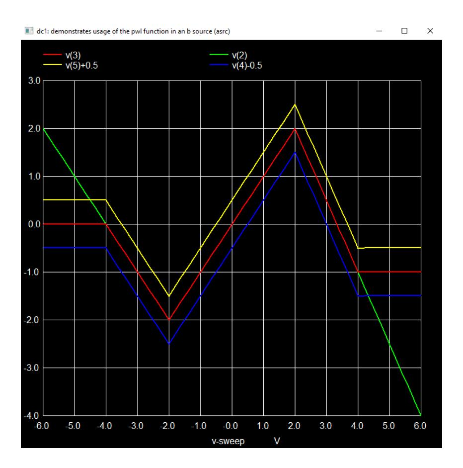

Figure 5.1: pwl (piece-wise linear) B source

Example: pwl function in B source

```
Demonstrates usage of the pwl function in an B source (ASRC)
* Also emulates the TABLE function with limits
.param x0=-4 y0=0
.param x1=-2 y1=2
.param x2=2 y2=-2
.param x3=4 y3=1
.param xx0=x0-1
.param xx3=x3+1
Vin ctrl 0 DC=0V
R1 ctrl 0 2
* no limits outside of the tabulated x values
* (continues linearily)
Btest2 2 0 I = pwl(v(ctrl),'x0','y0','x1','y1','x2','y2',
+ 'x3','y3')
* like TABLE function with limits:
Btest3 3 0 I = (v(ctrl) < 'x0') ? 'y0' : (v(ctrl) < 'x3')
+ ? pwl(v(1),'x0','y0','x1','y1','x2','y2','x3','y3') : 'y3'
* more efficient and elegant TABLE function with limits
*(voltage controlled):
Btest4 4 0 I = pwl(v(ctrl),
+ 'xx0','y0', 'x0','y0',
+ 'x1','y1',
+ 'x2','y2',
+ 'x3','y3', 'xx3','y3')
*
* more efficient and elegant TABLE function with limits
* (controlled by current):
Btest5 5 0 I = pwl(-2*i(Vin),
+ 'xx0','y0', 'x0','y0',
+ 'x1','y1',
+ 'x2','y2',
+ 'x3','y3', 'xx3','y3')
Rint2 2 0 1
Rint3 3 0 1
Rint4 4 0 1
Rint5 5 0 1
.control
dc Vin -6 6 0.2
plot v(2) v(3) v(4)-0.5 v(5)+0.5
.endc
.end
```

One characteristic to note: What happens when the controlling input (V(1) or −2 ∗ *i*(*Vin*)) is outside of the given limits, e.g. smaller than x0 or larger than x3 in the example given above? New y values outside of the given range will be determined by adding x,y pairs calculated by extending the slope of the output curve, e.g. with (*y*3−*y*2)/(*x*3−*x*2), as seen with v(2) from example Btest2. If you want to limit the function, keeping the last y value, e.g. y3, you have to add another point (x,y pair) with slightly extended x and y kept constant, e.g. *x*3+1,y3.

This gets important when we are for example using a behavioral resistor with pwl. In the example below, RR1 quickly moves towards (and beyond) 0, which is unphysical and leads the transient simulation to fail, because the current through RR1 is unbounded. RR2 with its limit given by the 15.1ms,1 couple avoids such malfunctioning.

Example: pwl function in behavioral resistor

```
* pwl for behavioral R, transient sim
VU1 3 0 DC 9
RR1 3 0 R = pwl(time, 0,1, 7m,1, 8m,1.19, 14m,1.19, 15m,1)
RR2 3 0 R = pwl(time, 0,1, 7m,1, 8m,1.19, 14m,1.19, 15m,1,
+ 15.1m,1)
.tran 100u 20m 0
.probe alli
.control
option noinit
run
display
set xbrushwidth=2
plot rr1#branch rr2#branch ylimit 7 17
.endc
.end
```

# <span id="page-111-0"></span>5.2 Exxxx: non-linear voltage source

## <span id="page-111-1"></span>5.2.1 VOL

General form:

```
EXXXXXXX n+ n- vol='expr'
```

Examples:

```
E41 4 0 vol = 'V(3)*V(3)-Offs'
```

Expression may be an equation or an expression containing node voltages or branch currents (in the form of i(vm)) and any other terms as given for the B source and described in Chapt. [5.1.](#page-104-1) It may contain parameters [\(2.11.1\)](#page-58-2) and the special variables time, temper, hertz [\(5.1.2\)](#page-108-0). ' or { } may be used to delimit the function.

## <span id="page-112-0"></span>5.2.2 VALUE

Optional syntax:

```
EXXXXXXX n+ n- value={expr}
```

Examples:

E41 4 0 value = 
$$\{V(3)*V(3)-0ffs\}$$

The '=' sign is optional.

## <span id="page-112-1"></span>5.2.3 TABLE

Data may be entered from the listings of a data table similar to the pwl B-Source [\(5.1.4\)](#page-108-2). Data are grouped into x, y pairs. Expression may be an equation or an expression containing node voltages or branch currents (in the form of i(vm)) and any other terms as given for the B source and described in Chapt. [5.1.](#page-104-1) It may contain parameters [\(2.11.1\)](#page-58-2). ' or { } may be used to delimit the function. Expression delivers the x-value, which is used to generate a corresponding y-value according to the tabulated value pairs, using linear interpolation. If the x-value is below x0 , y0 is returned, above x2 y2 is returned (limiting function). The value pairs have to be real numbers, parameters are *not* allowed.

Syntax for data entry from table:

```
Exxx n1 n2 TABLE {expression} = (x0, y0) (x1, y1) (x2, y2)
```

Example (simple comparator):

```
ECMP 11 0 TABLE {V(10,9)} = (-5mV, 0V) (5mV, 5V)
```

An '=' sign may follow the keyword TABLE.

An alternative syntax is available as well:

Alternative syntax for data entry from table:

```
Exxx n1 n2 nc1 nc2 TABLE = (x0, y0, x1, y1, x2, y2)
```

Example (nonlinear gain):

```
Egain out11 0 in1 in2 TABLE = (0, 0, 1, 1, 2, 4)
```

## <span id="page-113-0"></span>5.2.4 POLY

see E-Source at Chapt. [5.5.](#page-118-0)

## <span id="page-113-1"></span>5.2.5 LAPLACE

Currently ngspice does not offer a direct E-Source element with the LAPLACE option. There is however a XSPICE code model equivalent called s\_xfer (see Chapt. [8.2.18\)](#page-207-0), which you may invoke manually. The XSPICE option has to be enabled [\(28.1\)](#page-728-1). AC [\(11.3.1\)](#page-322-1) and transient analysis [\(11.3.10\)](#page-330-1) is supported.

The following E-Source:

```
ELOPASS 4 0 LAPLACE {V(1)}
+ {5 * (s/100 + 1) / (s^2/42000 + s/60 + 1)}
```

may be replaced by:

```
AELOPASS 1 int_4 filter1
.model filter1 s_xfer(gain=5
+ num_coeff=[{1/100} 1]
+ den_coeff=[{1/42000} {1/60} 1]
+ int_ic=[0 0])
ELOPASS 4 0 int_4 0 1
```

where you have the voltage of node 1 as input, an intermediate output node int\_4 and an Esource as buffer to keep the name 'ELOPASS' available if further processing is required.

If the controlling expression is more complex than just a voltage node, you may add a B-Source [\(5.1\)](#page-104-1) for evaluating the expression before entering the A-device.

E-Source with complex controlling expression:

```
ELOPASS 4 0 LAPLACE {V(1)*v(2)} {10 / (s/6800 + 1)}
```

may be replaced by:

```
BELOPASS int_1 0 V=V(1)*v(2)
AELOPASS int_1 int_4 filter1
.model filter1 s_xfer(gain=10
+ num_coeff=[1]
+ den_coeff=[{1/6800} 1]
+ int_ic=[0])
ELOPASS 4 0 int_4 0 1
```

## <span id="page-114-0"></span>5.2.6 FREQ

Currently ngspice does not offer a direct E-Source element with the FREQ option but it is implemented by a XSPICE code model equivalent called xfer (see [8.2.19\)](#page-210-0) that is automatically invoked by rewriting the netlist. The XSPICE option has to be enabled [\(28.1\)](#page-728-1) and only AC [\(11.3.1\)](#page-322-1) analysis is supported.

This E-Source:

```
EXFER 1 0 FREQ {V(20,21)}= DB
+(1.000000e+07Hz, 1.633257e-07, -1.859873e+01)
+(1.025641e+08Hz, -4.165672e+00, -4.076855e+02)
+(2.000000e+08Hz, -2.798303e-05, -7.519027e+02)
```

produces a complex voltage determined by multiplying an input differential voltage (v(20, 21)) by a complex-valued PWL function of the simulation frequency (transfer function). The DB keyword indicates that the second column is gain in db and the third is phase in degrees. Alternative keywords are MAG (linear gain), RAD (phase in radians), DEG (phase in degrees, already the default) or R\_I (real and imaginary parts).

## <span id="page-114-1"></span>5.2.7 AND/OR/NAND/NOR

This form of E-source provides simple behavioural implementations of basic logic gates with analog inputs and output. It is implemented by a XSPICE code model called multi\_input\_pwl (see [8.2.10\)](#page-195-0) that is automatically invoked by rewriting the netlist. The XSPICE option has to be enabled [\(28.1\)](#page-728-1).

This E-Source:

```
EAND out1 out0 and(2) in1 0 in2 0 (0.5, 0) (2.8, 3.3)
```

produces a differential output voltage determined by selecting the smallest of any number of differential input voltages, and applying a PWL output function. Here "and(2)" determines the logic function and number of PWL points: output is zero for minimum input voltage less than 0.5 and 3.3 for inputs greater than 2.8, with a linear ramp between. The other three functions are similar: "or" selects the maximum input and "nand/nor" reverse the order of PWL points. Only two points are supported.

An example circuit can be found at examples/digital/compare/adder\_esource.cir.

# <span id="page-115-0"></span>5.3 Gxxxx: non-linear current source

## <span id="page-115-1"></span>5.3.1 CUR

General form:

```
GXXXXXXX n+ n- cur='expr' <m=val>
```

Examples:

```
G51 55 225 cur = 'V(3)*V(3)-Offs'
```

Expression may be an equation or an expression containing node voltages or branch currents (in the form of i(vm)) and any other terms as given for the B source and described in Chapt. [5.1.](#page-104-1) It may contain parameters [\(2.11.1\)](#page-58-2) and special variables [\(5.1.2\)](#page-108-0). m is an optional multiplier to the output current. val may be a numerical value or an expression according to [2.11.5](#page-61-1) containing only references to other parameters (no node voltages or branch currents!), because it is evaluated before the simulation commences.

## <span id="page-115-2"></span>5.3.2 VALUE

Optional syntax:

```
GXXXXXXX n+ n- value='expr' <m=val>
```

Examples:

```
G51 55 225 value = 'V(3)*V(3)-Offs'
```

The '=' sign is optional.

## <span id="page-115-3"></span>5.3.3 TABLE

A data entry by a tabulated listing is available with syntax similar to the E-Source (see Chapt. [5.2.3\)](#page-112-1).

Syntax for data entry from table:

```
Gxxx n1 n2 TABLE {expression} =
+ (x0, y0) (x1, y1) (x2, y2) <m=val>
```

Example (simple comparator with current output and voltage control):

```
GCMP 0 11 TABLE {V(10,9)} = (-5MV, 0V) (5MV, 5V)
R 11 0 1k
```

m is an optional multiplier to the output current. val may be a numerical value or an expression according to [2.11.5](#page-61-1) containing only references to other parameters (no node voltages or branch currents!), because it is evaluated before the simulation commences. An '=' sign may follow the keyword TABLE.

## <span id="page-116-0"></span>5.3.4 POLY

see E-Source at Chapt. [5.5.](#page-118-0)

## <span id="page-116-1"></span>5.3.5 LAPLACE

See E-Source, Chapt. [5.2.5](#page-113-1) , for an equivalent code model replacement.

## <span id="page-116-2"></span>5.3.6 FREQ

See E-Source, Chapt[.5.2.6](#page-114-0) , for an equivalent code model replacement.

## <span id="page-116-3"></span>5.3.7 Example

An example file is given below.

Example input file:

```
VCCS, VCVS, non-linear dependency
.param Vi=1
.param Offs='0.01*Vi'
* VCCS depending on V(3)
B21 int1 0 V = V(3)*V(3)
G1 21 22 int1 0 1
* measure current through VCCS
vm 22 0 dc 0
R21 21 0 1
* new VCCS depending on V(3)
G51 55 225 cur = 'V(3)*V(3)-Offs'
* measure current through VCCS
vm5 225 0 dc 0
R51 55 0 1
* VCVS depending on V(3)
B31 int2 0 V = V(3)*V(3)
E1 1 0 int2 0 1
R1 1 0 1
* new VCVS depending on V(3)
E41 4 0 vol = 'V(3)*V(3)-Offs'
R4 4 0 1
* control voltage
V1 3 0 PWL(0 0 100u {Vi})
.control
unset askquit
tran 10n 100u uic
plot i(E1) i(E41)
plot i(vm) i(vm5)
.endc
.end
```

# <span id="page-117-0"></span>5.4 Debugging a behavioral source

The B, E, G, sources and the behavioral R, C, L elements are powerful tools to set up user defined models. Unfortunately debugging these models is not very comfortable.

5.5. POLY SOURCES 119

Example input file with bug (log(-2)):

```
B source debugging
V1 1 0 1
V2 2 0 -2
E41 4 0 vol = 'V(1)*log(V(2))'
.control
tran 1 1
.endc
.end
```

The input file given above results in an error message:

```
Error: -2 out of range for log
```

In this trivial example, the reason and location for the bug is obvious. However, if you have several equations using behavioral sources, and several occurrences of the log function, then debugging is nearly impossible.

However, if the variable ngdebug (see [13.7\)](#page-451-2) is set (e.g. in file .spiceinit), a more distinctive error message is issued that (after some closer investigation) will reveal the location and value of the buggy parameter.

Detailed error message for input file with bug (log(-2)):

```
Error: -2 out of range for log
calling PTeval, tree =
        (v0) * (log (v1))
d / d v0 : log (v1)
d / d v1 : (v0) * ((0.434294) / (v1))
values: var0 = 1
          var1 = -2
```

If variable strict\_errorhandling (see [13.7\)](#page-451-2) is set, ngspice exits after this message. If not, gmin and source stepping may be started, typically without success.

# <span id="page-118-0"></span>5.5 POLY Sources

Polynomial sources are only available when the XSPICE option (see Chapt. [28\)](#page-728-0) is not disabled.

## <span id="page-119-0"></span>5.5.1 E voltage source, G current source

General form:

```
EXXXX N+ N- POLY(ND) NC1+ NC1- (NC2+ NC2-...) P0 (P1...)
```

Example:

```
ENONLIN 100 101 POLY(2) 3 0 4 0 0.0 13.6 0.2 0.005
```

POLY(ND) Specifies the number of dimensions of the polynomial. The number of pairs of controlling nodes must be equal to the number of dimensions.

(N+) and (N-) nodes are output nodes. Positive current flows from the (+) node through the source to the (-) node.

The <NC1+> and <NC1-> are in pairs and define a set of controlling voltages. A particular node can appear more than once, and the output and controlling nodes need not be different.

The example yields a voltage output controlled by two input voltages v(3,0) and v(4,0). Four polynomial coefficients are given. The equivalent function to generate the output is:

```
0 + 13.6 * v(3) + 0.2 * v(4) + 0.005 * v(3) * v(3)
```

Generally you will set the equation according to

```
POLY(1) y = p0 + p1*X1 + p2*X1*X1 + p3*X1*X1*X1 + ...
POLY(2) y = p0 + p1*X1 + p2*X2 +
             + p3*X1*X1 + p4*X2*X1 + p5*X2*X2 +
             + p6*X1*X1*X1 + p7*X2*X1*X1 + p8*X2*X2*X1 +
             + p9*X2*X2*X2 + ...
POLY(3) y = p0 + p1*X1 + p2*X2 + p3*X3 +
             + p4*X1*X1 + p5*X2*X1 + p6*X3*X1 +
             + p7*X2*X2 + p8*X2*X3 + p9*X3*X3 + ...
```

where X1 is the voltage difference of the first input node pair, X2 of the second pair and so on. Keeping track of all polynomial coefficient is rather tedious for large polynomials.

## <span id="page-119-1"></span>5.5.2 F voltage source, H current source

General form:

```
FXXXX N+ N- POLY(ND) V1 (V2 V3 ...) P0 (P1...)
```

Example:

```
FNONLIN 100 101 POLY(2) VDD Vxx 0 0.0 13.6 0.2 0.005
```

5.5. POLY SOURCES 121

POLY(ND) Specifies the number of dimensions of the polynomial. The number of controlling sources must be equal to the number of dimensions.

(N+) and (N-) nodes are output nodes. Positive current flows from the (+) node through the source to the (-) node.

V1 (V2 V3 ...) are the controlling voltage sources. Control variable is the current through these sources.

P0 (P1...) are the coefficients, as have been described in [5.5.1.](#page-119-0)

# <span id="page-122-2"></span><span id="page-122-0"></span>Chapter 6

# Transmission Lines

Ngspice implements both the original SPICE3f5 transmission lines models and the one introduced with KSPICE. The latter provide an improved transient analysis of lossy transmission lines. Unlike SPICE models that use the state-based approach to simulate lossy transmission lines, KSPICE simulates lossy transmission lines and coupled multiconductor line systems using the recursive convolution method. The impulse response of an arbitrary transfer function can be determined by deriving a recursive convolution from the Pade approximations of the function. We use this approach for simulating each transmission line's characteristics and each multiconductor line's modal functions. This method of lossy transmission line simulation has been proved to give a speedup of one to two orders of magnitude over SPICE3f5.

# <span id="page-122-1"></span>6.1 Lossless Transmission Lines

General form:

```
TXXXXXXX N1 N2 N3 N4 Z0=VALUE <TD=VALUE>
+ <F=FREQ <NL=NRMLEN>> <IC=V1, I1, V2, I2>
```

Examples:

```
T1 1 0 2 0 Z0=50 TD=10NS
```

**n1** and **n2** are the nodes at port 1; **n3** and **n4** are the nodes at port 2. **z0** is the characteristic impedance. The length of the line may be expressed in either of two forms. The transmission delay, **td**, may be specified directly (as td=10ns, for example). Alternatively, a frequency **f** may be given, together with **nl**, the normalized electrical length of the transmission line with respect to the wavelength in the line at the frequency **f**. The transmission delay then is calculated as *t<sup>d</sup>* = *nl*/ *f*.If a frequency is specified but **nl** is omitted, 0.25 is assumed (that is, the frequency is assumed to be the quarter-wave frequency). Note that although both forms for expressing the line length are indicated as optional, one of the two must be specified.

No .model line is required for this element.

Note that this element models only one propagating mode. If all four nodes are distinct in the actual circuit, then two modes may be excited. To simulate such a situation, two transmission-line elements are required. (see the example in Chapt. [17.7](#page-538-0) for further clarification.) The (optional) initial condition specification consists of the voltage and current at each of the transmission line ports. Note that the initial conditions (if any) apply *only* if the **UIC** option is specified on the .TRAN control line.

Note that a lossy transmission line (see below) with zero loss may be more accurate than the lossless transmission line due to implementation details.

# <span id="page-123-0"></span>6.2 Lossy Transmission Lines

General form:

```
OXXXXXXX n1 n2 n3 n4 mname
```

Examples:

```
O23 1 0 2 0 LOSSYMOD
.model LOSSYMOD ltra rel=1 r=12.45 g=0 l=8.972e-9 c=0.468e-12
+len=16 steplimit compactrel=1.0e-3 compactabs=1.0e-14
OCONNECT 10 5 20 5 INTERCONNECT
```

This is a two-port convolution model for single conductor lossy transmission lines. **n1** and **n2** are the nodes at port 1; **n3** and **n4** are the nodes at port 2. Note that a lossy transmission line with zero loss may be more accurate than the lossless transmission line due to implementation details.

## <span id="page-123-1"></span>6.2.1 Lossy Transmission Line Model (LTRA)

The uniform RLC/RC/LC/RG transmission line model (referred to as the LTRA model henceforth) models a uniform constant-parameter distributed transmission line. The RC and LC cases may also be modeled using the URC and TRA models; however, the newer LTRA model is usually faster and more accurate than the others. The operation of the LTRA model is based on the convolution of the transmission line's impulse responses with its inputs (see [8]). The LTRA model takes a number of parameters, some of which must be given and some of which are optional.

| Name         | Parameter                     | Units/Type     | Default    | Example  |
|--------------|-------------------------------|----------------|------------|----------|
| R            | resistance/length             | Ω/unit         | 0.0        | 0.2      |
| L            | inductance/length             | H/unit         | 0.0        | 9.13e-9  |
| G            | conductance/length            | mhos/unit      | 0.0        | 0.0      |
| C            | capacitance/length            | F/unit         | 0.0        | 3.65e-12 |
| LEN          | length of line                | unit           | no default | 1.0      |
| REL          | breakpoint control            | arbitrary unit | 1          | 0.5      |
| ABS          | breakpoint control            |                | 1          | 5        |
| NOSTEPLIMIT  | don't limit time-step to less | flag           | not set    | set      |
|              | than line delay               |                |            |          |
| NO CONTROL   | don't do complex time-step    | flag           | not set    | set      |
|              | control                       |                |            |          |
| LININTERP    | use linear interpolation      | flag           | not set    | set      |
| MIXEDINTERP  | use linear when quadratic     | flag           | not set    | set      |
|              | seems bad                     |                |            |          |
| COMPACTREL   | special reltol for history    |                | RELTOL     | 1.0e-3   |
|              | compaction                    |                |            |          |
| COMPACTABS   | special abstol for history    |                | ABSTOL     | 1.0e-9   |
| compaction   |                               |                |            |          |
| TRUNCNR      | use Newton-Raphson method     | flag           | not set    | set      |
|              | for time-step control         |                |            |          |
| TRUNCDONTCUT | don't limit time-step to keep | flag           | not set    | set      |
|              | impulse-response errors low   |                |            |          |

The following types of lines have been implemented so far:

- RLC (uniform transmission line with series loss only),
- RC (uniform RC line),
- LC (lossless transmission line),
- RG (distributed series resistance and parallel conductance only).

Any other combination will yield erroneous results and should not be tried. The length **LEN** of the line must be specified. **NOSTEPLIMIT** is a flag that will remove the default restriction of limiting time-steps to less than the line delay in the RLC case. **NO CONTROL** is a flag that prevents the default limiting of the time-step based on convolution error criteria in the RLC and RC cases. This speeds up simulation but may in some cases reduce the accuracy of results. **LININTERP** is a flag that, when specified, will use linear interpolation instead of the default quadratic interpolation for calculating delayed signals. **MIXEDINTERP** is a flag that, when specified, uses a metric for judging whether quadratic interpolation is not applicable and if so uses linear interpolation; otherwise it uses the default quadratic interpolation. **TRUNCDONTCUT** is a flag that removes the default cutting of the time-step to limit errors in the actual calculation of impulse-response related quantities. **COMPACTREL** and **COMPACTABS** are quantities that control the compaction of the past history of values stored for convolution. Larger values of these lower accuracy but usually increase simulation speed. These are to be used with the **TRYTOCOMPACT** option, described in the .**OPTIONS** section. **TRUNCNR** is a flag that turns on the use of Newton-Raphson iterations to determine an appropriate time-step in the time-step control routines. The default is a trial and error procedure by cutting the previous time-step in half. **REL** and **ABS** are quantities that control the setting of breakpoints.

The option most worth experimenting with for increasing the speed of simulation is **REL**. The default value of 1 is usually safe from the point of view of accuracy but occasionally increases computation time. A value greater than 2 eliminates all breakpoints and may be worth trying depending on the nature of the rest of the circuit, keeping in mind that it might not be safe from the viewpoint of accuracy.

Breakpoints may usually be entirely eliminated if it is expected the circuit will not display sharp discontinuities. Values between 0 and 1 are usually not required but may be used for setting many breakpoints.

**COMPACTREL** may also be experimented with when the option **TRYTOCOMPACT** is specified in a .OPTIONS card. The legal range is between 0 and 1. Larger values usually decrease the accuracy of the simulation but in some cases improve speed. If **TRYTOCOMPACT** is not specified on a .OPTIONS card, history compaction is not attempted and accuracy is high.

**NO CONTROL**, **TRUNCDONTCUT** and **NOSTEPLIMIT** also tend to increase speed at the expense of accuracy.

# <span id="page-125-0"></span>6.3 Uniform Distributed RC Lines

General form:

```
UXXXXXXX n1 n2 n3 mname l=len <n=lumps>
```

Examples:

```
U1 1 2 0 URCMOD L=50U
.model URCMOD URC CPERL=100p RPERL=100k FMAX=10G
URC2 1 12 2 UMODL l=1MIL N=6
```

**n1** and **n2** are the two element nodes the RC line connects, while **n3** is the node the capacitances are connected to. **mname** is the model name, **len** is the length of the RC line in meters. **lumps**, if specified, is the number of lumped segments to use in modeling the RC line (see the model description for the action taken if this parameter is omitted).

## <span id="page-125-1"></span>6.3.1 Uniform Distributed RC Model (URC)

The URC model is derived from a model proposed by L. Gertzberg in 1974. The model is accomplished by a subcircuit type expansion of the URC line into a network of lumped RC segments with internally generated nodes. The RC segments are in a geometric progression, increasing toward the middle of the URC line, with *K* as a proportionality constant. The number of lumped segments used, if not specified for the URC line device, is determined by the following formula:

$$N = \frac{\log \left| F_{\text{max}} \frac{R}{L} \frac{C}{L} 2\pi L^2 \left| \frac{(K-1)}{K} \right|^2 \right|}{\log K}$$
(6.1)

The URC line is made up strictly of resistor and capacitor segments unless the **ISPERL** parameter is given a nonzero value, in which case the capacitors are replaced with reverse biased diodes with a zero-bias junction capacitance equivalent to the capacitance replaced, and with a saturation current of **ISPERL** amps per meter of transmission line and an optional series resistance equivalent to **RSPERL** ohms per meter.

| Name   | Parameter                          | Units      | Default | Example | Area |
|--------|------------------------------------|------------|---------|---------|------|
| K      | Propagation Constant               | -          | 1.5     | 1.2     | -    |
| FMAX   | Maximum Frequency of interest      | Hz         | 1.0 G   | 6.5 Meg | -    |
| RPERL  | Resistance per unit length         | $\Omega/m$ | 1000    | 10      | -    |
| CPERL  | Capacitance per unit length        | F/m        | 10e-15  | 1 p     | -    |
| ISPERL | Saturation Current per unit length | A/m        | 0       | -       | -    |
| RSPERL | Resistance per unit length         | $\Omega/m$ | 0       | -       | -    |

## <span id="page-126-0"></span>6.4 KSPICE Lossy Transmission Lines

Unlike SPICE3, which uses the state-based approach to simulate lossy transmission lines, KSPICE simulates lossy transmission lines and coupled multiconductor line systems using the recursive convolution method. The impulse response of an arbitrary transfer function can be determined by deriving a recursive convolution from the Pade approximations of the function. ngspice is using this approach for simulating each transmission line's characteristics and each multiconductor line's modal functions. This method of lossy transmission line simulation has shown to give a sigificant speedup. Please note that the following two models will support only **transient simulation**, no ac.

Additional Documentation Available:

- S. Lin and E. S. Kuh, 'Pade Approximation Applied to Transient Simulation of Lossy Coupled Transmission Lines,' Proc. IEEE Multi-Chip Module Conference, 1992, pp. 52-55.
- S. Lin, M. Marek-Sadowska, and E. S. Kuh, 'SWEC: A StepWise Equivalent Conductance Timing Simulator for CMOS VLSI Circuits,' European Design Automation Conf., February 1991, pp. 142-148.
- S. Lin and E. S. Kuh, 'Transient Simulation of Lossy Interconnect,' Proc. Design Automation Conference, Anaheim, CA, June 1992, pp. 81-86.

## <span id="page-127-0"></span>6.4.1 Single Lossy Transmission Line (TXL)

General form:

YXXXXXXX N1 0 N2 0 mname <LEN=LENGTH>

Example:

```
Y1 1 0 2 0 ymod LEN=2
.MODEL ymod txl R=12.45 L=8.972e-9 G=0 C=0.468e-12 length=16
```

**n1** and **n2** are the nodes of the two ports. The optional instance parameter **len** is the length of the line and may be expressed in multiples of [*unit*]. Typically *unit* is given in meters. **len** will override the model parameter **length** for the specific instance only.

The TXL model takes a number of parameters:

| Name   | Parameter          | Units/Type | Default    | Example  |
|--------|--------------------|------------|------------|----------|
| R      | resistance/length  | Ω/unit     | 0.0        | 0.2      |
| L      | inductance/length  | H/unit     | 0.0        | 9.13e-9  |
| G      | conductance/length | mhos/unit  | 0.0        | 0.0      |
| C      | capacitance/length | F/unit     | 0.0        | 3.65e-12 |
| LENGTH | length of line     | unit       | no default | 1.0      |

Model parameter **length** must be specified as a multiple of *unit*. Typically *unit* is given in [m]. For transient simulation only.

## <span id="page-127-1"></span>6.4.2 Coupled Multiconductor Line (CPL)

The CPL multiconductor line model is in theory similar to the RLGC model, but without frequency dependent loss (neither skin effect nor frequency-dependent dielectric loss). Up to 8 coupled lines are supported in ngspice.

General form:

```
PXXXXXXX NI1 NI2...NIX GND1 NO1 NO2...NOX GND2 mname <LEN=LENGTH>
```

#### Example:

```
P1 in1 in2 0 b1 b2 0 PLINE
.model PLINE CPL length={Len}
+R=1 0 1
+L={L11} {L12} {L22}
+G=0 0 0
+C={C11} {C12} {C22}
.param Len=1 Rs=0
+ C11=9.143579E-11 C12=-9.78265E-12 C22=9.143578E-11
+ L11=3.83572E-7 L12=8.26253E-8 L22=3.83572E-7
```

**ni1** ... **nix** are the nodes at port 1 with gnd1; **no1** ... **nox** are the nodes at port 2 with gnd2. The optional instance parameter **len** is the length of the line and may be expressed in multiples of [*unit*]. Typically *unit* is given in meters. **len** will override the model parameter **length** for the specific instance only.

The CPL model takes a number of parameters:

| Name   | Parameter          | Units/Type | Default    | Example  |
|--------|--------------------|------------|------------|----------|
| R      | resistance/length  | Ω/unit     | 0.0        | 0.2      |
| L      | inductance/length  | H/unit     | 0.0        | 9.13e-9  |
| G      | conductance/length | mhos/unit  | 0.0        | 0.0      |
| C      | capacitance/length | F/unit     | 0.0        | 3.65e-12 |
| LENGTH | length of line     | unit       | no default | 1.0      |

All RLGC parameters are given in Maxwell matrix form. For the R and G matrices the diagonal elements must be specified, for L and C matrices the lower or upper triangular elements must specified. The parameter LENGTH is a scalar and is mandatory. For transient simulation only.

# <span id="page-130-2"></span><span id="page-130-0"></span>Chapter 7

# Device Models

# <span id="page-130-1"></span>7.1 Instance lines and .model lines

Adding a device to the ngspice netlist as described in this chapter will require two lines: the instance line and a .model line.

Instance line:

QXXXXXXX node1 node2 node3 modelname <instpar1=val> <instpar2=val> <off>

.model line:

.model modelname modeltype mpar1=val mpar2=val ...

The first letter of the instance line (e.g. Q for bipolar) will select the device (see [2.2\)](#page-51-0), QXXXXXXX denotes a unique name. Next there are the device nodes. modelname is a user-given reference to a specific .model line. Instance parameters (specific to the device, often optional) may follow.

The .model line adds a set of model parameters. After the .model token the modelname sets the link to the devices calling this model parameter set. modeltype links the parameter set to a specific model type, e.g. NPN or PNP for bipolar transistors (see [2.3](#page-54-1) for model types available in ngspice). Model parameters may follow.Their number may differ. If no parameters is given, default parameters hardcoded into ngspice are selected. Complex device models may require several hundred parameters. level and version parameters allow to access sub-categories of a specific device model.

Example (integrated NMOS transistor, BSIM3):

M1 dnode1 gnode1 snode1 bnode1 mosnb3 L=0.35u W=2u .model mosnb3 NMOS level=8 version=3.3.0 tox=6.5n nch=2.4e17 nsub=5e16 vth0=0.3

# <span id="page-131-2"></span><span id="page-131-0"></span>7.2 Junction Diodes

General form:

```
DXXXXXXX n+ n- mname <area=val> <m=val> <pj=val> <off>
+ <ic=vd> <temp=val> <dtemp=val>
+ <lm=val> <wm=val> <lp=val> <wp=val>
```

Examples:

```
DBRIDGE 2 10 DIODE1
DCLMP aa cc DMOD AREA=3.0 IC=0.2
```

The pn junction (diode) implemented in ngspice expands the one found in SPICE3f5. Perimeter effects and high injection level have been introduced into the original model and temperature dependence of some parameters has been added. **n+** and **n-** are the positive (anode) and negative (cathode) nodes, respectively. **mname** is the model name. Instance parameters may follow, dedicated to only the diode described on the respective line. **area** is the area scale factor, which may scale the saturation current given by the model parameters (and others, see table below). **pj (perim)** is the perimeter scale factor, scaling the sidewall saturation current and its associated capacitance. **m** is a multiplier of area and perimeter, and **off** indicates an (optional) starting condition on the device for dc analysis. If the area factor is omitted, a value of 1.0 is assumed. The (optional) initial condition specification using **ic** is intended for use with the **uic** option on the .tran control line, when a transient analysis is desired starting from other than the quiescent operating point. You should supply the initial voltage across the diode there. The (optional) **temp** value is the temperature at which this device is to operate, and overrides the temperature specification on the .option control line. The temperature of each instance can be specified as an offset to the circuit temperature with the **dtemp** option.

To fulfill requirements of modern process design kits (PDK) the basic spice3 model was extended with the capability of modeling parasitic effects like sidewall junction currents and capacitances, tunnel currents and metal and polysilicon overlap capacitances. Latter effect can be activated by **LEVEL=3** model parameter or by setting element parameters **lm**, **wm**, **lp** and **wp**. If both are given, element parameters have priority.

With the (new in ngspice-39) OpenVAF/OSDI approach (see [9\)](#page-302-0), all modern diode models, written in Verilog-A, become available, like JUNCAP etc..

## <span id="page-131-1"></span>7.2.1 Diode Model (D)

Diode models may be described in the netlist input file (or an file included by .inc) according to the following example:

General form: .model mname type(pname1=pval1 pname2=pval2 ... ) Examples: .model DIODE1 D (bv=50 is=1e-13 n=1.05) with a user defined model name mname, and the model type D. A basic model statement using only the internal default model parameters is Basic model statement: .model DMOD D

The dc characteristics of the diode are determined by the parameters **IS** and **N**. An ohmic resistance, **RS**, is included. Charge storage effects are modeled by a transit time, **TT**, and a nonlinear depletion layer capacitance that is determined by the parameters **CJO**, **VJ**, and **M**. The temperature dependence of the saturation current is defined by the parameters **EG**, the energy, and **XTI**, the saturation current temperature exponent. The nominal temperature where these parameters were measured is **TNOM**, which defaults to the circuit-wide value specified on the .options control line. Reverse breakdown is modeled by an exponential increase in the reverse diode current and is determined by the parameters **BV** and **IBV** (both of which are positive numbers).

#### Junction DC parameters

| Name            | Parameter                     | Units | Default | Example | Scale factor |
|-----------------|-------------------------------|-------|---------|---------|--------------|
| IS (JS)         | Saturation current            | A     | 1.0e-14 | 1.0e-16 | area         |
| JSW (ISW)       | Sidewall saturation current   | A     | 0.0     | 1.0e-15 | perimeter    |
| N               | Emission coefficient          | -     | 1       | 1.5     |              |
| RS              | Series resistance             | Ω     | 0.0     | 100     | 1/area       |
| RSW             | Series resistance sidewall    | Ω     | 0.0     | 100     | 1/perim      |
| BV (VB,VRB,VAR) | Reverse breakdown voltage     | V     | ∞       | 40      |              |
| IBV (IB)        | Current at breakdown voltage  | A     | 1.0e-3  | 1.0e-4  |              |
| NBV (NZ)        | Breakdown Emission            | -     | N       | 1.2     |              |
|                 | Coefficient                   |       |         |         |              |
| IKF (IK)        | Forward knee current          | A     | 0.0     | 1.0e-3  |              |
| IKR             | Reverse knee current          | A     | 0.0     | 1.0e-3  |              |
| IKP             | Forward knee current          | A     | 0.0     | 1.0e-3  |              |
|                 | sidewall                      |       |         |         |              |
| JTUN            | Tunneling saturation current  | A     | 0.0     |         | area         |
| JTUNSW          | Tunneling sidewall saturation | A     | 0.0     |         | perimeter    |
|                 | current                       |       |         |         |              |
| NTUN            | Tunneling emission            | -     | 30      |         |              |
|                 | coefficient                   |       |         |         |              |
| XTITUN          | Tunneling saturation current  | -     | 3       |         |              |
|                 | exponential                   |       |         |         |              |
| KEG             | EG correction factor for      | -     | 1.0     |         |              |
|                 | tunneling                     |       |         |         |              |
| ISR             | Recombination saturation      | A     | 1e-14   | 1pA     | area         |
|                 | current                       |       |         |         |              |
| NR              | Recombination current         | -     | 2       | 1.5     |              |
|                 | emission coefficient          |       |         |         |              |

#### Junction capacitance parameters

| Name       | Parameter                    | Units | Default | Example | Scale factor |
|------------|------------------------------|-------|---------|---------|--------------|
| CJO (CJ0)  | Zero-bias junction           | F     | 0.0     | 2pF     | area         |
|            | bottom-wall capacitance      |       |         |         |              |
| CJP (CJSW) | Zero-bias junction sidewall  | F     | 0.0     | .1pF    | perimeter    |
|            | capacitance                  |       |         |         |              |
| FC         | Coefficient for forward-bias | -     | 0.5     | -       |              |
|            | depletion bottom-wall        |       |         |         |              |
|            | capacitance formula          |       |         |         |              |
| FCS        | Coefficient for forward-bias | -     | 0.5     | -       |              |
|            | depletion sidewall           |       |         |         |              |
|            | capacitance formula          |       |         |         |              |
| M (MJ)     | Area junction grading        | -     | 0.5     | 0.5     |              |
|            | coefficient                  |       |         |         |              |
| MJSW       | Periphery junction grading   | -     | 0.33    | 0.5     |              |
|            | coefficient                  |       |         |         |              |
| VJ (PB)    | Junction potential           | V     | 1       | 0.6     |              |
| PHP        | Periphery junction potential | V     | 1       | 0.6     |              |
| TT         | Transit-time                 | sec   | 0       | 0.1ns   |              |
| VP         | Soft reverse recovery        | -     | 0       | 0.1     |              |
|            | parameter                    |       |         |         |              |

#### Metal and Polysilicon Overlap Capacitances (level=3)

| Name | Parameter                                     | Units | Default | Example | Scale factor |
|------|-----------------------------------------------|-------|---------|---------|--------------|
| LM   | Length of metal capacitor                     | m     | 0.0     | 4um     | SCALE        |
| LP   | Length of polysilicon<br>capacitor            | m     | 0.0     | 5um     | SCALE        |
| WM   | Width of metal capacitor                      | m     | 0.0     | 2um     | SCALE        |
| WP   | Width of polysilicon<br>capacitor             | m     | 0.0     | 4um     | SCALE        |
| XOM  | Thickness of the metal to<br>bulk oxide       | Å     | 10k     | -       |              |
| XOI  | Thickness of the polysilicon<br>to bulk oxide | Å     | 10k     | -       |              |
| XM   | Masking and etching effects<br>in metal       | m     | 0.0     | -       |              |
| XP   | Masking and etching effects<br>in polysilicon | m     | 0.0     | -       |              |
| XW   | Masking and etching effects                   | m     | 0.0     | -       |              |

#### Temperature effects

| Name        | Parameter                                        | Units         | Default | Example                                 |
|-------------|--------------------------------------------------|---------------|---------|-----------------------------------------|
| EG          | Activation energy                                | eV            | 1.11    | 1.11<br>Si<br>0.69<br>Sbd<br>0.67<br>Ge |
| GAP1        | First bandgap correction<br>factor (TLEV=2)      | eV            | 7.02e-4 |                                         |
| GAP2        | Secnd bandgap correction<br>factor (TLEV=2)      | -             | 1108    |                                         |
| TNOM (TREF) | Parameter measurement<br>temperature             | ◦C            | 27      | 50                                      |
| TRS1 (TRS)  | 1st order tempco for RS                          | 1/<br>◦C      | 0.0     | -                                       |
| TRS2        | 2nd order tempco for RS                          | 1/<br>◦C<br>2 | 0.0     | -                                       |
| TM1         | 1st order tempco for MJ                          | 1/<br>◦C      | 0.0     | -                                       |
| TM2         | 2nd order tempco for MJ                          | 1/<br>◦C<br>2 | 0.0     | -                                       |
| TTT1        | 1st order tempco for TT                          | 1/<br>◦C      | 0.0     | -                                       |
| TTT2        | 2nd order tempco for TT                          | 1/<br>◦C<br>2 | 0.0     | -                                       |
| XTI         | Saturation current<br>temperature exponent       | -             | 3.0     | 3.0<br>pn<br>2.0<br>Sbd                 |
| TLEV        | Diode temperature equation<br>selector (0,1,2)   | -             | 0       |                                         |
| TLEVC       | Diode capac. temperature<br>equation selector    | -             | 0       |                                         |
| CTA (CTC)   | Area junct. cap. temperature<br>coefficient      | 1/<br>◦C      | 0.0     | -                                       |
| CTP         | Perimeter junct. cap.<br>temperature coefficient | 1/<br>◦C      | 0.0     | -                                       |
| TCV (TBV1)  | Breakdown voltage<br>temperature coefficient     | 1/<br>◦C      | 0.0     | -                                       |

#### Noise modeling

| Name | Parameter                 | Units | Default | Example | Scale factor |
|------|---------------------------|-------|---------|---------|--------------|
| KF   | Flicker noise coefficient | -     | 0       |         |              |
| AF   | Flicker noise exponent    | -     | 1       |         |              |

## <span id="page-135-0"></span>7.2.2 Diode Equations

The junction diode is the basic semiconductor device and the simplest one in ngspice, but its model is quite complex, even when not all the physical phenomena affecting a pn junction are handled. The diode is modeled in three different regions:

• *Forward bias*: the anode is more positive than the cathode, the diode is 'on' and can conduct large currents. To avoid convergence problems and unrealistic high current, it is prudent to specify a series resistance to limit current with the **RS** model parameter.

137

- *Reverse bias*: the cathode is more positive than the anode and the diode is 'off'. A reverse bias diode conducts a small leakage current.
- *Breakdown*: the breakdown region is modeled only if the **BV** model parameter is given. When a diode enters breakdown the current increases exponentially (remember to limit it); **BV** is a positive value.

#### **Parameters Scaling**

Model parameters are scaled using the unit-less parameters **area** and pj and the multiplier m as depicted below:

$$AREA_{eff} = AREAm$$
 $PJ_{eff} = PJm$ 
 $IS_{eff} = ISAREA_{eff} + JSWPJ_{eff}$ 
 $IBV_{eff} = IBVAREA_{eff}$ 
 $IK_{eff} = IKAREA_{eff}$ 
 $IKR_{eff} = IKRAREA_{eff}$ 
 $CJ_{eff} = CJOAREA_{eff}$ 
 $CJP_{eff} = CJPPJ_{eff}$ 

#### Diode DC, Transient and AC model equations

The diode model has certain dc currents for bottom and sidewall components. Exemplary here is the equation for the bottom part:

$$I_{D} = \begin{cases} IS_{eff}(e^{\frac{qV_{D}}{NkT}} - 1) + V_{D} \cdot GMIN, & \text{if } V_{D} \ge -3\frac{NkT}{q} \\ -IS_{eff}[1 + (\frac{3NkT}{qV_{De}})^{3}] + V_{D} \cdot GMIN, & \text{if } -BV_{eff} < V_{D} < -3\frac{NkT}{q} \\ -IS_{eff}(e^{\frac{-q(BV_{eff} + V_{D})}{NkT}}) + V_{D} \cdot GMIN, & \text{if } V_{D} \le -BV_{eff} \end{cases}$$
(7.1)

Two secondary effects are modeled if the appropriate parameters (see table Junction DC parameters) are given: Recombination current and bottom and sidewall tunnel current.

The breakdown region must be described with more depth since the breakdown is not modeled physically. As written before, the breakdown modeling is based on two model parameters: the 'nominal breakdown voltage' **BV** and the current at the onset of breakdown **IBV**. For the diode model to be consistent, the current value cannot be arbitrarily chosen, since the reverse bias and breakdown regions must match. When the diode enters breakdown region from reverse bias, the current is calculated using the formula<sup>1</sup>:

$$I_{bdwn} = -IS_{eff}(e^{\frac{-qBV}{NkT}} - 1)$$
(7.2)

The computed current is necessary to adjust the breakdown voltage making the two regions match. The algorithm is a little bit convoluted and only a brief description is given here:

<span id="page-136-0"></span><sup>&</sup>lt;sup>1</sup>if you look at the source code in file diotemp.c you will discover that the exponential relation is replaced with a first order Taylor series expansion.

#### Algorithm 7.1 Diode breakdown current calculation

```
\begin{array}{l} \text{if } IBV_{eff} < I_{bdwn} \text{ then} \\ IBV_{eff} = I_{bdwn} \\ BV_{eff} = \text{BV} \\ \text{else} \\ BV_{eff} = \text{BV} - \text{N}V_t \ln(\frac{IBV_{eff}}{I_{bdwn}}) \end{array}
```

Most real diodes shows a current increase that, at high current levels, does not follow the exponential relationship given above. This behavior is due to high level of carriers injected into the junction. High injection effects (as they are called) are modeled with **IK** and **IKR**.

$$I_{Deff} = \begin{cases} \frac{I_D}{1 + \sqrt{\frac{I_D}{IK_{eff}}}}, & \text{if } V_D \ge -3\frac{NkT}{q} \\ \frac{I_D}{1 + \sqrt{\frac{I_D}{IKR_{eff}}}}, & \text{otherwise.} \end{cases}$$
(7.3)

Diode capacitance is divided into two different terms:

- Depletion capacitance
- Diffusion capacitance

Depletion capacitance is composed by two different contributes, one associated to the bottom of the junction (bottom-wall depletion capacitance) and the other to the periphery (sidewall depletion capacitance). The basic equations are

$$C_{Diode} = C_{diffusion} + C_{depletion}$$

Where the depletion capacitance is defined as:

$$C_{depletion} = C_{depl_{bw}} + C_{depl_{sw}}$$

The diffusion capacitance, due to the injected minority carriers, is modeled with the transit time **TT**:

$$C_{diffusion} = \text{TT} \frac{\partial I_{Deff}}{\partial V_D}$$

The depletion capacitance is more complex to model, since the function used to approximate it diverges when the diode voltage become greater than the junction built-in potential. To avoid function divergence, the capacitance function is approximated with a linear extrapolation for applied voltage greater than a fraction of the junction built-in potential.

$$C_{depl_{bw}} = \begin{cases} CJ_{eff} (1 - \frac{V_D}{VJ})^{-MJ}, & \text{if } V_D < FC \cdot VJ \\ CJ_{eff} \frac{1 - FC(1 + MJ) + MJ \frac{V_D}{VJ}}{(1 - FC)^{(1 + MJ)}}, & \text{otherwise.} \end{cases}$$
(7.4)

139

$$C_{depl_{sw}} = \begin{cases} CJP_{eff} (1 - \frac{V_D}{\text{PHP}})^{-\text{MJSW}}, & \text{if } V_D < \text{FCS} \cdot \text{PHP} \\ CJP_{eff} \frac{1 - \text{FCS}(1 + \text{MJSW}) + \text{MJSW} \cdot \frac{V_D}{\text{PHP}}}{(1 - \text{FCS})^{(1 + \text{MJSW})}}, & \text{otherwise.} \end{cases}$$
(7.5)

#### Soft reverse recovery

Since ngspice version 46 a more realistic diffusion charge model can be activated with model parameter VP > 0 and TT > 0. The model based on the publication by K.J. Tseng and S. Pan *Modified charge-control equation for simulation of diode reverse recovery*, Electronics Letters, 15th February 1996, Vol. 32, No. 4 with following description of the dynamic charge behavior:

$$Q_P = TT \left[ IS_{eff} \left( e^{\frac{-qV_D}{NkT}} - 1 \right) - VP \frac{dQ_P}{dt} \right]$$
 (7.6)

#### Temperature dependence

The temperature affects many of the parameters in the equations above, and the following equations show how. One of the most significant parameters that varies with the temperature for a semiconductor is the band-gap energy:

$$EG_{nom} = 1.16 - 7.02e^{-4} \frac{\text{TNOM}^2}{\text{TNOM} + 1108.0}$$
(7.7)

$$EG(T) = 1.16 - 7.02e^{-4} \frac{T^2}{\text{TNOM} + 1108.0}$$
 (7.8)

The leakage current temperature's dependence is:

$$IS(T) = IS e^{\frac{\log factor}{N}}$$
(7.9)

$$JSW(T) = JSW e^{\frac{log factor}{N}}$$
(7.10)

where 'logfactor' is defined as

$$log factor = \frac{EG}{V_t(TNOM)} - \frac{EG}{V_t(T)} + XTI \ln(\frac{T}{TNOM})$$
 (7.11)

The contact potentials (bottom-wall an sidewall) temperature dependence is:

$$VJ(T) = VJ(\frac{T}{\text{TNOM}}) - V_t(T) \left[ 3 \cdot \ln(\frac{T}{\text{TNOM}}) + \frac{EG_{nom}}{V_t(\text{TNOM})} - \frac{EG(T)}{V_t(T)} \right]$$
(7.12)

$$PHP(T) = PHP(\frac{T}{TNOM}) - V_t(T) \left[ 3 \cdot \ln(\frac{T}{TNOM}) + \frac{EG_{nom}}{V_t(TNOM)} - \frac{EG(T)}{V_t(T)} \right]$$
(7.13)

The depletion capacitances temperature dependence is:

$$CJ(T) = CJ \left[ 1 + MJ(4.0e^{-4}(T - TNOM) - \frac{VJ(T)}{VJ} + 1) \right]$$
 (7.14)

$$CJSW(T) = CJSW \left[ 1 + MJSW(4.0e^{-4}(T - TNOM) - \frac{PHP(T)}{PHP} + 1) \right]$$
 (7.15)

The transit time temperature dependence is:

$$TT(T) = TT(1 + TTT1(T - TNOM) + TTT2(T - TNOM)^{2})$$
 (7.16)

The junction grading coefficient temperature dependence is:

$$MJ(T) = MJ(1 + TM1(T - TNOM) + TM2(T - TNOM)^{2})$$
 (7.17)

The series resistance temperature dependence is:

$$RS(T) = RS(1 + TRS(T - TNOM) + TRS2(T - TNOM)^{2})$$
(7.18)

#### Noise model

The diode has three noise contribution, one due to the presence of the parasitic resistance **RS** and the other two (shot and flicker) due to the pn junction.

The thermal noise due to the parasitic resistance is:

$$\overline{i_{RS}^2} = \frac{4kT\Delta f}{RS} \tag{7.19}$$

The shot and flicker noise contributions with model parameters **KF** and **AF** are

$$\overline{i_d^2} = 2qI_D\Delta f + \frac{KF \cdot I_D^{AF}}{f} \Delta f \tag{7.20}$$

#### <span id="page-139-0"></span>**Self Heating model**

Ngspice diode model has implemented a simple self heating approach. A current equivalent to the dissipated power is conducted to a RC parallel circuit. The connection node voltage is so a thermal equivalent to the junction overtemperature. This temperature follows in a electrothermal feedback with appropriate change of the diode current and capacitance.

Compared to the standard diode we have a third node **tj** and a flag **thermal** on element line. In the model description we have to set **RTH0** and **CTH0** model parameter.

General form element usage:

DXXXXXXX n+ n- tj mname <off> <ic=vd> thermal

Example model:

.model DPWR D (bv=16 is=1e-10 n=1.03 rth0=50 cth0=1u)

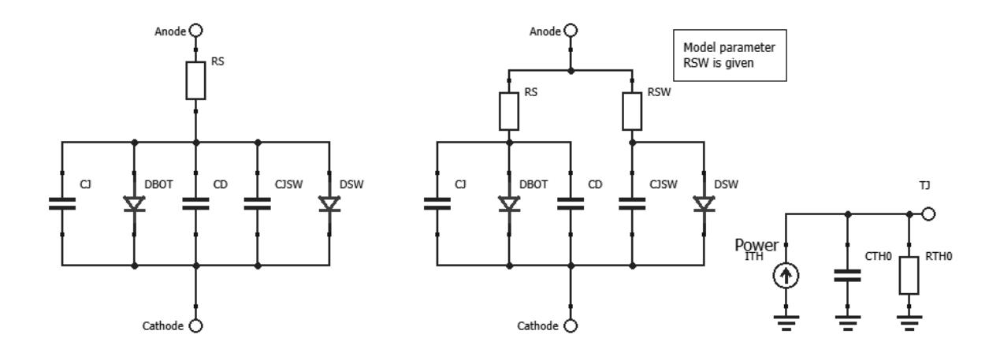

<span id="page-140-1"></span>Figure 7.1: Diode model structure for different RSW definition: left standard, right separate diodes for bottom and sidewall (thermal model only shown once)

#### Separate sidewall diode

Models in semiconductor processes require higher accuracy for parasitic effects in integrated diodes. To achieve this bottom and sidewall parts of these diodes will be modeled separate. Defining the model parameter **RSW** will switch between both configurations as shown in the figure [7.1.](#page-140-1)

## <span id="page-140-0"></span>7.2.3 Diode models available via OpenVAF/OSDI

With its integrated [OSDI interface](https://semimod.de/projects/) and the [OpenVAF](https://openvaf.semimod.de/) compiler (see chapter [9](#page-302-0) for details), ngspice makes available more Verilog-A compact diode models:

#### 7.2.3.1 JUNCAP2 model

Initially developed by Philips research. A widely used diode model in integrated circuit design. Works together with MOS models like PSP and as an alternative diode model for source/drain junctions of BSIM4 models.

#### 7.2.3.2 DIODE\_CMC

The DIODE\_CMC model includes following enhancement beyond JUNCAP2:

- 1. Series resistor
- 2. Diffusion cap with soft recovery
- 3. Breakdown voltage temperature coefficient
- 4. Noise
- 5. Min-max parameters for warning purposes

# <span id="page-141-3"></span><span id="page-141-0"></span>7.3 BJT

## <span id="page-141-1"></span>7.3.1 Bipolar Junction Transistors (BJTs)

General form:

```
QXXXXXXX nc nb ne <ns> <tj> mname <area=val> <areac=val>
+ <areab=val> <m=val> <off> <ic=vbe,vce> <temp=val>
+ <dtemp=val>
```

#### Examples:

```
Q23 10 24 13 QMOD IC=0.6, 5.0
Q50A 11 26 4 20 MOD1
```

**nc**, **nb**, and **ne** are the collector, base, and emitter nodes, respectively. **ns** is the (optional) substrate node. When unspecified, ground is used. **tj** is the (optional) junction temperature node, available in the VBIC model (see [7.3.4\)](#page-147-0). **mname** is the model name, **area**, **areab**, **areac** are the area factors (emitter, base and collector respectively), and **off** indicates an (optional) initial condition on the device for the dc analysis. If the area factor is omitted, a value of 1.0 is assumed.

The (optional) initial condition specification using **ic=vbe,vce** is intended for use with the **uic** option on a .tran control line, when a transient analysis is desired to start from other than the quiescent operating point. See the .ic control line description for a better way to set transient initial conditions. The (optional) **temp** value is the temperature where this device is to operate, and overrides the temperature specification on the .option control line. Using the **dtemp** option one can specify the instance's temperature relative to the circuit temperature.

## <span id="page-141-2"></span>7.3.2 BJT Models (NPN/PNP)

Ngspice provides three different BJT device models, which are selected by the .model card.

```
.model QMOD1 PNP
.model QMOD3 NPN level=4
```

These are the minimal versions, using default parameters supplied by ngspice. Further optional parameters listed in the table below may replace the ngspice default parameters. The **LEVEL** keyword specifies the model to be used:

- **LEVEL**=1: This is the original SPICE BJT model, and it is the default model if the **LEVEL** keyword is not specified on the .model line. By activating certain parameter a modified version of the original SPICE BJT that models both vertical and lateral devices, includes temperature corrections of collector, emitter and base resistors and allow modeling of quasi-saturation effects.
- **LEVEL**=4: Advanced VBIC model (see [7.3.4](#page-147-0) and <http://www.designers-guide.org/VBIC/> for details)

7.3. BJT 143

• **LEVEL**=8: HICUM/L2 model (see [7.3.5](#page-149-0) and [the official website](https://www.iee.et.tu-dresden.de/iee/eb/hic_new/hic_intro.html) for details)

With the (new in ngspice-39) OpenVAF/OSDI approach (see [9\)](#page-302-0), all modern bipolar models, written in Verilog-A, become available, like VBIC, Mextram and HICUM.

## <span id="page-142-0"></span>7.3.3 Gummel-Poon Models

The bipolar junction transistor model in ngspice is an adaptation of the integral charge control model of Gummel and Poon. This modified Gummel-Poon model extends the original model to include several effects at high bias levels. The model automatically simplifies to the simpler Ebers-Moll model when certain parameters are not specified. The parameter names used in the modified Gummel-Poon model have been chosen to be more easily understood by the user, and to reflect better both physical and circuit design thinking.

The dc model is defined by the parameters **IS**, **BF**, **NF**, **ISE**, **IKF**, and **NE,** which determine the forward current gain characteristics, **IS**, **BR**, **NR**, **ISC**, **IKR**, and **NC**, which determine the reverse current gain characteristics, and **VAF** and **VAR**, which determine the output conductance for forward and reverse regions.

A more accurate model for transport current components is possible by specification of model parameter **IBE** and **IBC** instead of **IS**.

Parameter **NKF(NK)**was introduced for more accurate high current beta rolloff modelling.

The BJT model has among the standard temperature parameters an extension compatible with most foundry provided process design kits (see parameter table below **TLEV**).

The BJT model includes the substrate saturation current **ISS**. Three ohmic resistances **RB**, **RC**, and **RE** are included, where **RB** can be high current dependent. Base charge storage is modeled by forward and reverse transit times, **TF** and **TR**, where the forward transit time **TF** can be bias dependent if desired. Nonlinear depletion layer capacitances are defined with **CJE**, **VJE**, and **NJE** for the B-E junction, **CJC**, **VJC**, and **NJC** for the B-C junction and **CJS**, **VJS**, and **MJS** for the C-S (collector-substrate) junction.

The BJT model support a substrate capacitance that is connected to the device's base or collector, to model lateral or vertical devices dependent on the parameter **SUBS**. The temperature dependence of the saturation currents, **IS** and **ISS**, is determined by the energy-gap, **EG**, and the saturation current temperature exponent, **XTI**.

In the new model, additional base current temperature dependence is modeled by the beta temperature exponent **XTB**. The values specified are assumed to have been measured at the temperature **TNOM**, which can be specified on the .options control line or overridden by a specification on the .model line.

The BJT parameters used in the modified Gummel-Poon model are listed below. The parameter names used in earlier versions of SPICE2 are still accepted.

#### Gummel-Poon BJT Parameters (incl. model extensions)

| Name | Parameters | Units | Default | Example | Scale factor |
|------|------------|-------|---------|---------|--------------|

| SUBS     | Substrate connection: 1 for vertical                              |     | 1       |         |             |
|----------|-------------------------------------------------------------------|-----|---------|---------|-------------|
| IS       | geometry, -1 for lateral geometry<br>Transport saturation current | A   | 1.0e-16 | 1.0e-15 | area        |
| IBE      | Base-Emitter saturation current                                   | A   | 0.0     | 1.0e-16 | area        |
| IBC      | Base-Collector saturation current                                 | A   | 0.0     | 1.0e-16 | areab,areac |
| ISS      | Reverse saturation current,                                       | A   | 0.0     | 1.0e-15 | area        |
|          | substrate-to-collector for vertical                               |     |         |         |             |
|          | device or substrate-to-base for                                   |     |         |         |             |
|          | lateral                                                           |     |         |         |             |
| BF       | Ideal maximum forward beta.                                       | -   | 100     | 100     |             |
| NF       | Forward current emission                                          | -   | 1.0     | 1       |             |
|          | coefficient                                                       |     |         |         |             |
| VAF (VA) | Forward Early voltage                                             | V   | ∞       | 200     |             |
| IKF      | Corner for forward beta current                                   | A   | ∞       | 0.01    | area        |
|          | roll-off                                                          |     |         |         |             |
| NKF(NK)  | High current Beta rolloff exponent                                | -   | 0.5     | 0.9     |             |
| ISE      | B-E leakage saturation current.                                   | A   | 0.0     | 1e-13   | area        |
| NE       | B-E leakage emission coefficient                                  | -   | 1.5     | 2       |             |
| BR       | Ideal maximum reverse beta                                        | -   | 1       | 0.1     |             |
| NR       | Reverse current emission                                          | -   | 1       | 1       |             |
|          | coefficient                                                       |     |         |         |             |
| VAR (VB) | Reverse Early voltage                                             | V   | ∞       | 200     |             |
| IKR      | Corner for reverse beta high                                      | A   | ∞       | 0.01    | area        |
|          | current roll-off                                                  |     |         |         |             |
| ISC      | B-C leakage saturation current                                    | A   | 0.0     | 1e-13   | areab,areac |
|          | (scale is 'areab' for vertical devices                            |     |         |         |             |
|          | and 'areac' for lateral)                                          |     |         |         |             |
| NC       | B-C leakage emission coefficient                                  | -   | 2       | 1.5     |             |
| RB       | Zero bias base resistance                                         | Ω   | 0       | 100     | 1/area      |
| IRB      | Current where base resistance falls                               | A   | ∞       | 0.1     | area        |
|          | halfway to its min value                                          |     |         |         |             |
| RBM      | Minimum base resistance at high                                   | Ω   | RB      | 10      | 1/area      |
|          | currents                                                          |     |         |         |             |
| RE       | Emitter resistance                                                | Ω   | 0       | 1       | 1/area      |
| RC       | Collector resistance                                              | Ω   | 0       | 10      | 1/area      |
| CJE      | B-E zero-bias depletion                                           | F   | 0       | 2pF     | area        |
|          | capacitance                                                       |     |         |         |             |
| VJE (PE) | B-E built-in potential                                            | V   | 0.75    | 0.6     |             |
| MJE (ME) | B-E junction exponential factor                                   | -   | 0.33    | 0.33    |             |
| TF       | Ideal forward transit time                                        | sec | 0       | 0.1ns   |             |
| XTF      | Coefficient for bias dependence of                                | -   | 0       |         |             |
|          | TF                                                                |     |         |         |             |
| VTF      | Voltage describing VBC                                            | V   | ∞       |         |             |
|          | dependence of TF                                                  |     |         |         |             |
| ITF      | High-current parameter for effect                                 | A   | 0       | -       | area        |

7.3. BJT 145

| PTF         | Excess phase at freq= $\frac{1}{2\pi TF}$ Hz                                                                       | deg   | 0    |      |             |
|-------------|--------------------------------------------------------------------------------------------------------------------|-------|------|------|-------------|
| CJC         | B-C zero-bias depletion<br>capacitance (scale is 'areab' for<br>vertical devices and 'areac' for<br>lateral)       | F     | 0    | 2pF  | areab,areac |
| VJC (PC)    | B-C built-in potential                                                                                             | V     | 0.75 | 0.5  |             |
| MJC         | B-C junction exponential factor                                                                                    | -     | 0.33 | 0.5  |             |
| XCJC        | Fraction of B-C depletion capacitance connected to internal base node                                              | -     | 1    |      |             |
| TR          | Ideal reverse transit time                                                                                         | sec   | 0    | 10ns |             |
| CJS         | Zero-bias collector-substrate<br>capacitance (scale is 'areac' for<br>vertical devices and 'areab' for<br>lateral) | F     | 0    | 2pF  | areab,areac |
| VJS (PS)    | Substrate junction built-in potential                                                                              | V     | 0.75 |      |             |
| MJS (MS)    | Substrate junction exponential factor                                                                              | -     | 0    | 0.5  |             |
| XTB         | Forward and reverse beta temperature exponent                                                                      | -     | 0    |      |             |
| EG          | Energy gap for temperature effect on IS                                                                            | eV    | 1.11 |      |             |
| XTI         | Temperature exponent for effect on IS                                                                              | -     | 3    |      |             |
| KF          | Flicker-noise coefficient                                                                                          | -     | 0    |      |             |
| AF          | Flicker-noise exponent                                                                                             | -     | 1    |      |             |
| FC          | Coefficient for forward-bias depletion capacitance formula                                                         | -     | 0.5  | 0    |             |
| TNOM (TREF) | Parameter measurement temperature                                                                                  | °C    | 27   | 50   |             |
| TLEV        | BJT temperature equation selector                                                                                  | -     | 0    |      |             |
| TLEVC       | BJT capac. temperature equation selector                                                                           | -     | 0    |      |             |
| TRE1        | 1st order temperature coefficient for RE                                                                           | 1/°C  | 0.0  | 1e-3 |             |
| TRE2        | 2nd order temperature coefficient for RE                                                                           | 1/°C2 | 0.0  | 1e-5 |             |
| TRC1        | 1st order temperature coefficient for RC                                                                           | 1/°C  | 0.0  | 1e-3 |             |
| TRC2        | 2nd order temperature coefficient for RC                                                                           | 1/°C2 | 0.0  | 1e-5 |             |
| TRB1        | 1st order temperature coefficient for RB                                                                           | 1/°C  | 0.0  | 1e-3 |             |
| TRB2        | 2nd order temperature coefficient for RB                                                                           | 1/°C2 | 0.0  | 1e-5 |             |

| TRBM1 | 1st order temperature coefficient<br>for RBM | 1/<br>◦C      | 0.0 | 1e-3 |  |
|-------|----------------------------------------------|---------------|-----|------|--|
| TRBM2 | 2nd order temperature coefficient<br>for RBM | 1/<br>◦C<br>2 | 0.0 | 1e-5 |  |
| TBF1  | 1st order temperature coefficient<br>for BF  | 1/<br>◦C      | 0.0 | 1e-3 |  |
| TBF2  | 2nd order temperature coefficient<br>for BF  | 1/<br>◦C<br>2 | 0.0 | 1e-5 |  |
| TBR1  | 1st order temperature coefficient<br>for BR  | 1/<br>◦C      | 0.0 | 1e-3 |  |
| TBR2  | 2nd order temperature coefficient<br>for BR  | 1/<br>◦C<br>2 | 0.0 | 1e-5 |  |
| TIKF1 | 1st order temperature coefficient<br>for IKF | 1/<br>◦C      | 0.0 | 1e-3 |  |
| TIKF2 | 2nd order temperature coefficient<br>for IKF | 1/<br>◦C<br>2 | 0.0 | 1e-5 |  |
| TIKR1 | 1st order temperature coefficient<br>for IKR | 1/<br>◦C      | 0.0 | 1e-3 |  |
| TIKR2 | 2nd order temperature coefficient<br>for IKR | 1/<br>◦C<br>2 | 0.0 | 1e-5 |  |
| TIRB1 | 1st order temperature coefficient<br>for IRB | 1/<br>◦C      | 0.0 | 1e-3 |  |
| TIRB2 | 2nd order temperature coefficient<br>for IRB | 1/<br>◦C<br>2 | 0.0 | 1e-5 |  |
| TNC1  | 1st order temperature coefficient<br>for NC  | 1/<br>◦C      | 0.0 | 1e-3 |  |
| TNC2  | 2nd order temperature coefficient<br>for NC  | 1/<br>◦C<br>2 | 0.0 | 1e-5 |  |
| TNE1  | 1st order temperature coefficient<br>for NE  | 1/<br>◦C      | 0.0 | 1e-3 |  |
| TNE2  | 2nd order temperature coefficient<br>for NE  | 1/<br>◦C<br>2 | 0.0 | 1e-5 |  |
| TNF1  | 1st order temperature coefficient<br>for NF  | 1/<br>◦C      | 0.0 | 1e-3 |  |
| TNF2  | 2nd order temperature coefficient<br>for NF  | 1/<br>◦C<br>2 | 0.0 | 1e-5 |  |
| TNR1  | 1st order temperature coefficient<br>for IKF | 1/<br>◦C      | 0.0 | 1e-3 |  |
| TNR2  | 2nd order temperature coefficient<br>for IKF | 1/<br>◦C<br>2 | 0.0 | 1e-5 |  |
| TVAF1 | 1st order temperature coefficient<br>for VAF | 1/<br>◦C      | 0.0 | 1e-3 |  |
| TVAF2 | 2nd order temperature coefficient<br>for VAF | 1/<br>◦C<br>2 | 0.0 | 1e-5 |  |
| TVAR1 | 1st order temperature coefficient<br>for VAR | 1/<br>◦C      | 0.0 | 1e-3 |  |

| TVAR2 | 2nd order temperature coefficient<br>for VAR | 1/<br>◦C<br>2 | 0.0 | 1e-5 |
|-------|----------------------------------------------|---------------|-----|------|
| CTC   | 1st order temperature coefficient<br>for CJC | 1/<br>◦C      | 0.0 | 1e-3 |
| CTE   | 1st order temperature coefficient<br>for CJE | 1/<br>◦C      | 0.0 | 1e-3 |
| CTS   | 1st order temperature coefficient<br>for CJS | 1/<br>◦C      | 0.0 | 1e-3 |
| TVJC  | 1st order temperature coefficient<br>for VJC | 1/<br>◦C<br>2 | 0.0 | 1e-5 |
| TVJE  | 1st order temperature coefficient<br>for VJE | 1/<br>◦C      | 0.0 | 1e-3 |
| TITF1 | 1st order temperature coefficient<br>for ITF | 1/<br>◦C      | 0.0 | 1e-3 |
| TITF2 | 2nd order temperature coefficient<br>for ITF | 1/<br>◦C<br>2 | 0.0 | 1e-5 |
| TTF1  | 1st order temperature coefficient<br>for TF  | 1/<br>◦C      | 0.0 | 1e-3 |
| TTF2  | 2nd order temperature coefficient<br>for TF  | 1/<br>◦C<br>2 | 0.0 | 1e-5 |
| TTR1  | 1st order temperature coefficient<br>for TR  | 1/<br>◦C      | 0.0 | 1e-3 |
| TTR2  | 2nd order temperature coefficient<br>for TR  | 1/<br>◦C<br>2 | 0.0 | 1e-5 |
| TMJE1 | 1st order temperature coefficient<br>for MJE | 1/<br>◦C      | 0.0 | 1e-3 |
| TMJE2 | 2nd order temperature coefficient<br>for MJE | 1/<br>◦C<br>2 | 0.0 | 1e-5 |
| TMJC1 | 1st order temperature coefficient<br>for MJC | 1/<br>◦C      | 0.0 | 1e-3 |
| TMJC2 | 2nd order temperature coefficient<br>for MJC | 1/<br>◦C<br>2 | 0.0 | 1e-5 |

#### Quasi-Saturation Model extension

By defining parameter **RCO**, **VO**, **GAMMA** and **QCO** an extension of the Gummel-Poon model will be switched on to model bipolar junction transistors that exhibit quasi-saturation effects. A description can be found in [\[24\]](#page-561-3).

| Name  | Parameters                     | Units | Default          | Example | Scale factor |
|-------|--------------------------------|-------|------------------|---------|--------------|
| RCO   | Epitaxial region resistance    | Ω     | 0                | 0.45    | 1/area       |
| VO    | Carrier mobility knee voltage  | V     | 10               | 4.16    |              |
| GAMMA | Epitaxial region doping factor | −     | 1e-11            | 1.0e-15 |              |
| QCO   | Epitaxial region charge factor | C     | 0.0              | 3.4E-11 |              |
| VG    | Energy gap QS temp. depend.    | V     | 1.206            | 1.2     |              |
| CN    | Temperature exponent of RCI    |       | 2.42 NPN 2.2 PNP |         |              |

<span id="page-147-2"></span>

| D | Temperature exponent of VO | .87 NPN .52 PNP |  |
|---|----------------------------|-----------------|--|

The Collector current output characteristic shows a special moderate transition in the BJT saturation region, see figure [7.2.](#page-147-1) Furthermore DC current gain and the unity gain frequency fT falls sharply.

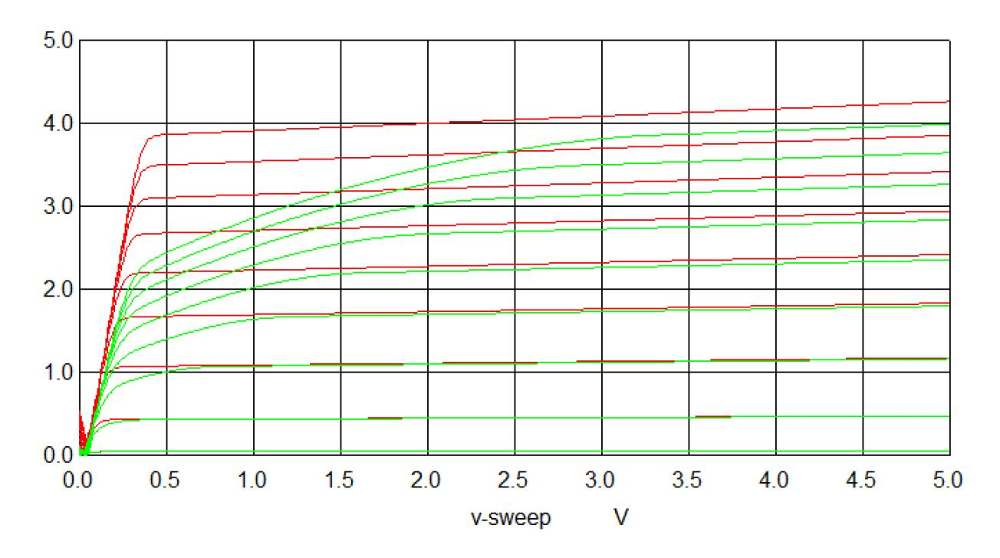

<span id="page-147-1"></span>Figure 7.2: Output characteristic with and w/o Quasi-Saturation

## <span id="page-147-0"></span>7.3.4 VBIC Model

The VBIC model is an extended development of the Standard Gummel-Poon (SGP) model with the focus of integrated bipolar transistors in today's modern semiconductor technologies. With the implemented modified Quasi-Saturation model from Kull and Nagel it is also possible to model the special output characteristic of discrete switching and RF transistors. It is a improved alternative to the SGP model for silicon, SiGe and III-V HBT devices.

VBIC Capabilities compared to Standard Gummel-Poon Model:

- Integrated substrate transistor for parasitic devices in integrated processes
- Weak avalanche and base-emitter breakdown model
- Improved Early effect modeling
- Physical separation of Ic and Ib
- Improved depletion capacitance model
- Improved temperature modeling
- Self-heating modeling

7.3. BJT 149

#### VBIC self-heating model

This model has implemented a simple 1-pole thermal network to cover self-heating effects. That means that the power dissipation is gathered in all branches of the device model and is conducted as an equivalent current Ith into one model node dt. This node has a resistor Rth and capacitor Cth parallel connection to ground. Because the resistor plays the role of the thermal resistance from junction to case the arising voltage at node dt is equivalent the BJT junctions temperature. The model realisizes that this temperature rise leads to deviations for internal resistors, currents and capacitors values, calculated by temperature update equations. This process is included into the ngspice iteration schema for all analyses and is controlled by the model parameter **SELFT** (**SELFT**=0: self heating calculation is off (default value), **SELFT**=1: self-heating is on). In addition the model parameter **RTH** has to be given.

The simple thermal network of the VBIC model is shown in Fig. [7.3.](#page-148-0)

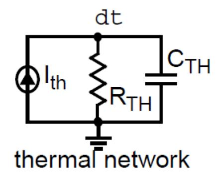

Figure 7.3: VBIC thermal network

How to instantiate the bipolar VBIC model (only minimal version) with self-heating:

```
vc c 0 0
vb b 0 1
ve e 0 0
vs s 0 0
Q1 c b e s dt mod1 area=1
.model mod1 npn Level=4 selft=1 rth=100
```

Of course it is possible to connect an more accurate thermal network to the node dt. The following example is showing a simplified thermal network covering the thermal resistances and capacitances of junction-case and case-ambient transitions induced by a heat-sink.

```
Q1 c b e s dt mod2
.model mod2 npn Level=9 selft=1 rth=20
X1 dt tamb junction-ambient
VTamb tamb 0 30
.subckt junction-ambient jct amb
rjc jct 1 0.4
ccs 1 0 5m
rcs 1 2 0.1
csa 2 0 30m
```

```
rsa 2 amb 1.3
.ends
```

## <span id="page-149-0"></span>7.3.5 HICUM level 2 Model

The physics-based HIgh-CUrrent Model (HICUM) Level2 (L2) has been a standard compact model for bipolar junction transistors and heterojunction bipolar transistors (HBTs) for many years. The model has been shown to be applicable to many process generations of SiGe HBTs and also to InP HBTs, including high-speed and high-voltage device designs. The implemented version in Ngspice is HICUML2/2.4 and can be activated by BJT model parameter level=8.

HICUML2 captures most to all known physical effects relevant in HBTs, in example:

- substrate transistor
- avalanche effect
- physics based transfer current model
- self-heating
- accurate modeling of the temperature dependence
- excess phase between base and collector current

Note that the noise correlation network is not implemented in Ngspice. More information regarding the model and its parameters can be found on the [website.](https://www.iee.et.tu-dresden.de/iee/eb/hic_new/hic_intro.html)

The equivalent circuit of the model is shown in fig. [7.4.](#page-150-1) The model is employed in many PDKs for state-of-the-art SiGe and InP HBTs and is actively developed at TU Dresden.

The HICUM model exposes the following nodes to the user:

C(ollector) B(ase) E(mitter) S(ubstrate) T(emperature)

By connecting the T and S nodes of the model to other circuit elements, the thermal and substrate network can be modified by the user. Note that both self-heating and the avalanche effect may cause convergency issues if the operating region is too extreme.

The HICUM/L2 model can be initiated like this example:

```
vc c 0 0
vb b 0 1
ve e 0 0
vs s 0 0
Q1 c b e s dt mod1 area=1
.model mod1 npn Level=8
```

Self-heating is activated by model parameters **FLSH**, **RTH** and connecting T node of the device instance. **FLSH** = 1 will only consider main thermal contributions of IC and IB, **FLSH** = 2 include all power dissipations of the transistor.

7.3. BJT 151

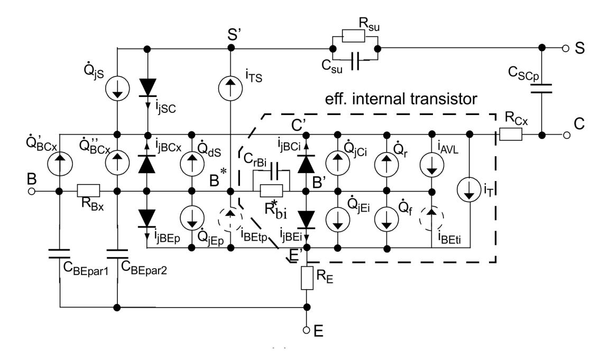

<span id="page-150-1"></span>Figure 7.4: The equivalent circuit of HICUM/L2 without the self-heating, NQS and noise correlation networks.

## <span id="page-150-0"></span>7.3.6 BJT models available via OpenVAF/OSDI

With its integrated [OSDI interface](https://semimod.de/projects/) and the [OpenVAF](https://openvaf.semimod.de/) compiler (see chapter [9](#page-302-0) for details), ngspice makes available more Verilog-A compact BJT models:

#### 7.3.6.1 HICUM level 0

HICUM/L0 is being developed to reduce the simulation and design time especially for larger circuits. It addresses, compared to the SPICE Gummel-Poon model, modern BJT and HBT technologies by including more accurate formulations for important physical effects such as forward transit time, base-collector punch-through and collector impact ionization.

#### 7.3.6.2 HICUM level 2

HICUM/L2 stands for HIgh CUrrent Model and targets the design of bipolar transistor circuits at high-frequencies and high-current densities using a wide range of Si, SiGe or III-V based process technologies. The compact model that contains accurate formulations of all known physical effects, enables geometry scaling and statistical modeling, and covers a wide temperature, operating and frequency range.

#### 7.3.6.3 MEXTRAM 504 and 505

MEXTRAM is an advanced compact model for the description of bipolar transistors. It contains many features that the widely-used Gummel-Poon model lacks. Mextram can be used for advanced processes like double-poly or even SiGe transistors and for high-voltage power devices.

# <span id="page-151-5"></span><span id="page-151-0"></span>7.4 JFETs

## <span id="page-151-1"></span>7.4.1 Junction Field-Effect Transistors (JFETs)

General form:

JXXXXXXX nd ng ns mname <area> <off> <ic=vds,vgs> <temp=t>

Examples:

J1 7 2 3 JM1 OFF

**nd**, **ng**, and **ns** are the drain, gate, and source nodes, respectively. **mname** is the model name, **area** is the area factor, and **off** indicates an (optional) initial condition on the device for dc analysis. If the area factor is omitted, a value of 1.0 is assumed. The (optional) initial condition specification, using **ic=VDS,VGS** is intended for use with the **uic** option on the .TRAN control line, when a transient analysis is desired starting from other than the quiescent operating point. See the .ic control line for a better way to set initial conditions. The (optional) temp value is the temperature where this device is to operate, and overrides the temperature specification on the .option control line.

## <span id="page-151-2"></span>7.4.2 JFET Models (NJF/PJF)

## <span id="page-151-3"></span>7.4.3 Basic model statement

.model JM1 NJF level=1

.model JMOD2 PJF level=2

## <span id="page-151-4"></span>7.4.4 JFET level 1 model with Parker Skellern modification

The JFET level 1 model is derived from the FET model of Shichman and Hodges. The dc characteristics are defined by the parameters **VTO** and **BETA**, which determine the variation of drain current with gate voltage, **LAMBDA**, which determines the output conductance, and IS, the saturation current of the two gate junctions. Two ohmic resistances, **RD** and **RS**, are included.

$$vgst = vgs - VTO (7.21)$$

$$\beta_p = BETA \left( 1 + LAMBDA \, vds \right) \tag{7.22}$$

$$bfac = \frac{1 - B}{PB - VTO} \tag{7.23}$$

7.4. JFETS 153

$$I_{Drain} = \begin{cases} vds \cdot GMIN, & \text{if } vgst \leq 0 \\ \beta_p \, vds \, (vds \, (bfac \, vds - B) \, vgst \, (2B + 3bfac \, (vgst - vds))) + vds \cdot GMIN, & \text{if } vgst \geq vds \\ \beta_p \, vgst^2 \, (B + vgst \, bfac) + vds \cdot GMIN, & \text{if } vgst < vds \end{cases}$$

$$(7.24)$$

Note that in Spice3f and later, the fitting parameter **B** has been added by Parker and Skellern. For details, see [\[9\]](#page-560-6). If parameter **B** is set to 1 equation above simplifies to

$$I_{Drain} = \begin{cases} vds \cdot GMIN, & \text{if } vgst \leq 0\\ \beta_p vds \left(2vgst - vds\right) + vds \cdot GMIN, & \text{if } vgst \geq vds\\ \beta_p vgst^2 + vds \cdot GMIN, & \text{if } vgst < vds \end{cases}$$
(7.25)

Charge storage is modeled by nonlinear depletion layer capacitances for both gate junctions, which vary as the −1/2 power of junction voltage and are defined by the parameters **CGS**, **CGD**, and **PB**.

| Name    | Parameter                           | Units    | Default | Example | Scaling factor |
|---------|-------------------------------------|----------|---------|---------|----------------|
| VTO     | VT0<br>Threshold voltage            | V        | -2.0    | -2.0    |                |
| BETA    | Transconductance parameter (β)      | A/V<br>" | 1.0e-4  | 1.0e-3  | area           |
| LAMBDA  | Channel-length modulation           | 1/V      | 0       | 1.0e-4  |                |
|         | parameter (λ)                       |          |         |         |                |
| RD      | Drain ohmic resistance              | Ω        | 0       | 100     | 1/area         |
| RS      | Source ohmic resistance             | Ω        | 0       | 100     | 1/area         |
| CGS     | Zero-bias G-S junction capacitance  | F        | 0       | 5pF     | area           |
|         | Cgs                                 |          |         |         |                |
| CGD     | Zero-bias G-D junction              | F        | 0       | 1pF     | area           |
|         | capacitance<br>Cgd                  |          |         |         |                |
| PB      | Gate junction potential             | V        | 1       | 0.6     |                |
| IS      | IS<br>Gate saturation current       | A        | 1.0e-14 | 1.0e-14 | area           |
| B       | Doping tail parameter               | -        | 1       | 1.1     |                |
| KF      | Flicker noise coefficient           | -        | 0       |         |                |
| AF      | Flicker noise exponent              | -        | 1       |         |                |
| NLEV    | Noise equation selector             | -        | 1       | 3       |                |
| GDSNOI  | Channel noise coefficient for       |          | 1.0     | 2.0     |                |
|         | nlev=3                              |          |         |         |                |
| FC      | Coefficient for forward-bias        |          | 0.5     |         |                |
|         | depletion capacitance formula       |          |         |         |                |
| TNOM    | Parameter measurement               | ◦C       | 27      | 50      |                |
|         | temperature                         |          |         |         |                |
| TCV     | Threshold voltage temperature       | 1/°C     | 0.0     | 0.01    |                |
|         | coefficient                         |          |         |         |                |
| VTOTC   | Threshold voltage temperature       | 1/°C     | 0.0     | -2.5m   |                |
|         | coefficient (alternative model)     |          |         |         |                |
| BEX     | Mobility temperature exponent       | -        | 0.0     | 1.1     |                |
| BETATCE | Mobility temperature exponent       | %/°C     | 0.0     | -0.5    |                |
|         | (alternative model)                 |          |         |         |                |
| XTI     | Gate saturation current temperature | -        | 3.0     |         |                |
|         | coefficient                         |          |         |         |                |
| EG      | Bandgap voltage                     |          | 1.11    |         |                |

Additional to the standard thermal and flicker noise model an alternative thermal channel noise model is implemented and is selectable by setting **NLEV** parameter to 3. This leads to a correct channel thermal noise description in the linear region.

$$S_{noise} = \frac{2}{3} 4kT \cdot BETA \cdot Vgst \frac{(1 + \alpha + \alpha^2)}{1 + \alpha} GDSNOI$$
 (7.26)

with

$$\alpha = \begin{cases} 1 - \frac{vds}{vgs - VTO}, & \text{if } vgs - VTO \ge vds \\ 0, & \text{else} \end{cases}$$
 (7.27)

JFET level 1 model has an alternative temperature model for main parameter **VTO** and **BETA**:

7.4. JFETS 155

• **VTOTC** is given:

$$VTO(Temp) = VTO + VTOTC * (Temp - TNOM)$$
(7.28)

• **VTOTC** not given:

$$VTO(Temp) = VTO - TCV * (Temp - TNOM)$$
(7.29)

• **BETATCE** is given:

$$BETA(Temp) = BETA * 1.01^{BETATCE*(Temp-TNOM)}$$
(7.30)

• **BETATCE** not given:

$$BETA(Temp) = BETA * \left(\frac{Temp}{TNOM}\right)^{BEX}$$
(7.31)

## <span id="page-154-0"></span>7.4.5 JFET level 2 Parker Skellern model

The level 2 model is an improvement to level 1. Details are available in a [pdf](https://ngspice.sourceforge.io/external-documents/models/psfet.pdf) originating from Macquarie University. Some important items are

- The description maintains strict continuity in its high-order derivatives, which is essential for prediction of distortion and intermodulation.
- Frequency dependence of output conductance and transconductance is described as a function of bias.
- Both drain-gate and source-gate potentials modulate the pinch-off potential, which is consistent with S-parameter and pulsed-bias measurements.
- Self-heating varies with frequency.
- Extreme operating regions subthreshold, forward gate bias, controlled resistance, and breakdown regions - are included.
- Parameters provide independent fitting to all operating regions. It is not necessary to compromise one region in favor of another.
- Strict drain-source symmetry is maintained. The transition during drain-source potential reversal is smooth and continuous.

The model equations are described in this [pdf document](https://ngspice.sourceforge.io/external-documents/models/psfet.pdf) and in [\[19\]](#page-561-4).

| Name  | Description                            | Units | Default |
|-------|----------------------------------------|-------|---------|
| ID    | Device IDText                          | Text  | PF1     |
| ACGAM | Capacitance modulation                 | -     | 0       |
| BETA  | Linear-region transconductance scale   | -     | 10−4    |
| CGD   | Zero-bias gate-source capacitance      | F     | 0       |
| CGS   | Zero-bias gate-drain capacitance       | F     | 0       |
| DELTA | Thermal reduction coefficient          | 1/W   | 0       |
| FC    | Forward bias capacitance parameter     | -     | 0.5     |
| HFETA | High-frequency VGS feedback parameter  | -     | 0       |
| HFE1  | HFGAM modulation by VGD                | 1/V   | 0       |
| HFE2  | HFGAM modulation by VGS                | 1/V   | 0       |
| HFGAM | High-frequency VGD feedback parameter  | -     | 0       |
| HFG1  | HFGAM modulation by VSG                | 1/V   | 0       |
| HFG2  | HFGAM modulation by VDG                | 1/V   | 0       |
| IBD   | Gate-junction breakdown current        | A     | 0       |
| IS    | Gate-junction saturation current       | A     | 10−14   |
| LFGAM | Low-frequency feedback parameter       | -     | 0       |
| LFG1  | LFGAM modulation by VSG                | 1/V   | 0       |
| LFG2  | LFGAM modulation by VDG                | 1/V   | 0       |
| MVST  | Subthreshold modulation                | 1/V   | 0       |
| N     | Gate-junction ideality factor          | -     | 1       |
| P     | Linear-region power-law exponent       | -     | 2       |
| Q     | Saturated-region power-law exponent    | -     | 2       |
| RS    | Source ohmic resistance                | Ω     | 0       |
| RD    | Drain ohmic resistance                 | Ω     | 0       |
| TAUD  | Relaxation time for thermal reduction  | s     | 0       |
| TAUG  | Relaxation time for gamma feedback     | s     | 0       |
| VBD   | Gate-junction breakdown potential      | V     | 1       |
| VBI   | Gate-junction potential                | V     | 1       |
| VST   | Subthreshold potential                 | V     | 0       |
| VTO   | Threshold voltage                      | V     | -2.0    |
| XC    | Capacitance pinch-off reduction factor | -     | 0       |
| XI    | Saturation-knee potential factor       | -     | 1000    |
| Z     | Knee transition parameter              | -     | 0.5     |
| RG    | Gate ohmic resistance                  | Ω     | 0       |
| LG    | Gate inductance                        | H     | 0       |
| LS    | Source inductance                      | H     | 0       |
| LD    | Drain inductance                       | H     | 0       |
| CDSS  | Fixed Drain-source capacitance         | F     | 0       |
| AFAC  | Gate-width scale factor                | -     | 1       |
| NFING | Number of gate fingers scale factor    | -     | 1       |
| TNOM  | Nominal Temperature (Not implemented)  | K     | 300 K   |
| TEMP  | Temperature                            | K     | 300 K   |

<span id="page-156-4"></span>7.5. MESFETS 157

# <span id="page-156-0"></span>7.5 MESFETs

## <span id="page-156-1"></span>7.5.1 MESFET devices

General form:

ZXXXXXXX ND NG NS MNAME <AREA> <OFF> <IC=VDS, VGS>

Examples:

Z1 7 2 3 ZM1 OFF

## <span id="page-156-2"></span>7.5.2 MESFET Models (NMF/PMF)

.model ZM1 NMF level=1

.model MZMOD PMF level=4

These model statements will use the default parameters (level 1 listed below).

## <span id="page-156-3"></span>7.5.3 Model by Statz e.a.

The MESFET model level 1 is derived from the GaAs FET model of Statz et al. as described in [\[11\]](#page-560-7). The dc characteristics are defined by the parameters **VTO**, **B**, and **BETA**, which determine the variation of drain current with gate voltage, **ALPHA**, which determines saturation voltage, and **LAMBDA**, which determines the output conductance. The formula are given by:

$$I_{d} = \begin{cases} \frac{\beta(V_{gs} - V_{TO})^{2}}{1 + B(V_{gs} - V_{TO})} \left[ 1 - \left( 1 - \alpha \frac{V_{ds}}{3} \right)^{3} \right] (1 + \lambda V_{ds}) & \text{for } 0 < V_{ds} < \frac{3}{\alpha} \\ \frac{\beta(V_{gs} - V_{TO})^{2}}{1 + B(V_{gs} - V_{TO})} (1 + \lambda V_{ds}) & \text{for } V_{ds} \ge \frac{3}{\alpha} \end{cases}$$
(7.32)

Two ohmic resistances, **RD** and **RS**, are included. Charge storage is modeled by total gate charge as a function of gate-drain and gate-source voltages and is defined by the parameters **CGS**, **CGD**, and **PB**.

| Name   | Parameter                              | Units    | Default | Example | Area |
|--------|----------------------------------------|----------|---------|---------|------|
| VTO    | Pinch-off voltage                      | V        | -2.0    | -2.0    |      |
| BETA   | Transconductance parameter             | A/V<br>2 | 1.0e-4  | 1.0e-3  | *    |
| B      | Doping tail extending parameter        | 1/V      | 0.3     | 0.3     | *    |
| ALPHA  | Saturation voltage parameter           | 1/V      | 2       | 2       | *    |
| LAMBDA | Channel-length modulation parameter    | 1/V      | 0       | 1.0e-4  |      |
| RD     | Drain ohmic resistance                 | Ω        | 0       | 100     | *    |
| RS     | Source ohmic resistance                | Ω        | 0       | 100     | *    |
| CGS    | Zero-bias G-S junction capacitance     | F        | 0       | 5pF     | *    |
| CGD    | Zero-bias G-D junction capacitance     | F        | 0       | 1pF     | *    |
| PB     | Gate junction potential                | V        | 1       | 0.6     |      |
| KF     | Flicker noise coefficient              | -        | 0       |         |      |
| AF     | Flicker noise exponent                 | -        | 1       |         |      |
| FC     | Coefficient for forward-bias depletion | -        | 0.5     |         |      |
|        | capacitance formula                    |          |         |         |      |

Device instance:

z1 2 3 0 mesmod area=1.4

#### Model:

- .model mesmod nmf level=1 rd=46 rs=46 vt0=-1.3
- + lambda=0.03 alpha=3 beta=1.4e-3

## <span id="page-157-0"></span>7.5.4 Model by Ytterdal e.a.

level 2 (and levels 3,4) Copyright 1993: T. Ytterdal, K. Lee, M. Shur and T. A. Fjeldly to be written

M. Shur, T.A. Fjeldly, T. Ytterdal, K. Lee, "Unified GaAs MESFET Model for Circuit Simulation", Int. Journal of High Speed Electronics, vol. 3, no. 2, pp. 201-233, 1992

## <span id="page-157-1"></span>7.5.5 hfet1 and hfet2

#### hfet1 level 5

Heterostructure Field Effect Transistor model as described in section 4.6 of the book

K. Lee, M. Shur, T. A. Fjeldly and T. Ytterdal, Semiconductor Device Modeling for VLSI, 1993, Prentice Hall, New Jersey.

Model parameters, equivalent circuit diagrams and device equations are also described in the [AIM-Spice reference manual,](http://www.aimspice.com/downloads/aimspiceref.2020.100.pdf) section Device Models A.

#### hfet2 level6

The HFET level 2 model is a simplified version of the level 1 model. The model is optimized for speed and is suitable for simulation of digital circuits. To increase the speed, some of the features included in the level 1 model is not implemented for the level 2 model.

7.6. MOSFETS 159

# <span id="page-158-0"></span>7.6 MOSFETs

Ngspice supports all the original MOSFET models present in SPICE3f5 and almost all the newer ones that have been published and made open-source. Both bulk and SOI (Silicon on Insulator) models are available. When compiled with the cider option, ngspice implements the four terminals numerical model that can be used to simulate a MOSFET (please refer to numerical modeling documentation for additional information and examples).

## <span id="page-158-1"></span>7.6.1 MOSFET devices

General form:

```
MXXXXXXX nd ng ns nb mname <m=val> <l=val> <w=val>
+ <ad=val> <as=val> <pd=val> <ps=val> <nrd=val>
+ <nrs=val> <off> <ic=vds, vgs, vbs> <temp=t>
```

#### Examples:

```
M1 24 2 0 20 TYPE1
M31 2 17 6 10 MOSN L=5U W=2U
M1 2 9 3 0 MOSP L=10U W=5U AD=100P AS=100P PD=40U PS=40U
```

Note the suffixes in the example: the suffix 'u' specifies microns (1e-6 m) and 'p' sq-microns (1e-12 m<sup>2</sup> ).

The instance card for MOS devices starts with the letter '**M**'. **nd**, **ng**, **ns**, and **nb** are the drain, gate, source, and bulk (substrate) nodes, respectively. **mname** is the model name and **m** is the multiplicity parameter, which simulates 'm' paralleled devices. All MOS models support the '**m**' multiplier parameter. Instance parameters **l** and **w**, channel length and width respectively, are expressed in meters. The drain and source diffusion areas are **ad** and **as**, in square meters (m<sup>2</sup> ).

If any of **l**, **w**, **ad**, or **as** are not specified, default values are used. The use of defaults simplifies input file preparation, as well as the editing required if device geometries are to be changed. **pd** and **ps** are the perimeters of the drain and source junctions, in meters. **nrd** and **nrs** designate the equivalent number of squares of the drain and source diffusions; these values multiply the sheet resistance **rsh** specified on the .model control line for an accurate representation of the parasitic series drain and source resistance of each transistor. **pd** and **ps** default to 0.0 while **nrd** and **nrs** to 1.0. **off** indicates an (optional) initial condition on the device for dc analysis. The (optional) initial condition specification using **ic=vds,vgs,vbs** is intended for use with the **uic** option on the .tran control line, when a transient analysis is desired starting from other than the quiescent operating point. See the .ic control line for a better and more convenient way to specify transient initial conditions. The (optional) **temp** value is the temperature at which this device is to operate, and overrides the temperature specification on the .option control line.

The temperature specification is ONLY valid for level 1, 2, 3, and 6 MOSFETs, not for level 4 or 5 (BSIM) devices.

BSIM3 (v3.2 and v3.3.0), BSIM4 (v4.7 and v4.8) and BSIMSOI models are also supporting the instance parameter **delvto** and **mulu0** for local mismatch and NBTI (negative bias temperature instability) modeling:

<span id="page-159-1"></span>

| Name            | Parameter                          | Units | Default | Example |
|-----------------|------------------------------------|-------|---------|---------|
| delvto (delvt0) | Threshold voltage shift            | V     | 0.0     | 0.07    |
| mulu0           | Low-field mobility multiplier (U0) | -     | 1.0     | 0.9     |

## <span id="page-159-0"></span>7.6.2 MOSFET models (NMOS/PMOS)

MOSFET models are the central part of ngspice, probably because they are the most widely used devices in the electronics world. Ngspice provides all the MOSFETs implemented in the original Spice3f and adds several models developed by [UC Berkeley's Device Group](http://www-device.eecs.berkeley.edu/bsim/) and other independent groups.

Each model is invoked with a .model card. A minimal version is:

.model MOSN NMOS level=8 version=3.3.0

The model name MOSN corresponds to the model name in the instance card (see [7.6.1\)](#page-158-1). Parameter **NMOS** selects an n-channel device, **PMOS** would point to a p-channel transistor. The **LEVEL** and **VERSION** parameters select the specific model. Further model parameters are optional and replace ngspice default values. Due to the large number of parameters (more than 100 for modern models), model cards may be stored in extra files and loaded into the netlist by the .include [\(2.8\)](#page-57-1) command. Model cards are specific for a an IC manufacturing process and are typically provided by the IC foundry. Some generic parameter sets, not linked to a specific process, are made available by the model developers, e.g. [UC Berkeley's Device Group](http://www-device.eecs.berkeley.edu/bsim/) for BSIM4 and BSIMSOI.

Ngspice provides several MOSFET device models, which differ in the formulation of the I-V characteristic, and are of varying complexity. Models available are listed in table [7.3.](#page-160-0) Current models for IC design are BSIM3 [\(7.6.3.3,](#page-166-0) down to channel length of 0.25 µm), BSIM4 [\(7.6.3.4,](#page-167-0) below 0.25 µm), BSIMSOI [\(7.6.4,](#page-168-0) silicon-on-insulator devices), HiSIM2 and HiSIM\_HV [\(7.6.6,](#page-168-2) surface potential models for standard and high voltage/high power MOS devices).

With the (new in ngspice-39) OpenVAF/OSDI approach (see [9\)](#page-302-0), all modern MOS models, written in Verilog-A, become available, like BSIMBULK, BSIM-CMG and BSIM-IMG, PSP, HiSim etc..

#### 7.6.2.1 MOS Level 1

This model is also known as the 'Shichman-Hodges' model. This is the first model written and the one often described in the introductory textbooks for electronics. This model is applicable only to long channel devices. The use of Meyer's model for the C-V part makes it non charge conserving.

#### 7.6.2.2 MOS Level 2

This model tries to overcome the limitations of the Level 1 model addressing several shortchannel effects, like velocity saturation. The implementation of this model is complicated and this leads to many convergence problems. C-V calculations can be done with the original Meyer model (non charge conserving).

| Level  | Name     | Model                                                                                                                                               | Version                    | Developer                       | References                      | Notes                                                                                                                                                                   |
|--------|----------|-----------------------------------------------------------------------------------------------------------------------------------------------------|----------------------------|---------------------------------|---------------------------------|-------------------------------------------------------------------------------------------------------------------------------------------------------------------------|
| 1      | MOS1     | Shichman-Hodges                                                                                                                                     |                            | Berkeley                        |                                 | This is the classical quadratic model.                                                                                                                                  |
| 2      | MOS2     | Grove-Frohman                                                                                                                                       | ı                          | Berkeley                        |                                 | Described in [2]                                                                                                                                                        |
| 3      | MOS3     |                                                                                                                                                     |                            | Berkeley                        |                                 | A semi-empirical model (see [1])                                                                                                                                        |
| 4      | BSIM1    |                                                                                                                                                     |                            | Berkeley                        |                                 | Described in [3]                                                                                                                                                        |
| 5      | BSIM2    |                                                                                                                                                     |                            | Berkeley                        |                                 | Described in [5]                                                                                                                                                        |
| 9      | 9SOM     |                                                                                                                                                     |                            | Berkeley                        |                                 | Described in [2]                                                                                                                                                        |
| 6      | MOS9     |                                                                                                                                                     |                            | Alan Gillespie                  |                                 |                                                                                                                                                                         |
| 8, 49  | BSIM3v0  |                                                                                                                                                     | 3.0                        | Berkeley                        |                                 | extensions by Alan Gillespie                                                                                                                                            |
| 8, 49  | BSIM3v1  |                                                                                                                                                     | 3.1                        | Berkeley                        |                                 | extensions by Serban Popescu                                                                                                                                            |
| 8, 49  | BSIM3v32 |                                                                                                                                                     | 3.2 - 3.2.4                | Berkeley                        |                                 | Multi version code                                                                                                                                                      |
| 8, 49  | BSIM3    |                                                                                                                                                     | 3.3.0                      | Berkeley                        |                                 | Described in [13]                                                                                                                                                       |
| 10, 58 | B4SOI    |                                                                                                                                                     | 4.3.1                      | Berkeley                        |                                 |                                                                                                                                                                         |
| 14, 54 | BSIM4v5  |                                                                                                                                                     | 4.0 - 4.5                  | Berkeley                        |                                 | Multi version code                                                                                                                                                      |
| 14, 54 | BSIM4v6  |                                                                                                                                                     | 4.6.2                      | Berkeley                        |                                 |                                                                                                                                                                         |
| 14, 54 | BSIM4v7  |                                                                                                                                                     | 4.7.0                      | Berkeley                        |                                 |                                                                                                                                                                         |
| 14, 54 | BSIM4    |                                                                                                                                                     | 4.8.3                      | Berkeley                        |                                 |                                                                                                                                                                         |
| 55     | B3SOIFD  |                                                                                                                                                     |                            | Berkeley                        |                                 |                                                                                                                                                                         |
| 99     | B3SOIDD  |                                                                                                                                                     |                            | Berkeley                        |                                 |                                                                                                                                                                         |
| 57     | B3SOIPD  |                                                                                                                                                     |                            | Berkeley                        |                                 |                                                                                                                                                                         |
| 09     | STAG     |                                                                                                                                                     | SOI3                       | Southampton                     |                                 |                                                                                                                                                                         |
| 89     | HiSIM2   |                                                                                                                                                     | 2.8.0                      | Hiroshima                       |                                 |                                                                                                                                                                         |
| 73     | HiSIM_HV |                                                                                                                                                     | 1.2.4/2.2.0                | Hiroshima                       |                                 | High Voltage Version for LDMOS                                                                                                                                          |
|        |          |                                                                                                                                                     |                            |                                 |                                 |                                                                                                                                                                         |
|        | VDMOS    | Power MOS                                                                                                                                           |                            | ngspice team                    |                                 | weak inversion, quasi saturation, self heating                                                                                                                          |
| IOSO   | see 9.2  | With its OSDI interface all MOS models written in Verilog-A and compiled with C Examples: BSIMBULK, BSIM-CMG, BSIM-IMG, PSP, HiSIM (see VA-Models). | ace all MOS<br>JLK, BSIM-C | models written in CMG, BSIM-IMC | n Verilog-A an<br>3, PSP, HiSIM | With its OSDI interface all MOS models written in Verilog-A and compiled with OpenVAF are available Examples: BSIMBULK, BSIM-CMG, BSIM-IMG, PSP, HiSIM (see VA-Models). |

<span id="page-160-0"></span>Table 7.3: MOSFET model summary

#### 7.6.2.3 MOS Level 3

This is a semi-empirical model derived from the Level 2 model. In the 80s this model has often been used for digital design and, over the years, has proved to be robust. A discontinuity in the model with respect to the **KAPPA** parameter has been detected (see [10]). The supplied fix has been implemented in Spice3f2 and later. Since this fix may affect parameter fitting, the option **badmos3** may be set to use the old implementation (see the section on simulation variables and the .options line). Ngspice level 3 implementation takes into account length and width mask adjustments (**XL** and **XW**) and device width narrowing due to diffusion (**WD**).

#### 7.6.2.4 MOS Level 6

This model is described in [\[26\]](#page-561-0). The model can express the current characteristics of shortchannel MOSFETs at least down to 0.25 µ*m* channel-length, GaAs FET, and resistance inserted MOSFETs. The model evaluation time is about 1/3 of the evaluation time of the SPICE3 mos level 3 model. The model also enables analytical treatments of circuits in short-channel region and makes up for a missing link between a complicated MOSFET current characteristics and circuit behaviors in the deep submicron region.

#### 7.6.2.5 Notes on Level 1-6 models

The dc characteristics of the level 1 through level 3 MOSFETs are defined by the model parameters **VTO**, **KP**, **LAMBDA**, **PHI** and **GAMMA**. These parameters are computed by ngspice if process parameters (**NSUB**, **TOX**, ...) are given, but users specified values always override. **VTO** is positive (negative) for enhancement mode and negative (positive) for depletion mode N-channel (P-channel) devices.

Charge storage is modeled by three constant capacitors, **CGSO**, **CGDO** and **CGBO**, which represent overlap capacitances, by the nonlinear thin-oxide capacitance that is distributed among the gate, source, drain, and bulk regions, and by the nonlinear depletion-layer capacitances for both substrate junctions divided into bottom and periphery, which vary as the **MJ** and **MJSW** power of junction voltage respectively, and are determined by the parameters **CBD**, **CBS**, **CJ**, **CJSW**, **MJ**, **MJSW** and **PB**.

Charge storage effects are modeled by the piecewise linear voltages-dependent capacitance model proposed by Meyer. The thin-oxide charge-storage effects are treated slightly different for the level 1 model. These voltage-dependent capacitances are included only if **TOX** is specified in the input description and they are represented using Meyer's formulation.

There is some overlap among the parameters describing the junctions, e.g. the reverse current can be input either as **IS** (in A) or as **JS** (in *A*/*m* 2 ). Whereas the first is an absolute value the second is multiplied by **ad** and **as** to give the reverse current of the drain and source junctions respectively.

This methodology has been chosen since there is no sense in relating always junction characteristics with **ad** and **as** entered on the device line; the areas can be defaulted. The same idea applies also to the zero-bias junction capacitances **CBD** and **CBS** (in F) on one hand, and **CJ** (in *F*/*m* 2 ) on the other.

7.6. MOSFETS 163

The parasitic drain and source series resistance can be expressed as either **RD** and **RS** (in ohms) or **RSH** (in ohms/sq.), the latter being multiplied by the number of squares **nrd** and **nrs** input on the device line.

## MOS level 1, 2, 3 and 6 parameters

| Name   | Parameter                                                               | Units          | Default | Example |
|--------|-------------------------------------------------------------------------|----------------|---------|---------|
| LEVEL  | Model index                                                             | -              | 1       |         |
| VTO    | Zero-bias threshold voltage $(V_{T0})$                                  | V              | 0.0     | 1.0     |
| KP     | Transconductance parameter                                              | $A/V^2$        | 2.0e-5  | 3.1e-5  |
| GAMMA  | Bulk threshold parameter                                                | $\sqrt{V}$     | 0.0     | 0.37    |
| PHI    | Surface potential (U)                                                   | $\overline{V}$ | 0.6     | 0.65    |
| LAMBDA | Channel length modulation (MOS1 and MOS2 only) (λ)                      | 1/V            | 0.0     | 0.02    |
| RD     | Drain ohmic resistance                                                  | Ω              | 0.0     | 1.0     |
| RS     | Source ohmic resistance                                                 | Ω              | 0.0     | 1.0     |
| CBD    | Zero-bias B-D junction capacitance                                      | F              | 0.0     | 20fF    |
| CBS    | Zero-bias B-S junction capacitance                                      | F              | 0.0     | 20fF    |
| IS     | Bulk junction saturation current $(I_S)$                                | A              | 1.0e-14 | 1.0e-15 |
| PB     | Bulk junction potential                                                 | V              | 0.8     | 0.87    |
| CGSO   | Gate-source overlap capacitance per meter channel width                 | F/m            | 0.0     | 4.0e-11 |
| CGDO   | Gate-drain overlap capacitance per meter channel width                  | F/m            | 0.0     | 4.0e-11 |
| CGBO   | Gate-bulk overlap capacitance per meter channel width                   | F/m            | 0.0     | 2.0e-11 |
| RSH    | Drain and source diffusion sheet resistance                             | $\Omega/\Box$  | 0.0     | 10      |
| CJ     | Zero-bias bulk junction<br>bottom cap. per sq-meter of<br>junction area | $F/m^2$        | 0.0     | 2.0e-4  |
| MJ     | Bulk junction bottom grading coeff.                                     | -              | 0.5     | 0.5     |
| CJSW   | Zero-bias bulk junction sidewall cap. per meter of junction perimeter   | F/m            | 0.0     | 1.0e-9  |

| Name   | Parameter                     | Units         | Default            | Example |
|--------|-------------------------------|---------------|--------------------|---------|
| MJSW   | Bulk junction sidewall        | -             | 0.50<br>(level1)   |         |
|        | grading coeff.                |               | 0.33<br>(level2,3) |         |
| JS     | Bulk junction saturation      |               |                    |         |
|        | current                       |               |                    |         |
| TOX    | Oxide thickness               | m             | 1.0e-7             | 1.0e-7  |
| NSUB   | Substrate doping              | cm−3          | 0.0                | 4.0e15  |
| NSS    | Surface state density         | cm−2          | 0.0                | 1.0e10  |
| NFS    | Fast surface state density    | cm−2          | 0.0                | 1.0e10  |
| TPG    | Type of gate material: +1     | -             | 1.0                |         |
|        | opp. to substrate, -1 same as |               |                    |         |
|        | substrate, 0 Al gate          |               |                    |         |
| XJ     | Metallurgical junction depth  | m             | 0.0                | 1M      |
| LD     | Lateral diffusion             | m             | 0.0                | 0.8M    |
| UO     | Surface mobility              | cm2<br>/V·sec | 600                | 700     |
| UCRIT  | Critical field for mobility   | V/cm          | 1.0e4              | 1.0e4   |
|        | degradation (MOS2 only)       |               |                    |         |
| UEXP   | Critical field exponent in    | -             | 0.0                | 0.1     |
|        | mobility degradation          |               |                    |         |
|        | (MOS2 only)                   |               |                    |         |
| UTRA   | Transverse field coeff.       | -             | 0.0                | 0.3     |
|        | (mobility) (deleted for       |               |                    |         |
|        | MOS2)                         |               |                    |         |
| VMAX   | Maximum drift velocity of     | m/s           | 0.0                | 5.0e4   |
|        | carriers                      |               |                    |         |
| NEFF   | Total channel-charge (fixed   | -             | 1.0                | 5.0     |
|        | and mobile) coefficient       |               |                    |         |
|        | (MOS2 only)                   |               |                    |         |
| KF     | Flicker noise coefficient     | -             | 0.0                | 1.0e-26 |
| AF     | Flicker noise exponent        | -             | 1.0                | 1.2     |
| NLEV   | Noise equation selector       | -             | 1                  | 3       |
| GDSNOI | Channel noise coefficient     |               | 1.0                | 2.0     |
|        | for nlev=3                    |               |                    |         |
| FC     | Coefficient for forward-bias  | -             | 0.5                |         |
|        | depletion capacitance         |               |                    |         |
|        | formula                       |               |                    |         |
| DELTA  | Width effect on threshold     | -             | 0.0                | 1.0     |
|        | voltage (MOS2 and MOS3)       |               |                    |         |
| THETA  | Mobility modulation           | 1/V           | 0.0                | 0.1     |
|        | (MOS3 only)                   |               |                    |         |
| ETA    | Static feedback (MOS3         | -             | 0.0                | 1.0     |
|        | only)                         |               |                    |         |
| KAPPA  | Saturation field factor       | -             | 0.2                | 0.5     |
|        | (MOS3 only)                   |               |                    |         |
| TNOM   | Parameter measurement         | ◦C            | 27                 | 50      |
|        | temperature                   |               |                    |         |

7.6. MOSFETS 165

#### 7.6.2.6 MOS Level 9

Documentation is not available..

## <span id="page-164-0"></span>7.6.3 BSIM Models

Ngspice implements many of the BSIM models developed by [Berkeley's BSIM group.](http://bsim.berkeley.edu/) BSIM stands for Berkeley Short-Channel IGFET Model and groups a class of models that is continuously updated. BSIM3 [\(7.6.3.3\)](#page-166-0) and BSIM4 [\(7.6.3.4\)](#page-167-0) are industry standards for CMOS processes down to 0.15 µm (BSIM3) and below (BSIM4), are very stable and are supported by model parameter sets from foundries all over the world. BSIM1 and BSIM2 are obsolete today.

In general, all parameters of BSIM models are obtained from process characterization, in particular level 4 and level 5 (BSIM1 and BSIM2) parameters can be generated automatically. J. Pierret [4] describes a means of generating a 'process' file, and the program ngproc2mod provided with ngspice converts this file into a sequence of BSIM1 .model lines suitable for inclusion in an ngspice input file.

Parameters marked below with an \* in the l/w column also have corresponding parameters with a length and width dependency. For example, **VFB** is the basic parameter with units of Volts, and **LVFB** and **WVFB** also exist and have units of Volt-meter.

The formula

$$P = P_0 + \frac{P_L}{L_{\text{effective}}} + \frac{P_W}{W_{\text{effective}}}$$
 (7.33)

is used to evaluate the parameter for the actual device specified with

$$L_{\text{effective}} = L_{\text{input}} - DL \tag{7.34}$$

$$W_{\text{effective}} = W_{\text{input}} - DW \tag{7.35}$$

Note that unlike the other models in ngspice, the BSIM models are designed for use with a process characterization system that provides all the parameters, thus there are no defaults for the parameters, and leaving one out is considered an error. For an example set of parameters and the format of a process file, see the SPICE2 implementation notes [3]. For more information on BSIM2, see reference [5]. BSIM3 [\(7.6.3.3\)](#page-166-0) and BSIM4 [\(7.6.3.4\)](#page-167-0) represent state of the art for submicron and deep submicron IC design.

#### 7.6.3.1 BSIM1 model (level 4)

BSIM1 model (the first is a long series) is an empirical model. Developers placed less emphasis on device physics and based the model on parametrical polynomial equations to model the various physical effects. This approach pays in terms of circuit simulation behavior but the accuracy degrades in the submicron region. A known problem of this model is the negative output conductance and the convergence problems, both related to poor behavior of the polynomial equations.

## **BSIM1** (level 4) parameters

| Name  | Parameter                                                | Units              | l/w |
|-------|----------------------------------------------------------|--------------------|-----|
| VFB   | Flat-band voltage                                        | V                  | *   |
| PHI   | Surface inversion potential                              | V                  | *   |
| K1    | Body effect coefficient                                  | $\sqrt{V}$         | *   |
| K2    | Drain/source depletion charge-sharing                    | -                  | *   |
|       | coefficient                                              |                    |     |
| ETA   | Zero-bias drain-induced barrier-lowering                 | _                  | *   |
|       | coefficient                                              |                    |     |
| MUZ   | Zero-bias mobility                                       | $cm^2/V \cdot sec$ |     |
| DL    | Shortening of channel                                    | μm                 |     |
| DW    | Narrowing of channel                                     | μm                 |     |
| U0    | Zero-bias transverse-field mobility degradation          | 1/ <sub>V</sub>    | *   |
|       | coefficient                                              | ,                  |     |
| U1    | Zero-bias velocity saturation coefficient                | $\mu/V$            | *   |
| X2MZ  | Sens. of mobility to substrate bias at v=0               | $cm^2/V^2$ ·sec    | *   |
| X2E   | Sens. of drain-induced barrier lowering effect           | 1/ <sub>V</sub>    | *   |
|       | to substrate bias                                        | ,                  |     |
| X3E   | Sens. of drain-induced barrier lowering effect           | 1/V                | *   |
|       | to drain bias at $V_{ds} = V_{dd}$                       | ,                  |     |
| X2U0  | Sens. of transverse field mobility degradation           | $1/V^2$            | *   |
|       | effect to substrate bias                                 | /                  |     |
| X2U1  | Sens. of velocity saturation effect to substrate         | $\mu m/V^2$        | *   |
|       | bias                                                     | ,                  |     |
| MUS   | Mobility at zero substrate bias and at $V_{ds} = V_{dd}$ | $cm^2/V^2sec$      |     |
| X2MS  | Sens. of mobility to substrate bias at $V_{ds} = V_{dd}$ | $cm^2/V^2sec$      | *   |
| X3MS  | Sens. of mobility to drain bias at $V_{ds} = V_{dd}$     | $cm^2/V^2sec$      | *   |
| X3U1  | Sens. of velocity saturation effect on drain bias        | $\mu m/V^2$        | *   |
|       | at Vds=Vdd                                               | ,                  |     |
| TOX   | Gate oxide thickness                                     | μm                 |     |
| TEMP  | Temperature where parameters were measured               | $^{\circ}C$        |     |
| VDD   | Measurement bias range                                   | V                  |     |
| CGDO  | Gate-drain overlap capacitance per meter                 | F/m                |     |
|       | channel width                                            | ,                  |     |
| CGSO  | Gate-source overlap capacitance per meter                | F/m                |     |
|       | channel width                                            | ,                  |     |
| CGBO  | Gate-bulk overlap capacitance per meter                  | F/m                |     |
|       | channel length                                           | ,                  |     |
| XPART | Gate-oxide capacitance-charge model flag                 | -                  |     |
| N0    | Zero-bias subthreshold slope coefficient                 | -                  | *   |
| NB    | Sens. of subthreshold slope to substrate bias            | -                  | *   |
| ND    | Sens. of subthreshold slope to drain bias                | -                  | *   |
| RSH   | Drain and source diffusion sheet resistance              | $\Omega/\Box$      |     |
| JS    | Source drain junction current density                    | $A/m^2$            |     |
| PB    | Built in potential of source drain junction              | V                  |     |
| MJ    | Grading coefficient of source drain junction             | -                  |     |

7.6. MOSFETS 167

| Name | Parameter                                       | Units    | l/w |
|------|-------------------------------------------------|----------|-----|
| PBSW | Built in potential of source, drain junction    | V        |     |
|      | sidewall                                        |          |     |
| MJSW | Grading coefficient of source drain junction    | -        |     |
|      | sidewall                                        |          |     |
| CJ   | Source drain junction capacitance per unit area | F/m<br>2 |     |
| CJSW | source drain junction sidewall capacitance per  | F/m      |     |
|      | unit length                                     |          |     |
| WDF  | Source drain junction default width             | m        |     |
| DELL | Source drain junction length reduction          | m        |     |

**XPART**=0 selects a 40/60 drain/source charge partition in saturation, while **XPART**=1 selects a 0/100 drain/source charge partition. **nd**, **ng**, and **ns** are the drain, gate, and source nodes, respectively. **mname** is the model name, **area** is the area factor, and **off** indicates an (optional) initial condition on the device for dc analysis. If the area factor is omitted, a value of 1.0 is assumed. The (optional) initial condition specification, using **ic=vds,vgs** is intended for use with the **uic** option on the .tran control line, when a transient analysis is desired starting from other than the quiescent operating point. See the .ic control line for a better way to set initial conditions.

#### 7.6.3.2 BSIM2 model (level 5)

This model contains many improvements over BSIM1 and is suitable for analog simulation. Nevertheless, even BSIM2 breaks transistor operation into several distinct regions and this leads to discontinuities in the first derivative in C-V and I-V characteristics that can cause numerical problems during simulation.

#### <span id="page-166-0"></span>7.6.3.3 BSIM3 model (levels 8, 49)

BSIM3 solves the numerical problems of previous models with the introduction of smoothing functions. It adopts a single equation to describe device characteristics in the operating regions. This approach eliminates the discontinuities in the I-V and C-V characteristics. The original model, [BSIM3](http://bsim.berkeley.edu/models/bsim3/) evolved through three versions: BSIM3v1, BSIM3v2 and BSIM3v3. Both BSIM3v1 and BSIM3v2 had suffered from many mathematical problems and were replaced by BSIM3v3. The latter is the only surviving release and has itself a long revision history.

The following table summarizes the story of this model and their available ngspice versions:

| Release   | Date       | Notes                                        | Version flag |
|-----------|------------|----------------------------------------------|--------------|
| BSIM3v3.0 | 10/30/1995 |                                              | 3.0          |
| BSIM3v3.1 | 12/09/1996 |                                              | 3.1          |
| BSIM3v3.2 | 06/16/1998 | Revisions available: BSIM3v3.2.2,            | 3.2, 3.2.2,  |
|           |            | BSIM3v3.2.3, and BSIM3v3.2.4                 | 3.2.3, 3.2.4 |
|           |            | Parallel processing with OpenMP is available |              |
|           |            | for BSIM3v3.2.4.                             |              |
| BSIM3v3.3 | 07/29/2005 | Parallel processing with OpenMP is available | 3.3.0        |
|           |            | for this model.                              |              |

BSIM3v2 and 3v3 models have been proven for accurate use in 0.18 µ*m* technologies. The model is publicly available as [source code](http://bsim.berkeley.edu/BSIM4/BSIM3/ftpv330.zip) form from University of California, Berkeley.

A detailed description is given in the user's manual available from [here](http://ngspice.sourceforge.net/external-documents/models/bsim330_manual.pdf) .

We recommend that you use only the most recent BSIM3 models (version 3.3.0), because it contains corrections to all known bugs. To achieve that, change the version parameter in your modelcard files to

```
VERSION = 3.3.0.
```

If no version number is given in the .model card, this (newest) version is selected as the default. A basic model card using only the intrinsic default parameters may look like

```
.model n1 nmos level=49 version=3.3.0
.model p1 pmos level=49 version=3.3.0
```

Unfortunately, due to historical reasons, these purely intrinsic parameters do not describe realistic devices. A better minimum model configuration, roughly describing 0.35µm transistors, is

```
.model n1 nmos level=49 version=3.3.0 tox=10n nch=1e17 nsub=5e16
.model p1 pmos level=49 version=3.3.0 tox=10n nch=1e17 nsub=5e16
```

BSIM3v3.2.4 supports the extra model parameter **LMLT** on channel length scaling and is still used by many foundries today.

The older BSIM3 models will not be supported, they are made available for reference only.

#### <span id="page-167-0"></span>7.6.3.4 BSIM4 model (levels 14, 54)

This is the newest class of the BSIM family and introduces noise modeling and extrinsic parasitics. BSIM4, as the extension of BSIM3 model, addresses the MOSFET physical effects into sub-100nm regime. It is a physics-based, accurate, scalable, robust and predictive MOSFET SPICE model for circuit simulation and CMOS technology development. It is developed by the BSIM Research Group in the Department of Electrical Engineering and Computer Sciences (EECS) at the University of California, Berkeley (see [BSIM4 home page\)](http://bsim.berkeley.edu/models/bsim4/). BSIM4 has a long revision history. The models offered by ngspice are summarized below.

| Release   | Date       | Notes | Version flag |
|-----------|------------|-------|--------------|
| BSIM4.5.0 | 07/29/2005 | **    | 4.5.0        |
| BSIM4.6.5 | 22/09/2009 | **    | 4.6.5        |
| BSIM4.7.0 | 04/08/2011 | **    | 4.7          |
| BSIM4.8.3 | 19/05/2025 | **    | 4.8          |

<sup>\*\*)</sup> Parallel processing using OpenMP support is available for this model.

Details of any revision are to be found in the Berkeley user's manuals, a pdf download of the most recent edition is to be found [here.](http://ngspice.sourceforge.net/external-documents/models/BSIM480_Manual.pdf)

We recommend that you use only the most recent BSIM4 model (version 4.8.3), because it contains corrections to all known bugs. To achieve that, change the version parameter in your modelcard files to

7.6. MOSFETS 169

#### VERSION = 4.8.3

If no version number is given in the .model card, this (newest) version is selected as the default. The older models will typically not be supported, they are made available for reference only. All version parameter starting with 4.8 will use the code of the recent version.

The basic model card, using only the intrinsic default parameters, already delivers reasonable device characteristics.

```
.model n1 nmos level=54 version=4.8.3
.model p1 pmos level=54 version=4.8.3
```

## <span id="page-168-0"></span>7.6.4 BSIMSOI models (levels 10, 58, 55, 56, 57)

BSIMSOI is a SPICE compact model for SOI (Silicon-On-Insulator) circuit design, created by [University of California at Berkeley.](http://bsim.berkeley.edu/models/bsimsoi/) This model is formulated on top of the BSIM3 framework. It shares the same basic equations with the bulk model so that the physical nature and smoothness of BSIM3v3 are retained. Four models are supported in ngspice, those based on BSIM3 and modeling fully depleted (FD, level 55), partially depleted (PD, level 57) and both (DD, level 56), as well as the modern BSIMSOI version 4 model (levels 10, 58). Detailed descriptions are beyond the scope of this manual, but see e.g. [BSIMSOIv4.4 User Manual](http://ngspice.sourceforge.net/external-documents/models/BSIMSOIv4.4_UsersManual.pdf) for a very extensive description of the recent model version. OpenMP support is available for levels 10, 58, version 4.4.

## <span id="page-168-1"></span>7.6.5 SOI3 model (level 60)

see literature citation [\[18\]](#page-561-2) for a description.

## <span id="page-168-2"></span>7.6.6 HiSIM models of the University of Hiroshima

There are two model implementations available - see also [HiSIM Research Center:](https://www.hisim.hiroshima-u.ac.jp/index.php?id=87)

- 1. HiSIM2 model: Surface-Potential-Based MOSFET Model for Circuit Simulation version 2.8.0 - level 68 (see [link to HiSIM2](http://home.hiroshima-u.ac.jp/usdl/HiSIM2/HiSIM_2.5.1_Release_20110407.zip) for source code and manual).
- 2. HiSIM\_HV model: Surface-Potential-Based HV/LD-MOSFET Model for Circuit Simulation version 1.2.4 and 2.2.0 - level 73 (see [link to HiSIM\\_HV](http://home.hiroshima-u.ac.jp/usdl/HiSIM_HV/C-Code/HiSIM_HV_1.2.2_Release_20110629.zip) for source code and manual).

## <span id="page-168-3"></span>7.6.7 MOS models available via OpenVAF/OSDI

With its integrated [OSDI interface](https://semimod.de/projects/) and the [OpenVAF](https://openvaf.semimod.de/) compiler (see chapter [9](#page-302-0) for details), ngspice makes available several Verilog-A compact MOS models. To obtain the sources you may visit the github repository [VA-Models](https://github.com/dwarning/VA-Models) which assembles most of the publicly available Verilog-A compact models. To just name a few models:

#### <span id="page-169-1"></span>7.6.7.1 PSP model

The PSP model is a compact MOSFET model intended for digital, analog and RF-design, which is jointly developed by NXP Semiconductors Research (formerly part of Philips), different universities and CEA-Leti.

PSP is a surface-potential based MOS Model, containing all relevant physical effects to model present-day and upcoming deep-submicron bulk CMOS technologies:

- mobility reduction
- velocity saturation drain induced barrier lowering DIBL
- gate current
- lateral doping gradient effects
- STI stress

The source/drain junction model, c.q. the JUNCAP2 model, is fully integrated in PSP. Detailes information and the most recent version of the model documentation are available on the the [CEA-Leti web site,](https://www.cea.fr/cea-tech/leti/pspsupport/CurrentRelease) see also the [PSP Summary.](https://www.cea.fr/cea-tech/leti/pspsupport/Documents/psp103p8_summary.pdf)

#### 7.6.7.2 BSIM-BULK model

[BSIM-BULK](http://bsim.berkeley.edu/models/bsimbulk/) is the successor to BSIM4, with high accuracy compared to measured data in all regions of operation. It features model symmetry valued for analog and RF applications.

#### 7.6.7.3 BSIM-CMG model

[BSIM-CMG](http://bsim.berkeley.edu/models/bsimcmg/) (Common Multi-Gate) is a compact model for the class of common multi-gate FETs, namely FinFETs, Nanowire and Gate-All-Around transistors.

#### 7.6.7.4 EKV3

[EKV3](https://github.com/MatBucher/ekv3model) Due to CMOS scaling, ICs operate more and more in moderate and weak inversion. Evolution of CMOS device performance – from planar bulk to double-gate and FinFET. The model is a charge-based compact model – close to physics and design. Modularity allows highfrequency application with special attention to analog/RF IC design requirements.

# <span id="page-169-0"></span>7.7 Power MOSFET model (VDMOS)

The VDMOS model is a relativly simple power MOS model with 3 terminals drain, gate and source. Its current equations are partly based on a modified MOS1 model. The gate-source capacitance is set to a constant value by model parameter **CGS**. The drain-source capacitance is evaluated from parameters **CGDMAX**, **CGDMIN**, and **A**. The drain-source capacitance is that of a parallel pn diode and calculated by **CJO**, **FC**, and **M**. Leakage and breakdown are modeled by the parallel pn diodes as well, using is and other parameters. A subthreshold current model is available, using a single parameter **KSUBTHRES**. Quasi-saturation is modelled with parameters **RQ** and **VQ**. **MTRIODE** may be used here as well.

The thermal network of the VDMOS model is shown in Fig. [7.5.](#page-170-0)

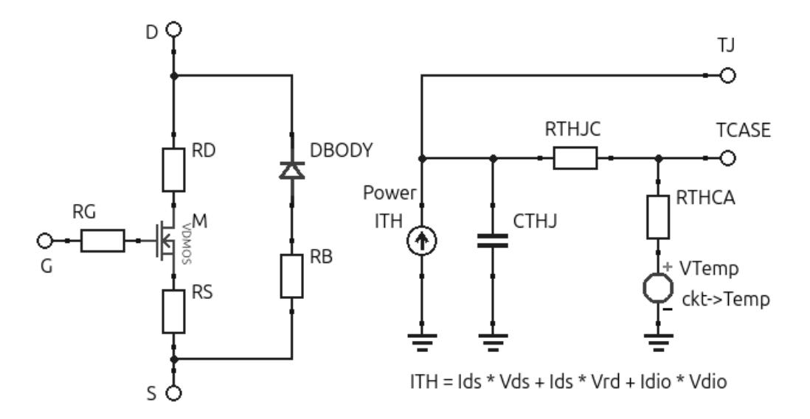

<span id="page-170-0"></span>Figure 7.5: VDMOS model including thermal network

This model does not have a level parameter. It is invoked by the VDMOS token preceding the parameters on the .model line. P-channel or n-channel are selected by the model parameter PCHAN and NCHAN. If no flag is given, n-channel is the default. Standard MOS instance parameters W and L are not acknowledged because they are no design parameters and are not provided by the device manufacturers.

The following 'parameters' in the .model line are no model parameters, but serve information purposes for the user: mfg=..., Vds=..., Ron=..., and Qg=... They are ignored by ngspice.

General form:

```
MXXXXXXX nd ng ns mname <m=val> <temp=t> <dtemp=t>
.model mname VDMOS <Pchan> <parameters>
```

#### Example:

#### M1 24 2 0 IXTH48P20P

- .MODEL IXTH48P20P VDMOS Pchan Vds=200 VTO=-4 KP=10 Lambda=5m
- + Mtriode=0.3 Ksubthres=120m Rs=10m Rd=20m Rds=200e6
- + Cgdmax=6000p Cgdmin=100p A=0.25 Cgs=5000p Cjo=9000p
- + Is=2e-6 Rb=20m BV=200 IBV=250e-6 NBV=4 TT=260e-9

#### VDMOS instance parameters

| Name    | Parameter                   | Units | Default | Example |
|---------|-----------------------------|-------|---------|---------|
| m       | device multiplier           | -     | 1       | -       |
| off     | Device initially off        | -     | 0       |         |
| icvds   | Initial D-S voltage         | V     | 0.0     |         |
| icvgs   | Initial G-S voltage         | V     | 0.0     |         |
| temp    | device temperature          | ◦C    | 27      | 100     |
| dtemp   | device temperature          | ◦C    | 0.0     | 50      |
|         | difference                  |       |         |         |
| ic      | Vector of D-S, G-S voltages | V     | 0.0     |         |
| thermal | Thermal model switch        | -     | -       |         |
|         | on/off                      |       |         |         |

#### VDMOS model parameters

| Name      | Parameter                                         | Units           | Default           | Example |
|-----------|---------------------------------------------------|-----------------|-------------------|---------|
| VDMOS     | select VDMOS model                                | -<br>must given |                   | -       |
| NCHAN     | nch type transistor<br>-<br>default, if not given |                 | -                 |         |
| PCHAN     | pch type transistor                               | -               | required, if PMOS | -       |
| VTO       | Zero-bias threshold voltage                       | V               | 3.0               | 4       |
|           | (VT0)                                             |                 |                   |         |
| KP        | Transconductance                                  | A/V<br>2        | 25+10*chantype    | 5.9     |
|           | parameter                                         |                 |                   |         |
| PHI       | Surface potential                                 | V               |                   |         |
| LAMBDA    | Channel length modulation<br>(λ)                  | 1/V             | 0.0               | 0.001   |
| THETA     | Vgs influence on mobility                         | 1/V             | 0.0               | 0.015   |
| RD        | Drain ohmic resistance                            | Ω               | 0.0               | 61m     |
| RS        | Source ohmic resistance                           | Ω               | 0.0               | 18m     |
| RG        | Gate ohmic resistance                             | Ω               | 0.0               | 3       |
| KF        | Flicker noise coefficient                         | -               | 0.0               |         |
| AF        | Flicker noise exponent                            | -               | 1.0               |         |
| TNOM      | Parameter measurement                             | ◦C              | 27                | 25      |
|           | temperature                                       |                 |                   |         |
| RQ        | Quasi saturation resistance                       | Ω               | 0.0               | 0.5     |
|           | fitting parameter                                 |                 |                   |         |
| VQ        | Quasi saturation voltage                          | V               | 0.0               | 100     |
|           | fitting parameter                                 |                 |                   |         |
| MTRIODE   | Conductance multiplier in                         | −               | 1.0               | 0.8     |
|           | triode region                                     |                 |                   |         |
|           |                                                   |                 |                   |         |
| SUBSHIFT  | shift along gate voltage axis                     | V               | 0.0               |         |
|           | in the dual parameter                             |                 |                   |         |
|           | subthreshold model                                |                 |                   |         |
| KSUBTHRES | slope in the single                               | -               | 0.1               | 0.27    |
|           | parameter subthreshold                            |                 |                   |         |
|           | model                                             |                 |                   |         |
|           |                                                   |                 |                   |         |
| BV        | Vds breakdown voltage                             | V               | ∞                 |         |
| IBV       | Current at Vds=bv                                 | A               | 1.0e-10           |         |
| NBV       | Vds breakdown emission                            | -               | 1.0               |         |
|           | coefficient                                       |                 |                   |         |
| RDS       | Drain-source shunt                                | Ω               | ∞                 | 1e7     |
|           | resistance                                        |                 |                   |         |
| RB        | Body diode ohmic                                  | Ω               | 0.0               | 14m     |
|           | resistance                                        |                 |                   |         |
| N         | Body diode emission                               | -               | 1.0               | 1.1     |
|           | coefficient                                       |                 |                   |         |
| TT        | Body diode transit time                           | s               | 0.0               |         |

| Name          | Parameter                  | Units       | Default | Example |
|---------------|----------------------------|-------------|---------|---------|
| EG            | Body diode activation      | eV          | 1.11    |         |
|               | energy for temperature     |             |         |         |
|               | effect on IS               |             |         |         |
| XTI           | Body diode saturation      | -           | 3.0     | 3.2     |
|               | current temperature        |             |         |         |
|               | exponent                   |             |         |         |
| IS            | Body diode saturation      | A           | 1e-14   | 60p     |
|               | current                    |             |         |         |
| VJ            | Body diode junction        | V           | 0.8     |         |
|               | potential                  |             |         |         |
|               |                            |             |         |         |
| FC            | Body diode coefficient for | -           | 0.5     |         |
|               | forward-bias depletion     |             |         |         |
|               | capacitance formula        |             |         |         |
| CJO           | Zero-bias body diode       | F           | 0.5n    | 1.5n    |
|               | junction capacitance       |             |         |         |
| M             | Body diode grading         | -           | 0.5     | 0.6     |
|               | coefficient                |             |         |         |
|               |                            |             |         |         |
| CGDMIN        | Minimum non-linear G-D     | F           | 20p     | 10p     |
|               | capacitance                |             |         |         |
| CGDMAX        | Maximum non-linear G-D     | F           | 2n      | 2.45n   |
|               | capacitance                |             |         |         |
| A             | Non-linear Cgd capacitance | -           | 1       | 0.3     |
|               | parameter                  |             |         |         |
| CGS           | Gate-source capacitance    | F           | 1.4n    | 1.2n    |
|               |                            |             |         |         |
| TCVTH (VTOTC) | Linear Vth0 temperature    | 1/°C        | 0.0     | 0.0065  |
|               | coefficient                |             |         |         |
| MU (BEX)      | Exponent of gain           | -           | -1.5    | -1.27   |
|               | temperature dependency     |             |         |         |
| TEXP0         | Drain resistance rd0       | -           | 1.5     |         |
|               | temperature exponent       |             |         |         |
| TEXP1         | Drain resistance rd1       | -           | 0.3     |         |
|               | temperature exponent       |             |         |         |
| TRD1          | Drain resistance linear    | 1/°C        | 0.0     |         |
|               | temperature coefficient    |             |         |         |
| TRD2          | Drain resistance quadratic | 1/(°C)<br>2 | 0.0     |         |
|               | temperature coefficient    |             |         |         |
| TRG1          | Gate resistance linear     | 1/°C        | 0.0     |         |
|               | temperature coefficient    |             |         |         |
| TRG2          | Gate resistance quadratic  | 1/(°C)<br>2 | 0.0     |         |
|               | temperature coefficient    |             |         |         |
|               |                            |             |         |         |
| TRS1          | Source resistance linear   | 1/°C        | 0.0     |         |

| Name        | Parameter                   | Units       | Default    | Example |
|-------------|-----------------------------|-------------|------------|---------|
| TRS2        | Source resistance quadratic | 1/(°C)<br>2 | 0.0        |         |
|             | temperature coefficient     |             |            |         |
| TRB1        | Body resistance linear      | 1/°C        | 0.0        |         |
|             | temperature coefficient     |             |            |         |
| TRB2        | Body resistance quadratic   | 1/(°C)<br>2 | 0.0        |         |
|             | temperature coefficient     |             |            |         |
| TKSUBTHRES1 | Linear temperature          | 1/°C        | 0.0        |         |
|             | coefficient of ksubthres    |             |            |         |
| TKSUBTHRES2 | Quadratic temperature       | 1/(°C)<br>2 | 0.0        |         |
|             | coefficient of ksubthres    |             |            |         |
|             |                             |             |            |         |
| RTHJC       | Thermal resistance          | K/W         | 1.0<br>0.4 |         |
|             | junction-case               |             |            |         |
| CTHJ        | Thermal capacitance         | J/K         | 10e-6      | 5e-3    |
| RTHCA       | Thermal resistance          | K/W         | 1000       |         |
|             | case-ambient (w/o heatsink) |             |            |         |

#### VDMOS electro-thermal model

Power electronic devices behavior the effect of self-heating effect. That means that the dissipated power has an impact to the electrical behavior of the terminal currents. To minimize this effect and to protect the element from thermal destruction heat sinks are supplied to this kind of power devices.

The ngspice VDMOS model has introduced an electro-thermal approach by stamping additional elements into the circuit matrix and by iteration the additional current control inside the spice solver.

The transistor now has 5 terminals. Besides D, G, and S we have TJ and TCASE. The additional terminals must be activated by the device switch THERMAL. Heat is generated in the MOS channel and peripheral elements like resistors, its temperature is available and may be measured at node TJ, and is fed back internally into the device equations. Within the transistor package the heat is flowing from the channel to the metal surface of the case, at terminal TCASE. Here you may connect a heat sink, to offer a flow path for the heat away from the device. The internal heat resistance is RTHJC (junction to case), a typical data sheet value. The model also includes the heat capacitance CTHJ of the semiconductor die and package (typically not available in the data sheet, so to be estimated only). Internal model resistor RTHCA (case to ambient) is connected to internal voltage source with a value of circuit temperature Tamb and act as an alternative for a missing external heat sink.

The following example show the usage of ngspice electro-thermal model including a simple heat sink:

#### General form:

MXXXXXXX nd ng ns tj tc mname thermal <m=val> <temp=t> <dtemp=t>

#### Example:

```
M1 24 2 0 tj tc IXTH48P20P thermal
rcs tc 1 0.1
csa 1 0 30m
rsa 1 amb 1.3
VTamb tamb 0 25
.MODEL IXTH48P20P VDMOS Pchan Vds=200 VTO=-4 KP=10 Lambda=5m
+ Mtriode=0.3 Ksubthres=120m Rs=10m Rd=20m Rds=200e6
+ Cgdmax=6000p Cgdmin=100p A=0.25 Cgs=5000p Cjo=9000p
+ Is=2e-6 Rb=20m BV=200 IBV=250e-6 NBV=4 TT=260e-9
+ Rthjc=0.4 Cthj=5e-3
```

# <span id="page-176-3"></span><span id="page-176-0"></span>Chapter 8

# Mixed-Mode and Behavioral Modeling with XSPICE

Ngspice implements XSPICE extensions for behavioral and mixed-mode (analog and digital) modeling. In the XSPICE framework this is referred to as code level modeling. Behavioral modeling may benefit dramatically because XSPICE offers a means to add analog functionality programmed in C. Many examples (amplifiers, oscillators, filters ...) are presented in the following. Even more flexibility is available because you may define your own models and use them in addition and in combination with all the already existing ngspice functionality. Digital and mixed mode simulation is sped up significantly by simulating the digital part in an event driven manner, in that state equations use only a few allowed states and are evaluated only during switching, and not continuously in time and signal as in a pure analog simulator.

This chapter describes the predefined models available in ngspice, stemming from the original XSPICE simulator or being added to enhance the usability. The instructions for writing new code models are given in Chapt. [24.](#page-590-0)

To make use of the XSPICE extensions, you need to compile them in. Linux, CYGWIN, MINGW and other users may add the flag --enable-xspice to their ./configure command and then recompile. The pre-built ngspice for Windows distribution has XSPICE already enabled. For detailed compiling instructions see Chapt. [28.1.](#page-728-1)

# <span id="page-176-1"></span>8.1 Code Model Element & .MODEL Cards

## <span id="page-176-2"></span>8.1.1 Syntax

Ngspice includes a library of predefined 'Code Models' that can be placed within any circuit description in a manner similar to that used to place standard device models. Code model instance cards always begin with the letter 'A', and always make use of a .MODEL card to describe the code model desired. Section [24](#page-590-0) of this document goes into greater detail as to how a code model similar to the predefined models may be developed, but once any model is created and linked into the simulator it may be placed using one instance card and one .MODEL card (note here we conform to the SPICE custom of referring to a single logical line of information as a 'card'). As an example, the following uses a predefined 'gain' code model taking as an input some value on node 1, multiplies it by a gain of 5.0, and outputs the new value to node 2. Note that, by convention, input ports are specified first on code models. Output ports follow the inputs.

#### Example:

```
a1 1 2 amp
.model amp gain(gain=5.0)
```

In this example the numerical values picked up from single-ended (i.e. ground referenced) input node 1 and output to single-ended output node 2 will be voltages, since in the Interface Specification File for this code model (i.e., gain), the default port type is specified as a voltage (more on this later). However, if you didn't know this, the following modifications to the instance card could be used to insure it:

#### Example:

```
a1 %v(1) %v(2) amp
.model amp gain(gain=5.0)
```

The specification %v preceding the input and output node numbers of the instance card indicate to the simulator that the inputs to the model should be single-ended voltage values. Other possibilities exist, as described later.

Some of the other features of the instance and .MODEL cards are worth noting. Of particular interest is the portion of the .MODEL card that specifies gain=5.0. This portion of the card assigns a value to a parameter of the 'gain' model. There are other parameters that can be assigned values for this model, and in general code models will have several. In addition to numeric values, code model parameters can take non-numeric values (such as TRUE and FALSE), and even vector values. All of these topics will be discussed at length in the following pages. In general, however, the instance and .MODEL cards that define a code model will follow the abstract form described below. This form illustrates that the number of inputs and outputs and the number of parameters that can be specified is relatively open-ended and can be interpreted in a variety of ways (note that angle-brackets '<' and '>' enclose optional inputs):

#### Example:

```
AXXXXXXX <%v,%i,%vd,%id,%g,%gd,%h,%hd, or %d>
+ <[> <~><%v,%i,%vd,%id,%g,%gd,%h,%hd, or %d>
+ <NIN1 or +NIN1 -NIN1 or "null">
+ <~>...<NIN2.. <]> >
+ <%v,%i,%vd,%id,%g,%gd,%h,%hd,%d or %vnam>
+ <[> <~><%v,%i,%vd,%id,%g,%gd,%h,%hd,
      or %d><NOUT1 or +NOUT1 -NOUT1>
+ <~>...<NOUT2.. <]>>
+ MODELNAME
.MODEL MODELNAME MODELTYPE
+ <( PARAMNAME1= <[> VAL1 <VAL2... <]>> PARAMNAME2..>)>
```

Square brackets ([ ]) are used to enclose vector input nodes. In addition, these brackets are used to delineate vectors of parameters.

The literal string 'null', when included in a node list, is interpreted as no connection at that input to the model. 'Null' is not allowed as the name of a model's input or output if the model only has one input or one output. Also, 'null' should only be used to indicate a missing connection for a code model; use on other XSPICE component is not interpreted as a missing connection, but will be interpreted as an actual node name.

The tilde, '~', when prepended to a digital node name, specifies that the logical value of that node be inverted prior to being passed to the code model. This allows for simple inversion of input and output polarities of a digital model in order to handle logically equivalent cases and others that frequently arise in digital system design. The following example defines a NAND gate, one input of which is inverted:

```
a1 [~1 2] 3 nand1
.model nand1 d_nand (rise_delay=0.1 fall_delay=0.2)
```

The optional symbols %v, %i, %vd, etc. specify the type of port the simulator is to expect for the subsequent port or port vector. The meaning of each symbol is given in Table [8.1.](#page-179-0)

The symbols described in Table [8.1](#page-179-0) may be omitted if the default port type for the model is desired. Note that non-default port types for multi-input or multi-output (vector) ports must be specified by placing one of the symbols in front of EACH vector port. On the other hand, if all ports of a vector port are to be declared as having the same non-default type, then a symbol may be specified immediately prior to the opening bracket of the vector. The following examples should make this clear:

```
Example 1: - Specifies two differential voltage connections, one
             to nodes 1 & 2, and one to nodes 3 & 4.
```

|          | Port Type Modifiers                                                                                                                                                                                                      |
|----------|--------------------------------------------------------------------------------------------------------------------------------------------------------------------------------------------------------------------------|
| Modifier | Interpretation                                                                                                                                                                                                           |
| %v       | represents a single-ended voltage port - one node name or number is expected<br>for each port.                                                                                                                           |
| %i       | represents a single-ended current port - one node name or number is expected<br>for each port.                                                                                                                           |
| %g       | represents a single-ended voltage-input, current-output (VCCS) port - one<br>node name or number is expected for each port.<br>This type of port is auto<br>matically an input/output.                                   |
| %h       | represents a single-ended current-input, voltage-output (CCVS) port - one<br>node name or number is expected for each port.<br>This type of port is auto<br>matically an input/output.                                   |
| %d       | represents a digital port - one node name or number is expected for each port.<br>This type of port may be either an input or an output.                                                                                 |
| %vnam    | represents the name of a voltage source, the current through which is taken as<br>an input. This notation is provided primarily in order to allow models defined<br>using SPICE2G6 syntax to operate properly in XSPICE. |
| %vd      | represents a differential voltage port - two node names or numbers are ex<br>pected for each port.                                                                                                                       |
| %id      | represents a differential current port - two node names or numbers are ex<br>pected for each port.                                                                                                                       |
| %gd      | represents a differential VCCS port - two node names or numbers are expected<br>for each port.                                                                                                                           |
| %hd      | represents a differential CCVS port - two node names or numbers are expected<br>for each port.                                                                                                                           |

<span id="page-179-0"></span>Table 8.1: Port Type Modifiers

```
%vd [1 2 3 4]
Example 2: - Specifies two single-ended connections to node 1 and
             at node 2, and one differential connection to
             nodes 3 & 4.
   %v [1 2 %vd 3 4]
Example 3: - Identical to the previous example...parenthesis
             are added for additional clarity.
   %v [1 2 %vd(3 4)]
Example 4: - Specifies that the node numbers are to be treated in the
             default fashion for the particular model.
             If this model had '%v" as a default for this
             port, then this notation would represent four single-ended
             voltage connections.
   [1 2 3 4]
```

The parameter names listed on the .MODEL card must be identical to those named in the code model itself. The parameters for each predefined code model are described in detail in Sections [8.2](#page-182-0) (analog), [8.3](#page-235-1) (Hybrid, A/D) and [8.4](#page-247-0) (digital). The steps required in order to specify parameters for user-defined models are described in Chapter [24.](#page-590-0)

## <span id="page-180-0"></span>8.1.2 Examples

The following is a list of instance card and associated .MODEL card examples showing use of predefined models within an XSPICE deck:

```
a1 1 2 amp
.model amp gain(in_offset=0.1 gain=5.0 out_offset=-0.01)
a2 %i[1 2] 3 sum1
.model sum1 summer(in_offset=[0.1 -0.2] in_gain=[2.0 1.0]
+ out_gain=5.0 out_offset=-0.01)
a21 %i[1 %vd(2 5) 7 10] 3 sum2
.model sum2 summer(out_gain=10.0)
a5 1 2 limit5
.model limit5 limit(in_offset=0.1 gain=2.5
+ out_lower_limit=-5.0 out_upper_limit=5.0 limit_range=0.10
+ fraction=FALSE)
a7 2 %id(4 7) xfer_cntl1
.model xfer_cntl1 pwl(x_array=[-2.0 -1.0 2.0 4.0 5.0]
+ y_array=[-0.2 -0.2 0.1 2.0 10.0]
```

```
+ input_domain=0.05 fraction=TRUE)
a8 3 %gd(6 7) switch3
.model switch3 aswitch(cntl_off=0.0 cntl_on=5.0 r_off=1e6
+ r_on=10.0 log=TRUE)
```

## <span id="page-181-0"></span>8.1.3 Search path for file input

Several code models (filesource [8.2.9,](#page-194-0) d\_source [8.4.21,](#page-275-0) d\_state [8.4.18\)](#page-268-0) call additional files for supply of input data. A call to file="path/filename" (or input\_file=, state\_file=) in the .model card will start a search sequence for finding the file. path may be an absolute path. If path is omitted or is a relative path, filename is looked for according to the following search list:

Infile\_Path/<path/filename> (Infile\_Path is the path of the input file \*.sp containing the netlist)

NGSPICE\_INPUT\_DIR/<path/filename> (where an additional path is set by the environmental variable)

<path/filename> (where the search is relative to the current directory (OS dependent))

## <span id="page-181-1"></span>8.1.4 Code model location and assessment

To make use of the XSPICE extensions, you have to compile ngspice accordingly (see Chapt. [28.1\)](#page-728-1). ngspice then is prepared to load and use the code models. At the same time the code models are re-made. They are, however, not linked into ngspice at compile time, but reside in extra shared libraries or dlls, with names analog.cm, digital.cm, spice2poly.cm, xtradev.cm, xtraevt.cm, and table.cm. At run time, with XSPICE enabled, they are loaded dynamically into ngspice by the command codemodel [\(13.5.15\)](#page-400-0). The sequence to load the codemodels is: Upon start-up ngspice locates, reads, and executes spinit, the standard initialization file [\(12.5\)](#page-361-0). Within spinit, you will find the commands to load the codemodels, typically with a path for the code models relative to the current working directory (the location of ngspice, in case of shared ngspice the location of the caller).

If you don't want to make use of spinit, you may run a script in ngspice, before loading any circuit, which contains the codemodel commands. When using shared ngspice, one may issue the codemodel commands directly after initialization, with absolute path or path relative to the current working directory.

In a standard ngspice installation in MS Windows, the codemodels are located in ../lib/ngspice, e.g. in C:\Spice64\lib\ngspice (see also [28.2.1\)](#page-736-1).

In Linux, it depends on the OS invocation. In openSUSE you may find the codemodels in /usr/local/lib64/ngspice, while ngspice resides in /usr/local/bin.

# <span id="page-182-2"></span><span id="page-182-0"></span>8.2 Analog Models

The following analog models are supplied with XSPICE. The descriptions included consist of the model Interface Specification File and a description of the model's operation. This is followed by an example of a simulator-deck placement of the model, including the .MODEL card and the specification of all available parameters.

## <span id="page-182-1"></span>8.2.1 Gain

NAME\_TABLE:

C\_Function\_Name: cm\_gain Spice\_Model\_Name: gain

Description: "A simple gain block"

PORT\_TABLE:

Port Name: in out Description: "input" "output" Direction: in out Default\_Type: v v

Allowed\_Types: [v,vd,i,id,vnam] [v,vd,i,id]

Vector: no no Vector.Bounds: - - Null.Allowed: no no

PARAMETER\_TABLE:

Parameter\_Name: in\_offset gain out\_offset Description: "input offset" "gain" "output offset" Data\_Type: real real real Default\_Value: 0.0 1.0 0.0 Limits: - - - Vector: no no no Vector\_Bounds: - - - Null\_Allowed: yes yes yes

Description: This function is a simple gain block with optional offsets on the input and the output. The input offset is added to the input, the sum is then multiplied by the gain, and the result is produced by adding the output offset. This model will operate in DC, AC, and Transient analysis modes.

#### Example:

```
a1 1 2 amp
.model amp gain(in_offset=0.1 gain=5.0
+ out_offset=-0.01)
```

## <span id="page-183-0"></span>8.2.2 Summer

NAME\_TABLE:

C\_Function\_Name: cm\_summer Spice\_Model\_Name: summer

Description: "A summer block"

PORT\_TABLE:

Port Name: in out Description: "input vector" "output" Direction: in out Default\_Type: v v

Allowed\_Types: [v,vd,i,id,vnam] [v,vd,i,id]

Vector: yes no Vector\_Bounds: - - Null\_Allowed: no no

PARAMETER\_TABLE:

Parameter\_Name: in\_offset in\_gain

Description: "input offset vector" "input gain vector"

Data\_Type: real real Default\_Value: 0.0 1.0 Limits: - - Vector: yes yes Vector\_Bounds: in in Null\_Allowed: yes yes

PARAMETER\_TABLE:

Parameter\_Name: out\_gain out\_offset Description: "output gain" "output offset"

Data\_Type: real real Default\_Value: 1.0 0.0 Limits: - - Vector: no no Vector\_Bounds: - - Null\_Allowed: yes yes

Description: This function is a summer block with 2-to-N input ports. Individual gains and offsets can be applied to each input and to the output. Each input is added to its respective offset and then multiplied by its gain. The results are then summed, multiplied by the output gain and added to the output offset. This model will operate in DC, AC, and Transient analysis modes.

#### Example usage:

```
a2 [1 2] 3 sum1
.model sum1 summer(in_offset=[0.1 -0.2] in_gain=[2.0 1.0]
+ out_gain=5.0 out_offset=-0.01)
```

## <span id="page-184-0"></span>8.2.3 Multiplier

NAME\_TABLE:

C\_Function\_Name: cm\_mult Spice\_Model\_Name: mult

Description: "multiplier block"

PORT\_TABLE:

Port\_Name: in out Description: "input vector" "output" Direction: in out Default\_Type: v v

Allowed\_Types: [v,vd,i,id,vnam] [v,vd,i,id]

Vector: yes no Vector\_Bounds: [2 -] - Null\_Allowed: no no

PARAMETER\_TABLE:

Parameter\_Name: in\_offset in\_gain

Description: "input offset vector" "input gain vector"

Data\_Type: real real Default\_Value: 0.0 1.0 Limits: - - Vector: yes yes Vector\_Bounds: in in Null\_Allowed: yes yes

PARAMETER\_TABLE:

Parameter\_Name: out\_gain out\_offset Description: "output gain" "output offset"

Data\_Type: real real Default\_Value: 1.0 0.0 Limits: - - Vector: no no Vector\_Bounds: - - Null\_Allowed: yes yes

Description: This function is a multiplier block with 2-to-N input ports. Individual gains and offsets can be applied to each input and to the output. Each input is added to its respective offset and then multiplied by its gain. The results are multiplied along with the output gain and are added to the output offset. This model will operate in DC, AC, and Transient analysis modes. However, in ac analysis it is important to remember that results are invalid unless only *one* input of the multiplier is connected to a node that i connected to an AC signal (this is exemplified by the use of a multiplier to perform a potentiometer function: one input is DC, the other carries the AC signal).

#### Example SPICE Usage:

```
a3 [1 2 3] 4 sigmult
.model sigmult mult(in_offset=[0.1 0.1 -0.1]
+ in_gain=[10.0 10.0 10.0] out_gain=5.0 out_offset=0.05)
```

## <span id="page-185-0"></span>8.2.4 Divider

NAME\_TABLE:

C\_Function\_Name: cm\_divide Spice\_Model\_Name: divide

Description: "divider block"

PORT\_TABLE:

Port\_Name: num den out Description: "numerator" "denominator" "output" Direction: in in out

Allowed\_Types: [v,vd,i,id,vnam] [v,vd,i,id,vnam] [v,vd,i,id]

Default\_Type: v v v

Vector: no no no Vector\_Bounds: - - - Null\_Allowed: no no no

PARAMETER\_TABLE:

Parameter\_Name: num\_offset num\_gain

Description: "numerator offset" "numerator gain"

Data\_Type: real real Default\_Value: 0.0 1.0 Limits: - - Vector: no no Vector\_Bounds: - - Null\_Allowed: yes yes

PARAMETER\_TABLE:

Parameter\_Name: den\_offset den\_gain

Description: "denominator offset" "denominator gain"

Data\_Type: real real Default\_Value: 0.0 1.0 Limits: - - Vector: no no Vector\_Bounds: - - Null\_Allowed: yes yes

PARAMETER\_TABLE:

Parameter\_Name: den\_lower\_limit

Description: "denominator lower limit"

Data\_Type: real Default\_Value: 1.0e-10

Limits: - Vector: no Vector\_Bounds: - Null\_Allowed: yes

PARAMETER\_TABLE:

Parameter\_Name: den\_domain

Description: "denominator smoothing domain"

Data\_Type: real Default\_Value: 1.0e-10

Limits: - Vector: no Vector\_Bounds: - Null\_Allowed: yes

PARAMETER\_TABLE:

Parameter\_Name: fraction

Description: "smoothing fraction/absolute value switch"

Data\_Type: boolean Default\_Value: false

Limits: - Vector: no Vector\_Bounds: - Null\_Allowed: yes

PARAMETER\_TABLE:

Parameter\_Name: out\_gain out\_offset Description: "output gain" "output offset"

Data\_Type: real real Default\_Value: 1.0 0.0 Limits: - - Vector: no no Vector\_Bounds: - - Null\_Allowed: yes yes

Description: This function is a two-quadrant divider. It takes two inputs; num (numerator) and den (denominator). Divide offsets its inputs, multiplies them by their respective gains, divides the results, multiplies the quotient by the output gain, and offsets the result. The denominator is limited to a value above zero via a user specified lower limit. This limit is approached through a quadratic smoothing function, the domain of which may be specified as a fraction of the lower limit value (default), or as an absolute value. This model will operate in DC, AC and Transient analysis modes. However, in ac analysis it is important to remember that results are invalid unless only *one* input of the divider is connected to a node that is connected to an ac signal (this is exemplified by the use of the divider to perform a potentiometer function: one input is dc, the other carries the ac signal).

#### Example SPICE Usage:

a4 1 2 4 divider

- .model divider divide(num\_offset=0.1 num\_gain=2.5 den\_offset=-0.1
- + den\_gain=5.0 den\_lower\_limit=1e-5 den\_domain=1e-6
- + fraction=FALSE out\_gain=1.0 out\_offset=0.0)

## <span id="page-186-0"></span>8.2.5 Limiter

NAME\_TABLE:

C\_Function\_Name: cm\_limit Spice\_Model\_Name: limit

Description: "limit block"

PORT\_TABLE:

Port Name: in out

Description: "input" "output"

Direction: in out

Default\_Type: v v

Allowed\_Types: [v,vd,i,id] [v,vd,i,id]

Vector: no no Vector\_Bounds: - - Null\_Allowed: no no

PARAMETER\_TABLE:

Parameter\_Name: in\_offset gain Description: "input offset" "gain" Data\_Type: real real Default\_Value: 0.0 1.0 Limits: - - Vector: no no Vector\_Bounds: - - Null\_Allowed: yes yes

PARAMETER\_TABLE:

Parameter\_Name: out\_lower\_limit out\_upper\_limit Description: "output lower limit" "output upper limit"

Data\_Type: real real Default\_Value: 0.0 1.0 Limits: - - Vector: no no Vector\_Bounds: - - Null\_Allowed: yes yes

PARAMETER\_TABLE:

Parameter\_Name: limit\_range

Description: "upper & lower smoothing range"

Data\_Type: real Default\_Value: 1.0e-6

Limits: - Vector: no Vector\_Bounds: - Null\_Allowed: yes

PARAMETER\_TABLE:

Parameter\_Name: fraction

Description: "smoothing fraction/absolute value switch"

Data\_Type: boolean Default\_Value: FALSE

Limits: - Vector: no Vector\_Bounds: - Null\_Allowed: yes

Description: The Limiter is a single input, single output function similar to the Gain Block. However, the output of the Limiter function is restricted to the range specified by the output lower and upper limits. This model will operate in DC, AC and Transient analysis modes. Note that the limit range is the value *below the upper limit and above the lower limit* at which smoothing of the output begins. For this model, then, the limit range represents the delta *with respect to the output level* at which smoothing occurs. Thus, for an input gain of 2.0 and output limits of 1.0 and -1.0 volts, the output will begin to smooth out at ±0.9 volts, which occurs when the input value is at ±0.4.

Example SPICE Usage:

a5 1 2 limit5

.model limit5 limit(in\_offset=0.1 gain=2.5 out\_lower\_limit=-5.0

+ out\_upper\_limit=5.0 limit\_range=0.10 fraction=FALSE)

## <span id="page-188-0"></span>8.2.6 Controlled Limiter

NAME\_TABLE:

C\_Function\_Name: cm\_climit Spice\_Model\_Name: climit

Description: "controlled limiter block"

PORT\_TABLE:

Port\_Name: in cntl\_upper

Description: "input" "upper lim. control input"

Direction: in in Default\_Type: v v

Allowed\_Types: [v,vd,i,id,vnam] [v,vd,i,id,vnam]

Vector: no no Vector\_Bounds: - - Null\_Allowed: no no

PORT\_TABLE:

Port\_Name: cntl\_lower out Description: "lower limit control input" "output" Direction: in out

Default\_Type: v v

Allowed\_Types: [v,vd,i,id,vnam] [v,vd,i,id]

Vector: no no Vector\_Bounds: - - Null\_Allowed: no no

PARAMETER\_TABLE:

Parameter\_Name: in\_offset gain Description: "input offset" "gain" Data\_Type: real real Default\_Value: 0.0 1.0 Limits: - - Vector: no no Vector\_Bounds: - - Null\_Allowed: yes yes

PARAMETER\_TABLE:

Parameter\_Name: upper\_delta lower\_delta

Description: "output upper delta" "output lower delta"

Data\_Type: real real Default\_Value: 0.0 0.0 Limits: - - Vector: no no

Vector\_Bounds: - - Null\_Allowed: yes yes

PARAMETER\_TABLE:

Parameter\_Name: limit\_range fraction

Description: "upper & lower sm. range" "smoothing %/abs switch"

Data\_Type: real boolean Default\_Value: 1.0e-6 FALSE

Limits: - - Vector: no no Vector\_Bounds: - - Null\_Allowed: yes yes

Description: The Controlled Limiter is a single input, single output function similar to the Gain Block. However, the output of the Limiter function is restricted to the range specified by the output lower and upper limits. This model will operate in DC, AC, and Transient analysis modes. Note that the limit range is the value *below the cntl\_upper limit and above the cntl\_lower limit* at which smoothing of the output begins (minimum positive value of voltage must exist between the *cntl\_upper* input and the *cntl\_lower* input at all times). For this model, then, the limit range represents the delta *with respect to the output level* at which smoothing occurs. Thus, for an input gain of 2.0 and output limits of 1.0 and -1.0 volts, the output will begin to smooth out at ±0.9 volts, which occurs when the input value is at ±0.4. Note also that the Controlled Limiter code tests the input values of *cntl*\_*upper* and *cntl*\_*lower* to make sure that they are spaced far enough apart to guarantee the existence of a linear range between them. The range is calculated as the difference between (*cntl*\_*upper* −*upper*\_*delta*−*limit*\_*range*) and (*cntl*\_*lower* + *lower*\_*delta* + *limit*\_*range*) and must be greater than or equal to zero. Note that when the limit range is specified as a fractional value, the limit range used in the above is taken as the calculated fraction of the difference between *cntl*\_*upper* and *cntl*\_*lower*. Still, the potential exists for too great a limit range value to be specified for proper operation, in which case the model will return an error message.

```
Example SPICE Usage:
a6 3 6 8 4 varlimit
.
.
.model varlimit climit(in_offset=0.1 gain=2.5 upper_delta=0.0
+ lower_delta=0.0 limit_range=0.10 fraction=FALSE)
```

## <span id="page-189-0"></span>8.2.7 PWL Controlled Source

NAME\_TABLE:

C\_Function\_Name: cm\_pwl Spice\_Model\_Name: pwl

Description: "piecewise linear controlled source"

PORT\_TABLE:

Port\_Name: in out

Description: "input" "output"

Direction: in out

Default\_Type: v v

Allowed\_Types: [v,vd,i,id,vnam] [v,vd,i,id]

Vector: no no Vector\_Bounds: - - Null\_Allowed: no no

PARAMETER\_TABLE:

Parameter\_Name: x\_array y\_array

Description: "x-element array" "y-element array"

Data\_Type: real real Default\_Value: - - Limits: - - Vector: yes yes Vector\_Bounds: [2 -] [2 -] Null\_Allowed: no no

PARAMETER\_TABLE:

Parameter\_Name: input\_domain fraction

Description: "input sm. domain" "smoothing %/abs switch"

Data\_Type: real boolean Default\_Value: 0.01 TRUE Limits: [1e-12 0.5] - Vector: no no Vector\_Bounds: - -

Null\_Allowed: yes yes

STATIC\_VAR\_TABLE:

Static\_Var\_Name: last\_x\_value Data\_Type: pointer

Description: "iteration holding variable for limiting"

Description: The Piece-Wise Linear Controlled Source is a single input, single output function similar to the Gain Block. However, the output of the PWL Source is not necessarily linear for all values of input. Instead, it follows an I/O relationship specified by you via the x\_array and y\_array coordinates. This is detailed below.

The x\_array and y\_array values represent vectors of coordinate points on the x and y axes, respectively. The x\_array values are progressively increasing input coordinate points, and the associated y\_array values represent the outputs at those points. There may be as few as two (x\_array[n], y\_array[n]) pairs specified, or as many as memory and simulation speed allow. This permits you to very finely approximate a non-linear function by capturing multiple input-output coordinate points.

Two aspects of the PWL Controlled Source warrant special attention. These are the handling of endpoints and the smoothing of the described transfer function near coordinate points.

In order to fully specify outputs for values of in outside of the bounds of the PWL function (i.e., less than x\_array[0] or greater than x\_array[n], where n is the largest userspecified coordinate index), the PWL Controlled Source model extends the slope found between the lowest two coordinate pairs and the highest two coordinate pairs. This has the effect of making the transfer function completely linear for in less than x\_array[0] and in greater than x\_array[n]. It also has the potentially subtle effect of unrealistically causing an output to reach a very large or small value for large inputs. You should thus keep in mind that the PWL Source does not inherently provide a limiting capability. In order to diminish the potential for non-convergence of simulations when using the PWL block, a form of smoothing around the x\_array, y\_array coordinate points is necessary. This is due to the iterative nature of the simulator and its reliance on smooth first derivatives of transfer functions in order to arrive at a matrix solution. Consequently, the input\_domain and fraction parameters are included to allow you some control over

the amount and nature of the smoothing performed.

Fraction is a switch that is either TRUE or FALSE. When TRUE (the default setting), the simulator assumes that the specified input domain value is to be interpreted as a fractional figure. Otherwise, it is interpreted as an absolute value. Thus, if fraction=TRUE and input\_domain=0.10, The simulator assumes that the smoothing radius about each coordinate point is to be set equal to 10% of the length of either the x\_array segment above each coordinate point, or the x\_array segment below each coordinate point. The specific segment length chosen will be the smallest of these two for each coordinate point. On the other hand, if fraction=FALSE and input\_domain=0.10, then the simulator will begin smoothing the transfer function at 0.10 volts (or amperes) below each x\_array coordinate and will continue the smoothing process for another 0.10 volts (or amperes) above each x\_array coordinate point. Since the overlap of smoothing domains is not allowed, checking is done by the model to ensure that the specified input domain value is

One subtle consequence of the use of the fraction=TRUE feature of the PWL Controlled Source is that, in certain cases, you may inadvertently create extreme smoothing of functions by choosing inappropriate coordinate value points. This can be demonstrated by considering a function described by three coordinate pairs, such as (-1,-1), (1,1), and (2,1). In this case, with a 10% input\_domain value specified (fraction=TRUE, input\_domain=0.10), you would expect to see rounding occur between in=0.9 and in=1.1, and nowhere else. On the other hand, if you were to specify the same function using the coordinate pairs (-100,-100), (1,1) and (201,1), you would find that rounding occurs between in=-19 and in=21. Clearly in the latter case the smoothing might cause an excessive divergence from the intended linearity above and below in=1.

```
Example SPICE Usage:
a7 in out xfer_cntl1
.model xfer_cntl1 pwl(x_array=[-2.0 -1.0 2.0 4.0 5.0]
+ y_array=[-0.2 -0.2 0.1 2.0 10.0]
+ input_domain=0.05 fraction=TRUE)
```

## <span id="page-191-0"></span>8.2.8 PWL Time Controlled Source with optional edge smoothing

NAME\_TABLE:

not excessive.

C\_Function\_Name: cm\_pwlts Spice\_Model\_Name: pwlts

Description: "piecwise linear controlled source, time input"

PORT\_TABLE:

Port\_Name: out Description: "output" Direction: out Default\_Type: v

Allowed\_Types: [v,vd,i,id]

Vector: no Vector\_Bounds: - Null\_Allowed: no

PARAMETER\_TABLE:

Parameter\_Name: x\_array y\_array

Description: "x-element array" "y-element array"

Data\_Type: real real Default\_Value: - - Limits: - - Vector: yes yes Vector\_Bounds: [2 -] [2 -] Null\_Allowed: no no

PARAMETER\_TABLE:

Parameter\_Name: input\_domain fraction

Description: "input sm. domain" "smoothing %/abs switch"

Data\_Type: real boolean Default\_Value: 0.01 TRUE

Limits: [1e-12 0.5] -

Vector: no no Vector\_Bounds: - - Null\_Allowed: yes yes

PARAMETER\_TABLE:

Parameter\_Name: limit

Description: "const or linearily extrapolated output"

Data\_Type: boolean Default\_Value: FALSE Limits: - Vector: no

Vector\_Bounds: - Null\_Allowed: yes

STATIC\_VAR\_TABLE:

Static\_Var\_Name: last\_x\_value

Data\_Type: pointer Vector: no

Description: "iteration holding variable for limiting"

STATIC\_VAR\_TABLE:

Static\_Var\_Name: x y

Data\_Type: pointer pointer

Description: "time array" "y-coefficient array"

Description: The Piece-Wise Linear Time Controlled Source is a time input, single output function. The output follows an time/output relationship specified by you via the x\_array and y\_array coordinates. This is detailed below.

The x\_array and y\_array values represent vectors of coordinate points on the x and y axes, respectively. The x\_array values are progressively increasing positive input coordinate points (minimum is 0), and the associated y\_array values represent the outputs at those points. There may be as few as two (x\_array[n], y\_array[n]) pairs specified, or as many as memory and simulation speed allow. This permits you to very finely approximate a non-linear time dependent waveform by capturing multiple input-output coordinate points.

Two aspects of the PWLTS Controlled Source warrant special attention. These are the handling of endpoints and the smoothing of the described transfer function near coordinate points.

In order to fully specify outputs for values of in outside of the bounds of the PWLTS function (i.e., less than x\_array[0] (with x\_array[0] >= 0 always) or greater than x\_array[n], where n is the largest user-specified coordinate index), the PWLTS Time Controlled Source model extends the slope found between the lowest two coordinate pairs and the highest two coordinate pairs. This has the effect of making the transfer function completely linear for times less than x\_array[0] and times greater than x\_array[n]. It also has the potentially subtle effect of unrealistically causing an output to reach a very large or small value for large input times.

In order to diminish the potential for non-convergence of simulations when using the PWL block, a form of smoothing around the x\_array, y\_array coordinate points is necessary. This is due to the iterative nature of the simulator and its reliance on smooth first derivatives of transfer functions in order to arrive at a matrix solution. Consequently, the input\_domain and fraction parameters are included to allow you some control over the amount and nature of the smoothing performed.

Fraction is a switch that is either TRUE or FALSE. When TRUE (the default setting), the simulator assumes that the specified input domain value is to be interpreted as a fractional figure. Otherwise, it is interpreted as an absolute value. Thus, if fraction=TRUE and input\_domain=0.10, the simulator assumes that the smoothing radius about each coordinate point is to be set equal to 10% of the length of either the x\_array segment above each coordinate point, or the x\_array segment below each coordinate point. The specific segment length chosen will be the smallest of these two for each coordinate point. On the other hand, if fraction=FALSE and input\_domain=0.10, then the simulator will begin smoothing the transfer function at 0.10 seconds below each x\_array coordinate and will continue the smoothing process for another 0.10 seconds above each x\_array coordinate point. Since the overlap of smoothing domains is not allowed, checking is done by the model to ensure that the specified input domain value is not excessive.

One subtle consequence of the use of the fraction=TRUE feature of the PWL Time Controlled Source is that, in certain cases, you may inadvertently create extreme smoothing of functions by choosing inappropriate coordinate value points. This can be demonstrated by considering a function described by three coordinate pairs, such as (0,-1), (2,1), and (3,1). In this case, with a 10% input\_domain value specified (fraction=TRUE, input\_domain=0.10), you would expect to see rounding occur between time=1.9 and time=2.1, and nowhere else. On the other hand, if you were to specify the same function using the coordinate pairs (0,-100), (101,1) and (301,1), you would find that rounding occurs between time=81 and time=121. Clearly in the latter case the smoothing might cause an excessive divergence from the intended linearity above and below time=101.

```
Example SPICE Usage:
a8 out pwl_cntl1
.model pwl_cntl1 pwlts(x_array=[0 1m 1.1m 2m 2.1m]
+ y_array=[-0.2 -0.2 0.6 0.6 0.35]
+ input_domain=0.2 fraction=TRUE
+ limit=TRUE)
```

## <span id="page-194-0"></span>8.2.9 Filesource (PWL sourced from file)

NAME\_TABLE:

C\_Function\_Name: cm\_filesource Spice\_Model\_Name: filesource Description: "File Source"

PORT\_TABLE:

Port\_Name: out Description: "output" Direction: out Default\_Type: v

Allowed\_Types: [v,vd,i,id]

Vector: yes Vector\_Bounds: [1 -] Null\_Allowed: no

PARAMETER\_TABLE:

Parameter\_Name: timeoffset timescale Description: "time offset" "timescale"

Data\_Type: real real Default\_Value: 0.0 1.0 Limits: - - Vector: no no Vector\_Bounds: - - Null\_Allowed: yes yes

PARAMETER\_TABLE:

Parameter\_Name: timerelative amplstep

Description: "relative time" "step amplitude"

Data\_Type: boolean boolean Default\_Value: FALSE FALSE Limits: - - Vector: no no

Vector\_Bounds: - - Null\_Allowed: yes yes

PARAMETER\_TABLE:

Parameter\_Name: amploffset amplscale Description: "ampl offset" "amplscale"

Data\_Type: real real Default\_Value: - - Limits: - - Vector: yes yes Vector\_Bounds: [1 -] [1 -] Null\_Allowed: yes yes

PARAMETER\_TABLE:

Parameter\_Name: file

Description: "file name"

Data\_Type: string

Default\_Value: "filesource.txt"

Limits: - Vector: no Vector\_Bounds: - Null\_Allowed: yes

Description: The File Source is similar to the Piece-Wise Linear (PWL) Source, except that the waveform data is read from a file instead of being taken from parameter vectors. The file format is line oriented ASCII. '#' and ';' are comment characters; all characters from a comment character until the end of the line are ignored. Each line consists of two or more real values. The first value is the time; subsequent values correspond to the outputs. Values are separated by spaces. Time values are absolute and must be monotonically increasing, unless timerelative is set to TRUE, in which case the values specify the interval between two samples and must be positive. Waveforms may be scaled and shifted in the time dimension by setting timescale and timeoffset.

Amplitudes can also be scaled and shifted using amplscale and amploffset. Amplitudes are normally interpolated between two samples, unless amplstep is set to TRUE.

Note: The file named by the parameter filename in file="filename" is sought after according to a search list described in [8.1.3.](#page-181-0)

```
Example SPICE Usage:
a8 %vd([1 0 2 0]) filesrc
.
.
.model filesrc filesource (file="sine.m" amploffset=[0 0] amplscale=[1 1]
+ timeoffset=0 timescale=1
+ timerelative=false amplstep=false)
Example input file:
# name: sine.m
# two output ports
# column 1: time
# columns 2, 3: values
0 0 1
3.90625e-09 0.02454122852291229 0.9996988186962042
7.8125e-09 0.04906767432741801 0.9987954562051724
1.171875e-08 0.07356456359966743 0.9972904566786902
...
```

## <span id="page-195-0"></span>8.2.10 Multi\_input\_PWL\_block

```
NAME_TABLE:
```

C\_Function\_Name: cm\_multi\_input\_pwl Spice\_Model\_Name: multi\_input\_pwl

Description: "multi\_input\_pwl block"

PORT\_TABLE:

Port\_Name: in out Description: "input array" "output" Direction: in out Default\_Type: vd vd Allowed\_Types: [vd,id] [vd,id] Vector: yes no Vector\_Bounds: [2 -] - Null\_Allowed: no no PARAMETER\_TABLE:

Parameter\_Name: x y

Description: "x array" "y array" Data\_Type: real real Default\_Value: - - Limits: - - Vector: yes yes Vector\_Bounds: [2 -] [2 -] Null\_Allowed: no no

PARAMETER\_TABLE:

Parameter\_Name: model

Description: "model type"

Data\_Type: string Default\_Value: "and" Limits: - Vector: no Vector\_Bounds: - Null\_Allowed: yes

Description: Multi-input gate voltage controlled voltage source that supports and or or gating. The x's and y's represent the piecewise linear variation of output (y) as a function of input (x). The type of gate is selectable by the parameter model. In case the model is and, the smallest input determines the output value (i.e. the and function). In case the model is or, the largest input determines the output value (i.e. the or function). The inverse of these functions (i.e. nand and nor) is constructed by complementing the y array.

```
Example SPICE Usage:
a82 [1 0 2 0 3 0] 7 0 pwlm
.
.
.model pwlm multi_input_pwl((x=[-2.0 -1.0 2.0 4.0 5.0]
+ y=[-0.2 -0.2 0.1 2.0 10.0]
+ model="and")
```

## <span id="page-196-0"></span>8.2.11 Analog Switch

NAME\_TABLE:

C\_Function\_Name: cm\_aswitch Spice\_Model\_Name: aswitch

Description: "analog switch"

PORT\_TABLE:

Port Name: cntl\_in out

Description: "input" "resistive output" Direction: in out Default\_Type: v gd Allowed\_Types: [v,vd,i,id] [gd] Vector: no no Vector\_Bounds: - -

PARAMETER\_TABLE:

Parameter\_Name: cntl\_off cntl\_on

Null\_Allowed: no no

Description: "control 'off' value" "control 'on' value"

Data\_Type: real real Default\_Value: 0.0 1.0 Limits: - - Vector: no no Vector\_Bounds: - - Null\_Allowed: yes yes

PARAMETER\_TABLE:

Parameter\_Name: r\_off log

Description: "off resistance" "log/linear switch"

Data\_Type: real boolean Default\_Value: 1.0e12 TRUE Limits: - - Vector: no no Vector\_Bounds: - - Null\_Allowed: yes yes

PARAMETER\_TABLE:

Parameter\_Name: r\_on limit

Description: "on resistance" "set upper and lower

limits to resistance"

Data\_Type: real boolean Default\_Value: 1.0 false Limits: - - Vector: no no Vector\_Bounds: - - Null\_Allowed: yes yes

Description: The Analog Switch is a resistor that varies either logarithmically or linearly between specified values of a controlling input voltage or current. Note that the input is not internally limited when parameter limit is not given. Therefore, if the controlling signal exceeds the specified OFF state or ON state value, the resistance may become excessively large or excessively small (in the case of logarithmic dependence), or may become negative (in the case of linear dependence). For the experienced user, these excursions may prove valuable for modeling certain devices, but in most cases you are advised to add limiting of the controlling input if the possibility of excessive control value variation exists. Alternatively you may set the parameter limit to TRUE. Then the resulting resistance is limited to r\_on or r\_off if the controlling voltage exceeds the given boundaries cntl\_on or cntl\_off. At these boundaries sharp edges in the R(control) characteristics will occur which may lead to convergence problems.

Example SPICE Usage: a8 3 %gd(6 7) switch3 . . .model switch3 aswitch(cntl\_off=0.0 cntl\_on=5.0 r\_off=1e6 + r\_on=10.0 log=TRUE limit=TRUE)

## <span id="page-198-0"></span>8.2.12 Alternative Analog Switch

NAME\_TABLE:

C\_Function\_Name: cm\_pswitch Spice\_Model\_Name: pswitch

Description: "analog switch alternative"

PORT\_TABLE:

Port Name: cntl\_in out

Description: "input" "resistive output"

Direction: inout inout Default\_Type: gd gd Allowed\_Types: [g,gd] [gd] Vector: no no Vector\_Bounds: - - Null\_Allowed: no no

PARAMETER\_TABLE:

Parameter\_Name: cntl\_off cntl\_on

Description: "control 'off' value" "control 'on' value"

Data\_Type: real real Default\_Value: 0.0 1.0 Limits: - - Vector: no no Vector\_Bounds: - - Null\_Allowed: yes yes

PARAMETER\_TABLE:

Parameter\_Name: r\_off log

Description: "off resistance" "log/linear switch"

Data\_Type: real boolean Default\_Value: 1.0e12 TRUE Limits: - - Vector: no no Vector\_Bounds: - - Null\_Allowed: yes yes

PARAMETER\_TABLE:

Parameter\_Name: r\_on r\_cntl\_in

Description: "on resistance" "input resistance for control terminal"

Data\_Type: real real Default\_Value: 1.0 1e12 Limits: - - Vector: no no Vector\_Bounds: - -

Null\_Allowed: yes yes

Description: The Alternative Analog Switch is a resistor that varies either logarithmically or linearly between specified values of a controlling input voltage or current. An input resistance r\_cntl\_in may be specified. The output resistance is limited to r\_on or r\_off. At the control boundaries cntl\_on or cntl\_off the R(control) characteristics are slightly rounded. This behaviour is PSPICE-compatible and instances of this device are generated when parsing PSPICE netlists in compatability mode.

```
Example SPICE Usage:
a9 %g 13 %gd(16 17) switch4
.
.
.model switch4 pswitch(cntl_off=0.0 cntl_on=5.0 r_off=1e6
+ r_on=10.0 r_cntl_in=1e11 log=TRUE)
```

## <span id="page-199-0"></span>8.2.13 Zener Diode

NAME\_TABLE:

C\_Function\_Name: cm\_zener Spice\_Model\_Name: zener

Description: "zener diode"

PORT\_TABLE:

Port Name: z

Description: "zener" Direction: inout Default\_Type: gd Allowed\_Types: [gd] Vector: no Vector\_Bounds: - Null\_Allowed: no

PARAMETER\_TABLE:

Parameter\_Name: v\_breakdown i\_breakdown

Description: "breakdown voltage" "breakdown current"

Data\_Type: real real Default\_Value: - 2.0e-2 Limits: [1.0e-6 1.0e6] [1.0e-9 -]

Vector: no no Vector\_Bounds: - - Null\_Allowed: no yes

PARAMETER\_TABLE:

Parameter\_Name: i\_sat n\_forward

Description: "saturation current" "forward emission coefficient"

Data\_Type: real real Default\_Value: 1.0e-12 1.0 Limits: [1.0e-15 -] [0.1 10]

Vector: no no Vector\_Bounds: - -

Null\_Allowed: yes yes

PARAMETER\_TABLE:

Parameter\_Name: limit\_switch

Description: "switch for on-board limiting (convergence aid)"

Data\_Type: boolean Default\_Value: FALSE

Limits: - Vector: no Vector\_Bounds: - Null\_Allowed: yes

STATIC\_VAR\_TABLE:

Static\_Var\_Name: previous\_voltage

Data\_Type: pointer

Description: "iteration holding variable for limiting"

Description: The Zener Diode models the DC characteristics of most zeners. This model differs from the Diode/Rectifier by providing a user-defined dynamic resistance in the reverse breakdown region. The forward characteristic is defined by only a single point, since most data sheets for zener diodes do not give detailed characteristics in the forward region.

The first three parameters define the DC characteristics of the zener in the breakdown region and are usually explicitly given on the data sheet.

The saturation current refers to the relatively constant reverse current that is produced when the voltage across the zener is negative, but breakdown has not been reached. The reverse leakage current determines the slight increase in reverse current as the voltage across the zener becomes more negative. It is modeled as a resistance parallel to the zener with value v breakdown / i rev.

Note that the limit switch parameter engages an internal limiting function for the zener. This can, in some cases, prevent the simulator from converging to an unrealistic solution if the voltage across or current into the device is excessive. If use of this feature fails to yield acceptable results, the convlimit option should be tried (add the following statement to the SPICE input deck: .options convlimit)

```
Example SPICE Usage:
a9 3 4 vref10
.
.
.model vref10 zener(v_breakdown=10.0 i_breakdown=0.02
+ r_breakdown=1.0 i_rev=1e-6 i_sat=1e-12)
```

## <span id="page-200-0"></span>8.2.14 Current Limiter

NAME\_TABLE:

C\_Function\_Name: cm\_ilimit Spice\_Model\_Name: ilimit

Description: "current limiter block"

PORT\_TABLE:

Port Name: in pos\_pwr

Description: "input" "positive power supply"

Direction: in inout Default\_Type: v g Allowed\_Types: [v,vd] [g,gd] Vector: no no Vector\_Bounds: - - Null\_Allowed: no yes

PORT\_TABLE:

Port Name: neg\_pwr out Description: "negative power supply" "output" Direction: inout inout Default\_Type: g g Allowed\_Types: [g,gd] [g,gd] Vector: no no

Vector\_Bounds: - - Null\_Allowed: yes no

PARAMETER\_TABLE:

Parameter\_Name: in\_offset gain Description: "input offset" "gain" Data\_Type: real real Default\_Value: 0.0 1.0 Limits: - - Vector: no no Vector\_Bounds: - - Null\_Allowed: yes yes

PARAMETER\_TABLE:

Parameter\_Name: r\_out\_source r\_out\_sink

Description: "sourcing resistance" "sinking resistance"

Data\_Type: real real Default\_Value: 1.0 1.0

Limits: [1.0e-9 1.0e9] [1.0e-9 1.0e9]

Vector: no no Vector\_Bounds: - - Null\_Allowed: yes yes

PARAMETER\_TABLE:

Parameter\_Name: i\_limit\_source

Description: "current sourcing limit"

Data\_Type: real Default\_Value: -

Limits: [1.0e-12 -]

Vector: no Vector\_Bounds: - Null\_Allowed: yes

PARAMETER\_TABLE:

Parameter\_Name: i\_limit\_sink

Description: "current sinking limit"

Data\_Type: real Default\_Value: -

Limits: [1.0e-12 -]

Vector: no Vector\_Bounds: - Null\_Allowed: yes

PARAMETER\_TABLE:

Parameter\_Name: v\_pwr\_range i\_source\_range Description: "upper & lower power "sourcing current

supply smoothing range" smoothing range"

Data\_Type: real real Default\_Value: 1.0e-6 1.0e-9 Limits: [1.0e-15 -] [1.0e-15 -]

Vector: no no Vector\_Bounds: - - Null\_Allowed: yes yes

PARAMETER\_TABLE:

Parameter\_Name: i\_sink\_range

Description: "sinking current smoothing range"

Data\_Type: real Default\_Value: 1.0e-9 Limits: [1.0e-15 -]

Vector: no Vector\_Bounds: - Null\_Allowed: yes

PARAMETER\_TABLE:

Parameter\_Name: r\_out\_domain

Description: "internal/external voltage delta smoothing range"

Data\_Type: real Default\_Value: 1.0e-9 Limits: [1.0e-15 -]

Vector: no Vector\_Bounds: - Null\_Allowed: yes

Description: The Current Limiter models the behavior of an operational amplifier or comparator device at a high level of abstraction. All of its pins act as inputs; three of the four also act as outputs. The model takes as input a voltage value from the in connector. It then applies an offset and a gain, and derives from it an equivalent internal voltage (*veq*), which it limits to fall between pos\_pwr and neg\_pwr. If *veq* is greater than the output voltage seen on the out connector, a sourcing current will flow from the output pin. Conversely, if the voltage is less than *vout*, a sinking current will flow into the output pin.

Depending on the polarity of the current flow, either a sourcing or a sinking resistance value (r\_out\_source, r\_out\_sink) is applied to govern the vout/i\_out relationship. The chosen resistance will continue to control the output current until it reaches a maximum value specified by either i\_limit\_source or i\_limit\_sink. The latter mimics the current limiting behavior of many operational amplifier output stages.

During all operation, the output current is reflected either in the pos\_pwr connector current or the neg\_pwr current, depending on the polarity of i\_out. Thus, realistic power consumption as seen in the supply rails is included in the model.

The user-specified smoothing parameters relate to model operation as follows: v\_pwr\_range controls the voltage below vpos\_pwr and above vneg\_pwr inputs beyond which *veq* = *gain*(*vin*+*vo f f set*)is smoothed; i\_source\_range specifies the current below i\_limit\_source at which smoothing begins, as well as specifying the current increment above i\_out=0.0 at which i\_pos\_pwr begins to transition to zero; i\_sink\_range serves the same purpose with respect to i\_limit\_sink and i\_neg\_pwr that i\_source\_range serves for i\_limit\_source and i\_pos\_pwr; r\_out\_domain specifies the incremental value above and below (veq-vout)=0.0 at which r\_out will be set to r\_out\_source and r\_out\_sink, respectively. For values of (veq-vout) less than r\_out\_domain and greater than -r\_out\_domain, r\_out is interpolated smoothly between r\_out\_source and r\_out\_sink.

```
Example SPICE Usage:
a10 3 10 20 4 amp3
.
.
.model amp3 ilimit(in_offset=0.0 gain=16.0 r_out_source=1.0
+ r_out_sink=1.0 i_limit_source=1e-3
+ i_limit_sink=10e-3 v_pwr_range=0.2
+ i_source_range=1e-6 i_sink_range=1e-6
+ r_out_domain=1e-6)
```

## <span id="page-203-0"></span>8.2.15 Hysteresis Block

NAME\_TABLE:

C\_Function\_Name: cm\_hyst Spice\_Model\_Name: hyst

Description: "hysteresis block"

PORT\_TABLE:

Port Name: in out Description: "input" "output" Direction: in out Default\_Type: v v

Allowed\_Types: [v,vd,i,id] [v,vd,i,id]

Vector: no no Vector\_Bounds: - - Null\_Allowed: no no

PARAMETER\_TABLE:

Parameter\_Name: in\_low in\_high

Description: "input low value" "input high value"

Data\_Type: real real Default\_Value: 0.0 1.0 Limits: - - Vector: no no Vector\_Bounds: - - Null\_Allowed: yes yes

PARAMETER\_TABLE:

Parameter\_Name: hyst out\_lower\_limit Description: "hysteresis" "output lower limit" Data\_Type: real real Default\_Value: 0.1 0.0 Limits: [0.0 -] - Vector: no no Vector\_Bounds: - - Null\_Allowed: yes yes

PARAMETER\_TABLE:

Parameter\_Name: out\_upper\_limit input\_domain

Description: "output upper limit" "input smoothing domain"

Data\_Type: real real Default\_Value: 1.0 0.01 Limits: - - Vector: no no

Vector\_Bounds: - - Null\_Allowed: yes yes

PARAMETER\_TABLE:

Parameter\_Name: fraction

Description: "smoothing fraction/absolute value switch"

Data\_Type: boolean Default\_Value: TRUE Limits: - Vector: no Vector\_Bounds: - Null\_Allowed: yes

Description: The Hysteresis block is a simple buffer stage that provides hysteresis of the output with respect to the input. The in\_low and in\_high parameter values specify the center voltage or current inputs about which the hysteresis effect operates. The output values are limited to out\_lower\_limit and out\_upper\_limit. The value of hyst is added to the in\_low and in\_high points in order to specify the points at which the slope of the hysteresis function would normally change abruptly as the input transitions from a low to a high value. Likewise, the value of hyst is subtracted from the in high and in low values in order to specify the points at which the slope of the hysteresis function would normally change abruptly as the input transitions from a high to a low value. In fact, the slope of the hysteresis function is never allowed to change abruptly but is smoothly varied whenever the input domain smoothing parameter is set greater than zero.

```
Example SPICE Usage:
a11 1 2 schmitt1
.
.
.model schmitt1 hyst(in_low=0.7 in_high=2.4 hyst=0.5
+ out_lower_limit=0.5 out_upper_limit=3.0
+ input_domain=0.01 fraction=TRUE)
```

## <span id="page-204-0"></span>8.2.16 Differentiator

NAME\_TABLE:

C\_Function\_Name: cm\_d\_dt Spice\_Model\_Name: d\_dt

Description: "time-derivative block"

PORT\_TABLE:

Port Name: in out Description: "input" "output" Direction: in out Default\_Type: v v

Allowed\_Types: [v,vd,i,id] [v,vd,i,id]

Vector: no no Vector\_Bounds: - - Null\_Allowed: no no

PARAMETER\_TABLE:

Parameter\_Name: gain out\_offset Description: "gain" "output offset"

Data\_Type: real real Default\_Value: 1.0 0.0 Limits: - - Vector: no no Vector\_Bounds: - - Null\_Allowed: yes yes

PARAMETER\_TABLE:

Parameter\_Name: out\_lower\_limit out\_upper\_limit Description: "output lower limit" "output upper limit"

Data\_Type: real real Default\_Value: - - Limits: - - Vector: no no Vector\_Bounds: - - Null\_Allowed: yes yes

PARAMETER\_TABLE:

Parameter\_Name: limit\_range

Description: "upper & lower limit smoothing range"

Data\_Type: real Default\_Value: 1.0e-6

Limits: - Vector: no Vector\_Bounds: - Null\_Allowed: yes

Description: The Differentiator block is a simple derivative stage that approximates the time derivative of an input signal by calculating the incremental slope of that signal since the previous time point. The block also includes gain and output offset parameters to allow for tailoring of the required signal, and output upper and lower limits to prevent convergence errors resulting from excessively large output values. The incremental value of output below the output upper limit and above the output lower limit at which smoothing begins is specified via the limit range parameter. In AC analysis, the value returned is equal to the radian frequency of analysis multiplied by the gain.

Note that since truncation error checking is not included in the d\_dt block, it is not recommended that the model be used to provide an integration function through the use of a feedback loop. Such an arrangement could produce erroneous results. Instead, you should make use of the "integrate" model, which does include truncation error checking for enhanced accuracy.

```
Example SPICE Usage:
a12 7 12 slope_gen
.
.
.model slope_gen d_dt(out_offset=0.0 gain=1.0
+ out_lower_limit=1e-12 out_upper_limit=1e12
+ limit_range=1e-9)
```

## <span id="page-206-0"></span>8.2.17 Integrator

NAME\_TABLE:

C\_Function\_Name: cm\_int Spice\_Model\_Name: int

Description: "time-integration block"

PORT\_TABLE:

Port Name: in out Description: "input" "output" Direction: in out Default\_Type: v v

Allowed\_Types: [v,vd,i,id] [v,vd,i,id]

Vector: no no Vector\_Bounds: - - Null\_Allowed: no no

PARAMETER\_TABLE:

Parameter\_Name: in\_offset gain Description: "input offset" "gain" Data\_Type: real real Default\_Value: 0.0 1.0 Limits: - - Vector: no no Vector\_Bounds: - - Null\_Allowed: yes yes

PARAMETER\_TABLE:

Parameter\_Name: out\_lower\_limit out\_upper\_limit Description: "output lower limit" "output upper limit"

Data\_Type: real real Default\_Value: - - Limits: - - Vector: no no Vector\_Bounds: - - Null\_Allowed: yes yes

PARAMETER\_TABLE:

Parameter\_Name: limit\_range

Description: "upper & lower limit smoothing range"

Data\_Type: real Default\_Value: 1.0e-6

Limits: - Vector: no Vector\_Bounds: - Null\_Allowed: yes

PARAMETER\_TABLE:

Parameter\_Name: out\_ic

Description: "output initial condition"

Data\_Type: real Default\_Value: 0.0 Limits: - Vector: no Vector\_Bounds: - Null\_Allowed: yes

Description: The Integrator block is a simple integration stage that approximates the integral with respect to time of an input signal. The block also includes gain and input offset parameters to allow for tailoring of the required signal, and output upper and lower limits to prevent convergence errors resulting from excessively large output values. Note that these limits specify integrator behavior similar to that found in an operational amplifierbased integration stage, in that once a limit is reached, additional storage does not occur. Thus, the input of a negative value to an integrator that is currently driving at the out upper limit level will immediately cause a drop in the output, regardless of how long the integrator was previously summing positive inputs. The incremental value of output below the output upper limit and above the output lower limit at which smoothing begins is specified via the limit range parameter. In AC analysis, the value returned is equal to the gain divided by the radian frequency of analysis.

Note that truncation error checking is included in the int block. This should provide for a more accurate simulation of the time integration function, since the model will inherently request smaller time increments between simulation points if truncation errors would otherwise be excessive.

```
Example SPICE Usage:
a13 7 12 time_count
```

.model time\_count int(in\_offset=0.0 gain=1.0

+ out\_lower\_limit=-1e12 out\_upper\_limit=1e12

+ limit\_range=1e-9 out\_ic=0.0)

## <span id="page-207-0"></span>8.2.18 S-Domain Transfer Function

NAME\_TABLE:

C\_Function\_Name: cm\_s\_xfer Spice\_Model\_Name: s\_xfer

Description: "s-domain transfer function"

PORT\_TABLE:

Port Name: in out Description: "input" "output" Direction: in out Default\_Type: v v

Allowed\_Types: [v,vd,i,id] [v,vd,i,id]

Vector: no no Vector\_Bounds: - - Null\_Allowed: no no

PARAMETER\_TABLE:

Parameter\_Name: in\_offset gain Description: "input offset" "gain" Data\_Type: real real Default\_Value: 0.0 1.0 Limits: - - Vector: no no Vector\_Bounds: - - Null\_Allowed: yes yes

PARAMETER\_TABLE:

Parameter\_Name: num\_coeff

Description: "numerator polynomial coefficients"

Data\_Type: real Default\_Value: - Limits: - Vector: yes Vector\_Bounds: [1 -] Null\_Allowed: no

PARAMETER\_TABLE:

Parameter\_Name: den\_coeff

Description: "denominator polynomial coefficients"

Data\_Type: real Default\_Value: - Limits: - Vector: yes Vector\_Bounds: [1 -] Null\_Allowed: no

PARAMETER\_TABLE:

Parameter\_Name: int\_ic

Description: "integrator stage initial conditions"

Data\_Type: real Default\_Value: 0.0 Limits: - Vector: yes

Vector\_Bounds: den\_coeff

Null\_Allowed: yes

PARAMETER\_TABLE:

Parameter\_Name: denormalized\_freq

Description: "denorm. corner freq.(radians) for 1 rad/s coeffs"

Data\_Type: real

Default\_Value: 1.0
Limits: Vector: no
Vector\_Bounds: Null\_Allowed: yes

**Description:** The s-domain transfer function is a single input, single output transfer function in the Laplace transform variable 's' that allows for flexible modulation of the frequency domain characteristics of a signal. Ac and transient simulations are supported. The code model may be configured to produce an arbitrary s-domain transfer function with the following restrictions:

- 1. The degree of the numerator polynomial cannot exceed that of the denominator polynomial in the variable "s".
- The coefficients for a polynomial must be stated explicitly. That is, if a coefficient is zero, it must be included as an input to the num coeff or den coeff vector.

The order of the coefficient parameters is from that associated with the highest-powered term decreasing to that of the lowest. Thus, for the coefficient parameters specified below, the equation in 's' is shown:

```
.model filter s_xfer(gain=0.139713
+ num_coeff=[1.0 0.0 0.7464102]
+ den_coeff=[1.0 0.998942 0.001170077]
+ int_ic=[0 0])
```

It specifies a transfer function of the form

$$N(s) = 0.139713 \cdot \frac{s^2 + 0.7464102}{s^2 + 0.998942s + 0.00117077}$$

The s-domain transfer function includes **gain** and **in\_offset** (input offset) parameters to allow for tailoring of the required signal. There are no limits on the internal signal values or on the output value of the s-domain transfer function, so you are cautioned to specify gain and coefficient values that will not cause the model to produce excessively large values. In AC analysis, the value returned is equal to the real and imaginary components of the total s-domain transfer function at each frequency of interest.

The **denormalized\_freq** term allows you to specify coefficients for a normalized filter (i.e. one in which the frequency of interest is 1 rad/s). Once these coefficients are included, specifying the denormalized frequency value 'shifts' the corner frequency to the actual one of interest. As an example, the following transfer function describes a Chebyshev low-pass filter with a corner (pass-band) frequency of 1 rad/s:

$$N(s) = 0.139713 \cdot \frac{1.0}{s^2 + 1.09773s + 1.10251}$$

In order to define an s\_xfer model for the above, but with the corner frequency equal to 1500 rad/s (239 Hz), the following instance and model lines would be needed:

```
a12 node1 node2 cheby1
.model cheby1 s_xfer(num_coeff=[1] den_coeff=[1 1.09773 1.10251]
+ int_ic=[0 0] denormalized_freq=1500)
```

In the above, you add the normalized coefficients and scale the filter through the use of the denormalized freq parameter. Similar results could have been achieved by performing the denormalization prior to specification of the coefficients, and setting denormalized freq to the value 1.0 (or not specifying the frequency, as the default is 1.0 rad/s) Note in the above that frequencies are *always specified as radians/second*.

Truncation error checking is included in the s-domain transfer block. This should provide for more accurate simulations, since the model will inherently request smaller time increments between simulation points if truncation errors would otherwise be excessive.

The int\_ic parameter is an array that must be of size one less as the array of values specified for the den\_coeff parameter. Even if a 0 start value is required, you have to add the specific int\_ic vector to the set of coefficients (see the examples above and below).

```
Example SPICE Usage:
a14 9 22 cheby_LP_3kHz
.
.
.model cheby_LP_3kHz s_xfer(in_offset=0.0 gain=1.0 int_ic=[0 0]
+ num_coeff=[1.0]
+ den_coeff=[1.0 1.42562 1.51620])
```

## <span id="page-210-0"></span>8.2.19 PWL Transfer Function

NAME\_TABLE:

Spice\_Model\_Name: xfer C\_Function\_Name: cm\_xfer

Description: "AC transfer function block"

PORT\_TABLE:

Port\_Name: in out Description: "input" "output" Direction: in out Default\_Type: v v

Allowed\_Types: [v,vd,i,id] [v,vd,i,id]

Vector: no no Vector\_Bounds: - - Null\_Allowed: no no

PARAMETER\_TABLE:

Parameter\_Name: table

Description: "PWL table: frequency/magnitude/phase"

Data\_Type: real Default\_Value: 0 Limits: - Vector: yes Vector\_Bounds: [3 -] Null\_Allowed: yes

PARAMETER\_TABLE:

Parameter\_Name: file

Description: "File in Touchstone format"

Data\_Type: string

Default\_Value: - Limits: - Vector: no Vector\_Bounds: - Null\_Allowed: yes

PARAMETER\_TABLE:

Parameter\_Name: r\_i

Description: "table is in real/imaginary format"

Data\_Type: boolean Default\_Value: false Limits: -

Vector: no Vector\_Bounds: - Null\_Allowed: yes

PARAMETER\_TABLE:

Parameter\_Name: db

Description: "table is in magnitude(dB)/phase format"

Data\_Type: boolean Default\_Value: true Limits: - Vector: no Vector\_Bounds: -

Null\_Allowed: yes

PARAMETER\_TABLE:

Parameter\_Name: rad

Description: "phase in radians, not degrees"

Data\_Type: boolean Default\_Value: false Limits: -

Vector: no Vector\_Bounds: - Null\_Allowed: yes

PARAMETER\_TABLE:

Parameter\_Name: span offset

Description: "Length of table rows" "Offset within row"

Data\_Type: int int Default\_Value: 3 1

Limits: [ 3 - ] [ 1 - ] Vector: no no Vector\_Bounds: - - Null\_Allowed: yes yes

/\* This is used internally to store the table in compact complex form. \*/ STATIC\_VAR\_TABLE:

Static\_Var\_Name: table

Description: "Internal copy of data"

Data\_Type: pointer

/\* Only warn once about use in transient analysis. \*/

STATIC\_VAR\_TABLE:

Static\_Var\_Name: warned

Description: "Warning indicator"

Data\_Type: int

This code model is useful only in AC analysis, where it applies a complex transfer function to its input. The current circuit frequency is input to a PWL function defined by a table and the output is produced by multiplying the input by the resulting complex number. The parameters supply the PWL table and determine its format. The "table" parameter supplies the data directly, while "file" defines a path (which must be all lower-case) to a file in Touchstone format containing the data. Exactly one of those parameters must be specified.

The data is treated as consisting of rows, each of "span" real numbers. The first number is the frequency of a PWL corner and a pair of numbers at the "offset" position in the row supply the data. That allows a single Touchstone file to be shared by several instances of this code model, as such files for an n-port device will contain logical rows of 2\*n^2+1 numbers: one frequency value and the components of an NxN complex matrix. The format of the data pairs is determined by the "db", "rad" and "r\_i" parameters. If any of these are set, they override the internal indicators in a Touchstone file which themselves override the parameter defaults.

Examples of using this model are in the examples/sp directory: netlist file.sp shows direct use, while filter.sp uses the E-source wrapper [\(5.2.6\)](#page-114-0).

## <span id="page-212-0"></span>8.2.20 Slew Rate Block

NAME\_TABLE:

C\_Function\_Name: cm\_slew Spice\_Model\_Name: slew

Description: "A simple slew rate follower block"

PORT\_TABLE:

Port Name: in out Description: "input" "output" Direction: in out Default\_Type: v v

Allowed\_Types: [v,vd,i,id] [v,vd,i,id]

Vector: no no Vector\_Bounds: - - Null\_Allowed: no no

PARAMETER\_TABLE:

Parameter\_Name: rise\_slope

Description: "maximum rising slope value"

Data\_Type: real Default\_Value: 1.0e9

Limits: - Vector: no Vector\_Bounds: - Null\_Allowed: yes

PARAMETER\_TABLE:

Parameter\_Name: fall\_slope

Description: "maximum falling slope value"

Data\_Type: real Default\_Value: 1.0e9

Limits: - Vector: no Vector\_Bounds: - Null\_Allowed: yes

PARAMETER\_TABLE:

Parameter\_Name: range

Description: "smoothing range"

Data\_Type: real Default\_Value: 0.1 Limits: - Vector: no Vector\_Bounds: - Null\_Allowed: yes

Description: This function is a simple slew rate block that limits the absolute slope of the output with respect to time to some maximum or value. The actual slew rate effects of over-driving an amplifier circuit can thus be accurately modeled by cascading the amplifier with this model. The units used to describe the maximum rising and falling slope values are expressed in volts or amperes per second. Thus a desired slew rate of 0.5 V/µ*s* will be expressed as 0.5e+6, etc.

The slew rate block will continue to raise or lower its output until the difference between the input and the output values is zero. Thereafter, it will resume following the input signal, unless the slope again exceeds its rise or fall slope limits. The range input specifies a smoothing region above or below the input value. Whenever the model is slewing and the output comes to within the input + or - the range value, the partial derivative of the output with respect to the input will begin to smoothly transition from 0.0 to 1.0. When the model is no longer slewing (output = input), dout/din will equal 1.0.

```
Example SPICE Usage:
a15 1 2 slew1
.model slew1 slew(rise_slope=0.5e6 fall_slope=0.5e6)
```

## <span id="page-213-0"></span>8.2.21 Inductive Coupling

NAME\_TABLE:

C\_Function\_Name: cm\_lcouple Spice\_Model\_Name: lcouple

Description: "inductive coupling (for use with 'core' model)"

PORT\_TABLE:

Port\_Name: l mmf\_out

Description: "inductor" "mmf output (in ampere-turns)"

Direction: inout inout Default\_Type: hd hd Allowed\_Types: [h,hd] [hd] Vector: no no Vector\_Bounds: - - Null\_Allowed: no no

PARAMETER\_TABLE:

Parameter\_Name: num\_turns

Description: "number of inductor turns"

Data\_Type: real Default\_Value: 1.0 Limits: - Vector: no Vector\_Bounds: - Null\_Allowed: yes

Description: This function is a conceptual model that is used as a building block to create a wide variety of inductive and magnetic circuit models. This function is normally used in conjunction with the core model, but can also be used with resistors, hysteresis blocks, etc. to build up systems that mock the behavior of linear and nonlinear components.

The lcouple takes as an input (on the 'l' port), a current. This current value is multiplied by the num\_turns value, N, to produce an output value (a voltage value that appears on the mmf\_out port). The mmf\_out acts similar to a magnetomotive force in a magnetic circuit; when the lcouple is connected to the core model, or to some other resistive device, a current will flow. This current value (which is modulated by whatever the lcouple is connected to) is then used by the lcouple to calculate a voltage 'seen' at the l port. The voltage is a function of the derivative with respect to time of the current value seen at mmf\_out.

The most common use for lcouples will be as a building block in the construction of transformer models. To create a transformer with a single input and a single output, you would require two lcouple models plus one core model. The process of building up such a transformer is described under the description of the core model, below.

```
Example SPICE Usage:
a150 (7 0) (9 10) lcouple1
.model lcouple1 lcouple(num_turns=10.0)
```

## <span id="page-214-0"></span>8.2.22 Magnetic Core

NAME\_TABLE:

C\_Function\_Name: cm\_core Spice\_Model\_Name: core

Description: "magnetic core"

PORT\_TABLE:

Port\_Name: mc

Description: "magnetic core"

Direction: inout Default\_Type: gd

Allowed\_Types: [g,gd]

Vector: no

Vector\_Bounds: - Null\_Allowed: no

PARAMETER\_TABLE:

Parameter\_Name: H\_array B\_array

Description: "magnetic field array" "flux density array"

Data\_Type: real real Default\_Value: - - Limits: - - Vector: yes yes Vector\_Bounds: [2 -] [2 -] Null\_Allowed: no no

PARAMETER\_TABLE:

Parameter\_Name: area length

Description: "cross-sectional area" "core length"

Data\_Type: real real Default\_Value: - - Limits: - - Vector: no no Vector\_Bounds: - - Null\_Allowed: no no

PARAMETER\_TABLE:

Parameter\_Name: input\_domain

Description: "input sm. domain"

Data\_Type: real Default\_Value: 0.01

Limits: [1e-12 0.5]

Vector: no Vector\_Bounds: - Null\_Allowed: yes

PARAMETER\_TABLE:

Parameter\_Name: fraction

Description: "smoothing fraction/abs switch"

Data\_Type: boolean Default\_Value: TRUE Limits: - Vector: no Vector\_Bounds: - Null\_Allowed: yes

PARAMETER\_TABLE:

Parameter\_Name: mode

Description: "mode switch (1 = pwl, 2 = hyst)"

Data\_Type: int Default\_Value: 1 Limits: [1 2] Vector: no Vector\_Bounds: -

Null\_Allowed: yes

PARAMETER\_TABLE:

Parameter\_Name: in\_low in\_high

Description: "input low value" "input high value"

Data\_Type: real real Default\_Value: 0.0 1.0 Limits: - - Vector: no no Vector\_Bounds: - - Null\_Allowed: yes yes

PARAMETER\_TABLE:

Parameter\_Name: hyst out\_lower\_limit

Description: "hysteresis" "output lower limit"

Data\_Type: real real Default\_Value: 0.1 0.0 Limits: [0 -] - Vector: no no Vector\_Bounds: - - Null\_Allowed: yes yes

PARAMETER\_TABLE:

Parameter\_Name: out\_upper\_limit

Description: "output upper limit"

Data\_Type: real Default\_Value: 1.0 Limits: - Vector: no Vector\_Bounds: - Null\_Allowed: yes

Description: This function is a conceptual model that is used as a building block to create a wide variety of inductive and magnetic circuit models. This function is almost always expected to be used in conjunction with the lcouple model to build up systems that mock the behavior of linear and nonlinear magnetic components. There are two fundamental modes of operation for the core model. These are the pwl mode (which is the default, and which is the most likely to be of use to you) and the hysteresis mode. These are detailed below.

#### PWL Mode (mode = 1)

The core model in PWL mode takes as input a voltage that it treats as a magnetomotive force (mmf) value. This value is divided by the total effective length of the core to produce a value for the Magnetic Field Intensity, H. This value of H is then used to find the corresponding Flux Density, B, using the piecewise linear relationship described by you in the H array / B array coordinate pairs. B is then multiplied by the cross-sectional area of the core to find the Flux value, which is output as a current. The pertinent mathematical equations are listed below:

$$H = \frac{mmf}{L}$$
, where  $L = Length$ 

Here H, the Magnetic Field Intensity, is expressed in ampere-turns/meter.

$$B = f(H)$$

The B value is derived from a piecewise linear transfer function described to the model via the (H\_array[],B\_array[]) parameter coordinate pairs. This transfer function does not include hysteretic effects; for that, you would need to substitute a HYST model for the core.

$$\phi = BA$$
, where  $A = Area$ 

The final current allowed to flow through the core is equal to φ. This value in turn is used by the "lcouple" code model to obtain a value for the voltage reflected back across its terminals to the driving electrical circuit.

The following example code shows the use of two lcouple models and one core model to produce a simple primary/secondary transformer.

```
Example SPICE Usage:
a1 (2 0) (3 0) primary
.model primary lcouple (num_turns = 155)
a2 (3 4) iron_core
.model iron_core core (H_array = [-1000 -500 -375 -250 -188 -125 -63 0
+ 63 125 188 250 375 500 1000]
+ B_array = [-3.13e-3 -2.63e-3 -2.33e-3 -1.93e-3
+ -1.5e-3 -6.25e-4 -2.5e-4 0 2.5e-4
+ 6.25e-4 1.5e-3 1.93e-3 2.33e-3
+ 2.63e-3 3.13e-3]
+ area = 0.01 length = 0.01)
a3 (5 0) (4 0) secondary
.model secondary lcouple (num_turns = 310)
```

HYSTERESIS Mode (mode = 2)

The core model in HYSTERESIS mode takes as input a voltage that it treats as a magnetomotive force (mmf) value. This value is used as input to the equivalent of a hysteresis code model block. The parameters defining the input low and high values, the output low and high values, and the amount of hysteresis are as in that model. The output from this mode, as in PWL mode, is a current value that is seen across the mc port. An example of the core model used in this fashion is shown below:

```
Example SPICE Usage:
a1 (2 0) (3 0) primary
.model primary lcouple (num_turns = 155)
a2 (3 4) iron_core
```

```
.model iron_core core (mode = 2 in_low=-7.0 in_high=7.0
+ out_lower_limit=-2.5e-4 out_upper_limit=2.5e-4
+ hyst = 2.3 )
a3 (5 0) (4 0) secondary
.model secondary lcouple (num_turns = 310)
```

*One final note to be made about the two core model nodes is that certain parameters are available in one mode, but not in the other*. In particular, the in\_low, in\_high, out\_lower\_limit, out\_upper\_limit, and hysteresis parameters are not available in PWL mode. Likewise, the H\_array, B\_array, area, and length values are unavailable in HYSTERESIS mode. The input domain and fraction parameters are common to both modes (though their behavior is somewhat different; for explanation of the input domain and fraction values for the HYSTERESIS mode, you should refer to the hysteresis code model discussion).

## <span id="page-218-0"></span>8.2.23 Controlled Sine Wave Oscillator

NAME\_TABLE:

C\_Function\_Name: cm\_sine Spice\_Model\_Name: sine

Description: "controlled sine wave oscillator"

PORT\_TABLE:

Port Name: cntl\_in out Description: "control input" "output" Direction: in out Default\_Type: v v

Allowed\_Types: [v,vd,i,id] [v,vd,i,id]

Vector: no no Vector\_Bounds: - - Null\_Allowed: no no

PARAMETER\_TABLE:

Parameter\_Name: cntl\_array freq\_array

Description: "control array" "frequency array"

Data\_Type: real real

Default\_Value: [0.0 1.0] [1.0e3 2.0e3]

Limits: - [0 -] Vector: yes yes Vector\_Bounds: [2 -] [2 -] Null\_Allowed: yes yes

PARAMETER\_TABLE:

Parameter\_Name: out\_low out\_high

Description: "output peak low value" "output peak high value"

Data\_Type: real real Default\_Value: -1.0 1.0 Limits: - - Vector: no no Vector\_Bounds: - -

Null\_Allowed: yes yes

Description: This function is a controlled sine wave oscillator with parametrizable values of low and high peak output. It takes an input voltage or current value. This value is used as the independent variable in the piecewise linear curve described by the coordinate points of the cntl array and freq array pairs. From the curve, a frequency value is determined, and the oscillator will output a sine wave at that frequency. From the above, it is easy to see that array sizes of 2 for both the cntl array and the freq array will yield a linear variation of the frequency with respect to the control input. Any sizes greater than 2 will yield a piecewise linear transfer characteristic. For more detail, refer to the description of the piecewise linear controlled source, which uses a similar method to derive an output value given a control input.

```
Example SPICE Usage:
asine 1 2 in_sine
.model in_sine sine(cntl_array = [-1 0 5 6]
+ freq_array=[10 10 1000 1000] out_low = -5.0
+ out_high = 5.0)
```

## <span id="page-219-0"></span>8.2.24 Controlled Triangle Wave Oscillator

NAME\_TABLE:

C\_Function\_Name: cm\_triangle Spice\_Model\_Name: triangle

Description: "controlled triangle wave oscillator"

PORT\_TABLE:

Port Name: cntl\_in out Description: "control input" "output" Direction: in out Default\_Type: v v

Allowed\_Types: [v,vd,i,id] [v,vd,i,id]

Vector: no no Vector\_Bounds: - - Null\_Allowed: no no

PARAMETER\_TABLE:

Parameter\_Name: cntl\_array freq\_array

Description: "control array" "frequency array"

Data\_Type: real real

Default\_Value: [0.0 1.0] [1.0e3 2.0e3]

Limits: - [0 -] Vector: yes yes

Vector\_Bounds: [2 -] cntl\_array

Null\_Allowed: yes yes

PARAMETER\_TABLE:

Parameter\_Name: out\_low out\_high

Description: "output peak low value" "output peak high value"

Data\_Type: real real Default\_Value: -1.0 1.0 Limits: - - Vector: no no

Vector\_Bounds: - - Null\_Allowed: yes yes

PARAMETER\_TABLE:

Parameter\_Name: duty\_cycle

Description: "rise time duty cycle"

Data\_Type: real Default\_Value: 0.5

Limits: [1e-10 0.999999999]

Vector: no Vector\_Bounds: - Null\_Allowed: yes

Description: This function is a controlled triangle/ramp wave oscillator with parametrizable values of low and high peak output and rise time duty cycle. It takes an input voltage or current value. This value is used as the independent variable in the piecewise linear curve described by the coordinate points of the cntl\_array and freq\_array pairs.

From the curve, a frequency value is determined, and the oscillator will output a triangle wave at that frequency. From the above, it is easy to see that array sizes of 2 for both the cntl\_array and the freq\_array will yield a linear variation of the frequency with respect to the control input. Any sizes greater than 2 will yield a piecewise linear transfer characteristic. For more detail, refer to the description of the piecewise linear controlled source, which uses a similar method to derive an output value given a control input.

```
Example SPICE Usage:
ain 1 2 ramp1
.model ramp1 triangle(cntl_array = [-1 0 5 6]
+ freq_array=[10 10 1000 1000] out_low = -5.0
+ out_high = 5.0 duty_cycle = 0.9)
```

## <span id="page-220-0"></span>8.2.25 Controlled Square Wave Oscillator

NAME\_TABLE:

C\_Function\_Name: cm\_square Spice\_Model\_Name: square

Description: "controlled square wave oscillator"

PORT\_TABLE:

Port Name: cntl\_in out

Description: "control input" "output" Direction: in out Default\_Type: v v

Allowed\_Types: [v,vd,i,id] [v,vd,i,id]

Vector: no no Vector\_Bounds: - - Null\_Allowed: no no

PARAMETER\_TABLE:

Parameter\_Name: cntl\_array freq\_array

Description: "control array" "frequency array"

Data\_Type: real real

Default\_Value: [0.0 1.0] [1.0e3 2.0e3] Limits: - [0 -] Vector: yes yes Vector\_Bounds: [2 -] [2 -] Null\_Allowed: yes yes

PARAMETER\_TABLE:

Parameter\_Name: out\_low out\_high

Description: "output peak low value" "output peak high value"

Data\_Type: real real Default\_Value: -1.0 1.0 Limits: - - Vector: no no Vector\_Bounds: - - Null\_Allowed: yes yes

PARAMETER.TABLE:

Parameter\_Name: duty\_cycle rise\_time

Description: "duty cycle" "output rise time"

Data\_Type: real real Default\_Value: 0.5 1.0e-9

Limits: [1e-6 0.999999] - Vector: no no Vector\_Bounds: - - Null\_Allowed: yes yes

PARAMETER\_TABLE:

Parameter\_Name: fall\_time

Description: "output fall time"

Data\_Type: real Default\_Value: 1.0e-9

Limits: - Vector: no Vector\_Bounds: - Null\_Allowed: yes

Description: This function is a controlled square wave oscillator with parametrizable values of low and high peak output, duty cycle, rise time, and fall time. It takes an input voltage or current value. This value is used as the independent variable in the piecewise linear curve described by the coordinate points of the cntl\_array and freq\_array pairs. From the curve, a frequency value is determined, and the oscillator will output a square wave at that frequency.

From the above, it is easy to see that array sizes of 2 for both the cntl\_array and the freq\_array will yield a linear variation of the frequency with respect to the control input. Any sizes greater than 2 will yield a piecewise linear transfer characteristic. For more detail, refer to the description of the piecewise linear controlled source, which uses a similar method to derive an output value given a control input.

```
Example SPICE Usage:
ain 1 2 pulse1
.model pulse1 square(cntl_array = [-1 0 5 6]
```

+ freq\_array=[10 10 1000 1000] out\_low = 0.0

+ out\_high = 4.5 duty\_cycle = 0.2 + rise\_time = 1e-6 fall\_time = 2e-6)

## <span id="page-222-0"></span>8.2.26 Controlled One-Shot

NAME\_TABLE:

C\_Function\_Name: cm\_oneshot Spice\_Model\_Name: oneshot

Description: "controlled one-shot"

PORT\_TABLE:

Port Name: clk cntl\_in

Description: "clock input" "control input"

Direction: in in Default\_Type: v v

Allowed\_Types: [v,vd,i,id] [v,vd,i,id]

Vector: no no Vector\_Bounds: - - Null\_Allowed: no yes

PORT\_TABLE:

Port Name: clear out Description: "clear signal" "output" Direction: in out Default\_Type: v v

Allowed\_Types: [v,vd,i,id] [v,vd,i,id]

Vector: no no Vector\_Bounds: - - Null\_Allowed: yes no

PARAMETER\_TABLE:

Parameter\_Name: clk\_trig retrig

Description: "clock trigger value" "retrigger switch"

Data\_Type: real boolean Default\_Value: 0.5 FALSE Limits: - - Vector: no no

Vector\_Bounds: - - Null\_Allowed: no yes

PARAMETER\_TABLE:

Parameter\_Name: pos\_edge\_trig

Description: "positive/negative edge trigger switch"

Data\_Type: boolean Default\_Value: TRUE Limits: - Vector: no q Vector\_Bounds: - Null\_Allowed: no

PARAMETER\_TABLE:

Parameter\_Name: cntl\_array pw\_array

Description: "control array" "pulse width array"

Data\_Type: real real

Default\_Value: [0.0 1.0] [1.0e-6 0.9999999]

Limits: - [0.00 -] Vector: yes yes

Vector\_Bounds: - cntl\_array

Null\_Allowed: yes yes

PARAMETER\_TABLE:

Parameter\_Name: out\_low out\_high

Description: "output low value" "output high value"

Data\_Type: real real Default\_Value: 0.0 1.0 Limits: - - Vector: no no Vector\_Bounds: - - Null\_Allowed: yes yes

PARAMETER\_TABLE:

Parameter\_Name: fall\_time rise\_time

Description: "output fall time" "output rise time"

Data\_Type: real real Default\_Value: 1.0e-9 1.0e-9

Limits: - - Vector: no no Vector\_Bounds: - -

Null\_Allowed: yes yes

PARAMETER\_TABLE:

Parameter\_Name: rise\_delay

Description: "output delay from trigger"

Data\_Type: real Default\_Value: 1.0e-9

Limits: - Vector: no Vector\_Bounds: - Null\_Allowed: yes

PARAMETER\_TABLE:

Parameter\_Name: fall\_delay

Description: "output delay from pw"

Data\_Type: real Default\_Value: 1.0e-9

Limits: - Vector: no Vector\_Bounds: - Null\_Allowed: yes

Description: This function is a controlled oneshot with parametrizable values of low and high peak output, input trigger value level, delay, and output rise and fall times. It takes an input voltage or current value. This value is used as the independent variable in the piecewise linear curve described by the coordinate points of the cntl\_array and pw\_array pairs. From the curve, a pulse width value is determined. The one-shot will output a pulse of that width, triggered by the clock signal (rising or falling edge), delayed by the delay value, and with specified rise and fall times. A positive slope on the clear input will immediately terminate the pulse, which resets with its fall time.

From the above, it is easy to see that array sizes of 2 for both the cntl\_array and the pw\_array will yield a linear variation of the pulse width with respect to the control input. Any sizes greater than 2 will yield a piecewise linear transfer characteristic. For more detail, refer to the description of the piecewise linear controlled source, which uses a similar method to derive an output value given a control input.

```
Example SPICE Usage:
ain 1 2 3 4 pulse2
.model pulse2 oneshot(cntl_array = [-1 0 10 11]
+ pw_array=[1e-6 1e-6 1e-4 1e-4]
+ clk_trig = 0.9 pos_edge_trig = FALSE
+ out_low = 0.0 out_high = 4.5
+ rise_delay = 20.0e-9 fall_delay = 35.0e-9)
```

## <span id="page-224-0"></span>8.2.27 Capacitance Meter

NAME\_TABLE:

C\_Function\_Name: cm\_cmeter Spice\_Model\_Name: cmeter

Description: "capacitance meter"

PORT\_TABLE:

Port Name: in out Description: "input" "output" Direction: in out Default\_Type: v v

Allowed\_Types: [v,vd,i,id] [v,vd,i,id]

Vector: no no Vector\_Bounds: - - Null\_Allowed: no no

PARAMETER\_TABLE:

Parameter\_Name: gain Description: "gain" Data\_Type: real Default\_Value: 1.0 Limits: - Vector: no Vector\_Bounds: - Null\_Allowed: yes

Description: The capacitance meter is a sensing device that is attached to a circuit node and produces as an output a scaled value equal to the total capacitance seen on its input multiplied by the gain parameter. This model is primarily intended as a building block for other models that must sense a capacitance value and alter their behavior based upon it.

Example SPICE Usage: atest1 1 2 ctest .model ctest cmeter(gain=1.0e12)

## <span id="page-225-0"></span>8.2.28 Inductance Meter

NAME\_TABLE:

C\_Function\_Name: cm\_lmeter Spice\_Model\_Name: lmeter

Description: "inductance meter"

PORT\_TABLE:

Port Name: in out Description: "input" "output" Direction: in out Default\_Type: v v

Allowed\_Types: [v,vd,i,id] [v,vd,i,id]

Vector: no no Vector\_Bounds: - - Null\_Allowed: no no

PARAMETER\_TABLE:

Parameter\_Name: gain Description: "gain" Data\_Type: real Default\_Value: 1.0 Limits: - Vector: no Vector\_Bounds: - Null\_Allowed: yes

Description: The inductance meter is a sensing device that is attached to a circuit node and produces as an output a scaled value equal to the total inductance seen on its input multiplied by the gain parameter. This model is primarily intended as a building block for other models that must sense an inductance value and alter their behavior based upon it.

```
Example SPICE Usage:
atest2 1 2 ltest
.model ltest lmeter(gain=1.0e6)
```

## <span id="page-225-1"></span>8.2.29 Memristor

NAME\_TABLE:

C\_Function\_Name: cm\_memristor Spice\_Model\_Name: memristor

Description: "Memristor Interface"

PORT\_TABLE:

Port\_Name: memris

Description: "memristor terminals"

Direction: inout Default\_Type: gd Allowed\_Types: [gd] Vector: no Vector\_Bounds: - Null\_Allowed: no

PARAMETER\_TABLE:

Parameter\_Name: rmin rmax

Description: "minimum resistance" "maximum resistance"

Data\_Type: real real Default\_Value: 10.0 10000.0

Limits: - - Vector: no no Vector\_Bounds: - - Null\_Allowed: yes yes

PARAMETER\_TABLE:

Parameter\_Name: rinit vt

Description: "initial resistance" "threshold"

Data\_Type: real real Default\_Value: 7000.0 0.0 Limits: - - Vector: no no Vector\_Bounds: - - Null\_Allowed: yes yes

PARAMETER\_TABLE:

Parameter\_Name: alpha beta

Description: "model parameter 1" "model parameter 2"

Data\_Type: real real Default\_Value: 0.0 1.0 Limits: - - Vector: no no Vector\_Bounds: - - Null\_Allowed: yes yes

Description: The memristor is a two-terminal resistor with memory, whose resistance depends on the time integral of the voltage across its terminals. rmin and rmax provide the lower and upper limits of the resistance, rinit is its starting value (no voltage applied so far). The voltage has to be above a threshold vt to become effective in changing the resistance. alpha and beta are two model parameters. The memristor code model is derived from a SPICE subcircuit published in [\[23\]](#page-561-5).

Example SPICE Usage: amen 1 2 memr .model memr memristor (rmin=1k rmax=10k rinit=7k + alpha=0 beta=2e13 vt=1.6)

## <span id="page-226-0"></span>8.2.30 2D table model

NAME\_TABLE:

C\_Function\_Name: cm\_table2D Spice\_Model\_Name: table2D

Description: "2D table model"

PORT\_TABLE:

Port\_Name: inx iny out Description: "inputx" "inputy" "output" Direction: in in out Default\_Type: v v i

Allowed\_Types: [v,vd,i,id,vnam] [v,vd,i,id,vnam] [v,vd,i,id]

Vector: no no no Vector\_Bounds: - - - Null\_Allowed: no no no

PARAMETER\_TABLE:

Parameter\_Name: order verbose Description: "order" "verbose" Data\_Type: int int

Default\_Value: 3 0 Limits: - - Vector: no no Vector\_Bounds: - - Null\_Allowed: yes yes

PARAMETER\_TABLE:

Parameter\_Name: offset gain Description: "offset" "gain" Data\_Type: real real Default\_Value: 0.0 1.0 Limits: - - Vector: no no Vector\_Bounds: - - Null\_Allowed: yes yes

PARAMETER\_TABLE:

Parameter\_Name: file

Description: "file name" Data\_Type: string

Default\_Value: "2D-table-model.txt"

Limits: - Vector: no Vector\_Bounds: - Null\_Allowed: yes

Description: The 2D table model reads a matrix from file "file name" (default 2D-tablemodel.txt) which has x columns and y rows. Each x,y pair, addressed by inx and iny, yields an output value out. Linear interpolation is used for out, eno (essentially non oscillating) interpolation for its derivatives. Parameters offset (default 0) and gain (default 1) modify the output table values according to *o f f set* +*gain out*. Parameter order (default 3) influences the calculation of the derivatives. Parameter verbose (default 0) yields test outputs, if set to 1 or 2. The table format is shown below. Be careful to include the data point inx = 0, iny = 0 into your table, because ngspice uses these during .OP computations. The x horizontal and y vertical address values have to increase monotonically.

```
Table Example:
* table source
* number of columns (x)
8
* number of rows (y)
9
* x horizontal (column) address values (real numbers)
-1 0 1 2 3 4 5 6
* y vertical (row) address values (real numbers)
-0.6 0 0.6 1.2 1.8 2.4 3.0 3.6 4.2
* table with output data (horizontally addressed by x, vertically by y)
1 0.9 0.8 0.7 0.6 0.5 0.4 0.3
1 1 1 1 1 1 1 1
1 1.2 1.4 1.6 1.8 2 2.2 2.4
1 1.5 2 2.5 3 3.5 4 4.5
1 2 3 4 5 6 7 8
1 2.5 4 5.5 7 8.5 10 11.5
1 3 5 7 9 11 13 15
1 3.5 6 8.5 11 13.5 16 18.5
1 4 7 10 13 16 19 22
```

Description: The usage example consists of two input voltages referenced to ground and a current source output with two floating nodes.

```
Example SPICE Usage:
atab inx iny %id(out1 out2) tabmod
.model tabmod table2d (offset=0.0 gain=1 order=3 file="table-simple.txt")
```

## <span id="page-228-0"></span>8.2.31 3D table model

NAME\_TABLE:

C\_Function\_Name: cm\_table3D Spice\_Model\_Name: table3D

Description: "3D table model"

PORT\_TABLE:

Port\_Name: inx iny inz Description: "inputx" "inputy" "inputz" Direction: in in in Default\_Type: v v v

Allowed\_Types: [v,vd,i,id,vnam] [v,vd,i,id,vnam] [v,vd,i,id,vnam]

Vector: no no no Vector\_Bounds: - - - Null\_Allowed: no no no

PORT\_TABLE:

Port\_Name: out Description: "output" Direction: out Default\_Type: i

Allowed\_Types: [v,vd,i,id]

Vector: no Vector\_Bounds: - Null\_Allowed: no

PARAMETER\_TABLE:

Parameter\_Name: order verbose Description: "order" "verbose" Data\_Type: int int Default\_Value: 3 0 Limits: - - Vector: no no Vector\_Bounds: - - Null\_Allowed: yes yes

PARAMETER\_TABLE:

Parameter\_Name: offset gain Description: "offset" "gain" Data\_Type: real real Default\_Value: 0.0 1.0 Limits: - - Vector: no no Vector\_Bounds: - - Null\_Allowed: yes yes

PARAMETER\_TABLE:

Parameter\_Name: file

Description: "file name" Data\_Type: string

Default\_Value: "3D-table-model.txt"

Limits: - Vector: no Vector\_Bounds: - Null\_Allowed: yes

Description: The 3D table model reads a matrix from file "file name" (default 3D-tablemodel.txt) which has x columns, y rows per table and z tables. Each x,y,z triple, addressed by inx, iny, and inz, yields an output value out. Linear interpolation is used for out, eno (essentially non oscillating) interpolation for its derivatives. Parameters offset (default 0) and gain (default 1) modify the output table values according to *o f f set* +*gain out*. Parameter order (default 3) influences the calculation of the derivatives. Parameter verbose (default 0) yields test outputs, if set to 1 or 2. The table format is shown below. Be careful to include the data point inx = 0, iny = 0, inz = 0 into your table, because ngspice needs these to for the .OP calculation. The x horizontal, y vertical, and z table address values have to increase monotonically.

```
Table Example:
```

```
* 3D table for nmos bsim 4, W=10um, L=0.13um
```

\*x

39

\*y

```
39
*z
11
*x (drain voltage)
-0.1 -0.05 0 0.05 0.1 0.15 0.2 0.25 ...
*y (gate voltage)
-0.1 -0.05 0 0.05 0.1 0.15 0.2 0.25 ...
*z (substrate voltage)
-1.8 -1.6 -1.4 -1.2 -1 -0.8 -0.6 -0.4 -0.2 0 0.2
*table -1.8
-4.50688E-10 -4.50613E-10 -4.50601E-10 -4.50599E-10 ...
-4.49622E-10 -4.49267E-10 -4.4921E-10 -4.49202E-10 ...
-4.50672E-10 -4.49099E-10 -4.48838E-10 -4.48795E-10 ...
-4.55575E-10 -4.4953E-10 -4.48435E-10 -4.48217E-10 ...
...
*table -1.6
-3.10015E-10 -3.09767E-10 -3.0973E-10 -3.09724E-10 ...
-3.09748E-10 -3.08524E-10 -3.08339E-10 -3.08312E-10 ...
...
*table -1.4
-2.04848E-10 -2.04008E-10 -2.03882E-10 ...
-2.07275E-10 -2.03117E-10 -2.02491E-10 ...
...
```

#### Description:

The usage example simulates a NMOS transistor with independent drain, gate and bulk nodes, referenced to source. Parameter *gain* may be used to emulate transistor width, with respect to the table transistor.

```
Example SPICE Usage:
amos1 %vd(d s) %vd(g s) %vd(b s) %id(d s) mostable1
.model mostable1 table3d (offset=0.0 gain=0.5 order=3
+ verbose=1 file="table-3D-bsim4n.txt")
```

## <span id="page-230-0"></span>8.2.32 Simple Diode Model

#### NAME\_TABLE:

C\_Function\_Name: cm\_sidiode Spice\_Model\_Name: sidiode

Description: "simple diode"

PORT\_TABLE:

Port\_Name: ds

Description: "diode port"

Direction: inout Default\_Type: gd Allowed\_Types: [gd] Vector: no

Vector\_Bounds: - Null\_Allowed: no

PARAMETER\_TABLE:

Parameter\_Name: ron roff

Description: "resistance on-state" "resistance off-state"

Data\_Type: real real Default\_Value: 1 1[1](#page-231-0)

Limits: [1e-6 - ] [1e-12 -]

Vector: no no Vector\_Bounds: - - Null\_Allowed: yes yes

PARAMETER\_TABLE:

Parameter\_Name: vfwd vrev

Description: "forward voltage" "reverse breakdown voltage"

Data\_Type: real real Default\_Value: 0. 1e30 Limits: [0. -] [0. -] Vector: no no Vector Bounds: - - Null\_Allowed: yes yes

PARAMETER\_TABLE:

Parameter\_Name: ilimit revilimit

Description: "limit of on-current" "limit of breakdown current"

Data\_Type: real real Default\_Value: 1e30 1e30 Limits: [1e-15 -] [1e-15 -] Vector: no no

Vector\_Bounds: - - Null\_Allowed: yes yes

PARAMETER\_TABLE:

Parameter\_Name: epsilon revepsilon

Description: "width quadrat. reg. 1" "width quadratic region 2"

Data\_Type: real real Default\_Value: 0. 0. Limits: [0. -] [0. -] Vector: no no Vector\_Bounds: - - Null\_Allowed: yes yes

PARAMETER\_TABLE:

Parameter\_Name: rrev

Description: "resistance in breakdown"

Data\_Type: real Default\_Value: 0.0 Limits: - Vector: no Vector\_Bounds: - Null\_Allowed: yes

<span id="page-231-0"></span><sup>1</sup> If roff is not given, ron is the default

This is a model for a simple diode. Three regions are modelled as linear I(V) curves: Reverse (breakdown) current with Rrev starting at Vrev into the negative direction, Off current with Roff between Vrev and Vfwd and an On region with Ron, staring at Vfwd. The interface between the regions is described by a quadratic function, the width of the interface region is determined by Revepsilon and Epsilon. Current limits in the reverse breakdown (Revilimit) and in the forward (on) state (Ilimit) may be set. The interface is a tanh function. Thus the first derivative of the I(V) curve is continuous. All parameter values are entered as positive numbers. A diode capacitance is not modelled.

```
Example SPICE Usage:
a1 a k ds1
.model ds1 sidiode(Roff=1000 Ron=0.7 Rrev=0.2 Vfwd=1
+ Vrev=10 Revepsilon=0.2 Epsilon=0.2 Ilimit=7 Revilimit=7)
```

## <span id="page-232-0"></span>8.2.33 Analog delay

NAME\_TABLE:

C\_Function\_Name: cm\_delay Spice\_Model\_Name: delay

Description: "analog delay line"

PORT\_TABLE:

Port\_Name: in out cntrl Description: "input" "output" "control"

Direction: in out in Default\_Type: v v v

Allowed\_Types: [v,vd,vnam] [v,vd] [v,vd,i,id]

Vector: no no no Vector\_Bounds: - - - Null\_Allowed: no no yes

PARAMETER\_TABLE:

Parameter\_Name: delay buffer\_size

Description: "time delay" "size of delay buffer"

Data\_Type: real int Default\_Value: 0.0 1024 Limits: - [1 -] Vector: no no Vector\_Bounds: - - Null\_Allowed: yes yes

PARAMETER\_TABLE:

Parameter\_Name: has\_delay\_cnt

Description: "controlled delay"

Data\_Type: boolean Default\_Value: FALSE

Limits: - Vector: no Vector\_Bounds: - Null\_Allowed: yes

PARAMETER\_TABLE:

Parameter\_Name: delmin delmax Description: "min delay" "max delay" Data\_Type: real real Default\_Value: 0 0 Limits: [0 -] [0 -] Vector: no no Vector\_Bounds: - - Null\_Allowed: yes yes

#### Description:

During a transient simulation the input voltage at node in and its associated time value are stored in a ring buffer. buffer\_size allows to set the size of the buffer, the default is 1024 time steps. There are two modes to read out the buffer contents with a delay and obtain the delayed values at port out, determined by has\_delay\_cnt. If has\_delay\_cnt is TRUE, then you may vary the delay time between delmin and delmax by a control voltage between 0 and 1 at the input terminal cntrl. Parameter delay is ignored. If has\_delay\_cnt has been set to FALSE, then the signal is delayed by the time value given by delay .

```
Example SPICE Usage:
adelay1 in out cntrl mydel1
.model mydel1 delay(delay=2m buffer_size=2048)
adelay2 in out cntrl mydel2
.model mydel2 delay(has_delay_cnt=TRUE delmin=5u delmax=8u)
```

Due to the fact that time steps are not constant during a transient simulation, but optimized by the simulator, the delayed values are sometimes slightly deviating from the original, depending on the number of steps. So in a sinusoidal wave we will see a distortion < 0.3% for 1000 steps per sin cycle.

## <span id="page-233-0"></span>8.2.34 Potentiometer

NAME\_TABLE:

Spice\_Model\_Name: potentiometer C\_Function\_Name: cm\_potentiometer Description: "potentiometer"

PORT\_TABLE:

Port\_Name: r0 wiper

Description: "pot connection 0" "wiper contact"

Direction: inout inout Default\_Type: g g Allowed\_Types: [g] [g] Vector: no no Vector\_Bounds: - - Null\_Allowed: no no

PORT\_TABLE:

Port\_Name: r1

Description: "pot connection 1"

Direction: inout Default\_Type: g Allowed\_Types: [g] Vector: no Vector\_Bounds: - Null\_Allowed: no

PARAMETER\_TABLE:

Parameter\_Name: position

Description: "position of wiper connection (0.0 to 1.0)"

Data\_Type: real Default\_Value: 0.5

Limits: [0.0 1.0]

Vector: no Vector\_Bounds: - Null\_Allowed: yes

PARAMETER\_TABLE:

Parameter\_Name: log r

Description: "log-linear switch" "total resistance"

Data\_Type: boolean real Default\_Value: FALSE 1.0e5 Limits: - - Vector: no no Vector\_Bounds: - -

Null\_Allowed: yes yes

PARAMETER\_TABLE:

Parameter\_Name: log\_multiplier

Description: "multiplier constant for log resistance"

Data\_Type: real Default\_Value: 1.0 Limits: - Vector: no Vector\_Bounds: - Null\_Allowed: yes

#### Description:

A resistance potentiometer with three connections: r0, wiper , and r1. Parameter position determines the lower and upper portions of the resistance. *Rlower* is located between r0 and wiper, *Rupper* between wiper and r1. If log is set to FALSE, *Rlower* = *position* ∗ *r*. If log is set to TRUE, then *Rlower* = *r* ∗ 10−*position*∗*log*\_*multiplier* . For *Rupper* we always have *Rupper* = *r* −*Rlower*. *position* <= 0 is resolved to *position* = 1*e*−9, *position* >= 1 is resolved to *position* = 0.999999999.

#### Example SPICE Usage:

Apot r0 w r1 potmod

.model potmod potentiometer(position=0.45 r=1k log=FALSE log\_multiplier=1)

## <span id="page-235-2"></span><span id="page-235-0"></span>8.2.35 Delayed state of a node

NAME\_TABLE:

C\_Function\_Name: cm\_astate Spice\_Model\_Name: astate

Description: "analog state delayed"

PORT\_TABLE:

Port\_Name: in out Description: "input" "output" Direction: in out Default\_Type: v v

Allowed\_Types: [v,vd,vnam,i,id] [v,vd,i,id]

Vector: no no Vector\_Bounds: - - Null\_Allowed: no no

Parameter\_Name: astate\_no

Description: "previous state to be returned"

Data\_Type: int Default\_Value: 1 Limits: [0 3] Vector: no Vector\_Bounds: - Null\_Allowed: yes

STATIC\_VAR\_TABLE:

Static\_Var\_Name: locdata

Description: "local static data"

Data\_Type: pointer

Description: This code model stores the last three states of the node connected to the input and returns the state of the node delayed by 0 ... 3 time steps, determined by the model parameter astate\_no.

```
Example SPICE Usage:
astate1 in out newstate
.model newstate astate(astate_no=2)
```

# <span id="page-235-1"></span>8.3 Hybrid Models

The following hybrid models are supplied with XSPICE. The descriptions included below consist of the model Interface Specification File and a description of the model's operation. This is followed by an example of a simulator-deck placement of the model, including the .MODEL card and the specification of all available parameters.

A note should be made with respect to the use of hybrid models for other than simple digital-toanalog and analog-to-digital translations. The hybrid models represented in this section address that specific need, but in the development of user-defined nodes you may find a need to translate not only between digital and analog nodes, but also between real and digital, real and int, etc. In most cases such translations will not need to be as involved or as detailed as shown in the following.

## <span id="page-236-0"></span>8.3.1 Digital-to-Analog Node Bridge

NAME\_TABLE:

C\_Function\_Name: cm\_dac\_bridge Spice\_Model\_Name: dac\_bridge

Description: "digital-to-analog node bridge"

PORT\_TABLE:

Port Name: in out Description: "input" "output" Direction: in out Default\_Type: d v

Allowed\_Types: [d] [v,vd,i,id,d]

Vector: yes yes Vector\_Bounds: - - Null\_Allowed: no no

PARAMETER\_TABLE:

Parameter\_Name: out\_low

Description: "0-valued analog output"

Data\_Type: real Default\_Value: 0.0 Limits: - Vector: no Vector\_Bounds: - Null\_Allowed: yes

PARAMETER\_TABLE:

Parameter\_Name: out\_high

Description: "1-valued analog output"

Data\_Type: real Default\_Value: 1.0 Limits: - Vector: no Vector\_Bounds: - Null\_Allowed: yes

PARAMETER\_TABLE:

Parameter\_Name: out\_undef input\_load

Description: "U-valued analog output" "input load (F)"

Data\_Type: real real Default\_Value: 0.5 1.0e-12

Limits: - - Vector: no no Vector\_Bounds: - - Null\_Allowed: yes yes

PARAMETER\_TABLE:

Parameter\_Name: t\_rise t\_fall

Description: "rise time 0->1" "fall time 1->0"

Data\_Type: real real Default\_Value: 1.0e-9 1.0e-9

Limits: - - Vector: no no Vector\_Bounds: - - Null\_Allowed: yes yes

Description: The dac\_bridge is the first of three node bridge devices designed to allow for the ready transfer of digital information to analog values and back again. The second device is the adc\_bridge (which takes an analog value and maps it to a digital one).The dac\_bridge takes as input a digital value from a digital node. This value by definition may take on only one of the values '0', '1' or 'U'. The dac\_bridge then outputs the value out\_low, out\_high or out\_undef, or ramps linearly toward one of these 'final' values from its current analog output level. The speed at which this ramping occurs depends on the values of t\_rise and t\_fall. These parameters are interpreted by the model such that the rise or fall slope generated is always constant. *Note that the* dac\_bridge *includes test code in its cfunc.mod file for determining the presence of the out\_undef parameter. If this parameter is not specified by you, and if* out\_high *and* out\_low *values are specified, then out\_undef is assigned the value of the arithmetic mean of* out\_high *and* out\_low. This simplifies coding of output buffers, where typically a logic family will include an out\_low and out\_high voltage, but not an out\_undef value. This model also posts an input load value (in farads) based on the parameter input load.

```
Example SPICE Usage:
abridge1 [7] [2] dac1
.model dac1 dac_bridge(out_low = 0.7 out_high = 3.5 out_undef = 2.2
+ input_load = 5.0e-12 t_rise = 50e-9
+ t_fall = 20e-9)
```

## <span id="page-237-0"></span>8.3.2 Analog-to-Digital Node Bridge

NAME\_TABLE:

C\_Function\_Name: cm\_adc\_bridge Spice\_Model\_Name: adc\_bridge

Description: "analog-to-digital node bridge"

PORT\_TABLE:

Port Name: in out Description: "input" "output" Direction: in out Default\_Type: v d Allowed\_Types: [v,vd,i,id,d] [d] Vector: yes yes Vector\_Bounds: - - Null\_Allowed: no no

PARAMETER\_TABLE:

Parameter\_Name: in\_low

Description: "maximum 0-valued analog input"

Data\_Type: real Default\_Value: 1.0 Limits: - Vector: no Vector\_Bounds: - Null\_Allowed: yes

PARAMETER\_TABLE:

Parameter\_Name: in\_high

Description: "minimum 1-valued analog input"

Data\_Type: real Default\_Value: 2.0 Limits: - Vector: no Vector\_Bounds: - Null\_Allowed: yes

PARAMETER\_TABLE:

Parameter\_Name: rise\_delay fall\_delay Description: "rise delay" "fall delay"

Data\_Type: real real Default\_Value: 1.0e-9 1.0e-9 Limits: [1.0e-12 -] [1.0e-12 -]

Vector: no no Vector\_Bounds: - - Null\_Allowed: yes yes

Description: The adc\_bridge is one of three node bridge devices designed to allow for the ready transfer of analog information to digital values and back again. The second device is the dac\_bridge (which takes a digital value and maps it to an analog one). The adc\_bridge takes as input an analog value from an analog node. This value by definition may be in the form of a voltage, or a current. If the input value is less than or equal to in\_low, then a digital output value of '0' is generated. If the input is greater than or equal to in\_high, a digital output value of '1' is generated. If neither of these is true, then a digital 'UNKNOWN' value is output. Note that unlike the case of the dac\_bridge, no ramping time or delay is associated with the adc\_bridge. Rather, the continuous ramping of the input value provides for any associated delays in the digitized signal.

```
Example SPICE Usage:
abridge2 [1] [8] adc_buff
.model adc_buff adc_bridge(in_low = 0.3 in_high = 3.5)
```

## <span id="page-238-0"></span>8.3.3 Bidirectional Analog/Digital Node Bridge

NAME\_TABLE:

C\_Function\_Name: cm\_bidi\_bridge Spice\_Model\_Name: bidi\_bridge

Description: "bidirectional digital/analog node bridge"

PORT\_TABLE:

```
Port_Name: a d
Description: "analog" "digital in/out"
Direction: inout inout
Default_Type: g d
Allowed_Types: [g, gd] [d]
Vector: yes yes
Vector_Bounds: [1 -] [1 -]
Null_Allowed: no no
/* The direction of the bridge ports may be controlled by digital inputs.
* with LOW selecting DAC behavior and HIGH selecting ADC.
* If null, or the value is UNKNOWN the bridge will be truly bi-directional.
*/
PORT_TABLE:
Port_Name: dir
Description: "direction"
Direction: in
Default_Type: d
Allowed_Types: [d]
Vector: yes
Vector_Bounds: -
Null_Allowed: yes
/* Alternatively, this parameter sets direction: 0-2 for DAC, ADC, ignore.
* Values 0/1 override the direction port.
*/
PARAMETER_TABLE:
Parameter_Name: direction input_load
Description: "force direction" "capacitive input load (F)"
Data_Type: int real
Default_Value: 2 1.0e-12
Limits: [0 2] -
Vector: no no
Vector_Bounds: - -
Null_Allowed: yes yes
/* Digital 0utput strength is 0 (strong, default) or 1 (resistive).
* Smooth controls use of smoothing functions, default is 0 (no smoothing).
*/
PARAMETER_TABLE:
Parameter_Name: strength smooth
Description: "output strength" "smoothing level"
Data_Type: int int
Default_Value: 0 0
Limits: [0 2] [0 2]
Vector: no no
Vector_Bounds: - -
Null_Allowed: yes yes
/* Analog thresholds, in_low may be greater than in-high, enabling hysteresis.
*/
PARAMETER_TABLE:
```

Parameter\_Name: in\_low Description: "maximum 0-valued analog input" Data\_Type: real Default\_Value: 0.1 Limits: - Vector: no Vector\_Bounds: - Null\_Allowed: yes PARAMETER\_TABLE: Parameter\_Name: in\_high Description: "minimum 1-valued analog input" Data\_Type: real Default\_Value: 0.9 Limits: - Vector: no Vector\_Bounds: - Null\_Allowed: yes PARAMETER\_TABLE: /\* Analog maximum and minimum output voltages. \*/ Parameter\_Name: out\_low Description: "minimum analog output voltage for 'ZERO' digital input" Data\_Type: real Default\_Value: 0.0 Limits: - Vector: no Vector\_Bounds: - Null\_Allowed: yes PARAMETER\_TABLE: Parameter\_Name: out\_high Description: "maximum analog output voltage for 'ONE' digital input" Data\_Type: real Default\_Value: 3.3 Limits: - Vector: no Vector\_Bounds: - Null\_Allowed: yes /\* Analog maximum current. \*/ PARAMETER\_TABLE: Parameter\_Name: drive\_low drive\_high Description: "max current to ground" "max current from supply" Data\_Type: real real Default\_Value: 0.02 0.02 Limits: - - Vector: no no Vector\_Bounds: - - Null\_Allowed: yes yes

/\* Strong analog output cuts off smoothly at the voltage limits.

\* Let vth = out\_high - r\_sth \* drive\_high.

```
* Then for input voltage v, with drive_high > v > vth,
* the maximum output current is (drive_high - v) / r_sth
*/
PARAMETER_TABLE:
Parameter_Name: r_stl r_sth
Description: "low taper resistance" "high taper resistance"
Data_Type: real real
Default_Value: 20 20
Limits: [1e-6 -] [1e-6 -]
Vector: no no
Vector_Bounds: - -
Null_Allowed: yes yes
/* Resistive analog drive. */
PARAMETER_TABLE:
Parameter_Name: r_low r_high
Description: "drive resistor to ground" "drive resistor to out_high"
Data_Type: real real
Default_Value: 10000 10000
Limits: [1e-6 -] [1e-6 -]
Vector: no no
Vector_Bounds: - -
Null_Allowed: yes yes
/* Analog rise and fall times. */
PARAMETER_TABLE:
Parameter_Name: t_rise t_fall
Description: "rise time 0 -> 1" "fall time 1 -> 0"
Data_Type: real real
Default_Value: 1.0e-9 1.0e-9
Limits: [1e-12 -] [1e-12 -]
Vector: no no
Vector_Bounds: - -
Null_Allowed: yes yes
/* Digital rise and fall delays. */
PARAMETER_TABLE:
Parameter_Name: rise_delay fall_delay
Description: "rise delay 0 -> 1" "fall delay 1 -> 0"
Data_Type: real real
Default_Value: 1.0e-9 1.0e-9
Limits: [1e-12 -] [1e-12 -]
Vector: no no
Vector_Bounds: - -
Null_Allowed: yes yes
```

Description: The bidi\_bridge is the third and most complex of three analog/digital node bridges. It is capable of effectively simultaneous output to both analog and digital ports, depending on the state of the other side. That requires the use of an analog transconductance port, which may cause convergence problems when there is high impedance on a connected analog node. Non-zero values for the smooth parameter may be helpful if such problems occur. For digital nodes that are always strongly driven but also have digital inputs, the simpler dac\_bridge may be preferred. Otherwise, bidi\_bridge has some additional features that may make it preferable to the other bridges. The analog output characteristics change with the digital drive strength, with strong output behaving similarly to a very crude model of a CMOS output driver. The low input threshold may be higher than the high threshold, producing Schmitt Trigger behavior.

```
Example SPICE Usage:
abridge2 [1 2 3] [8 9 10] null bidi_buff
.model bidi_buff bidi_bridge(in_low = 2 in_high = 1.5)
```

## <span id="page-242-0"></span>8.3.4 Controlled Digital Oscillator

NAME\_TABLE:

C\_Function\_Name: cm\_d\_osc Spice\_Model\_Name: d\_osc

Description: "controlled digital oscillator"

PORT\_TABLE:

Port Name: cntl\_in out Description: "control input" "output" Direction: in out Default\_Type: v d Allowed\_Types: [v,vd,i,id] [d] Vector: no no Vector\_Bounds: - - Null\_Allowed: no no

PARAMETER\_TABLE:

Parameter\_Name: cntl\_array freq\_array

Description: "control array" "frequency array"

Data\_Type: real real

Default\_Value: [0.0 1.0] [1.0e6 2.0e6]

Limits: - [0 -] Vector: yes yes

Vector\_Bounds: [2 -] cntl\_array

Null\_Allowed: yes yes

PARAMETER\_TABLE:

Parameter\_Name: duty\_cycle init\_phase

Description: "duty cycle" "initial phase of output"

Data\_Type: real real Default\_Value: 0.5 0

Limits: [1e-6 0.999999] [-180.0 +360.0]

Vector: no no Vector\_Bounds: - - Null\_Allowed: yes yes

PARAMETER\_TABLE:

Parameter\_Name: rise\_delay fall\_delay Description: "rise delay" "fall delay"

Data\_Type: real real

Default\_Value: 1e-9 1e-9 Limits: [0 -] [0 -] Vector: no no Vector\_Bounds: - - Null\_Allowed: yes yes

Description: The digital oscillator is a hybrid model that accepts as input a voltage or current. This input is compared to the voltage-to-frequency transfer characteristic specified by the cntl\_array/freq\_array coordinate pairs, and a frequency is obtained that represents a linear interpolation or extrapolation based on those pairs. A digital time-varying signal is then produced with this fundamental frequency.

The output waveform, which is the equivalent of a digital clock signal, has rise and fall delays that can be specified independently. In addition, the duty cycle and the phase of the waveform are also variable and can be set by you.

```
Example SPICE Usage:
a5 1 8 var_clock
.model var_clock d_osc(cntl_array = [-2 -1 1 2]
+ freq_array = [1e3 1e3 10e3 10e3]
+ duty_cycle = 0.4 init_phase = 180.0
+ rise_delay = 10e-9 fall_delay=8e-9)
```

## <span id="page-243-0"></span>8.3.5 Node bridge from digital to real with enable

```
NAME_TABLE:
Spice_Model_Name: d_to_real
C_Function_Name: ucm_d_to_real
Description: "Node bridge from digital to real with enable"
PORT_TABLE:
Port_Name: in enable out
Description: "input" "enable" "output"
Direction: in in out
Default_Type: d d real
Allowed_Types: [d] [d] [real]
Vector: no no no
Vector_Bounds: - - -
Null_Allowed: no yes no
PARAMETER_TABLE:
Parameter_Name: zero one delay
Description: "value for 0" "value for 1" "delay"
Data_Type: real real real
Default_Value: 0.0 1.0 1e-9
Limits: - - [1e-15 -]
Vector: no no no
Vector_Bounds: - - -
Null_Allowed: yes yes yes
```

## <span id="page-244-0"></span>8.3.6 A Z\*\*-1 block working on real data

NAME\_TABLE:

Spice\_Model\_Name: real\_delay C\_Function\_Name: ucm\_real\_delay

Description: "A Z \*\* -1 block working on real data"

PORT\_TABLE:

Port\_Name: in clk out Description: "input" "clock" "output" Direction: in in out Default\_Type: real d real Allowed\_Types: [real] [d] [real] Vector: no no no Vector\_Bounds: - - - Null\_Allowed: no no no

PARAMETER\_TABLE:

Parameter\_Name: delay

Description: "delay from clk to out"

Data\_Type: real Default\_Value: 1e-9 Limits: [1e-15 -]

Vector: no Vector\_Bounds: - Null\_Allowed: yes

## <span id="page-244-1"></span>8.3.7 A gain block for event-driven real data

NAME\_TABLE:

Spice\_Model\_Name: real\_gain C\_Function\_Name: ucm\_real\_gain

Description: "A gain block for event-driven real data"

PORT\_TABLE:

Port\_Name: in out Description: "input" "output" Direction: in out Default\_Type: real real Allowed\_Types: [real] [real] Vector: no no Vector\_Bounds: - - Null\_Allowed: no no

PARAMETER\_TABLE:

Parameter\_Name: in\_offset gain out\_offset Description: "input offset" "gain" "output offset"

Data\_Type: real real real Default\_Value: 0.0 1.0 0.0 Limits: - - - Vector: no no no Vector\_Bounds: - - -

Null\_Allowed: yes yes yes

PARAMETER\_TABLE:

Parameter\_Name: delay ic

Description: "delay" "initial condition"

Data\_Type: real real Default\_Value: 1.0e-9 0.0 Limits: - - Vector: no no Vector\_Bounds: - - Null\_Allowed: yes yes

## <span id="page-245-0"></span>8.3.8 Node bridge from real to analog voltage

NAME\_TABLE:

Spice\_Model\_Name: real\_to\_v C\_Function\_Name: ucm\_real\_to\_v

Description: "Node bridge from real to analog voltage"

PORT\_TABLE:

Port\_Name: in out Description: "input" "output" Direction: in out Default\_Type: real v

Allowed\_Types: [real] [v, vd, i, id]

Vector: no no Vector\_Bounds: - - Null\_Allowed: no no

PARAMETER\_TABLE:

Parameter\_Name: gain transition\_time

Description: "gain" "output transition time"

Data\_Type: real real Default\_Value: 1.0 1e-9 Limits: - [1e-15 -]

Vector: no no Vector\_Bounds: - - Null\_Allowed: yes yes

## <span id="page-245-1"></span>8.3.9 Controlled PWM Oscillator

NAME\_TABLE:

Spice\_Model\_Name: d\_pwm C\_Function\_Name: cm\_d\_pwm

Description: "duty cycle controlled digital oscillator"

PORT\_TABLE:

Port\_Name: cntl\_in out Description: "control input" "output" Direction: in out Default\_Type: v d

Allowed\_Types: [v,vd,i,id] [d]

Vector: no no Vector\_Bounds: - - Null\_Allowed: no no PARAMETER\_TABLE: Parameter\_Name: cntl\_array dc\_array Description: "control array" "duty cycle array" Data\_Type: real real Default\_Value: [-1 1] [0 1] Limits: - [0 1] Vector: yes yes Vector\_Bounds: [2 -] [2 -] Null\_Allowed: yes yes PARAMETER\_TABLE: Parameter\_Name: frequency init\_phase Description: "oscillator frequency" "initial phase of output" Data\_Type: real real Default\_Value: 1e6 0 Limits: [1e-6 -] [-180.0 +360.0] Vector: no no Vector\_Bounds: - - Null\_Allowed: yes yes PARAMETER\_TABLE: Parameter\_Name: rise\_delay fall\_delay Description: "rise delay" "fall delay" Data\_Type: real real Default\_Value: 1e-9 1e-9 Limits: [0 -] [0 -] Vector: no no

Description: The digital pulse-width modulated oscillator is a hybrid model that accepts as control input a voltage or current. This input is compared to the voltage-to-duty cycle transfer characteristic specified by the cntl\_array/dc\_array coordinate pairs, and a duty cycle is obtained that represents a linear interpolation or extrapolation based on those pairs. A digital duty cycle-varying signal is then produced. The duty cycle is limited between 0 and 1 (excluding the limits).

Vector\_Bounds: - - Null\_Allowed: yes yes

The digital output waveform has rise and fall delays that can be specified independently. In addition, the oscillator frequency and the phase of the waveform are variable and user selectable.

```
Example SPICE Usage:
a5 cin dout pwm_osc
.model pwm_osc d_pwm(cntl_array = [-2 -1.99 1.99 2]
+ dc_array = [0.01 0.01 0.99 0.99]
+ frequency = 1.2Meg init_phase = 90.0
+ rise_delay = 10e-9 fall_delay=8e-9)
```

<span id="page-247-2"></span>Currently there are some limits or bugs: a duty cycle < 1% or larger than 99% may generate false output (e.g. a 50% duty cycle signal). Sometimes spurious missing pulses occur. To obtain false results by extrapolation during evaluation of the cntl\_array, it is recommended to force a flat output if input signals are above or below the outer limits of the cntl\_array data (see the example shown above).

# <span id="page-247-0"></span>8.4 Digital Models

The following digital models are supplied with XSPICE. The descriptions included below consist of a (sometimes abbreviated) model Interface Specification File and a description of the model's operation. This is followed by an example of a simulator-deck placement of the model, including the .MODEL card and the specification of all available parameters. Note that these models have not been finalized at this time.

Some information common to all digital models and/or digital nodes is included here. The following are general rules that should make working with digital nodes and models more straightforward:

- 1. All digital nodes are initialized to ZERO at the start of a simulation (i.e., when INIT=TRUE). This means that a model need not post an explicit value to an output node upon initialization if its output would normally be a ZERO (although posting such would certainly cause no harm).
- 2. Digital nodes may have one out of twelve possible node values. See [8.6.1](#page-299-1) for details.
- 3. Digital models typically have defined their rise and fall delays for their output signals. A capacitive input load value may be defined as well to determine a load-dependent delay, but is currently not used in any code model (see [24.7.1.5\)](#page-606-0).
- 4. Several commands are available for outputting data, e.g. eprint, edisplay, and eprvcd. Digital inputs may be read from files. Please see Chapt. [8.6.4](#page-300-1) for more details.
- <span id="page-247-1"></span>5. Hybrid models (see Chapt. [8.3\)](#page-235-1) provide an interface between the digital event driven world and the analog world of ngspice to enable true mixed mode simulation.

There are some common parameters that are used by many of the digital models. To avoid repetition they are omitted from the individual Interface Description Files listed here and their availabilty is noted at the end of the file for each model. The common parameters are:

**inertial\_delay** When this boolean parameter is set, output pulses that are shorter than the current delay time for the port are suppressed, and the output remains unchanged until the next state transition that completes its delay period. The default value is "false", giving transport delay behavior: all changes reach the output. An interpreter variable, digital\_delay\_type, can be used to override the default. A value of 1 changes the default to "true"; 2 forces all relevant XSPICE elements to use transport delay; 3 forces inertial delay.

This parameter is used by PSpice-compatible U-devices [\(10\)](#page-306-0). In ngspice-40 these XSPICE digital devices:

```
d_and, d_buffer, d_inverter, d_nand, d_nor, d_or, d_tristate, d_xnor, d_xor
```

have the inertial\_delay parameter. When the circuits in the examples/digital/digital\_devices directory are run, subcircuits with PSpice U\* device instances are translated to XSPICE primitives. Also, .model statements are generated containing inertial\_delay=true. This causes the circuits to run with inertial delays (suppress glitches) rather than transport delays (propagate glitches). Most digital simulators model gates using inertial delays.

If you run the examples in ngspice-39 and ngspice-40 then compare waveforms produced by circuits behav-tristate-pulse.cir and behav-283.cir, you will see how glitches are suppressed by the inertial delay mechanism. To obtain transport delay behavior with ngspice-40, add the following line:

```
set digital_delay_type=2
```

to the .spiceinit file in that directory.

**family** This is a string-valued parameter that has no effect on the model itself, but labels the ports of instances of the model to guide the automatic bridging mechanism. See [8.7.](#page-300-2)

**rise\_delay** The delay time between a change in a model's internal state, as driven by its inputs, and a change in output to digital one. This is used when there is only one output, or they all have the same delays.

**fall\_delay** Like rise\_delay, but for transitions to zero.

**input\_load** The capacitance of one or all digital inputs, in Farads. Code models may use the TOTAL\_LOAD macro to find the capacitative load on their outputs. However, the outputs of models listed here do *not* respond to their loading. These models always drive outputs strongly with the specified delays.

These common parameters appear in individual Interface Specification Files in these forms:

PARAMETER\_TABLE:

Parameter\_Name: rise\_delay fall\_delay Description: "rise delay" "fall delay" Data\_Type: real real Default\_Value: 1.0e-9 1.0e-9 Limits: [1.0e-12 -] [1.0e-12 -]

Vector: no no Vector\_Bounds: - - Null\_Allowed: yes yes

PARAMETER\_TABLE:

Parameter\_Name: input\_load

Description: "input load value (F)"

Data\_Type: real Default\_Value: 1.0e-12

Limits: -

Vector: no Vector\_Bounds: - Null\_Allowed: yes

PARAMETER\_TABLE:

Parameter\_Name: inertial\_delay family

Description: "swallow short pulses" "Logic family for bridging"

Data\_Type: boolean string

Default\_Value: false - Limits: - - Vector: no no Vector\_Bounds: - - Null\_Allowed: yes yes

## <span id="page-249-0"></span>8.4.1 Buffer

NAME\_TABLE:

C\_Function\_Name: cm\_d\_buffer Spice\_Model\_Name: d\_buffer

Description: "digital one-bit-wide buffer"

PORT\_TABLE:

Port Name: in out

Description: "input" "output" Direction: in out Default\_Type: d d Allowed\_Types: [d] [d] Vector: no no Vector\_Bounds: - - Null\_Allowed: no no

Common parameters: inertial\_delay, family, rise\_delay, fall\_delay, input\_load.

Description: The buffer is a single-input, single-output digital buffer that produces as output a time-delayed copy of its input.

```
Example SPICE Usage:
a6 1 8 buff1
.model buff1 d_buffer(rise_delay = 0.5e-9 fall_delay = 0.3e-9
+ input_load = 0.5e-12)
```

## <span id="page-249-1"></span>8.4.2 Inverter

NAME\_TABLE:

C\_Function\_Name: cm\_d\_inverter Spice\_Model\_Name: d\_inverter

Description: "digital one-bit-wide inverter"

PORT\_TABLE:

Port Name: in out

```
Description: "input" "output"
Direction: in out
Default_Type: d d
Allowed_Types: [d] [d]
Vector: no no
Vector_Bounds: - -
Null_Allowed: no no
```

Common parameters: inertial\_delay, family, rise\_delay, fall\_delay, input\_load.

Description: The inverter is a single-input, single-output digital inverter that produces as output an inverted, time-delayed copy of its input.

```
Example SPICE Usage:
a6 1 8 inv1
.model inv1 d_inverter(rise_delay = 0.5e-9 fall_delay = 0.3e-9
+ input_load = 0.5e-12)
```

## <span id="page-250-0"></span>8.4.3 And

NAME\_TABLE:

C\_Function\_Name: cm\_d\_and Spice\_Model\_Name: d\_and

Description: "digital 'and' gate"

PORT\_TABLE:

Port Name: in out Description: "input" "output" Direction: in out Default\_Type: d d Allowed\_Types: [d] [d] Vector: yes no Vector\_Bounds: [2 -] - Null\_Allowed: no no

Common parameters: inertial\_delay, family, rise\_delay, fall\_delay, input\_load.

Description: The digital and gate is an n-input, single-output and gate that produces an active '1' value if, and only if, all of its inputs are also '1' values. If ANY of the inputs is a '0', the output will also be a '0'; if neither of these conditions holds, the output will be unknown.

```
Example SPICE Usage:
a6 [1 2] 8 and1
.model and1 d_and(rise_delay = 0.5e-9 fall_delay = 0.3e-9
+ input_load = 0.5e-12)
```

## <span id="page-251-0"></span>8.4.4 Nand

NAME\_TABLE:

C\_Function\_Name: cm\_d\_nand Spice\_Model\_Name: d\_nand

Description: "digital 'nand' gate"

PORT\_TABLE:

Port Name: in out Description: "input" "output" Direction: in out Default\_Type: d d Allowed\_Types: [d] [d] Vector: yes no Vector\_Bounds: [2 -] - Null\_Allowed: no no

Common parameters: inertial\_delay, family, rise\_delay, fall\_delay, input\_load.

Description: The digital nand gate is an n-input, single-output nand gate that produces an active '0' value if and only if all of its inputs are '1' values. If ANY of the inputs is a '0', the output will be a '1'; if neither of these conditions holds, the output will be unknown.

```
Example SPICE Usage:
a6 [1 2 3] 8 nand1
.model nand1 d_nand(rise_delay = 0.5e-9 fall_delay = 0.3e-9
+ input_load = 0.5e-12)
```

## <span id="page-251-1"></span>8.4.5 Or

NAME\_TABLE:

C\_Function\_Name: cm\_d\_or Spice\_Model\_Name: d\_or

Description: "digital 'or' gate"

PORT\_TABLE:

Port Name: in out Description: "input" "output" Direction: in out Default\_Type: d d Allowed\_Types: [d] [d] Vector: yes no Vector\_Bounds: [2 -] - Null\_Allowed: no no

Common parameters: inertial\_delay, family, rise\_delay, fall\_delay, input\_load.

Description: The digital or gate is an n-input, single-output or gate that produces an active '1' value if at least one of its inputs is a '1' value. The gate produces a '0' value if all inputs are '0'; if neither of these two conditions holds, the output is unknown.

8.4. DIGITAL MODELS 253

```
Example SPICE Usage:
a6 [1 2 3] 8 or1
.model or1 d_or(rise_delay = 0.5e-9 fall_delay = 0.3e-9
+ input_load = 0.5e-12)
```

## <span id="page-252-0"></span>8.4.6 Nor

NAME\_TABLE:

C\_Function\_Name: cm\_d\_nor Spice\_Model\_Name: d\_nor

Description: "digital 'nor' gate"

PORT\_TABLE:

Port Name: in out Description: "input" "output" Direction: in out Default\_Type: d d Allowed\_Types: [d] [d] Vector: yes no Vector\_Bounds: [2 -] - Null\_Allowed: no no

Common parameters: inertial\_delay, family, rise\_delay, fall\_delay, input\_load.

Description: The digital nor gate is an n-input, single-output nor gate that produces an active '0' value if at least one of its inputs is a '1' value. The gate produces a '0' value if all inputs are '0'; if neither of these two conditions holds, the output is unknown.

```
Example SPICE Usage:
anor12 [1 2 3 4] 8 nor12
.model nor12 d_nor(rise_delay = 0.5e-9 fall_delay = 0.3e-9
+ input_load = 0.5e-12)
```

## <span id="page-252-1"></span>8.4.7 Xor

NAME\_TABLE:

C\_Function\_Name: cm\_d\_xor Spice\_Model\_Name: d\_xor

Description: "digital exclusive-or gate"

PORT\_TABLE:

Port Name: in out Description: "input" "output" Direction: in out Default\_Type: d d Allowed\_Types: [d] [d] Vector: yes no Vector\_Bounds: [2 -] - Null\_Allowed: no no

Common parameters: inertial\_delay, family, rise\_delay, fall\_delay, input\_load.

Description: The digital xor gate is an n-input, single-output xor gate that produces an active '1' value if an odd number of its inputs are also '1' values. The delays associated with an output rise and those associated with an output fall may be specified independently. Note also that to maintain the technology-independence of the model, any UNKNOWN input, or any floating input causes the output to also go UNKNOWN.

```
Example SPICE Usage:
a9 [1 2] 8 xor3
.model xor3 d_xor(rise_delay = 0.5e-9 fall_delay = 0.3e-9
+ input_load = 0.5e-12)
```

## <span id="page-253-0"></span>8.4.8 Xnor

NAME\_TABLE:

C\_Function\_Name: cm\_d\_xnor Spice\_Model\_Name: d\_xnor

Description: "digital exclusive-nor gate"

PORT\_TABLE:

Port Name: in out Description: "input" "output" Direction: in out Default\_Type: d d Allowed\_Types: [d] [d] Vector: yes no Vector\_Bounds: [2 -] - Null\_Allowed: no no

Common parameters: inertial\_delay, family, rise\_delay, fall\_delay, input\_load.

Description: The digital xnor gate is an n-input, single-output xnor gate that produces an active '0' value if an odd number of its inputs are also '1' values. It produces a '1' output when an even number of '1' values occurs on its inputs. Note also that to maintain the technology-independence of the model, any UNKNOWN input, or any floating input causes the output to also go UNKNOWN.

```
Example SPICE Usage:
a9 [1 2] 8 xnor3
.model xnor3 d_xnor(rise_delay = 0.5e-9 fall_delay = 0.3e-9
+ input_load = 0.5e-12)
```

## <span id="page-253-1"></span>8.4.9 Tristate

NAME\_TABLE:

C\_Function\_Name: cm\_d\_tristate Spice\_Model\_Name: d\_tristate

Description: "digital tristate buffer" PORT\_TABLE: Port Name: in enable out Description: "input" "enable" "output" Direction: in in out Default\_Type: d d d Allowed\_Types: [d] [d] [d] Vector: no no no Vector\_Bounds: - - - Null\_Allowed: no no no PARAMETER\_TABLE: Parameter\_Name: delay Description: "delay" Data\_Type: real Default\_Value: 1.0e-9 Limits: [1.0e-12 -] Vector: no Vector\_Bounds: - Null\_Allowed: yes PARAMETER\_TABLE: Parameter\_Name: enable\_load Description: "enable load value (F)"

Data\_Type: real

Default\_Value: 1.0e-12

Limits: - Vector: no Vector\_Bounds: - Null\_Allowed: yes

Common parameters: inertial\_delay, family, input\_load.

Description: The digital tristate is a simple tristate gate that can be configured to allow for open-collector behavior, as well as standard tristate behavior. The state seen on the input line is reflected in the output. The state seen on the enable line determines the strength of the output. Thus, a ONE forces the output to its state with a STRONG strength. A ZERO forces the output to go to a HI\_IMPEDANCE strength. The delays associated with an output state or strength change cannot be specified independently, nor may they be specified independently for rise or fall conditions; other gate models may be used to provide such delays if needed. The model posts input and enable load values (in farads) based on the parameters input load and enable. Note also that to maintain the technologyindependence of the model, any UNKNOWN input, or any floating input causes the output to also go UNKNOWN. Likewise, any UNKNOWN input on the enable line causes the output to go to an UNDETERMINED strength value.

```
Example SPICE Usage:
a9 1 2 8 tri7
.model tri7 d_tristate(delay = 0.5e-9 input_load = 0.5e-12
+ enable_load = 0.5e-12)
```

## <span id="page-255-0"></span>8.4.10 Pullup

NAME\_TABLE:

C\_Function\_Name: cm\_d\_pullup Spice\_Model\_Name: d\_pullup

Description: "digital pullup resistor"

PORT\_TABLE:

Port Name: out

Description: "output"

Direction: out Default\_Type: d Allowed\_Types: [d] Vector: no Vector\_Bounds: - Null\_Allowed: no

PARAMETER\_TABLE:

Parameter\_Name: load

Description: "load value (F)"

Data\_Type: real Default\_Value: 1.0e-12

Limits: - Vector: no Vector\_Bounds: - Null\_Allowed: yes

Description: The digital pullup resistor is a device that emulates the behavior of an analog resistance value tied to a high voltage level. The pullup may be used in conjunction with tristate buffers to provide open-collector wired or constructs, or any other logical constructs that rely on a resistive pullup common to many tristated output devices. The model posts an input load value (in farads) based on the parameter load.

```
Example SPICE Usage:
a2 9 pullup1
.model pullup1 d_pullup(load = 20.0e-12)
```

## <span id="page-255-1"></span>8.4.11 Pulldown

NAME\_TABLE:

C\_Function\_Name: cm\_d\_pulldown Spice\_Model\_Name: d\_pulldown

Description: "digital pulldown resistor"

PORT\_TABLE:

Port Name: out Description: "output"

Direction: out Default\_Type: d Allowed\_Types: [d] Vector: no

Vector\_Bounds: - Null\_Allowed: no

PARAMETER\_TABLE:

Parameter\_Name: load

Description: "load value (F)"

Data\_Type: real Default\_Value: 1.0e-12

Limits: - Vector: no Vector\_Bounds: - Null\_Allowed: yes

Description: The digital pulldown resistor is a device that emulates the behavior of an analog resistance value tied to a low voltage level. The pulldown may be used in conjunction with tristate buffers to provide open-collector wired or constructs, or any other logical constructs that rely on a resistive pulldown common to many tristated output devices. The model posts an input load value (in farads) based on the parameter load.

```
Example SPICE Usage:
a4 9 pulldown1
.model pulldown1 d_pulldown(load = 20.0e-12)
```

## <span id="page-256-0"></span>8.4.12 D Flip Flop

NAME\_TABLE:

C\_Function\_Name: cm\_d\_dff Spice\_Model\_Name: d\_dff

Description: "digital d-type flip flop"

PORT\_TABLE:

Port Name: data clk Description: "input data" "clock" Direction: in in Default\_Type: d d Allowed\_Types: [d] [d] Vector: no no Vector\_Bounds: - - Null\_Allowed: no no

PORT\_TABLE:

Port Name: set reset

Description: "asynch. set" "asynch. reset"

Direction: in in Default\_Type: d d Allowed\_Types: [d] [d] Vector: no no Vector\_Bounds: - - Null\_Allowed: yes yes

PORT\_TABLE:

Port Name: out Nout

Description: "data output" "inverted data output" Direction: out out Default\_Type: d d Allowed\_Types: [d] [d] Vector: no no Vector\_Bounds: - - Null\_Allowed: yes yes PARAMETER\_TABLE: Parameter\_Name: clk\_delay set\_delay Description: "delay from clk" "delay from set" Data\_Type: real real

Default\_Value: 1.0e-9 1.0e-9 Limits: [1.0e-12 -] [1.0e-12 -]

Vector: no no Vector\_Bounds: - - Null\_Allowed: yes yes

PARAMETER\_TABLE:

Parameter\_Name: reset\_delay ic

Description: "delay from reset" "output initial state"

Data\_Type: real int Default\_Value: 1.0e-9 0 Limits: [1.0e-12 -] [0 2] Vector: no no Vector\_Bounds: - - Null\_Allowed: yes yes

PARAMETER\_TABLE:

Parameter\_Name: data\_load clk\_load

Description: "data load value (F)" "clk load value (F)"

Data\_Type: real real Default\_Value: 1.0e-12 1.0e-12

Limits: - - Vector: no no Vector\_Bounds: - - Null\_Allowed: yes yes

PARAMETER\_TABLE:

Parameter\_Name: set\_load reset\_load

Description: "set load value (F)" "reset load (F)"

Data\_Type: real real Default\_Value: 1.0e-12 1.0e-12

Limits: - - Vector: no no Vector.Bounds: - - Null\_Allowed: yes yes

Common parameters: rise\_delay, fall\_delay.

Description: The digital d-type flip flop is a one-bit, edge-triggered storage element that will store data whenever the clk input line transitions from low to high (ZERO to ONE). In addition, asynchronous set and reset signals exist, and each of the three methods of changing the stored output of the d\_dff have separate load values and delays associated with them. Additionally, you may specify separate rise and fall delay values that are added to those specified for the input lines; these allow for more faithful reproduction of the output characteristics of different IC fabrication technologies.

Note that any UNKNOWN input on the set or reset lines immediately results in an UN-KNOWN output.

```
Example SPICE Usage:
a7 1 2 3 4 5 6 flop1
.model flop1 d_dff(clk_delay = 13.0e-9 set_delay = 25.0e-9
+ reset_delay = 27.0e-9 ic = 2 rise_delay = 10.0e-9
+ fall_delay = 3e-9)
```

## <span id="page-258-0"></span>8.4.13 JK Flip Flop

PORT\_TABLE:

```
NAME_TABLE:
C_Function_Name: cm_d_jkff
Spice_Model_Name: d_jkff
Description: "digital jk-type flip flop"
PORT_TABLE:
Port Name: j k
Description: "j input" "k input"
Direction: in in
Default_Type: d d
Allowed_Types: [d] [d]
Vector: no no
Vector_Bounds: - -
Null_Allowed: no no
PORT_TABLE:
Port Name: clk
Description: "clock"
Direction: in
Default_Type: d
Allowed_Types: [d]
Vector: no
Vector_Bounds: -
Null_Allowed: no
PORT_TABLE:
Port Name: set reset
Description: "asynchronous set" "asynchronous reset"
Direction: in in
Default_Type: d d
Allowed_Types: [d] [d]
Vector: no no
Vector_Bounds: - -
Null_Allowed: yes yes
```

Port Name: out Nout Description: "data output" "inverted data output" Direction: out out Default\_Type: d d Allowed\_Types: [d] [d] Vector: no no Vector\_Bounds - - Null\_Allowed: yes yes PARAMETER\_TABLE: Parameter\_Name: clk\_delay set\_delay Description: "delay from clk" "delay from set" Data\_Type: real real Default\_Value: 1.0e-9 1.0e-9 Limits: [1.0e-12 -] [1.0e-12 -] Vector: no no Vector\_Bounds: - - Null\_Allowed: yes yes PARAMETER\_TABLE: Parameter\_Name: reset\_delay ic Description: "delay from reset" "output initial state" Data\_Type: real int Default\_Value: 1.0e-9 0 Limits: [1.0e-12 -] [0 2] Vector: no no Vector\_Bounds: - - Null\_Allowed: yes yes PARAMETER\_TABLE: Parameter\_Name: jk\_load clk\_load Description: "j,k load values (F)" "clk load value (F)" Data\_Type: real real Default\_Value: 1.0e-12 1.0e-12 Limits: - - Vector: no no Vector\_Bounds: - - Null\_Allowed: yes yes PARAMETER\_TABLE: Parameter\_Name: set\_load reset\_load Description: "set load value (F)" "reset load (F)" Data\_Type: real real Default\_Value: 1.0e-12 1.0e-12 Limits: - - Vector: no no Vector\_Bounds: - - Null\_Allowed: yes yes

Common parameters: rise\_delay, fall\_delay.

Description: The digital jk-type flip flop is a one-bit, edge-triggered storage element that will store data whenever the clk input line transitions from low to high (ZERO to ONE). In addition, asynchronous set and reset signals exist, and each of the three methods of changing the stored output of the d\_jkff have separate load values and delays associated with them. Additionally, you may specify separate rise and fall delay values that are added to those specified for the input lines; these allow for more faithful reproduction of the output characteristics of different IC fabrication technologies.

Note that any UNKNOWN inputs other than j or k cause the output to go UNKNOWN automatically.

```
Example SPICE Usage:
a8 1 2 3 4 5 6 7 flop2
.model flop2 d_jkff(clk_delay = 13.0e-9 set_delay = 25.0e-9
+ reset_delay = 27.0e-9 ic = 2 rise_delay = 10.0e-9
+ fall_delay = 3e-9)
```

## <span id="page-260-0"></span>8.4.14 Toggle Flip Flop

```
NAME_TABLE:
C_Function_Name: cm_d_tff
Spice_Model_Name: d_tff
Description: "digital toggle flip flop"
PORT_TABLE:
Port Name: t clk
Description: "toggle input" "clock"
Direction: in in
Default_Type: d d
Allowed_Types: [d] [d]
Vector: no no
Vector_Bounds: - -
Null_Allowed: no no
PORT_TABLE:
Port Name: set reset
Description: "set" "reset"
Direction: in in
Default_Type: d d
Allowed_Types: [d] [d]
Vector: no no
Vector_Bounds: - -
Null_Allowed: yes yes
PORT_TABLE:
Port Name: out Nout
Description: "data output" "inverted data output"
Direction: out out
Default_Type: d d
Allowed_Types: [d] [d]
Vector: no no
Vector_Bounds: - -
Null_Allowed: yes yes
PARAMETER_TABLE:
```

Parameter\_Name: clk\_delay set\_delay

Description: "delay from clk" "delay from set"

Data\_Type: real real Default\_Value: 1.0e-9 1.0e-9 Limits: [1.0e-12 -] [1.0e-12 -]

Vector: no no Vector\_Bounds - - Null\_Allowed: yes yes

PARAMETER\_TABLE:

Parameter\_Name: reset\_delay ic

Description: "delay from reset" "output initial state"

Data\_Type: real int Default\_Value: 1.0e-9 0 Limits: [1.0e-12 -] [0 2] Vector: no no Vector\_Bounds: - - Null\_Allowed: yes yes

PARAMETER\_TABLE:

Parameter\_Name: t\_load clk\_load

Description: "toggle load value (F)" "clk load value (F)"

Data\_Type: real real Default\_Value: 1.0e-12 1.0e-12 Limits: - -

Vector: no no Vector\_Bounds: - - Null\_Allowed: yes yes

PARAMETER\_TABLE:

Parameter\_Name: set\_load reset\_load

Description: "set load value (F)" "reset load (F)"

Data\_Type: real real Default.Value: 1.0e-12 1.0e-12

Limits: - - Vector: no no Vector\_Bounds: - - Null\_Allowed: yes yes

Common parameters: rise\_delay, fall\_delay.

Description: The digital toggle-type flip flop is a one-bit, edge-triggered storage element that will toggle its current state whenever the clk input line transitions from low to high (ZERO to ONE). In addition, asynchronous set and reset signals exist, and each of the three methods of changing the stored output of the d\_tff have separate load values and delays associated with them. Additionally, you may specify separate rise and fall delay values that are added to those specified for the input lines; these allow for more faithful reproduction of the output characteristics of different IC fabrication technologies.

Note that any UNKNOWN inputs other than t immediately cause the output to go UN-KNOWN.

Example SPICE Usage:

```
a8 2 12 4 5 6 3 flop3
.model flop3 d_tff(clk_delay = 13.0e-9 set_delay = 25.0e-9
+ reset_delay = 27.0e-9 ic = 2 rise_delay = 10.0e-9
+ fall_delay = 3e-9 t_load = 0.2e-12)
```

## <span id="page-262-0"></span>8.4.15 Set-Reset Flip Flop

NAME\_TABLE:

C\_Function\_Name: cm\_d\_srff Spice\_Model\_Name: d\_srff

Description: "digital set-reset flip flop"

PORT\_TABLE:

Port Name: s r

Description: "set input" "reset input"

Direction: in in Default\_Type: d d Allowed\_Types: [d] [d] Vector: no no Vector\_Bounds: - - Null\_Allowed: no no

PORT\_TABLE:

Port Name: clk Description: "clock"

Direction: in Default\_Type: d Allowed\_Types: [d] Vector: no Vector\_Bounds: - Null\_Allowed: no

PORT\_TABLE:

Port Name: set reset

Description: "asynchronous set" "asynchronous reset"

Direction: in in Default\_Type: d d Allowed\_Types: [d] [d] Vector: no no Vector\_Bounds: - - Null\_Allowed: yes yes

PORT\_TABLE:

Port Name: out Nout

Description: "data output" "inverted data output"

Direction: out out Default\_Type: d d Allowed\_Types: [d] [d] Vector: no no Vector\_Bounds: - - Null\_Allowed: yes yes

PARAMETER\_TABLE:

Parameter\_Name: clk\_delay set\_delay Description: "delay from clk" "delay from set" Data\_Type: real real Default\_Value: 1.0e-9 1.0e-9 Limits: [1.0e-12 -] [1.0e-12 -] Vector: no no Vector\_Bounds: - - Null\_Allowed: yes yes PARAMETER\_TABLE: Parameter\_Name: reset\_delay ic Description: "delay from reset" "output initial state" Data\_Type: real int Default\_Value: 1.0e-9 0 Limits: [1.0e-12 -] [0 2] Vector: no no Vector\_Bounds: - - Null\_Allowed: yes yes PARAMETER\_TABLE: Parameter\_Name: sr\_load clk\_load Description: "set/reset loads (F)" "clk load value (F)" Data\_Type: real real Default\_Value: 1.0e-12 1.0e-12 Limits: - - Vector: no no Vector\_Bounds: - - Null\_Allowed: yes yes PARAMETER\_TABLE: Parameter\_Name: set\_load reset\_load Description: "set load value (F)" "reset load (F)" Data\_Type: real real Default\_Value: 1.0e-12 1.0e-12 Limits: - - Vector: no no Vector\_Bounds: - -

Common parameters: rise\_delay, fall\_delay.

Description: The digital sr-type flip flop is a one-bit, edge-triggered storage element that will store data whenever the clk input line transitions from low to high (ZERO to ONE). The value stored (i.e., the out value) will depend on the s and r input pin values, and will be:

```
out=ONE if s=ONE and r=ZERO;
out=ZERO if s=ZERO and r=ONE;
out=previous value if s=ZERO and r=ZERO;
out=UNKNOWN if s=ONE and r=ONE;
```

Null\_Allowed: yes yes

In addition, asynchronous set and reset signals exist, and each of the three methods of changing the stored output of the d\_srff have separate load values and delays associated with them. You may also specify separate rise and fall delay values that are added to those specified for the input lines; these allow for more faithful reproduction of the output characteristics of different IC fabrication technologies.

Note that any UNKNOWN inputs other than s and r immediately cause the output to go UN-KNOWN.

Example SPICE Usage:

```
a8 2 12 4 5 6 3 14 flop7
.model flop7 d_srff(clk_delay = 13.0e-9 set_delay = 25.0e-9
+ reset_delay = 27.0e-9 ic = 2 rise_delay = 10.0e-9
+ fall_delay = 3e-9)
```

## <span id="page-264-0"></span>8.4.16 D Latch

NAME\_TABLE:

C\_Function\_Name: cm\_d\_dlatch Spice\_Model\_Name: d\_dlatch

Description: "digital d-type latch"

PORT\_TABLE:

Port Name: data enable

Description: "input data" "enable input"

Direction: in in Default\_Type: d d Allowed\_Types: [d] [d] Vector: no no Vector\_Bounds: - - Null\_Allowed: no no

PORT\_TABLE:

Port Name: set reset Description: "set" "reset" Direction: in in Default\_Type: d d Allowed\_Types: [d] [d] Vector: no no Vector\_Bounds: - - Null\_Allowed: yes yes

PORT\_TABLE:

Port Name: out Nout

Description: "data output" "inverter data output"

Direction: out out Default\_Type: d d Allowed\_Types: [d] [d] Vector: no no Vector\_Bounds: - - Null\_Allowed: no no

PARAMETER\_TABLE:

Parameter\_Name: data\_delay

Description: "delay from data"

Data\_Type: real Default\_Value: 1.0e-9 Limits: [1.0e-12 -]

Vector: no Vector\_Bounds: - Null\_Allowed: yes

PARAMETER\_TABLE:

Parameter\_Name: enable\_delay set\_delay

Description: "delay from enable" "delay from SET"

Data\_Type: real real Default\_Value: 1.0e-9 1.0e-9 Limits: [1.0e-12 -] [1.0e-12 -]

Vector: no no Vector\_Bounds: - - Null\_Allowed: yes yes

PARAMETER\_TABLE:

Parameter\_Name: reset\_delay ic

Description: "delay from RESET" "output initial state"

Data\_Type: real boolean

Default\_Value: 1.0e-9 0 Limits: [1.0e-12 -] - Vector: no no Vector\_Bounds: - - Null\_Allowed: yes yes

PARAMETER\_TABLE:

Parameter\_Name: data\_load enable\_load

Description: "data load (F)" "enable load value (F)"

Data\_Type: real real Default\_Value: 1.0e-12 1.0e-12

Limits: - - Vector: no no Vector\_Bounds: - - Null\_Allowed: yes yes

PARAMETER\_TABLE:

Parameter\_Name: set\_load reset\_load

Description: "set load value (F)" "reset load (F)"

Data\_Type: real real Default\_Value: 1.0e-12 1.0e-12

Limits: - - Vector: no no Vector\_Bounds: - - Null\_Allowed: yes yes

Common parameters: rise\_delay, fall\_delay.

Description: The digital d-type latch is a one-bit, level-sensitive storage element that will output the value on the data line whenever the enable input line is high (ONE). The value on the data line is stored (i.e., held on the out line) whenever the enable line is low (ZERO). In addition, asynchronous set and reset signals exist, and each of the four methods of changing the stored output of the d\_dlatch (i.e., data changing with enable=ONE, enable changing to ONE from ZERO with a new value on data, raising set and raising reset) have separate delays associated with them. You may also specify separate rise and fall delay values that are added to those specified for the input lines; these allow for more faithful reproduction of the output characteristics of different IC fabrication technologies.

Note that any UNKNOWN inputs other than on the data line when enable=ZERO immediately cause the output to go UNKNOWN.

```
Example SPICE Usage:
a4 12 4 5 6 3 14 latch1
.model latch1 d_dlatch(data_delay = 13.0e-9 enable_delay = 22.0e-9
+ set_delay = 25.0e-9
+ reset_delay = 27.0e-9 ic = 2
+ rise_delay = 10.0e-9 fall_delay = 3e-9)
```

## <span id="page-266-0"></span>8.4.17 Set-Reset Latch

```
NAME_TABLE:
C_Function_Name: cm_d_srlatch
Spice_Model_Name: d_srlatch
Description: "digital sr-type latch"
PORT_TABLE:
Port Name: s r
Description: "set" "reset"
Direction: in in
Default_Type: d d
Allowed_Types: [d] [d]
Vector: no no
Vector_Bounds: - -
Null_Allowed: no no
PORT_TABLE:
Port Name: enable
Description: "enable"
Direction: in
Default_Type: d
Allowed_Types: [d]
Vector: no
Vector_Bounds: -
Null_Allowed: no
PORT_TABLE:
Port Name: set reset
Description: "set" "reset"
Direction: in in
Default_Type: d d
Allowed_Types: [d] [d]
```

Vector: no no

Vector\_Bounds: - - Null\_Allowed: yes yes

PORT\_TABLE:

Port Name: out Nout

Description: "data output" "inverted data output"

Direction: out out Default\_Type: d d Allowed\_Types: [d] [d]

Vector: no no

Vector\_Bounds: - - Null\_Allowed: no no

PARAMETER\_TABLE:

Parameter\_Name: sr\_delay

Description: "delay from s or r input change"

Data\_Type: real Default\_Value: 1.0e-9 Limits: [1.0e-12 -]

Vector: no Vector\_Bounds: - Null\_Allowed: yes

PARAMETER\_TABLE:

Parameter\_Name: enable\_delay set\_delay

Description: "delay from enable" "delay from SET"

Data\_Type: real real Default\_Value: 1.0e-9 1.0e-9 Limits: [1.0e-12 -] [1.0e-12 -]

Vector: no no Vector\_Bounds: - - Null\_Allowed: yes yes

PARAMETER\_TABLE:

Parameter\_Name: reset\_delay ic

Description: "delay from RESET" "output initial state"

Data\_Type: real boolean

Default\_Value: 1.0e-9 0 Limits: [1.0e-12 -] - Vector: no no Vector\_Bounds: - - Null\_Allowed: yes yes

PARAMETER\_TABLE:

Parameter\_Name: sr\_load enable\_load

Description: "s & r input loads (F)" "enable load value (F)"

Data\_Type: real real Default\_Value: 1.0e-12 1.0e-12

Limits: - - Vector: no no Vector\_Bounds: - - Null\_Allowed: yes yes

PARAMETER\_TABLE:

Parameter\_Name: set\_load reset\_load Description: "set load value (F)" "reset load (F)" Data\_Type: real real Default\_Value: 1.0e-12 1.0e-12 Limits: - - Vector: no no Vector\_Bounds: - - Null\_Allowed: yes yes

Common parameters: rise\_delay, fall\_delay.

Description: The digital sr-type latch is a one-bit, level-sensitive storage element that will output the value dictated by the state of the s and r pins whenever the enable input line is high (ONE). This value is stored (i.e., held on the out line) whenever the enable line is low (ZERO). The particular value chosen is as shown below:

```
s=ZERO, r=ZERO => out=current value (i.e., not change in output)
   s=ZERO, r=ONE => out=ZERO
   s=ONE, r=ZERO => out=ONE
   s=ONE, r=ONE => out=UNKNOWN
```

Asynchronous set and reset signals exist, and each of the four methods of changing the stored output of the d srlatch (i.e., s/r combination changing with enable=ONE, enable changing to ONE from ZERO with an output-changing combination of s and r, raising set and raising reset) have separate delays associated with them. You may also specify separate rise and fall delay values that are added to those specified for the input lines; these allow for more faithful reproduction of the output characteristics of different IC fabrication technologies.

Note that any UNKNOWN inputs other than on the s and r lines when enable=ZERO immediately cause the output to go UNKNOWN.

```
Example SPICE Usage:
a4 12 4 5 6 3 14 16 latch2
.model latch2 d_srlatch(sr_delay = 13.0e-9 enable_delay = 22.0e-9
+ set_delay = 25.0e-9
+ reset_delay = 27.0e-9 ic = 2
+ rise_delay = 10.0e-9 fall_delay = 3e-9)
```

## <span id="page-268-0"></span>8.4.18 State Machine

NAME\_TABLE:

C\_Function\_Name: cm\_d\_state Spice\_Model\_Name: d\_state

Description: "digital state machine"

PORT\_TABLE:

Port Name: in clk Description: "input" "clock" Direction: in in Default\_Type: d d Allowed\_Types: [d] [d] Vector: yes no Vector\_Bounds: [1 -] - Null\_Allowed: yes no

PORT\_TABLE:

Port Name: reset out Description: "reset" "output" Direction: in out Default\_Type: d d Allowed\_Types: [d] [d] Vector: no yes Vector\_Bounds: - [1 -] Null\_Allowed: yes no

PARAMETER\_TABLE:

Parameter\_Name: clk\_delay reset\_delay

Description: "delay from CLK" "delay from RESET"

Data\_Type: real real Default\_Value: 1.0e-9 1.0e-9 Limits: [1.0e-12 -] [1.0e-12 -]

Vector: no no Vector\_Bounds: - - Null\_Allowed: yes yes

PARAMETER\_TABLE: Parameter\_Name: state\_file

Description: "state transition specification file name"

Data\_Type: string Default\_Value: "state.txt"

Limits: - Vector: no Vector\_Bounds: - Null\_Allowed: yes

PARAMETER\_TABLE:

Parameter\_Name: reset\_state

Description: "default state on RESET & at DC"

Data\_Type: int Default\_Value: 0 Limits: - Vector: no Vector\_Bounds: - Null\_Allowed: yes

PARAMETER\_TABLE:

Parameter\_Name: clk\_load

Description: "clock loading capacitance (F)"

Data\_Type: real Default\_Value: 1.0e-12

Limits: - Vector: no Vector\_Bounds: - Null\_Allowed: yes

PARAMETER\_TABLE:

Parameter\_Name: reset\_load

Description: "reset loading capacitance (F)"

Data\_Type: real Default\_Value: 1.0e-12

Limits: - Vector: no Vector\_Bounds: - Null\_Allowed: yes

Common parameters: input\_load.

Description: The digital state machine provides for straightforward descriptions of clocked combinational logic blocks with a variable number of inputs and outputs and with an unlimited number of possible states. The model can be configured to behave as virtually any type of counter or clocked combinational logic block and can be used to replace very large digital circuit schematics with an identically functional but faster representation. The d state model is configured through the use of a state definition file (state.in) that resides in a directory of your choosing. The file defines all states to be understood by the model, plus input bit combinations that trigger changes in state. An example state.in file is shown below:

```
----------- begin file -------------
* This is an example state.in file. This file
* defines a simple 2-bit counter with one input. The
* value of this input determines whether the counter counts
* up (in = 1) or down (in = 0).
0 0s 0s 0 -> 3
        1 -> 1
1 0s 1z 0 -> 0
        1 -> 2
2 1z 0s 0 -> 1
        1 -> 3
3 1z 1z 0 -> 2
3 1z 1z 1 -> 0
------------------ end file ---------------
```

Several attributes of the above file structure should be noted. First, *all lines in the file must be one of four types*. These are

- 1. A comment, beginning with a '\*' in the first column.
- 2. A header line, which is a complete description of the current state, the outputs corresponding to that state, an input value, and the state that the model will assume should that input be encountered. The first line of a state definition must *always* be a header line.

- 3. A continuation line, which is a partial description of a state, consisting of an input value and the state that the model will assume should that input be encountered. Note that continuation lines may only be used after the initial header line definition for a state.
- 4. A line containing nothing but white-spaces (space, form-feed, newline, carriage return, tab, vertical tab).

A line that is not one of the above will cause a file-loading error. Note that in the example shown, whitespace (any combination of blanks, tabs, commas) is used to separate values, and that the character -> is used to underline the state transition implied by the input preceding it. This particular character is not critical in of itself, and can be replaced with any other character or non-broken combination of characters that you prefer (e.g. ==>, >>, ':', resolves\_to, etc.)

The order of the output and input bits in the file is important; the first column is always interpreted to refer to the 'zeroth' bit of input and output. Thus, in the file above, the output from state 1 sets out[0] to 0s, and out[1] to 1z.

The state numbers need not be in any particular order, but a state definition (which consists of the sum total of all lines that define the state, its outputs, and all methods by which a state can be exited) must be made on contiguous line numbers; a state definition cannot be broken into sub-blocks and distributed randomly throughout the file. On the other hand, the state definition can be broken up by as many comment lines as you desire.

Header files may be used throughout the state.in file, and continuation lines can be discarded completely if you so choose: continuation lines are primarily provided as a convenience.

```
Example SPICE Usage:
a4 [2 3 4 5] 1 12 [22 23 24 25 26 27 28 29] state1
.model state1 d_state(clk_delay = 13.0e-9 reset_delay = 27.0e-9
+ state_file = "newstate.txt" reset_state = 2)
```

Note: The file named by the parameter filename in state\_file="filename" is sought after according to a search list described i[n8.1.3.](#page-181-0)

## <span id="page-271-0"></span>8.4.19 Frequency Divider

NAME\_TABLE:

C\_Function\_Name: cm\_d\_fdiv Spice\_Model\_Name: d\_fdiv

Description: "digital frequency divider"

PORT\_TABLE:

Port Name: freq\_in freq\_out

Description: "frequency input" "frequency output"

Direction: in out Default\_Type: d d Allowed\_Types: [d] [d] Vector: no no Vector\_Bounds: - - Null\_Allowed: no no

PARAMETER\_TABLE:

Parameter\_Name: div\_factor high\_cycles

Description: "divide factor" "# of cycles for high out"

Data\_Type: int int Default\_Value: 2 1

Limits: [1 -] [1 div\_factor-1]

Vector: no no Vector\_Bounds: - - Null\_Allowed: yes yes

PARAMETER\_TABLE:

Parameter\_Name: i\_count

Description: "divider initial count value"

Data\_Type: int Default\_Value: 0 Limits: - Vector: no Vector\_Bounds: - Null\_Allowed: yes

PARAMETER\_TABLE:

Parameter\_Name: freq\_in\_load

Description: "freq\_in load value (F)"

Data\_Type: real Default\_Value: 1.0e-12

Limits: - Vector: no Vector\_Bounds: - Null\_Allowed: yes

Common parameters: rise\_delay, fall\_delay.

Description: The digital frequency divider is a programmable step-down divider that accepts an arbitrary divisor (div\_factor), a duty-cycle term (high\_cycles), and an initial count value (i\_count). The generated output is synchronized to the rising edges of the input signal.

Example SPICE Usage:

a4 3 7 divider

.model divider d\_fdiv(div\_factor = 5 high\_cycles = 3 + i\_count = 4 rise\_delay = 23e-9

+ fall\_delay = 9e-9)

## <span id="page-272-0"></span>8.4.20 RAM

NAME\_TABLE:

C\_Function\_Name: cm\_d\_ram Spice\_Model\_Name: d\_ram

Description: "digital random-access memory"

PORT\_TABLE:

Port Name: data\_in data\_out

Description: "data input line(s)" "data output line(s)"

Direction: in out Default\_Type: d d Allowed\_Types: [d] [d] Vector: yes yes Vector\_Bounds: [1 -] data\_in

Null\_Allowed: no no

PORT\_TABLE:

Port Name: address write\_en

Description: "address input line(s)" "write enable line"

Direction: in in Default\_Type: d d Allowed\_Types: [d] [d] Vector: yes no Vector\_Bounds: [1 -] - Null\_Allowed: no no

PORT\_TABLE:

Port Name: select

Description: "chip select line(s)"

Direction: in Default\_Type: d Allowed\_Types: [d] Vector: yes Vector\_Bounds: [1 16] Null\_Allowed: no

PARAMETER\_TABLE:

Parameter\_Name: select\_value

Description: "decimal active value for select line comparison"

Data\_Type: int Default\_Value: 1

Limits: [0 32767]

Vector: no Vector\_Bounds: - Null\_Allowed: yes

PARAMETER\_TABLE:

Parameter\_Name: ic

Description: "initial bit state @ dc"

Data\_Type: int Default\_Value: 2 Limits: [0 2] Vector: no Vector\_Bounds: - Null\_Allowed: yes

PARAMETER\_TABLE:

Parameter\_Name: read\_delay

Description: "read delay from address/select/write.en active"

Data\_Type: real Default\_Value: 100.0e-9 Limits: [1.0e-12 -]

Vector: no Vector\_Bounds: - Null\_Allowed: yes

PARAMETER\_TABLE:

Parameter\_Name: data\_load address\_load

Description: "data\_in load value (F)" "addr. load value (F)"

Data\_Type: real real Default\_Value: 1.0e-12 1.0e-12

Limits: - - Vector: no no Vector\_Bounds: - - Null\_Allowed: yes yes

PARAMETER\_TABLE:

Parameter\_Name: select\_load

Description: "select load value (F)"

Data\_Type: real Default\_Value: 1.0e-12

Limits: - Vector: no Vector\_Bounds: - Null\_Allowed: yes

PARAMETER\_TABLE:

Parameter\_Name: enable\_load

Description: "enable line load value (F)"

Data\_Type: real Default\_Value: 1.0e-12

Limits: - Vector: no Vector\_Bounds: - Null\_Allowed: yes

Description: The digital RAM is an M-wide, N-deep random access memory element with programmable select lines, tristated data out lines, and a single write/~read line. The width of the RAM words (M) is set through the use of the word width parameter. The depth of the RAM (N) is set by the number of address lines input to the device. The value of N is related to the number of address input lines (P) by the following equation:

$$2^P = N$$

There is no reset line into the device. However, an initial value for all bits may be specified by setting the ic parameter to either 0 or 1. In reading a word from the ram, the read delay value is invoked, and output will not appear until that delay has been satisfied. Separate rise and fall delays are not supported for this device.

Note that UNKNOWN inputs on the address lines are not allowed during a write. In the event that an address line does indeed go unknown during a write, *the entire contents of the ram will be set to unknown*. This is in contrast to the data in lines being set to unknown during a write; in that case, only the selected word will be corrupted, and this is corrected once the data lines settle back to a known value. Note that protection is added to the write en line such that extended UNKNOWN values on that line are interpreted as ZERO values. This is the equivalent of a read operation and will not corrupt the contents of the RAM. A similar mechanism exists for the select lines. If they are unknown, then it is assumed that the chip is not selected.

Detailed timing-checking routines are not provided in this model, other than for the enable delay and select delay restrictions on read operations. You are advised, therefore, to carefully check the timing into and out of the RAM for correct read and write cycle times, setup and hold times, etc. for the particular device they are attempting to model.

```
Example SPICE Usage:
a4 [3 4 5 6] [3 4 5 6] [12 13 14 15 16 17 18 19] 30 [22 23 24] ram2
.model ram2 d_ram(select_value = 2 ic = 2 read_delay = 80e-9)
```

## <span id="page-275-0"></span>8.4.21 Digital Source

NAME\_TABLE:

C\_Function\_Name: cm\_d\_source Spice\_Model\_Name: d\_source

Description: "digital signal source"

PORT\_TABLE:

Port Name: out Description: "output" Direction: out Default\_Type: d Allowed\_Types: [d] Vector: yes Vector\_Bounds: - Null\_Allowed: no

PARAMETER\_TABLE:

Parameter\_Name: input\_file

Description: "digital input vector filename"

Data\_Type: string

Default\_Value: "source.txt"

Limits: - Vector: no Vector\_Bounds: - Null\_Allowed: yes

Common parameters: input\_load.

Description: The digital source provides for straightforward descriptions of digital signal vectors in a tabular format. The model reads input from the input file and, at the times specified in the file, generates the inputs along with the strengths listed. The format of the input file is as shown below. Note that comment lines are delineated through the use of a single '\*' character in the first column of a line. This is similar to the way the SPICE program handles comments.

```
* T c n n n . . .
* i l o o o . . .
* m o d d d . . .
* e c e e e . . .
* k a b c . . .
0.0000 Uu Uu Us Uu . . .
1.234e-9 0s 1s 1s 0z . . .
1.376e-9 0s 0s 1s 0z . . .
2.5e-7 1s 0s 1s 0z . . .
2.5006e-7 1s 1s 1s 0z . . .
5.0e-7 0s 1s 1s 0z . . .
```

Note that in the example shown, whitespace (any combination of blanks, tabs, commas) is used to separate the time and state/strength tokens. The order of the input columns is important; the first column is always interpreted to mean 'time'. The second through the N'th columns map to the out[0] through out[N-2] output nodes. A non-commented line that does not contain enough tokens to completely define all outputs for the digital source will cause an error. Also, time values must increase monotonically or an error will result in reading the source file.

Errors will also occur if a line exists in source.txt that is neither a comment nor vector line. The only exception to this is in the case of a line that is completely blank; this is treated as a comment (note that such lines often occur at the end of text within a file; ignoring these in particular prevents nuisance errors on the part of the simulator).

```
Example SPICE Usage:
a3 [2 3 4 5 6 7 8 9 10 11 12 13 14 15 16 17] input_vector
.model input_vector d_source(input_file = "source_simple.text")
```

Note: The file named by the parameter filename in input\_file="filename" is sought after according to a search list described i[n8.1.3.](#page-181-0)

## <span id="page-276-0"></span>8.4.22 LUT

```
NAME_TABLE:
```

C\_Function\_Name: cm\_d\_lut Spice\_Model\_Name: d\_lut

Description: "digital n-input look-up table gate"

PORT\_TABLE:

Port\_Name: in out Description: "input" "output" Direction: in out Default\_Type: d d Allowed\_Types: [d] [d] Vector: yes no Vector\_Bounds: [1 -] - Null\_Allowed: no no

PARAMETER\_TABLE:

Parameter\_Name: table\_values

Description: "lookup table values"

Data\_Type: string

Default\_Value: Limits: Vector: no
Vector\_Bounds: Null\_Allowed: no

Common parameters: rise\_delay, fall\_delay, input\_load.

**Description:** The lookup table provides a way to map any arbitrary n-input, 1-output combinational logic block to XSPICE. The inputs are mapped to the output using a string of length 2^n. The string may contain values "0", "1" or "X", corresponding to an output of low, high, or unknown, respectively. The outputs are only mapped for inputs which are valid logic levels. Any unknown bit in the input vector will always produce an unknown output. The first character of the string table\_values corresponds to all inputs value zero, and the last (2^n) character corresponds to all inputs value one, with the first signal in the input vector being the least significant bit. For example, a 2-input lookup table representing the function (A \* B) (that is, A AND B), with input vector [A B] can be constructed with a table\_values string of "0001"; function (~A \* B) with input vector [A B] can be constructed with a table\_values string of "0010".

```
Example SPICE Usage:
* LUT encoding 3-bit parity function
a4 [1 2 3] 5 lut_pty3_1
.model lut_pty3_1 d_lut(table_values = "01101001"
+ input_load 2.0e-12)
```

#### <span id="page-277-0"></span>8.4.23 General LUT

NAME TABLE:

C\_Function\_Name: cm\_d\_genlut
Spice\_Model\_Name: d\_genlut

Description: "digital n-input x m-output look-up table gate"

PORT\_TABLE:

Port\_Name: in out Description: "input" "output" Direction: in out Default\_Type: d Allowed\_Types: [d] [d] Vector: yes yes Vector\_Bounds: Null\_Allowed: no nο

PARAMETER\_TABLE:

Parameter\_Name: input\_load input\_delay
Description: "input load value (F)" "input delay"

Data\_Type: real real Default\_Value: 1.0e-12 0.0

Limits: - - Vector: yes yes Vector\_Bounds: - - Null\_Allowed: yes yes

PARAMETER\_TABLE:

Parameter\_Name: table\_values

Description: "lookup table values"

Data\_Type: string

Default\_Value: - Limits: - Vector: no Vector\_Bounds: - Null\_Allowed: no

Common parameters: rise\_delay, fall\_delay.

Description: The lookup table provides a way to map any arbitrary n-input, m-output combinational logic block to XSPICE. The inputs are mapped to the output using a string of length m \* (2^n). The string may contain values "0", "1", "X", or "Z", corresponding to an output of low, high, unknown, or high-impedance, respectively. The outputs are only mapped for inputs which are valid logic levels. Any unknown bit in the input vector will always produce an unknown output. The character string is in groups of (2^n) characters, one group corresponding to each output pin, in order. The first character of a group in the string table\_values corresponds to all inputs value zero, and the last (2^n) character in the group corresponds to all inputs value one, with the first signal in the input vector being the least significant bit. For example, a 2-input lookup table representing the function (A \* B) (that is, A AND B), with input vector [A B] can be constructed with a table\_values string of "0001"; function (~A \* B) with input vector [A B] can be constructed with a "table\_values" string of "0010". The delays associated with each output pin's rise and those associated with each output pin's fall may be specified independently. The model also posts independent input load values per input pin (in farads) based on the parameter input\_load. The parameter input\_delay provides a way to specify additional delay between each input pin and the output. This delay is added to the rise- or fall-time of the output. The output of this model does not respond to the total loading it sees on the output; it will always drive the output strongly with the specified delays.

```
Example SPICE Usage:
* LUT encoding 3-bit parity function
a4 [1 2 3] [5] lut_pty3_1
.model lut_pty3_1 d_genlut(table_values = "01101001"
+ input_load [2.0e-12])
* LUT encoding a tristate inverter function (en in out)
a2 [1 2] [3] lut_triinv_1
.model lut_triinv_1 d_genlut(table_values = "Z1Z0")
* LUT encoding a half-adder function (A B Carry Sum)
a8 [1 2] [3 4] lut_halfadd_1
.model lut_halfadd_1 d_genlut(table_values = "00010110"
+ rise_delay [ 1.5e-9 1.0e-9 ] fall_delay [ 1.5e-9 1.0e-9 ])
```

## <span id="page-279-0"></span>8.4.24 D\_process

NAME\_TABLE:

C\_Function\_Name: cm\_d\_process Spice\_Model\_Name: d\_process

Description: "digital process"

PORT\_TABLE:

Port\_Name: in clk Description: "input" "clock" Direction: in in Default\_Type: d d Allowed\_Types: [d] [d] Vector: yes no Vector\_Bounds: - - Null\_Allowed: yes no

PORT\_TABLE:

Port\_Name: reset out

Description: "reset" "output"

Direction: in out Default\_Type: d d Allowed\_Types: [d] [d] Vector: no yes Vector\_Bounds: - [1 -] Null\_Allowed: yes no

PARAMETER\_TABLE:

Parameter\_Name: clk\_delay

Description: "delay from CLK"

Data\_Type: real Default\_Value: 1.0e-9

Limits: - Vector: no Vector\_Bounds: - Null\_Allowed: yes

PARAMETER\_TABLE:

Parameter\_Name: process\_file

Description: "file name of the executable process"

Data\_Type: string Default\_Value: "process"

Limits: - Vector: no Vector\_Bounds: - Null\_Allowed: yes

PARAMETER\_TABLE:

Parameter\_Name: process\_params

Description: "parameters to be passed to an executable process"

Data\_Type: string

Default\_Value: - Limits: - Vector: yes Vector\_Bounds: - Null\_Allowed: yes

PARAMETER\_TABLE:

Parameter\_Name: input\_load

Description: "input loading capacitance (F)"

Data\_Type: real Default\_Value: 1.0e-12

Limits: - Vector: no Vector\_Bounds: - Null\_Allowed: yes

PARAMETER\_TABLE:

Parameter\_Name: clk\_load

Description: "clock loading capacitance (F)"

Data\_Type: real Default\_Value: 1.0e-12

Limits: - Vector: no Vector\_Bounds: - Null\_Allowed: yes

PARAMETER\_TABLE:

Parameter\_Name: reset\_load

Description: "reset loading capacitance (F)"

Data\_Type: real Default\_Value: 1.0e-12

Limits: - Vector: no Vector\_Bounds: - Null\_Allowed: yes

Description: The digital d\_process model runs an external program, specified by the process\_file parameter, to read the input signals when the clock changes to ONE and then produces the output signals after the clk\_delay. There can be zero (null) or more inputs, and one or more outputs. The maximum number of inputs or outputs is 255 bits wide. If a reset signal is specified and has the value ONE when the clock changes to ONE, the external program is notified of the reset by sending it a negative time value. The output signals are initialized to Uz. The strength (s, r, z, u) of an input signal is ignored. After time 0.0 initialization, outputs are driven with STRONG (s) strength. The input and output states are binary ONE or ZERO. If an input value is UNKNOWN (U) then a ONE or ZERO is chosen at random.

The external program is started by fork/exec or spawn, and connections are established using pipes. The external program is written in C, and first of all, in main() the argc, argv parameters can be read. These command line parameters are those specified in the process\_params field of the d\_process .model statement. A header is sent from ngspice to the external program which acknowledges that the number of inputs and outputs match. Thereafter, the external program executes a loop: while (read data from the input pipe and if it is OK) { compute output data for that input write the output data to the output pipe } In the meantime the cm\_d\_process code in ngspice is writing data to its output pipe at each clock change to ONE, then reading on its input pipe the response from the external program.

Please see examples/xspice/d\_process for a simple example and study the source code in the .c files. The d\_process model was developed by Uros Platise and he has provided a non-trivial example and detailed descriptions at:

[https://www.isotel.eu/mixedsim/embedded/motorforce/index.html.](https://www.isotel.eu/mixedsim/embedded/motorforce/index.html)

```
Example SPICE Usage:
a1 [d1] clk1 reset1 [o1 o2 o3 o4] proc1
.model proc1 d_process (process_file="prog1in4out"
+ clk_delay = 2.5e-9)
```

## <span id="page-281-0"></span>8.4.25 d\_cosim

NAME\_TABLE:

Spice\_Model\_Name: d\_cosim C\_Function\_Name: ucm\_d\_cosim

Description: "Bridge to an irreversible digital model"

PORT\_TABLE:

Port\_Name: d\_in

Description: "digital input"

Direction: in Default\_Type: d Allowed\_Types: [d] Vector: yes Vector\_Bounds: [0 -] Null\_Allowed: yes

PORT\_TABLE:

Port\_Name: d\_out

Description: "digital output"

Direction: out Default\_Type: d Allowed\_Types: [d] Vector: yes Vector\_Bounds: [0 -] Null\_Allowed: yes

PORT\_TABLE:

Port\_Name: d\_inout

Description: "digital bidirectional port"

Direction: inout Default\_Type: d Allowed\_Types: [d] Vector: yes Vector\_Bounds: [0 -] Null\_Allowed: yes

PARAMETER\_TABLE:

Parameter\_Name: delay

Description: "output delay time"

Data\_Type: real Default\_Value: 1.0e-9 Limits: [1e-12 -]

Vector: no Vector\_bounds: - Null\_Allowed: yes

PARAMETER\_TABLE:

Parameter\_Name: simulation

Description: "A shared library containing a digital model"

Data\_Type: string

Default\_Value: - Limits: - Vector: no Vector\_Bounds: - Null\_Allowed: no

/\* Instances maintain an internal input event queue that should be at least

\* as large as the number of inputs. Performance with clocked logic may

\* be improved by making it larger than (2 \* F) / MTS, where F is

\* the clock frequency and MTS is the maximum timestep for .tran.

\*/

PARAMETER\_TABLE:

Parameter\_Name: queue\_size

Description: "input queue size"

Data\_Type: int Default\_Value: 128 Limits: [1 -] Vector: no Vector\_bounds: - Null\_Allowed: yes

PARAMETER\_TABLE:

Parameter\_Name: irreversible

Description: "Parameter passed to library function cm\_irreversible()"

Data\_Type: int Default\_Value: 1 Limits: - Vector: no Vector\_Bounds: - Null\_Allowed: yes

STATIC\_VAR\_TABLE:

Static\_Var\_Name: cosim\_instance

Data\_Type: pointer

Description: "Per-instance structure"

The d\_cosim code model is similar to d\_process, as it also requires external software to define the behaviour of a code model instance. An important difference is that with d\_cosim such software runs inside the ngspice process. This code model is intended as a container for other types of digital simulation and to provide a simplified programming interface for devices whose behaviour is defined purely by conventional software. In particular, it is intended to act as a container for sub-simulations that can not discard any time steps that fail in the main simulator; that is, they are irreversible.

The actual behaviour of any d\_cosim instance is defined by a shared library or Windows DLL that is set by the 'simulation' parameter and dynamically loaded. Input changes are relayed to a function in this library and any outputs reported by the library are relayed to the simulated circuit. The interface between this code model and the library that it hosts is defined in C-language header file cosim.h, included in the Ngspice source code and in directory share/ngspice/scripts/src/ngspice in a binary package. This interface is simpler than the XSPICE programming interface, but that has a cost: without special care only one d\_cosim instance should exist in a circuit. For more information, see the description of cm\_irreversible() in section [24.7.2.7.](#page-616-0)

Example SPICE usage:

```
adut [ Clk Comp Start] [Sample Valid ~d5 ~d4 ~d3 ~d2 ~d1 ~d0] null dut
    .model dut d_cosim simulation="./adc.so"
```

A method for creating a suitable library from HDL code is described in section [10.3.](#page-309-0)

# <span id="page-283-0"></span>8.5 Transmission lines models

A set of XSPICE transmission lines models was added since the version 45. These models include microstrip lines and allow to simulate RF circuits with Ngspice. Here is an overview of this model group. All devices mentioned described in this section are available from Qucs-S schematic capture GUI.

## <span id="page-283-1"></span>8.5.1 Generic transmission line

NAME\_TABLE:

Spice\_Model\_Name: tline C\_Function\_Name: cm\_tline

Description: "Generic transmission line"

PORT\_TABLE:

Port\_Name: in

Description: "Terminals"

Direction: inout Default\_Type: hd Allowed\_Types: [hd] Vector: no Vector\_Bounds: - Null\_Allowed: no

PORT\_TABLE:

Port\_Name: out

Description: "Terminals"

Direction: inout Default\_Type: hd Allowed\_Types: [hd] Vector: no Vector\_Bounds: - Null\_Allowed: no

PORT\_TABLE:

Port\_Name: V1sens

Description: "Sensing terminals"

Direction: in Default\_Type: vd Allowed\_Types: [vd] Vector: no Vector\_Bounds: - Null\_Allowed: no

PORT\_TABLE:

Port\_Name: V2sens

Description: "Sensing terminals"

Direction: in Default\_Type: vd Allowed\_Types: [vd] Vector: no Vector\_Bounds: - Null\_Allowed: no

PARAMETER\_TABLE:

Parameter\_Name: l

Description: "length" Data\_Type: real Default\_Value: 1.0 Limits: - Vector: no Vector\_Bounds: - Null\_Allowed: yes

PARAMETER\_TABLE:

Parameter\_Name: z

Description: "characteristic impedance"

Data\_Type: real Default\_Value: 50.0 Limits: - Vector: no Vector\_Bounds: - Null\_Allowed: yes

PARAMETER\_TABLE:

Parameter\_Name: a

Description: "attenuation per length (dB)"

Data\_Type: real Default\_Value: 0.0 Limits: -

Vector: no Vector\_Bounds: - Null\_Allowed: yes

STATIC\_VAR\_TABLE:

Static\_Var\_Name: sim\_points\_data Description: "local static data"

Data\_Type: pointer

This model represents a generic transmission line described by characteristic impedance, length, and attenuation per length. The device contains models for both the frequency and time domains. The XSPICE device has four ports. The V1sens and V2sens terminals are the voltage sensing terminals. They should be connected in parallels to the line terminals. These terminals serve for the transient model. An example of netlist entry for this device is given below:

```
A1 %hd(in 0) %hd(out 0) %vd(in 0) %vd(out 0) TLIN1
.MODEL TLIN1 TLINE(l=100e-3 z=50.0 a=0.0)
```

This device represents a lossless transmission line with 50Ohm characteristic impedance and 100mm length. The sensing terminals are connected in parallel to the input and output terminals (nodes in and out).

## <span id="page-285-0"></span>8.5.2 Generic coupled lines

NAME\_TABLE:

Spice\_Model\_Name: cpline C\_Function\_Name: cm\_cpline

Description: "Generic transmission line"

PORT\_TABLE:

Port\_Name: p1

Description: "Terminals Line1"

Direction: inout Default\_Type: hd Allowed\_Types: [hd] Vector: no Vector\_Bounds: - Null\_Allowed: no

PORT\_TABLE:

Port\_Name: p2

Description: "Terminals Line1"

Direction: inout Default\_Type: hd Allowed\_Types: [hd]

Vector: no Vector\_Bounds: - Null\_Allowed: no

PORT\_TABLE:

Port\_Name: p3

Description: "Terminals Line2"

Direction: inout Default\_Type: hd Allowed\_Types: [hd] Vector: no Vector\_Bounds: - Null\_Allowed: no

Port\_Name: p4

Description: "Terminals Line2"

Direction: inout Default\_Type: hd Allowed\_Types: [hd] Vector: no Vector\_Bounds: - Null\_Allowed: no

PORT\_TABLE:

PORT\_TABLE:

Port\_Name: p1s

Description: "Sensing terminals line 1"

Direction: in Default\_Type: vd Allowed\_Types: [vd] Vector: no Vector\_Bounds: - Null\_Allowed: no

PORT\_TABLE:

Port\_Name: p2s

Description: "Sensing terminals line 1"

Direction: in Default\_Type: vd Allowed\_Types: [vd] Vector: no Vector\_Bounds: - Null\_Allowed: no PORT\_TABLE:

Port\_Name: p3s

Description: "Sensing terminals line 1"

Direction: in Default\_Type: vd Allowed\_Types: [vd] Vector: no Vector\_Bounds: - Null\_Allowed: no

PORT\_TABLE:

Port\_Name: p4s

Description: "Sensing terminals line 1"

Direction: in Default\_Type: vd Allowed\_Types: [vd] Vector: no Vector\_Bounds: - Null\_Allowed: no

PARAMETER\_TABLE:

Parameter\_Name: l

Description: "length" Data\_Type: real Default\_Value: 1.0 Limits: - Vector: no Vector\_Bounds: - Null\_Allowed: yes

PARAMETER\_TABLE:

Parameter\_Name: ze

Description: "characteristic impedance of even mode"

Data\_Type: real Default\_Value: 50.0 Limits: - Vector: no Vector\_Bounds: - Null\_Allowed: yes

PARAMETER\_TABLE:

Parameter\_Name: zo

Description: "characteristic impedance of odd mode"

Data\_Type: real Default\_Value: 50.0 Limits: - Vector: no Vector\_Bounds: - Null\_Allowed: yes

PARAMETER\_TABLE:

Parameter\_Name: ae

Description: "attenuation per length (dB) even mode"

Data\_Type: real Default\_Value: 0.0 Limits: - Vector: no Vector\_Bounds: - Null\_Allowed: yes

PARAMETER\_TABLE:

Parameter\_Name: ao

Description: "attenuation per length (dB) odd mode"

Data\_Type: real Default\_Value: 0.0 Limits: - Vector: no Vector\_Bounds: - Null\_Allowed: yes

PARAMETER\_TABLE:

Parameter\_Name: ere

Description: "dielectric constant even mode"

Data\_Type: real Default\_Value: 1.0 Limits: - Vector: no Vector\_Bounds: - Null\_Allowed: yes

PARAMETER\_TABLE:

Parameter\_Name: ero

Description: "dielectric constant odd mode"

Data\_Type: real Default\_Value: 1.0 Limits: - Vector: no Vector\_Bounds: - Null\_Allowed: yes

STATIC\_VAR\_TABLE:

Static\_Var\_Name: sim\_points\_data Description: "local static data"

Data\_Type: pointer

The device represents two generic coupled lines. It is described by characteristic impedance for even and odd propagation modes, line length, and attenuation. The device also provides both frequency and time domain models. The voltage sensing ports should be connected in parallel to the line terminals. For example p1s in parallel to p1. An example of SPICE entry for the coupled lines is shown below:

```
A1 %hd(p1 0) %hd(p2 0) %hd(p3 0) %hd(p4 0)
+ %vd(p1 0) %vd(p2 0) %vd(p3 0) %vd(p4 0) CPLINE1
.MODEL CPLINE1 CPLINE(ze=100 zo=50 l=100e-3 ere=1
+ ero=1 ao=0 ae=0)
```

## <span id="page-288-0"></span>8.5.3 Microstip line

NAME\_TABLE:

Spice\_Model\_Name: mlin C\_Function\_Name: cm\_mlin

Description: "Microstrip line"

PORT\_TABLE:

Port\_Name: port1

Description: "Microstrip terminals"

Direction: inout Default\_Type: hd Allowed\_Types: [hd] Vector: no Vector\_Bounds: - Null\_Allowed: no

PORT\_TABLE:

Port\_Name: port2

Description: "Microstrip terminals"

Direction: inout Default\_Type: hd Allowed\_Types: [hd] Vector: no Vector\_Bounds: - Null\_Allowed: no

PORT\_TABLE:

Port\_Name: V1sens

Description: "Sensing terminals"

Direction: in Default\_Type: vd Allowed\_Types: [vd] Vector: no Vector\_Bounds: - Null\_Allowed: no

PORT\_TABLE:

Port\_Name: V2sens

Description: "Sensisng terminals"

Direction: in Default\_Type: vd Allowed\_Types: [vd] Vector: no Vector\_Bounds: - Null\_Allowed: no

PARAMETER\_TABLE:

Parameter\_Name: l

Description: "length (m)"

Data\_Type: real Default\_Value: 1e-2 Limits: - Vector: no Vector\_Bounds: - Null\_Allowed: yes

PARAMETER\_TABLE:

Parameter\_Name: w

Description: "width (m)"

Data\_Type: real Default\_Value: 1e-3 Limits: - Vector: no Vector\_Bounds: - Null\_Allowed: yes

PARAMETER\_TABLE:

Parameter\_Name: model

Description: "Model type"

Data\_Type: int Default\_Value: 0 Limits: - Vector: no Vector\_Bounds: - Null\_Allowed: yes

PARAMETER\_TABLE:

Parameter\_Name: disp

Description: "Dispersion type"

Data\_Type: int Default\_Value: 0 Limits: - Vector: no Vector\_Bounds: - Null\_Allowed: yes

PARAMETER\_TABLE:

Parameter\_Name: er

Description: "Substrate dielectric permittivity"

Data\_Type: real Default\_Value: 9.8 Limits: - Vector: no Vector\_Bounds: - Null\_Allowed: yes PARAMETER\_TABLE:

Parameter\_Name: h

Description: "Substrate thickness (m)"

Data\_Type: real Default\_Value: 1e-3 Limits: - Vector: no

Vector\_Bounds: - Null\_Allowed: yes

PARAMETER\_TABLE:

Parameter\_Name: t

Description: "Metal strip thickness (m)"

Data\_Type: real Default\_Value: 35e-6

Limits: - Vector: no Vector\_Bounds: - Null\_Allowed: yes

PARAMETER\_TABLE:

Parameter\_Name: tand

Description: "Substrate dielectric loss"

Data\_Type: real Default\_Value: 2e-4 Limits: - Vector: no Vector\_Bounds: - Null\_Allowed: yes

PARAMETER\_TABLE:

Parameter\_Name: rho

Description: "Metal resistance (Ohm\*m)"

Data\_Type: real Default\_Value: 0.022e-6

Limits: - Vector: no Vector\_Bounds: - Null\_Allowed: yes

PARAMETER\_TABLE:

Parameter\_Name: d

Description: "RMS Substrate roughness"

Data\_Type: real Default\_Value: 0.15e-6

Limits: - Vector: no Vector\_Bounds: - Null\_Allowed: yes

PARAMETER\_TABLE:

Parameter\_Name: tranmodel

Description: "TRAN model DC/FULL"

Data\_Type: int Default\_Value: 0 Limits: - Vector: no Vector\_Bounds: - Null\_Allowed: yes

STATIC\_VAR\_TABLE:

Static\_Var\_Name: sim\_points\_data Description: "local static data"

Data\_Type: pointer

<span id="page-292-1"></span>

|  |  | Table 8.2: Microstrip model setting |
|--|--|-------------------------------------|
|--|--|-------------------------------------|

| Model property value | Microstrip model |
|----------------------|------------------|
| 0 (default)          | Hammerstad       |
| 1                    | Kirschning       |
| 2                    | Wheeler          |
| 3                    | Scheider         |

<span id="page-292-2"></span>Table 8.3: Dispersion models

| Disp property value | Dispersion model |
|---------------------|------------------|
| 0 (default)         | Kirschning       |
| 1                   | Kobayashi        |
| 2                   | Yamashita        |
| 3                   | Hammerstad       |
| 4                   | getsinger        |
| 5                   | Scheider         |
| 6                   | Pramanick        |

This device represents the simple microstrip line. The connection scheme is the same as for generic transmission line. The er, h, t, tand, d, and rho parameters represent the substrate properties. This device includes both AC and transient model. The transient model is disabled by default and could be enabled by setting the tranmodel=1 property. Microstrip line allows to represent frequency dependency model and different dispersion model. It could be controlled by setting model and disp properties according the tables below. Set the appropriate code in the disp and model parameters.

An example of the microstrip device SPICE entry is shown below. The voltage sensing ports are connected in parallel to device ports (nodes in and out).

```
A1 %hd(in 0) %hd(out 0) %vd(in 0) %vd(out 0) MLIN1
.MODEL MLIN1 MLIN(w=1e-3 l=50e-3 er=9.8 h=1e-3 t=35e-6 tand=1e-3
+ rho=0.022e-6 d=0.15e-6 model=0 disp=0 tranmodel=0)
```

## <span id="page-292-0"></span>8.5.4 Coupled microstrip

NAME\_TABLE:

Spice\_Model\_Name: cpmlin C\_Function\_Name: cm\_cpmline

Description: "Generic transmission line"

PORT\_TABLE:

Port\_Name: p1

Description: "Terminals Line1"

Direction: inout Default\_Type: hd Allowed\_Types: [hd] Vector: no Vector\_Bounds: - Null\_Allowed: no

PORT\_TABLE:

Port\_Name: p2

Description: "Terminals Line1"

Direction: inout Default\_Type: hd Allowed\_Types: [hd] Vector: no Vector\_Bounds: - Null\_Allowed: no

PORT\_TABLE:

Port\_Name: p3

Description: "Terminals Line2"

Direction: inout Default\_Type: hd Allowed\_Types: [hd] Vector: no Vector\_Bounds: - Null\_Allowed: no

PORT\_TABLE:

Port\_Name: p4

Description: "Terminals Line2"

Direction: inout Default\_Type: hd Allowed\_Types: [hd] Vector: no Vector\_Bounds: - Null\_Allowed: no

PORT\_TABLE:

Port\_Name: p1s

Description: "Sensing terminals line 1"

Direction: in Default\_Type: vd Allowed\_Types: [vd] Vector: no Vector\_Bounds: - Null\_Allowed: no PORT\_TABLE:

Port\_Name: p2s

Description: "Sensing terminals line 1"

Direction: in Default\_Type: vd Allowed\_Types: [vd] Vector: no Vector\_Bounds: - Null\_Allowed: no

PORT\_TABLE:

Port\_Name: p3s

Description: "Sensing terminals line 1"

Direction: in Default\_Type: vd Allowed\_Types: [vd] Vector: no Vector\_Bounds: - Null\_Allowed: no

PORT\_TABLE:

Port\_Name: p4s

Description: "Sensing terminals line 1"

Direction: in Default\_Type: vd Allowed\_Types: [vd] Vector: no Vector\_Bounds: - Null\_Allowed: no

PARAMETER\_TABLE:

Parameter\_Name: l

Description: "length (m)"

Data\_Type: real Default\_Value: 1.0 Limits: - Vector: no Vector\_Bounds: - Null\_Allowed: yes

PARAMETER\_TABLE:

Parameter\_Name: w

Description: "width (m)"

Data\_Type: real Default\_Value: 1e-3 Limits: - Vector: no Vector\_Bounds: - Null\_Allowed: yes

PARAMETER\_TABLE:

Parameter\_Name: s

Description: "gap (m)" Data\_Type: real Default\_Value: 1e-3 Limits: - Vector: no Vector\_Bounds: - Null\_Allowed: yes

PARAMETER\_TABLE:

Parameter\_Name: model

Description: "Model type"

Data\_Type: int Default\_Value: 0 Limits: -

Vector: no Vector\_Bounds: - Null\_Allowed: yes

PARAMETER\_TABLE:

Parameter\_Name: disp

Description: "Dispersion type"

Data\_Type: int Default\_Value: 0 Limits: - Vector: no Vector\_Bounds: - Null\_Allowed: yes

PARAMETER\_TABLE:

Parameter\_Name: er

Description: "Substrate dielectric permittivity"

Data\_Type: real Default\_Value: 9.8 Limits: - Vector: no Vector\_Bounds: - Null\_Allowed: yes

PARAMETER\_TABLE:

Parameter\_Name: h

Description: "Substrate thickness (m)"

Data\_Type: real Default\_Value: 1e-3 Limits: - Vector: no Vector\_Bounds: - Null\_Allowed: yes

PARAMETER\_TABLE:

Parameter\_Name: t

Description: "Metal strip thickness (m)"

Data\_Type: real Default\_Value: 35e-6 Limits: - Vector: no

Vector\_Bounds: - Null\_Allowed: yes

PARAMETER\_TABLE:

Parameter\_Name: tand

Description: "Substrate dielectric loss"

Data\_Type: real Default\_Value: 2e-4 Limits: - Vector: no Vector\_Bounds: - Null\_Allowed: yes

PARAMETER\_TABLE:

Parameter\_Name: rho

Description: "Metal resistance (Ohm\*m)"

Data\_Type: real Default\_Value: 0.022e-6

Limits: - Vector: no Vector\_Bounds: - Null\_Allowed: yes

PARAMETER\_TABLE:

Parameter\_Name: d

Description: "RMS Substrate roughness"

Data\_Type: real Default\_Value: 0.15e-6

Limits: - Vector: no Vector\_Bounds: - Null\_Allowed: yes

PARAMETER\_TABLE:

Parameter\_Name: tranmodel

Description: "TRAN model DC/FULL"

Data\_Type: int Default\_Value: 0 Limits: - Vector: no Vector\_Bounds: - Null\_Allowed: yes

STATIC\_VAR\_TABLE:

Static\_Var\_Name: sim\_points\_data Description: "local static data"

Data\_Type: pointer

This device provides a model for two coupled microstrip lines. The connection circuit is the same as for the generic coupled lines. The substrate parameters are defined in a similar way as for microstrip line. This device provide the models for both frequency and time domain. The time-domain model is disabled by default and may be enabled by setting tranmodel=1 parameter. The line model and dispersion model codes are the same as for microstrip line (see the tables [8.2](#page-292-1) and [8.3\)](#page-292-2). Here is an example of SPICE entry for coupled microstrips:

```
A1 %hd(p1 0) %hd(p2 0) %hd(p3 0) %hd(p4 0)
+ %vd(p1 0) %vd(p2 0) %vd(p3 0) %vd(p4 0) CPMLIN1
.MODEL CPMLIN1 CPMLIN(w=1e-3 l=20e-3 s=0.3e-3 er=9.8 h=1e-3
+ t=35e-6 tand=1e-3 rho=0.022e-6 d=0.15e-6 model=0 disp=0)
```

## <span id="page-297-0"></span>8.5.5 Microstrip open end

NAME\_TABLE:

Spice\_Model\_Name: msopen C\_Function\_Name: cm\_msopen

Description: "Microstrip open end"

PORT\_TABLE:

Port\_Name: p1

Description: "terminals"

Direction: inout Default\_Type: gd Allowed\_Types: [gd] Vector: no Vector\_Bounds: - Null\_Allowed: no

PARAMETER\_TABLE:

Parameter\_Name: w

Description: "width (m)"

Data\_Type: real Default\_Value: 1e-3 Limits: - Vector: no Vector\_Bounds: - Null\_Allowed: yes

PARAMETER\_TABLE:

Parameter\_Name: model

Description: "Model type"

Data\_Type: int Default\_Value: 0 Limits: - Vector: no Vector\_Bounds: - Null\_Allowed: yes

PARAMETER\_TABLE:

Parameter\_Name: disp

Description: "Dispersion type"

Data\_Type: int Default\_Value: 0 Limits: - Vector: no Vector\_Bounds: - Null\_Allowed: yes

PARAMETER\_TABLE:

Parameter\_Name: msopen\_model Description: "MSOpen model"

Data\_Type: int

Default\_Value: 0 Limits: - Vector: no Vector\_Bounds: - Null\_Allowed: yes

PARAMETER\_TABLE:

Parameter\_Name: er

Description: "Substrate dielectric permittivity"

Data\_Type: real Default\_Value: 9.8 Limits: - Vector: no Vector\_Bounds: - Null\_Allowed: yes

PARAMETER\_TABLE:

Parameter\_Name: h

Description: "Substrate thickness (m)"

Data\_Type: real Default\_Value: 1e-3 Limits: - Vector: no Vector\_Bounds: - Null\_Allowed: yes

PARAMETER\_TABLE:

Parameter\_Name: t

Description: "Metal strip thickness (m)"

Data\_Type: real Default\_Value: 35e-6 Limits: - Vector: no

Vector\_Bounds: - Null\_Allowed: yes

PARAMETER\_TABLE:

Parameter\_Name: tand

Description: "Substrate dielectric loss"

Data\_Type: real Default\_Value: 2e-4 Limits: - Vector: no Vector\_Bounds: - Null\_Allowed: yes

PARAMETER\_TABLE:

Parameter\_Name: rho

Description: "Metal resistance (Ohm\*m)"

Data\_Type: real Default\_Value: 0.022e-6

Limits: - Vector: no Vector\_Bounds: - Null\_Allowed: yes

PARAMETER\_TABLE:

Parameter\_Name: d

Description: "RMS Substrate roughness"

Data\_Type: real Default\_Value: 0.15e-6

Limits: - Vector: no Vector\_Bounds: - Null\_Allowed: yes

This device represents microstrip open end. It provides only an AC domain model. It acts as an open circuit for DC and transient. The substrate parameters, model, and dispersion are defined in a same way as for microstrip device. Here is an example of the SPICE netlist entry for this device.

```
A1 %gd(1 0) MODEL_MS
.MODEL MODEL_MS MSOPEN(w=117.6u model=0 disp=0 msopen_model=0
+ er=9.8 h=1m t=12.5u tand=0 rho=1E-10 d=0)
```

# <span id="page-299-0"></span>8.6 Predefined Node Types for event driven simulation

The following predefined node types are included with the XSPICE simulator. These should provide you not only with valuable event-driven modeling capabilities, but also with examples to use for guidance in creating new UDN (user defined node) types. You may access these node data by the plot [\(13.5.55\)](#page-421-0) or eprint [\(13.5.29\)](#page-406-2) commands.

## <span id="page-299-1"></span>8.6.1 Digital Node Type

The 'digital' node type is directly built into the simulator. 12 digital node values are available. They are described by a two character string (the state/strength token). The first character (0, 1, or U) gives the state of the node (logic zero, logic one, or unknown logic state). The second character (s, r, z, u) gives the "strength" of the logic state (strong, resistive, hi-impedance, or undetermined). So these are the values we have: 0s, 1s, Us, 0r, 1r, Ur, 0z, 1z, Uz, 0u, 1u, Uu.

## <span id="page-299-2"></span>8.6.2 Real Node Type

The 'real' node type provides for event-driven simulation with double-precision floating point data. This type is useful for evaluating sampled-data filters and systems. The type implements all optional functions for User-Defined Nodes, including inversion and node resolution. For inversion, the sign of the value is reversed. For node resolution, the resultant value at a node is the sum of all values output to that node. The node is implemented as a user defined node in ngspice/src/xspice/icm/xtraevt/real.

## <span id="page-300-0"></span>8.6.3 Int Node Type

The 'int' node type provides for event-driven simulation with integer data. This type is useful for evaluating round-off error effects in sampled-data systems. The type implements all optional functions for User-Defined Nodes, including inversion and node resolution. For inversion, the sign of the integer value is reversed. For node resolution, the resultant value at a node is the sum of all values output to that node. The node is implemented as a user defined node in ngspice/src/xspice/icm/xtraevt/int.

## <span id="page-300-1"></span>8.6.4 (Digital) Input/Output

The analog code models use the standard (analog) nodes provided by ngspice and thus are using all the commands for sourcing, storing, printing, and plotting data.

I/O for event nodes (digital, real, int, and UDNs) is offered by the following tools: For output you may use the plot [\(13.5.55\)](#page-421-0) or eprint [\(13.5.29\)](#page-406-2) commands, as well as edisplay [\(13.5.28\)](#page-406-1) and eprvcd [\(13.5.30\)](#page-406-3). The latter writes all node data to a [VCD](http://en.wikipedia.org/wiki/Value_change_dump) file (a digital standard interface) that may be analyzed by viewers like [gtkwave.](http://gtkwave.sourceforge.net/) For input, you may create a test bench with existing code models (oscillator [\(8.3.4\)](#page-242-0), frequency divider [\(8.4.19\)](#page-271-0), state machine [\(8.4.18\)](#page-268-0) etc.). Reading data from a file is offered by d\_source [\(8.4.21\)](#page-275-0). Some [comments and hints](https://sourceforge.net/p/ngspice/discussion/ngspice-tips/thread/3e193172/) have been provided by Sdaau. You may also use the analog input from file, (filesource [8.2.9\)](#page-194-0) and convert its analog input to the digital type by the adc\_bridge [\(8.3.2\)](#page-237-0). If you want reading data from a [VCD](http://en.wikipedia.org/wiki/Value_change_dump) file, please have a look at [ngspice tips and examples forum](https://sourceforge.net/p/ngspice/discussion/ngspice-tips/thread/635bb14a/) and apply a python script provided by Sdaau to translate the VCD data to d\_source or filesource input.

# <span id="page-300-2"></span>8.7 Automatic insertion of bridging devices

Within ngspice, event nodes such as digital are quite different objects to analog nodes, but in real circuits analog and digital devices may interconnect. Ngspice requires bridging devices to interconnect its analog and digital domains.

Bridges are inserted automatically whenever an analog and a digital node have the same name, so they are not required to be included in the netlist. To examine the inserted bridging devices, use the command "listing e". The extra devices appear at the end of the netlist. Automatic bridging may be disabled by setting the interpreter variable auto\_bridge to zero.

The code models used for analog/digital bridges are described in section [8.3.](#page-235-1) The default models are:

```
* Model for bridging digital node with inputs only.
.model auto_adc adc_bridge(in_low = 1.65 in_high = 1.65)
* Model for bridging digital node with outputs only.
.model auto_dac dac_bridge(out_low = 0 out_high = 3.3)
* Model for bridging digital node with either an inout connection or
* both inputs and outputs.
.model auto_bidi bidi_bridge(out_high=3.3 in_low=1.65 in_high=1.65)
```

A 3.3 volt supply has been assumed. That may be overriden by setting a parameter, vcc, to the supply voltage. When bridges are inserted in a subcircuit the local value of the parameter is used, so subcircuits may have differing supply voltages. An alternative name for the parameter may be set as the value of the interpreter variable auto\_bridge\_parm\_d.

If the defaults are unsatisfactory, they may be overridden by setting interpreter variables:

```
* Override the default DAC bridge for TTL levels
.control
pre_set auto_bridge_d_out =
+ ( ".model auto_dac dac_bridge(out_low = 0.4 out_high = 3.6)"
+ "auto_bridge%d [ %s ] [ %s ] auto_dac" )
.endc
```

The variable name is formed from a fixed part (auto\_bridge\_), the type of the event node (d is the internal name for "digital") and the bridging direction (in, out or inout). The first string is the model definition and the second is expanded into an instance of the bridging device. Note that the pre\_set command is used so that the variable is set before the circuit is parsed.

Bridges may be defined by subcircuits as well as single devices:

```
pre_set auto_bridge_d_out = ( ".include test_sub.subcir"
+ "xauto_buf%d %s %s auto_buf vcc=%g"
+ 1 )
```

Here the constant "1" is required to specify that a separate instance of the subcircuit is needed for each bridged node.

The included file might be:

```
* DAC with internal resistance.
.subckt auto_buf dig ana vcc=5
.model auto_dac dac_bridge(out_low = 0 out_high = {vcc})
auto_dac [ dig ] [ internal ] auto_dac
rint internal ana 100
.ends
```

An additional method for controlling automatic bridging is to set the parameter *family* on individual XSPICE devices or on subcircuits. When the parameter is found a specific interpreter variable is used to control bridges attached to the device, or as the default within the subcircuit. In this example all output bridges connected to or inside the subcircuit are specified.

```
Xmpx_gate [in0 in1 in2 in3] [sel1 sel0] out multiplexor
+ family="lsttl"
.control
pre_set auto_bridge_lsttl_d_out =
+ ( ".model auto_dac dac_bridge(out_low = 0.2 out_high = 3.6)"
+ "auto_bridge%d [ %s ] [ %s ] auto_dac" )
.endc
```

More details of controls on automatic bridging can found as a comment in the source file src/xspice/evt/evtcheck.c. Some examples of automatic bridging with various control options are included in the source directory examples/digital/auto\_bridge.

# <span id="page-302-3"></span><span id="page-302-0"></span>Chapter 9

# Verilog-A Compact Device Models

# <span id="page-302-1"></span>9.1 Introduction

New compact device models today are released as Verilog-A code, a analog subset of Verilog-AMS. Well-known examples are BSIMBULK, BSIMCMG, PSP, HiSIM or HICUM. The [Si2](https://si2.org/standard-models/) [CMC web page](https://si2.org/standard-models/) lists more than 20 device models which are publicly available. The models cover state-of-the-art MOS devices like SOI, FinFet, multi-gate and high voltage transistors, high speed SiGe bipolar transistors, HEMTs as well as complex diodes and resistors. ngspice makes all of these models available by its integrated [OSDI interface](https://semimod.de/projects/) and the [OpenVAF](https://openvaf.semimod.de/) compiler, which translates Verilog-A device models into dynamically loadable libraries. User-defined Verilog-A models may be compiled and loaded into ngspice as well. Currently Linux and MS Windows are supported, OSDI/OpenVAF for macOS is not yet available. We are thankful to [SemiMod GmbH](https://semimod.de) for these excellent contributions.

# <span id="page-302-2"></span>9.2 OSDI/OpenVAF

OSDI is a simulator independent interface for device models. Since release 39 ngspice contains an integrated adapter to serve this interface and communicate with the compiled shared library device models. The shared library models are linked into ngspice dynamically at runtime with the osdi or pre\_osdi (see [13.5.57\)](#page-423-1) .control language commands.

OpenVAF compiles Verilog-A compact device model files into shared libraries that conform to the OSDI interface. The model descriptions have to comply with the standard [Verilog-AMS](https://www.accellera.org/images/downloads/standards/v-ams/VAMS-LRM-2-4.pdf) [LRM 2.x.](https://www.accellera.org/images/downloads/standards/v-ams/VAMS-LRM-2-4.pdf) Since ngspice-42, the small signal noise simulation [\(11.3.4\)](#page-325-0) is implemented. Noise simulation , however, is only available with the Sparse 1.3 matrix solver, not with KLU (see [11.1.1\)](#page-315-0). Other restrictions may apply. Please consult the [OpenVAF web pages](https://openvaf.semimod.de/) for further information. QA actions are not possible due to CMC refusing to provide data.

# <span id="page-303-0"></span>9.3 How to create and apply OpenVAF models

## <span id="page-303-1"></span>9.3.1 Preparing for simulation

Using Verilog-A models for simulation in ngspice consists of five steps: Obtain or compile ngspice with OSDI interface, compile the VA-model with OpenVAF, prepare a suitable model parameter set, load the compiled model into ngspice ... and start the simulation.

#### 9.3.1.1 Obtaining OpenVAF

OpenVAF may be downloaded for MS Windows or Linux as a single executable each from [https://openvaf.semimod.de/download/,](https://openvaf.semimod.de/download/) and copied into a user defined directory. Compiling OpenVAF yourself is possible, however is not recommended due to its complicated procedure.

#### 9.3.1.2 Verilog-A compact models

Verilog-A compact device models are available from the [si2 CMC standard compact model](https://si2.org/standard-models/) [page](https://si2.org/standard-models/) or directly from device modelling web sites, e.g. [BSIM from UC Berkeley,](https://bsim.berkeley.edu/models/) [HiSIM from](https://www.hisim.hiroshima-u.ac.jp/index.php?id=87) [Hiroshima University,](https://www.hisim.hiroshima-u.ac.jp/index.php?id=87) [PSP from CEA-Leti,](https://www.cea.fr/cea-tech/leti/pspsupport/Pages/Welcome.aspx) or [HICUM from TU Dresden.](https://www.iee.et.tu-dresden.de/iee/eb/hic_new/hic_intro.html) Others are available. User provided or user defined models may be compiled as well. All models have to comply to the [LRM 2.x standard](https://www.accellera.org/images/downloads/standards/v-ams/VAMS-LRM-2-4.pdf) of Verilog-AMS. Not all publicly availables models do comply (e.g. PSP102, EKV2.6).

There is a github repository [VA-Models](https://github.com/dwarning/VA-Models) with most of the public available Verilog-A compact models. The models are checked against the LRM 2.4.0 and prepared for ngspice simulation. A script for generation of the osdi files is provided and each model has more or less simple ngspice netlist files to show main capabilities. So this web site should be a good starting point for beginners.

#### 9.3.1.3 Prepare ngspice

Compile ngspice with the configure flag -enable-osdi to add the OSDI interface to ngspice. The MSVC Windows version ngspice.exe from the distribution already contains this interface.

#### 9.3.1.4 Compile the models

A very basic approach is to put the openvaf executable and the Verilog-A model (e.g. bsimbulk.va) into a directory, then from a console window cd into that directory and call the command openvaf bsimbulk.va. After a few seconds the compiled shared library bsimbulk.osdi becomes available, ready to be loaded into ngspice.

Where to place \*.osdi? Basically in any directory of your choice, the osdi or pre-osdi commands [\(9.3.1.6\)](#page-305-1) may be prepended by an absolute or relative path to that directory. For a permanent location a bulk model install to libs/ngspice is recommended (to the folder where you also find the XSPICE code model libs \*.cm). An easy way that ngspice can find the compiled and linked shared library files (\*.osdi) is to use the environment variable NGSPICE\_OSDI\_DIR, e.g. in Linux export NGSPICE\_OSDI\_DIR="\$HOME/Verilog-A/VA-Models/osdilibs".

openvaf --help yields more options of the compiler.

To simplify making suitable \*.osdi models for the example netlists provided in ngspice/examples/osdi, the appropriate Verilog-A models and short scripts (for Linux and Windows) are available for download as [VAforOSDI.7z](https://sourceforge.net/projects/ngspice/files/ng-spice-rework/39/VAforOSDI.7z) from our release directory. The following steps are required to compile the shared library models:

- Expand VAforOSDI.7z into a directory of your choice.
- Download [OpenVAF](https://openvaf.semimod.de/download/) (Linux or Windows) from and place the executable here in this directory.
- Run the script openvaf-compile-va.bat for MS Windows or openvaf-compile-va.sh for Linux
- Copy the \*.osdi files from directory osdilibs to the place where then code models (\*.cm) are located, typically in lib/ngspice or similar.
- Edit file 'spinit', typically found in share/ngspice/scripts: Comment out the line 'unset osdi\_enabled'

#### 9.3.1.5 Prepare the model parameters

According to chapter [2.5](#page-54-0) the model parameter set for each device model is organized in a .model line. This is valid for OSDI models as well. However here the model type takes the role to distinguish models from each other, not the level or version parameters found in the intrinsic models. A TYPE parameter determines, if NMOS (TYPE=1) or PMOS (TYPE=-1), NPN (TYPE=1) or PNP (TYPE=-1) are selected.

Consider as an example the bsimbulk model. The modeltype is set by the

```
module bsimbulk(d, g, s, b, t);
```

line of the BSIMBULK.va Verilog-A model file. So one has to search for the module name in the \*.va file to obtain the modeltype for the .model line and the number of nodes (and their meanings) for the instance (or device) line while creating the netlist (see next chapter [9.3.1.6\)](#page-305-1). General form:

```
.model mname modeltype(pname1=pval1 pname2=pval2 ... )
```

Examples:

```
.model BSIMBULK_osdi_N bsimbulk TYPE=1 GEOMOD=0 RGEOMOD=0 ...
```

So to prepare the .model line, select an appropriate model parameter set, comment out the version and level parameters, add the type parameter, and change the modeltype to the Verilog-A module name.

#### <span id="page-305-1"></span>9.3.1.6 Prepare the ngspice netlist

The compiled model, e.g. bsimbulk.osdi, has to be loaded into ngspice. This may occur automatically during start-up of ngspice, if the installation has been prepared according to the bulk model install (compiled \*.osdi models in lib/ngspice, osdi commands added to spinit).

Local usage of a \*.osdi which are residing in an arbitrary directory is possible from within a .control section [\(12.4.3\)](#page-359-3) by the pre\_osdi command. A relative path (as in the example below) or an absolute path to that directory may be chosen.

```
pre_osdi ../osdi_libs/bsimbulk107.osdi
```

The reference designator for the OSDI devices is the letter N. Instance lines starting with N are recognized as OSDI devices. The model name mname has to point to the .model line which contains the parameter set to be selected.

Instance line, general form:

```
Ndevname node1 ... nodex mname pname1=pval1 pname2=pval2 ...
```

#### Examples:

```
Np1 z a vdd vdd BSIMBULK_osdi_P l=0.1u w=1u
+ as=0.26235p ad=0.26235p ps=2.51u pd=2.51u
Nn1 z a vss vss BSIMBULK_osdi_N l=0.1u w=0.5u
+ as=0.131175p ad=0.131175p ps=1.52u pd=1.52u
```

NMOS and PMOS devices are selected by their respective model names BSIMBULK\_osdi\_N and BSIMBULK\_osdi\_P. The number and role of the nodes has been defined in the VA code in its module statement (module bsimbulk(d, g, s, b, t); in the BSIMBULK example). Instance parameters (like l, w, as etc.) are allowed, as defined by the VA code.

#### 9.3.1.7 Run the simulation

The simulation may be run as usual. Batch mode is especially supported when the OSDI libraries are loaded via spinit during ngspice start-up.

## <span id="page-305-0"></span>9.3.2 OSDI/OpenVAF examples distributed with ngspice

Several example input netlists are available in folder ngspice/examples/osdi. All (except for bsimbulk-local) make use of the \*.osdi installation as a bulk model install in a folder pointed to by spinit. bsimbulk-local however requires a local copy of bsimbulk.osdi into folder bsimbulk-local/osdi\_libs.

Example folders bsimbulk, bsimbulk-local, bsimcmg, mixed-models, and psp103 contain MOS devices with their dc characteristics, CMOS inverters, CMOS ring oscillators, or even the 7552\_ann benchmark CMOS circuit with 15.000 transistors and may more passives. Hicuml0, or mextram contain bipolar devices with output characteristics, Gummel-plot and some circuits. r2\_cmc is a special resistor model.

# <span id="page-306-0"></span>Chapter 10

# <span id="page-306-1"></span>Digital Device Models

# 10.1 U devices (basic digital building blocks)

If PS compatibility mode is set, ngspice supports .subckt statements which contain entirely U\* instances of digital gates, flip-flops, latches, LOGICEXP and PINDLY behavioral primitives (see chapter [10.1.2](#page-307-1) for the list), and timing models. Typical rise/fall delays are estimated from the timing models and PINDLY statements. CONSTRAINT primitives and io models are ignored. Other U\* instances (such as RAM, ROM, STIM and PLAs) in a .subckt are not supported, and such .subckt will not be converted to XSPICE digital primitives.

These U devices are not meant to immediately describe digital circuits like the 74xx or 40xx series. However they are used in subcircuits to generate models for such circuits (see chapter [10.2\)](#page-308-1). Their syntax is mostly compatible to the Micro-Cap and PSPICE simulators.

## <span id="page-307-0"></span>10.1.1 General format

#### General form:

```
U<name> <basic type> [(<parameter value>*)]
+<digital power node> <digital ground node> <node>*
+<timing model name> <I/O model name>
+[MNTYMXDLY=<delay select value>]
+[IO_LEVEL=<interface subcircuit select value>]
```

#### Example:

```
U2 AND(2) $G_DPWR $G_DGND 4 5 6
+ M2 IOM2 IO_LEVEL=0 MNTYMXDLY=2
.MODEL M2 UGATE ()
.MODEL IOM2 UIO (INLD=0 OUTLD=0 DRVH=50 DRVL=50
+ ATOD1="ATOD1" DTOA1="DTOD1" ATOD2="ATOD2" DTOA2="DTOD2"
+ ATOD3="ATOD3" DTOA3="DTOD3" ATOD4="ATOD4" DTOA4="DTOD4"
+ TSWLH1=0 TSWLH2=0 TSWLH3=0 TSWLH4=0
+ TSWHL1=0 TSWHL2=0 TSWHL3=0 TSWHL4=0 DIGPOWER="DIGPOWER")
```

## <span id="page-307-1"></span>10.1.2 List of devices available in ngspice (basic types)

#### Standard gates:

BUF3 buffer

BUF buffer INV inverter AND AND gate NAND NAND gate OR OR gate NOR NOR gate XOR exclusive OR gate NXOR exclusive NOR gate BUFA buffer array INVA inverter array ANDA AND gate array NANDA NAND gate array ORA OR gate array NORA NOR gate array XORA exclusive OR gate array NXORA exclusive NOR gate array AO AND-OR compound gate OA OR-AND compound gate AOI AND-NOR compound gate OAI OR-NAND compound gate Tristate gates:

INV3 inverter AND3 AND gate NAND3 NAND gate OR3 OR gate NOR3 NOR gate XOR3 exclusive OR gate NXOR3 exclusive NOR gate BUF3A buffer array INV3A inverter array AND3A AND gate array NAND3A NAND gate array OR3A OR gate array NOR3A NOR gate array XOR3A exclusive OR gate array NXOR3A exclusive NOR gate array

Flip-flops and latches:

DFF D-type flip-flop, positive-edge triggered JKFF J-K flip-flop, negative-edge triggered

DLTCH D-type latch SRFF S-R flip-flop

Delay lines:

DLYLINE Delay line Behavioral primitives:

LOGICEXP Combinational logic expressions

PINDLY Output buffers and tristate buffers with estimated delays

## <span id="page-308-0"></span>10.1.3 URC transmission line versus U devices

For the first time ngspice may have a naming conflict, in that the reference designator U is used for two different devices, the Uniformly distributet RC line and the U devices, our digital basic types or primitives.

U-devices require the compatibility mode flag [\(12.11.1\)](#page-369-1) set to PS. In addition U devices are recognized only when they occur inside of a subcircuit. Finally the basic type (second token in the U instance line) has to fit to the list of basic types given in the table above.

URC in any other case ngspice will assume an URC (uniformly distributed) transmission line.

# <span id="page-308-1"></span>10.2 Support for standard digital devices

The digital primitives (U devices) are the basic building blocks of the models for digital ICs used in ngspice. An example of a simple subcircuit model for a And Gate is listed below:

Example: 74LV08A Quad 2-Input And Gate

```
* ------------------------- 74LV08A ------
* Quad 2-Input And Gate
*
* TI PDF File
* bss 2/21/03
*
.SUBCKT 74LV08A 1A 1B 1Y
+ optional: DPWR_3V=$G_DPWR_3V DGND_3V=$G_DGND_3V
+ params: MNTYMXDLY=0 IO_LEVEL=0
U1 and(2) DPWR_3V DGND_3V
+ 1A 1B 1Y
+ DLY_LV08 IO_LV-A MNTYMXDLY={MNTYMXDLY} IO_LEVEL={IO_LEVEL}
.model DLY_LV08 ugate
+ (tplhTY=7.5ns tplhMX=12.3ns tphlTY=7.5ns tphlMX=12.3ns)
.ENDS 74LV08A
```

The circuit example ex4.cir in [ngspice/examples/digital/digital\\_devices,](https://sourceforge.net/p/ngspice/ngspice/ci/master/tree/examples/digital/digital_devices) together with the stimulus file ex4.stim presents a fully digital, event based full-adder simulation with 74xx series ICs. The internal plotting capability of ngspice is used. ex5.cir with the stimulus file ex5.stim demonstrates the conversion of a D-Type Flip-Flop. ex283.cir is a 74283 4-bit full adder, with stimulus and involving [GTKWave](https://gtkwave.sourceforge.net/) for plotting. Also, there are several new examples illustrating LOGICEXP and PINDLY.

A set of such models for the 74xx devices currently supported by ngspice is available from the [ngspice models](https://ngspice.sourceforge.io/modelparams.html) as [74xx-models.7z,](https://ngspice.sourceforge.io/model-parameters/74xx-models.7z) derived from the Micro-Cap library.

# <span id="page-309-0"></span>10.3 Digital devices defined by a Hardware Description Language

Ngspice can make a digital device from a description in a Hardware Description Language, such as Verilog or VHDL. There are several ways that can be done, including running the HDL code in a separate process, or compiling directly to a partial netlist. The current Ngspice source code and binary packages also have support for three more direct methods: HDL files may be compiled by either [Verilator,](https://www.veripool.org/verilator/) [Icarus Verilog](https://steveicarus.github.io/iverilog/) or [GHDL](http://ghdl.free.fr/) and the output file may be loaded into an instance of the d\_cosim XSPICE code model [\(8.4.25\)](#page-281-0). (Warning: using multiple d\_cosim instances in a circuit requires careful planning.)

The steps for using such a digital device are these: write HDL code whose top-level module defines the device behaviour; the HDL file is compiled into a form acceptable by d\_cosim; and the netlist contains device and model lines to include the new device in a circuit. A circuit of this type can only be used for a single simulation before process exit, as previous HDL simulation state may not be cleared, even by remcirc.

<span id="page-310-1"></span>Another method is to wrap the analog simulation in a dummy HDL module, implemented by Ngspice's shared library, and allow the HDL simulator to control the combined simulation. That method is used [here](https://github.com/themperek/spicebind) and, with additional testbench support, [here.](https://vlsida.github.io/cocotbext-ams/)

## <span id="page-310-0"></span>10.3.1 Using Verilator, Verilog, and code model d\_cosim

When using Verilator, version 4.210 or later is required. The compilation step is not straightforward, as "glue code" must be added to the C++ software created by Verilator's compiler so that it can be attached to a d\_cosim instance. A script is provided to make this step easier:

```
ngspice vlnggen source.v
```

Ngspice is used to run the script vlnggen, passing the Verilog source file, source.v, as input. The script analyses C++ code output from Verilator and creates additional code to describe the ports of the top-level module. Then all the generated code is compiled. The output will be a shared library/DLL called source.so/source.DLL that may be used in the netlist as:

```
ahdldevice [ inputs ... ] [ outputs ... ]dmod
.model dmod d_cosim simulation="some/path/source"
```

Formally, a third list of nodes may be included in the device instance line. If present, they are matched against inout ports of the top-level Verilog module. But Verilator does not fully support inout ports.

Additional arguments to vlnggen may be other HDL source files or options: everything is passed to Verilator. To pass options to Verilator, insert "--" before them to mark the end of ngspice options. Verilator's "--timing" option must be passed this way if delays are used in the Verilog source, so to use time delays in the Verilog source the command may be:

```
ngspice vlnggen -- --timing pwm.v
```

The output file is named from the first Verilog source file (\*.v) that is listed, or is "verilated.so"/"verilated.DLL".

For each port type the connected event nodes are assigned to bits of the Verilog ports from left to right, treating ports with multiple bits as big-endian: more significant bits are matched first. If the number of bits of each port type do not match, a warning is issued and extra input or output bits will be matched with any excess inout bits, in either direction.

Example netlist and Verilog code can be found at examples/xspice/verilator, with instructions in README.txt.

## <span id="page-311-0"></span>10.3.2 Using Icarus Verilog, and code model d\_cosim

Icarus Verilog handles a larger subset of the full SystemVerilog specification than Verilator and compiles primarily into interpereted code. Ngspice includes components to run the interpreter, VVP, inside an instance of the d\_cosim code model. To use this feature, Verilog code is compiled as usual for Icarus Verilog:

```
iverilog -o adc adc.v
```

The output file is in a form that can be executed directly on Unix-like systems or by VVP.EXE on Windows. It may also be included in a co-simulation with Ngspice by including netlist lines like:

```
aivldevice [ inputs ... ] [ outputs ... ][ inouts ... ]dmod
.model dmod d_cosim simulation="ivlng" sim_args=["adc"]
```

Here, ports of the top-level Verilog module are matched to ngspice nodes as for Verilator. Additional string values for the sim\_args parameter will be passed to the Verilog simulation as though included in a command line.

The timescale should always be set in Verilog source, even if no delays are used. The reason is that even without delays, VVP seems to schedule output to the next internal clock tick, and SPICE and Verilog times are bound as tight as possible. The precision should be small compared to the expected transient simulation step.

While the user's setup for co-simulation with Icarus Verilog should be simple, the underlying mechanism is somewhat elaborate. In addition to the d\_cosim code model that is included in ngspice's digital.cm dynamic library, three more dynamic libraries are loaded: ivlng.so/.DLL is specified by d\_cosim's "simulation" parameter; it loads libvvp.so/.DLL, the dynamic library version of Icarus Verilog's simulation engine; and that in turn loads ivlng.vpi, a Verilog VPI module. Additionally, libvvp loads the compiled Verilog code, here the file "adc". The files for ivlng.so/.DLL and ivlng.vpi are built and installed with ngspice. For libvvp to be available, Icarus Verilog must be configured with "–enable-libvvp" before building.

NOTE: At the time of writing, libvvp is not included in standard binary builds, and Icarus Verilog must be built from source. Version 13 or later should be used.

In case of problems, relative or absolute paths to all components can be set as parameters. The lib\_args parameter of d\_cosim can be used to set: path to libvvp.so/.DLL; path to ivlng.vpi; and the path to a VVP log file. Note that null strings are ignored, so if libvvp is on the standard dynamic library search path (as it should be), it may be specified as "libvvp", but must be set.

Example netlists can be found at examples/xspice/icarus\_verilog, with instructions in README.txt. The Verilog code is shared with the Verilator examples.

## <span id="page-312-0"></span>10.3.3 Using GHDL and code model d\_cosim.

The open source compiler GHDL translates VHDL source into binary programs or shared libraries. For use with d\_cosim a shared library is generated, using the LLVM back end. (Other GHDL back-ends may work, but have not been tested). To use this method, both an LLVMbased build of GHDL and the C compiler, Clang, should be installed. GHDL Version 6, or later, is required. Suitable GHDL binaries can be found on [GHDL's development site.](https://github.com/ghdl/ghdl/) (A Github login is required for downloading.)

To prepare VHDL source for co-simulation, it must be processed by "ghdl -a" (analysis) and combined with compiled source from ghdl\_shim.c, a file included with ngspice. Then the code must be "elaborated" by "ghdl -e" to produce a module that d\_cosim can load. In addition, an auxiliary module must be built from included source, using "ghdl --vpi-compile" and "ghdl --vpi-link". A script is privided to simplify these steps. If the top-level VHDL entity has the same name as the first source file:

```
ngspice ghnggen name.vhd ...
```

When entity and file names differ:

```
ngspice -- ghnggen -top top_entity_name file_name.vhd ...
```

The result will be a dynamic library (.so, .DLL or .dylib) named after the top-level. Apart from "-top", anything else in the command will be passed to ghdl. In the netlist the VHDL code is accessed as an A-device, with ports mapped as for Verilog:

```
adut [ inputs ... ] [ outputs ... ][ inouts ... ]ghdl_mod
.model ghdl_mod d_cosim
+simulation="./entity" sim_args=["./entity"]
```

The sim\_args values are passed to the simulation and may include "-gVariable=value" options to override top-level Generic parameters. A lib\_args parameter may be used to set the explicit path to the auxiliary VP module, ghdlng.vpi. Otherwise it is expected to have been generated in the current directory.

Example netlists can be found at examples/xspice/ghdl, with instructions in README.txt.

# <span id="page-312-1"></span>10.3.4 Using independent processes (e.g. C coded), pipes, and code model d\_process

Independent processes, e.g. made of C-coded executables, may be integrated into ngspice by using the code model d\_process. A template for using this interface, with C-coded executables and ngspice netlists, is available at examples/xspice/d\_process. The README will give you a detailed description of the procedure. A relatively complex example, a [motor control,](https://www.isotel.eu/mixedsim/embedded/motorforce/index.html) has been provided by Uros Platise at Isotel. His d\_process code model has been enhanced to serve also MS Windows and is included in ngspice since version 42.

## <span id="page-313-0"></span>10.3.5 Using Yosys to map digital Verilog onto basic code model cells

Another method to bring HDL code into a ngspice netlists for mixed-signal simulation is to use [Yosys](https://yosyshq.net/yosys/) to compile HDL and map the generated synthesizable cells directly to a ngspice subcircuit definition using basic XSPICE elements (BUF, NOT, NAND, NOR, DLATCH, DFF). A demonstrator has been developed by Uros Platise at Isotel (see [description](https://www.isotel.eu/mixedsim/intro/prssine.html) and [code\)](https://github.com/Isotel/mixedsim/tree/master/examples/prssine).

# <span id="page-314-0"></span>Chapter 11

# Analyses and Output Control (batch mode)

The command lines described in this chapter are used to specify analyses and outputs within the circuit description file. They start with a '.' (dot commands). Specifying analyses and plots (or tables) in the input file with dot commands is used with batch runs. Batch mode is entered when either the **-b** option is given upon starting ngspice

```
ngspice -b -r rawfile.raw circuitfile.cir
or when the default input source is redirected from a file (see also Chapt. 12.4.1).
ngspice < circuitfile.cir
```

In batch mode, the analyses specified by the control lines in the input file (e.g. .ac, .tran, etc.) are immediately executed. If the **-r** rawfile option is given then all data generated is written to a ngspice rawfile. The rawfile may later be read by the interactive mode of ngspice using the load command (see [13.5.47\)](#page-418-0). In this case, the .save line (see [11.6\)](#page-346-1) may be used to record the value of internal device variables (see Appendix, Chapt. [27\)](#page-676-0).

If a rawfile is not specified, then output plots (in 'line-printer' form) and tables can be printed according to the .print, .plot, and .four control lines, described in Chapt. [11.6.](#page-346-1)

If ngspice is started in interactive mode (see Chapt. [12.4.2\)](#page-359-2), like

```
ngspice circuitfile.cir
```

and no control section (.control ... .endc, see [12.4.3\)](#page-359-3) is provided in the circuit file, the dot commands are not executed immediately, but are waiting for manually receiving the command run.

# <span id="page-314-1"></span>11.1 Simulator Variables (.options)

Various parameters of the simulations available in Ngspice can be altered to control the accuracy, speed, or default values for some devices. These parameters may be changed via the option command (described in Chapt. [13.5.54\)](#page-420-1) or via the .options line:

General form:

```
.options opt1 opt2 ... (or opt=optval ...)
```

Examples:

```
.options reltol=.005 trtol=8
```

The options line allows the user to reset program control and user options for specific simulation purposes. Options specified to ngspice via the **option** command (se[e13.5.54\)](#page-420-1) are also passed on as if specified on a .options line. Any combination of the following options may be included, in any order. 'x' (below) represents some positive number.

## <span id="page-315-0"></span>11.1.1 General Options

SPARSE selects the Sparse 1.3 matrix solver, which is also the standard when no option is given. It is preferable for simulating behavioural device models. This option is required with noise [\(11.3.4\)](#page-325-0) or CIDER [\(26\)](#page-642-0) simulation.

KLU selects the KLU matrix solver, which is preferable (yielding faster simulation) when (large) circuits containing MOS devices are to be simulated. Small signal noise [\(11.3.4\)](#page-325-0) or CIDER [\(26\)](#page-642-0) simulations are not (yet) supported.

ACCT causes accounting and run time statistics to be printed.

NOACCT no printing of statistics, no printing of the Initial Transient Solution.

NOINIT suppresses only printing of the Initial Transient Solution, maybe combined with ACCT.

LIST causes the summary listing of the input data to be printed.

NOMOD suppresses the printout of the model parameters.

NOPAGE suppresses page ejects.

NODE causes the printing of the node table.

NOREFVALUE suppresses printing of reference values, when ngspice has been compiled with configure option --enable-ndev.

OPTS causes the option values to be printed.

SEED=val|random Sets the seed value of the random number generator. val may be any integer number greater than 0. As an alternative, random will set the seed value to the current Unix epoch time, which is the time in seconds since 1.1.1970 excluding leap seconds.

SEEDINFO will print the seed value when it has been set to a new integer number.

- TEMP=x Resets the operating temperature of the circuit. The default value is 27 ◦*C* (300K). TEMP can be overridden per device by a temperature specification on any temperature dependent instance. May also be generally overridden by a .TEMP card [\(2.14\)](#page-66-0).
- TNOM=x resets the nominal temperature at which device parameters are measured. The default value is 27 ◦*C* (300 deg K). TNOM can be overridden by a specification on any temperature dependent device model.
- WARN=1|0 enables or turns of SOA (Safe Operating Area) voltage warning messages (default: 0).
- MAXWARNS=x specifies the maximum number of SOA (Safe Operating Area) warning messages per model (default: 5).
- SAVECURRENTS save currents through all terminals of the following devices: M, J, Q, D, R, C, L, B, F, G, W, S, I (see [2.3\)](#page-50-0). Recommended only for small circuits, because otherwise memory requirements explode and simulation speed suffers. See [11.7](#page-354-1) for more details. This option is available only for op, dc, and tran simulation, not for ac. During transient simulation the value returned may be delayed by one time step. For M devices, MOS level 1 is supported fully, not all nodes are reported for the other MOS devices. As the option is installed upfront, before the simulation, it has no clue about the devices used in the circuit. It simply does do a best guess. This may lead to empty vectors of zero length after the simulation, impeding commands like wrdata [\(13.5.104\)](#page-445-0). Running command remzerovec [\(13.5.63\)](#page-425-2) before wrdata will remove all these zero length vectors.

## <span id="page-316-0"></span>11.1.2 OP and DC Solution Options

The following options control properties pertaining to DC and OP (operating point) analyses and algorithms. Since transient analysis [\(11.1.4\)](#page-318-1) is based on OP, many of the options affect transient simulation as well. AC analysis [\(11.1.3\)](#page-318-0) can be performed only when a stable operating point has been found.

- ABSTOL=x resets the absolute current error tolerance of the program. The default value is 1 pA.
- GMIN=x resets the value of GMIN, the minimum conductance allowed by the program. The default value is 1.0e-12.
- GMINSTEPS=x [\*] sets the number of Gmin steps to be attempted. If the value is set to zero, the standard gmin stepping algorithm is skipped. The standard behavior is that gmin stepping is tried before going to the source stepping algorithm.
- ITL1=x resets the dc iteration limit. The default is 100.
- ITL2=x resets the dc transfer curve iteration limit. The default is 50.
- KEEPOPINFO Retain the operating point information when either an AC, Distortion, or Pole-Zero analysis is run. This is particularly useful if the circuit is large and you do not want to run a (redundant) .OP analysis.
- NOOPITER Go directly to gmin stepping, skipping the first iteration.

PIVREL=x resets the relative ratio between the largest column entry and an acceptable pivot value. The default value is 1.0e-3. In the numerical pivoting algorithm the allowed minimum pivot value is determined by EPSREL = AMAX1(PIVREL · MAXVAL, PIVTOL) where MAXVAL is the maximum element in the column where a pivot is sought (partial pivoting).

PIVTOL=x resets the absolute minimum value for a matrix entry to be accepted as a pivot. The default value is 1.0e-13.

RELTOL=x resets the relative error tolerance of the program. The default value is 0.001 (0.1%).

RSHUNT=x introduces a resistor from each analog node to ground. The value of the resistor should be high enough to not interfere with circuit operations. The XSPICE option has to be enabled (see [28.1.8\)](#page-732-1) .

VNTOL=x resets the absolute voltage error tolerance of the program. The default value is 1 µ*V*.

#### 11.1.2.1 Matrix Conditioning info

In SPICE-based simulators, specific problems arise with certain circuit topologies. One issue is the absence of a DC path to ground at some node. This may happen when two capacitors are connected in series with no other connection at the common node, or when code models are cascaded. The result is an ill-conditioned or nearly singular matrix that prevents the simulation from completing. Configuring with XSPICE introduces the rshunt option to help eliminate this problem. The option inserts resistors to ground at all the analog nodes in the circuit. In general, the value of rshunt is set to some high resistance (e.g. 1000 MΩ or greater) so that the operation of the circuit is essentially unaffected but the matrix problems are corrected. If a 'no DC path to ground' or a 'matrix is nearly singular' error message is encountered, add the following .option card to the circuit deck:

```
.option rshunt = 1.0e12
```

Usually a value of 1TΩ is sufficient to correct the problem. In bad cases one can try lowering the value to 10GΩ or even 1GΩ.

A different matrix conditioning problem occurs if an inductor is placed in parallel to a voltage source. The AC simulation will fail, because it is preceded by an OP analysis. Option NOOPAC [\(11.1.3\)](#page-318-0) will help if the circuit is linear. However, if the circuit is non-linear the OP analysis is essential. In such a case, adding a small resistor (e.g. 0.1mΩ) in series to the inductor will help to obtain convergence.

```
.option rseries = 1.0e-4
```

adds a series resistor to each inductor in the circuit. Be careful when using behavioral inductors (see [3.3.13\)](#page-87-0), as the result may become unpredictable.

```
.option cshunt = 1.3e-13
```

adds a capacitor from each voltage node in the circuit to ground.

## <span id="page-318-0"></span>11.1.3 AC Solution Options

NOOPAC Do not run an operating point (OP) analysis prior to an AC analysis. This option requires that the circuit is linear, *i.e.* consists only of R, L, and C devices, independent V, I sources and linear dependent E, G, H, and F sources (without poly statement, nonbehavioral). If a non-linear device is detected, the OP analysis is executed automatically. This option is of interest *e.g.* in nested LC circuits where no series resistance for L devices is present. During the OP analysis an ill-formed matrix may be encountered, causing the simulator to abort with an error message. It is also useful if you have very large linear arrays (10000 nodes and more), where simulation speedup by a factor of 10 may be achieved.

## <span id="page-318-1"></span>11.1.4 Transient Analysis Options

AUTOSTOP stops a transient analysis after successfully calculating all functions [\(11.4\)](#page-335-0) specified with the dot command .meas. Autostop is not available with the meas [\(13.5.49\)](#page-418-2) command used in control mode.

CHGTOL=x resets the charge tolerance of the program. The default value is 1.0e-14.

CONVSTEP=x relative step limit applied to code models.

CONVABSSTEP=x absolute step limit applied to code models.

INTERP interpolates output data onto fixed time steps on a TSTEP grid [\(11.3.10\)](#page-330-1). Uses linear interpolation between previous and next time values. Simulation itself is not influenced by this option. This option can be used in all simulation modes (batch, control or interactive, [12.4\)](#page-359-0). It may drastically reduce memory requirements in control mode, and file size in batch mode, but care is needed not to undersample the output data. See also the command linearize [\(13.5.45\)](#page-416-0) that achieves a similar result by post-processing the data in control mode. The Ngspice/examples/xspice/delta-sigma/delta-sigma-1.cir example demonstrates how INTERP reduces memory requirements and speeds up plotting.

ITL3=x resets the lower transient analysis iteration limit. The default value is 4. (Note: not implemented in Spice3).

ITL4=x resets the transient analysis time-point iteration limit. The default is 10.

ITL5=x resets the transient analysis total iteration limit. The default is 5000. Set ITL5=0 to omit this test. (Note: not implemented in Spice3).

ITL6=x [\*] synonym for SRCSTEPS.

MAXEVTITER=x sets the maximum number of event iterations per analysis point.

MAXOPALTER=x specifies the maximum number of analog/event alternations that the simulator will use to solve a hybrid circuit.

MAXORD=x [\*] specifies the maximum order for the numerical integration method used by SPICE. Possible values for the Gear method are from 2 (the default) to 6. Using the value 1 with the trapezoidal method specifies backward Euler integration.

- METHOD=name sets the numerical integration method used by SPICE. Possible names are 'Gear' or 'trapezoidal' (or just 'trap'). The default is trapezoidal.
- NOOPALTER=TRUE|FALSE if set to false, alternations between analog and event calls to XSPICE models are enabled during initial DC operating analysis.
- RAMPTIME=x During source stepping, this option sets the rate of change of independent supplies. It also affects code model inductors and capacitors that have initial conditions specified.
- SRCSTEPS=x [\*] a non-zero value causes SPICE to use a source-stepping method to find the DC operating point. The value specifies the number of steps.
- TRTOL=x resets the transient error tolerance. The default value is 7. This parameter is an estimate of the factor by which SPICE overestimates the actual truncation error. If XSPICE is configured and 'A' devices are included, the value is internally set to 1 for higher precision. This slows down transient analysis by a factor of two.
- XMU=x sets the damping factor for trapezoidal integration. The default value is XMU=0.5. A value < 0.5 may be chosen. Even a small reduction, e.g. to 0.495, may already suppress trap ringing. The reduction has to be set carefully in order not to excessively damp circuits that are prone to ringing or oscillation, which might lead the user to believe that the circuit is stable.

## <span id="page-319-0"></span>11.1.5 ELEMENT Specific options

- diode\_cj0=x Add optional diode junction capacitance, if none is defined in the .model statement. Example call: .options diode\_cj0=20p.
- diode\_rser=x Add optional diode series resistance, if none is defined in the .model statement. Example call: .options diode\_rser=20m.

BADMOS3 Use the older version of the MOS3 model with the 'kappa' discontinuity.

DEFAD=x resets the value for MOS drain diffusion area; the default is 0.

DEFAS=x resets the value for MOS source diffusion area; the default is 0.

DEFL=x resets the value for MOS channel length; the default is 100 µ*m*.

DEFW=x resets the value for MOS channel width; the default is 100 µ*m*.

- SCALE=x set the element scaling factor for geometric element parameters whose default unit is meters. As an example: scale=1u and a MOSFET instance parameter W=10 will result in a width of 10µ*m* for this device. An area parameter AD=20 will result in 20e−12 m<sup>2</sup> . Following instance parameters are scaled:
  - Resistors and Capacitors: W, L
  - Diodes: W, L, Area
  - JFET, MESFET: W, L, Area
  - MOSFET: W, L, AS, AD, PS, PD, SA, SB, SC, SD

## <span id="page-320-0"></span>11.1.6 Transmission Lines Specific Options

TRYTOCOMPACT Applicable only to the LTRA model (see [6.2.1\)](#page-123-1). When specified, the simulator tries to condense an LTRA transmission line's past history of input voltages and currents.

## <span id="page-320-1"></span>11.1.7 Precedence of option and .options commands

There are various ways to set the above mentioned options in Ngspice. If no option or .options lines are set by the user, internal default values are given for each of the simulator variables.

You may set options in the init files spinit or .spiceinit via the option command (see [13.5.54\)](#page-420-1). The values given there will supersede the default values. If you set options via the .options line in your input file, their values will supersede the default and init file data. Finally, if you set options inside a .control ... .endc section, these values will again supersede any simulator variables given so far.

# <span id="page-320-2"></span>11.2 Initial Conditions

## <span id="page-320-3"></span>11.2.1 .NODESET: Specify Initial Node Voltage Guesses

General form:

```
.nodeset v(nodnum)=val v(nodnum)=val ...
.nodeset all=val
```

Examples:

```
.nodeset v(12)=4.5 v(4)=2.23
.nodeset all=1.5
```

The .nodeset line helps the program find the DC or initial transient solution by making a preliminary pass with the specified nodes held to the given voltages. The restrictions are then released and the iteration continues to the true solution. The .nodeset line may be necessary for convergence on bistable or astable circuits. .nodeset all=val sets all starting node voltages (except for the ground node) to the same value. In general, the .nodeset line should not be necessary.

## <span id="page-321-0"></span>11.2.2 .IC: Set Initial Conditions

General form:

```
.ic v(nodnum)=val v(nodnum)=val ...
```

Examples:

```
.ic v(11)=5 v(4)=-5 v(2)=2.2
```

The .ic line is for setting transient initial conditions. It has two different interpretations, depending on whether the **uic** parameter is specified on the .tran control line, or not. One should not confuse this line with the .nodeset line. The .nodeset line is only to help DC convergence, and does not affect the final bias solution (except for multi-stable circuits). The two indicated interpretations of this line are as follows:

- 1. When the **uic** parameter is specified on the .tran line, the node voltages specified on the .ic control line are used to compute the capacitor, diode, BJT, JFET, and MOSFET initial conditions. This is equivalent to specifying the **ic=...** parameter on each device line, but is much more convenient. The **ic=...** parameter can still be specified and takes precedence over the .ic values. Since no dc bias (initial transient) solution is computed before the transient analysis, one should take care to specify all dc source voltages on the .ic control line if they are to be used to compute device initial conditions.
- 2. When the **uic** parameter is not specified on the .tran control line, the DC bias (initial transient) solution is computed before the transient analysis. In this case, the node voltages specified on the .ic control lines are forced to the desired initial values during the bias solution. During transient analysis, the constraint on these node voltages is removed. This is the preferred method since it allows Ngspice to compute a consistent dc solution.

The wrnodev command [13.5.106](#page-446-0) saves node voltages in .ic format so that they may re-input by .include.

11.3. ANALYSES 323

# <span id="page-322-0"></span>11.3 Analyses

## <span id="page-322-1"></span>11.3.1 .AC: Small-Signal AC Analysis

General form:

```
.ac dec nd fstart fstop
.ac oct no fstart fstop
.ac lin np fstart fstop
```

#### Examples:

```
.ac dec 10 1 10K
.ac dec 10 1K 100MEG
.ac lin 100 1 100HZ
```

**dec** stands for decade variation, and **nd** is the number of points per decade. **oct** stands for octave variation, and **no** is the number of points per octave. **lin** stands for linear variation, and **np** is the number of points. **fstart** is the starting frequency, and **fstop** is the final frequency. If this line is included in the input file, Ngspice performs an AC analysis of the circuit over the specified frequency range. Note that in order for this analysis to be meaningful, at least one independent source must have been specified with an ac value. Typically it does not make much sense to specify more than one ac source. If you do, the result will be a superposition of all sources and difficult to interpret.

#### Example:

```
Basic RC circuit
r 1 2 1.0
c 2 0 1.0
vin 1 0 dc 0 ac 1 $ <--- the ac source
.options noacct
.ac dec 10 .01 10
.plot ac vdb(2) xlog
.end
```

In this AC (or 'small signal') analysis, all non-linear devices are linearized around their actual DC operating point. All L and C devices get their imaginary value that depends on the actual frequency step. Each output vector will be calculated relative to the input voltage (current) given by the AC value (*Vin* equals 1 in the example above). The resulting node voltages (and branch currents) are complex vectors. Therefore one has to be careful using the plot command, specifically, one may use the variants of vxx(node) described in Chapt. [11.6.2](#page-347-0) like vdb(2) (see also the above example).

If one wants to simulate ac on a large linear array, the option noopac [\(11.1.3\)](#page-318-0) may be useful. Linear circuits are containing only linear device instances starting with letters r, l, c, i, v, e, g, f, h, k. The instances e, g, f, h have to be the simple ones, as of chapt. [4.2,](#page-100-1) not the polynomial nor the behavioral variants. If the option noopac is set, ngspice tests for the absence of any other devices. If successful, the often lengthy op calculation is skipped, ac is started immediately. Considerable simulation time savings may result.

Output parameters like @m1[cgs] or @r1[i] (see [27\)](#page-676-0) are not supported during AC simulation.

## <span id="page-323-0"></span>11.3.2 .DC: DC Transfer Function

General form:

```
.dc srcnam vstart vstop vincr [src2 start2 stop2 incr2]
```

Examples:

```
.dc VIN 0.25 5.0 0.25
.dc VDS 0 10 .5 VGS 0 5 1
.dc VCE 0 10 .25 IB 0 10u 1u
.dc RLoad 1k 2k 100
.dc TEMP -15 75 5
```

The .dc line defines the dc transfer curve source and sweep limits (with capacitors open and inductors shorted). **srcnam** is the name of an independent voltage or current source, a resistor, or the circuit temperature. **vstart**, **vstop**, and **vincr** are the starting, final, and incrementing values, respectively. The first example causes the value of the voltage source *VIN* to be swept from 0.25 Volts to 5.0 Volts with steps of 0.25 Volt. A second source (**src2**) may optionally be specified with its own associated sweep parameters. In such a case the first source is swept over its own range for each value of the second source. This option is useful for obtaining semiconductor device output characteristics. See the example on transistor characterization [\(17.3\)](#page-534-1).

## <span id="page-323-1"></span>11.3.3 .DISTO: Distortion Analysis

General form:

```
.disto dec nd fstart fstop <f2overf1>
.disto oct no fstart fstop <f2overf1>
.disto lin np fstart fstop <f2overf1>
```

Examples:

```
.disto dec 10 1kHz 100MEG
.disto dec 10 1kHz 100MEG 0.9
```

The .disto line does a small-signal distortion analysis of the circuit. A multi-dimensional Volterra series analysis is done using multi-dimensional Taylor series to represent the nonlinearities at the operating point. Terms of up to third order are used in the series expansions.

11.3. ANALYSES 325

If the optional parameter **f2overf1** is not specified, .disto does a harmonic analysis - i.e., it analyses distortion in the circuit using only a single input frequency *F*1, which is swept as specified by arguments of the .disto command exactly as in the .ac command. Inputs at this frequency may be present at more than one input source, and their magnitudes and phases are specified by the arguments of the **distof1** keyword in the input file lines for the input sources (see the description for independent sources). (The arguments of the **distof2** keyword are not relevant in this case).

The analysis produces information about the AC values of all node voltages and branch currents at the harmonic frequencies 2*F*<sup>1</sup> and , vs. the input frequency *F*<sup>1</sup> as it is swept. (A value of 1 (as a complex distortion output) signifies cos(2π(2*F*1)*t*) at 2*F*<sup>1</sup> and cos(2π(3*F*1)*t*) at 3*F*1, using the convention that 1 at the input fundamental frequency is equivalent to cos(2π*F*1*t*).) The distortion component desired (2*F*<sup>1</sup> or 3*F*1) can be selected using interactive or control commands in ngspice, and then printed or plotted. (Normally, one is interested primarily in the magnitude of the harmonic components, so the magnitude of the AC distortion value is looked at). It should be noted that these are the AC values of the actual harmonic components, and are not equal to HD2 and HD3. To obtain HD2 and HD3, one must divide by the corresponding AC values at *F*1, obtained from an .ac line. This division can be done again using interactive or control commands.

If the optional **f2overf1** parameter is specified, it should be a real number between (and not equal to) 0.0 and 1.0; in this case, .disto does a spectral analysis. It considers the circuit with sinusoidal inputs at two different frequencies *F*<sup>1</sup> and *F*2. *F*<sup>1</sup> is swept according to the .disto control line options exactly as in the .ac control line. *F*<sup>2</sup> is kept fixed at a single frequency as *F*<sup>1</sup> sweeps - the value at which it is kept fixed is equal to f2overf1 times fstart. Each independent source in the circuit may potentially have two (superimposed) sinusoidal inputs for distortion, at the frequencies *F*<sup>1</sup> and *F*2. The magnitude and phase of the *F*<sup>1</sup> component are specified by the arguments of the **distof1** keyword in the source's input line (see the description of independent sources); the magnitude and phase of the *F*<sup>2</sup> component are specified by the arguments of the **distof2** keyword. The analysis produces plots of all node voltages/branch currents at the intermodulation product frequencies *F*<sup>1</sup> + *F*2, *F*<sup>1</sup> − *F*2, and (2*F*1) − *F*2, vs the swept frequency *F*1. The IM product of interest may be selected using the setplot command, and displayed with the print and plot commands. It is to be noted as in the harmonic analysis case, the results are the actual AC voltages and currents at the intermodulation frequencies, and need to be normalized with respect to .ac values to obtain the IM parameters.

If the **distof1** or **distof2** keywords are missing from the description of an independent source, then that source is assumed to have no input at the corresponding frequency. The default values of the magnitude and phase are 1.0 and 0.0 respectively. The phase should be specified in degrees.

It should be carefully noted that the number **f2overf1** should ideally be an irrational number, and that since this is not possible in practice, efforts should be made to keep the denominator in its fractional representation as large as possible, certainly above 3, for accurate results (i.e., if **f2overf1** is represented as a fraction *A*/*B*, where *A* and *B* are integers with no common factors, *B* should be as large as possible; note that *A* < *B* because **f2overf1** is constrained to be < 1). To illustrate why, consider the cases where **f2overf1** is 49/100 and 1/2. In a spectral analysis, the outputs produced are at *F*<sup>1</sup> +*F*2, *F*<sup>1</sup> −*F*<sup>2</sup> and 2*F*<sup>1</sup> −*F*2. In the latter case, *F*<sup>1</sup> − *F*<sup>2</sup> = *F*2, so the result at the *F*<sup>1</sup> − *F*<sup>2</sup> component is erroneous because there is the strong fundamental *F*<sup>2</sup> component at the same frequency. Also, *F*<sup>1</sup> +*F*<sup>2</sup> = 2*F*<sup>1</sup> −*F*<sup>2</sup> in the latter case, and each result is erroneous individually. This problem is not there in the case where **f2overf1** = 49/100, because *F*<sup>1</sup> − *F*<sup>2</sup> = 51/100 *F*<sup>1</sup> <> 49/100 *F*<sup>1</sup> = *F*2. In this case, there are two very closely spaced frequency components at *F*<sup>2</sup> and *F*<sup>1</sup> −*F*2. One of the advantages of the Volterra series technique is that it computes distortions at mix frequencies expressed symbolically (i.e. *nF*<sup>1</sup> + *mF*2), therefore one is able to obtain the strengths of distortion components accurately even if the separation between them is very small, as opposed to transient analysis for example. The disadvantage is of course that if two of the mix frequencies coincide, the results are not merged together and presented (though this could presumably be done as a postprocessing step). Currently, the interested user should keep track of the mix frequencies himself or herself and add the distortions at coinciding mix frequencies together should it be necessary.

Only a subset of the ngspice nonlinear device models supports distortion analysis. These are

```
• Diodes (DIO),
```

- BJT,
- JFET (level 1),
- MOSFETs (levels 1, 2, 3, 9, and BSIM1),
- MESFET (level 1).

## <span id="page-325-0"></span>11.3.4 .NOISE: Noise Analysis

General form:

```
.noise v(output <,ref>) src ( dec | lin | oct ) pts fstart fstop
+ <pts_per_summary>
```

Examples:

```
.noise v(5) VIN dec 10 1kHz 100MEG
.noise v(5,3) V1 oct 8 1.0 1.0e6 1
```

The .noise line does a noise analysis of the circuit. **output** is the node at which the total output noise is desired; if **ref** is specified, then the noise voltage **v(output) - v(ref)** is calculated. By default, **ref** is assumed to be ground. **src** is the name of an independent source to which input noise is referred. **pts**, **fstart** and **fstop** are .ac type parameters that specify the frequency range over which plots are desired. **pts\_per\_summary** is an optional integer; if specified, the noise contributions of each noise generator is produced every **pts\_per\_summary** frequency points. The .noise control line produces two plots, which can selected by setplot command:

- one for the Voltage or Current Noise Spectral Density (in *V*/ √ *Hz* or *A*/ √ *Hz* respective the input is a voltage or current source) curves (e.g. after setplot noise1). There are two vectors over frequency:
  - **onoise\_spectrum**: This is the output noise voltage or current divided by <sup>√</sup> *Hz*.

11.3. ANALYSES 327

– **inoise\_spectrum**: This the equivalent input noise = output noise divided by the gain of the circuit.

- one for the Total Integrated Noise (in *V* or *A*) over the specified frequency range (e.g. after setplot noise2). There are two vectors which are in reality scalars:
  - **onoise\_total**: This is the output noise voltage over the specified frequency range
  - **inoise\_total**: This the equivalent input noise over the specified frequency range = output noise divided by the gain of the circuit.

The units of all result vectors can be changed by using control variable **sqrnoise:**

• **set sqrnoise:** will deliver results in squared form, means the unit is *V* 2 /*Hz* or *A* 2 /*Hz* . This value refers more to the convenient Power Spectral Density.

Default setting of ngspice is **unset sqrnoise,** which delivers Voltage or Current Noise Spectral Density. This is more practical from designers point of view.

The KLU matrix solver [\(11.1.1\)](#page-315-0) is not compatible with noise simulation.

## <span id="page-326-0"></span>11.3.5 .OP: Operating Point Analysis

General form:

.op

Compute the DC operating point of the circuit with inductors shorted and capacitors opened.

A DC solution can be difficult to find for some circuits, including those with floating nodes or active devices that are non-conducting. After an attempt at an initial DC solution (may be suppressed by .option noopiter), ngspice uses the following convergence aids, in order, to try to obtain a DC solution:

- 1. gmin stepping (gminsteps option). Inserts small conductances across active devices.
  - gminsteps = 0: No gmin
  - gminsteps = 1: Two gmin stepping processes in series (default)
  - gminsteps = 2: Original SPICE 3 gmin
- 2. source stepping (srcsteps option)
  - srcsteps = 0: No source stepping
  - srcsteps = 1: Gillespie source stepping (default)
  - srcsteps = 2: Original SPICE 3 source stepping
- 3. transient operating point (optional)

DC analysis is complete as soon as one successful step is found, according to some convergence criteria..

The default behaviour during gmin stepping is the following: Switch gmin to a start value (1e-3), followed by a first trial of gmin stepping, using the true device gmin, then try dynamic gmin stepping with diagonal parallel gmin elements. If variable dyngmin is set, only dynamic gmin stepping is used.

Source stepping sets all supply voltages and currents to zero, then ramps them up dynamically to 100%.

The transient op calculation uses a transient simulation, with default parameters set by ngspice (initial iteration, gmin and source stepping enabled, optran step size 10n, total optran time 10u). The results of this transient simulation then are used as the operating point for starting any other simulation (tran, ac, noise, pz etc.). No other data of this transient op are stored anywhere.

#### General form:

```
optran !noopiter gminsteps srcsteps tstep tstop supramp
```

#### Example 1:

```
optran 0 0 0 100n 10u 0
```

Example 1 changes the defaults to: no inital op iteration, no gmin stepping, no source stepping, i.e. directly move to transient op with transient step and stop times given. Flag supramp ins currently not used. The optran command may be put into one of the initialization files .spiceinit or spinit. or into the .control section.

#### Example 2:

```
optran 1 1 1 100n 10u 0
```

Example 2 shows an optran command which restores the initial conditions.

Note: an operating point analysis is automatically performed prior to a transient analysis (if the parameter uic is not selected) to determine the transient initial conditions, and prior to an AC small-signal, Noise, and Pole-Zero analysis to determine the linearized, small-signal models for nonlinear devices. These data are not stored, except for setting the KEEPOPINFO variable [11.1.2,](#page-316-0) that prompts creating an OP plot in addition to the TRAN, AC, Noise, or PZ plots.

11.3. ANALYSES 329

## <span id="page-328-0"></span>11.3.6 .PZ: Pole-Zero Analysis

General form:

```
.pz node1 node2 node3 node4 cur pol
.pz node1 node2 node3 node4 cur zer
.pz node1 node2 node3 node4 cur pz
.pz node1 node2 node3 node4 vol pol
.pz node1 node2 NODE3 node4 vol zer
.pz node1 node2 node3 node4 vol pz
```

#### Examples:

```
.pz 1 0 3 0 cur pol
.pz 2 3 5 0 vol zer
.pz 4 1 4 1 cur pz
```

**cur** stands for a transfer function of the type (output voltage)/(input current) while **vol** stands for a transfer function of the type (output voltage)/(input voltage). **pol** stands for pole analysis only, **zer** for zero analysis only and **pz** for both. This feature is provided mainly because if there is a non-convergence in finding poles or zeros, then, at least the other can be found. Finally, **node1** and **node2** are the two input nodes and **node3** and **node4** are the two output nodes. Thus, there is complete freedom regarding the output and input ports and the type of transfer function.

In interactive mode, the command syntax is the same except that the first field is pz instead of .pz. To print the results, one should use the command print all.

## <span id="page-328-1"></span>11.3.7 .SENS: DC or Small-Signal AC Sensitivity Analysis

General form:

```
.SENS OUTVAR [< filter ...>] [DC]
.SENS OUTVAR [< filter ...>] AC DEC ND FSTART FSTOP
.SENS OUTVAR [< filter ...>] AC OCT NO FSTART FSTOP
.SENS OUTVAR [< filter ...>] AC LIN NP FSTART FSTOP
```

#### Examples:

```
.SENS V(1,OUT)
.SENS V(OUT) AC DEC 10 100 100k
.SENS I(VTEST) rbias m*
                        _* q*:*
```

The sensitivity of OUTVAR to device and model parameters is calculated when the SENS analysis is specified. OUTVAR is a circuit variable (node voltage or voltage-source branch current). The first form calculates sensitivity of the DC operating-point value of OUTVAR. The second form calculates sensitivity of the AC values of OUTVAR. The sweep parameters listed for AC sensitivity are the same as in an AC analysis (see .AC above). The output values are in dimensions of change in output per unit change of input (as opposed to percent change in output or per percent change of input).

By default, all modifiable, real-valued parameters are varied and an output vector is created for each. For primary device parameters, that may be written directly after the node list, the vector name is the device name. (Examples are resistance and inductance.) Otherwise vector names have the form *device\_parameter* for device parameters, and *model:parameter* for model parameters.

Optional filter strings allow selection of the parameters to be varied and recorded by matching potential vector names. The filter strings may include '\*' to match any substring or '?' that will match any single character (a byte, not a complete multibyte character). So, in the example above, a specific resistor, all device parameters for MOSFETS and all model parameters for BJTs are selected.

## <span id="page-329-0"></span>11.3.8 .SP S-Parameter Analysis

General form:

```
.sp dec nd fstart fstop <donoise>
.sp oct no fstart fstop <donoise>
.sp lin np fstart fstop <donoise>
```

#### Examples:

```
.sp dec 10 1 10K
.sp dec 10 1K 100MEG 1
.sp lin 100 1 100HZ
```

To prepare the independent voltage source VSRC please see [4.1.11.](#page-100-0)

SP Simulation Syntax is identical to .AC [\(11.3.1\)](#page-322-1) except that you have one more optional parameter donoise (0|1). SP does always linear S-Matrix simulation and, as outputs, it gives

- S Matrix (size nport x nport where nport is the count of RF ports) which is the Scattering Parameters. It may be used to export Touchstone files (to be implemented yet)...
- Y Matrix (size nport x nport where nport is the count of RF ports) which is the Admittance Matrix
- Z Matrix (size nport x nport where nport is the count of RF ports) which is the Impedance Matrix

All S|Y|Z output are S\_i\_j where i and j are integer identifiers of the ports. They refer to the portnum identifier of corresponding RF port of the VSRC [\(4.1.11\)](#page-100-0).

If donoise = 0 SP simulation ends here.

If donoise = 1, SP simulation performs also SP Noise. In this case: you have one more output which is the Noise Current Correlation Matrix: Cy\_i\_j Cy\_i\_j = <in(i), in\*(j)=""> which is the 11.3. ANALYSES 331

correlation between equivalent input noise current at port i and equivalent input noise current at port j. \* stands for conjugate</in(i),>

When donoise = 1 and you have a two port networks, 4 more outputs are provided:

Rn input noise resistance (unnormalized)

NF (dB): noise figure of the 2-ports network

NFmin (dB): minimum noise figure

SOpt: optimum input reflection coefficient for noise

## <span id="page-330-0"></span>11.3.9 .TF: Transfer Function Analysis

General form:

.tf outvar insrc

Examples:

```
.tf v(5, 3) VIN
.tf i(VLOAD) VIN
```

The .tf line defines the small-signal output and input for the dc small-signal analysis. **outvar** is the small signal output variable and **insrc** is the small-signal input source. If this line is included, ngspice computes the dc small-signal value of the transfer function (output/input), input resistance, and output resistance. For the first example, ngspice would compute the ratio of V(5, 3) to VIN, the small-signal input resistance at VIN, and the small signal output resistance measured across nodes 5 and 3.

## <span id="page-330-1"></span>11.3.10 .TRAN: Transient Analysis

General form:

```
.tran tstep tstop <tstart <tmax>> <uic>
```

Examples:

```
.tran 1ns 100ns
.tran 1ns 1000ns 500ns
.tran 10ns 1us
```

**tstep** is the printing or plotting increment for line-printer output. For use with the postprocessor, **tstep** is the suggested computing increment. **tstop** is the final time, and **tstart** is the initial time. If **tstart** is omitted, it is assumed to be zero. The transient analysis always begins at time zero. In the interval [zero, **tstart**), the circuit is analyzed (to reach a steady state), but no outputs are stored. In the interval [**tstart**, **tstop**], the circuit is analyzed and outputs are stored. **tmax** is the maximum stepsize that ngspice uses; for default, the program chooses either **tstep** or (**tstop**-**tstart**)/50.0, whichever is smaller. **tmax** is useful when one wishes to guarantee a computing interval that is smaller than the printer increment, **tstep**.

An initial transient operating point at time zero is calculated according to the following procedure: all independent voltages and currents are applied with their time zero values, all capacitances are opened, inductances are shorted, the non linear device equations are solved iteratively.

**uic** (use initial conditions) is an optional keyword that indicates that the user does not want ngspice to solve for the quiescent operating point before beginning the transient analysis. If this keyword is specified, ngspice uses the values specified using IC=... on the various elements as the initial transient condition and proceeds with the analysis. If the .ic control line has been specified (see [11.2.2\)](#page-321-0), then the node voltages on the .ic line are used to compute the initial conditions for the devices. IC=... will take precedence over the values given in the .ic control line. If neither IC=... nor the .ic control line is given for a specific node, node voltage zero is assumed.

Look at the description on the .ic control line [\(11.2.2\)](#page-321-0) for its interpretation when **uic** is not specified.

## <span id="page-331-0"></span>11.3.11 Transient noise analysis (at low frequency)

In contrast to the analysis types described above, the transient noise simulation (noise current or voltage versus time) is not implemented as a dot command, but is integrated with the independent voltage source vsrc (isrc not yet available) (see [4.1.7\)](#page-97-0) and used in combination with the .tran transient analysis [\(11.3.10\)](#page-330-1).

Transient noise analysis deals with noise currents or voltages added to your circuits as a time dependent signal of randomly generated voltage excursion on top of a fixed dc voltage. The sequence of voltage values has random amplitude, but equidistant time intervals, selectable by the user (parameter NT). The resulting voltage waveform is differentiable and thus does not require any modifications of the matrix solving algorithms.

White noise is generated by the ngspice random number generator, applying the Box-Muller transform. Values are generated on the fly, each time when a breakpoint is hit.

The 1/f noise is generated with an algorithm provided by N. J. Kasdin ('*Discrete simulation of colored noise and stochastic processes and* 1/ *f <sup>a</sup> power law noise generation*', Proceedings of the IEEE, Volume 83, Issue 5, May 1995 Page(s):802–827). The noise sequence (one for each voltage/current source with 1/f selected) is generated upon start up of the simulator and stored for later use. The number of points is determined by the total simulation time divided by NT, rounded up the the nearest power of 2. Each time a breakpoint (*n* ⋆*NT*, relevant to the noise signal) is hit, the next value is retrieved from the sequence.

If you want a random, but reproducible sequence, you may select a seed value for the random number generator by adding

setseed nn

to the spinit or .spiceinit file, nn being a positive integer number.

The transient noise analysis will allow the simulation of the three most important noise sources. Thermal noise is described by the Gaussian white noise. Flicker noise (pink noise or 1 over 11.3. ANALYSES 333

f noise) with an exponent between 0 and 2 is provided as well. Shot noise is dependent on the current flowing through a device and may be simulated by applying a non-linear source as demonstrated in the following example:

#### Example:

```
* Shot noise test with B source, diode
* voltage on device (diode, forward)
Vdev out 0 DC 0 PULSE(0.4 0.45 10u)
* diode, forward direction, to be modeled with noise
D1 mess 0 DMOD
.model DMOD D IS=1e-14 N=1
X1 0 mess out ishot
* device between 1 and 2
* new output terminals of device including noise: 1 and 3
.subckt ishot 1 2 3
* white noise source with rms 1V
* 20000 sample points
VNG 0 11 DC 0 TRNOISE(1 1n 0 0)
*measure the current i(v1)
V1 2 3 DC 0
* calculate the shot noise
* sqrt(2*current*q*bandwidth)
BI 1 3 I=sqrt(2*abs(i(v1))*1.6e-19*1e7)*v(11)
.ends ishot
.tran 1n 20u
.control
run
plot (-1)*i(vdev)
.endc
.end
```

The selection of the delta time step (NT) is worth discussing. Gaussian white noise has unlimited bandwidth and thus unlimited energy content. This is unrealistic. The bandwidth of real noise is limited, but it is still called 'White' if it is the same level throughout the frequency range of interest, e.g. the bandwidth of your system. Thus you may select NT to be a factor of 10 smaller than the frequency limit of your circuit. A thorough analysis is still needed to clarify the appropriate factor. The transient method is probably most suited to circuits including switches, which are not amenable to the small signal .NOISE analysis (Chapt. [11.3.4\)](#page-325-0).

There is a price you have to pay for transient noise analysis: the number of required time steps, and thus the simulation time, increases.

In addition to white and 1/f noise the independent voltage and current sources offer a random telegraph signal (RTS) noise source, also known as burst noise or popcorn noise, again for transient analysis. For each voltage (current) source offering RTS noise an individual noise amplitude is required for input, as well as a mean capture time and a mean emission time. The amplitude resembles the influence of a single trap on the current or voltage. The capture and emission times emulate the filling and emptying of the trap, typically following a Poisson process. They are generated from an random exponential distribution with respective mean values given by the user. To simulate an ensemble of traps, you may combine several current or voltage sources with different parameters.

All three sources (white, 1/f, and RTS) may be combined in a single command line.

RTS noise example:

```
* white noise, 1/f noise, RTS noise
* voltage source
VRTS2 13 12 DC 0 trnoise(0 0 0 0 5m 18u 30u)
VRTS3 11 0 DC 0 trnoise(0 0 0 0 10m 20u 40u)
VALL 12 11 DC 0 trnoise(1m 1u 1.0 0.1m 15m 22u 50u)
VW1of 21 0 DC trnoise(1m 1u 1.0 0.1m)
* current source
IRTS2 10 0 DC 0 trnoise(0 0 0 0 5m 18u 30u)
IRTS3 10 0 DC 0 trnoise(0 0 0 0 10m 20u 40u)
IALL 10 0 DC 0 trnoise(1m 1u 1.0 0.1m 15m 22u 50u)
R10 10 0 1
IW1of 9 0 DC trnoise(1m 1u 1.0 0.1m)
Rall 9 0 1
* sample points
.tran 1u 500u
.control
run
plot v(13) v(21)
plot v(10) v(9)
.endc
.end
```

Some details on RTS noise modeling are available in a recent article [\[20\]](#page-561-6), available [here.](http://www.see.ed.ac.uk/~tbt/iscas09.pdf)

*This transient noise feature is still experimental.*

The following questions (among others) are to be solved:

- clarify the theoretical background
- noise limit of plain ngspice (numerical solver, fft etc.)
- time step (NT) selection
- calibration of noise spectral density
- how to generate noise from a transistor model
- application benefits and limits

11.3. ANALYSES 335

## <span id="page-334-0"></span>11.3.12 .PSS: Periodic Steady State Analysis

*Experimental code, not yet made publicly available.*

General form:

.pss gfreq tstab oscnob psspoints harms sciter steadycoeff <uic>

#### Examples:

```
.pss 150 200e-3 2 1024 11 50 5e-3 uic
.pss 624e6 1u v_plus 1024 10 150 5e-3 uic
.pss 624e6 500n bout 1024 10 100 5e-3 uic
```

**gfreq** is guessed frequency of fundamental suggested by user. When performing transient analysis the PSS algorithm tries to infer a new rough guess **rgfreq** on the fundamental. If **gfreq** is out of ±10% with respect to **rgfreq** then **gfreq** is discarded.

**tstab** is stabilization time before the shooting begin to search for the PSS. It has to be noticed that this parameter heavily influence the possibility to reach the PSS. Thus is a good practice to ensure a circuit to have a right **tstab**, e.g. performing a separate TRAN analysis before to run PSS analysis.

**oscnob** is the node or branch where the oscillation dynamic is expected. PSS analysis will give a brief report of harmonic content at this node or branch.

**psspoints** is number of step in evaluating predicted period after convergence is reached. It is useful only in Time Domain plots. However this number should be higher than 2 times the requested **harms**. Otherwise the PSS analysis will properly adjust it.

**harms** number of harmonics to be calculated as requested by the user.

**sciter** number of allowed shooting cycle iterations. Default is 50.

**steady\_coeff** is the weighting coefficient for calculating the Global Convergence Error (GCE), which is the reference value in order to infer is convergence is reached. The lower **steady\_coeff** is set, the higher the accuracy of predicted frequency can be reached but at longer analysis time and **sciter** number. Default is 1e-3.

**uic** (use initial conditions) is an optional keyword that indicates that the user does not want ngspice to solve for the quiescent operating point before beginning the transient analysis. If this keyword is specified, ngspice uses the values specified using IC=... on the various elements as the initial transient condition and proceeds with the analysis. If the .ic control line has been specified, then the node voltages on the .ic line are used to compute the initial conditions for the devices. Look at the description on the .ic control line for its interpretation when **uic** is not specified.

# <span id="page-335-0"></span>11.4 Measurements after AC, DC and Transient Analysis

## <span id="page-335-1"></span>11.4.1 .meas(ure)

The .meas or .measure statement (and its equivalent meas command, see Chapt. [13.5.49\)](#page-418-2) are used to analyze the output data of a tran, ac, or dc simulation. The command is executed immediately after the simulation has finished.

## <span id="page-335-2"></span>11.4.2 batch versus interactive mode

.meas analysis may not be used in batch mode (**-b** command line option), if an output file (rawfile) is given at the same time (**-r** rawfile command line option). In this batch mode ngspice will write its simulation output data directly to the output file. The data is not kept in memory, thus is no longer available for further analysis. This is done to allow a very large output stream with only a relatively small memory usage. For .meas to be active you need to run the batch mode with a .plot or .print command. A better alternative may be to start ngspice in interactive mode.

If you need batch like operation, you may add a .control ... .endc section to the input file:

#### Example:

```
*input file
...
.tran 1ns 1000ns
...
*********************************
.control
run
write outputfile data
.endc
*********************************
.end
```

and start ngspice in interactive mode, e.g. by running the command ngspice inputfile .

.meas<ure> then prints its user-defined data analysis to the standard output. The analysis includes propagation, delay, rise time, fall time, peak-to-peak voltage, minimum or maximum voltage, the integral or derivative over a specified period and several other user defined values.

## <span id="page-335-3"></span>11.4.3 General remarks

The measure type {DC|AC|TRAN|SP} depends on the data that is to be evaluated, either originating from a dc analysis, an ac analysis, or a transient simulation. The type SP to analyze a spectrum from the spec or fft commands is only available when executed in a meas command, see [13.5.49.](#page-418-2)

result will be a vector containing the result of the measurement. trig\_variable, targ\_variable, and out\_variable are vectors stemming from the simulation, e.g. a voltage vector v(out).

VAL=val expects a real number val. It may be as well a parameter delimited by " or {} expanding to a real number.

TD=td and AT=time expect a time value if measure type is tran. For ac and sp, AT will be a frequency value, TD is ignored. For dc analysis, AT is a voltage (or current), TD is ignored as well.

CROSS=# requires an integer number #. CROSS=LAST is possible as well. The same is expected by RISE and FALL.

Frequency and time values may start at 0 and extend to positive real numbers. Voltage (or current) inputs for the independent (scale) axis in a dc analysis may start or end at arbitrary real valued numbers.

Please note that not all of the .measure commands have been implemented.

## <span id="page-336-0"></span>11.4.4 Input

In the following lines you will get some explanation on the .measure commands. A simple simulation file with two sines of different frequencies may serve as an example. The transient simulation delivers time as the independent variable and two voltages as output (dependent variables).

Input file:

```
File: simple-meas-tran.sp
* Simple .measure examples
* transient simulation of two sine
* signals with different frequencies
vac1 1 0 DC 0 sin(0 1 1k 0 0)
vac2 2 0 DC 0 sin(0 1.2 0.9k 0 0)
.tran 10u 5m
*
.measure tran ... $ for the different inputs see below!
*
.control
run
plot v(1) v(2)
.endc
.end
```

After displaying the general syntax of the .measure statement, some examples are posted, referring to the input file given above.

## <span id="page-336-1"></span>11.4.5 Trig Targ

.measure according to general form 1 measures the difference in dc voltage, frequency or time between two points selected from one or two output vectors. The current examples all are using transient simulation. Measurements for tran analysis start after a delay time td. If you run other examples with ac simulation or spectrum analysis, time may be replaced by frequency, after a dc simulation the independent variable may become a voltage or current.

#### General form 1:

```
.MEASURE {DC|AC|TRAN|SP} result TRIG trig_variable VAL=val
```

- + <TD=td> <CROSS=# | CROSS=LAST> <RISE=# | RISE=LAST>
- + <FALL=# | FALL=LAST> <TRIG AT=time> TARG targ\_variable
- + VAL=val <TD=td> <CROSS=# | CROSS=LAST> <RISE=# |
- + RISE=LAST> <FALL=# | FALL=LAST> <TARG AT=time>

Measure statement example (for use in the input file given above):

```
.measure tran tdiff TRIG v(1) VAL=0.5 RISE=1 TARG v(1) VAL=0.5 RISE=2
```

measures the time difference between v(1) reaching 0.5 V for the first time on its first rising slope (TRIG) versus reaching 0.5 V again on its second rising slope (TARG), i.e. it measures the signal period.

#### Output:

```
tdiff = 1.000000e-003 targ= 1.083343e-003 trig= 8.334295e-005
```

Measure statement example:

```
.measure tran tdiff TRIG v(1) VAL=0.5 RISE=1 TARG v(1) VAL=0.5 RISE=3
```

measures the time difference between v(1) reaching 0.5 V for the first time on its rising slope versus reaching 0.5 V on its rising slope for the third time (i.e. two periods).

#### Measure statement:

```
.measure tran tdiff TRIG v(1) VAL=0.5 RISE=1 TARG v(1) VAL=0.5 FALL=1
```

measures the time difference between v(1) reaching 0.5V for the first time on its rising slope versus reaching 0.5 V on its first falling slope.

#### Measure statement:

```
.measure tran tdiff TRIG v(1) VAL=0 FALL=3 TARG v(2) VAL=0 FALL=3
```

measures the time difference between v(1) reaching 0V its third falling slope versus v(2) reaching 0 V on its third falling slope.

#### Measure statement:

```
.measure tran tdiff TRIG v(1) VAL=-0.6 CROSS=1 TARG v(2) VAL=-0.8 CROSS=1
```

measures the time difference between v(1) crossing -0.6 V for the first time (any slope) versus v(2) crossing -0.8 V for the first time (any slope).

#### Measure statement:

```
.measure tran tdiff TRIG AT=1m TARG v(2) VAL=-0.8 CROSS=3
```

measures the time difference between the time point 1ms versus the time when v(2) crosses -0.8 V for the third time (any slope).

## <span id="page-338-0"></span>11.4.6 Find ... When

The FIND and WHEN functions allow measuring any dependent or independent time, frequency, or dc parameter, when two signals cross each other or a signal crosses a given value. Measurements start after a delay TD and may be restricted to a range between FROM and TO.

#### General form 2:

```
.MEASURE {DC|AC|TRAN|SP} result WHEN out_variable=val
```

- + <TD=td> <FROM=val> <TO=val> <CROSS=# | CROSS=LAST>
- + <RISE=# | RISE=LAST> <FALL=# | FALL=LAST>

#### Measure statement:

```
.measure tran teval WHEN v(2)=0.7 CROSS=LAST
```

measures the time point when v(2) crosses 0.7 V for the last time (any slope).

#### General form 3:

```
.MEASURE {DC|AC|TRAN|SP} result
```

- + WHEN out\_variable=out\_variable2
- + <TD=td> <FROM=val> <TO=val> <CROSS=# | CROSS=LAST>
- + <RISE=# | RISE=LAST> <FALL=# | FALL=LAST>

#### Measure statement:

```
.measure tran teval WHEN v(2)=v(1) RISE=LAST
```

measures the time point when v(2) and v(1) are equal, v(2) rising for the last time.

#### General form 4:

```
.MEASURE {DC|AC|TRAN|SP} result FIND out_variable
```

- + WHEN out\_variable2=val <TD=td> <FROM=val> <TO=val>
- + <CROSS=# | CROSS=LAST> <RISE=# | RISE=LAST>
- + <FALL=# | FALL=LAST>

#### Measure statement:

```
.measure tran yeval FIND v(2) WHEN v(1)=-0.4 FALL=LAST
```

returns the dependent (y) variable drawn from v(2) at the time point when v(1) equals a value of -0.4, v(1) falling for the last time.

#### General form 5:

- .MEASURE {DC|AC|TRAN|SP} result FIND out\_variable
- + WHEN out\_variable2=out\_variable3 <TD=td>
- + <CROSS=# | CROSS=LAST>
- + <RISE=#|RISE=LAST> <FALL=#|FALL=LAST>

### Measure statement:

```
.measure tran yeval FIND v(2) WHEN v(1)=v(3) FALL=2
```

returns the dependent (y) variable drawn from v(2) at the time point when v(1) crosses v(3), v(1) falling for the second time.

General form 6:

.MEASURE {DC|AC|TRAN|SP} result FIND out\_variable AT=val

Measure statement:

.measure tran yeval FIND v(2) AT=2m

returns the dependent (y) variable drawn from v(2) at the time point 2 ms (given by AT=time).

## <span id="page-339-0"></span>11.4.7 AVG|MIN|MAX|PP|RMS|MIN\_AT|MAX\_AT

General form 7:

- .MEASURE {DC|AC|TRAN|SP} result
- + {AVG|MIN|MAX|PP|RMS|MIN\_AT|MAX\_AT}
- + out\_variable <TD=td> <FROM=val> <TO=val>

Measure statements:

.measure tran ymax MAX v(2) from=2m to=3m

returns the maximum value of v(2) inside the time interval between 2 ms and 3 ms.

.measure tran tymax MAX\_AT v(2) from=2m to=3m

returns the time point of the maximum value of v(2) inside the time interval between 2 ms and 3 ms.

.measure tran ypp PP v(1) from=2m to=4m

returns the peak to peak value of v(1) inside the time interval between 2 ms and 4 ms.

.measure tran yrms RMS v(1) from=2m to=4m

returns the root mean square value of v(1) inside the time interval between 2 ms and 4 ms.

.measure tran yavg AVG v(1) from=2m to=4m

returns the average value of v(1) inside the time interval between 2 ms and 4 ms.

## <span id="page-339-1"></span>11.4.8 Integ

General form 8:

```
.MEASURE {DC|AC|TRAN|SP} result INTEG<RAL> out_variable
```

+ <TD=td> <FROM=val> <TO=val>

Measure statement:

.measure tran yint INTEG v(2) from=2m to=3m

returns the area under v(2) inside the time interval between 2 ms and 3 ms.

## <span id="page-340-0"></span>11.4.9 param

General form 9:

```
.MEASURE {DC|AC|TRAN|SP} result param='expression'
```

Measure statement:

```
.param fval=5
```

.measure tran yadd param='fval + 7'

will evaluate the given expression fval + 7 and return the value 12.

*'Expression'* is evaluated according to the rules given in Chapt. [2.11.5](#page-61-1) during start up of ngspice. It may contain parameters defined with the .param statement. It may also contain parameters resulting from preceding .meas statements.

```
.param vout_diff=50u
...
.measure tran tdiff TRIG AT=1m TARG v(2) VAL=-0.8 CROSS=3
.meas tran bw_chk param='(tdiff < vout_diff) ? 1 : 0'
```

will evaluate the given ternary function and return the value 1 in bw\_chk, if tdiff measured is smaller than parameter vout\_diff.

The expression may not contain vectors like v(10), e.g. anything resulting directly from a simulation. This may be handled with the following .meas command option.

## <span id="page-340-1"></span>11.4.10 par(*'expression'* **)**

The par(*'expression'*) option [\(11.6.6\)](#page-353-0) allows the use of algebraic expressions on the .measure lines. Every out\_variable may be replaced by par(*'expression'*) using the general forms 1. . . 9 described above. Internally par(*'expression'*) is substituted by a vector according to the rules of the B source (Chapt. [5.1\)](#page-104-1). A typical example of the general form is shown below:

General form 10:

```
.MEASURE {DC|TRAN|AC|SP} result
+ FIND par('expression') AT=val
```

The measure statement

```
.measure tran vtest find par('(v(2)*v(1)') AT=2.3m
```

returns the product of the two voltages at time point 2.3 ms.

Note that a B-source, and therefore the par('...') feature, operates on values of type complex in AC analysis mode.

Both param and par are not available for the meas command [\(13.5.49\)](#page-418-2) inside of a .control section, where meas with par or param may be replaced by let [\(13.5.44\)](#page-415-1).

## <span id="page-341-0"></span>11.4.11 Deriv

#### General form:

- .MEASURE {DC|AC|TRAN|SP} result DERIV<ATIVE> out\_variable + AT=val
- .MEASURE {DC|AC|TRAN|SP} result DERIV<ATIVE> out\_variable
- + WHEN out\_variable2=val <TD=td>
- + <CROSS=# | CROSS=LAST> <RISE=#|RISE=LAST>
- + <FALL=#|FALL=LAST>
- .MEASURE {DC|AC|TRAN|SP} result DERIV<ATIVE> out\_variable
- + WHEN out\_variable2=out\_variable3
- + <TD=td> <CROSS=# | CROSS=LAST>
- + <RISE=#|RISE=LAST> <FALL=#|FALL=LAST>

## <span id="page-341-1"></span>11.4.12 More examples

Some other examples, also showing the use of parameters, are given below. Corresponding demonstration input files are distributed with ngspice in folder /examples/measure.

Other examples:

```
.meas tran inv_delay2 trig v(in) val='vp/2' td=1n fall=1
+ targ v(out) val='vp/2' rise=1
.meas tran test_data1 trig AT = 1n targ v(out)
+ val='vp/2' rise=3
.meas tran out_slew trig v(out) val='0.2*vp' rise=2
+ targ v(out) val='0.8*vp' rise=2
.meas tran delay_chk param='(inv_delay < 100ps) ? 1 : 0'
.meas tran skew when v(out)=0.6
.meas tran skew2 when v(out)=skew_meas
.meas tran skew3 when v(out)=skew_meas fall=2
.meas tran skew4 when v(out)=skew_meas fall=LAST
.meas tran skew5 FIND v(out) AT=2n
.meas tran v0_min min i(v0)
+ from='dfall' to='dfall+period'
.meas tran v0_avg avg i(v0)
+ from='dfall' to='dfall+period'
.meas tran v0_integ integ i(v0)
+ from='dfall' to='dfall+period'
.meas tran v0_rms rms i(v0)
+ from='dfall' to='dfall+period'
.meas dc is_at FIND i(vs) AT=1
.meas dc is_max max i(vs) from=0 to=3.5
.meas dc vds_at when i(vs)=0.01
.meas ac vout_at FIND v(out) AT=1MEG
.meas ac vout_atd FIND vdb(out) AT=1MEG
.meas ac vout_max max v(out) from=1k to=10MEG
.meas ac freq_at when v(out)=0.1
.meas ac vout_diff trig v(out) val=0.1 rise=1 targ v(out)
+ val=0.1 fall=1
.meas ac fixed_diff trig AT = 10k targ v(out)
+ val=0.1 rise=1
.meas ac vout_avg avg v(out) from=10k to=1MEG
.meas ac vout_integ integ v(out) from=20k to=500k
.meas ac freq_at2 when v(out)=0.1 fall=LAST
.meas ac bw_chk param='(vout_diff < 100k) ? 1 : 0'
.meas ac vout_rms rms v(out) from=10 to=1G
```

# <span id="page-342-0"></span>11.5 Safe Operating Area (SOA) warning messages

By setting .option warn=1, the Safe Operation Area check algorithm is enabled. In this case for .op, .dc and .tran analysis warning messages are issued if the branch voltages of devices (Resistors, Capacitors, Diodes, BJTs and MOSFETs), or the currents and dissipated power (Diodes, and BJTs), or the resulting temperature (Diodes) exceed limits that are specified by model parameters. All these parameters are positive with default value of infinity. For the bipolar VBIC model [\(11.5.3.3\)](#page-345-1) .option warn=2 will add additional operating point info

The check is executed after Newton-Raphson iteration is finished i.e. in transient analysis in each time step. The user can specify an additional .option maxwarns (default: 5) to limit the count of messages.

The output goes on default to stdout or alternatively to a file specified by command line option --soa-log=filename.

To achive SOA checking, add some or all of these parameters with suitable limit values to the .model line of the respective device.

## <span id="page-343-0"></span>11.5.1 Resistor and Capacitor SOA model parameters

1. Bv\_max: If |Vr| or |Vc| exceed Bv\_max, SOA warning is issued.

## <span id="page-343-1"></span>11.5.2 Diode SOA model parameters

1. Bv\_max: If |Vj| exceeds Bv\_max, SOA warning is issued.

2. Fv\_max: If |Vf| exceeds Fv\_max, SOA warning is issued.

3. Id\_max: If |Id| exceeds Id\_max, SOA warning is issued.

4. Pd\_max: If power exceeds Pd\_max, SOA warning is issued.

5. Te\_max: If temperature exceeds Te\_max, SOA warning is issued.

6. rth0: Thermal resistance between junction and ambient.

7. tnom: Nominal temperature where all parameters have been measured at.

Three SOA modes are available. All modes check for Bv\_max, Vf\_max, and Id\_max.

If self-heating [\(7.2.2\)](#page-139-0) is switched on, and Te\_max, tnom and rth0 are given, then a derating for the maximam allowed power dissipation is calculated, and power and current temperature are checked against their max. allowed values.

$$pd_{max} = pd_{maxmod} - (temp_{curr} - tnom)/rth0$$

If self-heating is switched off, and rth0 and tnom are given, then a static max. power derating is calculated, taking the device temperature (set by its default value 27 °C, or the global .temp value, or the device specific instance parameter temp) into account. The reference temperature is tnom.

$$pd_{max} = pd_{maxmod} - (temp - tnom)/rth0$$

If rth0 or tnom are not given, no derating is calculated, the power disspation is simply checked against Pd\_max.

## <span id="page-344-0"></span>11.5.3 BJT SOA model parameters

#### 11.5.3.1 Gummel-Poon (levels 1 and 2)

Bipolar device models level 1 and 2 are supported with all the SOA parameters named below.

1. Vbe\_max: If |Vbe| exceeds Vbe\_max, SOA warning is issued.

2. Vbc\_max: If |Vbc| exceeds Vbc\_max, SOA warning is issued.

3. Vce\_max: If |Vce| exceeds Vce\_max, SOA warning is issued.

4. Vcs\_max: If |Vcs| exceeds Vcs\_max, SOA warning is issued.

5. Ic\_max: If |Ic| exceeds Ic\_max, SOA warning is issued.

6. Ib\_max: If |Ib| exceeds Ib\_max, SOA warning is issued.

7. Pd\_max: If power exceeds Pd\_max, SOA warning is issued.

8. Te\_max: If temperature exceeds Te\_max, SOA warning is issued.

9. rth0: Thermal resistance between junction and ambient.

10. tnom: Nominal temperature where all parameters have been measured at.

Two SOA modes are available (self-heating is not yet modeled in bipolar level 1 and 2). All modes check for Vbe\_max, Vbc\_max, Vce\_max, Vcs\_max, Ic\_max and Ib\_max.

If rth0 and tnom are given, then a static max. power derating is calculated, taking the device temperature (set by its default value 27 °C, or the global .temp value, or the device specific instance parameter temp) into account. The reference temperature is tnom.

$$pd_{max} = pd_{maxmod} - (temp - tnom)/rth0$$

If rth0 or tnom are not given, no derating is calculated, the power disspation is simply checked against Pd\_max.

Te\_max is not (yet) used.

#### 11.5.3.2 HICUM (level 8)

HICUM2 currently aknowledges the following voltage parameters:

1. Vbe\_max: If |Vbe| exceeds Vbe\_max, SOA warning is issued.

2. Vbc\_max: If |Vbc| exceeds Vbc\_max, SOA warning is issued.

3. Vce\_max: If |Vce| exceeds Vce\_max, SOA warning is issued.

4. Vcs\_max: If |Vcs| exceeds Vcs\_max, SOA warning is issued.

#### <span id="page-345-1"></span>11.5.3.3 VBIC (levels 4 and 9)

VBIC aknowledges the following parameters:

1. Vbe\_max: If |Vbe| exceeds Vbe\_max, SOA warning is issued.

2. Vbc\_max: If |Vbc| exceeds Vbc\_max, SOA warning is issued.

3. Vce\_max: If |Vce| exceeds Vce\_max, SOA warning is issued.

4. Vcs\_max: If |Vcs| exceeds Vcs\_max, SOA warning is issued.

As an alternative to the above listed parameters bvbe, bvbc, bvce, and bvsub may be used.

If .option warn=2 is set, the following parameters (defaults are set to 0.2 V) may be used to determine the current operation point of the device.

1. vbefwd B-E forward voltage.

2. vbcfwd B-C forward voltage.

The following criteria are used:

| op         | conditions                                     |  |  |
|------------|------------------------------------------------|--|--|
| off        | vbefwd and<br>Vbe<br><=<br>Vbc<br><=<br>vbcfwd |  |  |
| saturation | vbefwd and<br>Vbe<br>><br>Vbc<br>><br>vbcfwd   |  |  |
| forward    | vbefwd and<br>Vbe<br>><br>Vbc<br><=<br>vbcfwd  |  |  |
| reverse    | vbefwd and<br>Vbe<br><=<br>Vbc<br>><br>vbcfwd  |  |  |

Substrate leakage due to forward conduction of the collector-substrate diode may be detected using:

1. vsubfwd Substrate junction forward voltage.

## <span id="page-345-0"></span>11.5.4 MOS SOA model parameters

1. Vgs\_max: If |Vgs| exceeds Vgs\_max, SOA warning is issued.

2. Vgd\_max: If |Vgd| exceeds Vgd\_max, SOA warning is issued.

3. Vgb\_max: If |Vgb| exceeds Vgb\_max, SOA warning is issued.

4. Vds\_max: If |Vds| exceeds Vds\_max, SOA warning is issued.

5. Vbs\_max: If |Vbs| exceeds Vbs\_max, SOA warning is issued.

6. Vbd\_max: If |Vbd| exceeds Vbd\_max, SOA warning is issued.

## <span id="page-346-0"></span>11.5.5 VDMOS SOA model parameters

1. Vgs\_max: If |Vgs| exceeds Vgs\_max, SOA warning is issued.

2. Vgd\_max: If |Vgd| exceeds Vgd\_max, SOA warning is issued.

3. Vds\_max: If |Vds| exceeds Vds\_max, SOA warning is issued.

4. Vgsr\_max: If |Vgsr| exceeds Vgsr\_max, SOA warning is issued.

5. Vgdr\_max: If |Vgdr| exceeds Vgdr\_max, SOA warning is issued.

# <span id="page-346-1"></span>11.6 Batch Output

The following commands .print [\(11.6.2\)](#page-347-0), .plot [\(11.6.3\)](#page-348-0) and .four [\(11.6.4\)](#page-348-1) are valid only if ngspice is started in batch mode (see [12.4.1\)](#page-359-1), whereas .save and the equivalent .probe are aknowledged in all operating modes.

If you start ngspice in batch mode using the -b command line option, the outputs of .print, .plot, and .four are printed to the console output. You may use the output redirection of your shell to direct this printout into a file (not available with MS Windows GUI). As an alternative, you may extend the ngspice command by specifying an output file:

```
ngspice -b -o output.log input.cir
```

If you however add the command line option -r to create a rawfile, .print and .plot are ignored. If you want to involve the graphics plot output of ngspice, use the control mode [\(12.4.3\)](#page-359-3) instead of the -b batch mode option.

## <span id="page-346-2"></span>11.6.1 .SAVE: Name vector(s) to be saved in raw file

General form:

```
.save vector vector vector ...
```

#### Examples:

```
.save i(vin) node1 v(node2)
.save @m1[id] vsource#branch
.save all @m2[vdsat]
```

The vectors listed on the .SAVE line are recorded in the rawfile for use later with ngspice. The standard vector names are accepted. Node voltages may be saved by giving the *nodename* or v(*nodename*). Currents through an independent voltage source are given by i(*sourcename*) or *sourcename*#*branch*. Internal device data are accepted as @*dev*[*param*].

If no .SAVE line is given, then the default set of vectors is saved (node voltages and voltage source branch currents). If .SAVE lines are given, only those vectors specified are saved. For more discussion on internal device data, e.g. @m1[id], see Appendix, Chapt. [27.1.](#page-676-1) If you want to save internal data in addition to the default vector set, add the parameter all to the additional vectors to be saved. If the command .save vm(out) is given, and you store the data in a rawfile, only the original data v(*out*) are stored. The request for storing the magnitude is ignored, because this may be added later during rawfile data evaluation with ngspice. See also the section on the interactive command interpreter (Chapt. [13.5\)](#page-392-0) for information on how to use the rawfile.

## <span id="page-347-0"></span>11.6.2 .PRINT Lines

General form:

```
.print prtype ov1 <ov2 ... ov8>
```

Examples:

```
.print tran v(4) i(vin)
.print dc v(2) i(vsrc) v(23, 17)
.print ac vm(4, 2) vr(7) vp(8, 3)
```

The .print line defines the contents of a tabular listing of one to eight output variables. prtype is the type of the analysis (DC, AC, TRAN, NOISE, or DISTO) for which the specified outputs are desired. The form for voltage or current output variables is the same as given in the previous section for the print command; Spice2 restricts the output variable to the following forms (though this restriction is not enforced by ngspice):

| V(N1<,N2>)  | specifies the voltage difference between nodes N1 and N2.    |                                                      |                                                             |  |
|-------------|--------------------------------------------------------------|------------------------------------------------------|-------------------------------------------------------------|--|
|             | If N2 (and the preceding comma) is omitted, ground (0) is    |                                                      |                                                             |  |
|             |                                                              | assumed. See the                                     | print command in the previous section                       |  |
|             |                                                              | for more details. For compatibility with SPICE2, the |                                                             |  |
|             |                                                              |                                                      | following five additional values can be accessed for the ac |  |
|             |                                                              | analysis by replacing the 'V' in V(N1,N2) with:      |                                                             |  |
|             | VR                                                           | Real part                                            |                                                             |  |
|             | VI                                                           | Imaginary part                                       |                                                             |  |
|             | VM                                                           | Magnitude                                            |                                                             |  |
|             | VP                                                           | Phase                                                |                                                             |  |
|             | VDB                                                          | 20log10(magnitude)                                   |                                                             |  |
| I(VXXXXXXX) | specifies the current flowing in the independent voltage     |                                                      |                                                             |  |
|             | source named VXXXXXXX. Positive current flows from           |                                                      |                                                             |  |
|             | the positive node, through the source, to the negative node. |                                                      |                                                             |  |
|             | (Not yet implemented: For the ac analysis, the               |                                                      |                                                             |  |
|             | corresponding replacements for the letter<br>I may be made   |                                                      |                                                             |  |
|             |                                                              | in the same way as described for voltage outputs.)   |                                                             |  |

Output variables for the noise and distortion analyses have a different general form from that of the other analyses. There is no limit on the number of .print lines for each type of analysis. The par**(***'expression'***)** option [\(11.6.6\)](#page-353-0) allows the use of algebraic expressions in the .print lines. .width [\(11.6.7\)](#page-354-0) selects the maximum number of characters per line.

## <span id="page-348-0"></span>11.6.3 .PLOT Lines

.plot creates a printer plot output.

General form:

```
.plot pltype ov1 <(plo1, phi1)> <ov2 <(plo2, phi2)> ... ov8>
```

Examples:

```
.plot dc v(4) v(5) v(1)
.plot tran v(17, 5) (2, 5) i(vin) v(17) (1, 9)
.plot ac vm(5) vm(31, 24) vdb(5) vp(5)
.plot disto hd2 hd3(R) sim2
.plot tran v(5, 3) v(4) (0, 5) v(7) (0, 10)
```

The .plot line defines the contents of one plot of from one to eight output variables. pltype is the type of analysis (DC, AC, TRAN, NOISE, or DISTO) for which the specified outputs are desired. The syntax for the ovi is identical to that for the .print line and for the plot command in the interactive mode.

The overlap of two or more traces on any plot is indicated by the letter 'X'. When more than one output variable appears on the same plot, the first variable specified is printed as well as plotted. If a printout of all variables is desired, then a companion .print line should be included. There is no limit on the number of .plot lines specified for each type of analysis. The par(*'expression'*) option [\(11.6.6\)](#page-353-0) allows the use of algebraic expressions in the .plot lines.

## <span id="page-348-1"></span>11.6.4 .FOUR: Fourier Analysis of Transient Analysis Output

General form:

```
.four freq ov1 <ov2 ov3 ...>
```

Examples:

```
.four 100K v(5)
```

The .four (or Fourier) line controls whether ngspice performs a Fourier analysis as a part of the transient analysis. freq is the fundamental frequency, and ov1 is the desired vector to be analyzed. The analysis is the same as is done by the fourier [\(13.5.35\)](#page-409-1) command. The par(*'expression'*) option [\(11.6.6\)](#page-353-0) allows the use of algebraic expressions in the .four lines.

As .four is available only when ngspice is executed in batch mode [\(12.4.1\)](#page-359-1), and no rawfile selected, you may consider the spec [\(13.5.85\)](#page-437-0), fourier [\(13.5.35\)](#page-409-1) or fft [\(13.5.33\)](#page-407-2) commands, when using ngspice in .control mode (with a .control section, [12.4.3\)](#page-359-3).

## <span id="page-349-0"></span>11.6.5 .PROBE: Save device node currents, device power dissipation, or differential voltages between arbitrary nodes

Command .probe enables current measurement at user specified device nodes, as well as (differential) voltage measurements between device nodes.

#### <span id="page-349-1"></span>11.6.5.1 Current measurement

Current measurement at a device node is achieved by automatically placing a Zero volt voltage source (VSRC, [4.1\)](#page-92-1) between the selected (or all) device node and the net attached to that node. The positive pole of the VSRC is pointing out towards the net, the negative pole towards the device. The resulting output vectors are using the xx#branch notation (see examples below). Only top level devices are accessible, so device inside of subcircuits are not considered.

Besides standard devices you may also measure currents at X instance lines (subcircuit calls). If the subcircuit definition (.subckt line) uses named nodes, these are used instead of node numbers (see device u1 in the example below).

Be careful when .probe alli is given, because the many output vectors generated automatically may require a large amount of memory to store all the current measurement vectors.

General form for current measurements on all devices:

```
.probe alli
```

General form for current measurements on a 2- and multi-terminal device:

```
.probe I(device)
```

General form for current measurements on a multi-terminal device (one command per terminal):

```
.probe I(device,node)
```

#### Examples:

```
* measure current at every node of each device in the circuit
.probe <alli>
```

```
* measure current at node 1 of a two-terminal device
.probe I(R1)
```

```
* measure current at all nodes of a subcircuit invocation
.probe I(XU1)
```

```
* measure current at node 3 of a multi-terminal device M4
.probe I(MQ4,3)
```

Resulting output vectors:

```
r1#branch
mq4:s#branch
```

Resulting output vectors for .probe all (excerpt only, example file 555-timer-2.cir):

...

```
ra#branch : current, real, 14579 long
rb#branch : current, real, 14579 long
rl#branch : current, real, 14579 long
```

time : time, real, 14579 long [default scale]

```
xu1:cont#branch : current, real, 14579 long
xu1:disc#branch : current, real, 14579 long
xu1:gnd#branch : current, real, 14579 long
xu1:out#branch : current, real, 14579 long
xu1:reset#branch : current, real, 14579 long
xu1:thres#branch : current, real, 14579 long
xu1:trig#branch : current, real, 14579 long
xu1:vcc#branch : current, real, 14579 long
xu2:1#branch : current, real, 14579 long
xu2:19#branch : current, real, 14579 long
```

...

Compared to the approach using command .options savecurrents the resulting vectors from a .probe command are available for every simulation type including AC simulation. A slight disadvantage may be that new nodes are added to the instance matrix, increasing simulation time (typically a little bit only).

#### 11.6.5.2 (Differential) voltage measurement

Differential voltage measurements are achieved by placing a voltage controlled voltage source (VCVS, E device) with its two inputs connected to the nodes specified by the user and gain 1. The output is then saved in a vector with a leading vd\_ in its name.

General form for (differential) voltage measurements:

```
.probe v(node1)
.probe vd(device:node1:node2)
.probe vd(device1:node1, device2:node2)
```

device, device1, and device2 are device names (first token in an instance line). node1, node2 are either numbers (according to the node sequence in the instance line, e.g. 1, 2, 3, ...), or are node names of known devices (d, g, s, b for MOS of JFET, c, b, e for bipolar.

#### Examples:

```
* voltage at node named nR1
.probe v(nR1)
* voltage across a two-terminal device named R1
.probe vd(R1)
* voltage at instance node 1 of device m4
.probe vd(m4:1:0)
* voltage between nodes 1 and 3 of device m4
.probe vd(m4:1:3)
* voltage between node 1 of device m4 and node 3 of device m5
.probe vd(m4:1, m5:3)
* m4, m5 are MOS devices, so the following is equivalent:
.probe vd(m4:d, m5:s)
```

#### Resulting output vectors:

```
nR1
vd_R1
vd_m4:d:0
vd_m4:d:s
vd_m3:d_m5:s
```

#### 11.6.5.3 Measurement of power dissipation in a device

A power consumption measurement of a device with n nodes consists of two steps: all n device node currents i1, i2, ... , in are measured (se[e11.6.5.1\)](#page-349-1). Then all node voltages v1 ... vn are measured. A common virtual star point vref is calculated as the mean of all n node voltages. Power is the sum of the products of each node current times its node voltage minus vref.

```
P = i1*(v1-vref) + i2*(v2-vref) +...+ in*(vn-vref)
```

General form for power measurements:

```
.probe p(device)
```

#### Examples:

```
* power dissipation of a subcircuit device
.probe p(XU1)
* power dissipation in a MOS transistor
.probe p(MQ1)
```

Resulting output vectors:

```
xu1:power
mq1:power
```

All new items are added to the list of vectors named by .SAVE (see [11.6.1\)](#page-346-2). If .save is not given, only the newly generated .PROBE vectors are saved.

## <span id="page-353-0"></span>11.6.6 par(*'expression'*): Algebraic expressions for output

General form:

```
par('expression')
output=par('expression') $ not in .measure ac
```

Examples:

```
.four 1001 sq1=par('v(1)*v(1)')
.measure tran vtest find par('(v(2)*v(1))') AT=2.3m
.print tran output=par('v(1)/v(2)') v(1) v(2)
.plot dc v(1) diff=par('(v(4)-v(2))/0.01') out222
```

With the output lines .four, .plot, .print, .save and in .measure evaluation, it is possible to add algebraic expressions for output, in addition to vectors. All of these output lines accept par**(***'expression'***)**, where expression is any expression valid for a B source (see Chapt. [5.1\)](#page-104-1). Thus expression may contain predefined functions, numerical values, constants, simulator output like v(n1) or i(vdb), parameters predefined by a .param statement, and the variables hertz, temper, and time. Note that a B-source, and therefore the par('...') feature, operates on values of type complex in AC analysis mode.

Internally the expression is replaced by a generated voltage node that is the output of a B source, one node, and the B source implementing par('...'). Several par('...') are allowed in each line, up to 99 per input file. The internal nodes are named pa\_00 to pa\_99. An error will occur if the input file contains any of these reserved node names.

In .four, .plot, .print, .save, but not in .measure, an alternative syntax output**=**par(*'expression'***)** is possible. par(*'expression'***)** may be used as described above. output is the name of the new node to replace the expression. So output has to be unique and a valid node name.

The syntax of output**=**par(*expression***)** is strict: no spaces are allowed between par and ('or between ( and '. Also,(' and ') both are required. There is not much error checking on your input, so if there is a typo, for example, an error may pop up at an unexpected place.

## <span id="page-354-0"></span>11.6.7 .width

Set the width of a print-out or plot with the following card:

```
.with out = 256
```

Parameter out yields the maximum number of characters plotted in a row, if printing in columns or an ASCII-plot is selected.

# <span id="page-354-1"></span>11.7 Measuring current through device terminals

## <span id="page-354-2"></span>11.7.1 Using the .probe command

Device currents (discrete devices or subcircuits) may be measured by the .probe command [\(11.6.5\)](#page-349-0). Voltage sources for measurements are placed in series to the devices nodes specified by the user. For details please see [\(11.6.5\)](#page-349-0).

## <span id="page-354-3"></span>11.7.2 Adding a voltage source in series

The ngspice matrix solver determines node voltages and currents through independent voltage sources. So to measure the currents through a resistor, you may add a voltage source in series with dc voltage 0.

Current measurement with series voltage source

```
*measure current through R1
V1 1 0 1
R1 1 0 5
R2 1 0 10
* will become
V1 1 0 1
R1 1 11 5
Vmeas 11 0 dc 0
R2 1 0 10
```

and the current is available as

vmeas#branch

after simulation.

## <span id="page-355-0"></span>11.7.3 Using option 'savecurrents'

Current measurement by reading internal current data

```
*measure current through R1 and R2
V1 1 0 1
R1 1 0 5
R2 1 0 10
.options savecurrents
```

The option savecurrents will add .save lines [\(11.6.1\)](#page-346-2) like

```
.save @r1[i]
.save @r2[i]
```

to your input file information read during circuit parsing. These newly created vectors contain the terminal currents of the devices R1 and R2.

You will find information of the nomenclature in Chapt. [27,](#page-676-0) also how to plot these vectors. The following devices are supported: M, J, Q, D, R, C, L, B, F, G, W, S, I (see [2.3\)](#page-50-0). For MOSFETdevices only a subset of MOS1 to MOS9 current parameters are included per default (but see options below). Devices in subcircuits are supported as well. The advantage of the data obtained by .options savecurrents is that no extra nodes are required, because the data are retrieved from internal nodes already existing.

This option however cannot be used in AC simulations, because complex data are not supported. Vectors thus created will be empty after an AC simulation. So for AC you might use one of the two methods (.probe or series voltage source) as previously described.

Be careful when choosing savecurrents in larger circuits, because 1 to 4 additional output vectors are created per device and this may consume lots of memory.

Also note that the data thus retrieved may be delayed by on time step after a transient simulation.

For MOS1, BSIM3 and BSIM4 three special options are available, listing all currents as described in chapters 31.6.1, 31.6.8 and 31.6.9 of the ngspice manual:

Current measurement for MOS transistors with BSIM3 or BSIM4 models:

```
*measure all currents of MOS1, BSIM3 and BSIM4 transistors
.options savecurrents_mos1
.options savecurrents_bsim3
.options savecurrents_bsim4
```

# <span id="page-356-0"></span>Chapter 12

# Starting ngspice

# <span id="page-356-1"></span>12.1 Introduction

Ngspice consists of the simulator and a front-end for data analysis and plotting. Input to the simulator is a netlist file, including commands for circuit analysis and output control. Interactive ngspice can plot data from a simulation on a PC or a workstation display.

The usual way to run ngspice is by a console command, passing options and at least one netlist file as a parameter. Multiple netlists are concatenated and treated as one, except when the first file is a pure script with parameters [\(13.8\)](#page-460-0).

Ngspice on Linux (and OSs like MacOS, Cygwin, BSD, Solaris ...) uses the X Window System for plotting (see Chapt. [14.3\)](#page-479-1) if the environment variable DISPLAY is available. (An X11 server must first be installed on MacOS.) Otherwise, a console mode (non-graphical) interface is used. If you are using X on a workstation, the DISPLAY variable should already be set; if you want to display graphics on a system different from the one you are running ngspice or ngutmeg on, DISPLAY should be of the form machine:0.0. See the appropriate documentation on the X Window System for more details.

The MS Windows GUI version of ngspice has a native graphics interface (see Chapt. [14.1\)](#page-476-1).

# <span id="page-356-2"></span>12.2 Where to obtain ngspice

The actual distribution of ngspice may be downloaded from the [ngspice download web page.](http://sourceforge.net/projects/ngspice/files/) The installation for Linux or MS Windows is described in the file INSTALL to be found in the top level directory. You may also have a look at Chapt. [28](#page-728-0) of this manual for compiling instructions.

If you want to check out the source code that is actually under development, you may have a look at the ngspice source code repository, which is stored using the Git Source Code Management (SCM) tool. The Git repository may be browsed on the [Git web page,](http://sourceforge.net/scm/?type=git&group_id=38962) also useful for downloading individual files. You may however download (or clone) the complete repository including all source code trees from the console window (Linux, CYGWIN or MSYS/MINGW) by issuing the command (in a single line)

git clone git://git.code.sf.net/p/ngspice/ngspice

You need to have Git installed, which is available for all three OSs. The whole source tree is then available in <current directory>/ngspice. Compilation and local installation is again described in INSTALL (or Chapt. [28\)](#page-728-0). If you later want to update your files and download the recent changes from SourceForge into your local repository, cd into the ngspice directory and just type

```
git pull
```

git pull will not overwrite modified files in your working directory. To drop your local changes first, you can run

```
git reset --hard
```

To learn more about git, which can be both powerful and difficult to master, please consult [http://git-scm.com/,](http://git-scm.com/) especially: [http://git-scm.com/documentation,](http://git-scm.com/documentation) which has pointers to documentation and tutorials.

# <span id="page-357-0"></span>12.3 Command line options for starting ngspice

Command Synopsis:

```
ngspice [ -o logfile] [ -r rawfile] [ -b ] [ -i ] [ input files ]
```

Where data file is the standard ngspice rawfile.

Options are shown below.

| Option     | Long option    | Meaning                                                                                                                                                                                                                                                                                                                                                                                                                                                                              |  |
|------------|----------------|--------------------------------------------------------------------------------------------------------------------------------------------------------------------------------------------------------------------------------------------------------------------------------------------------------------------------------------------------------------------------------------------------------------------------------------------------------------------------------------|--|
| -n         | no-spiceinit   | Don't try to source the file upon start-up. Normally<br>ngspice seeks to find it according to the search folder<br>sequence described in<br>12.6.                                                                                                                                                                                                                                                                                                                                    |  |
| -t<br>TERM | terminal=TERM  | The program is being run on a terminal with mfb name<br>term (obsolete).                                                                                                                                                                                                                                                                                                                                                                                                             |  |
| -b         | batch          | Run in batch mode. Ngspice reads the default input source<br>(e.g. keyboard) or reads the given input file and performs<br>the analyses specified; output is either Spice2-like<br>line-printer plots ("ascii plots") or a ngspice rawfile. See<br>the following section for details. Note that if the input<br>source is not a terminal (e.g. using the IO redirection<br>notation of "<") ngspice defaults to batch mode (-i<br>overrides). This option is valid for ngspice only. |  |
| -s         | server         | Run in server mode. This is like batch mode, except that a<br>temporary rawfile is used and then written to the standard<br>output, preceded by a line with a single "@", after the<br>simulation is done. This mode is used by the ngspice<br>daemon. This option is valid for ngspice only.<br>Example for using pipes from the console window:<br>cat<br>adder.cir ngspice<br>-s more                                                                                             |  |
| -i         | interactive    | Run in interactive mode. This is useful if the standard input<br>is not a terminal but interactive mode is desired. Command<br>completion is not available unless the standard input is a<br>terminal, however. This option is valid for ngspice only.                                                                                                                                                                                                                               |  |
| -r<br>FILE | rawfile=FILE   | Use rawfile as the default file into which the results of the<br>simulation are saved. This option is valid for ngspice only.                                                                                                                                                                                                                                                                                                                                                        |  |
| -p         | pipe           | Allow a program (e.g., xcircuit) to act as a GUI frontend<br>for ngspice through a pipe. Thus ngspice will assume that<br>the input pipe is a tty and allow running in interactive<br>mode.                                                                                                                                                                                                                                                                                          |  |
| -o<br>FILE | output=FILE    | All logs generated during a batch run (-b) will be saved in<br>outfile.                                                                                                                                                                                                                                                                                                                                                                                                              |  |
| -h         | help           | A short help statement of the command line syntax.                                                                                                                                                                                                                                                                                                                                                                                                                                   |  |
| -v         | version        | Prints a version information.                                                                                                                                                                                                                                                                                                                                                                                                                                                        |  |
|            | -version-small | Output small version information                                                                                                                                                                                                                                                                                                                                                                                                                                                     |  |
| -f         | -version-full  | Output full version information                                                                                                                                                                                                                                                                                                                                                                                                                                                      |  |
| -a         | autorun        | Start simulation immediately, as if a control section<br>.control<br>run<br>.endc<br>had been added to the input file.                                                                                                                                                                                                                                                                                                                                                               |  |
|            | soa-log=FILE   | output from Safe Operating Area (SOA) check                                                                                                                                                                                                                                                                                                                                                                                                                                          |  |
| -D         | define         | Set a variable (13.8.1), to be used in a .control section.<br>var1 will set a boolean variable named var1,<br>-D<br>var2=7 will set a variable with its value.<br>-D                                                                                                                                                                                                                                                                                                                 |  |

Further arguments to ngspice are taken to be ngspice input files, which are read and saved (if

running in batch mode then they are run immediately). Ngspice accepts Spice3 (and also most Spice2) input files, and outputs ASCII plots, Fourier analyses, and node printouts as specified in .plot, .four, and .print cards. If an out parameter is given on a .width card [\(11.6.7\)](#page-354-0), the effect is the same as set width = .... Since ngspice ASCII plots do not use multiple ranges, however, if vectors together on a .plot card have different ranges they do not provide as much information as they do in a scalable graphics plot.

# <span id="page-359-0"></span>12.4 Starting options

## <span id="page-359-1"></span>12.4.1 Batch mode

Let's take as an example the Four-Bit binary adder MOS circuit shown in Chapt. [17.6,](#page-537-0) stored in a file adder-mos.cir. You may start the simulation immediately by calling

```
ngspice -b -r adder.raw -o adder.log adder-mos.cir
```

ngspice will start, simulate according to the .tran command and store the output data in a rawfile adder.raw. Comments, warnings and info messages go to log file adder.log. Commands for batch mode operation are described in Chapt. [11.](#page-314-0)

## <span id="page-359-2"></span>12.4.2 Interactive mode

If you call

ngspice

ngspice will start, load spinit [\(12.5\)](#page-361-0) and .spiceinit [\(12.6,](#page-363-0) if available), and then waits for your manual input. Any of the commands described in [13.5](#page-392-0) may be chosen, but many of them are useful only after a circuit has been loaded by

```
ngspice 1 -> source adder-mos.cir
```

others require the simulation to be done already (e.g. plot):

```
ngspice 2 ->run
ngspice 3 ->plot allv
```

If you call ngspice from the command line with a circuit file as parameter:

```
ngspice adder-mos.cir
```

ngspice will start, load the circuit file, parse the circuit (same circuit file as above, containing only dot commands (see Chapt. [11\)](#page-314-0) for analysis and output control). ngspice then just waits for your input. You may start the simulation by issuing the run command. Following completion of the simulation you may analyze the data by any of the commands given in Chapt. [13.5.](#page-392-0)

## <span id="page-359-3"></span>12.4.3 Control mode (Interactive mode with control file or control section)

If you add the following control section to your input file adder-mos.cir, you may call ngspice adder-mos.cir

from the command line and see ngspice starting, simulating and then plotting immediately.

Control section:

```
* ADDER - 4 BIT ALL-NAND-GATE BINARY ADDER
.control
save vcc#branch
run
plot vcc#branch
rusage all
.endc
```

Any suitable command listed in Chapt. [13.5](#page-392-0) may be added to the control section, as well as control structures described in Chapt. [13.6.](#page-447-1) Batch-like behavior may be obtained by changing the control section to

Control section with batch-like behavior:

```
* ADDER - 4 BIT ALL-NAND-GATE BINARY ADDER
.control
save vcc#branch
run
write adder.raw vcc#branch
quit
.endc
```

If you put this control section into a file, say adder-start.sp, you may just add the line

```
.include adder-start.sp
```

to your input file adder-mos.cir to obtain the batch-like behavior. In the following example the line .tran ... from the input file is overridden by the tran command given in the control section.

Control section overriding the .tran command:

```
* ADDER - 4 BIT ALL-NAND-GATE BINARY ADDER
.control
save vcc#branch
tran 1n 500n
plot vcc#branch
rusage time
.endc
```

The commands within the .control section are executed in the order they are listed and only after the circuit has been read in and parsed. If you want to have a command being executed before circuit parsing, you may use the prefix pre\_ [\(13.5.56\)](#page-423-0) to the command.

A warning is due however: If your circuit file contains such a control section (.control ... .endc), you should *not* start ngspice in batch mode (with -b as parameter). The outcome may be unpredictable!

# <span id="page-361-0"></span>12.5 Standard configuration file spinit

At startup ngspice reads its configuration file spinit. spinit may be found in a path relative to the location of the ngspice executable

..\share\ngspice\scripts. The path may be overridden by setting the environmental variable SPICE\_SCRIPTS to a path where spinit is located. Ngspice for Windows will additionally search for spinit in the directory where ngspice.exe resides. If spinit is not found a warning message is issued, but ngspice continues.

spinit contains a script, made of commands from Chapt. [13.5,](#page-392-0) that is run upon start up of ngspice. Aliases (name equivalences) can be set. The asterisk '\*' comments out a line. If used by ngspice, spinit will then load the XSPICE code models from a path relative to the current directory where the ngspice executable resides, as well as OpenVAF compiled compact devices models. You may also define absolute paths.

If the standard path for the libraries (see standard spinit above or /usr/local/lib/spice under CYGWIN and Linux) is not adequate, you can add the ./configure options --prefix=/usr --libdir=/usr/lib64 to set the codemodel search path to /usr/lib64/spice. Besides the standard lib only lib64 is acknowledged.

Standard spinit contents:

```
* Standard ngspice init file
alias exit quit
alias acct rusage all
** set the number of threads in openmp
** (to the number of physical cores)
** default (if compiled with --enable-openmp) is: 2
set num_threads=8
if $?sharedmode
  unset interactive
  unset moremode
else
  set interactive
  set x11lineararcs
end
* comment out if central osdi management is set up
* unset osdi_enabled
* Load the codemodels
if $?xspice_enabled
  codemodel ../lib/spice/spice2poly.cm
  codemodel ../lib/spice/analog.cm
  codemodel ../lib/spice/digital.cm
  codemodel ../lib/spice/xtradev.cm
  codemodel ../lib/spice/xtraevt.cm
  codemodel ../lib/spice/table.cm
end
* Load the OpenVAF/OSDI models
if $?osdi_enabled
  osdi ../lib/ngspice/BSIMBULK107.osdi
  osdi ../lib/ngspice/BSIMCMG.osdi
  osdi ../lib/ngspice/psp103_nqs.osdi
  osdi ../lib/ngspice/vbic_4T_et_cf.osdi
end
```

Special care has to be taken when using the ngspice shared library. If you use ngspice.dll under Windows OS, the standard is to use relative paths for the code models as shown above. However, the path is relative to the calling program, not to the dll. This is fine when ngspice.dll and the calling program reside in the same directory. If ngspice.dll is placed in a different directory, please check Chapt. [28.2.](#page-736-0)

The Linux shared library ... t.b.d.

# <span id="page-363-0"></span>12.6 User defined configuration file .spiceinit

In addition to spinit you may define a (personal) configuration file .spiceinit and put it into any of the following locations. The typical search sequence for .spiceinit is:

- 1. directory from where the netlist will be loaded
- 2. user provided directory (in env. variable SPICE\_USERINIT\_DIR)
- 3. current directory
- 4. HOME (Linux)
- 5. USERPROFILE (Windows).

HOME (Linux, Cygwin, macOS) may point to /home/<User name>, or /root if you are acting as admin. USERPROFILE (MS Windows) is typically C:\Users\<User name>. To find out what directory HOME or USERPROFILE are pointing to, enter the commands set or export into a console window and search for the token.

In case of ngspice as a shared library item 1. of the list above may read

1. in the directory Infile\_Path received from the caller (to be sent before initialization)

.spiceinit will be read in and executed after spinit, but before any other input file is read. It may contain further scripts, set variables, or issue commands from Chapt[.13.5](#page-392-0) to override commands given in spinit. For example set filetype=ascii will yield ASCII output in the output data file (rawfile), instead of the compact binary format that is used by default. set ngdebug will yield a lot of additional debug output. Any other contents of the script, e.g. plotting preferences, may be included here also. If the command line option -n is used upon ngspice start up, this file will be ignored.

.spiceinit for simulating IC designs with MOS transistor data from PDKs may contain:

```
* .spiceinit for use with Skywater PDK and ngspice KLU
set ngbehavior=hsa ; set compatibility for reading
                     ; PDK libs
set no_auto_braces ; omit some time consuming checks
                     ; during lib loading
set ng_nomodcheck ; don't check the model parameters
option noinit ; don't print operating point data
option klu ; select KLU as matrix solver
optran 0 0 0 100p 2n 0 ; don't use dc operating point,
                     ; but only transient op
```

set num\_threads=8 should be set to the number of physical cores of the computer in use (here for example 8 cores), set ngbehavior=hsa will ensure HSPICE compatibility with some important and essential tweaks for the PDK, set skywaterpdk suppresses time consuming checks during lib loading, assuming 4 nodes for a MOS device and adequately labled parameters. set ng\_nomodcheck will suppress some unwanted warnings, option noinit will suppress the (often lengthy) printing of the operating point results. option klu often will yield simulation speed up by a factor of 2 or more. optran ... will skip usual operating point iterations, which for very large circuits consume much time, and replace them by a time integrated operating point estimation.

.spiceinit for simulating circuits containing PSPICE-compatible behavioural models may contain:

```
* User defined ngspice init file
set filetype=ascii
*set ngdebug
*set outputpath=C:\Spice64\out
set ngbehavior = ltpsa
option sparse
```

set ngbehavior = ltpsa will provide PSPICE compatibility. option sparse (maybe omitted) selects the venerable Sparse 1.3 matrix solver, which sometimes is much faster than klu.

Some editors on MS Windows refuse to save files with leading dot in their names. An alternative name to .spiceinit is therefore spice.rc.

# <span id="page-364-0"></span>12.7 Environmental variables

## <span id="page-364-1"></span>12.7.1 Ngspice specific variables

**SPICE\_LIB\_DIR** default: /usr/local/share/ngspice (Linux, CYGWIN), C:\Spice\share\ngspice (Windows)

**SPICE\_EXEC\_DIR** default: /usr/local/bin (Linux, CYGWIN), C:\Spice\bin (Windows)

**SPICE\_BUGADDR** default: https://ngspice.sourceforge.io/bugrep.html Where to send bug reports on ngspice.

**SPICE\_EDITOR** default: vi (Linux, CYGWIN), notepad.exe (MINGW, Visual Studio) Set the editor called in the edit command. Always overrides the EDITOR env. variable.

**SPICE\_ASCIIRAWFILE** default: 0

Format of the rawfile. 0 for binary, and 1 for ascii.

**SPICE\_NEWS** default: \$SPICE\_LIB\_DIR/news

A file that is copied verbatim to stdout when ngspice starts in interactive mode.

**SPICE\_HELP\_DIR** default: \$SPICE\_LIB\_DIR/helpdir

Help directory, not used in Windows mode

**SPICE\_HOST** default: empty string

Used in the rspice command (probably obsolete, to be documented)

**SPICE\_SCRIPTS** default: \$SPICE\_LIB\_DIR/scripts In this directory the spinit file will be searched.

#### **SPICE\_PATH** default: \$SPICE\_EXEC\_DIR/ngspice

Used in the aspice command (probably obsolete, to be documented)

#### **NGSPICE\_MEAS\_PRECISION** default: 5

Sets the number of digits if output values are printed by the meas(ure) command.

#### **SPICE\_NO\_DATASEG\_CHECK** default: undefined

If defined, will suppress memory resource info (probably obsolete, not used on Windows or where the /proc information system is available.)

#### **NGSPICE\_INPUT\_DIR** default: undefined

If defined, using a valid directory name, will add the given directory to the search path when looking for input files (\*.cir, \*.inc, \*.lib).

#### **NGSPICE\_OSDI\_DIR** default: undefined

If defined, using a valid directory name, will add the given directory to the search path when looking for VA-Models shared library files (\*.osdi).

#### **SPICE\_USERINIT\_DIR** default: undefined

If defined, using a valid directory name, this is the first place to search for the user-defined initialization file .spiceinit (or spice.rc). The search sequence then following is: current directory, HOME directory, USERPROFILE directory

## <span id="page-365-0"></span>12.7.2 Common environment variables

#### **TERM LINES COLS DISPLAY HOME PATH EDITOR SHELL POSIXLY\_CORRECT**

# <span id="page-365-1"></span>12.8 Memory usage

Ngspice started with batch option (-b) and rawfile output (-r rawfile) will store all simulation data immediately into the rawfile without keeping them in memory. Thus very large circuits may be simulated, the memory requested upon ngspice start up will depend on the circuit size, but will not increase during simulation.

If you start ngspice in interactive mode or interactively with control section, all data will be kept in memory, to be available for later evaluation. A large circuit may outgrow even Gigabytes of memory. The same may happen after a very long simulation run with many vectors and many time steps to be stored. Issuing the save <nodes> command will help to reduce memory requirements by saving only the data defined by the command. You may also choose option INTERP [\(11.1.4\)](#page-318-1) to reduce memory usage.

# <span id="page-365-2"></span>12.9 Simulation time

Simulating large circuits may take an considerable amount of CPU time. If this is of importance, you should compile ngspice with the flags for optimum speed, set during configuring ngspice compilation. Under Linux, MINGW, CYGWIN, and macOS there are bash scripts for compiling in the main directory of the ngspice distribution, see chapter [28.](#page-728-0) The -O2 optimization flag for compiling and linking is used.

Under MS Visual Studio, you will have to select the releaseOMP or release versions, which includes optimization for speed.

Several simulation periods contribute to CPU time usage. There is the setup period, especially time consuming when externally contributed PDKs have to be resolved, or large circuits are loaded. Due to its data structure the KLU matrix solver [\(11.1.1\)](#page-315-0) may be advantageous here. A lengthy (transient) simulation comprises of two activities: solving the matrix and solving the non-linear device equations. Again, KLU is often faster than Sparse while solving the matrix. Device evaluation, especially for MOS transistors, is sped up by parallel processing with OpenMP [\(12.10\)](#page-366-0). Finally data evaluation may take some additional time.

Setting no\_auto\_braces in spinit or .spiceinit will speed up the loading of large PDKs by avoiding to check for unquoted parameters, so assumes that all parameters are quoted correctly by { } or ' '.

In its standard configuration ngspice limits the maximum time step for transient simulation to tstep of the tran command [\(11.3.10\)](#page-330-1). Sometimes a significant speedup of the simulation is achievable by setting the variable nostepsizelimit. Now the simulator selects a time step as large as the truncation error correction allows, limited only by giving a tmax in the tran command. Sometimes convergence issue arise, or wave forms are distorted, when selecting this option.

The new voltage-based truncation error correction [\(12.12\)](#page-376-2) has the potential to further optimize the simulation speed.

XSPICE (see Chapt. [8](#page-176-0) and [II\)](#page-564-0) is enabled as part of your compilation configuration. Then the value of trtol (see [11.1.4\)](#page-318-1) is set internally to 1 (instead of default 7) for higher precision if XSPICE code model 'A' devices included in the circuit. This may double or even triple the CPU time needed for any transient simulation, because the amount of time steps and thus iteration steps is more than doubled.

You may enforce higher speed during XSPICE usage by setting the variable xtrtol in your .spiceinit initialization file or in the .control section in front of the tran command (via set xtrtol=2 using the set command [13.5.71\)](#page-430-0) and override the above trtol reduction. Beware however of precision or convergence issues if you use XSPICE 'A' devices, especially if xtrtol is set to values larger than 2.

# <span id="page-366-0"></span>12.10 Ngspice on multi-core processors using OpenMP

## <span id="page-366-1"></span>12.10.1 Introduction

Today's computers typically come with CPUs having more than one core. It will thus be useful to enhance ngspice to make use of such multi-core processors.

Using circuits containing mostly transistors and e.g. the BSIM3 model, around 2/3 of the CPU time is spent in evaluating the model equations (e.g. in the BSIM3Load() function). The same happens with other advanced transistor models. Thus, such functions should be parallelized, if possible. Solving the matrix takes about 10% to 50% of the CPU time, so parallel processing in the matrix solver is sometimes of secondary interest only! Furthermore, such paralellization is difficult to achieve with our Sparse and KLU matrix solvers.

Another alternative is using CUSPICE, that is ngspice (developpment based on ngspice-27) designed for running massively parallel on NVIDIA GPUs. [CUDA](https://developer.nvidia.com/cuda-toolkit) enhancements to C code are applied. For LINUX, please see the [user guide.](http://ngspice.sourceforge.net/cuspice/CUSPICE_User_Guide.pdf) For MS Windows, an executable is available at the [ngspice download pages.](http://ngspice.sourceforge.net/download.html#exp1)

## <span id="page-367-0"></span>12.10.2 Internals

A publication [1] has described a way to exactly do that using OpenMP, which is available on many platforms and is easy to use, especially if you want to perform parallel processing of a for-loop.

To explain the implemented approach BSIM3 version 3.3.0 model was chosen, located in the BSIM3 directory, as the first example. The BSIM3load() function in b3ld.c contains two nested for-loops using linked lists (models and instances, e.g. individual transistors). Unfortunately OpenMP requires a loop with an integer index. So in file B3set.c an array is defined, filled with pointers to all instances of BSIM3 and stored in model->BSIM3InstanceArray.

BSIM3load() is now a wrapper function, calling the for-loop, which runs through functions BSIM3LoadOMP(), once per instance. Inside BSIM3LoadOMP() the model equations are calculated.

Typically it is necessary to use synchronization constructs such as mutexes when multiple threads write to a common memory location. To avoid the performance degradation of such synchronization, temporary per-thread memory locations are used within the for loop of the BSIM3LoadOMP() function as defined in bsim3def.h. After all threads complete the for-loop, the update to the matrix is done in an extra function BSIM3LoadRhsMat() in the main thread.

Then the thread programming needed is only a single line!!

#pragma omp parallel for

introducing the for-loop over the device instances.

This of course is made possible only thanks to the OpenMP guys and the clever trick on no synchronization introduced by the above cited authors.

The time-measuring function getrusage() used with Linux or Cygwin to determine the CPU time usage (with the rusage option enabled) counts tics from every core, adds them up, and thus reports a CPU time value enlarged by a factor of 8 if 8 threads have been chosen. So now ngspice is forced to use ftime for time measuring if OpenMP is selected.

## <span id="page-367-1"></span>12.10.3 Some results

Some results on an inverter chain with 627 CMOS inverters, BSIM4.7, 45 nm, running for 200ns, compiled with Visual Studio Community 2019 on Windows 10 (full optimization) or gcc 7.4, SUSE Linux Leap 15.1, -O2, on a i9 9900K machine with 8 real cores (16 logical processors using hyperthreading) and 32 GB of memory are shown in table [12.1.](#page-368-2)

So we see a ngspice speed up of more than a factor of two! Even on an Windows 7 notebook with a dual core i7 processor, more than 1.5x improvement using two threads was attained. This

| Threads | CPU<br>time<br>[s] | CPU<br>time<br>[s] |
|---------|--------------------|--------------------|
|         | Windows            | Linux              |
| 1       | 65.4               | 69.3               |
| 2       | 46.7               | 47.4               |
| 4       | 37.2               | 36.9               |
| 6       | 33.6               | 33.6               |
| 8       | 32.4               | 32.4               |
| 12      | 35.7               | 31.7               |
| 16      | 38.2               | 34.3               |

<span id="page-368-2"></span>Table 12.1: OpenMP performance

is consistent with the fact that roughly half of the CPU time is used for evaluating the device model, half of the time for solving the matrix. Only the device evaluation is parallelized by OpenMP. The time for doing this becomes negligible with 8 or more threads. Allowing more than 8 threads (using the 8 physical cores) does not yield much improvement, even leads to a slight increase of simulation time, because the code is not optimized for hyperthreading.

## <span id="page-368-0"></span>12.10.4 Usage

To state it clearly: OpenMP is installed inside the model equations of a particular model. It is available in BSIM3 versions 3.3.0 and 3.2.4, but not in any other BSIM3 model, in BSIM4 versions 4.5, 4.6.5, 4.7 or 4.8, but not in any other BSIM4 model, and in B4SOI, version 4.4, not in any other SOI model and in models added by the OSDI interface. Older parameter files of version 4.6.x (x any number up to 5) are accepted, you have to check for compatibility.

OpenMP is enabled as a default during ngspice compilation with gcc on all operating systems.

Under MS Windows with Visual Studio the preprocessor flag USE\_OMP, and the /openmp flag in Visual Studio are enabled when selecting the ReleaseOMP configuration.

The number of threads has to be set manually by placing

set num\_threads=4

into spinit or .spiceinit or in the control section of the SPICE input file. If OpenMP is enabled, but num\_threads not set, a default value num\_threads=2 is set internally.

If you simulate a circuit, please keep in mind to select BSIM3 (levels 8, 49) version 3.2.4 or 3.3.0 [\(7.6.3.3\)](#page-166-0), by placing this version number into your parameter files, BSIM4 (levels 14, 54) version 4.5, 4.6.5, 4.7 or 4.8 [\(7.6.3.4\)](#page-167-0), or B4SOI (levels 10, 58) version 4.4 [\(7.6.4\)](#page-168-0). All other transistor models run as usual (without multithreading support).

If you run ./configure with --disable-openmp (or without USE\_OMP preprocessor flag under MS Windows), you will get only the standard, not paralleled BSIM3 and BSIM4 models, as has been available from Berkeley. If OpenMP is selected and the number of threads set to 1, there will be only a very slight CPU time disadvantage (typ. 3%) compared to the old, non OpenMP build.

## <span id="page-368-1"></span>12.10.5 Literature

[1] R.K. Perng, T.-H. Weng, and K.-C. Li: "On Performance Enhancement of Circuit Simulation

Using Multithreaded Techniques", IEEE International Conference on Computational Science and Engineering, 2009, pp. 158-165

# <span id="page-369-0"></span>12.11 Compatibility

ngspice is a direct derivative of spice3f5 from UC Berkeley and thus inherits all of the commands available in its predecessor. Thanks to the open source policy of UCB (original spice3 from 1994 is still available [here\)](http://embedded.eecs.berkeley.edu/pubs/downloads/spice/index.htm), several commercial variants have sprung off, either being more dedicated to IC design or more concentrating on simulating discrete and board level electronics. None of the commercial and almost none of the freely downloadable SPICE providers publishes the source code. All of them have proceeded with the development, by adding functionality, or by adding a more dedicated user interface. Some have kept the original SPICE syntax for their netlist description, others have quickly changed some if not many of the commands, functions and procedures. Thus it is difficult, if not impossible, to offer a simulator that acknowledges all of these netlist dialects. ngspice includes some features that enhance compatibility that are included automatically. This selection may be controlled to some extend by setting the compatibility mode. Others may be invoked by the user by small additions to the netlist input file. Some of them are listed in this chapter, some will be integrated into ngspice at a later stage, others will be added if they are reported by users.

## <span id="page-369-1"></span>12.11.1 Compatibility mode

The variable [\(13.7\)](#page-451-2) ngbehavior sets the compatibility mode. Per default no compatibility mode is selected. The compatibility status will be displayed in the output window.

```
set ngbehavior=ltpsa
```

in spinit or .spiceinit is a typical command, setting PSPICE and LTSPICE compatibility for the whole netlist. Flag 'a' may be combined with any of the flags listed below. By contrast

```
set ngbehavior=ps
```

(without 'a') will set PSPICE compatibility only for libraries which are added by a .include command. So you may keep your Spice3 compatible netlist, but including PSPICE device models. The available compatibility flags are:

| Flag | Ref.     | Short description            |  |
|------|----------|------------------------------|--|
| a    |          | complete netlist transformed |  |
| ps   | 12.11.5  | PSPICE compatibility         |  |
| hs   | 12.11.10 | HSPICE compatibility         |  |
| spe  | 12.11.9  | Spectre compatibility        |  |
| lt   | 12.11.6  | LTSPICE compatibility        |  |
| s3   |          | Spice3 compatibility         |  |
| ll   |          | all (currently not used)     |  |
| ki   | 12.11.8  | KiCad compatibility          |  |
| eg   |          | EAGLE compatibility          |  |
| mc   |          | for 'make<br>check'          |  |

Table 12.2: Compatibility flags

's3' will disable some of the advanced ngspice features. 'eg' will enable EAGLE compatible voltage vector output.'mc' is required when the command 'make check' is to be executed. Then all flags are reset, in addition the compatibility status output is suppressed. Flags 'ps' and 'hs' are mutually exclusive.

The command 'unset ngbehavior' will remove the variable ngbehavior, thus resetting the compatibility mode to the default (no compat mode is set).

## <span id="page-370-0"></span>12.11.2 Missing functions

You may add one or more function definitions to your input file, as listed below.

```
.func LIMIT(x,a,b) {min(max(x, a), b)}
.func PWR(x,a) {abs(x) ** a}
.func PWRS(x,a) {sgn(x) * PWR(x,a)}
.func stp(x) {u(x)}
```

## <span id="page-370-1"></span>12.11.3 Devices

#### 12.11.3.1 E Source with LAPLACE

see [5.2.5.](#page-113-1)

## 12.11.3.2 VSwitch

The VSwitch

```
S1 2 3 11 0 SW
.MODEL SW VSWITCH(VON=5V VOFF=0V RON=0.1 ROFF=100K)
```

may become

```
a1 %v(11) %gd(2 3) sw
.MODEL SW aswitch(cntl_off=0.0 cntl_on=5.0 r_off=1e5
+ r_on=0.1 log=TRUE)
```

The XSPICE option has to be enabled.

## <span id="page-371-0"></span>12.11.4 Controls and commands

#### 12.11.4.1 .lib

The ngspice .lib command (see [2.10\)](#page-58-0) requires two parameters, a file name followed by a library name. If no library name is given, the line

```
.lib filename
```

should be replaced by

```
.inc filename
```

Alternatively, the compatibility mode [\(12.11.1\)](#page-369-1) may be set to 'ps'.

#### <span id="page-371-1"></span>12.11.4.2 .incpslt

A special command to include model files is needed if the compatibility mode is set to 'hs', for reading data from a PDK [\(12.11.10\)](#page-376-1), but you want to co-simulate this (integrated) circuit together with for example a power device which has a model that requires the compatibility mode 'pslt'. The command

```
.incpslt filename
```

treats the included netlist from file filename, e.g. a subcircuit device model, as if its compatibility mode had been set to 'pslt' [\(12.11.7\)](#page-375-0), but otherwise the netlist (including library handling) is treated according to compatibility mode given at top level, typically 'hs' or none.

#### 12.11.4.3 .step

Repeated analysis in ngspice is offered by a short script inside of a .control section (see Chapt. [13.8.8\)](#page-469-0) added to the input file. A simple application (multiple dc sweeps) is shown below.

Input file with parameter sweep

```
parameter sweep
* resistive divider, R1 swept from start_r to stop_r
* replaces .STEP R1 1k 10k 1k
R1 1 2 1k
R2 2 0 1k
VDD 1 0 DC 1
.dc VDD 0 1 .1
.control
let start_r = 1k
let stop_r = 10k
let delta_r = 1k
let r_act = start_r
* loop
while r_act le stop_r
  alter r1 r_act
  run
  write dc-sweep.out v(2)
  set appendwrite
  let r_act = r_act + delta_r
end
plot dc1.v(2) dc2.v(2) dc3.v(2) dc4.v(2) dc5.v(2)
+ dc6.v(2) dc7.v(2) dc8.v(2) dc9.v(2) dc10.v(2)
.endc
.end
```

## <span id="page-372-0"></span>12.11.5 PSPICE Compatibility mode

If the variable [\(13.7\)](#page-451-2) ngbehavior is set to 'ps' or 'psa' with the commands

```
set ngbehavior=ps
or
     set ngbehavior=psa
```

in spinit or .spiceinit, ngspice will translate all files that have been read into ngspice netlist by the .include command (ps) or the complete netlist (psa) from PSPICE syntax to ngspice. This feature allows reading of PSPICE (or TINA) compatible device libraries (ps) that are often supplied by the semiconductor device manufacturers. Or you may choose to use complete PSPICE simulation decks (psa). Some ngspice input files may fail, however. For example ngspice\examples\memristor\memristor.sp will not do, because it uses the parameter vt, and vt is a reserved word in PSPICE.

PSPICE to ngspice translation details:

- .model replacement in ako (a kind of) model descriptions
- replace the E source TABLE function by a B source pwl
- add predefined params TEMP, VT, GMIN to beginning of deck
- add predefined params TEMP, VT to beginning of each .subckt call
- add .functions limit, pwr, pwrs, stp, if, int

```
• replace
 S1 D S DG GND SWN
 .MODEL SWN VSWITCH(VON=0.55 VOFF=0.49
 + RON={1/(2*M*(W/LE)*(KPN/2)*10)} ROFF=1G)
 by
 as1 %vd(DG GND) % gd(D S) aswn
 .model aswn aswitch(cntl_off=0.49 cntl_on=0.55
 + r_off=1G r_on={1/(2*M*(W/LE)*(KPN/2)*10)} log=TRUE)
```

- replace & by &&
- replace | by ||
- replace T\_ABS by temp and T\_REL\_GLOBAL by dtemp
- get the area factor for diodes and bipolar devices d1 n1 n2 dmod 7 –> d1 n1 n2 dmod area=7 q2 n1 n2 n3 [n4] bjtmod 1.35 –> q2 n1 n2 n3 n4 bjtmod area=1.35 q3 1 2 3 4 bjtmod 1.45 –> q2 1 2 3 4 bjtmod area=1.45
- Check for double '{{ }}', replace the inner '{', '}' by '(', ')'
- Limit for exp function (linear growth when exponent is larger than 14).

In ps or psa mode, ngspice will treat all .lib entries like .include. There is no hierarchically library handling. So for reading HSPICE compatible libraries, you definitely have to unset the ps mode, e.g. by not adding set ngbehavior=ps or disabling it by

```
unset ngbehavior=ps
```

New analogue and digital device models from some semiconductor vendors contain the token GND inside of their subcircuits. In the past ngspice has declared GND as global and replaced it by 0. Now, if PS is selected, GND is not declared as global, and is not replaced inside of a subcircuit.

## <span id="page-374-0"></span>12.11.6 LTSPICE Compatibility mode

If the variable [\(13.7\)](#page-451-2) ngbehavior is set to 'lt' or 'lta' with the commands

```
set ngbehavior=lt
```

or

```
set ngbehavior=lta
```

in spinit or .spiceinit, ngspice will translate all files that have been read into ngspice netlist by the .include command (lt) or the complete netlist (lta) from LTSPICE syntax to ngspice. This feature allows reading of LTSPICE compatible device libraries or complete netlists.

Currently we offer only a subset of the documented or undocumented functions (uplim, dnlim, uplim\_tanh, dnlim\_tanh). More user input is definitely required here!

This compatibility mode also adds a simple diode using the sidiode code model ( [8.2.32\)](#page-230-0). The diode model

```
d1 a k ds1
.model ds1 d(Roff=1000 Ron=0.7 Rrev=0.2 Vfwd=1
+ Vrev=10 Revepsilon=0.2 Epsilon=0.2 Ilimit=7 Revilimit=15)
```

is translated automatically to the equivalent code model diode

```
ad1 a k ads1
.model ads1 sidiode(Roff=1000 Ron=0.7 Rrev=0.2 Vfwd=1
+ Vrev=10 Revepsilon=0.2 Epsilon=0.2 Ilimit=7 Revilimit=15)
```

#### RKM code compatibility:

• In LT compatibility mode ngspice will follow the [RKM code](https://en.wikipedia.org/wiki/RKM_code) notation. In addition to the standard notation, resistor (R) and capacitor (C) values may also be entered according to the following listings (the internally translated value is given after the ;):

RKM code for resistors

```
R1 1 0 4K7 ; 4.7k
R2 1 0 4R7 ; 4.7
R3 1 0 R47 ; 0.47
R4 1 0 470R ; 470
R5 1 0 47K ; 47k
R6 1 0 47K3 ; 47.3k
R7 1 0 470K ; 470k
R8 1 0 4Meg7 tc1=1e-6 tc2=1e-9 dtemp=6
* ; 4.7Meg <-- Not defined in the RKM notation
R9 1 0 4L7 ; 4.7m
R10 1 0 470L ; 470m
R11 1 0 4M7 ; 4.7m <-- This deviates fom the RKM notation
```

RKM code for capacitors

```
C1 1 0 4p7 ; 4.7p
C2 1 0 4n7 ; 4.7n
C3 1 0 4u7 ; 4.7u
C4 1 0 4m7 ; 4.7m
C5 1 0 4F7 ; 4.7f <-- This deviates fom the RKM notation
C6 1 0 47p3 ; 4.73p
C7 1 0 470p ; 470p
C8 1 0 4u76 tc1=1e-6 tc2=1e-9 dtemp=6
* ; 4.76u
C9 1 0 4m7 ; 4.7m
C10 1 0 470nF ; 470n
C11 1 0 47fF ; 47f <-- This deviates fom the RKM notation
```

There are some exceptions to the RKM code notation:

- all letters may be entered upper or lower case, and will internally be transformed to lower case.
- m, M always denote milli (1e-3).
- f, F denote femto (1e-15), fF will be again femto
- meg, Meg denotes mega (1e6)

## <span id="page-375-0"></span>12.11.7 LTSPICE/PSPICE Compatibility mode

```
If the variable (13.7) ngbehavior is set to 'ltps' or 'ltpsa' with the commands
     set ngbehavior=ltps
```

or

in spinit or .spiceinit, ngspice will translate all files that have been read into ngspice netlist by the .include command (ltps) or the complete netlist (ltpsa) [12.11.6,](#page-374-0) [12.11.5](#page-372-0) from LTSPICE and PSPICE syntax to ngspice. This feature allows reading of LTSPICE and PSPICE compatible

device libraries or complete netlists.

set ngbehavior=ltpsa

## <span id="page-375-1"></span>12.11.8 KiCad Compatibility mode

KiCad will generate vector names containing '/'. If the variable [\(13.7\)](#page-451-2) ngbehavior is set to ki with the command

```
set ngbehavior=ki
```

is set in .spiceinit (or plot line flag kicad is given [13.5.55\)](#page-421-0), ngspice will place " around this vector name. The mathematical operation 'division' in the plot command will then work only if spaces are placed around the division operator /.

## <span id="page-376-0"></span>12.11.9 Spectre Compatibility mode

If the variable [\(13.7\)](#page-451-2) ngbehavior is set to spe with the command

```
set ngbehavior=spe
```

is set in .spiceinit Spectre compatibility mode is enabled. True compatibility today is still far away. The only action available for now is the use of the MOS device instance parameter nf. If nf is given and larger than 1 and Spectre (or HSPICE) compatibility is enabled, nf is used as a divisor to the transistor width W given on the instance line. The resulting W/nf is now used to select the suitable device model in the binning process. This procedure is of interest for a multi-gate transistor, which has a total width of W, but each finger is model according to the model given for W/nf.

## <span id="page-376-1"></span>12.11.10 HSPICE Compatibility mode

If the variable [\(13.7\)](#page-451-2) ngbehavior is set to hs with the command

```
set ngbehavior=hs
```

given in .spiceinit [\(12.6\)](#page-363-0), HSPICE compatibility mode is enabled. This mode allows to read libraries with the .lib command in a recursive fashion, as is required by HSPICE compatible process development kits (PDKs). In addition the nf flag is enabled, as described in [12.11.9](#page-376-0) .

# <span id="page-376-2"></span>12.12 Transient simulation time steps with voltage-based truncation error correction

Traditionally Spice3f5 and ngspice use a charge-based truncation error correction, while calculating the next time step in a transient simulation. As this is a central procedure determining the simulation speed and convergence behavior, ngspice now also offers an alternative voltagebased method. It requires ngspice compiled with the -enable-predictor flag (which is the default) and may be selected by setting option newtrunc in .spiceinit [\(12.6\)](#page-363-0).

Example .spiceinit settings:

```
option newtrunc
option ltetrtol=900 ; optimum: 400-500 for gear, 800 for trap
option ltereltol=1e-3 ; default is 1e-3
option lteabstol=1e-6 ; default is 1e-6
```

The options ltetrtol, ltereltol, and lteabstol have their usable meanings, comparable to their standard counterparts (see [11.1.2\)](#page-316-0), but may differ in the values selected.

This new feature is currently largely unexplored, will need theoretical and practical backings, but may offer further optimization of the transient simulation.

# <span id="page-377-0"></span>12.13 Server mode option -s

A program may write the SPICE input to the console. This output is redirected to ngspice via '|'. ngspice called with the -s option writes its output to the console, which again is redirected to a receiving program by '|'. In the following simple example cat reads the input file and prints it content to the console, which is redirected to ngspice by a first pipe, ngspice transfers its output (similar to a raw file, see below) to less via another pipe.

Example command line:

```
cat input.cir|ngspice -s|less
```

Under MS Windows you will need to compile ngspice as a console application (see Chapt. [28.2.4\)](#page-743-1) for this server mode usage.

Example input file:

```
test -s
v1 1 0 1
r1 1 0 2k
.options filetype=ascii
.save i(v1)
.dc v1 -1 1 0.5
.end
```

If you start ngspice console with

```
ngspice -s
```

you may type in the above circuit line by line (not to forget the first line, which is a title and will be ignored). If you close your input with ctrl Z, and return, you will get the following output (this is valid for MINGW only) on the console, like a raw file:

```
Circuit: test -s
Doing analysis at TEMP = 27.000000 and TNOM = 27.000000
Title: test -s
Date: Sun Jan 15 18:57:13 2012
Plotname: DC transfer characteristic
Flags: real
No. Variables: 2
No. Points: 0
Variables:
No. of Data Columns : 2
0 v(v-sweep) voltage
1 i(v1) current
Values:
0 -1.000000000000000e+000
```

```
5.000000000000000e-004
1 -5.000000000000000e-001
  2.500000000000000e-004
2 0.000000000000000e+000
  0.000000000000000e+000
3 5.000000000000000e-001
 -2.500000000000000e-004
4 1.000000000000000e+000
 -5.000000000000000e-004
@@@ 122 5
```

The number 5 of the last line @@@ 122 5 shows the number of data points, which is missing in the above line No. Points: 0 because at the time of writing to the console it has not yet been available.

ctrl Z is not usable here in Linux, a patch to install ctrl D instead is being evaluated.

# <span id="page-378-0"></span>12.14 Pipe mode option -p

A program may write a set of ngspice commands (see [13.5\)](#page-392-0) to the console. This output is redirected to ngspice via '|'. ngspice called with the -p option immediately executes the commands and then exits. In the following simple example cat reads the input file and prints it content to the console, which is redirected to ngspice by a pipe, ngspice executes the commands.

Example command line:

```
cat pipe-circuit.cir | ngspice -p
```

Under MS Windows you will need to compile ngspice as a console application (see Chapt. [28.2.4\)](#page-743-1) for this pipe mode usage.

Example input file:

```
*pipe-circuit.cir
source circuit.cir
tran 10u 2m
write pcir.raw all
```

Example circuit file:

```
* Circuit.cir
V1 n0 0 SIN(0 10 1kHz)
C1 n1 n0 3.3nF
R1 0 n1 1k
.end
```

The raw file pcir.raw will contain the final simulation results.

# <span id="page-379-0"></span>12.15 Ngspice control via input, output fifos

Example bash script:

```
#!/usr/bin/env bash
NGSPICE_COMMAND="ngspice"
rm input.fifo
rm output.fifo
mkfifo input.fifo
mkfifo output.fifo
$NGSPICE_COMMAND -p -i <input.fifo >output.fifo &
exec 3>input.fifo
echo "I can write to input.fifo"
echo "Start processing..."
echo ""
echo "source circuit.cir" >&3
echo "unset askquit" >&3
echo "set nobreak" >&3
echo "tran 0.01ms 0.1ms">&3
echo "print n0" >&3
echo "quit" >&3
echo "Try to open output.fifo ..."
exec 4<output.fifo
echo "I can read from output.fifo"
echo "Ready to read..."
while read output
do
      echo $output
done <&4
exec 3>&-
exec 4>&-
echo "End processing"
```

The bash script listed above (tested under Linux and Cygwin)

- launches ngspice in pipe mode (-p) in another thread.
- writes some commands to the ngspice input

12.16. TESTS 381

- runs ngspice with the tran command
- reads the output and prints it onto the console.

The input file with a small circuit is:

Circuit.cir :

```
* Circuit.cir
V1 n0 0 SIN(0 10 1kHz)
C1 n1 n0 3.3nF
R1 0 n1 1k
.end
```

# <span id="page-380-0"></span>12.16 Tests

The ngspice distribution is accompanied by a suite of test input and output files, located in the directory ngspice/tests. Originally this suite was meant to see if ngspice with all models was made and installed properly. It is started by

#### \$ make check

from within your compilation and development shell. A sequence of simulations is thus started, its outputs compared to given output files by comparisons string by string. This feature is momentarily used to check for some basic procedures and the XSPICE extension [\(8\)](#page-176-0) as a regression test. Several other input files located in directory ngspice/tests may serve as light-weight examples for invoking devices and simple circuits.

Today's very complex device models (BSIM3 [\(7.6.3.3\)](#page-166-0), BSIM4 (see [7.6.3.4\)](#page-167-0), HiSIM (see [7.6.6\)](#page-168-2) and others) require a different strategy for verification. Under development for ngspice is the CMC Regression test by Colin McAndrew, which accompanies every new model. These tests cover a large range of different DC, AC and noise simulations with different geometry ranges and operating conditions and are more meaningful the transient simulations with their step size dependencies. A major advantage is the scalability of the diff comparisons, which check for equality within a given tolerance. A set of Perl modules cares for input, output and comparisons of the models. Currently BSIM3, BSIM4, BSIMSOI4, HICUM2, HiSIM, and HiSIM\_HV models implement the QA test. You may invoke it by running the command given above or by

```
$ make -i check 2>&1 | tee results
```

-i will cause make to ignore any errors, and tee will provide console output as well as printing to file 'results'. Be aware that under MS Windows you will need the console binary (see [28.2.4\)](#page-743-1) to run the CMC tests, and you have to have Perl installed!

As these tests may consume a considerable amount of CPU time, there is a configure option **--enable-shortcheck** [28.1.8.1](#page-732-2) available, providing a strongly reduced runtime, because besides some regression tests only BSIM3 and BSM4 devices are checked.

Other tests have been developed, there are also some benchmark circuit compilations available. Please have a look at our [Tests and Quality Assurance](http://ngspice.sourceforge.net/applic.html#test) web page.

# <span id="page-381-0"></span>12.17 Tools for debugging a circuit netlist

This a chapter only in its initial state. Not all circuits will simulate immediately and easily. The netlist may contain a bug. The netlist may be o.k., but then ngspice may not find an operating point. If the operating point has been found, the transient simulation will just yield the famous error message 'transient time step too small'. Unfortumately there are many reasons for failure, on the other hand there is a lot of literature available to traet non-convergence.

So for now there will be listed here only a few 'tools' offered by ngspice to aid debugging.

## <span id="page-381-1"></span>12.17.1 options and initial conditions

If ngspice has trouble finding the operating point, setting some initial conditions by adding .nodeset [\(11.2.1\)](#page-320-3) or .ic [\(11.2.2\)](#page-321-0) for critical nodes may help. The variation of some op option parameters may help as well (see [11.1.2\)](#page-316-0). If there are nodes without dc connection to ground (e.g. two capacitors in series connection), finding the operating point will fail. Here the option RSHUNT may be of help by adding are (typically large) resistor from each node to ground. Convergence may be improved by the RSERIES option that add a (typically small) resistor in series to each inductor.

Transient simulations are governed by another set of options (see [11.1.4\)](#page-318-1). Careful variation of the parameters, as described in the literature, may enable convergence in incritical situations (not guaranteed, however).

## <span id="page-381-2"></span>12.17.2 set debug

If set in .spiceinit (or spice.rc), the command set debug will yield an analysis of each command which is run from .spiceinit and .control.

## <span id="page-381-3"></span>12.17.3 set ngdebug

The command set ngdebug, if set in .spiceinit (spice.rc) provides some additional warning messages. If ngspice has write access to the current directory, 3 or 4 files are saved to that directory, showing the netlist at specific stages during parsing. Each file contain two parts, the netlist without comment lines, followed by the same netlist including all comment lines. debug-out.txt is available after pre-processing the netlist. debug-out2.txt shows the netlist after parameter and subcircuit expansion. debug-out3.txt lists the final netlist. debug-outmc.txt is issued, when the netlist is reloaded after a reset or mc\_source command.

During a transient simulation a vector 'speedcheck' is generated in the current tran plot. The independent variable is the scale vector 'time', the dependent variable is the wall clock time with a resolution of about 100 ms. So you may monitor the simulation progress of a (lengthy) transient simulation and detect critical (simulated) times where the simulation may be slowed down.

Another vector 'deltacheck' is generated in the current tran plot. The independent variable is again the scale vector 'time', the dependent variable is the time delta between the accepted time points. This is another way to monitor the simulation progress of a transient simulation and allows to detect critical circuit conditions (e.g. when small deltas are clustered at a specific time step).

When ngspice is used as a shared library [\(15\)](#page-496-0), the complete netlist sent to ngspice by the calling process is returned to the caller by the callback function printfcn. Also return each command received by the caller.

## <span id="page-382-0"></span>12.17.4 miscellaneous

Debugging the equations of a B source are described in chapt. [5.4.](#page-117-0)

Compiling ngspice with the ./configure flag --enable-ftedebug or (for MS Visual Studio: adding a preprocessor flag FTEDEBUG) will enable some additional warning messages.

Compiling ngspice with the ./configure flag --enable-stepdebug or (for MS Visual Studio: adding a preprocessor flag STEPDEBUG) yields a very powerful tool for analysing the steps of a transient simulation. The amount of messages printed however is overwhelming and may be interpreted by an insider only.

# <span id="page-382-1"></span>12.18 Reporting bugs and errors

Ngspice is a complex piece of software. The source code contains over 1500 files. Various models and simulation procedures are provided, some of them not used and tested intensively. Therefore errors may be found, some still evolving from the original spice3f5 code, others introduced during the ongoing code enhancements.

If you happen to experience an error during the usage of ngspice, please send a report to the development team. Ngspice is hosted on SourceForge, the preferred place to post a bug report is the [ngspice bug tracker.](http://sourceforge.net/tracker/?group_id=38962&atid=423915) We would prefer to have your bug tested against the actual source code available at Git, but of course a report using the most recent ngspice release is welcome! Please provide the following information with your report:

Ngspice version

Operating system

Small input file to reproduce the bug

Actual output versus the expected output

# <span id="page-384-2"></span><span id="page-384-0"></span>Chapter 13

# Interactive Interpreter

# <span id="page-384-1"></span>13.1 Introduction

The simulation flow in ngspice (input, simulation, output) may be controlled by dot commands (see Chapt. [11](#page-314-0) and [12.4.1\)](#page-359-1) in batch mode. There is, however, a much more powerful control scheme available in ngspice, traditionally coined 'Interactive Interpreter', but being much more than just that. In fact there are several ways to use this feature, truly interactively by typing commands to the input, but also running command sequences as scripts or as part of your input deck in a quasi batch mode.

You may type in expressions, functions [\(13.2\)](#page-385-0) or commands [\(13.5\)](#page-392-0) into the input console to elaborate on data already achieved from the interactive simulation session.

Sequences of commands, functions and control structures [\(13.6\)](#page-447-1) may be assembled as a script [\(13.8\)](#page-460-0) into a file, and then activated by just typing the file name into the console input of an interactive ngspice session.

Finally, and most useful, is to add a script to the input file, in addition the the netlist and dot commands. This is achieved by enclosing the script into .control ... .endc (see [12.4.3,](#page-359-3) and [13.8.8](#page-469-0) for an example). This feature enables a wealth of control options. You may set internal [\(13.7\)](#page-451-2) and other variables, start a simulation, evaluate the simulation output, start a new simulation based on these data, and finally make use of many options for outputting the data (graphically or into output files).

Historical note: The final releases of Berkeley Spice introduced a command shell and scripting possibilities. The former releases were not interactive. The choice for the scripting language was an early version of 'csh', the C-shell, which was *en vogue* back then as an improvement over the ubiquitous Bourne Shell. Berkeley Spice incorporated a modified csh source code that, instead of invoking the unix 'exec' system call, executed internal SPICE C subroutines. Apart from bug fixes, this is still how ngspice works.

One important difference from C-shell is that ngspice does not support multiple commands on one line, separated by ';'. In ngspice, semi-colons introduce a comment.

The csh-like scripting language is active in .control sections. It works on 'strings', and does string substitution of 'environment' variables. You see the csh at work in ngspice with set foo = "bar"; set baz = "bar\$foo", and in if, repeat, for, ... constructs. However, ngspice processes mainly numerical data, and support for this was not available in the c-sh implementation. Therefore, Berkeley implemented an additional type of variables, with different syntax, to <span id="page-385-1"></span>access double and complex double vectors (possibly of length 1). This new variable type is modified with let, and can be used without special syntax in places where a numerical expression is expected: let bar = 4 \* 5; let zoo = bar \* 4 works. Unfortunately, occasionally one has to cross the boundary between the numeric and the string domain. For this purpose the \$& construct is available – it queries a variable in the numerical let domain, and expands it to a c-sh string denoting the value. This lets you do do something like set another = "this is \$&bar". It is important to remember that set can only operate on (c-sh) strings, and that let operates only on numeric data contained in vectors. Convert from numeric to string with \$&, and from string to numeric with \$.

# <span id="page-385-0"></span>13.2 Expressions, Functions, and Constants

Ngspice stores data in the form of vectors: time, voltage, etc. Each vector has a type, and vectors can be operated on and combined algebraically in ways consistent with their types. Vectors are normally created as the output of a simulation, or when a data file (output raw file) is read in again (ngspice using the the load command [13.5.47.](#page-418-0) They can also be created with the let [\(13.5.44\)](#page-415-1) and compose [\(13.5.16\)](#page-401-0) commands. Arithmetic and logical operations on vectors with multiple elements are done in parallel, with the shorter vector padded as needed by duplicating the last entry.

An expression is an algebraic formula involving vectors and scalars (a scalar is a numeric constant or a vector of length 1) and the following arithmetic operations:

+ - \* / ^ % ,

% is the modulo operator, and the comma operator has two meanings: if it is present in the argument list of a user definable function, it serves to separate the arguments. Otherwise, the term x , y is synonymous with x + j(y). Also available are the logical operations & (and), | (or), ! (not), and the relational operations <, >, >=, <=, =, and <> (not equal). If used in an algebraic expression they work as they would in C, with any non-zero number considered logically true, and producing values of 0 or 1. The relational operators have the following synonyms:

| Operator | Synonym |
|----------|---------|
| gt       | >       |
| lt       | <       |
| ge       | >=      |
| le       | <=      |
| ne       | <>      |
| and      | &       |
| or       |         |
| not      | !       |
| eq       | =       |

The operators are useful when < and > might be confused with the internal IO redirection (see [13.4,](#page-391-0) which is almost always happening). It is however safe to use < and > with the **define** command [\(13.5.19\)](#page-402-2).

The C-style conditional operator evaluates one of two expressions chosen by the logical value of a condition: "*cond ? expr1 : expr2*". The *cond* term must be a scalar.

Utility functions for vectors are listed in the following table:

| Name            | Function                                                       |
|-----------------|----------------------------------------------------------------|
| v(vector)       | This pseudo-function effectively quotes its argument, and      |
|                 | gives access to vectors whose names are numbers,               |
|                 | typically saved node values from a simulation. With two        |
|                 | arguments,<br>v(a, b)<br>behaves as<br>v(a) - v(b).            |
| i(source)       | This pseudo-function gives access to the current through a     |
|                 | source#branch<br>voltage source, if the matching<br>vector was |
|                 | saved.                                                         |
| length(vector)  | The number of entries in the vector.                           |
| unitvec(number) | The result is a vector of length number, all elements having   |
|                 | a value 1.                                                     |
| vector(number)  | The result is a vector of length number, with elements 0, 1,   |
|                 | number - 1. If number is a vector then just the first          |
|                 | element is taken, and if it isn't an integer then the floor of |
|                 | the magnitude is used.                                         |
| cvector(number) | Return a vector of length number, containing complex           |
|                 | elements, with the real part values increasing from 0 to       |
|                 | number-1, the imaginary values are set to 0.                   |
| timer(vector)   | Returns CPU-time minus the value of the first vector           |
|                 | element.                                                       |
| clock(vector)   | Returns wall-time minus the value of the first vector          |
|                 | element.                                                       |

The following mathematical functions are available:

| Name                | Function                                                        |
|---------------------|-----------------------------------------------------------------|
| mag(vector)         | Magnitude of vector (same as abs(vector)).                      |
| ph(vector)          | Phase of complex vector, in radians.                            |
| cph(vector)         | Phase of complex vector, in radians. Continuous values, no      |
|                     | discontinuity at ±π.                                            |
| unwrap(vector)      | Phase of vector with real phase vector in degrees as input      |
|                     | and output. Continuous values, no discontinuity at ±180.        |
| j(vector)           | i (sqrt(-1)) times vector.                                      |
| real(vector)        | The real component of vector.                                   |
| imag(vector)        | The imaginary part of vector.                                   |
| conj(vector)        | The complex conjugate of a vector                               |
| db(vector)          | 20 log10(mag(vector)).                                          |
| log10(vector)       | The logarithm (base 10) of vector.                              |
| log(vector)         | The natural logarithm (base e) of vector.                       |
| ln(vector)          | The natural logarithm (base e) of vector.                       |
| exp(vector)         | e to the vector power.                                          |
| abs(vector)         | The absolute value of vector (same as mag).                     |
| sqrt(vector)        | The square root of vector.                                      |
| sin(vector)         | The sine of vector.                                             |
| cos(vector)         | The cosine of vector.                                           |
| tan(vector)         | The tangent of vector.                                          |
| atan(vector)        | The inverse tangent of vector.                                  |
| sinh(vector)        | The hyperbolic sine of vector.                                  |
| cosh(vector)        | The hyperbolic cosine of vector.                                |
| tanh(vector)        | The hyperbolic tangent of vector.                               |
| atanh(vector)       | The inverse hyperbolic tangent of vector.                       |
| floor(vector)       | Largest integer that is less than or equal to vector.           |
| ceil(vector)        | Smallest integer that is greater than or equal to vector.       |
| norm(vector)        | The vector normalized to 1 (i.e, the largest magnitude of       |
|                     | any component is 1).                                            |
| mean(vector)        | The result is a scalar (a length 1 vector) that is the mean of  |
|                     | the elements of vector (elements values added, divided by       |
|                     | number of elements).                                            |
| avg(vector)         | The average of a vector.                                        |
|                     | Returns a vector where each element is the mean of the          |
|                     | preceding elements of the input vector (including the           |
|                     | actual element).                                                |
| stddev(vector)      | The result is a scalar (a length 1 vector) that is the standard |
|                     | deviation of the elements of vector .                           |
| group_delay(vector) | −d phase[rad]/dω[rad/s].<br>Calculates the group delay          |
|                     | Input is the complex vector of a system transfer function       |
|                     | versus frequency, resembling damping and phase per              |
|                     | frequency value. Output is a vector of group delay values       |
|                     | (real values of delay times) versus frequency.                  |

| Name              | Function                                                                                   |
|-------------------|--------------------------------------------------------------------------------------------|
| integ(vector)     | Integrates over the given vector (versus the real component                                |
|                   | of the scale vector), using the trapeziodal method. The                                    |
|                   | result is another vector, showing the integral up to the                                   |
|                   | current scale value. See also<br>11.4.8<br>for measuring the                               |
|                   | integral sum for a section of a vector, and<br>8.2.17<br>for                               |
|                   | integration on the fly during a transient simulation.                                      |
| deriv(vector)     | Calculates the derivative of the given vector. This uses                                   |
|                   | numeric differentiation by interpolating a polynomial. The                                 |
|                   | degree of the polynomal may be set by the variable                                         |
|                   | dpolydegree<br>(default is 2). The procedure may not                                       |
|                   | produce satisfactory results (particularly with iterated                                   |
|                   | differentiation). The implementation only calculates the                                   |
|                   | derivative with respect to the real component of that                                      |
|                   | vector's scale.                                                                            |
| vecd(vector)      | Compute the differential of a vector.                                                      |
| vecmin(vector)    | Returns the value of the vector element with minimum                                       |
|                   | value. Same as minimum.                                                                    |
| minimum(vector)   | Returns the value of the vector element with minimum                                       |
|                   | value. Same as vecmin.                                                                     |
| vecmax(vector)    | Returns the value of the vector element with maximum                                       |
|                   | value. Same as maximum.                                                                    |
| maximum(vector)   | Returns the value of the vector element with maximum                                       |
|                   | value. Same as vecmax.                                                                     |
| fft(vector)       | fast fourier transform (13.5.33)                                                           |
| ifft(vector)      | inverse fast fourier transform (13.5.33)                                                   |
| sortorder(vector) | Returns a vector with the positions of the elements in a real                              |
|                   | vector after they have been sorted into increasing order<br>using a stable method (qsort). |
| m3avg(vector)     | Returns a vector. Used for filtering of trap ringing after                                 |
|                   | tran simulation. Moving average across three time steps                                    |
|                   | with D(tn) = (C(tn-1)/2 + C(tn) + C(tn+1)/2)/2                                             |
| mtimeavg(vector)  | Returns a vector after moving window filtering with                                        |
|                   | function. A window of fixed time width is given by 'set                                    |
|                   | mtimeavgwindow=400u'. The boundaries for averaging                                         |
|                   | are +/- mtimeavgwindow/2. Length and scale of the result                                   |
|                   | vector resembles the original vector. Large vector and large                               |
|                   | window take their time. OpenMP is used if available.                                       |

Several functions offering statistical procedures are listed in the following table:

| Name                | Function                                                                                                                                        |
|---------------------|-------------------------------------------------------------------------------------------------------------------------------------------------|
| rnd(vector)         | A vector with each component a random integer between 0<br>and the absolute value of the input vector's corresponding<br>integer element value. |
|                     |                                                                                                                                                 |
| sgauss(vector)      | Returns a vector of random numbers drawn from a                                                                                                 |
|                     | Gaussian distribution (real value, mean = 0 , standard                                                                                          |
|                     | deviation = 1). The length of the vector returned is                                                                                            |
|                     | determined by the input vector. The contents of the input                                                                                       |
|                     | vector will not be used. A call to sgauss(0) will return a                                                                                      |
|                     | single value of a random number as a vector of length 1.                                                                                        |
| sunif(vector)       | Returns a vector of random real numbers uniformly                                                                                               |
|                     | distributed in the interval [-1 1[. The length of the vector                                                                                    |
|                     | returned is determined by the input vector. The contents of                                                                                     |
|                     | the input vector will not be used. A call to sunif(0) will                                                                                      |
|                     | return a single value of a random number as a vector of                                                                                         |
|                     | length 1.                                                                                                                                       |
| poisson(vector)     | Returns a vector with its elements being integers drawn                                                                                         |
|                     | from a Poisson distribution. The elements of the input                                                                                          |
|                     | vector (real numbers) are the expected numbers<br>λ.                                                                                            |
|                     | Complex vectors are allowed, real and imaginary values                                                                                          |
|                     | are treated separately.                                                                                                                         |
| exponential(vector) | Returns a vector with its elements (real numbers) drawn                                                                                         |
|                     | from an exponential distribution. The elements of the input                                                                                     |
|                     | vector are the respective mean values (real numbers).                                                                                           |
|                     | Complex vectors are allowed, real and imaginary values                                                                                          |
|                     | are treated separately.                                                                                                                         |

An input vector may be either the name of a vector already defined or a floating-point number (a scalar). A scalar will result in an output vector of length 1. A number may be written in any format acceptable to ngspice, such as 14.6Meg or -1.231e-4. Note that you can either use scientific notation or one of the abbreviations like MEG or G, but not both. As with ngspice, a number may have trailing alphabetic characters.

The notation expr [num] denotes the num'th element of expr. For multi-dimensional vectors, a vector of one less dimension is returned. Also for multi-dimensional vectors, the notation expr[m][n] will return the nth element of the mth subvector. To get a subrange of a vector, use the form expr[lower, upper]. To reference vectors in a plot that is not the current plot (see the setplot command, below), the notation plotname.vecname can be used. Either a plotname or a vector name may be the wildcard all. If the plotname is all, matching vectors from all plots are specified, and if the vector name is all, all vectors in the specified plots are referenced. Note that you may not use binary operations on expressions involving wildcards - it is not obvious what all + all should denote, for instance. Some (contrived) examples of expressions are shown below.

13.3. PLOTS 391

Expressions examples:

```
cos(TIME) + db(v(3))
sin(cos(log([1 2 3 4 5 6 7 8 9 10])))
TIME * rnd(v(9)) - 15 * cos(vin#branch) ^ [7.9e5 8]
not ((ac3.FREQ[32] & tran1.TIME[10]) gt 3)
(sunif(0) ge 0) ? 1.0 : 2.0
mag(fft(v(18)))
```

Vector names in ngspice may look like @dname[param], where dname is either the name of a device instance or of a device model. The vector contains the value of the parameter of the device or model. See Appendix, Chapt. [27](#page-676-0) for details of which parameters are available. The returned value is a vector of length 1. Please note that finding the value of device and device model parameters can also be done with the show command (e.g. show v1 : dc).

There are a number of pre-defined constants in ngspice, which you may use by their name. They are stored in plot [\(13.3\)](#page-390-0) const and are listed in the table below:

| Name    | Description                           | Value                     |
|---------|---------------------------------------|---------------------------|
| pi      | π                                     | 3.14159                   |
| e       | e<br>(the base of natural logarithms) | 2.71828                   |
| c       | c<br>(the speed of light)             | m/sec<br>299,792,458<br>√ |
| i       | i (the square root of -1)             | −1                        |
| kelvin  | (absolute zero in centigrade)         | -273.15◦C                 |
| echarge | q (the charge of an electron)         | 1.60219e-19 C             |
| boltz   | k (Boltzmann's constant)              | 1.38062e-23J/K            |
| planck  | h (Planck's constant)                 | 6.62607e-34 J s           |
| yes     | boolean                               | 1                         |
| no      | boolean                               | 0                         |
| TRUE    | boolean                               | 1                         |
| FALSE   | boolean                               | 0                         |

These constants are all given in MKS units. If you define another variable with a name that conflicts with one of these then it takes precedence.

Additional constants may be generated during circuit setup (see .csparam, [2.13\)](#page-65-0).

# <span id="page-390-0"></span>13.3 Plots

The output vectors of any analysis are stored in plots, a traditional SPICE notion. A plot is a group of vectors. A first tran command will generate several vectors within a plot tran1. A subsequent tran command will store their vectors in tran2. Then a linearize command will linearize all vectors from tran2 and store them in tran3, which then becomes the current plot. A fft will generate a plot spec1, again now the current plot. The display command always will show all vectors in the current plot. Echo \$plots followed by Return lists all plots generated so far**.** Setplot followed by Return will show all plots and ask for a (new) plot to become current. A simple Return will end the command. Setplot name will change the current plot to 'name' (e.g. setplot tran2 will make tran2 the current plot). A sequence **name.vector** may be used to access the vector from a foreign plot.

You may generate plots by yourself: setplot new will generate a new plot named unknown1, set curplottitle="a new plot" will set a title, set curplotname=myplot will set its name as a short description, set curplotdate="Sat Aug 28 10:49:42 2010" will set its date. Note that strings with spaces have to be given with double quotes.

Of course the notion 'plot' will be used by this manual also in its more common meaning, denoting a graphics plot or being a plot command. Be careful to get the correct meaning.

# <span id="page-391-0"></span>13.4 Command Interpretation

## <span id="page-391-1"></span>13.4.1 On the console

On the ngspice console window (or into the Windows GUI) you may directly type in any command from [13.5.](#page-392-0) Within a command sequence, Input/output redirection is available (see Chapt. [13.8.9](#page-469-1) for an example) - the symbols >, >>, >&, >>&, and < have the same effects as in the C-shell. This I/O-redirection is internal to ngspice commands, and should not be mixed up with the 'external' I/O-redirection offered by the usual shells (Linux, MSYS etc.), see [13.5.78.](#page-433-1)

## <span id="page-391-2"></span>13.4.2 Scripts

If a word is typed as a command, and there is no built-in command with that name, the directories in the sourcepath list are searched in order for a file with the name given by the word. If it is found, it is read in as a input file (as if it were sourced). Such a file will often be a pure script containing only interpreter commands. Such files can be written to externd the command set. Full details of scripting are in [\(13.8\)](#page-460-0).

There are various command scripts installed in /usr/local/lib/spice/scripts (or whatever the path is on your machine), and the default sourcepath [\(13.7\)](#page-451-2) includes this directory, so you can use these command files (almost) like built-in commands.

## <span id="page-391-3"></span>13.4.3 Add-on to circuit file

Probably the most common way to invoke the commands described in the following Chapt. [13.5](#page-392-0) is to add a .control ... .endc section to the circuit input file (see [12.4.3\)](#page-359-3).

13.5. COMMANDS 393

#### Example:

```
.control
pre_set strict_errorhandling
unset ngdebug
*save outputs and specials
save x1.x1.x1.7 V(9) V(10) V(11) V(12) V(13)
run
display
* plot the inputs, use offset to plot on top of each other
plot v(1) v(2)+4 v(3)+8 v(4)+12 v(5)+16 v(6)+20 v(7)+24 v(8)+28
* plot the outputs, use offset to plot on top of each other
plot v(9) v(10)+4 v(11)+8 v(12)+12 v(13)+16
.endc
```

# <span id="page-392-0"></span>13.5 Commands

Commands marked with a \* are only available in standard ngspice, not in shared ngspice. Those marked with \*\* are available in shared ngspice only.

## <span id="page-392-1"></span>13.5.1 Ac: Perform an AC, small-signal frequency response analysis

General Form:

```
ac ( DEC | OCT | LIN ) N Fstart Fstop
```

Do an small signal ac analysis (see also Chapt. [11.3.1\)](#page-322-1) over the specified frequency range.

**DEC** decade variation, and **N** is the number of points per decade.

**OCT** stands for octave variation, and **N** is the number of points per octave.

**LIN** stands for linear variation, and **N** is the number of points.

**fstart** is the starting frequency, and **fstop** is the final frequency.

Note that in order for this analysis to be meaningful, at least one independent source must have been specified with an ac value.

In this ac analysis all non-linear devices are linearized around their actual dc operating point. Each Ls and Cs gets its imaginary value based on the actual frequency step. Each output vector will be calculated relative to the input voltage (current) given by the ac value (Iin equals to 1 in the example below). The resulting node voltages (and branch currents) are complex vectors. Therefore you have to be careful using the plot command.

Example:

```
* AC test
Iin 1 0 AC 1
R1 1 2 100
L1 2 0 1
.control
AC LIN 101 10 10K
plot v(2) $ real part !
plot mag(v(2)) $ magnitude
plot db(v(2)) $ same as vdb(2)
plot imag(v(2)) $ imaginary part of v(2)
plot real(v(2)) $ same as plot v(2)
plot phase(v(2)) $ phase in rad
plot cph(v(2)) $ phase in rad, continuous beyond pi
plot 180/PI*phase(v(2)) $ phase in degrees
set units = degrees
plot phase(v(2)) $ phase in degrees
.endc
.end
```

In addition to the plot examples given above you may use the variants of vxx(node) described in Chapt. [11.6.2](#page-347-0) like vdb(2). If you apply this notion to another plot ac3, the term vdb(ac3.2) is o.k., however ac3.vdb(2) is not.

An option to suppress OP analysis before AC may be set for linear circuits [\(11.1.3\)](#page-318-0).

Output parameters like @m1[cgs] or @r1[i] (see [27\)](#page-676-0) are not supported during AC simulation.

## <span id="page-393-0"></span>13.5.2 Alias: Create an alias for a command

General Form:

```
alias [word] [text ...]
```

Causes word to be aliased to text. History substitutions may be used, as in C-shell aliases.

## <span id="page-393-1"></span>13.5.3 Alter: Change a device or model parameter

Alter changes the value for a device or a specified parameter of a device or model.

General Form:

```
alter dev = <expression>
alter dev param = <expression>
alter @dev[param] = <expression>
```

13.5. COMMANDS 395

<*expression*> must be real (complex isn't handled right now, integer is fine though, but no strings. For booleans, use 0/1).

Old style (pre 3f4):

```
alter device value
alter device parameter value [ parameter value ]
```

Using the old style, its first form is used by simple devices that have one principal value (resistors, capacitors, etc.) where the second form is for more complex devices (bjt's, etc.). Model parameters can be changed with the second form if the name contains a '#'. For specifying a list of parameters as values, start it with '[', followed by the values in the list, and end with ']'. Be sure to place a space between each of the values and before and after the '[' and ']'.

Some examples are given below:

Examples (Spice3f4 style):

```
alter vd = 0.1
alter vg dc = 0.6
alter @m1[w]= 15e-06
alter @vg[sin] [ -1 1.5 2MEG ]
alter @Vi[pwl] = [ 0 1.2 100p 0 ]
```

alter may have vectors [\(13.8.2\)](#page-461-0) or variables [\(13.8.1\)](#page-460-1) as parameters.

Examples (vector or variable in parameter list):

```
let newfreq = 10k
alter @vg[sin] [ -1 1.5 $&newfreq ] $ vector
set newperiod = 150u
alter @Vi[pwl] = [ 0 1.2 $newperiod 0 ] $ variable
```

You may change a parameter of a device residing in a subcircuit, e.g. of MOS transistor msub1 in subcircuit xm1 (see also Chapt. [27.1\)](#page-676-1).

Examples (parameter of device in subcircuit):

```
alter m.xm1.msub1 w = 20u
alter @m.xm1.msub1[w] = 20u
```

## <span id="page-395-0"></span>13.5.4 Altermod: Change model parameter(s)

General form:

```
altermod mod param = <expression>
altermod @mod[param] = <expression>
```

Example:

```
altermod nc1 tox = 10e-9
altermod @nc1[tox] = 10e-9
```

Altermod operates on models and is used to change model parameters. The above example will change the parameter tox in all devices using the model nc1, which is defined as

```
*** BSIM3v3 model
.MODEL nc1 nmos LEVEL=8 version = 3.2.2
+ acm = 2 mobmod = 1 capmod = 1 noimod = 1
+ rs = 2.84E+03 rd = 2.84E+03 rsh = 45
+ tox = 20E-9 xj = 0.25E-6 nch = 1.7E+17
+ ...
```

If you invoke the model by the MOS device

```
M1 d g s b nc1 w=10u l=1u
```

you might also insert the device name M1 for mod as in

```
altermod M1 tox = 10e-9
```

The model parameter tox will be modified, however not only for device M1, but for all devices using the associated MOS model nc1!

If you want to run corner simulations within a single simulation flow, the following option of altermod may be of help. The existing models are defined during circuit setup at start up of ngspice. Model parameter sets have been included by .model statements [\(2.5\)](#page-54-0) in your input file or included by the .include command. The parameter set with name nc1 may be overrun by the altermod command specifying a model file. All parameter values fitting to the existing model nc1 will be modified. As usual the 'reset' command (see [13.5.64\)](#page-425-3) restores the original values. The model file (see [2.5\)](#page-54-0) has to use the standard specifications for an input file, the .model section is the relevant part. However the first line in the model file will be ignored by the input parser, so it should contain only some title information. The .model statement should appear then in the second or any later line. More than one .model section may reside in the file. 13.5. COMMANDS 397

General form:

```
altermod mod1 [mod2 .. mod15] file = <model file name>
altermod mod1 [mod2 .. mod15] file <model file name>
```

Example:

```
altermod nc1 file = BSIM3_nmos.mod
altermod nc1 pc1 file BSIM4_mos.mod
```

Be careful that the new model file corresponds to the existing model selected by token nc1. In the example given above, the models nc1 (or nc1 and pc1) have to be already included in the netlist before calling altermod. If they are not found in the active circuit, ngspice will terminate with an error message. The file BSIM3\_nmos.mod has to include a .model line starting with .MODEL nc1 nmos.... There is no checking however of the version and level parameters! So you have to be responsible for offering model data of the same model name (nc1) and level (e.g. level 8 for BSIM3). Thus no new model is selectable by altermod, but the parameters of the existing model(s) (here nc1 and pc1) may be changed (partially, completely, temporarily).

## <span id="page-396-0"></span>13.5.5 Alterparam: Change value of a global parameter

General form:

```
alterparam paramname=pvalue
alterparam subname paramname=pvalue
```

Example (global, top level parameter):

```
.param npar = 5
...
alterparam npar = 7 $ change npar from 5 to 7
reset
```

Example (parameter in a subcircuit):

```
.subckt sname
.param subpar = 13
...
.ends
...
alterparam sname subpar = 11 $ change subpar from 13 to 11
reset
```

Alterparam operates on global parameters or on parameters in a subcircuit defined by the .param ... statement. A subsequent call to reset [\(13.5.64\)](#page-425-3) is required for the parameter value change to become effective.

## <span id="page-397-0"></span>13.5.6 Asciiplot: Plot values using old-style character plots

General Form:

```
asciiplot plotargs
```

Produce a line printer plot of the vectors. The plot is sent to the standard output, or you can put it into a file with asciiplot args ... > file. The set options width, height, and nobreak determine the width and height of the plot, and whether there are page breaks, respectively. The 'more' mode is the standard mode if printing to the screen, that is after a number of lines given by height, and after a page break printing stops with request for answering the prompt by <return>, 'c' or 'q'. If everything shall be printed without stopping, put the command set nomoremode into .spiceinit [12.6](#page-363-0) (or spinit [12.5\)](#page-361-0). Note that you will have problems if you try to asciiplot something with an X-scale that isn't monotonic (i.e, something like sin(TIME) ), because asciiplot uses a simple-minded linear interpolation. The asciiplot command doesn't deal with log scales or the delta keywords.

## <span id="page-397-1"></span>13.5.7 Aspice\*: Asynchronous ngspice run

General Form:

```
aspice input-file [output-file]
```

Start an ngspice run, and when it is finished load the resulting data. The raw data is kept in a temporary file. If output-file is specified then the diagnostic output is directed into that file, otherwise it is thrown away.

## <span id="page-397-2"></span>13.5.8 Bg\_ctrl\*\*: suspend running controls until bg\_run has finished

General Form:

bg\_ctrl

Create a suspended thread to start any control commands only when bg\_run has finished. This may be achieved also by issuing set controlswait in the beginning of a .control section.

## <span id="page-397-3"></span>13.5.9 Bg\_halt\*\*: halt a run

General Form:

bg\_halt

Halt a run which has been started by bg\_run. There may be conditions where this command cannot be executed immediately.

13.5. COMMANDS 399

## <span id="page-398-0"></span>13.5.10 Bg\_run\*\*: Run analysis from the input file in the background thread

General Form:

bg\_run

Run the simulation as specified in the input file in the second (background) thread of shared ngspice. If there were any of the control lines .ac, .op, .tran, or .dc, they are executed. The output is available in plots and their vectors, and/or in the API via callback function SendData [\(15.3.3.4\)](#page-505-0).

## <span id="page-398-1"></span>13.5.11 Bug: Output URL for ngspice bug tracker

General Form:

bug

Get URL to file a bug report. Please go the the URL provided by this command when you have a bug report to file. Include a short summary of the problem, the version number and name of the operating system that you are running, the version of ngspice that you are running, and any relevant ngspice input and output files.

## <span id="page-398-2"></span>13.5.12 Cd: Change directory

General Form:

cd [directory]

Change the current working directory to directory, or to the user's home directory (Linux: HOME, MS Windows: USERPROFILE), if none is given.

## <span id="page-398-3"></span>13.5.13 Cdump: Dump the control flow to the screen

General Form:

cdump

Dumps the control sequence to the screen (all statements inside the .control ... .endc structure before the line with cdump). Indentations show the structure of the sequence. The example below is printed if you add cdump to /examples/Monte\_Carlo/MonteCarlo.sp.

Example (abbreviated):

```
let mc_runs=5
let run=0
...
define agauss(nom, avar, sig) (nom + avar/sig * sgauss(0))
define limit(nom, avar) (nom + ((sgauss(0) >=0) ? avar : -avar))
dowhile run < mc_runs
  alter c1=unif(1e-09, 0.1)
...
  ac oct 100 250k 10meg
  meas ac bw trig vdb(out) val=-10 rise=1 targ vdb(out)
+ val=-10 fall=1
  set run="$&run"
...
  let run=run + 1
end
plot db({$scratch}.allv)
echo
print {$scratch}.bwh
cdump
```

## <span id="page-399-0"></span>13.5.14 Circbyline: Enter a circuit line by line

General Form:

```
circbyline line
```

Enter a circuit line by line. line is any circuit line, as found in the \*.cir ngspice input files. The first line is a title line. The entry will be finished by entering .end. Circuit parsing is then started automatically.

#### Example:

```
circbyline test circuit
circbyline v1 1 0 1
circbyline r1 1 0 1
circbyline .dc v1 0.5 1.5 0.1
circbyline .end
run
plot i(v1)
```

13.5. COMMANDS 401

<span id="page-400-0"></span>

General Form:

codemodel [library file]

Load a XSPICE code model shared library file (e.g. analog.cm ...). Only available if ngspice is compiled with the XSPICE option (--enable-xspice) or with the Windows executable distributed since ngspice21. This command has to be called from spinit (see Chapt. [12.5\)](#page-361-0) (or .spiceinit for personal code models, [12.6\)](#page-363-0).

## <span id="page-401-0"></span>13.5.16 Compose: Compose a vector

```
General form 1 - List of values:
```

```
compose name values value1 [ value2 ... ]
```

General forms 2 - Linearly spaced values:

```
compose name start=val stop=val step=val
compose name center=val span=val step=val
compose name lin=val center=val span=val
compose name lin=val <start=val> <stop=val> <step=val>
```

General forms 3 - Logarithmically spaced values:

```
compose name (log=val | dec=val | oct=val) start=val stop=val
compose name (log=val | dec=val | oct=val) center=val span=val
```

General form 4 - Gaussian distributed values:

```
compose name gauss=val <mean=val> <sd=val>
```

General forms 5 - Uniformly distributed values:

```
compose name unif=val <mean=val> <span=val>
compose name unif=val start=val stop=val
```

General form 6 - XSPICE node history:

```
compose event-node-name xspice
```

General form 7 - Make vector(s) from device parameters:

```
compose parameter-name device
```

The general form 1 takes the values and creates a new vector, where the *values* may be arbitrary expressions. If negative numbers or expressions starting with '-' are to be entered, put them into brackets, e.g. (-2.364) or (-5\*PI).

The forms 2 - 5 create a new vector according the following possible parameters:

13.5. COMMANDS 403

| start  | name[0] (default: 0)<br>Value of                                                  |
|--------|-----------------------------------------------------------------------------------|
| stop   | Last value of<br>name                                                             |
| step   | Difference between successive elements of the linearly spaced vector (default: 1) |
| lin    | Number of points, linearly spaced                                                 |
| log    | Number of points, logarithmically spaced                                          |
| dec    | Number of points per decade, logarithmically spaced                               |
| oct    | Number of points per octave, logarithmically spaced                               |
| center | Where to center the range of points                                               |
| span   | Size of the range of points (default for uniform distribution: 1)                 |
| gauss  | Number of points, Gaussian distributed                                            |
| mean   | Mean value of the Gaussian (default 0) or uniform distribution (default 0.5)      |
| sd     | Standard deviation for the Gaussian distribution (default 1)                      |
| unif   | Number of points, uniformly distributed                                           |

Form 6 creates a vector from the saved history of an XSPICE event node with similar results to plotting or printing an event node.

## <span id="page-402-0"></span>13.5.17 Cutout: Cut out a section of all vectors in a tran plot

General Form:

```
let cut-tstart = time1
let cut-tstop = time2
cutout
```

Cut out part of each vector of the current tran plot, from times cut-tstart to cut-tstop and copy these into a new tran plot. A new scale vector 'time' will be generated as well. Vectors that are shorter than the new scale vector will not be copied. If cut-start or cut-stop are not given, the starting or end times of the current plot are used.

So the simple command cutout may be used to get rid of 0-length vectors in a new tran plot that may occur if for example something like generating m1[id] is not served in an AC simulation.

## <span id="page-402-1"></span>13.5.18 Dc: Perform a DC-sweep analysis

General Form:

```
dc Source Vstart Vstop Vincr [ Source2 Vstart2 Vstop2 Vincr2 ]
```

Do a dc transfer curve analysis. See the previous Chapt. [11.3.2](#page-323-0) for more details. Several options may be set [\(11.1.2\)](#page-316-0).

## <span id="page-402-2"></span>13.5.19 Define: Define a function

General Form:

```
define function(arg1, arg2, ...) expression
```

Define the function with the name function and arguments arg1, arg2, ... to be *expression*, which may involve the arguments. When the function is later used, the arguments it is given are substituted for the formal parameters when it was parsed. If expression is not present, any existing definition for function is printed, and if there are no arguments then expressions for all currently active definitions are printed. Note that you may have different functions defined with the same name but different arities. Some useful definitions are

Example:

```
define max(x,y) (x > y) * x + (x <= y) * y
define min(x,y) (x < y) * x + (x >= y) * y
define limit(nom, avar) (nom + ((sgauss(0) >= 0) ? avar : -avar))
```

When defining the function, the tokens used (here x, y, nom, or avar) should not have been defined elsewhere, e.g. as vectors. Otherwise strange errors may result.

## <span id="page-403-0"></span>13.5.20 Deftype: Define a new type for a vector or plot

General Form:

```
deftype [v | p] typename abbrev
```

defines types for vectors and plots. abbrev will be used to parse things like abbrev(name) and to label axes with M<abbrev>, instead of numbers. Also, the command 'deftype p plottype pattern ...' will assign plottype as the name for any plot with one of the patterns in its Name: field.

Example:

```
deftype v capacitance F
settype capacitance moscap
plot moscap vs v(cc)
```

## <span id="page-403-1"></span>13.5.21 Delete: Remove a trace or breakpoint

General Form:

```
delete [ debug-number ... ]
```

Delete the specified saved nodes and parameters, breakpoints and traces. The debug numbers are those shown by the status command (unless you do status > file, in which case the debug numbers are not printed).

## <span id="page-403-2"></span>13.5.22 Destroy: Delete an output data set

General Form:

```
destroy [plotnames | all]
```

13.5. COMMANDS 405

Release the memory holding the output data (the given plot or all plots) for the specified runs. The initial plot, "const", can not be destroyed.

## <span id="page-404-0"></span>13.5.23 Devhelp: information on available devices

General Form:

```
devhelp [-csv] [-type] [-flags] [device_name [parameter]]
```

Devhelp command shows the user information about the devices available in the simulator. If called without arguments, it simply displays the list of available devices in the simulator. The name of the device is the name used inside the simulator to access that device. If the user specifies a device name, then all the parameters of that device (model and instance parameters) will be printed. Parameter description includes the internal ID of the parameter (id#), the name used in the model card or on the instance line (*Name*), the direction (*Dir*) and the description of the parameter (*Description*). All the fields are self-explanatory, except the '*direction*'. Direction can be in, out or inout and corresponds to a '*write-only*', '*read-only*' or a '*read/write*' parameter. Read-only parameters can be read but not set, write only can be set but not read and *read/write* can be both set and read by the user.

The -type option prints the type of each parameter, for example real, integer, string. Values ending with vec indicate vectors.

The -csv option prints the fields, separated by a commas, for direct import into a spreadsheet. This option is used to generate the simulator documentation.

The -flags option prints the internal Spice flags for each parameter. A specific string is appended to the result for each flag:

X the parameter is not used in sensitivity analysis.

Q the parameter must be non-zero for sensitivity analysis of the subsequent parameter.

Z the previous parameter must be non-zero for sensitivity analysis.

QO Like Q, but or-ed with the previous Q value.

A the parameter is significant for time-varying (non-DC) analyses.

P the parameter is a principal of the device. Used for naming output variables in sensitivity.

AA the parameter is significant for AC analyses only.

N the parameter is significant for noise analyses only.

U the parameter is not shown in the default show command output.

R redundant parameter name (e.g.vto vs.vt0).

#### Example:

```
devhelp
devhelp resistor
devhelp capacitor ic
devhelp -flags -type bjt
```

## <span id="page-405-0"></span>13.5.24 Diff: Compare vectors

General Form:

```
diff plot1 plot2 [vec ...]
```

Compare all the vectors in the specified plots, or only the named vectors if any are given. If there are different vectors in the two plots, or any values in the vectors differ significantly, the difference is reported. The variables diff\_abstol, diff\_reltol, and diff\_vntol are used to determine a significant difference.

## <span id="page-405-1"></span>13.5.25 Display: List known vectors and types

General Form:

```
display [varname ...]
```

Prints a summary of currently defined vectors, or of the names specified. The vectors are sorted by name unless the variable nosort is set. The information given is the name of the vector, the length, the type of the vector, and whether it is real or complex data. Additionally, one vector is labeled [scale]. When a command such as plot is given without a vs argument, this scale is used for the X-axis. It is always the first vector in a rawfile, or the first vector defined in a new plot. If you undefine the scale (i.e, let TIME = []), one of the remaining vectors becomes the new scale (which one is unpredictable). You may set the scale to another vector of the plot with the command setscale [\(13.5.75\)](#page-432-1).

## <span id="page-405-2"></span>13.5.26 Echo: Print text

General Form:

```
echo [-n] [text | $variable | $&vector] ...
```

Echos all text, variables and vectors to the screen or the redirected output location. If -n included as the first argument, a newline will not be printed. Otherwise one will be appended to the output.

13.5. COMMANDS 407

## <span id="page-406-0"></span>13.5.27 Edit\*: Edit the current circuit

General Form:

```
edit [ file-name ]
```

Print the current ngspice input file into a file, call up the editor on that file and allow the user to modify it, and then read it back in, replacing the original file. If a file-name is given, then edit that file and load it, making the circuit the current one. The editor may be defined in .spiceinit or spinit by a command line like

```
set editor=emacs
```

Using MS Windows, to allow the edit command calling an editor, you will have to add the editor's path to the PATH variable of the command prompt windows (see [here\)](http://en.wikipedia.org/wiki/Environment_variable#Examples_of_DOS_environment_variables). edit then calls cmd.exe with e.g. notepad++ and file-name as parameter, if you have set

```
set editor=notepad++.exe
in .spiceinit or spinit.
```

## <span id="page-406-1"></span>13.5.28 Edisplay: Print a list of all the event nodes

General Form:

```
edisplay
```

Print the node names, node types, and number of events per node of all event driven nodes generated or used by XSPICE 'A' devices. See eprint, eprvcd, and [23.2.2](#page-585-0) for an example.

## <span id="page-406-2"></span>13.5.29 Eprint: Print an event driven node

General Form:

```
eprint node [node]
eprint node [node] > nodeout.txt $ output redirected
```

Print an event driven node generated or used by an XSPICE 'A' device. These nodes are vectors not organized in plots. See edisplay, eprvcd, and Chapt. [23.2.2](#page-585-0) for an example. Output redirection into a file is available.

## <span id="page-406-3"></span>13.5.30 Eprvcd: Dump nodes in VCD format

General Form:

```
eprvcd [-t unit][-a] node1 node2 .. noden [ > filename ]
```

Dump the data of the specified event driven nodes and others to a .vcd file (see also [14.6.1.4\)](#page-485-0). Such files may be viewed with an vcd viewer, for example [gtkwave.](http://gtkwave.sourceforge.net/) Values for analog nodes and expressions (as for plot ) may be included, but expressions may not contain spaces. Option "-t" sets the VCD file's time unit; values are rounded to a negative power of 10. If not used the unit is chosen to fit the simulation's maximum timestep. Analog values are examined only when a recorded XSPICE event value changes, unless option "-a" is used to dump them at each timestep. Also see edisplay, eprint.

## <span id="page-407-0"></span>13.5.31 Esave: Save a set of event node outputs

General Form:

```
esave all | none | node ...
```

Save a set of event node outputs, discarding the rest (if keyword all is not given). May be used to dramatically reduce memory (RAM) requirements when only a few useful nodes' events are saved.

For backward compatibility, if there are no esave commands given, all outputs are saved. If you want to eprint [\(13.5.29\)](#page-406-2) or eprvcd [\(13.5.30\)](#page-406-3) a node, you have to save it explicitly, except for all given or no save command at all.

Don't save anything:

```
esave none
```

Useful if you do not need to examine the event data separately from the normal plot.

## <span id="page-407-1"></span>13.5.32 Fclose: close an open file handle

General Form:

```
fclose handle
```

This command closes an open file identified by the integer 'handle'. It ignores values less than 3 and any file that was not opened by fopen or read by fread.

## <span id="page-407-2"></span>13.5.33 FFT: fast Fourier transform of vectors

General Form:

```
fft vector1 [vector2] ...
```

This analysis provides a fast Fourier transform of the input vector(s) in forward direction. fft is much faster than spec [\(13.5.86\)](#page-437-1) (about a factor of 50 to 100 for larger vectors).

The fft command will create a new plot consisting of the Fourier transforms of the vectors given on the command line. Each vector given should be a transient analysis result, i.e. it should have time as a scale. You will have gotten these vectors by the tran Tstep Tstop Tstart command.

13.5. COMMANDS 409

The vector should have a linear equidistant time scale. Therefore linearization using the linearize command is recommended before running fft. Be careful selecting a Tstep value small enough for good interpolation, e.g. much smaller than any signal period to be resolved by fft (see linearize command). The Fast Fourier Transform will be computed using a optional window function as given with the specwindow variable. A new plot named specN will be generated with a new vector (having the same name as the input vector, see command above) containing the transformed data.

Ngspice has two FFT implementations:

- 1. Standard code is based on the FFT function provided by John Green 'FFTs for RISC 2.0', downloaded 2012, now to be found [here.](http://hyperarchive.lcs.mit.edu/HyperArchive/Archive/dev/src/ffts-for-risc-2-c.hqx) These are a power-of-two routines for fft and ifft. If the input size doesn't fit this requirement the remaining data will be zero padded up to the next 2*N* field size. You have to take care of the correlated change in the scale vector.
- 2. If available on the operating system (see Chapter [28\)](#page-728-0) ngspice can be linked to the famous FFTW-3 package, found [here.](http://www.fftw.org/) This high performance package has advantages in speed and accuracy compared to most of the freely available FFT libraries. It makes arbitrary size transforms for even and odd data.

How to compute the fft from a transient simulation output:

```
ngspice 8 -> setplot tran1
ngspice 9 -> linearize V(2)
ngspice 9 -> set specwindow=blackman
ngspice 10 -> fft V(2)
ngspice 11 -> plot mag(V(2))
```

Linearize will create a new vector V(2) in a new plot tran2. The command fft V(2) will create a new plot spec1 with vector V(2) holding the resulting data.

The variables listed in the following table control operation of the fft command. Each can be set with the set command before calling fft.

specwindow: This variable is set to one of the following strings, which will determine the type of windowing used for the Fourier transform in the spec and fft command. If not set, the default is hanning.

All window functions have a rms value of 1. That means: No amplitude correction for the result is needed after applying the functions to the time domain input signal.

none No windowing

rectangular Rectangular window

bartlet Bartlett (also triangle) window

hanning Hanning (also hann or cosine) window

blackman Blackman window

blackmanharris Blackman-Harris window

hamming Hamming window

gaussian Gaussian window

flattop Flat top window

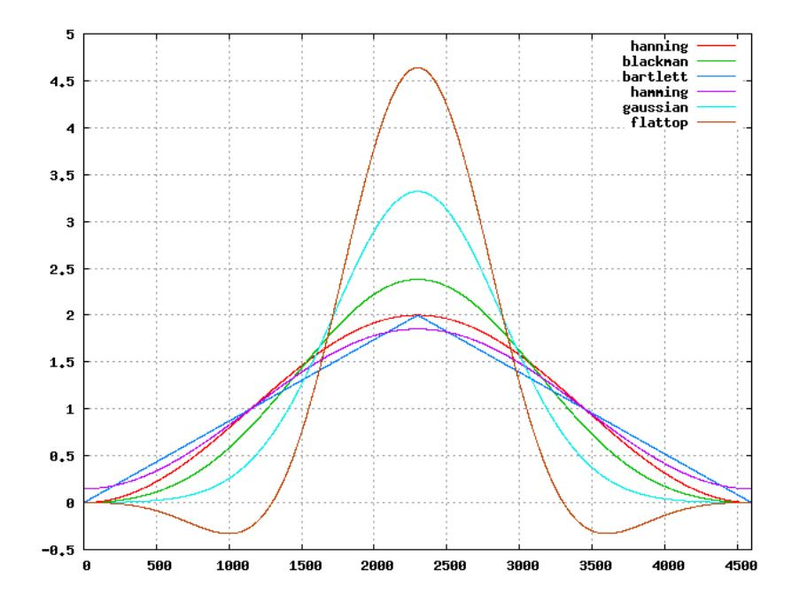

Figure 13.1: Spec and FFT window functions (Gaussian order = 4)

specwindoworder: This can be set to an integer in the range 2-8. This sets the order when the Gaussian window is used in the spec and fft commands. If not set, order 2 is used.

## <span id="page-409-0"></span>13.5.34 Fopen: open a text file

General Form:

fopen handle file\_name [mode]

The named file is opened and a numeric handle is returned in variable 'handle', or -1 on error. This is a simple wrapper around the standard C-library function with the same name, so the meaning of string 'mode' is as defined by your OS documentation. By default the file is opened for reading only. If interpreter variable "silent\_fileio" is set, no message is printed on error.

## <span id="page-409-1"></span>13.5.35 Fourier: Perform a Fourier transform

General Form:

fourier fundamental\_frequency [expression ...]

13.5. COMMANDS 411

Fourier is used to analyze the output vector(s) of a preceding transient analysis (see [13.5.96\)](#page-441-1). It does a Fourier analysis of each of the given values, finding the DC level and the first 9 multiples of the fundamental frequency (or the first (nfreqs - 1) multiples, if that variable is set (see [13.7\)](#page-451-2)). The Fourier analysis is performed over the interval <TSTOP-period\*numPeriod, TSTOP>, where TSTOP is the final time specified for the transient analysis, period is one period of the fundamental frequency and numPeriod is the value of the nperiods variable, or 1. For maximum accuracy, TMAX (see the .tran line) should be set to period\*numperiod/100.0 (or less for very high-Q circuits).

The printed output is like that of the .four ngspice line (Chapt. [11.6.4\)](#page-348-1). The expressions may be any valid expression (see [13.2\)](#page-385-0), e.g. v(2). The evaluated expression values are interpolated onto a fixed-space grid with the number of points given by the fourgridsize variable, or 200 if it is not set. The interpolation is of degree polydegree if that variable is set, or 1 otherwise. If polydegree is 0, then no interpolation is done. This is likely to give erroneous results if the time scale is not monotonic.

The fourier command not only issues a printout, but also generates vectors, one per expression. The size of the vector is 3 x nfreqs (per default 3 x 10). The name of the new vector is fouriermn, where m is set by the mth call to the fourier command, n is the nth expression given in the actual fourier command. fouriermn[0] is the vector of the 10 (nfreqs) frequency values, fouriermn[1] contains the 10 (nfreqs) magnitude values, fouriermn[2] the 10 (nfreqs) phase values of the result. Vector generation may be suppressed by setting the fournosave variable.

#### Example:

```
* do the transient analysis
tran 1n 1m
* do the fourier analysis
fourier 3.34e6 v(2) v(3) $ first call
fourier 100e6 v(2) v(3) $ second call
* get individual values
let newt1 = fourier11[0][1]
let newt2 = fourier11[1][1]
let newt3 = fourier11[2][1]
let newt4 = fourier12[0][4]
let newt5 = fourier12[1][4]
let newt6 = fourier12[2][4]
* plot magnitude of second expression (v(3))
* from first call versus frequency
plot fourier12[1] vs fourier12[0]
```

The plot command from the example plots the vector of the magnitude values, obtained by the first call to fourier and evaluating the first expression in this call, against the vector of the frequency values.

## <span id="page-411-0"></span>13.5.36 Fread: read into a variable from a text file

General Form:

fread result handle [length]

This command sets the string variable 'result' by reading one line from the open file specified by the integer 'handle'. Terminating characters are stripped and the length returned in variable 'length', if given. The handle will usually have been set by the fopen command, but any valid file descriptor may be used.

The length will be -1 if attempting to read at end-of-file or -2 on error. If interpreter variable "silent\_fileio" is set, no message is printed on error.

## <span id="page-411-1"></span>13.5.37 Getcwd: Print the current working directory

General Form:

getcwd

Print the current working directory.

## <span id="page-411-2"></span>13.5.38 Gnuplot: Graphics output via gnuplot

General Form:

gnuplot file plotargs

Like plot, but using gnuplot for graphics output and further data manipulation. ngspice creates a file called file.plt containing the gnuplot command sequence, a file called file.data containing the data to be plotted. On Linux, gnuplot may be called directly or via called via xterm, and offers a Gnuplot console to manipulate the data. On Windows, a plot window is opened and the command console window is available with a mouse click. Of course you have to have gnuplot installed on your system. Please see chapter [14.7](#page-489-0) for more details.

## <span id="page-411-3"></span>13.5.39 Hardcopy: Save a plot to a file for printing

General Form:

hardcopy file plotargs

Just like plot, except that it creates a file called file containing the plot. Various output formats are available, depending on the variable hcopydevtype. It may be set to postscript or svg. See also Chapt. [14.6](#page-480-1) for more details (color etc.).

13.5. COMMANDS 413

## <span id="page-412-0"></span>13.5.40 Help: Print summaries of Ngspice commands

Prints help. This help information, however, is spice3f5-like, stemming from 1991 and thus is outdated. If commands are given, descriptions of those commands are printed. Otherwise help for only a few major commands is printed. On Windows, this help command only provides a link to documentation. Spice3f5 compatible help may be found in the [Spice 3 User manual.](https://web.archive.org/web/20180221111839/http://newton.ex.ac.uk/teaching/CDHW/Electronics2/userguide/) For ngspice, please use this manual.

## <span id="page-412-1"></span>13.5.41 History: Review previous commands

General Form:

```
history [-r] [number]
```

Print out the history of the last (first if -r is specified) number commands typed at the keyboard.

A history substitution enables you to reuse a portion of a previous command as you type the current command. History substitutions save typing. This feature is disabled by default, as it may interfere with use of '!' in expressions. To enable, set variable histsubst. A history substitution normally starts with a '!'. A history substitution has three parts: an event that specifies a previous command, a selector that selects one or more words of the event, and some modifiers that modify the selected words. The selector and modifiers are optional. A history substitution has the form ![event][:]selector[:modifier] . . . ] The event is required unless it is followed by a selector that does not start with a digit. The ':' can be omitted before the selector if this selector does not begin with a digit. History substitutions are interpreted before anything else -- even before quotations and command substitutions. The only way to quote the '!' of a history substitution is to escape it with a preceding backslash. A '!' need not be escaped if it is followed by whitespace, '=', or '('.

Ngspice saves each command that you type in a history list, provided that the command contains at least one word. The commands in the history list are called events. The events are numbered, with the first command that you issue when you start Ngspice being number one. The history variable specifies how many events are retained in the history list.

These are the forms of an event in a history substitution:

| !!       | The preceding event. Typing<br>'!!' is an easy way to reissue the previous command.                                          |
|----------|------------------------------------------------------------------------------------------------------------------------------|
| !n       | n.<br>Event number                                                                                                           |
| !-n      | th previous event. For example,<br>The<br>n<br>!-1 refers to the immediately preceding event and<br>is equivalent to<br>!!.  |
| !str     | The unique previous event whose name starts with<br>str.                                                                     |
| !?str[?] | str. The closing<br>The unique previous event containing the string<br>'?' can be omitted if it<br>is followed by a newline. |

You can modify the words of an event by attaching one or more modifiers. Each modifier must be preceded by a colon. The following modifiers assume that the first selected word is a file name:

| :r        | Removes the trailing<br>.str extension from the first selected word.                                  |  |
|-----------|-------------------------------------------------------------------------------------------------------|--|
| :h        | Removes a trailing path name component from the first selected word.                                  |  |
| :t        | Removes all leading path name components from the first selected word.                                |  |
| :e        | Remove all but the trailing suffix.                                                                   |  |
| :p        | Print the new command but do not execute it.                                                          |  |
| s/old/new | new<br>old<br>Substitute<br>for the first occurrence of<br>in the event line. Any delimiter may be    |  |
|           | old<br>new<br>used in place of '/'. The delimiter may be quoted in<br>and<br>with a single backslash. |  |
|           | If '&' appears in<br>new, it is replaced by<br>old. A single backslash will quote the '&'. The        |  |
|           | final delimiter is optional if it is the last character on the input line.                            |  |
| &         | Repeat the previous substitution.                                                                     |  |
| g<br>a    | Cause changes to be applied over the entire event line. Used in conjunction with 's', as              |  |
|           | in<br>gs/old/new/, or with '&'.                                                                       |  |
| G         | Apply the following 's' modifier once to each word in the event.                                      |  |

For example, if the command ls /usr/elsa/toys.txt has just been executed, then the command echo !!^:r !!^:h !!^:t !!^:t:r produces the output /usr/elsa/toys /usr/elsa toys.txt toys . The '^' command is explained in the table below.

You can select a subset of the words of an event by attaching a selector to the event. A history substitution without a selector includes all of the words of the event. These are the possible selectors for selecting words of the event:

| :0     | The command name                                     |
|--------|------------------------------------------------------|
| [:]^   | The first argument                                   |
| [:]\$  | The last argument                                    |
| :n     | th argument (n<br>≥<br>The<br>n<br>1)                |
| :n1-n2 | n1 through<br>n2<br>Words                            |
| [:]*   | Words 1 through \$                                   |
| :x*    | Words<br>x<br>through \$                             |
| :x-    | Words<br>x<br>through (\$ - 1)                       |
| [:]-x  | Words 0 through<br>x                                 |
| [:]%   | ?str?<br>The word matched by the last<br>search used |

The colon preceding a selector can be omitted if the selector does not start with a digit.

The following additional special conventions provide abbreviations for commonly used forms of history substitution:

- An event specification can be omitted from a history substitution if it is followed by a selector that does not start with a digit. In this case the event is taken to be the event used in the most recent history reference on the same line if there is one, or the preceding event otherwise. For example, the command echo !?qucs?^ !\$ echoes the first and last arguments of the most recent command containing the string qucs .
- If the first non-blank character of an input line is '^', the '^' is taken as an abbreviation for !:s^ . This form provides a convenient way to correct a simple spelling error in the previous line. For example, if by mistake you typed the command cat /etc/lasswd you could re-execute the command with lasswd changed to passwd by typing ^l^p .
- You can enclose a history substitution in braces to prevent it from absorbing the following characters. In this case the entire substitution except for the starting '!' must be within

the braces. For example, suppose that you previously issued the command cp accounts ../money . Then the command !cps looks for a previous command starting with cps while the command !{cp}s turns into a command cp accounts ../moneys .

Some characters are handled specially as follows:

| ~  | Expands to the home directory                                                                                                                                                                                                                                                                                               |
|----|-----------------------------------------------------------------------------------------------------------------------------------------------------------------------------------------------------------------------------------------------------------------------------------------------------------------------------|
| *  | Matches any string of characters in a filename                                                                                                                                                                                                                                                                              |
| ?  | Matches any single character in a filename                                                                                                                                                                                                                                                                                  |
| [] | Matches any of the characters enclosed in a filename                                                                                                                                                                                                                                                                        |
| -  | Used within<br>[]<br>to specify a range of characters. For example,<br>[b-k]<br>matches on any<br>character between and including<br>'b'<br>through to<br>'k'.                                                                                                                                                              |
| ^  | If the<br>^<br>is included within<br>[]<br>as the first character, then it negates the following characters<br>matching on anything but those. For example,<br>[^agm]<br>would match on anything other<br>'a',<br>'g'<br>'m'.<br>[^a-zA-Z]<br>than<br>and<br>would match on anything other than an alphabetic<br>character. |

The wildcard characters \*, ?, [, and ] can be used, but only if you unset noglob first. This makes them rather useless for typing algebraic expressions, so you should set noglob again after you are done with wildcard expansion.

When the environment variable HOME exists (on Unix, Linux, or CYGWIN), history permanently stores previous command lines in the file \$HOME/.\_ngspice\_history. When this variable does not exist (typically on Windows when the readline library is not officially installed), the history file is called .history and put in the current working directory.

The history command is part of the readline or editline package. The readline program provides a command line editor that is configurable through the file .inputrc. The path to this configuration file is either found in the shell variable INPUTRC, or it is (on Unix/Linux/CYGWIN) the file ~/.inputrc in the user's home directory. On Windows systems, the configuration file is /Users/<username>/.inputrc, unless the readline library was officially installed. In that case the filename is taken from the Windows registry and points to a location that the user specified during installation. See <https://web.archive.org/web/20190527085247/https://tiswww.case.edu/php/chet/readline/rltop.html> for detailed documentation. Some useful commands are below.

| Left/Right<br>arrow | Move one character to the left or right |
|---------------------|-----------------------------------------|
| Home/End            | Move to beginning or end of line        |
| Up/Down<br>arrow    | Cycle through the history buffer        |
| C                   | Undo last editing command               |
| C-r                 | Incremental search backward             |
| TAB                 | completion of a file name               |
| C-ak                | Erase the command line (kill)           |
| C-y                 | Retrieve last kill (yank)               |
| C-u                 | Erase from cursor to start of line      |

## <span id="page-414-0"></span>13.5.42 Inventory: Print circuit inventory

General Form:

inventory

This commands accepts no argument and simply prints the number of instances of a particular device in a loaded netlist.

## <span id="page-415-0"></span>13.5.43 Iplot\*: Incremental plot

General Form:

```
iplot [-d delay] [-w width] [-o] [ node ...]
```

Incrementally plot the values of the nodes while ngspice runs. The iplot command can be used with the where command to find trouble spots in a transient simulation. The "-d" options sets the delay (in simulation steps) between the start of the simulation and the appearance of the window. It can be used to suppress flicker when new values cause rapid resizing at the start of the simulation. The "-w" option sets a fixed width for the window in simulation units (time, frequency etc). When the output does not fit, only the latest output values are shown.

Node expressions are not supported, except that a fixed offset may be applied to event nodes (usually digital) to separate traces vertically.

The "-o" option gives automatic separation, similar to the "digitop" keyword for "plot". Explicit and automatic offsets may be combined:

```
iplot -o controlx4 d_d+4.5 d_u
```

The @name[param] notation [\(27.1\)](#page-676-1) does not work yet.

## <span id="page-415-1"></span>13.5.44 Let: Assign a value to a vector

General Form:

```
let name = expr
```

Creates a new vector called name with the value specified by *expr*, an expression as described above. If *expr* is [] (a zero-length vector) then the vector becomes undefined. Individual elements of a vector may be modified by appending a subscript to name (ex. name[0]). If there are no arguments, let is the same as display.

The command let creates a vector in the current plot. Use setplot [\(13.5.74\)](#page-432-0) to create a new plot.

There is no straightforward way to initialize a new vector. In general, one might want to have let initialize a slice (i.e. name[4:4,21:23] = [ 1 2 3 ]) of a multi-dimensional matrix of arbitrary type (i.e. real, complex ..), where all values and indexes are arbitrary expressions. This will fail. The procedure is to first allocate a real vector of the appropriate size with either vector(), unitvec(), or [ n1 n2 n3 ... ]. The second step is to optionally change the type of the new vector (to complex) with the j() function. The third step reshapes the dimensions, and the final step (re)initializes the contents, like so:

13.5. COMMANDS 417

```
let a = j(vector(10))
reshape a [2][5]
let a[0][0] = (pi,pi)
```

Initialization of real vectors can be done quite efficiently with compose:

```
compose a values (pi, pi) (1,1) (2,sqrt(7)) (boltz,e)
reshape a [2][2]
```

See also unlet [\(13.5.100\)](#page-442-3), compose [\(13.5.16\)](#page-401-0).

## <span id="page-416-0"></span>13.5.45 Linearize: Interpolate to a linear scale

General Form:

```
linearize <np=xx> <vec1> <vec2> ...
```

Create a new plot with all of the vectors in the current plot, or only those mentioned as arguments to the command, all data linearized onto an equidistant time scale.

How to compute the fft from a transient simulation output:

```
setplot tran1
linearize V(2)
set specwindow=blackman
fft V(2)
plot mag(V(2))tstep
```

Alternative linearize options

```
linearize np=1001 V(2)
linearize np=auto2n V(2) V(3) V(5)
```

Command linearize is needed for example if you want to do an FFT analysis [\(13.5.33\)](#page-407-2).

Linearize will redo the vectors vec or renew all vectors of the current plot (e.g. tran3) if no arguments are given and store them into a new plot (e.g. tran4). The new vectors are interpolated onto a linear time scale, which is determined by the values of tstep, tstart, and tstop in the currently active transient analysis, if the number of points np is not given. The currently loaded input file must include a transient analysis (a tran command may be run interactively before the last reset, alternately), and the current plot must be from this transient analysis.

Without np given, the length of the new vector is floor((tstop - tstart) / tstep + 1.5). Please note that the parameter tstep of your transient analysis (see Chapt. [11.3.10\)](#page-330-1) has to be small enough to get adequate resolution, otherwise the command linearize will do sub-sampling of your signal. If no circuit is loaded and the data have been acquired by the load [\(13.5.47\)](#page-418-0) command, Linearize will take time data from transient analysis scale vector.

With optional np=xx, xx may be a positive integer number, like np=512. The linearization then spans from point 0 to point xx, covering xx-1 periods. When np=auto2n is given, the number of points is set automatically to 2^n, with n = (int)round(log2((tstop - tstart) / tstep)).

The linearize command may be used to create a linearized cutout of the original vector by defining the vectors lin-tstart, lin-tstop, and lin-tstep before issuing the linearize command. At least lin-tstart or lin-tstop has to be defined. This may be used to plot just a portion of a vector, or to prepare a better fft by skipping the start-up phase of a ring oscillator.

Excerpt from the ring oscillator example soi/ring51\_40.sp:

```
* original time scale by .tran command is from 0 to 16ns
save out25 out50
run
plot out25 out50
let lin-tstart = 4n $ skip the start-up phase
let lin-tstop = 14n $ end earlier(just for demonstration)
let lin-tstep = 5p
linearize out25 out50
plot out25 out50
```

The linearize command should explicitly name the vectors of interest. Otherwise warning messages pop up that the vectors lin-tstart etc cannot be linearized.

## <span id="page-417-0"></span>13.5.46 Listing: Print a listing of the current circuit

General Form:

```
listing [logical] [physical] [deck] [expand] [runnable] [param]
```

If the logical argument is given, the listing is with all continuation lines collapsed into one line, and if the physical argument is given the lines are printed out as they were found in the file. The default is logical. A deck listing is just like the physical listing, except without the line numbers it recreates the input file verbatim (except that it does not preserve case). If the word expand is present, the circuit is printed with all subcircuits expanded. Argument runnable will list the circuit netlist expanded, but without additional line numbers, ready to be sourced again and run in ngspice. The option param allows printing all parameters and their actual values.

Example:

```
source d:\myngspice\inputs\decade_counter.cir
listing r > $inputdir/decade_counter_runnable.cir
```

All options (except for param) may be invoked by just entering their first letter. The example sources a ngspice netlist, the listing r command will save the expanded netlist (all parameters evaluated, subcircuits flattened, .control sections removed) into a file within the same directory.

If you are using CIDER [\(26\)](#page-642-0), listing r will not create a runnable netlist, because some data lines which have been created internally are missing.

13.5. COMMANDS 419

## <span id="page-418-0"></span>13.5.47 Load: Load rawfile data

General Form:

```
load [filename] ...
```

Loads either binary or ascii format rawfile data from the files named. The default file name is rawspice.raw, or the argument to the -r flag if there was one.

## <span id="page-418-1"></span>13.5.48 Mc\_source: Reload the circuit netlist from an internal storage

General Form:

```
mc_source
```

Upon reading a netlist, after its preprocessing is finished, the modified netlist is stored internally. This command will reload this netlist and create a new circuit inside ngspice. This command is used in conjunction with the alterparam command.

## <span id="page-418-2"></span>13.5.49 Meas: Measurements on simulation data

General Form (example):

```
MEAS {DC|AC|TRAN|SP} result TRIG trig_variable VAL=val <TD=td>
<CROSS=# | CROSS=LAST> <RISE=#|RISE=LAST> <FALL=#|FALL=LAST>
<TRIG AT=time> TARG targ_variable VAL=val <TD=td>
<CROSS=# | CROSS=LAST> <RISE=#|RISE=LAST>
<FALL=#|FALL=LAST> <TRIG AT=time>
```

Most of the input forms found in [11.4](#page-335-0) may be used here with the command meas instead of .meas(ure). Using meas inside the .control ... .endc section offers additional features compared to the .meas use. meas will print the results as usual, but in addition will store its measurement result (typically the token **result** given in the command line) in a vector. This vector may be used in following command lines of the script as an input value of another command. For details of the command see Chapt. [11.4.](#page-335-0) The measurement type SP is only available here, because a fft command will prepare the data for SP measurement. Option autostop [\(11.1.4\)](#page-318-1) is not available.

Unfortunately par(*'expression'*) [\(11.4.10,](#page-340-1) [11.6.6\)](#page-353-0) and param [\(11.4.9\)](#page-340-0) will not work here, i.e. inside the .control section. You may use an expression by the let command [\(13.5.44\)](#page-415-1) instead, giving let vec\_new = *expression*.

Replacement for par (*'expression'* ) in meas inside the .control section

```
let vdiff = v(n1)-v(n0)
meas tran vtest find vdiff at=0.04e-3
*the following will not do here:
*meas tran vtest find par('v(n1)-v(n0)') at=0.04e-3
```

## <span id="page-419-0"></span>13.5.50 Mdump: Dump the matrix values to a file (or to console)

General Form:

```
mdump <filename>
```

If <filename> is given, the output will be stored in file <filename>, otherwise dumped to your console.

## <span id="page-419-1"></span>13.5.51 Mrdump: Dump the matrix right hand side values to a file (or to console)

General Form:

```
mrdump <filename>
```

If <filename> is given, the output will be appended to file <filename>, otherwise dumped to your console.

Example usage after ngspice has started:

```
* Dump matrix and RHS values after 10 and 20 steps
* of a transient simulation
source rc.cir
step 10
mdump m1.txt
mrdump mr1.txt
step 10
mdump m2.txt
mrdump mr2.txt
* just to continue to the end
step 10000
```

You may create a loop using the control structures (Chapt. [13.6\)](#page-447-1).

## <span id="page-419-2"></span>13.5.52 Noise: Noise analysis

See the .NOISE analysis [\(11.3.4\)](#page-325-0) for details.

The **noise** command will generate two plots (typically named noise1 and noise2) with Noise Spectral Density Curves and Integrated Noise data. To write these data into output file(s), you may use the following command sequence:

13.5. COMMANDS 421

Command sequence for writing noise data to file(s):

```
.control
tran 1e-6 1e-3
write test_tran.raw
noise V(out) vinp dec 333 1 1e8 16
print inoise_total onoise_total
*first option to get all of the output (two files)
setplot noise1
write test_noise1.raw all
setplot noise2
write test_noise2.raw all
* second option (all in one raw-file)
write testall.raw noise1.all noise2.all
.endc
```

## <span id="page-420-0"></span>13.5.53 Op: Perform an operating point analysis

General Form:

op

Do an operating point analysis. See Chapt. [11.3.5](#page-326-0) for more details.

## <span id="page-420-1"></span>13.5.54 Option: Set a ngspice option

General Form:

```
option [option=val] [option=val] ...
```

Set any of the simulator variables as listed in Chapt. [11.1.](#page-314-1) See this chapter also for more information on the available options. The **option** command without any argument lists the current options set in the simulator. It shows the current options, while new values are set to be used in the next analysis run. That means that changed options will not be visible immediately, but only after the next analysis run. Multiple options may be set in a single line.

The following example demonstrates a control section, which may be added to your circuit file to test the influence of variable trtol on the number of iterations and on the simulation time.

Command sequence for testing option trtol:

```
.control
set noinit
option trtol=1
echo
echo trtol=1
run
rusage traniter trantime
reset
option trtol=3
echo
echo trtol=3
run
rusage traniter trantime
reset
option trtol=5
echo
echo trtol=5
run
rusage traniter trantime
reset
option trtol=7
echo
echo trtol=7
run
rusage traniter trantime
plot tran1.v(out25) tran1.v(out50) v(out25) v(out50)
.endc
```

## <span id="page-421-0"></span>13.5.55 Plot\*: Plot vectors on the display

General Form:

```
plot expr1 [vs scale_expr1] [expr2 [vs scale_expr2]] ...
[ylimit ylo yhi] [xlimit xlo xhi] [xindices xilo xihi]
[xcompress comp] [xdelta xdel] [ydelta ydel]
[xlog] [ylog] [loglog] [nogrid]
[linplot] [combplot] [pointplot] [nointerp] [retraceplot]
[polar] [smith] [smithgrid]
[xlabel word] [ylabel word] [title word]
[samep] [linear] [kicad] [plainplot] [digitop]
[all] [allv] [alli] [ally] [alle]
```

Plot the given vectors or exprs on the screen (if you are on a graphics terminal). The xlimit and ylimit arguments determine the high and low x- and y-limits of the axes, respectively. The 13.5. COMMANDS 423

xindices arguments determine what range of points are to be plotted - everything between the xilo'th point and the xihi'th point is plotted. The xcompress argument specifies that only one out of every comp points should be plotted. If an xdelta or a ydelta parameter is present, it specifies the spacing between grid lines on the X- and Y-axis. These parameter names may be abbreviated to xl, yl, xind, xcomp, xdel, and ydel respectively.

The scal\_expr argument(s) are expressions to use as the scale on the x-axis instead of the default scale for the plot. If xlog or ylog are present, then the X or Y scale, respectively, are logarithmic (loglog is the same as specifying both). The xlabel and ylabel arguments cause the specified labels to be used for the X and Y axes, respectively.

If samep is given, the values of the other parameters from the previous plot, hardcopy, or asciiplot command are used even if they are redefined on the command line.

The title argument is used in the headline of the plot window and replaces the default text, which is 'actual plot: first line of input file'.

The linear keyword is used to override a default logscale plot (as in the output for an AC analysis).

The keywords linplot, combplot and pointplot select different plot styles. The keyword nointerp turns off interpolation of the vector data, nogrid suppresses the drawing of gridlines. retraceplot may be required if the scale vector (the x axis) has values which do not grow monothonically (e.g. plotting a circle or the hyseresis loop of a memristor). Without this keyword retracing values (x values moving forth and back) are suppressed.

Finally, the keyword polar generates a polar plot. To produce a Smith plot, use the keyword smith. Note that the data is transformed, so for Smith plots you will see the data a + jb transformed to

$$a = (a^2 + b^2 - 1)/((a+1)^2 + b^2)$$
(13.1)

$$b = (2*b)/((a+1)^2 + b^2)$$
(13.2)

To produce a polar plot with a Smith grid but without performing the Smith transform, use the keyword smithgrid.

Keyword retraceplot may be useful if the x-axis values are non-monotonic. Whereas time is always growing monotonically, during plotting ynew vs xnew xnew may partially increase, then decrease again. If this occurs, plotting is suppressed as per default. retraceplot will enable plotting all data.

If you specify plot all, all vectors (including the scale vector) are plotted versus the scale vector (see commands display [\(13.5.25\)](#page-405-1) or setscale [\(13.5.75\)](#page-432-1) on viewing the vectors of the current plot). The command plot ally will not plot the scale vector, but all other 'real' y values. The command plot alli selects all current vectors, the command plot allv all voltage vectors.

If the vector name to be plotted contains - , / or other tokens that may be taken for operators of an expression, and plotting fails, try enclosing the name in double quotes, e.g. plot "/vout".

Plotting of complex vectors, as may occur after an ac simulation, requires special considerations. Please see Chapt. [13.5.1](#page-392-1) for details.

Keyword kicad will enable plotting vectors with leading character / (see [12.11.8\)](#page-375-1) by placing double quotes around the token, keyword plainplot will allow this by suppressing the evaluation of any expression containing such characters. vc1 vs vc2 is not supported with using plainplot. The same effect may be generated by setting the variable plainplot.

digitop will assemble all digital (event) nodes into a single graph, arranged on top of each other.

Plot all analog nodes [all], all voltage nodes only [allv], all current nodes, [alli], all nodes except for the scale [ally], all event nodes [alle].

## <span id="page-423-0"></span>13.5.56 Pre\_<command>: execute commands prior to parsing the circuit

General Form:

```
pre_<command>
```

All commands in a .control ... .endc section are executed *after* the circuit has been parsed. If you need command execution *before* circuit parsing, you may add these commands to the general spinit or local .spiceinit files. Another possibility is adding a leading pre\_ to a command within the .control section of an ordinary input file, which forces the command to be executed *before* circuit parsing. Basically <command> may be any command listed in Chapt. [13.5,](#page-392-0) however only a few commands are indeed useful here. Some examples are given below:

Examples:

```
pre_unset ngdebug
pre_set strict_errorhandling
pre_codemodel mymod.cm
```

pre\_<command> is available only in the *.control mode* (see [12.4.3\)](#page-359-3), *not* in *interactive mode*, where the user may determine when a circuit is to be parsed, using the source command [\(13.5.84\)](#page-436-0) .

## <span id="page-423-1"></span>13.5.57 Pre\_OSDI: load a \*.osdi compact device model shared library

Compact device models, written in Verilog-A HDL and compiled with OpenVAF (se[e9.2\)](#page-302-2) are loaded dynamically at runtime. Several models may be loaded for a single simulation run. Please add these commands at the beginning of the .control section.

Examples:

```
pre_osdi osdi_libs/bsimbulk107.osdi osdi_libs/psp103.osdi
```

## <span id="page-423-2"></span>13.5.58 Print: Print values

General Form:

```
print [col] [line] expr ...
```

13.5. COMMANDS 425

Prints the vector(s) described by the expression expr. If the col argument is present, print the vectors named side by side. If line is given, the vectors are printed horizontally. col is the default, unless all the vectors named have a length of one, in which case line is the default. The options width (default 80) and height (default 24) are effective for this command (see asciiplot [13.5.6\)](#page-397-0). The 'more' mode is the standard mode if printing to the screen, that is after a number of lines given by height, and after a page break printing stops with request for answering the prompt by <return> (print next page), 'c' (print rest) or 'q' (quit printing). If everything shall be printed with stopping after each page (only useful in interactive mode, because need manual continuation), use the command set moremode before printing or put it into .spiceinit [12.6](#page-363-0) (or spinit [12.5\)](#page-361-0). If the expression is all, all of the vectors available are printed. Thus print col all > filename prints everything into the file filename in SPICE2 format. The scale vector (time, frequency) is always in the first column unless the variable noprintscale is true. You may use the vectors alli, allv, ally with the print command, but then the scale vector will not be printed.

Examples:

```
print all
set width=300
print v(1) > outfile.out
```

## <span id="page-424-0"></span>13.5.59 Psd: power spectral density of vectors

General Form:

```
psd ave vector1 [vector2] ...
```

Calculate the single sided power spectral density of signals (vectors) resulting from a transient analysis. Windowing is available as described in the fft command [\(13.5.33\)](#page-407-2). The FFT data are squared, summarized, weighted and printed as total noise power up to Nyquist frequency, and as noise voltage or current.

ave is the number of points used for averaging and smoothing in a postprocess, useful for noisy data. A new plot vector is created that holds the averaged results of the FFT, weighted by the frequency bin. The result can be plotted and has the units V^2/Hz or A^2/Hz, depending on the the input vector.

## <span id="page-424-1"></span>13.5.60 Quit: Leave Ngspice

General Form:

```
quit
quit [exitcode]
```

Quit ngspice. Ngspice will ask for an acknowledgment if parameters have not been saved. If unset askquit is specified, ngspice will terminate immediately.

The optional parameter exitcode is an integer that sets the exit code for ngspice. This is useful to return a success/fail value to the operating system.

## <span id="page-425-0"></span>13.5.61 Rehash: Reset internal hash tables

General Form:

rehash

Recalculate the internal hash tables used when looking up UNIX commands, and make all UNIX commands in the user's PATH available for command completion. This is useless unless you have set unixcom first (see above).

## <span id="page-425-1"></span>13.5.62 Remcirc: Remove the current circuit

General Form:

remcirc

This command removes the current circuit from the list of circuits sourced into ngspice. To select a specific circuit, use setcirc [\(13.5.73\)](#page-431-1). To load another circuit, refer to source [\(13.5.84\)](#page-436-0). The new active circuit will be the circuit on top of the list of the remaining circuits.

## <span id="page-425-2"></span>13.5.63 Remzerovec: Remove zero length vectors

General Form:

remzerovec

This command removes vectors of length zero from the current plot.

## <span id="page-425-3"></span>13.5.64 Reset: Reset an analysis

General Form:

reset

Throw out any intermediate data in the circuit (e.g, after a breakpoint or after one or more analyses have been done), and re-parse the input file. The circuit can then be re-run from it's initial state, overriding the effect of any set or alter commands. These two need to be repeated after the reset command.

Reset may be required in simulation loops preceding any run (or tran ...) command.

Reset is required after an alterparam command [\(13.5.5\)](#page-396-0) for making the parameter change effective.

13.5. COMMANDS 427

## <span id="page-426-0"></span>13.5.65 Reshape: Alter the dimensionality or dimensions of a vector

General Form:

```
reshape vector vector ...
or
reshape vector vector ... [ dimension, dimension, ... ]
or
reshape vector vector ... [ dimension ][ dimension ] ...
```

This command changes the dimensions of a vector or a set of vectors. The final dimension may be left off and it will be filled in automatically. If no dimensions are specified, then the dimensions of the first vector are copied to the other vectors. An error message of the form 'dimensions of x were inconsistent' can be ignored.

Example:

```
* generate vector with all (here 30) elements
let newvec=vector(30)
* reshape vector to format 3 x 10
reshape newvec [3][10]
* access elements of the reshaped vector
print newvec[0][9]
print newvec[1][5]
let newt = newvec[2][4]
```

Command reshape expects positive interger numbers to define the dimensions. Vectors [\(13.8.2\)](#page-461-0) or variables [\(13.8.1\)](#page-460-1) are suitable, when transformed into numbers.

Example (using vectors and variables):

```
let ntasks=12 ; vector
set nparams=3 ; variable
let p=vector(36) ; new vector
reshape p[$&ntasks][$nparams] ; create format 12 x 3
```

## <span id="page-426-1"></span>13.5.66 Resume: Continue a simulation after a stop

General Form:

resume

Resume a simulation after a stop or interruption (control-C).

## <span id="page-427-0"></span>13.5.67 Run: Run analysis from the input file

General Form:

```
run [rawfile]
```

Run the simulation as specified in the input file. If there were any of the control lines .ac, .op, .tran, or .dc, they are executed. The output is put in rawfile if it was given, in addition to being available interactively.

## <span id="page-427-1"></span>13.5.68 Rusage: Resource usage

General Form:

```
rusage [resource ...]
```

Print resource usage statistics. If any resources are given, just print the usage of that resource. Most resources require that a circuit be loaded. Currently valid resources are

time Total Analysis Time

cputime The amount of time elapsed since the last rusage cputime call.

totalcputime Total elapsed time used so far.

decklineno Number of lines in deck

netloadtime Nelist loading time

netparsetime Netlist parsing time

faults Number of page faults and context switches (BSD only).

space Data space used (output is depending on the operating system).

temp Operating temperature.

tnom Temperature at which device parameters were measured.

equations Number of circuit equations

totiter Total iterations

accept Accepted time-points

rejected Rejected time-points

loadtime Time spent loading the circuit matrix and RHS.

reordertime Matrix reordering time

lutime L-U decomposition time

13.5. COMMANDS 429

solvetime Matrix solve time

trantime Transient analysis time

tranpoints Transient time-points

traniter Transient iterations

trancuriters Transient iterations for the last time point

tranlutime Transient L-U decomposition time

transolvetime Transient matrix solve time

everything All of the above.

all All of the above.

If rusage is given without any parameter, a sequence of outputs is printed using the following rusage parameters: time, totalcputime, space.

## <span id="page-428-0"></span>13.5.69 Save: Save a set of outputs

General Form:

```
save [all | outvec ...]
```

Save a set of outputs, discarding the rest (if keyword all is not given). May be used to dramatically reduce memory (RAM) requirements if only a few useful node voltages or branch currents are saved.

Node voltages may be saved by giving the nodename or v(nodename). Currents through an independent voltage source are given by i(sourcename) or *sourcename*#*branch*. Internal device data [\(27.1\)](#page-676-1) are accepted as @dev[param]. The syntax is identical to the .save command [\(11.6.1\)](#page-346-2).

Note: In the .control .... .endc section save *must* occur before the run or tran command to become effective.

If a node has been mentioned in a save command, it appears in the working plot after a run has completed, or in the rawfile written by the write [\(13.5.105\)](#page-445-1) command. For backward compatibility, if there are no save commands given, all outputs are saved. If you want to trace [\(13.5.95\)](#page-441-0) or plot [\(13.5.55\)](#page-421-0) a node, you have to save it explicitly, except for all given or no save command at all.

When the keyword all appears in the save command, all node voltages, voltage source currents and inductor currents are saved in addition to any other vectors listed.

Save voltage and current:

```
save vd_node vs#branch v(vs_node) i(vs2)
```

Save allows storing and later access of internal device parameters. e.g. in a command like

Save internal parameters:

```
save all @mn1[gm]
```

saves all standard analysis output data plus gm of transistor mn1 to internal memory (see also [27.1\)](#page-676-1).

save may store data from nodes or devices residing inside of a subcircuit:

Save voltage on node 3 (top level), node 8 (from inside subcircuit x2) and current through vmeas (from subcircuit x1):

```
save 3 x1.x2.x1.x2.8 v.x1.x1.x1.vmeas#branch
```

Save internal parameters within subcircuit:

```
save @m.xmos3.mn1[gm]
```

Use commands listing expand ([13.5.46](#page-417-0), before the simulation) or display [\(13.5.25,](#page-405-1) after simulation) to obtain a list of all nodes and currents available. Please see Chapt. [27](#page-676-0) for an explanation of the syntax for internal parameters.

Entering several save lines in a single .control section will accumulate the nodes and parameters to be saved. If you want to exclude a node, you have to get its number by calling status [\(13.5.87\)](#page-438-0) and then calling delete number [\(13.5.21\)](#page-403-1).

Don't save anything:

```
save none
```

Useful if shared ngspice library is used and data are immediately transferred to the caller via the shared ngspice interface.

Don't save subcircuit internal nodes:

```
save nosub
```

Don't save node vectors that are defined inside of a subcircuit. This may for example save a lot of memory if you are not interested in the internals of a subcircuit device model.

Don't save internal device nodes:

```
save nointernals
```

Don't save internal device nodes issued by OpenVAF/OSDI Verilog-A models like PSP..

## <span id="page-429-0"></span>13.5.70 Sens: Run a sensitivity analysis

General Form:

```
sens output_variable [filter ...]
sens out_var [filter ...] ac (DEC|OCT|LIN) N Fstart Fstop
```

13.5. COMMANDS 431

Perform a Sensitivity analysis: output\_variable is either a node voltage (ex. v(1) or v(A,out)) or a current through a voltage source (e.g. i(vtest)). The first form calculates DC sensitivities, the second form AC sensitivities. The output values are in dimensions of change in output per unit change of input (as opposed to percent change in output or per percent change of input). See [11.3.7](#page-328-1) for further details.

## <span id="page-430-0"></span>13.5.71 Set: Set the value of a variable

General Form:

```
set [word]
set [word = value] ...
set [word = ( list of values )] ...
```

Set the value of word to value, if it is present. You can set any word to be any value: numeric, string or list. If no value is given then the value is the Boolean 'true'. If you enter a string, you have to enclose it in double quotes. Set saves the lower case version of a word string but the setcs variant of the command preserves case. If a variable is set to a list of values that are enclosed in parentheses (which must be separated from their values by white space), the value of the variable is the list.

The value of word may be inserted into a command by writing \$word,or \$word[index]for an individual list element. The index may itself be a substitution: \$word[\$index].

The variables used by ngspice are listed in section [13.7.](#page-451-2)

If a variable has the same name as a simulator option, setting it will also attempt to set the option.

Set entered without any parameter will list all variables set, and their values, if applicable.

Be advised that set sets the lower case variant of word. An exceptions to this rule is the variable sourcepath.

Set automatically tries to distinguish between values given as numbers, strings or lists. If a string starts with a numerical value, like 2N5401\_C and is not enclosed in double quotes, it is interpreted as a real number 2n, i.e. 2e-9. The rest of the string is discarded.

A variable may be set to a value read from a file by I/O redirection.

#### Example:

```
set invar < infile.txt
echo $invar
echo $invar[2]
echo $invar[5]
```

With the input text file

infile.txt:

```
* testing set input from file
3
NeXt
4
5 and 7
```

you will get the output from echo

```
3 NeXt 4 5 and 7
NeXt
and
```

Lines starting with '\*' are comment lines and will be ignored. Lines with multiple tokens are stored as list vectors, lines with a single token as string.

Another option to set a variable from outside is the I/O redirection by backquotes or backticks (see [13.10\)](#page-473-2), if you run ngspice as a console application.

## <span id="page-431-0"></span>13.5.72 Setcs: Set the value of a variable, case preserved

General Form:

```
setcs [word]
setcs [word = value] ...
```

Set the value of word to value, if it is present. You can set any word to be any value, numeric or string. If no value is given then the value is the Boolean 'true'. If you enter a string, you have to enclose it in double quotes. Setcs keeps the case of a word string.

The value of word may be inserted into a command by writing \$word. If a variable is set to a list of values that are enclosed in parentheses (which must be separated from their values by white space), the value of the variable is the list.

The variables used by ngspice are listed in section [13.7.](#page-451-2)

Setcs entered without any parameter will list all variables set, and their values, if applicable.

Setcs automatically tries to distinguish between values given as numbers, strings or lists. If a string starts with a numerical value, like 2N5401\_C and is not enclosed in double quotes, it is interpreted as a real number 2n, i.e. 2e-9. The rest of the string is discarded.

## <span id="page-431-1"></span>13.5.73 Setcirc: Change the current circuit

General Form:

```
setcirc [circuit number]
```

13.5. COMMANDS 433

The current circuit is the one that is used for the simulation commands below. When a circuit is loaded with the source command (see below, [13.5.84\)](#page-436-0) it becomes the current circuit.

**Setcirc** followed by 'return' without any parameters lists all circuits loaded.

## <span id="page-432-0"></span>13.5.74 Setplot: Switch the current set of vectors

General Form:

```
setplot
setplot [plotname]
setplot previous
setplot next
setplot new
```

Set the current plot to the plot with the given name, or if no name is given, prompt the user with a list of all plots generated so far. (Note that the plots are named as they are loaded, with names like tran1 or op2. These names are shown by the setplot and display commands and are used by diff, below.) If the 'New' item is selected, a new plot is generated that has no vectors defined.

Note that here the word plot refers to a group of vectors that are the result of one ngspice run. When more than one file is loaded in, or more than one plot is present in one file, ngspice keeps them separate and only shows you the vectors in the current plot with the display [\(13.5.25\)](#page-405-1) command. setplot previous will show the previous plot in the plot list, if available, setplot next the next plot. If not available, a warning is issued and the current plot stays active. Setplot will also allow selecting the digital event nodes that have been created during the simulation that made the analog plot.

## <span id="page-432-1"></span>13.5.75 Setscale: Set the scale vector for the current plot

General Form:

```
setscale [vector1] [vector2]
```

The scale vector provides the values for the x-axis in a 2D plot. If no argument is given, the current scale vector is printed. With one argument, defines the default scale vector for the current plot. With two arguments, sets the specific scale vector of vector1 to be vector2. If vector2 is "none" the scale vector for vector1 reverts to the plot's default.

## <span id="page-432-2"></span>13.5.76 Setseed: Set the seed value for the random number generator

General Form:

```
setseed [number]
```

When this command is given, the seed value for the random number generator is set to number. Number has to be an integer greater than 0. The random numbers retrieved after this command are a sequence of pseudo random numbers with a huge period. Setting the seed value will provide a reproducible sequence of random numbers, i.e. the same seed results in the same sequence. See also the options SEED and SEEDINFO in chapt. 11.1.1 and chapt. 18 on statistical circuit analysis..

#### <span id="page-433-0"></span>13.5.77 Settype: Set the type of a vector

General Form:

settype type vector ...

Change the type of the named vectors to type. Type names can be found in the following table.

| Type              | Unit                       | Туре        | Unit    |
|-------------------|----------------------------|-------------|---------|
| notype            | -                          | pole        | -       |
| time              | S                          | zero        | -       |
| frequency         | Hz                         | s-param     | -       |
| voltage           | V                          | temp-sweep  | Celsius |
| current           | A                          | res-sweep   | Ohms    |
| voltage-density   | $V/\sqrt{Hz}$              | impedance   | Ohms    |
| current-density   | $A/\sqrt{Hz}$              | admittance  | S       |
| voltage^2-density | V²/Hz                      | power       | W       |
| current^2-density | A <sup>2</sup> / <i>Hz</i> | phase       | Degree  |
| temperature       | Celsius                    | decibel     | dB      |
| charge            | С                          | capacitance | F       |

#### <span id="page-433-1"></span>13.5.78 Shell: Call the command interpreter

General Form:

shell [ command 1

Call the operating system's command interpreter; execute the specified command or call for interactive use. The status returned by the command is stored in variable shellstatus.

#### <span id="page-433-2"></span>13.5.79 Shift: Alter a list variable

General Form:

shift [varname] [number]

If varname is the name of a list variable, it is shifted to the left by number elements (i.e, the number leftmost elements are removed). The default varname is argv, and the default number is 1.

13.5. COMMANDS 435

## <span id="page-434-0"></span>13.5.80 Show: List device state

General Form:

```
show devices [ : parameters ] , ...
```

The show command prints out tables summarizing the operating condition of selected devices. If devices is missing, a default set of devices are listed, if devices is a single letter, devices of that type are listed. A device's full name may be specified to list only that device. Finally, devices may be selected by model by using the form #modelname.

Because the output format is tabular, long strings, including device names, may be truncated. The command "set altshow" selects an alternative output format without truncations.

If no parameters are specified, the values for a standard set of parameters are listed. If the list of parameters contains a '+', the default set of parameters is listed along with any other specified parameters.

For both devices and parameters, the word all has the obvious meaning.

Note: there must be spaces around the ':' that divides the device list from the parameter list.

## <span id="page-434-1"></span>13.5.81 Showmod: List model parameter values

General Form:

```
showmod models [ : parameters ] , ...
```

The showmod command operates like the show command (above) but prints out model parameter values. The applicable forms for models are a single letter specifying the device type letter (e.g. m, or c), a device name (e.g. m.xbuf22.m4b), or #modelname (e.g. #p1).

Typical usage (e.g. for BSIM4 model):

```
showmod #cmosn #cmosp : lkvth0 vth0
```

Note: there must be spaces around the ':' that divides the device list from the parameter list. Obtain the default model parameters (e.g. for a BJT device):

```
netlist for default bipolar transistor
Q1 cc bb ee defbip
.model defbip npn
.control
op
showmod q1
.endc
```

op is required to set the data (otherwise all reported values are 0). The combination of the default parameters and the parameters given in the .model line (This is what the simulator finally uses.) are obtainable by showmod only after a simulation command (e.g. op).

## <span id="page-435-0"></span>13.5.82 Snload: Load the snapshot file

General Form:

```
snload circuit-file file
```

snload reads the snapshot file generated by snsave [\(13.5.83\)](#page-435-1). circuit-file is the original circuit input file. After reading, the simulation may be continued by resume [\(13.5.66\)](#page-426-1).

An input script for loading circuit and intermediate data, resuming simulation and plotting is shown below:

Typical usage:

```
* SCRIPT: ADDER - 4 BIT BINARY
* script to reload circuit and continue the simulation
* begin with editing the file location
* to be started with 'ngspice adder_snload.script'
.control
* cd to where all files are located
cd D:\Spice_general\ngspice\examples\snapshot
* load circuit and snpashot file
snload adder_mos_circ.cir adder500.snap
* continue simulation
resume
* plot some node voltages
plot v(10) v(11) v(12)
.endc
```

Due to a bug we currently need the term 'script' in the title line (first line) of the script.

## <span id="page-435-1"></span>13.5.83 Snsave: Save a snapshot file

General Form:

```
snsave file
```

If you run a transient simulation and interrupt it by e.g. a stop breakpoint [\(13.5.89\)](#page-438-2), you may resume simulation immediately [\(13.5.66\)](#page-426-1) or store the intermediate status in a snapshot file by snsave for resuming simulation later (using snload [\(13.5.82\)](#page-435-0)), even with a new instance of ngspice.

13.5. COMMANDS 437

#### Typical usage:

```
Example input file for snsave
* load a circuit (including transistor models and .tran command)
* starts transient simulation until stop point
* store intermediate data to file
* begin with editing the file location
* to be run with 'ngspice adder_mos.cir'
.include adder_mos_circ.cir
.control
*cd to where all files are located
cd D:\Spice_general\ngspice\examples\snapshot
unset askquit
set noinit
*interrupt condition for the simulation
stop when time > 500n
* simulate
run
* store snapshot to file
snsave adder500.snap
quit
.endc
.END
```

adder\_mos\_circ.cir is a circuit input file, including the netlist, .model and .tran statements.

Unfortunately snsave/snload will not work if you have XSPICE devices (or V/I sources with polynomial statements) in your input deck.

## <span id="page-436-0"></span>13.5.84 Source: Read a ngspice input file

General Form:

```
source infile
```

For ngspice: read the ngspice input file infile, containing a circuit netlist. Ngspice control commands may be included in the file, and must be enclosed between the lines .control and .endc. These commands are executed immediately after the circuit is loaded, so a control line of ac ... works the same as the corresponding .ac card. The first line in any input file is considered a title line and not parsed but kept as the name of the circuit. Thus, a ngspice command script in infile must begin with a blank line and then with a .control line. Also, any line starting with the string '\*#' is considered as a control line (.control and .endc is placed around this line automatically.). The exception to these rules are the files spinit [\(12.5\)](#page-361-0) and .spiceinit [\(12.6\)](#page-363-0).

For ngutmeg: reads commands from the file infile. Lines beginning with the character '\*' are considered comments and are ignored.

The following search path is executed to find infile: current directory (OS dependent), <prefix>/share/ngspice/scripts, env. variable NGSPICE\_INPUT\_DIR (if defined), see [12.7.](#page-364-0) This sequence may be overridden by setting the internal sourcepath variable (see [13.7\)](#page-451-2) before calling source infile.

## <span id="page-437-0"></span>13.5.85 Sp: S-Parameter Analysis

General form:

```
sp dec nd fstart fstop <donoise>
sp oct no fstart fstop <donoise>
sp lin np fstart fstop <donoise>
```

#### Examples:

```
sp dec 10 1 10K
sp dec 10 1K 100MEG 1
sp lin 100 1 100HZ
```

For details please see chapter [11.3.8.](#page-329-0) the ports required are available as an option to the independent voltage source VSRC (se[e4.1.11](#page-100-0) ).

## <span id="page-437-1"></span>13.5.86 Spec: Create a frequency domain plot

General Form:

```
spec start_freq stop_freq step_freq vector [vector ...]
```

Calculates a new complex vector containing the Fourier transform of the input vector (typically the linearized result of a transient analysis). The default behavior is to use a Hanning window, but this can be changed by setting the variables specwindow and specwindoworder appropriately.

Typical usage:

```
ngspice 13 -> linearize
ngspice 14 -> set specwindow = "blackman"
ngspice 15 -> spec 10 1000000 1000 v(out)
ngspice 16 -> plot mag(v(out))
```

Possible values for specwindow are none, hanning, cosine, rectangular, hamming, triangle, bartlet, blackman and gaussian. In the case of a Gaussian window specwindoworder is a number specifying its order. For a list of window functions see [13.5.33.](#page-407-2)

13.5. COMMANDS 439

## <span id="page-438-0"></span>13.5.87 Status: Display breakpoint information

General Form:

status

Display all of the saved nodes and parameters, traces and breakpoints currently in effect.

## <span id="page-438-1"></span>13.5.88 Step: Run a fixed number of time-points

General Form:

```
step [ number ]
```

Iterate number times, or once, and then stop.

## <span id="page-438-2"></span>13.5.89 Stop: Set a breakpoint

General Form:

```
stop [ after n] [ when value cond value ] ...
```

Set a breakpoint. The argument after **n** means stop after iteration number 'n', and the argument **when value cond value** means stop when the first value is in the given relation with the second value, the possible relations being

| Symbol | Alias | Meaning                  |
|--------|-------|--------------------------|
| =      | eq    | equal to                 |
| <>     | ne    | not equal                |
| >      | gt    | greater than             |
| <      | lt    | less than                |
| >=     | ge    | greater than or equal to |
| <=     | le    | less than or equal to    |

Symbol or alias may be used alternatively. All stop commands have to be given in the control flow before the run command. The values above may be node names in the running circuit, or real values. If more than one condition is given, e.g.

```
stop after 4 when v(1) > 4 when v(2) < 2,
```

the conjunction of the conditions is implied. If the condition is met, the simulation and control flow are interrupted, and ngspice waits for user input.

In a transient simulation the '=' or eq will only work with vector time in commands like stop when time = 200n.

Internally, a breakpoint will be set at the time requested. Multiple breakpoints may be set. If the first stop condition is met, the simulation is interrupted, the commands following run or tran (e.g. alter or altermod) are executed, then the simulation may continue at the first resume command. The next breakpoint requires another resume to continue automatically. Otherwise the simulation stops and ngspice waits for user input.

```
If you try to stop at
```

```
stop when V(1) eq 1
```

(or similar) during a transient simulation, you probably will miss this point, because it is not very likely that at any time step the vector v(1) will have the exact value of 1. Then ngspice simply will not stop.

## <span id="page-439-0"></span>13.5.90 Strcmp: Compare two strings

General Form:

```
strcmp _flag $string1 "string2"
```

The command compares two strings, either given by a variable (string1) or as a string in quotes ('string2'). \_flag is set as an output variable to '0', if both strings are equal. A value greater than zero indicates that the first character that does not match has a greater value in str1 than in str2; and a value less than zero indicates the opposite (like the C strcmp function).

## <span id="page-439-1"></span>13.5.91 Strslice: Extract a substring

General Form:

```
strslice result input offset length
```

This command sets variable 'result' to be a portion of string 'input' starting at the given offset and with the requested length. Offset and length should be integers. If offset is negative, it is counted from the end of the input string.

## <span id="page-439-2"></span>13.5.92 Strstr: Find a substring

General Form:

```
strstr result "$haystack" needle
```

The command searches string variable 'haystack' for a copy of string 'needle'. If successful, variable 'result' is set to the offset of the first match. Otherwise, the result is -1. As a special case, if 'needle' is the empty string, the result is the length of \$haystack.

## <span id="page-439-3"></span>13.5.93 Sysinfo: Print system information

General Form:

sysinfo

13.5. COMMANDS 441

The command prints system information useful for sending bug report to developers. Information consists of

- Name of the operating system,
- CPU type,
- Number of physical processors,
- Number of logical processors,
- Total amount of DRAM available,
- DRAM currently available.

The example below shows the use of this command.

```
ngspice 1 -> sysinfo
OS: CYGWIN_NT-5.1 1.5.25(0.156/4/2) 2008-06-12 19:34
CPU: Intel(R) Pentium(R) 4 CPU 3.40GHz
Logical processors: 2
Total DRAM available = 1535.480469 MB.
DRAM currently available = 984.683594 MB.
ngspice 2 ->
```

This command has been tested under Windows OS and Linux. It may not be available in your operating system environment.

## <span id="page-440-0"></span>13.5.94 Tf: Run a Transfer Function analysis

General Form:

```
tf output_node input_source
```

The tf command performs a transfer function analysis, returning:

- the transfer function (output/input),
- output resistance,
- and input resistance

between the given output node and the given input source. The analysis assumes a small-signal DC (slowly varying) input. The following example file

Example input file:

```
* Tf test circuit
    vs 1 0 dc 5
    r1 1 2 100
    r2 2 3 50
    r3 3 0 150
    r4 2 0 200
    .control
    tf v(3,5) vs
    print all
    .endc
    .end
will yield the following output:
transfer_function = 3.750000e-001
output_impedance_at_v(3,5) = 6.662500e+001
vs#input_impedance = 2.000000e+002
```

## <span id="page-441-0"></span>13.5.95 Trace: Trace nodes

General Form:

```
trace [ node ...]
```

For every step of an analysis, the value of the node is printed. Several traces may be active at once. Tracing is not applicable for all analyses. To remove a trace, use the delete [\(13.5.21\)](#page-403-1) command.

## <span id="page-441-1"></span>13.5.96 Tran: Perform a transient analysis

General Form:

```
tran Tstep Tstop [ Tstart [ Tmax ] ] [ UIC ]
```

Perform a transient analysis. See Chapt. [11.3.10](#page-330-1) of this manual for more details.

An interactive transient analysis may be interrupted by issuing a ctrl-c (control-C) command. The analysis then can be resumed by the resume command [\(13.5.66\)](#page-426-1). Several options may be set to control the simulation [\(11.1.4\)](#page-318-1).

13.5. COMMANDS 443

## <span id="page-442-0"></span>13.5.97 Transpose: Swap the elements in a multi-dimensional data set

General Form:

```
transpose vector vector ...
```

This command transposes a multidimensional vector. No analysis in ngspice produces multidimensional vectors, although the DC transfer curve may be run with two varying sources. You must use the reshape command to reform the one-dimensional vectors into two dimensional vectors. In addition, the default scale is incorrect for plotting. You must plot versus the vector corresponding to the second source, but you must also refer only to the first segment of this second source vector. For example (circuit to produce the transfer characteristic of a MOS transistor):

How to produce the transfer characteristic of a MOS transistor:

```
ngspice > dc vgg 0 5 1 vdd 0 5 1
ngspice > plot i(vdd)
ngspice > reshape all [6,6]
ngspice > transpose i(vdd) v(drain)
ngspice > plot i(vdd) vs v(drain)[0]
```

## <span id="page-442-1"></span>13.5.98 Unalias: Retract an alias

General Form:

```
unalias [word ...]
```

Removes any aliases present for the words.

## <span id="page-442-2"></span>13.5.99 Undefine: Retract a definition

General Form:

```
undefine [function ...]
undefine *
```

Definitions for the named user-defined functions are deleted. If \* is given, all user-defined functions are deleted.

## <span id="page-442-3"></span>13.5.100 Unlet: Delete the specified vector(s)

General Form:

```
unlet [vector ...]
```

Delete the specified vector(s). See also let [\(13.5.44\)](#page-415-1).

## <span id="page-443-0"></span>13.5.101 Unset: Clear a variable

General Form:

```
unset [word ...]
unset *
```

Clear the value of the specified variable(s) (word). If \* is specified, all variables are cleared.

## <span id="page-443-1"></span>13.5.102 Version: Print the version of ngspice

General Form:

```
version [-s | -f | <version id>]
```

Print out the version of ngspice that is running, if invoked without argument or with -s or -f. If the argument is a <version id> (any string different from -s or -f is considered a <version id> ), the command checks to make sure that the arguments match the current version of ngspice. (This is mainly used as a Command: line in rawfiles.)

Options description:

- No option: The output of the command is the message you can see when running ngspice from the command line, no more no less.
- -s(hort): A shorter version of the message you see when calling ngspice from the command line.
- -f(ull): You may want to use this option if you want to know what extensions are included into the simulator and what compilation switches are active. A list of compilation options and included extensions is appended to the normal (not short) message. May be useful when sending bug reports.

The following example shows what the command returns in some situations:

13.5. COMMANDS 445

Use of the version command:

```
ngspice 10 -> version
******
** ngspice-39 : Circuit level simulation program
** The U. C. Berkeley CAD Group
** Copyright 1985-1994, Regents of the University
       of California.
** Copyright 2001-2023, The ngspice team.
** Please get your ngspice manual from
      https://ngspice.sourceforge.io/docs.html
** Please file your bug-reports at
      https://ngspice.sourceforge.io/bugrep.html
** Creation Date: Mar 7 2023 17:25:48
******
ngspice 2 ->
ngspice 11 -> version 14
Note: rawfile is version 14 (current version is 39)
ngspice 12 -> version 39
ngspice 13 ->
```

Note for developers: The option listing returned when version is called with the **-f** flag is built at compile time using #ifdef blocks. When new compile switches are added, if you want them to appear on the list, you have to modify the code in misccoms.c.

## <span id="page-444-0"></span>13.5.103 Where: Identify troublesome node or device

General Form:

where

When performing a transient or operating point analysis, the name of the last node or device to cause non-convergence is saved. The where command prints out this information so that you can examine the circuit and either correct the problem or generate a bug report. You may do this either in the middle of a run or after the simulator has given up on the analysis. For transient simulation, the iplot command can be used to monitor the progress of the analysis. When the analysis slows down severely or hangs, interrupt the simulator (with control-C) and issue the where command. Note that only one node or device is printed; there may be problems with more than one node.

## <span id="page-445-0"></span>13.5.104 Wrdata: Write data to a file (simple table)

General Form:

```
<set wr_singlescale>
<set wr_vecnames>
<option numdgt=7>
...
wrdata [file] [vecs]
```

Writes out the vectors to file.

This is a very simple printout of data in array form. Variables are written in pairs: scale vector, value vector. If variable is complex, a triple is printed (scale, real, imag). If more than one vector is given, the third column again is the default scale, the fourth the data of the second vector. The default format is ASCII. All vectors have to stem from the same plot, otherwise a segfault may occur. Setting wr\_singlescale as variable, the scale vector will be printed only once, if scale vectors are of the same length (you have to take care of that yourself). Setting wr\_vecnames as variable, scale and data vector names are printed on the first row. The number of significant digits is set with option numdgt.

output example from two vectors:

```
0.000000e+00 -1.845890e-06 0.000000e+00 0.000000e+00
7.629471e+06 4.243518e-06 7.629471e+06 -4.930171e-06
1.525894e+07 -5.794628e-06 1.525894e+07 4.769020e-06
2.288841e+07 5.086875e-06 2.288841e+07 -3.670687e-06
3.051788e+07 -3.683623e-06 3.051788e+07 1.754215e-06
3.814735e+07 1.330798e-06 3.814735e+07 -1.091843e-06
4.577682e+07 -3.804620e-07 4.577682e+07 2.274678e-06
5.340630e+07 9.047444e-07 5.340630e+07 -3.815083e-06
6.103577e+07 -2.792511e-06 6.103577e+07 4.766727e-06
6.866524e+07 5.657498e-06 6.866524e+07 -2.397679e-06
....
```

If variable appendwrite is set, the data may be added to an existing file.

## <span id="page-445-1"></span>13.5.105 Write: Write data to a file (Spice3f5 format)

General Form:

```
write [file] [exprs]
```

Writes out the expressions to file.

First vectors are grouped together by plots, and written out as such (i.e. if the expression list contained three vectors from one plot and two from another, then two plots are written, one with three vectors and one with two). Additionally, if the scale for a vector isn't present it is automatically written out as well.

13.5. COMMANDS 447

The default format is a compact binary, but this can be changed to ASCII with the set filetype=ascii command. The default file name is either rawspice.raw or the argument of the optional **-r** flag on the command line, and the default expression list is all.

If variable appendwrite is set, the data may be added to an existing file. If variable nopadding is set, fewer output values are written in each group as shorter vectors are exhausted. Otherwise dummy zero values are inserted. The "dims=" flag in the header identifies vectors with nondefault length or dimensions. If variable keep#branch is set, vector names with "name#branch" syntax are not converted to "i(name)" in the raw file header.

## <span id="page-446-0"></span>13.5.106 Wrnodev: Write node voltage values to a file (.ic=xx format)

General Form:

```
wrnodev [file]
```

Writes out the values of all voltage nodes to file. The format is .ic=xx. Thus the file may be included into another simulation of the same circuit and deliver initial conditions for all voltage nodes. For example you may start a transient simulation, stop it and use the current data to start an ac simulation.

output example:

```
* Intermediate Transient Solution
* Circuit: KiCad schematic
* Recorded at simulation time: 3.9
.ic v(net-_d1a1-pad2_) = -31.2016
.ic v(-32) = -32
.ic v(out) = -0.267414
.ic v(net-_q5-pad2_) = -26.5798
.ic v(q5tj) = 132.521
.ic v(q5tc) = 105.091
...
```

The following control section snippet serves to save node voltage data at time 3.9 s and after the end of the transient simulation.

usage example (write data):

```
stop when time=3.9
tran 20u 6
wrnodev $inputdir/F5ic1.txt
resume
wrnodev $inputdir/F5ic2.txt
...
```

The data may be reused by an .include command: The simulation now starts with the initial condition given in the file.

usage example (read data):

```
.include F5ic1.txt
...
```

# <span id="page-447-0"></span>13.5.107 Wrs2p: Write scattering parameters to file (Touchstone® format)

General Form:

```
wrs2p [file]
```

Writes out the s-parameters of a two-port to file.

In the active plot the following is required: vectors frequency, S\_1\_1, S\_1\_2, S\_2\_1, and S\_2\_2, all having the same length and having complex values (as a result of an ac analysis), and vector Rbase. For details how to generate these data see Chapt. [13.9.](#page-471-0)

The file format is Touchstone® Version 1, ASCII, frequency in Hz, real and imaginary parts of S\_n\_n versus frequency.

The default file name is s-param.s2p.

output example:

```
!2-port S-parameter file
!Title: test for scattering parameters
!Generated by ngspice at Sat Oct 16 13:51:18 2010
# Hz S RI R 50
!freq ReS11 ImS11 ReS21
2.500000e+06 -1.358762e-03 -1.726349e-02 9.966563e-01
5.000000e+06 -5.439573e-03 -3.397117e-02 9.867253e-01 ...
```

# <span id="page-447-1"></span>13.6 Control Structures

The following loops and examples are valid if put into a .control ... .endc section.

## <span id="page-447-2"></span>13.6.1 While - End

General Form:

```
while condition
statement
...
end
```

While condition, an arbitrary algebraic expression, is true, execute the statements.

#### Example:

```
let loopindex = 0
while loopindex < 5
  echo index is $&loopindex
  let loopindex = loopindex + 1
end
```

Comment: let creates a vector. Convert vector loopindex to number (as required by echo) by \$&loopindex. The condition statement compares vectors.

## <span id="page-448-0"></span>13.6.2 Repeat - End

General Form:

```
repeat [number]
statement
...
end
```

Execute the statements number times, or forever if no argument is given.

Examples: Comment:

```
* plain number
repeat 3
  echo How many loops? Count yourself!
end
echo
* variable
set loops = 7
repeat $loops
  echo How many loops? $loops
end
echo
* vector
let loopvec = 4
repeat $&loopvec
  echo How many loops? $&loopvec
end
```

set creates a variable. repeat requires a number as parameter, either a plain number or converted from vector by \$&loopvec or converted from variable by \$loops.

## <span id="page-449-0"></span>13.6.3 Dowhile - End

General Form:

```
dowhile condition
statement
...
end
```

The same as while, except that the condition is tested after the statements are executed.

Example:

```
let loopindex = 0
dowhile loopindex <> 5
  echo index is $&loopindex
  let loopindex = loopindex + 1
end
```

## <span id="page-449-1"></span>13.6.4 Foreach - End

General Form:

```
foreach var value ...
statement
...
end
```

The statements are executed once for each of the values, each time with the variable **var** set to the current value. (**var** can be accessed by the **\$var** notation - see below).

Examples:

```
foreach val -40 -20 0 20 40
  echo var is $val
end
echo
set myvariable = ( -4 -2 0 2 4 )
foreach var $myvariable
  echo var is $var
end
echo
let myvec = vector(5)
foreach var $&myvec
  echo var is $var
end
```

The values themselves may be set by a variable like myvariable or a vector like myvec.

## <span id="page-450-0"></span>13.6.5 If - Then - Else

General Form:

```
if condition
statement
...
else
statement
...
end
```

If the condition is non-zero then the first set of statements are executed, otherwise the second set. The else and the second set of statements may be omitted.

Example:

```
foreach val -40 -20 0 20 40
  if $val < 0
    echo variable $val is less than 0
  else
    echo variable $val is greater than or equal to 0
  end
end
echo
let vec = 1
if vec = 1 ; if $&vec = 1 is possible as well
  echo vec is $&vec
end
```

Comment: The condition may be evaluated by numbers or vectors. Variables have to be parsed to numbers like \$val.

## <span id="page-450-1"></span>13.6.6 Label

General Form:

label word

If a statement of the form goto word is encountered, control is transferred to this point, otherwise this is a no-op.

## <span id="page-450-2"></span>13.6.7 Goto

General Form:

goto word

If a statement of the form label word is present in the block or an enclosing block, control is transferred there. Note that if the label is at the top level, it must be before the goto statement (i.e, a forward goto may occur only within a block). A block to just include goto on the top level may look like the following example.

Example noop block to include forward goto on top level:

```
if (1)
...
goto gohere
...
label gohere
end
```

## <span id="page-451-0"></span>13.6.8 Continue

General Form:

```
continue [n]
```

If there is a while, dowhile, or foreach block n levels of loops above the enclosing this statement, control passes to the test controlling that loop, or in the case of foreach, the next value for that loop is taken. If n is not specified, it is assumed to be 1 and acts on the loop immediately enclosing the continue command. If the value of 0 is given, it treated as a no-op.

## <span id="page-451-1"></span>13.6.9 Break

General Form:

```
break [n]
```

If there is a while, dowhile, or foreach block n levels of loops above the enclosing this statement, control passes out of the block. If n is not specified, it is assumed to be 1 and acts on the loop immediately enclosing the break command. If the value of 0 is given, it treated as a no-op.

Of course, control structures may be nested. When a block is entered and the input is the terminal, the prompt becomes a number of >'s corresponding to the number of blocks the user has entered. The current control structures may be examined with the debugging command cdump (see [13.5.13\)](#page-398-3).

# <span id="page-451-2"></span>13.7 Internally predefined variables

The operation of ngspice may be affected by setting variables with the set command [\(13.5.71\)](#page-430-0). In addition to the variables mentioned below, the set command also affects the behavior of the simulator via the options previously described under the section on .OPTIONS [\(11.1\)](#page-314-1). You also may define new variables or alter existing variables inside .control ... .endc for later use in a user-defined script (see Chapt. [13.8\)](#page-460-0).

The following list is in alphabetical order. All of these variables are acknowledged by ngspice. The predefined variables that may be set or altered by the set command are

**addcontrol** Set by ngspice if run with the -a command line parameter. When set, additional lines are added to netlists to ensure that a simulation is run.

**altshow** When set, an alternate, non-tabular output format is used by the show and showmod commands.

**appendwrite** Append to the file when a write command is issued, if one already exists.

**askquit** Check to make sure that there are circuits suspended or plots unsaved. ngspice warns the user when he tries to quit if this is the case.brief If set to FALSE, the netlist will be printed.

**auto\_bridge** When set to zero, automatic insertion of bridging devices [\(8.7\)](#page-300-2) is disabled.

**auto\_bridge\_xxxx** Variables of this general format are used to control insertion of automatic bridging devices. See section [8.7.](#page-300-2)

**batchmode** Set by ngspice if run with the -b command line parameter. May be used in input files to suppress plotting if ngspice runs in batch mode.

**brief** Suppresses automatic display of the processed netlist. It is set by default.

**colorN** These variables determine the colors used during plotting. Color values may be entered as RGB values from 0 to 255 (hex or decimal) or stating a color name. The identification number N may be an integer between 0 and 22. Color0 is the background, color1 is the grid and text color, and color ids from 2 through 22 are used for graphs (vectors) plotted. Hex color coding is done according to set colorN=rgb:r/g/b, where r, g, and b may range from 00 to FF each. For example green is selected by set color3=rgb:00/FF/00. Decimal coding is available as set colorN=rgbd:rd/gd/bd, where rd, gd, and bd may range from 0 to 255. If X11 is being run (Linux, macOS, Cygwin), the value of the color variables may be any of the standard X-Server color names, which may be found in file /usr/lib/rgb.txt. ngspice GUI for Windows supports color names according to the [Naming Common Colors](https://www.codeproject.com/Articles/1276/Naming-Common-Colors) project. Details with more than 140 color names are to be found in file wincolornames.h. An example is set color3=blue. If no color id is set, then a predefined set of colors is applied automatically.

**controlswait** (only available with shared ngspice, chapt. [15.4.1.4\)](#page-509-1) If the simulation is started with the background thread (command bg\_run), the .control section commands are executed immediately after bg\_run has been given, i.e. typically before the simulation has finished. This often is not very useful because you want to evaluate the simulation results. If controlswait is set in .spiceinit or spice.rc, the command execution is delayed until the background thread has returned (aka the simulation has finished). If set controlswait is given inside of the .control section, only the commands following this statement are delayed.

**cpdebug** Print control debugging information.

**csnumprec** Allows setting the precision of values derived from vectors and variables (by \$var, \$&vec) as arguments to functions listet in chapter [13.5.](#page-392-0) Default is 6, as has been standard up to now. If functions are using directly a vector as input (without the tranfer to number by \$&), full double precision is used.

**curplot** (read only) Returns <type><no.> of the current plot. Type is one of tran, ac, op, sp, dc, unknown, no. is a number, sequentially set internally. This information is used to uniquely identify each plot.

**curplotdate** Sets the date of the current plot.

**curplotname** Sets the name of the current plot.

**curplottitle** Sets the title (a short description) of the current plot.

**debug** If set then a lot of debugging information is printed.

**debug-out-short** Enables a shortened version of debug output, when 'ngdebug' is set..

**device** The name (/dev/tty??) of the graphics device. If this variable isn't set then the user's terminal is used. To do plotting on another monitor you probably have to set both the device and term variables. (If device is set to the name of a file, nutmeg dumps the graphics control codes into this file – this is useful for saving plots.)

**diff\_abstol** The relative tolerance used by the diff command (default is 1e-12).

**diff\_reltol** The relative tolerance used by the diff command (default is 0.001).

**diff\_vntol** The absolute tolerance for voltage type vectors used by the diff command (default is 1e-6).

**digital\_delay\_type** Controls the behaviour of XSPICE digital elements that support the [inertial\\_delay](#page-247-1) parameter.

**echo** Print out each command before it is executed.

**editor** The editor to use for the edit command.

**enable\_noisy\_r** A user definable variable (for .spiceinit) to enable noise calculation for all behavioral resistors. May locally be switched off by instance parameter noisy=0. If enable\_noisy\_r is not set, noise simulation may locally be enabled by instance parameter noisy=1.

**filetype** This can be either **ascii** or **binary**, and determines the format of the raw file (compact binary or text editor readable ascii). The default is **binary**. CIDER output [\(26.14\)](#page-662-0) may be binary or ascii as well.

**fourgridsize** How many points to use for interpolating into when doing Fourier analysis.

**fournosave** suppresses vector generation from THD calculation with 'four' [\(13.5.35\)](#page-409-1) command.

**gridsize** If this variable is set to an integer, this number is used as the number of equally spaced points to use for the Y axis when plotting. Otherwise the current scale is used (which may not have equally spaced points). If the current scale isn't strictly monotonic, then this option has no effect.

**gridstyle** Sets the grid during plotting with the plot command. Will be overridden by direct entry of gridstyle in the plot command. A linear grid is standard for both x and y axis. Allowed values are **lingrid loglog xlog ylog smith smithgrid polar nogrid**.

**hcopydev** If this is set, when the hardcopy command is run the resulting file is automatically printed on the printer named hcopydev with the command lpr -Phcopydev -g file.

**hcopyfont** This variable specifies the font name for hardcopy output plots. The value is device dependent.

**hcopyfontsize** This is a scaling factor for the font used in hardcopy plots.

**hcopydevtype** This variable specifies the type of the printer output to use in the hardcopy command. If hcopydevtype is not set, Postscript format is assumed. plot (5) is recognized as an alternative output format. When used in conjunction with hcopydev, hcopydevtype should specify a format supported by the printer.

**hcopyscale** This is a scaling factor for the font used in hardcopy plots (between 0 and 10).

**hcopywidth** Sets width of the hardcopy plot.

**hcopyheight** Sets height of the hardcopy plot.

**hcopypscolor** Sets the color of the hardcopy output. If not set, black & white plotting is assumed with different linestyles for each output vector. A valid color integer value yields a colored plot background (0: black 1: white, others see below). and colored solid lines. This is valid for Postscript only.

**hcopypstxcolor** This variable sets the color of the text in the Postscript hardcopy output. If not set, black on white background is assumed, else it will be white on black background. Valid colors are 0: black 1: white 2: red 3: blue 4: orange 5: green 6: pink 7: brown 8: khaki 9: plum 10: orchid 11: violet 12: maroon 13: turquoise 14: sienna 15: coral 16: cyan 17: magenta 18: gray (for smith grid) 19: gray (for smith grid) 20: gray (for normal grid).

**height** The length of the page for asciiplot and print col.

**history** The number of events to save in the history list.

**histsubst** Set to enable history substitution in the command interpreter [\(13.5.41\)](#page-412-1).

**inputdir** The directory path of the last input file. It may be used to direct outputs into a directory relative to the input (even the into the same directory) by e.g. the command write \$inputdir/outfile.raw vec1 vec2.

**interactive** If interactive is set, numparam error handling may be done manually with user input from the console. If not, ngspice will exit upon a numparam error.

- **keep#branch** If keep#branch is set, the rawfile output for branch currents is 1 v1#branch current for example, not 1 i(v1) current. This retains compatibility with software like ICCAP.
- **lprplot5** This is a printf(3s) style format string used to specify the command to use for sending plot(5)-style plots to a printer or plotter. The first parameter supplied is the printer name, the second parameter is a file name containing the plot. Both parameters are strings.
- **lprps** This is a printf(3s) style format string used to specify the command to use for sending Postscript plots to a printer or plotter. The first parameter supplied is the printer name, the second parameter is the file name containing the plot. Both parameters are strings.
- **measoutfile** Add command set measoutfile=<path/filename> to .spiceinit or to a .control section in the netlist to save .measure results from batch mode in a file.

**measureprec** set the number of digits when printing the measure outputs. Default is 6 digits.

**modelcard** The name of the model card (normally .MODEL)

**moremode** If moremode is set, whenever a large amount of data is being printed to the screen (e.g, the print or asciiplot commands), the output is stopped every screenful and continues when a carriage return is typed. If moremode is unset, then data scrolls off the screen without pausing.

**mtimeavgwindow** Set a time window for averaging a transient sim output signal between +/ mtimeavgwindow/2 using function mtimeavg [\(13.2\)](#page-385-0).

**nfreqs** The number of frequencies to compute in the Fourier command. (Defaults to 10.)

**ngbehavior** Sets the compatibility mode of ngspice. Default value is 'all'. To be set in spinit [\(12.5\)](#page-361-0) or .spiceinit [\(12.6\)](#page-363-0). A value of 'all' improves compatibility with commercial simulators. Full compatibility is however *not* the intention of ngspice! The values 'ps', 'psa', 'lt', 'lta', 'hs' and 'spice3' are available. See Chapt. [12.11.](#page-369-0)

**ngdebug** enables several debugging printouts (see [12.17\)](#page-381-0).

**nginfo** Enables a status report during simulation (currently available only with MS Windows GUI version).

**ng\_nomodcheck** Suppresses any model parameter check, if set.

**no\_auto\_braces** in spinit or .spiceinit will speed up the loading of large PDKs by avoiding to check for unquoted parameters, so assumes that all parameters are quoted correctly by { } or ' '.

**no\_auto\_gnd** Setting this boolean variable by set no\_auto\_gnd in spinit or .spiceinit, ngspice will refrain from replacing all nodes named gnd by node 0. In using this setting, you will have to take care of proper zeroing appropriate ground nodes. If you fail to do so, ngspice may crash, or deliver wrong results.

**nobreak** Don't have asciiplot and print col break between pages.

**noasciiplotvalue** Don't print the first vector plotted to the left when doing an asciiplot.

**nobjthack** BJTs can have either 3 or 4 nodes, which makes it difficult for the subcircuit expansion routines to decide what to rename. If the fourth parameter has been declared as a model name, then it is assumed that there are 3 nodes, otherwise it is considered a node. To disable this, you can set the variablenobjthack and force BJTs to have 4 nodes (for the purposes of subcircuit expansion, at least).

**noclobber** Don't overwrite existing files when doing IO redirection.

**noglob** Don't expand the global characters '\*', '?', '[', and ']'. This is the default.

**nolegend** Don't plot the legend, when using the plot command..

**nonomatch** If noglob is unset and a global expression cannot be matched, use the global characters literally instead of complaining.

**nopadding** Don't insert padding values in raw files.

**noparse** Don't attempt to parse input files when they are read in (useful for debugging). Of course, they cannot be run if they are not parsed.

**noprintscale** Don't print the scale in the leftmost column when a print col command is given.

**nosavecurrents** If set by 'set nosavecurrents' and followed by 'reset', the setting of internal current vectors (.options savecurrents) is suppressed. This is useful in ac simulation which does not support 'options savecurrents' and you have a mix of several simulations in a single script.

**nosort** Don't let display sort the variable names.

**nostepsizelimit** The maximum step size during transient simulation is per default limited to tstep given by .tran tstep tstop <tstart <tmax>> [\(11.3.10,](#page-330-1) [13.5.96\)](#page-441-1). It may be overridden and set to a value of (tstop - tstart)/50 by adding 'set nostepsizelimit' to .spiceinit. Both may be overriden by setting tmax on the .tran line.

**nosubckt** Don't expand subcircuits.

**notrnoise** Switch off the transient noise sources (Chapt. [4.1.7\)](#page-97-0)

**nounits** Plotting of the units token for the x and y axes of a graph is suppressed. Units may be added manually to the y and x labels for SI conformity.

**nperiods** The number of cycles of the fundamental period used an input in the Fourier command. (Defaults to 1.)

**numdgt** The number of digits to use when printing tables of data (print col). The default precision is 6 digits. On the PC, approximately 16 decimal digits are available using double precision, so p should not be more than 16. If the number is negative, one fewer digit is printed to ensure constant widths in tables.

**num\_threads** The number of of threads to be used if OpenMP (see Chapt. [12.10\)](#page-366-0) is selected. The default value is 2.

- **oscompiled** is set during ngspice compilation and returns a number corresponding to the operating environment used during compilation. 0 Other, 1 MINGW for MS Windows, 2 Cygwin for MS Windows, 3 FreeBSD, 4 OpenBSD, 5 Solaris, 6 Linux, 7 macOS, 8 Visual Studio for MS Windows .
- **osdi\_enabled** is set by ngspice upon start-up when the OSDI interface [\(9.2\)](#page-302-2) is compiled in.
- **plainlet** Command let [\(13.5.44\)](#page-415-1) will executed without evaluating any expression in its command line. This is useful if characters like '/' are part of the vector names, e.g. as issued by KiCad. Setting plainlet may be used to rename a vector including such math characters into a vector using only standard characters. Then standard plot, print, and write commands may be applied to this renamed vector.
- **plainplot** Command plot [\(13.5.55\)](#page-421-0) will executed without evaluating any expression in its command line. This is useful if characters like '/' are part of the vector names.
- **plainwrite** Command write [\(13.5.105\)](#page-445-1) will executed without evaluating any expression in its command line. This is useful if characters like '/' are part of the vector names.
- **plotstyle** This should be one of **linplot**, **combplot**, or **pointplot**. **linplot**, the default, causes points to be plotted as parts of connected lines. **combplot** causes a comb plot to be done. It plots vectors by drawing a vertical line from each point to the X-axis, as opposed to joining the points. **pointplot** causes each point to be plotted separately.
- **pointchars** Set a string as a list of characters to be used as points in a point plot. Standard is 'ox\*+#abcdefhgijklmnpqrstuvwyz'. Some characters are forbidden.
- **polydegree** The degree of the polynomial that the plot command should fit to the data. If polydegree is N, then ngspice fits a degree N polynomial to every set of N points and draws 10 intermediate points in between each end point. If the points aren't monotonic, then ngspice tries to rotate the curve and reduce the degree until a fit is achieved.
- **polysteps** The number of points to interpolate between every pair of points available when doing curve fitting. The default is 10.
- **program** The name of the current program (argv[0]).
- **prompt** The prompt, with the character '!' replaced by the current event number. Single quotes ' ' are required around the specified string unless you *really* want it expanded.
- **ps\_scan\_gates\_optimize** (default 1). If < 1, then turn off the optimizations in scan\_gates.
- **rawfile** The default name for created rawfiles.
- **remote\_shell** Overrides the name used for generating rspice runs (default is rsh).
- **renumber** Renumber input lines when an input file has .includes.
- **rndseed** Seed value for random number generator (used by sgauss, sunif, and rnd functions). It is set by the option command 'option seed=val|random'.
- **rhost** The machine to use for remote ngspice runs, instead of the default one (see the description of the rspice command, below).

**rprogram** The name of the remote program to use in the rspice command.

**rsdiode** A series resistance in all diodes models may be set, if none is given in the model parameter set..

**sharedmode** Variable is set when ngspice runs in its shared mode (from ngspice.dll or ngspice\_xx.so). May be used in universal input files to suppress plotting because a graphics interface is lacking.

**shellstatus** Contains the status returned by the last "shell" command.

- **silent\_fileio** If set, the fopen and fread commands do not print error messages. Errors are still reported by setting a variable.
- **sim\_status** will bet set to 0 when the simulation starts. If there is an error and the simulation fails with 'xx simulation(s) aborted', then sim\_status is set to 1. The variable can be used in scripted loops within a transient simulation to allow special handling e.g. in case of non-convergence.
- **sourcepath** A list of the directories to search when a source command is given, or .include or .lib is processed. The default is the current directory and the standard ngspice library (/usr/local/lib/ngspice, or whatever LIBPATH is #defined to in the ngspice source). The command

setcs sourcepath = ( e:/ D:/ . c:/Spice/Examples )

will overwrite the default. setcs is used to keep upper case letters. The search sequence now is: current directory, e:/, D:/, current directory (again due to .), c:/Spice/Examples.

'Current directory' is depending on the OS. The command

setcs sourcepath = ( D:/mypath/input \$sourcepath )

will add another path entry in front of the already existing list of paths. This feature may be used with shared ngspice (15) to send a input path to code models which require file input, like d\_source. Only the first entry in the sourcepath list is sent to the code models, however.

**specwindow** Windowing for commands spec (13.5.86) or fft (13.5.33). May be one of the following: bartlet blackman cosine gaussian hamming hanning none rectangular triangle.

**specwindoworder** Integer value 2 - 8 (default 2), used by commands spec or fft.

spicepath The program to use for the aspice command. The default is /cad/bin/spice.

**sqrnoise** If set, noise data outputs will be given as  $V^2/Hz$  or  $A^2/Hz$ , otherwise as the usual  $V/\sqrt{Hz}$  or  $A/\sqrt{Hz}$ .

**strict\_errorhandling** If set by the user, an error detected during circuit parsing will immediately lead ngspice to exit with exit code 1 (see 14.5). May be set in files spinit (12.5) or .spiceinit (12.6) only.

**subend** The card to end subcircuits (normally .ends).

**subinvoke** The prefix to invoke subcircuits (normally X).

**substart** The card to begin subcircuits (normally .subckt).

- **term** The mfb name of the current terminal.
- **ticchar** A character applied as a tic mark (replaces the default 'x').
- **ticmarks** An integer value n, every n data points a tic (default: a small 'x') will be set on your graph.
- **ticlist** A list of integers, e.g. ( 4 14 24 ), selects data points to set tics (small 'x') on your graph.
- **units** If this is degrees, then all the trig functions will use degrees instead of radians.
- **unixcom** If a command isn't defined, try to execute it as a UNIX command. Setting this option has the effect of giving a rehash command, below. This is useful for people who want to use ngspice as a login shell.
- **wfont** Set the font for the graphics plot in MS Windows. Typical fonts are courier, times, arial and all others found on your machine. Default is courier.
- **wfont\_size** The size of the windows font. The default depends on system settings.
- **width** The width of the page for asciiplot and print col (see also [11.6.7\)](#page-354-0).
- **win\_console** is set when ngspice runs in a console under Windows.
- **wr\_onespace** Command wrdata: Print data with one space only in between, not by collumns with fixed width.
- **wr\_singlescale** Command wrdata: The scale vector will be printed only once, if all scale vectors are of the same length.
- **wr\_vecnames** Command wrdata: Scale and data vector names are printed on the first row.
- **x11lineararcs** Some X11 implementations have poor arc drawing. If you set this option, ngspice will plot using an approximation to the curve using straight lines.
- **xbrushwidth** Linewidth for graph (see xgridwidth for border and grid). Valid for MS Windows GUI, X11, gnuplot and Postscript.
- **xgridwidth** Linewidth for border and grid. Valid for MS Windows GUI, X11, gnuplot and Postscript.
- **xfont** Set the font for text (x and y labels, axis values) in the graphics plot in X11 (Linux, Cygwin, macOS etc.). The command fc-list | cut -f2 -d: | sort -u | less -r lists the font names that are installed on the computer and are suited for this variable. Use xfont with the setcs command to keep lower case and upper case characters, e.g. in setcs xfont='Noto Sans CJK JP'. Th[e'Noto Sans'](https://www.google.com/get/noto/) font family is very well suited, covering Western and Asian fonts. Also valid for gnuplot and Postscript.
- **xfont\_size** The size of the X11 font. The default depends on system settings.
- **xspice\_enabled** is set by ngspice upon start-up, when the XSPICE option [\(II\)](#page-564-0) for using code models is compiled in.
- **xtrtol** Set trtol, e.g. to 7, to avoid the default speed reduction (accuracy increase) for XSPICE (see [12.9\)](#page-365-2). Be aware of potential precision degradation or convergence issues using this option.

13.8. SCRIPTS 461

# <span id="page-460-0"></span>13.8 Scripts

Ngspice is started in batch or interactive mode with an input file on the command line. Input files may also be sourced later with the **source** command or by using the script name as a command. The ngspice input file contains the usual circuit netlist, model cards, and may also contain a command script, enclosed in a .control .. .endc section. Expressions, functions, constants, commands, variables, vectors, and control structures may be assembled into such scripts.

Scripting allows automation of any ngspice task: simulations to perform, output data to analyze, repeat simulations with modified parameters, assemble output plot vectors. The ngspice scripting language is not very powerful, but well integrated into the simulation flow. After reading the input file, any command sequences are immediately processed. Variables or vectors set by previous commands may be referenced by the commands following them. Data can be stored, plotted or grouped into new vectors for either plotting or other means of data evaluation.

An input file may contain only a title and the .control .. .endc section: it is a pure script. The need for a title (that may be blank) is an unfortunate result of the source command being used for both circuit input and command file execution. Note that this does allow the user to merely type the name of a circuit file as a command and it is automatically run. The commands are executed immediately, without running any analyses that may be specified in the circuit (to execute the analyses before the script executes, include a run command in the script).

An alternative way to indicate a pure script is to put \*ng\_script in the first line, the rest of the file is then treated as if it were inside a control section. As a special case, if a script file begins with \*ng\_script\_with\_params and it was the first non-option argument on the ngspice command line, then remaining command arguments are treated as script arguments, not additional netlists.

Before a script is read, the variables **argc** and **argv** are set to the number of words following the file-name on the command line, and a list of those words respectively. Individual script arguments may be accessed as \$1, \$2 etc. After the file is finished, these variables are unset. Note that if a command file calls another, it must save its **argv** and **argc** since they are altered. Also, command files may not be re-entrant since there are no local variables. Of course, the procedures may explicitly manipulate a stack ...; that way one can write scripts analogous to shell scripts for ngspice.

## <span id="page-460-1"></span>13.8.1 Variables

Variables are defined and initialized with the set command [\(13.5.71\)](#page-430-0). set output=10 defines the variable output and sets it to the number 10. Predefined variables, which are used inside ngspice for specific purposes, are listed in Chapt. [13.7.](#page-451-2) Variables are accessible globally. The values of variables may be used in commands by writing \$varname where the value of the variable is to appear, e.g. \$output. If a variable is substituted that is not defined internally, but is defined in the program environment, then the external value is used. The special variable \$\$ refers to the process ID of the program. With \$< a line of input is read from the terminal.

If a variable is assigned with \$&word, then word must be a vector (see below), and word's numeric value is taken to be the new value of the variable.

Variables may have a value that is a list of values. If foo is a valid variable, and is of type list, then the expression \$foo[low-high] expands to a range of elements. Either the upper or lower index may be left out, and in addition to slicing also reversing of a list is possible through \$foo[len-0] (len is the length of the list, the first valid index is always 1).

Furthermore, the notation \$?foo evaluates to 1 if the variable foo is defined, 0 otherwise, and \$#foo evaluates to the number of elements in foo if it is a list, 1 if it is a number or string, and 0 if it is a Boolean variable.

## <span id="page-461-0"></span>13.8.2 Vectors

Ngspice data is in the form of vectors: time, voltage, etc. Each vector has a type, and vectors can be operated on and combined algebraically in ways consistent with their types. Vectors are normally created as a result of a transient or dc simulation. They are also established when a data file is read in (see the load command [13.5.47\)](#page-418-0), or they are created with the let command [13.5.44](#page-415-1) inside a script. If a variable x is assigned something of the form \$&word, then word has to be a vector, and the numeric value of word is transferred into the variable x.

## <span id="page-461-1"></span>13.8.3 Assessing vectors in subcircuits

Node voltages and branch currents from within a subcircuit may be read with a special syntax. After circuit parsing, subcircuits are expanded, their names have become part of each node name.

Input file example with nested subcircuits:

```
* test node names from subcircuits
Xsub1 a b sub1
.subckt sub1 n11 n12
Xsub2 n11 n12 sub2
R11 n11 int1 1k
R12 n12 int1 1k
.ends
.subckt sub2 n21 n22
R21 n21 int2 1k
R22 n22 int2 1k
.ends
.end
```

Subcircuit instance Xsub1 calls subcircuit sub1 which contains a subcircuit instance Xsub2 calling sub2 which contains node int2.

Internal circuit resulting from subcircuit expansion:

```
r.xsub1.xsub2.r21 a xsub1.xsub2.int2 1k
r.xsub1.xsub2.r22 b xsub1.xsub2.int2 1k
r.xsub1.r11 a xsub1.int1 1k
r.xsub1.r12 b xsub1.int1 1k
```

13.8. SCRIPTS 463

After expansion the subcircuits have disappeared. We now have extended node (aka vector) names like xsub1.int1 or xsub1.xsub2.int2. The top level subcircuit call name is followed by node name, separated by a dot. Or the top level subcircuit call name is followed second level subciruit call name, then followed by node name, each again separated by a dot. You may now assess the node int2 values in a script by

```
print v(xsub1.xsub2.int2)
```

Also the device instances have got their subcircuit information added to their names in a similar way. In addition the type identifier letter (e.g. R for resistor) has been put in front. So the resistor instances now are called r.xsub1.r11 or r.xsub1.xsub2.r22.

## <span id="page-462-0"></span>13.8.4 Commands

Commands have been described in Chapt. [13.5.](#page-392-0)

## <span id="page-462-1"></span>13.8.5 control structures

Control structures have been described in Chapt. [13.6.](#page-447-1) Some simple examples will be given below.

#### Control structure examples:

```
Test sequences for ngspice control structures
*vectors are used (except foreach)
*start in interactive mode
.control
* test sequence for while, dowhile
  let loop = 0
  echo
  echo enter loop with "$&loop"
  dowhile loop < 3
    echo within dowhile loop "$&loop"
    let loop = loop + 1
  end
  echo after dowhile loop "$&loop"
  echo
  let loop = 0
  while loop < 3
    echo within while loop "$&loop"
    let loop = loop + 1
  end
  echo after while loop "$&loop"
  let loop = 3
  echo
  echo enter loop with "$&loop"
  dowhile loop < 3
    echo within dowhile loop "$&loop" $ output expected
    let loop = loop + 1
  end
  echo after dowhile loop "$&loop"
  echo
  let loop = 3
  while loop < 3
    echo within while loop "$&loop" $ no output expected
    let loop = loop + 1
  end
  echo after while loop "$&loop"
```

13.8. SCRIPTS 465

Control structure examples (continued):

```
* test for while, repeat, if, break
  let loop = 0
  while loop < 4
    let index = 0
    repeat
      let index = index + 1
      if index > 4
        break
      end
    end
    echo index "$&index" loop "$&loop"
    let loop = loop + 1
  end
* test sequence for foreach
  echo
  foreach outvar 0 0.5 1 1.5
    echo parameters: $outvar $ foreach parameters are variables,
                                $ not vectors!
  end
* test for if ... else ... end
  echo
  let loop = 0
  let index = 1
  dowhile loop < 10
    let index = index * 2
    if index < 128
      echo "$&index" lt 128
    else
      echo "$&index" ge 128
    end
    let loop = loop + 1
  end
* simple test for label, goto
  echo
  let loop = 0
  label starthere
  echo start "$&loop"
  let loop = loop + 1
  if loop < 3
    goto starthere
  end
  echo end "$&loop"
```

Control structure examples (continued):

```
* test for label, nested goto
  echo
  let loop = 0
  label starthere1
  echo start nested "$&loop"
  let loop = loop + 1
  if loop < 3
    if loop < 3
      goto starthere1
    end
  end
  echo end "$&loop"
* test for label, goto
  echo
  let index = 0
  label starthere2
  let loop = 0
  echo We are at start with index "$&index" and loop "$&loop"
  if index < 6
    label inhere
    let index = index + 1
    if loop < 3
      let loop = loop + 1
      if index > 1
        echo jump2
        goto starthere2
      end
    end
    echo jump
    goto inhere
  end
  echo We are at end with index "$&index" and loop "$&loop"
```

13.8. SCRIPTS 467

Control structure examples (continued):

```
* test goto in while loop
  let loop = 0
  if 1 $ outer loop to allow nested forward label 'endlabel'
    while loop < 10
      if loop > 5
        echo jump
        goto endlabel
      end
      let loop = loop + 1
    end
    echo before $ never reached
    label endlabel
    echo after "$&loop"
  end
* test for using variables, simple test for label, goto
  set loop = 0
  label starthe
  echo start $loop
  let loop = $loop + 1 $ expression needs vector at lhs
  set loop = "$&loop" $ convert vector contents to variable
  if $loop < 3
    goto starthe
  end
  echo end $loop
.endc
```

## <span id="page-466-0"></span>13.8.6 Example script 'spectrum'

A typical example script named spectrum is delivered with the ngspice distribution. Even if it is made obsolete by the internal spec command (see [13.5.86\)](#page-437-1), and especially by the much faster fft command (see [13.5.33\)](#page-407-2), it is a good example for getting acquainted with the ngspice control (and post-processor) language.

As a suitable input for spectrum you may run a ring-oscillator, delivered with ngspice in e.g. test/bsim3soi/ring51\_41.cir. For an adequate resolution a simulation time of 1µs is needed. A small control script starts ngspice by loading the R.O. simulation data and executing spectrum.

Small script to start ngspice, read the simulation data and start spectrum:

```
* test for script 'spectrum'
.control
load ring51_41.out
spectrum 10MEG 2500MEG 1MEG v(out25) v(out50)
.endc
```

13.8. SCRIPTS 469

## 13.8.7 Example script for random numbers

Generation and test of random numbers with Gaussian distribution

```
* agauss test in ngspice
* generate a sequence of gaussian distributed random numbers.
* test the distribution by sorting the numbers into
* a histogram (buckets)
.control
  define agauss(nom, avar, sig) (nom + avar/sig * sgauss(0))
  let mc_runs = 200
  let run = 0
  let no_buck = 8 $ number of buckets
  let bucket = unitvec(no_buck) $ each element contains 1
  let delta = 3e-11 $ width of each bucket, depends
                       $ on avar and sig
  let lolimit = 1e-09 - 3*delta
  let hilimit = 1e-09 + 3*delta
  dowhile run < mc_runs
    let val = agauss(1e-09, 1e-10, 3) $ get the random number
    if (val < lolimit)
        let bucket[0] = bucket[0] + 1 $ 'lowest' bucket
    end
    let part = 1
    dowhile part < (no_buck - 1)
      if ((val < (lolimit + part*delta)) &
+ (val > (lolimit + (part-1)*delta)))
        let bucket[part] = bucket[part] + 1
                break
      end
      let part = part + 1
    end
    if (val > hilimit)
* 'highest' bucket
      let bucket[no_buck - 1] = bucket[no_buck - 1] + 1
    end
    let run = run + 1
  end
  let part = 0
  dowhile part < no_buck
    let value = bucket[part] - 1
    set value = "$&value"
* print the bucket's contents
    echo $value
    let part = part + 1
  end
.endc
.end
```

## <span id="page-469-0"></span>13.8.8 Parameter sweep

While there is no direct command to sweep a device parameter during simulation, you may use a script to emulate such behavior. The example input file contains of an resistive divider with R1 and R2, where R1 is swept from a start to a stop value inside of the control section, using the alter command (see [13.5.3\)](#page-393-1).

Input file with parameter sweep

```
parameter sweep
* resistive divider, R1 swept from start_r to stop_r
VDD 1 0 DC 1
R1 1 2 1k
R2 2 0 1k
.control
let start_r = 1k
let stop_r = 10k
let delta_r = 1k
let r_act = start_r
* loop
while r_act le stop_r
  alter r1 r_act
  op
  print v(2)
  let r_act = r_act + delta_r
end
.endc
.end
```

## <span id="page-469-1"></span>13.8.9 Output redirection

The console outputs delivered by commands like print [\(13.5.58\)](#page-423-2), echo [\(13.5.26\)](#page-405-2), or others may be redirected into a text file. 'print vec > filename' will generate a new file or overwrite an existing file named 'filename', 'echo text >> filename' will append the new data to the file 'filename'. Output redirection may be mixed with commands like wrdata.

Input file with output redirection > and >>

```
** MOSFET Gain Stage (AC):
** Benchmarking Implementation of BSIM4.0.0
** by Weidong Liu 5/16/2000.
** output redirection into file
M1 3 2 0 0 N1 L=1u W=4u
Rsource 1 2 100k
Rload 3 vdd 25k
Vdd vdd 0 1.8
Vin 1 0 1.2 ac 0.1
.control
ac dec 10 100 1000Meg
plot v(2) v(3)
let flen = length(frequency) $ length of the vector
let loopcounter = 0
echo output test > text.txt $ start new file test.txt
* loop
while loopcounter lt flen
  let vout2 = v(2)[loopcounter] $ generate a single point
                                $ complex vector
  let vout2re = real(vout2) $ generate a single point
                                $ real vector
  let vout2im = imag(vout2) $ generate a single point
                                $ imaginary vector
  let vout3 = v(3)[loopcounter] $ generate a single
                                $ point complex vector
  let vout3re = real(vout3) $ generate a single point
                                $ real vector
  let vout3im = imag(vout3) $ generate a single point
                                $ imaginary vector
  let freq = frequency[loopcounter] $ generate a single point vector
  echo bbb "$&freq" "$&vout2re" "$&vout2im"
+ "$&vout3re" "$&vout3im" >> text.txt
                                $ append text and
                                $ data to file
                                $ (continued from line above)
  let loopcounter = loopcounter + 1
end
.endc
.MODEL N1 NMOS LEVEL=14 VERSION=4.8.1 TNOM=27
.end
```

# <span id="page-471-0"></span>13.9 Scattering parameters (S-parameters)

## <span id="page-471-1"></span>13.9.1 Intro

ngspice supports calculating, printing and plotting of the scattering parameters in two fashions.

Intrinsic commands (.sp, see [11.3.8](#page-329-0) and sp, see [13.5.85\)](#page-437-0) will generate S-parameters versus frequency from any suitable multi-port circuit at varying frequencies. Besides the s matrix (with S\_1\_1, S\_2\_1, S\_1\_2, and S\_2\_2 for a two-port circuit), the Y and T matrix vector values are calculated and saved as well.

A command line script, available from the ngspice distribution at examples/control\_structs/sparam.cir, creates S-parameters S\_1\_1, S\_2\_1, S\_1\_2, and S\_2\_2 of any two port circuit.

The printed output using wrs2p (see Chapt. [13.5.107\)](#page-447-0) is a Touchstone® version 1 format file. The file follows the format according to The Touchstone File Format Specification, Version 2.0, available from [here.](http://www.eda.org/ibis/touchstone_ver2.0/) An example is given as number 13 on page 15 of that specification.

## <span id="page-471-2"></span>13.9.2 S-parameter measurement basics

S-parameters allow a two-port description not just by permuting *I*1, *U*1, *I*2, *U*2, but using a superposition, leading to a power view of the port (We only look at two-ports here, because multi-ports are not (yet?) implemented.).

You may start with the effective power, being negative or positive

$$P = u \cdot i \tag{13.3}$$

The value of *P* may be the difference of two real numbers, with *K* being another real number.

$$ui = P = a^2 - b^2 = (a+b)(a-b) = (a+b)(KK^{-1})(a-b) = \{K(a+b)\}\{K^{-1}(a-b)\}\$$
 (13.4)

Thus you get

$$K^{-1}u = a + b (13.5)$$

$$Ki = a - b \tag{13.6}$$

and finally

$$a = \frac{u + K^2 i}{2K} \tag{13.7}$$

$$b = \frac{u - K^2 i}{2K} \tag{13.8}$$

By introducing the reference resistance  $Z_0 := K^2 > 0$  we get finally the Heaviside transformation

$$a = \frac{u + Z_0 i}{2\sqrt{Z_0}}, \quad b = \frac{u - Z_0 i}{2\sqrt{Z_0}}$$
 (13.9)

In case of our two-port we subject our variables to a Heaviside transformation

$$a_1 = \frac{U_1 + Z_0 I_1}{2\sqrt{Z_0}} \quad b_1 = \frac{U_1 - Z_0 I_1}{2\sqrt{Z_0}}$$
 (13.10)

$$a_2 = \frac{U_2 + Z_0 I_2}{2\sqrt{Z_0}}$$
  $b_2 = \frac{U_2 - Z_0 I_2}{2\sqrt{Z_0}}$  (13.11)

The s-matrix for a two-port then is

$$\begin{pmatrix} b_1 \\ b_2 \end{pmatrix} = \begin{pmatrix} s_{11} & s_{12} \\ s_{21} & s_{22} \end{pmatrix} \begin{pmatrix} a_1 \\ a_2 \end{pmatrix}$$
 (13.12)

Two obtain  $s_{11}$  we have to set  $a_2 = 0$ . This is accomplished by loading the output port exactly with the reference resistance  $Z_0$ , which sinks a current  $I_2 = -U_2/Z_0$  from the port.

$$s_{11} = \left(\frac{b_1}{a_1}\right)_{a_2 = 0} \tag{13.13}$$

<span id="page-472-0"></span>
$$s_{11} = \frac{U_1 - Z_0 I_1}{U_1 + Z_0 I_1} \tag{13.14}$$

Loading the input port from an ac source  $U_0$  via a resistor with resistance value  $Z_0$ , we obtain the relation

$$U_0 = Z_0 I_1 + U_1 \tag{13.15}$$

Entering this into 13.14, we get

<span id="page-472-1"></span>
$$s_{11} = \frac{2U_1 - U_0}{U_0} \tag{13.16}$$

For  $s_{21}$  we obtain similarly

$$s_{21} = \left(\frac{b_2}{a_1}\right)_{a_2 = 0} \tag{13.17}$$

<span id="page-472-2"></span>
$$s_{21} = \frac{U_2 - Z_0 I_2}{U_1 + Z_0 I_1} = \frac{2U_2}{U_0} \tag{13.18}$$

Equations 13.16 and 13.18 now tell us how to measure  $s_{11}$  and  $s_{21}$ : Measure  $U_1$  at the input port, multiply by 2 using an E source, subtracting  $U_0$ , which for simplicity is set to 1, and divide by  $U_0$ . At the same time measure  $U_2$  at the output port, multiply by 2 and divide by  $U_0$ . Biasing and measuring is done by subcircuit S\_PARAM. To obtain  $s_{22}$  and  $s_{12}$ , you have to exchange the input and output ports of your two-port and do the same measurement again. This is achieved by switching resistors from low  $(1m\Omega)$  to high  $(1T\Omega)$  and thus switching the input and output ports.

## <span id="page-473-0"></span>13.9.3 Usage of .sp and sp

Please have a look at the intrinsic commands (.sp, see [11.3.8](#page-329-0) and sp, see [13.5.85\)](#page-437-0) for generating S-parameters versus frequency.

## <span id="page-473-1"></span>13.9.4 Usage of the script

Copy and then edit s-param.cir. You will find this file in directory /examples/control\_structs of the ngspice distribution.

The reference resistance (often called characteristic impedance) for the measurements is added as a parameter

```
.param Rbase=50
```

The bias voltages at the input and output ports of the circuit are set as parameters as well:

```
.param Vbias_in=1 Vbias_out=2
```

Place your circuit at the appropriate place in the input file, e.g. replacing the existing example circuits. The input port of your circuit has two nodes in, 0. The output port has the two nodes out, 0. The bias voltages are connected to your circuit via the resistances of value Rbase at the input and output respectively. This may be of importance for the operating point calculations if your circuit draws a large dc current.

Now edit the ac commands (see [13.5.1\)](#page-392-1) according to the circuit provided, e.g.

```
ac lin 100 2.5MEG 250MEG $ use for Tschebyschef
```

Be careful to keep both ac lines in the .control ... .endc section the same and only change both in equal measure!

Select the plot commands (lin/log, or smithgrid) or the 'write to file' commands (write, wrdata, or wrs2p) according to your needs.

Run ngspice in interactive mode

```
ngspice s-param.cir
```

# <span id="page-473-2"></span>13.10 Using shell variables

You may use the shell command [\(13.5.78\)](#page-433-1) to execute a command in the shell. Its return value is printed at the ngspice prompt.

Example:

```
shell echo $HOME
/home/holger
```

The following is valid only if you are working with ngspice as a console app (Linux, Cygwin). In interactive mode or from a .control section you may transfer the return of a command from the shell into an ngspice variable by backquote or backtick substitution. Any text between backquotes is replaced by the result of executing the text as a command to the shell.

#### Example:

```
set myvar2='/bin/bash -c "echo $HOME"'
echo $myvar2
/home/holger
```

# <span id="page-474-0"></span>13.11 MISCELLANEOUS

C-shell type quoting with ' and " may be used. Within single quotes, no further substitution (like history substitution) is done, and within double quotes, the words are kept together but further substitution is done.

History substitutions, similar to C-shell history substitutions, are also available - see the Cshell manual page for all of the details. The characters ~, @{, and @} have the same effects as they do in the C-Shell, i.e., home directory and alternative expansion. It is possible to use the wildcard characters \*, ?, [, and ] also, but only if you unset noglob first. This makes them rather useless for typing algebraic expressions, so you should set noglob again after you are done with wildcard expansion. Note that the pattern [^abc] matches all characters except a, b, and c.

If X is being used, the cursor may be positioned at any point on the screen when the window is up and characters typed at the keyboard are added to the window at that point. The window may then be sent to a printer using the xpr(1) program.

# <span id="page-474-1"></span>13.12 Bugs

When defining aliases like alias pdb plot db( !:1 - !:2 ) you must be careful to quote the argument list substitutions in this manner. If you quote the whole argument it might not work properly.

In a user-defined function, the arguments cannot be part of a name that uses the plot.vec syntax. For example: define check(v(1)) cos(tran1.v(1)) does not work.

# <span id="page-476-2"></span><span id="page-476-0"></span>Chapter 14

# Ngspice User Interfaces

ngspice offers a variety of user interfaces. For an overview (several screen shots) please have a look at the [ngspice web page.](http://sourceforge.net/project/screenshots.php?group_id=38962)

# <span id="page-476-1"></span>14.1 MS Windows Graphical User Interface

If compiled properly (e.g. using the --with-wingui flag for ./configure under MINGW), ngspice for Windows offers a simple graphical user interface. In fact this interface does not offer much more for data input than a console would offer, e.g. command line inputs, command history and program text output. First of all it applies the Windows API for data plotting. If you run the sample input file given below, you will get an output as shown in Fig. [14.1.](#page-477-0)

Input file:

```
***** Single NMOS Transistor (Id-Vd), BSIM3V3
*
*** circuit description ***
m1 2 1 3 0 n1 L=0.6u W=10.0u
vgs 1 0 3.5
vds 2 0 3.5
vss 3 0 0
*
.control
dc vds 0 3.5 0.05 vgs 0 3.5 0.5
plot vss#branch
.endc
*
* UCB parameters BSIM3v3.2
.include ../Exam_BSIM3/Modelcards/modelcard.nmos
.include ../Exam_BSIM3/Modelcards/modelcard.pmos
*
.end
```

The GUI consists of an I/O port (lower window) and a graphics window, created by the plot command.

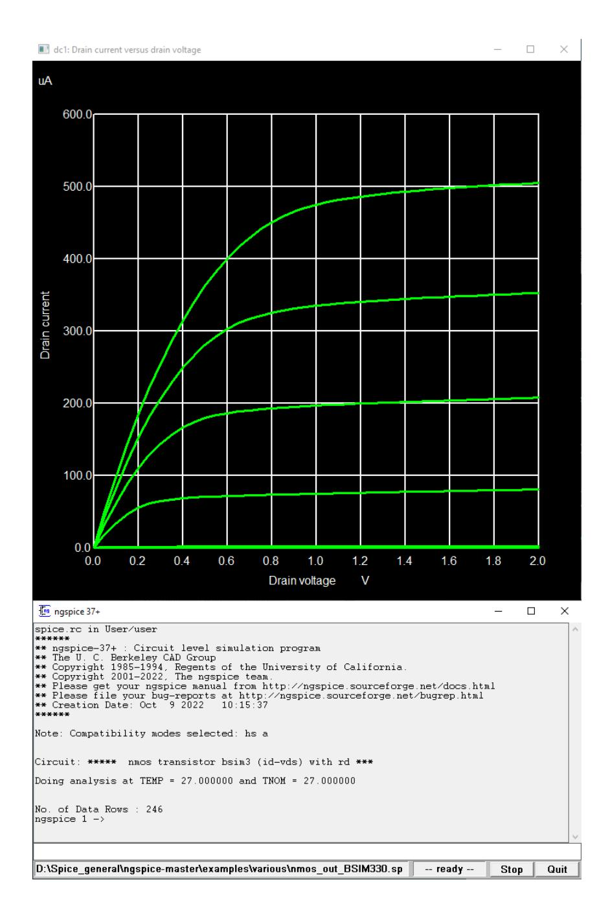

<span id="page-477-0"></span>Figure 14.1: MS Windows GUI

The output window displays messages issued by ngspice. You may scroll the window to get more of the text. The input box (white box) may be activated by a mouse click to accept any of the valid ngspice commands. The lower left output bar displays the actual input file. ngspice progress during setup and simulation is shown in the progress window (--ready--). The Stop button will interrupt the current simulation. Data may be analysed, simulation resumed by the command resume. However, if ngspice is running in a flow or loop from within a .control section, this flow or loop stays interrupted, only the current simulation job will be finished by resume. The Quit button allows exiting ngspice. If ngspice is actively simulating, due to using only a single thread, this interrupt has to wait until the window is accessible from within ngspice, e.g. during an update of the progress window.

In the plot window there is the upper left button, which activates a drop down menu. You may

select to print the plot window shown (a simple printer interface), set up any of the printers available on your computer, or issue a postscript file or a SVG file of the active plot window.

A left-click in the plot window will print the coordinates of that point in the text window, allowing data to be captured from the plot. Click, drag and release will show both start and end points, as well as the slope of the line joining them. Click and drag with the right button outlines a rectangle; on release a new window opens with a"zoomed" plot of that rectangular area.

Instead of plotting with black background, you may set the background to any other color, preferably to 'white' using the command shown below.

Input file modification for white background:

```
.control
run
* white background
set color0=white
* black grid and text (only needed with X11, automatic with MS Win)
set color1=black
* wider plot lines
set xbrushwidth=2
plot vss#branch
.endc
```

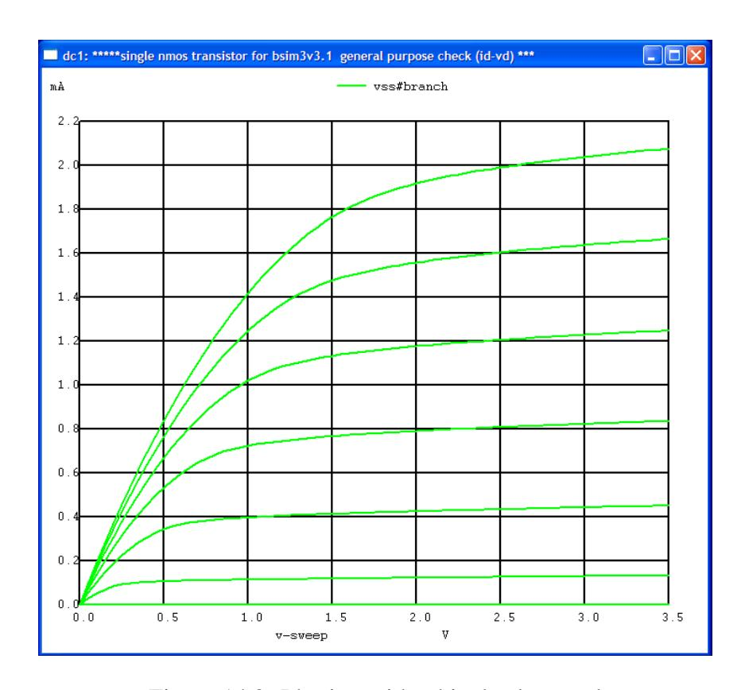

Figure 14.2: Plotting with white background

Many more set command options are available to customize the plot window. To name a few

(please see [13.7](#page-451-2) for details): colorN, gridsize, gridstyle, plotstyle, pointchars, ticchar, ticmarks, ticlist, wfont[1](#page-479-3) , wfont\_size, xbrushwidth, xgridwidth, xfont[2](#page-479-4) , xfont\_size.

As ngspice supports UNICODE text, fonts supporting other letterings than plain English may be selected, e.g. Korean, Japanese, Chinese, Cyrillic, Arabic etc..

# <span id="page-479-0"></span>14.2 MS Windows Console

If the --with-wingui flag for ./configure under MINGW is omitted (see [28.2.4\)](#page-743-1) or console\_debug or console\_release is selected in the MS Visual Studio configuration manager, then ngspice will compile without any internal graphical input or output capability. This may be useful if you apply ngspice in a pipe inside the MSYS window, or use it being called from another program, and just generating output files from a given input. The plot [\(13.5.55\)](#page-421-0) command will not work and leads to an error message. In the MS Windows release of ngspice its binary is distributed as ngspice\_con.exe.

Only on the ngspice console binary in MS Windows input/output redirection is possible, if ngspice is called (e.g. within a MSYS shell or from a shell script) like

```
$ ngspice_con < input.
```

This feature is used in the new CMC model test suite (to be described elsewhere), thus requires a console binary.

You still may generate graphics output plots or prints by gnuplot [\(13.5.38\)](#page-411-2), if installed properly [\(14.7\)](#page-489-0), or by selecting a suitable printing option [\(14.6\)](#page-480-1).

# <span id="page-479-1"></span>14.3 Linux

The standard user interface is a console for input and the X11 graphics system for output with the interactive plot [\(13.5.55\)](#page-421-0) command. If ngspice is compiled with the –without-x flag for ./configure, a console application without graphical interface results. For more sophisticated input user interfaces please have a look at Chapt. [14.8.](#page-494-0)

The X11 UI has buttons to save the plot in formats suitable for printing or inclusion in a web page. The mouse actions in the plot window are the same as the Windows UI. In addition, when the pointer is in the plot, keyboard input is inserted at the pointer position so that the plot can be annotated. Annotations are included in saved files.

# <span id="page-479-2"></span>14.4 CygWin

The CygWin interface is similar to the Linux interface [\(14.3\)](#page-479-1), i.e. console input and X11 graphics output. To avoid the warning of a missing graphical user interface, you have to start the X11 window manager by issuing the commands

\$ export DISPLAY=:0.0

<span id="page-479-3"></span><sup>1</sup>Win GUI only

<span id="page-479-4"></span><sup>2</sup>X11 only

<span id="page-480-3"></span>\$ xwin -multiwindow -clipboard & inside of the CygWin window before starting ngspice.

# <span id="page-480-0"></span>14.5 Error handling

Error messages and error handling in ngspice have grown over the years, include a lot of 'traditional' behavior and thus are not very systematic and consistent.

Error messages may occur with the token 'Error:'. Often the errors are non-recoverable and will lead to exiting ngspice with error code 1. Sometimes, however, you will get an error message, but ngspice will continue, and may either bail out later because the error has propagated into the simulation, sometimes ngspice will continue, deliver wrong results and exit with error code 0 (no error detected!).

In addition ngspice may issue warning messages like 'Warning: ...'. These should cover recoverable errors only.

So there is still work to be done to define a consistent error messaging, recovery or exiting. A first step is the user definable variable **strict\_errorhandling**. This variable may be set in files spinit [\(12.5\)](#page-361-0) or .spiceinit [\(12.6\)](#page-363-0) to immediately stop ngspice, after an error is detected during parsing the circuit. An error message is sent, the ngspice exit code is 1. This behavior deviates from traditional SPICE error handling and thus is introduced as an option only.

XSPICE error messages are explained in Chapt. [25.](#page-628-0)

# <span id="page-480-1"></span>14.6 Output-to-file options

ngspice offers a large variety of writing simulation results into a file. This chapter will give a short summary of the available options.

## <span id="page-480-2"></span>14.6.1 Graphics files

### 14.6.1.1 SVG

#### How to prepare a plot

Various SVG settings are given by setting the following two variables:

```
svg_intopts Sets the plot parameters by numbers "svgwidth", "svgheight", "svgfont-size",
     "svgfont-width", "svguse-color", "svgstroke-width", "svggrid-width", .
```

**svg\_stropts** Sets the plot parameters by strings "svgbackground", "svgfont-family", "svgfont" . Use command setcs to keep upper and lower case.

Usage

```
.control
set svg_intopts = ( 512 384 20 0 1 2 0 )
setcs svg_stropts = ( blue Arial Arial )
.endc
```

The following variables may override some of the above mentioned parameters or provide more details.

**hcopyfont** This variable specifies the font name for hardcopy output plots. The value is device dependent.

**hcopyfontsize** This is a scaling factor for the font used in hardcopy plots.

**hcopydevtype** The variable specifies the type of the printer output to use in the hardcopy command. It has to be set to set hcopydevtype=svg.

**hcopyscale** This is a scaling factor for the font used in hardcopy plots (between 0 and 10).

**hcopywidth** Sets width of the hardcopy plot.

**hcopyheight** Sets height of the hardcopy plot.

**colorN** These variables determine the colors used during plotting. Color values may be entered as RGB values from 0 to 255 (hex or decimal) or stating a color name. The identification number N may be an integer between 0 and 20. Color0 is the background, color1 is the grid and text color, and color ids from 2 through 20 are used for graphs (vectors) plotted. The available color strings are (use the string inside of the hyphens): "black", "white", "red", "blue", "#FFA500" (orange), "green", "#FFC0C5" (pink), "#A52A2A" (brown), "#F0E68C" (khaki), "#DDA0DD" (plum), "#DA70D6" (orchid), "#EE82EE" (violet), "#B03060" (maroon); "#40E0D0" (turqoise), "#A0522D" (sienna), "#FF7F50" (coral), "cyan", "magenta", "#666" (gray for smith grid), "#949494" (gray for smith grid), "#888" (gray for normal grid). Examples are set color3=blue or set color3="#EE82EE". If no color id is set, then the above mentioned, predefined set of colors is applied automatically.

**xbrushwidth** Linewidth for graph (see xgridwidth for border and grid). Valid for MS Windows GUI, X11, gnuplot and Postscript.

**xgridwidth** Linewidth for border and grid. Valid for MS Windows GUI, X11, gnuplot and Postscript.

#### The plot-to-file command

hardcopy file vector <vectors> <title text> <xlabel text> <ylabel text>

#### <span id="page-482-0"></span>Usage

```
.control
* simulation commands here
set hcopydevtype = svg
set svg_intopts = ( 512 384 20 0 1 2 0 )
setcs svg_stropts = ( yellow Arial Arial )
set color1=blue
set color2=green
hardcopy plot_1.svg vss#branch title 'Plot no. 4'
+ xlabel 'Drain voltage' ylabel 'Drain current'
* plot to screen commands here
.endc
```

#### Plot-to-screen

The file contents may be plotted to the screen. For MS Windows you may use the Internet Explorer or EDGE, linked to the .svg file extension. Under Cygwin or Linux you may install the program feh for plotting with the following commands:

Plot to screen commands

```
* for MS Windows only
if $oscompiled = 1 | $oscompiled = 8
  shell Start plot_1.svg
else
* for CYGWIN, Linux
  shell feh --magick-timeout 1 plot_1.svg &
end
```

#### 14.6.1.2 PostScript

#### How to prepare a plot

Variables to modify the PostScript plot are listed below. Background and text colors may be set. The colors of the graphs are then chosen automatically, starting with red. Valid colors are 0: black 1: white 2: red 3: blue 4: orange 5: green 6: pink 7: brown 8: khaki 9: plum 10: orchid 11: violet 12: maroon 13: turquoise 14: sienna 15: coral 16: cyan 17: magenta 18: gray (for smith grid) 19: gray (for smith grid) 20: gray (for normal grid).

**hcopypscolor** Sets the color of the hardcopy output byselecting a integer number. If not set, black & white plotting is assumed with different linestyles for each output vector. A valid color integer value yields a colored plot background (0: black 1: white, others see above). and colored solid lines.

**hcopypstxcolor** This variable sets the color of the text in the Postscript hardcopy output. If not set, black on white background is assumed, if the background is colored or black, white text is printed.

**hcopyfont** This variable specifies the font name for hardcopy output plots. The value is device dependent.

**hcopyfontsize** This is a scaling factor for the font used in hardcopy plots.

**hcopydevtype** The variable specifies the type of the printer output to use in the hardcopy command. It has to be set to set hcopydevtype=svg.

**hcopyscale** This is a scaling factor for the font used in hardcopy plots (between 0 and 10).

**hcopywidth** Sets width of the hardcopy plot.

**hcopyheight** Sets height of the hardcopy plot.

**xbrushwidth** Linewidth for graph (see xgridwidth for border and grid). Valid for MS Windows GUI, X11, gnuplot and Postscript.

**xgridwidth** Linewidth for border and grid. Valid for MS Windows GUI, X11, gnuplot and Postscript.

The corresponding input file for the examples given below is listed in Chapt. [17.1.](#page-528-0) Just add the .control section to this file and run in interactive mode by

```
$ ngspice xspice_c1_print.cir
```

One way is to setup your printing like this will yield a black&white plot:

```
.control
set hcopydevtype=postscript
op
run
plot vcc coll emit
hardcopy temp.ps vcc coll emit
.endc
```

Then print the postscript file temp.ps to the screen. This may be done by a ngspice shell command, depending on the operating system and the installed viewer tools (like gv or others):

```
* for MS Windows only
if $oscompiled = 1 | $oscompiled = 8
  shell Start /B temp.ps
* for CYGWIN
else
  shell gv temp.ps &
end
```

You can add color traces to it if you wish:

```
.control
set hcopydevtype=postscript
* allow color and set background color if set to value >= 0
set hcopypscolor=1 ; white
set hcopypstxcolor = 3 ; blue
* The colors of the graphs are set automatically.
set xgridwidth=2
set xbrushwidth=3
run
hardcopy temp.ps vcc coll emit
.endc
```

Then print the postscript file temp.ps to a postscript printer.

You can also direct your output directly to a designated printer (not available in MS Windows):

```
.control
set hcopydevtype=postscript
*send output to the printer kec3112-clr
set hcopydev=kec3112-clr
hardcopy out.tmp vcc coll emit
.endc
```

#### <span id="page-484-0"></span>14.6.1.3 PNG

There is no png driver integrated into ngspice. One may use the gnuplot interface (see [14.7\)](#page-489-0) to create a png file.

Usage

```
.control
* simulation commands here
set gnuplot_terminal=png/quit
gnuplot plot_1 vss#branch vss2#branch
+ title 'Drain current versus drain voltage'
+ xlabel 'Drain voltage / V' ylabel 'Drain current / uA'
* plot to screen commands here
.endc
```

This command sequence will generate a png file plot\_1.png in the current directory. You will need to have gnuplot installed.

A few remarks are due: Generally you should use a text editor for the input files that allows to set the character encoding to utf-8. you may give a true µA in the label text, not only the uA. Otherwise a µ in the input file may lead ngspice to fail the utf-8 syntax test. For sake of having not enough characters per line available in the final pdf manual to fitting the gnuplot command, the line continuation is used in the above example with a + character in the first column. Unfortunately this has a strange side effect in a real ngspice input file, in that all letters become lower case in the continuation lines. So better create a single (long) line containing the complete gnuplot command.

<span id="page-485-1"></span>Plotting the png file to the screen can be achieved from within the .control section by Plot to screen commands

```
* for MS Windows only
if $oscompiled = 1 | $oscompiled = 8
  shell Start c:\"program files"\irfanview\i_view64.exe plot_1.png
else
* for CYGWIN, Linux
  shell feh --magick-timeout 1 plot_1.png &
end
```

You will need to install a suitable viewer program (e.g. irfanview or feh).

#### <span id="page-485-0"></span>14.6.1.4 VCD

Value Change Dump (VCD) (also known less commonly as "Variable Change Dump") is an ASCII-based format for dumpfiles generated by event based logic simulation. The eprvcd command is used by ngspice to print out the digital event nodes and real-valued expressions versus time.

General Form:

```
eprvcd [-t unit][-a] node1 node2 .. noden [ > filename ]
```

Example usage:

```
eprvcd 1 2 3 4 5 6 7 8 s0 s1 s2 s3 c3 > adder_x.vcd
```

Values for analog nodes and expressions (as for plot ) may be included, but expressions may not contain spaces. Option "-t" sets the VCD file's time unit; values are rounded to a negative power of 10. If not used the unit is chosen to fit the simulation's maximum timestep. Analog values are examined only when an XSPICE event values changes unless option "-a" is used to dump them at each timestep.

The file addr\_x.vcd may be displayed by the following .control section (gtkwave has to be installed):

Plot to screen commands

```
* plotting the vcd file (e.g. with GTKWave)
* For Windows: returns control to ngspice
if $oscompiled = 1 | $oscompiled = 8
  shell start gtkwave adder_x.vcd --script nggtk.tcl
else
* for CYGWIN, Linux, others
  shell gtkwave adder_x.vcd --script nggtk.tcl &
end
```

with the tcl script to control gtkwave

<span id="page-486-1"></span>nggtk.tcl

```
# tcl script for gtkwave: show vcd file data created by ngspice
set nfacs [ gtkwave::getNumFacs ]
for {set i 0} {$i < $nfacs } {incr i} {
    set facname [ gtkwave::getFacName $i ]
    set num_added [ gtkwave::addSignalsFromList $facname ]
}
gtkwave::/Edit/UnHighlight_All
gtkwave::/Time/Zoom/Zoom_Full
```

## <span id="page-486-0"></span>14.6.2 Tabulated files

#### 14.6.2.1 Rawfile

This is the traditional spice-compatible output file for simulation data. It will be generated during simulation if ngspice is started in batch mode [\(12.4.1\)](#page-359-1) like

```
ngspice -b -r mysim.raw -o mysim.log myinput.cir
```

where mysim.raw, following the -r flag, is the rawfile. It may be created as well from inside a control section using the write command [\(13.5.105\)](#page-445-1) like

```
write mysim.raw all
```

If not all result vetcors are to be stored in the rawfile, the .save command [\(11.6.1\)](#page-346-2) will limit the number of vectors to the ones liste after the command. One also may limit their numbers if the vectors are explicitely stated in the write command

```
write mysim.raw v(node1) v2#branch
```

The rawfile consists of an ascii header, followed by the data, either in ascii or binary format.

**filetype** This can be either **ascii** or **binary**, and determines the format of the raw file (compact binary or text editor readable ascii). The default is **binary**.

All simulations (e.g. if .tran follow .ac) will be saved consecutively. If using the write command, setting variable appendwrite will allow storing several sim outputs in a single file.

**appendwrite** Append to the file when a write command is issued, if one already exists.

#### <span id="page-487-0"></span>14.6.2.2 Command wrdata

wrdata generates a file containing simulation data in a tabular fashion. For details please see [13.5.104.](#page-445-0) The following variables and options are aknowledged:

**appendwrite** Append to the file when a write command is issued, if one already exists.

**numdgt** The number of digits to use when printing tables of data (print col). The default precision is 6 digits. On the PC, approximately 16 decimal digits are available using double precision, so p should not be more than 16. If the output number is negative, one digit less is printed to ensure constant widths in tables.

**wr\_singlescale** The scale vector will be printed only once, if all scale vectors are of the same length.

**wr\_vecnames** Scale and data vector names are printed on the first row.

#### 14.6.2.3 Command wrs2p, Touchstone File Format Version 1

wrs2ps allows to write a file, containing S parameter data, in the Touchstone File Format Version 1. For details please see [13.5.107](#page-447-0) for the command and [13.9](#page-471-0) for generating the Sparameters.

#### 14.6.2.4 Output redirection

Anything that is printable to the console by a control section command, may be redirected into a file. See also [13.4.1.](#page-391-1)

Example usage:

```
* create a new file and write to it
echo new file > nfile.txt
* append line to existing file
echo second line >> nfile.txt
```

The following variable is recognized:

**noclobber** Don't overwrite existing files when doing IO redirection.

#### 14.6.2.5 Command echo

Echos all text, variables and vectors to the screen or the redirected output location (see also [13.5.26\)](#page-405-2).

#### <span id="page-488-0"></span>Example usage:

```
* variable
setcs myvar=great
set empty=""
* vector
let lineno=1
* empty line
echo
* vectors and variables may be included
echo This is a $myvar output with $&lineno line(s).
* no line feed, empty var to allow blank
echo -n This is still a $myvar output $empty
echo with $&lineno line(s).
```

#### 14.6.2.6 Command print

General Form:

```
print [col] [line] expr ...
```

Prints the vector(s) described by the expression expr. Please see [13.5.58](#page-423-2) for details. Expression expr. may be a list of vectors, but also a mathematical expression combining vectors and constants according to [13.2.](#page-385-0)

Example:

```
print v(1) 3*v(2)
```

The following variables and options are aknowledged:

**appendwrite** Append to the file when a write command is issued, if one already exists.

**moremode** If moremode is set, whenever a large amount of data is being printed to the screen (e.g, the print or asciiplot commands), the output is stopped every screenful and continues when a carriage return is typed. If moremode is unset, then data scrolls off the screen without pausing.

**noprintscale** Don't print the scale in the leftmost column when a print col command is given.

**numdgt** The number of digits to use when printing tables of data (print col). The default precision is 6 digits. On the PC, approximately 16 decimal digits are available using double precision, so p should not be more than 16. If the output number is negative, one digit less is printed to ensure constant widths in tables.

#### 14.6.2.7 Command eprint

Prints event driven nodes to the console (or a file when using output redirection). See [13.5.29](#page-406-2) and [23.2.2](#page-585-0) for an example.

# <span id="page-489-2"></span><span id="page-489-0"></span>14.7 Gnuplot

## <span id="page-489-1"></span>14.7.1 Using Gnuplot to produce 1D graphs of (electrical) simulation results

Plotting with Gnuplot is directly available from the ngspice .control section or interactive command. Install Gnuplot (on Linux available from the distribution, on Windows available [here\)](https://sourceforge.net/projects/gnuplot/files/latest/download). On Windows, expand the zip file to a directory of your choice, add the path <any directory>/gnuplot/bin to the PATH variable, and off you go... The command to invoke Gnuplot [\(13.5.38\)](#page-411-2) is limited to x/y plots (no polar etc.).

General Form:

```
gnuplot file plotargs
```

plotargs is a list of vectors to be plotted. file may either be temp or tmp or a file name (without file extension).

Plot window only:

```
gnuplot temp vss#branch vss2#branch
```

- + title 'Drain current versus drain voltage'
- + xlabel 'Drain voltage / V' ylabel 'Drain current / uA'

ngspice generates temporary data and command files for Gnuplot, calls Gnuplot for openening the plot windows and then discards the temporary files.

Plot window plus command and data files:

```
gnuplot newplot vss#branch vss2#branch
+ title 'Drain current versus drain voltage'
+ xlabel 'Drain voltage / V' ylabel 'Drain current / uA'
```

Gnuplot command file newplot.plt and data file newplot.data are generated to stay in the current directory. The command file may be modified to alter the plot, and then called by gnuplot newplot.plt to draw the modified plot.

The following variables are aknowledged by the gnuplot command:

**gnuplot\_terminal** May be one of the following: png (write png file and plot to screen), png/quit (write png file but no plot, see [14.6.1.3\)](#page-484-0), eps (write PostScript file and plot to screen), eps/quit (write PostScript file, but no plot), xterm (open gnuplot in an xterm window).

**xbrushwidth** Linewidth for graph (see xgridwidth for border and grid). Valid for MS Windows GUI, X11, gnuplot and Postscript.

**xgridwidth** Linewidth for border and grid. Valid for MS Windows GUI, X11, gnuplot and Postscript.

14.7. GNUPLOT 491

**plotstyle** This should be one of **linplot**, **combplot**, or **pointplot**. **linplot**, the default, causes points to be plotted as parts of connected lines. **combplot** causes a comb plot to be done. It plots vectors by drawing a vertical line from each point to the X-axis, as opposed to joining the points. **pointplot** causes each point to be plotted separately.

**nolegend** Don't plot the legend, when using the plot command.

## <span id="page-490-0"></span>14.7.2 Using gnuplot to produce 2D contour plots for Cider

The gnuplot command to generate 2D x/y contour plots from Cider models is: General Form:

```
gnuplot file xycontour expr
```

The xycontour switch is ignored if the data is not from a 2D Cider model. expr is a single plotarg expression which specifies the vector to be plotted. file has the same meaning as in section [14.7.1](#page-489-1) previously. The only variable which affects the gnuplot xycontour option is **gnuplot\_terminal**.

Before a plot can be created, the Cider solution file containing the data you are interested in must be loaded with the LOAD [\(13.5.47\)](#page-418-0) command. The example later in this section demonstrates the steps to be followed.

The Cider OUTPUT command (see [26.14\)](#page-662-0) explains how to get solution files for a Cider model. It is important to include a 'rootfile' parameter in the OUTPUT command which specifies a subdirectory to hold the solution files themselves. Depending on the analysis type, solution files have a prefix OP, DC, or TR. There can be many of these files created, one per DC sweep value or per TR time step, so it is essential the 'rootfile' subdirectory is created prior to running ngspice to generate the solution files. In addition, device instances D\*, Q\*, and M\* of Cider models need to have the 'SAVE' parameter set.

The 2D Cider models are NUMD level 2 (see [26.17\)](#page-667-0), NBJT level 2 (see [26.18\)](#page-669-2), and NUMOS (see [26.19\)](#page-671-2). 1D Cider models are level 1 NUMD and NBJT. The solution files for 1D models can be plotted as the normal curves using PLOT [\(13.5.55\)](#page-421-0) and GNUPLOT (without xycontour, [13.5.38](#page-411-2) and [14.7.1\)](#page-489-1).

#### 14.7.2.1 Example of a 2D jfet

File jfet1.cir, is run as follows from a bash console window (Linux, or MSYS2):

```
mkdir ./j1root
```

ngspice -b jfet1.cir

Filenames will need to be modified appropriately for Windows.

Notes relating to the jfet1.cir file:

1. The QJ1 instance line has the 'SAVE' parameter, and the 'rootfile' subdirectory is specified on the output statement.

| 2. | A Cider solution file is loaded after the simulation has run and before the gnuplot com<br>mands:<br>load<br>./j1root/DC.12.qj1<br>The currently active vectors are listed after the load.               |
|----|----------------------------------------------------------------------------------------------------------------------------------------------------------------------------------------------------------|
| 3. | The sleep commands (or timeout /t on Windows) give the display time to draw the con<br>tours. This is only necessary when executing a batch script; for an interactive session they<br>are not required. |
| 4. | The contours of a single vector phin are plotted by:<br>gnuplot<br>gplot1<br>xycontour<br>phin                                                                                                           |
| 5. | The contours of the electric field magnitude are plotted by:<br>gnuplot<br>gplot2<br>xycontour<br>sqrt((ex<br>ex)<br>+<br>(ey<br>ey))<br>*<br>*                                                          |
| 6. | The gnuplot_terminal variable controls the output from gnuplot:<br>gnuplot_terminal=png/quit<br>set                                                                                                      |

7. Following this, gnuplot commands will send the plot to a .png file.

14.7. GNUPLOT 493

JFET example netlist jfet1.cir:

.end

```
***** jfet1.cir *****
*Two-dimensional Junction Field-Effect Transistor (JFET)
VDD 1 0 0.5V
VGG 2 0 -1.0v AC 1V
VSS 3 0 0.0V
OJ1 1 2 3 M_NJF AREA=1 SAVE
.MODEL M_NJF NBJT LEVEL=2
+ options jfet defw=10.0um
+ output rootfile="./jlroot/" psi n.conc p.conc phin phip equ.psi vac.psi
+ x.mesh w=0.2 h.e=0.001 r=1.8
+ x.mesh w=0.8 h.s=0.001 h.m=0.1 r=2.0
+ x.mesh w=0.8 h.e=0.001 h.m=0.1 r=2.0
+ x.mesh w=0.2 h.s=0.001 r=1.8
+ y.mesh w=0.2 h.e=0.01 r=1.8
+ y.mesh w=0.8 h.s=0.01 h.m=0.1 r=1.8
+ domain num=1 mat=1
+ material num=1 silicon
+ elec num=1 x.l=0.0 x.h=0.0 y.l=0.0 y.h=1.0
+ elec num=2 x.l=0.5 x.h=1.5 y.l=0.0 y.h=0.0
+ elec num=3 x.l=2.0 x.h=2.0 y.l=0.0 y.h=1.0
+ doping unif n.type conc=3.0e15
+ doping unif p.type conc=2.0e17 x.l=0.2 x.h=1.8 y.h=0.2
+ models bgn srh auger conctau concmob fieldmob ^aval
.option bypass=1 temp=27
.control
dc vgg 0.0 -2.0001 -0.1
print i(vss)
load ./j1root/DC.12.qj1
shell 'sleep 1'
gnuplot gplot1 xycontour phin
shell 'sleep 1'
gnuplot gplot2 xycontour sqrt((ex * ex) + (ey * ey))
shell 'sleep 1'
set gnuplot_terminal=png/guit
gnuplot gplot3 xycontour phin
shell 'sleep 1'
gnuplot gplot4 xycontour sqrt((ex * ex) + (ey * ey))
shell 'sleep 1'
quit
.endc
```

The two contour graphs thus simulated are shown here:

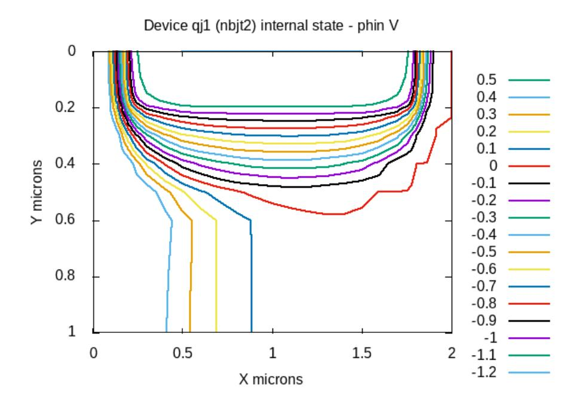

Figure 14.3: Potential

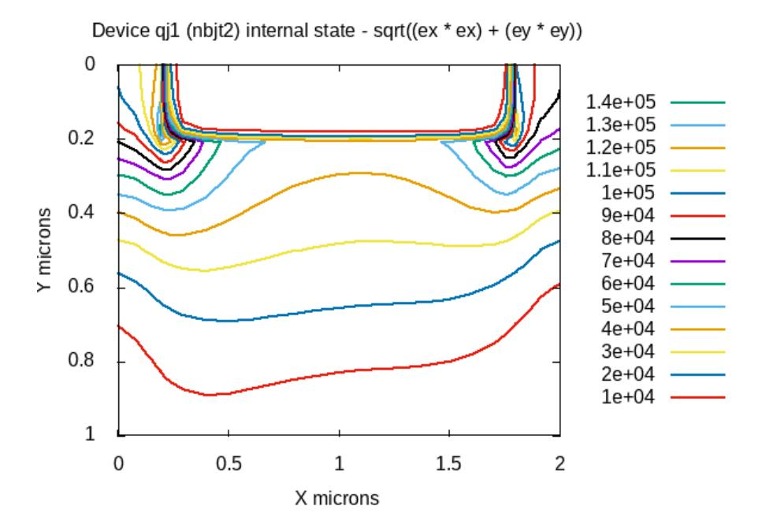

Figure 14.4: Electrical field

# <span id="page-494-0"></span>14.8 Integration with CAD software and 'third party' GUIs

In this chapter you will find some links and comments on GUIs for ngspice offered from other projects and on the integration of ngspice into a circuit development flow. The data given rely mostly on information available from the web and thus is out of our control. It also may be far from complete. For a list of actual links with more than 20 entries please have a look at the [ngspice web pages.](https://ngspice.sourceforge.io/resources.html) Some open source tools are listed here. The GUIs MSEspice and GNUSpiceGUI help you to navigate the commands to need to perform your simulation. XCircuit and the GEDA tools gschem and gnetlist offer integrating schematic capture and simulation. KiCad offers a complete design environment for electronic circuits. Xschem focusses on IC design, supporting all the open source PDKs.

## <span id="page-494-1"></span>14.8.1 KiCad

[KiCad](https://www.kicad.org/) is a cross platform and open source electronics design automation suite. Its schematic editor Eeschema fully integrates shared ngspice (see Chapt. [15\)](#page-496-0) as the simulation tool. The target audience is PCB circuit designers, using discrete devices, ICs and passives. On the ngspice web pages there is a [tutorial](https://ngspice.sourceforge.io/ngspice-eeschema.html) available which presents an introduction to using ngspice from within KiCad. Simulation examples are presented at [KiCad/ngspice simulation examples 1](https://forum.kicad.info/t/simulation-examples-for-kicad-eeschema-ngspice/34443) and [KiCad/ngspice simulation examples 2.](https://forum.kicad.info/t/more-simulation-examples-for-kicad-eeschema-ngspice/45546)

## <span id="page-494-2"></span>14.8.2 Xschem

[Xschem](https://xschem.sourceforge.io/stefan/index.html) is a schematic capture program, it allows to create a hierarchical representation of circuits with a top down approach . By focusing on interconnections, hierarchy and properties a complex system (IC) can be described in terms of simpler building blocks. A VHDL, Verilog or ngspice netlist can be generated from the drawn schematic, allowing the simulation of the circuit. The target audience is IC designers, especially the open source PDKs from Skywater, Google and IHP are supported. An excellent [video](https://www.youtube.com/watch?v=bYbkz8FXnsQ) introduces the design and simulation of a CMOS comparator.

## <span id="page-494-3"></span>14.8.3 Qucs-S

[Qucs-S](https://ra3xdh.github.io/) is a circuit simulation program based on the Qucs circuit simulator. The "S" letter indicates SPICE. The purpose of the Qucs-S project is to use free SPICE circuit simulation kernels with the GUI based on Qt toolkit. It merges the power of SPICE and the simplicity of the Qucs GUI. Qucs-S is not a simulator by itself, but it requires to use an external simulation backend, e.g. ngspice, with it. Quc-S is strong when simulating RF devices and circuits.

## <span id="page-494-4"></span>14.8.4 GNU Spice GUI

A GUI, to be found at [https://sourceforge.net/projects/gspiceui/.](https://sourceforge.net/projects/gspiceui/) It aids in viewing, modifying, and simulating SPICE CIRCUIT files.

## <span id="page-495-0"></span>14.8.5 XCircuit

CYGWIN and especially Linux users may find [XCircuit](http://opencircuitdesign.com/xcircuit/) valuable to establish a development flow including [schematic capture](http://opencircuitdesign.com/xcircuit/tutorial/tutorial2.html) and circuit simulation.

## <span id="page-495-1"></span>14.8.6 NyanCAD Mosaic

Mosaic is a web-based tool for designing and simulating analog integrated circuits. It focuses on a modern, easy to use interface, instant design feedback, design reuse, verification, and automation. ngspice is supported as simulator.

<https://nyancad.com/docs/>

<https://github.com/NyanCAD/Mosaic>

## <span id="page-495-2"></span>14.8.7 MSEspice

A [graphical front end](https://sourceforge.net/projects/mseuniverse/) to ngspice, using the Free Pascal cross platform RAD environment [MSEide+MSEgui.](https://mseide-msegui.sourceforge.io/)

## <span id="page-495-3"></span>14.8.8 GNU Octave

[GNU Octave](https://octave.org/) is a high-level language, primarily intended for numerical computations. An interface to ngspice is available [here.](https://www.dsprelated.com/showarticle/707.php)

# <span id="page-496-0"></span>Chapter 15

# ngspice as shared library or dynamic link library

ngspice may be compiled as a shared library. This allows adding ngspice to an application that then gains control over the simulator. The shared module offers an interface that exports functions controlling the simulator and callback functions for feedback.

So you may send an input 'file' with a netlist to ngspice, start the simulation in a separate thread, read back simulation data at each time point, stop the simulator depending on some condition, alter device or model parameters and then resume the simulation. Specific node values may be controlled during simulation by EXTERNAL voltage or current sources [\(4.1.9\)](#page-99-0). The simulator calls back to the user program at each simulation step to request new values [\(15.3.3.11\)](#page-507-2).

Shared ngspice does not have any user interface. The calling process is responsible for this. It may offer a graphical user interface, add plotting capability or any other interactive element. You may develop and optimize these user interface elements without a need to alter the ngspice source code itself, using a console application or GUIs like gtk, Delphi, Qt or others.

# <span id="page-496-1"></span>15.1 Compile options

## <span id="page-496-2"></span>15.1.1 How to get the sources

Currently (as of ngspice-27 being the actual release), you will have to use the direct loading of the sources from the git repository (see Chapt. [28.1.2\)](#page-728-3).

## <span id="page-496-3"></span>15.1.2 Linux, MINGW, CYGWIN

Compilation is done as described in Chapts. [28.1](#page-728-1) or [28.2.2](#page-740-0)**.** Use the configure option **--with-ngshared** instead of **--with-x** or **--with-wingui**. In addition you might add (optionally) **--enable-relpath** to avoid absolute paths when searching for code models. For MINGW you may edit compile\_min.sh accordingly and compile using this script in the MSYS2 window.

Other operation systems (Mac OS, BSD, ...) have not been tested so far. Your input is welcome!

## <span id="page-497-0"></span>15.1.3 MS Visual Studio

Compilation is similar to what has been described in Chapt. [28.2.1.](#page-736-1) However, there is a dedicated project file coming with the source code to generate ngspice.dll. Go to the directory **visualc** and start the project with double clicking on **sharedspice.vcxproj**.

# <span id="page-497-1"></span>15.2 Linking shared ngspice to a calling application

Basically there are two methods (as with all \*.so, \*.dll libraries). The caller may link to a (small) library file during compiling/linking, and then immediately search for the shared library upon being started. It is also possible to dynamically load the ngspice shared library at runtime using the dlopen/LoadLibrary mechanisms.

## <span id="page-497-2"></span>15.2.1 Linking during creating the caller

While creating the ngspice shared lib, not only the \*.so (\*.dll) file is created, but also a small library file, which just includes references to the exported symbols. Depending on the OS, these may be called libngspice.dll.a, ngspice.lib. Linux and MINGW also allow linking to the shared object itself. The shared object is not included into the executable component but is tied to the execution.

## <span id="page-497-3"></span>15.2.2 Loading at runtime

dlopen (Linux) or LoadLibrary (MS Windows) will load libngspice.so or ngspice.dll into the address space of the caller at runtime. The functions return a handle that may be used to acquire the pointers to the functions exported by libngspice.so. Detaching ngspice at runtime is equally possible (using dlclose/FreeLibrary), after the background thread has been stopped and all callbacks have returned.

# <span id="page-497-4"></span>15.3 Shared ngspice API

The sources for the ngspice shared library API are contained in a single C file (sharedspice.c) and a corresponding header file sharedspice.h. The type and function declarations are contained in sharedspice.h, which may be directly added to the calling application, if written in C or C++.

## <span id="page-497-5"></span>15.3.1 structs and types defined for transporting data

pvector\_info is returned by the exported function ngGet\_Vec\_Info (see [15.3.2.8\)](#page-502-0). Addresses of the vector name, type, real or complex data are transferred and may be read asynchronously during or after the simulation.

vector\_info

```
typedef struct vector_info {
   char *v_name;
```

The next two structures are used by the callback function SendInitData (see 15.3.3.5). Each time a new plot is generated during simulation, e.g. when a sequence of op, ac or tran is used, or commands like linearize or fft are invoked, the function is called once by ngspice. Among its parameters you find a pointer to a struct vecinfoall, which includes an array of vecinfo, one for each vector. Pointers to the struct dvec, containing the vector, are included.

vecinfo

```
typedef struct vecinfo
                          /* number of the vector, its position in the
       int number:
                             linked list of vectors, starts with 0 */
       char *vecname;
                          /* name of the vector */
                          /* TRUE if the vector has real data */
       bool is_real;
       void *pdvec;
                          /* a void pointer to struct dvec *d,
                             containing the data array of the vector */
       void *pdvecscale; /* a void pointer to struct dvec *ds,
                             the scale vector */
    } vecinfo, *pvecinfo;
vecinfoall
    typedef struct vecinfoall
    {
        /* the plot */
        char *name;
        char *title;
        char *date:
         char *type;
        int veccount;
        /* the data as an array of vecinfo with
            length equal to the number of vectors
            in the plot */
         pvecinfo *vecs;
    } vecinfoall, *pvecinfoall;
```

The next two structures are used by the callback function SendData (see 15.3.3.4). Each time a new data point (e.g. time value and simulation output value(s)) is added to the vector structure of the current plot, the function **SendData** is called by ngspice, among its parameters the actual pointer pvecvaluesall, which contains an array of pointers to pvecvalues, one for each vector. Logic return values are of type NG\_BOOL, which is typedefed to int.

vecvalues

```
typedef struct vecvalues {
   char* name;
```

Pointer vecvaluesall to be found as parameter to callback function **SendData.** 

vecvaluesall

```
typedef struct vecvaluesall {
   int veccount;
```

When a new simulation (op, dc, ac, tran etc.) is started, a new 'plot' structure (see 13.3) with its vectors is set up. Several data structures, as described above, are set up as well, belonging to this 'plot': pvecinfo with vecinfo for each vector, vecinfoall, vecvaluesall, pvecvalues, and vecvalues for each vector. Their pointers are kept constant during the current simulation, they are created anew when another simulation is executed.

## <span id="page-499-0"></span>**15.3.2** Exported functions

The functions listed in this chapter are the (only) symbols exported by the shared library.

# <span id="page-499-1"></span>15.3.2.1 int ngSpice\_Init(SendChar\*, SendStat\*, ControlledExit\*, SendData\*, SendInit-Data\*, BGThreadRunning\*, void\*)

After caller has loaded ngspice.dll, the simulator has to be initialized by calling ngSpice\_Init(...). Address pointers of several callback functions (see 15.3.3), which are to be defined in the caller, are sent to ngspice.dll. The int return value is not used.

Pointers to callback functions (details see 15.3.3):

SendChar\* callback function for reading printf, fprintf, fputs (NULL allowed)

SendStat\* callback function for reading status string and percent value (NULL allowed)

- ControlledExit\* callback function for transferring a flag to caller, generated by ngspice upon a call to function controlled\_exit. May be used by caller to detach ngspice.dll, if dynamically loaded or to try any other recovery method, or to exit. (required)
- SendData\* callback function for sending an array of structs containing data values of all vectors in the current plot (simulation output) (NULL allowed)
- SendInitData\* callback function for sending an array of structs containing info on all vectors in the current plot (immediately before simulation starts) (NULL allowed)
- BGThreadRunning\* callback function for sending a boolean signal (true if thread is running) (NULL allowed)
- void\* Using the void pointer, you may send the object address of the calling function ('self' or 'this' pointer) to ngspice.dll. This pointer will be returned unmodified by any callback function (see the \*void pointers in Chapt. [15.3.3\)](#page-503-0). Callback functions are to be defined in the global section of the caller. Because they now have got the object address of the calling function, they may direct their actions to the calling object.

#### <span id="page-500-0"></span>15.3.2.2 int ngSpice\_Init\_Sync(GetVSRCData\* , GetISRCData\* , GetSyncData\* , int\*, void\*)

Request additional callbacks to obtain values for externally controlled sources and for specialized synchronisation and control of the transient analysis time-stepping loop.

#### Pointers to callback functions:

- GetVSRCData\* callback function for retrieving a voltage source value from caller (details at [15.3.3.11,](#page-507-2) NULL allowed)
- GetISRCData\* callback function for retrieving a current source value from caller (details at [15.3.3.12,](#page-507-3) NULL allowed)

GetSyncData\* callback function for synchronization (details at [15.6.3.1,](#page-514-2) NULL allowed)

#### More pointers

int\* pointer to integer unique to this shared library (defaults to 0)

void\* pointer to user-defined data, will not be modified, but handed over back to caller during Callback, e.g. address of calling object. If NULL is sent here, userdata info from ngSpice\_Init() will be kept, otherwise userdata will be overridden by new value from here.

#### 15.3.2.3 int ngSpice\_Init\_Evt(SendEvtData\*, SendInitEvtData\*, void\*)

Request callbacks that report on event nodes.

#### Pointers to callback functions (details see [15.3.3.8\)](#page-506-0):

SendEvtData\* callback function to receive a report of the data for a specific event node at each time 'step'

SendInitEvtData\* callback function to receive entries from the event node list during initialisation

void\* pointer to user-defined data, will not be modified, but handed over back to caller during Callback, e.g. address of calling object.

#### <span id="page-501-0"></span>15.3.2.4 int ngSpice\_Raw\_Evt(const char\* , SendRawEvtData\* , void\* )

Request callbacks that report all events for a specific event node. The callback function may be called multiple times at each timestep, making the full event history available for specific nodes.

#### Pointers to callback functions and other arguments (details see [15.3.3.10\)](#page-506-1):

Node name of an event node

SendRawEvtData\* callback funtion to receive a report of a single event on a specific event node at each time 'step'

void\* pointer to user-defined data, will not be modified, but handed over back to caller during Callback, e.g. address of calling object.

#### 15.3.2.5 int ngSpice\_Reset(void)

Reset the complete shared library: remove all data like using the 'quit' command, then also undo all initializations. Any allocated memory is freed. To restart ngspice, a new initialization [\(15.3.2.1\)](#page-499-1) is required.

#### 15.3.2.6 int ngSpice\_Command(char\*)

Send a valid command (see the control or interactive commands) from caller to ngspice.dll. Will be executed immediately (as if in interactive mode). Some commands are rejected (e.g. 'plot', because there is no graphics interface). Command 'quit' will remove internal data, and then send a notice to caller via ngexit(). The function returns a '1' upon error, otherwise '0'.

Sending ngSpice\_Command(NULL) will clear the internal control structures. Each command sent to ngspice is stored in the control structures. If you run scripts with 10.000 or more commands, sending NULL from time to time will release this memory.

#### 15.3.2.7 bool ngSpice\_running (void)

Checks if ngspice is running in its background thread (returning 'true').

#### <span id="page-502-0"></span>15.3.2.8 pvector\_info ngGet\_Vec\_Info(char\*)

uses the name of a vector (may be in the form 'vectorname' or <plotname>.vectorname) as parameter and returns a pointer to a vector\_info struct. The caller may then directly assess the vector data (but better should not modify them).

#### <span id="page-502-1"></span>15.3.2.9 int ngSpice\_Circ(char\*\*)

sends an array of null-terminated char\* to ngspice.dll. Each char\* contains a single line of a circuit (Each line is like it is found in an input file \*.sp.). The last entry to char\*\* has to be NULL. Upon receiving the array, ngspice.dll will immediately parse the input and set up the circuit structure (as if the circuit is loaded from a file by the 'source' command). The function returns a '1' upon error, otherwise '0'.

#### <span id="page-502-2"></span>15.3.2.10 char\* ngSpice\_CurPlot(void)

returns to the caller a pointer to the name of the current plot. For a definition of the term 'plot' see Chapt. [13.3.](#page-390-0)

#### <span id="page-502-3"></span>15.3.2.11 char\*\* ngSpice\_AllPlots(void)

returns to the caller a pointer to an array of all plots (listed by their typename).

#### <span id="page-502-4"></span>15.3.2.12 char\*\* ngSpice\_AllVecs(char\*)

returns to the caller a pointer to an array of all vector names in the plot named by the string in the argument.

#### 15.3.2.13 bool ngSpice\_SetBkpt(double)

see Chapt. [15.6.](#page-512-0)

#### 15.3.2.14 char \*ngCM\_Input\_Path(char\*)

Some XSPICE code models are supposed to read their input data (e.g. digital stimulus data) from a file, like the Digital Source [\(8.4.21\)](#page-275-0). There is a certain search sequence for the location of this input file, e.g. the current directory or the directory of the previous input (e.g. the netlist). However, when the netlist is entered into shared ngspice via the function int ngSpice\_Circ(char\*\*) [\(15.3.2.9\)](#page-502-1), there will be no information available about a previous input directory. Therefore ngCM\_Input\_Path allows to send such directory information to the XSPICE code models. Its return string is the newly set directory path, if sent with argument NULL, it will return the currently available search path.

#### 15.3.2.15 int ngSpice\_LockRealloc(void)

#### 15.3.2.16 int ngSpice\_UnlockRealloc(void)

Locking and unlocking the realloc of output vectors during simulation. May be set before and unset after reading output vectors in the primary thread, while the simulation in the background thread is moving on.

#### 15.3.2.17 int ngSpice\_nospinit(void)

Set variable no\_spinit: do not search for or read initialization file spinit. The function has to called before calling ngSpice\_Init() [\(15.3.2.1\)](#page-499-1).

#### 15.3.2.18 int ngSpice\_nospiceinit(void)

Set variable no\_spiceinit: do not search for or read user initialization file .spiceinit. The function has to called before calling ngSpice\_Init() [\(15.3.2.1\)](#page-499-1).

#### 15.3.2.19 pevt\_shared\_data ngGet\_Evt\_NodeInfo(char\*)

Get info about the event node vector. If node\_name is NULL, just delete previous data

#### 15.3.2.20 char\*\* ngSpice\_AllEvtNodes(void)

get a list of all event nodes

## <span id="page-503-0"></span>15.3.3 Callback functions

Callback functions are a means to return data from ngspice to the caller. These functions are defined as global functions in the caller, so to be reachable by the C-coded ngspice. They are declared according to the typedefs given below. ngspice receives their addresses from the caller upon initialization with the ngSpice\_Init(...) function (see [15.3.2.1\)](#page-499-1). If the caller will not make use of a callback, it may send NULL instead of the address (except for ControlledExit, which is always required).

If XSPICE is enabled, additional callback functions are made accessible by ngSpice\_Init\_Evt(...) to obtain digital event node data.

If ngspice is run in the background thread [\(15.4.2\)](#page-509-0), the callback functions (defined in the caller) also are called from within that thread. One has to be carefully judging how this behavior might influence the caller, where now you have the primary and the background thread running in parallel. So make the callback function thread safe. The integer identification number is only used if you run several shared libraries in parallel (see Chapt. [15.6\)](#page-512-0). Three additional callback function are described in Chapt. [15.6.3.](#page-514-0)

#### <span id="page-504-0"></span>15.3.3.1 typedef int (SendChar)(char\*, int, void\*)

char\* string to be sent to caller output

int identification number of calling ngspice shared lib (default is 0, see Chapt. [15.6\)](#page-512-0)

void\* return pointer received from caller during initialization, e.g. pointer to object having sent the request

Sending output from stdout, stderr to caller. ngspice printf, fprintf, fputs, fputc functions are redirected to this function. The char\* string is generated by assembling the print outputs of the above mentioned functions according to the following rules: The string commences with 'stdout ', if directed to stdout by ngspice (with 'stderr ' respectively); all tokens are assembled in sequence, taking the printf format specifiers into account, until '\n' is hit. If set addescape is given in .spiceinit, the escape character \ is added to any character from \$[]\" found in the string.

Each callback function has a void pointer as the last parameter. This is useful in object oriented programming. You may have sent the this (or self) pointer of the caller's class object to ngspice.dll during calling ngSpice\_Init [\(15.3.2.1\)](#page-499-1). The pointer is returned unmodified by each callback, so the callback function may identify the class object that has initialized ngspice.dll.

#### 15.3.3.2 typedef int (SendStat)(char\*, int, void\*)

char\* simulation status and value (in percent) to be sent to caller

int identification number of calling ngspice shared lib (default is 0, see Chapt. [15.6\)](#page-512-0)

void\* return pointer received from caller

sending simulation status to caller, e.g. the string tran 34.5%.

#### <span id="page-504-1"></span>15.3.3.3 typedef int (ControlledExit)(int, NG\_BOOL, NG\_BOOL, int, void\*)

int exit status

NG\_BOOL if true: immediate unloading dll, if false: just set flag, unload is done when function has returned

NG\_BOOL if true: exit upon 'quit', if false: exit due to ngspice.dll error

int identification number of calling ngspice shared lib (default is 0, see Chapt. [15.6\)](#page-512-0)

void\* return pointer received from caller

asking for a reaction after controlled exit.

#### <span id="page-505-0"></span>15.3.3.4 typedef int (SendData)(pvecvaluesall, int, int, void\*)

vecvaluesall\* pointer to array of structs containing actual values from all vectors int number of structs (one per vector)

int identification number of calling ngspice shared lib (default is 0, see Chapt. [15.6\)](#page-512-0)

void\* return pointer received from caller

send back actual vector data.

#### <span id="page-505-1"></span>15.3.3.5 typedef int (SendInitData)(pvecinfoall, int, void\*)

vecinfoall\* pointer to array of structs containing data from all vectors right after initialization int identification number of calling ngspice shared lib (default is 0, see Chapt. [15.6\)](#page-512-0) void\* return pointer received from caller

send back initialization vector data.

#### <span id="page-505-3"></span>15.3.3.6 typedef int (BGThreadRunning)(NG\_BOOL, int, void\*)

NG\_BOOL false if background thread is running, otherwise true

int identification number of calling ngspice shared lib (default is 0, see Chapt. [15.6\)](#page-512-0)

void\* return pointer received from caller

indicate if background thread is running

#### <span id="page-505-2"></span>15.3.3.7 typedef int ngSpice\_Decode\_Evt)(void\*, int, double \*, const \*\*)

void\* pointer to event data, typically received from an event callback (see [15.3.3.10\)](#page-506-1)

int identifies data type, 0 for digital node values

double\* pointer to receive the "plot value" for the data, usually zero or one for a digital node

char\*\* pointer to a char\* variable the will receive a pointer to a read-only string description of the input value

Decodes an event value for display.

Callback functions addresses received from caller with ngSpice\_Init\_Evt() function:

#### <span id="page-506-0"></span>15.3.3.8 typedef int (SendEvtData)(int, double, double, char \*, void \*, int, int, int, void\*)

int node index

double actual simulation time

double a real value for specified structure component for plotting purposes

char\* a string value for specified structure component for printing

void\* a binary data structure

int size of the binary data structure

int the mode (op, dc, tran) we are in

int identification number of calling ngspice shared lib

void\* return pointer received from caller

Upon a time step finished, called per node.

#### 15.3.3.9 typedef int (SendInitEvtData)(int, int, char\*, char\*, int, void\*)

int node index

int maximum node index, number of nodes

char\* node name

char\* udn-name, node type

int identification number of calling ngspice shared lib

void\* return pointer received from caller

Upon initialization, called once per event node to build up a dictionary of nodes.

#### <span id="page-506-1"></span>15.3.3.10 typedef int (SendRawEvtData)(double, void\*, void\*, int)

double event time

void\* pointer to the new node value, usually a struct Digital\_t. See ngSpice\_Decode\_Evt() [\(15.3.3.7\)](#page-505-2).

void\* return pointer received from caller

int zero if another call for the same node will follow, 1 on the final call for this node and timestep

Called for each event at each time step as requested by ngSpice\_Raw\_Evt() [\(15.3.2.4\)](#page-501-0).

#### <span id="page-507-2"></span>15.3.3.11 typedef int (GetVSRCData)(double\*, double, char\*, int, void\*)

double\* return voltage value

double actual time

char\* node name

int identification number of calling ngspice shared lib

void\* return pointer received from caller

Ask for a VSRC EXTERNAL voltage value. The independent voltage source (see Chapt. [4.1\)](#page-92-1) with EXTERNAL option [\(4.1.9\)](#page-99-0) sets a voltage value to the node defined in the netlist and named here at the time returned by the simulator.

#### <span id="page-507-3"></span>15.3.3.12 typedef int (GetISRCData)(double\*, double, char\*, int, void\*)

double\* return current value

double actual time

char\* node name

int identification number of calling ngspice shared lib

void\* return pointer received from caller

Ask for ISRC EXTERNAL value. The independent current source (see [4.1\)](#page-92-1) with EXTERNAL option [\(4.1.9\)](#page-99-0) allows setting a current value to the node defined by the netlist and named here at the time returned by the simulator.

# <span id="page-507-0"></span>15.4 General remarks on using the API

## <span id="page-507-1"></span>15.4.1 Loading a netlist

Basically the input to shared ngspice is the same as if you would start a ngspice batch job, e.g. you enter a netlist and the simulation command (any .dot analysis command like .tran, .op, or .dc etc. as found in Chapt. [11.3\)](#page-322-0), as well as suitable options.

Typically you should not include a .control section in your input file. Any script described in a .control section for standard ngspice should better be emulated by the caller and be sent directly to ngspice.dll. Start the simulation according to Chapt. [15.4.2](#page-509-0) in an extra thread.

As an alternative, only the netlist has to be entered (without analysis command), then you may use any interactive command as listed in Chapt. [13.5](#page-392-0) (except for the plot command).

However, for users without direct access to source code commands (e.g. KiCad users), it might be advantageous to add a .control section to their netlist simulation dot commands. please be careful and check for chapter [15.4.1.4.](#page-509-1)

The 'typical usage' examples given below are part of a caller written in C.

#### 15.4.1.1 Loading from file

As with interactive ngspice, you may use the ngspice internal command source [\(13.5.84\)](#page-436-0) to load a complete netlist from a file.

Typical usage:

```
ngSpice_Command("source ../examples/adder_mos.cir");
```

#### 15.4.1.2 Loading line by line

As with interactive ngspice, you may use the ngspice internal command circbyline [\(13.5.14\)](#page-399-0) to send a netlist line by line to the ngspice circuit parser.

Typical usage:

```
ngSpice_Command("circbyline fail test");
ngSpice_Command("circbyline V1 1 0 1");
ngSpice_Command("circbyline R1 1 0 1");
ngSpice_Command("circbyline .dc V1 0 1 0.1");
ngSpice_Command("circbyline .end");
```

The first line is a title line, which will be ignored during circuit parsing. As soon as the line .end has been sent to ngspice, circuit parsing commences.

#### 15.4.1.3 Loading as a string array

Typical usage:

```
circarray = (char**)malloc(sizeof(char*) * 7);
circarray[0] = strdup("test array");
circarray[1] = strdup("V1 1 0 1");
circarray[2] = strdup("R1 1 2 1");
circarray[3] = strdup("C1 2 0 1 ic=0");
circarray[4] = strdup(".tran 10u 3 uic");
circarray[5] = strdup(".end");
circarray[6] = NULL;
ngSpice_Circ(circarray);
```

An array of char pointers is malloc'd, each netlist line is then copied to the array. strdup will care for the memory allocation. The first entry to the array is a title line, the last entry has to contain NULL. ngSpice\_Circ(circarray); sends the array to ngspice, where circuit parsing is started immediately. Don't forget to free the array after sending it, to avoid a memory leak.

For the latter two options to load a netlist, there is some caveat though. When sending the netlist from caller to shared ngspice, ngspice will not get any automatic notion of a potential input directory, as is possible and used with standard ngspice. You will either have to set the environmental variable NGSPICE\_INPUT\_DIR to the input file path, especially when in the netlist other .include ./nextinput.inc commands with relative paths are used or you are using XSPICE code models that require loading an input file. Or you may set the variable sourcepath [\(13.7\)](#page-451-2) in .spiceinit. The command

```
set sourcepath = ( D:/mypath/input $sourcepath )
```

will add D:/mypath/input to the front of the path list, only this leading path entry is sent to the code models.

#### <span id="page-509-1"></span>15.4.1.4 Using a .control section

If the simulation is started with the background thread (command bg\_run), the .control section commands are executed immediately after bg\_run has been given, i.e. typically before the simulation has finished. This often is not very useful because you want to evaluate the simulation results. If the predefined variable controlswait is set in .spiceinit or spice.rc, the command execution is delayed until the background thread has returned (aka the simulation has finished). If set controlswait is given inside of the .control section, only the commands following this statement are delayed.

## <span id="page-509-0"></span>15.4.2 Running the simulation

The following commands are used to start the simulator in its own thread, halt the simulation and resume it again. The extra (background) thread enables the caller to continue with other tasks in the main thread, e.g. watching its own event loop. Of course you have to take care that the caller will not exit before ngspice is finished, otherwise you immediately will lose all data. After having halted the simulator by suspending the background thread, you may assess data, change ngspice parameters, or read output data using the caller's main thread, before you resume simulation using a background thread again. While the background thread is running, ngspice will reject any other command sent by ngSpice\_Command.

Typical usage:

```
ngSpice_Command("bg_run");
...
ngSpice_Command("bg_halt");
...
ngSpice_Command("bg_resume");
```

Basically you may send the commands 'run' or 'resume' (no prefix bg\_), starting ngspice within the main thread. The caller then has to wait until ngspice returns from simulation. A command 'halt' is not available then.

After simulation is finished (test with callback [15.3.3.6\)](#page-505-3), you may send other commands from Chapt. [13.5,](#page-392-0) emulating any .control script. These commands are executed in the main thread, which should be okay because execution time is typically short.

## <span id="page-510-0"></span>15.4.3 Accessing data

#### 15.4.3.1 Synchronous access

The callback functions SendInitData [\(15.3.3.5\)](#page-505-1) and SendData [\(15.3.3.4\)](#page-505-0) allow access to simulator output data synchronized with the simulation progress.

Each time a new plot is generated during simulation, e.g. when a sequence of op, ac and tran is used or commands like linearize or fft are invoked, the callback SendInitData is called by ngspice. Immediately after setting up the vector structure of the new plot, the function is called once. Its parameter is a pointer to the structure vecinfoall [\(15.3.1\)](#page-497-5), which contains an array of structures vecinfo, one for each vector in the actual plot. You may simply use vecname to get the name of any vector. This time the vectors are still empty, but pointers to the vector structure are available.

Each time a new data point (e.g. time value and simulation output value(s)) is added to the vector structure of the current plot, the function SendData is called by ngspice. This allows you to immediately access the simulation output synchronized with the simulation time, e.g. to interface it to a runtime plot or to use it for some controlled simulation by stopping the simulation based on a condition, altering parameters and resume the simulation. SendData returns a structure vecvaluesall as parameter, which contains an array of structures vecvalues, one for each vector.

Some code to demonstrate the callback function usage is referenced below [\(15.5\)](#page-511-3).

#### 15.4.3.2 Asynchronous access

During simulation, while the background thread is running, or after it is finished, you may use the functions ngSpice\_CurPlot [\(15.3.2.10\)](#page-502-2), ngSpice\_AllPlots [\(15.3.2.11\)](#page-502-3), ngSpice\_AllVecs [\(15.3.2.12\)](#page-502-4) to retrieve information about vectors available, and function ngGet\_Vec\_Info [\(15.3.2.8\)](#page-502-0) to obtain data from a vector and its corresponding scale vector. The timing of the caller and the simulation progress are independent from each other and not synchronized.

Again some code to demonstrate the callback function usage is referenced below [\(15.5\)](#page-511-3).

#### 15.4.3.3 XSPICE event node data

After starting the simulation, in a first step the callback function SendInitEvtData is called once for each event node. All nodes are numbered in ascending order. The first function argument is the actual node number, the second sets the total amount of nodes, then node name and node type follow. You may set up an array to store name and type, indexed by the node number.

During simulation, after each time step ngspice checks if a node has changed. If so, SendEvt-Data is called for each node that changed, returning the simulation time, the node number, and the node value as a char\* string, consisting of one out of 0s, 1s, Us, 0r, 1r, Ur, 0z, 1z, Uz, 0u, 1u, Uu (see [8.6.1\)](#page-299-1). The double real value and the void\* binary data structure arguments are for future enhancements of the data interface. The int mode returns 0 for op, 1 for dc, 2 for ac , and 3 for tran simulation. The final int is useful to identify the ngspice lib by number if you run several in parallel (see [15.6\)](#page-512-0). The final \*void just returns the pointer received from caller. e.g. to identify the calling object. To receive all event data for a node, rather than the final value at the end of a time step, use ngSpice\_Raw\_Evt() [\(15.3.2.4\)](#page-501-0).

## <span id="page-511-0"></span>15.4.4 Altering model or device parameters

After halting ngspice by stopping the background thread [\(15.4.2\)](#page-509-0), nearly all ngspice commands are available. Especially alter [\(13.5.3\)](#page-393-1) and altermod [\(13.5.4\)](#page-395-0) may be used to change device or model parameters. After the modification, the simulation may be resumed immediately. Changes to a circuit netlist, however, are not possible. You would need to load a complete new netlist [\(15.4.1\)](#page-507-1) and restart the simulation from the beginning.

## <span id="page-511-1"></span>15.4.5 Output

After the simulation is finished, use the ngspice commands write [\(13.5.105\)](#page-445-1) or wrdata [\(13.5.104\)](#page-445-0) to output data to a file as usual, use the print command [\(13.5.58\)](#page-423-2) to retrieve data via callback SendChar [\(15.3.3.1\)](#page-504-0), or refer to accessing the data as described in Chapt. [15.4.3.](#page-510-0)

Typical usage:

```
ngSpice_Command("write testout.raw V(2)");
ngSpice_Command("print V(2)");
```

## <span id="page-511-2"></span>15.4.6 Error handling

There are several occasions where standard ngspice suffers from an error, cannot recover internally and then exits. If this is happening to the shared module this would mean that the parent application, the caller, is also forced to exit. Therefore (if not suffering from a segfault) ngspice.dll will call the function controlled\_exit as usual, this now calls the callback function 'ControlledExit' [\(15.3.3.3\)](#page-504-1), which hands over the request for exiting to the caller. The caller now has the task to handle the exit code for ngspice.

If ngspice has been linked at runtime by dlopen/LoadLibrary (see [15.2.2\)](#page-497-3), the callback may close all threads, and then detach ngspice.dll by invoking dlclose/FreeLibrary. The caller may then restart ngspice by another loading and initialization [\(15.3.2.1\)](#page-499-1).

If ngspice is included during linking the caller (see [15.2.1\)](#page-497-2), there is not yet a good and general solution to error handling, if the error is non-recoverable from inside ngspice.

# <span id="page-511-3"></span>15.5 Example applications

Four executables (coming with source code) serve as examples for controlling ngspice. These are not meant to be 'production' programs, but just give some commented example usages of the interface.

ng\_start.exe is a MS Windows application loading ngspice.dll dynamically. All functions and callbacks of the interface are assessed. The source code, generated with Turbo Delphi 2006, may be found [here,](http://ngspice.sourceforge.net/ngspice-shared-lib/ng_dll_src_delphi.7z) the binaries compiled for 32 Bit are [here.](http://ngspice.sourceforge.net/ngspice-shared-lib/ngspice-sh_bin_win32.7z)

Two console applications, compilable with Linux, CYGWIN, MINGW or MS Visual Studio, are available [here,](http://ngspice.sourceforge.net/ngspice-shared-lib/ngspice_cb.7z) demonstrating either linking upon start-up or loading shared ngspice dynamically at runtime. A simple feedback loop is shown in tests 3 and 4, where a device parameter is changed upon having an output vector value crossing a limit.

A fourth program is included with the Ngspice source code at examples/shared. The"xsh" program provides a command-line interface to an instance of the shared library. Interactive interpreter commands can be given to load and simulate a circuit. Local commands, starting with "/", exercise most of the API functions and the contents of callbacks are displayed.

An XSPICE event node example may be assessed at ngspice/visualc/ng\_shared\_xspice\_v, currently tested only with MS Windows and compiled with Visual Studio.

# <span id="page-512-0"></span>15.6 ngspice parallel

The following chapter describes an offer to the advanced user and developer community. If you are interested in evaluating the parallel and synchronized operation of several ngspice instances, this may be one way to go. However, no ready to use implementation is available. You will find a toolbox and some hints how to use it. Parallelization and synchronization is your task by developing a suitable caller! And of course another major input has to come from partitioning the circuit into suitable, loosely coupled pieces, each with its own netlist, one netlist per ngspice instance. And you have to define the coupling between the circuit blocks. Both are not provided by ngspice, but are again your responsibility. Both are under active research, and the toolbox described below is an offer to join that research.

## <span id="page-512-1"></span>15.6.1 Go parallel!

A simple way to run several invocations of ngspice in parallel for transient simulation is to define a caller that loads two or more ngspice shared libraries. There is one prerequisite however to do so: the shared libraries have to have different names. So compile ngspice shared lib (see [15.1\)](#page-496-1), then copy and rename the library file, e.g. ngspice.dll may become ngspice1.dll, ngspice2.dll etc. Then dynamically load ngspice1.dll, retrieve its address, initialize it by calling ngSpice\_init() (see [15.3.2.1\)](#page-499-1), then continue initialization by calling ngSpice\_init\_Sync() (see [15.6.2.1\)](#page-514-3). An integer identification number may be sent during this step to later uniquely identify each invocation of the shared library, e.g. by having any callback use this identifier. Repeat the sequence with ngspice2.dll and so on.

Inter-process communication and synchronization is now done by using three callback functions. To understand their interdependence, it might be useful to have a look at the transient simulation sequence as defined in the ngspice source file dctran.c. The following listing includes the shared library option (It differs somewhat from standard procedure) and disregards XSPICE.

- 1. initialization
- 2. calculation of operating point
- 3. next time step: set new breakpoints (VSRC, ISRC, TRA, LTRA)
- 4. send simulation data to output, callback function SendData\* datfcn
- 5. check for autostop and other end conditions
- 6. check for interrupting simulation (e.g. by bg\_halt)

- 7. breakpoint handling (e.g. enforce breakpoint, set new small cktdelta if directly after the breakpoint)
- 8. calling ngspice internal function sharedsync() that invokes callback function GetSync-Data\* getsync with location flag loc = 0
- 9. save the previous states
- 10. start endless loop
- 11. save cktdelta to olddelta, set new time point by adding cktdelta to ckttime
- 12. new iteration of circuit at new time point, which uses callback functions GetVSRCData\* getvdat and GetISRCData\* getidat to retrieve external voltage or current inputs, returns redostep=0, if converged, redostep=1 if not converged
- 13. if not converged, divide cktdelta by 8
- 14. check for truncation error with all non-linear devices, if necessary create a new (smaller) cktdelta to limit the error, optionally change integration order
- 15. calling ngspice internal function sharedsync() that invokes callback function GetSync-Data\* getsync with location flag loc = 1: as a result either goto 3 (next time step) or to 10 (loop start), depending on ngspice and user data, see the next paragraph.

The code of the synchronization procedure is handled in the ngspice internal function sharedsync() and its companion user defined callback function GetSyncData\* getsync. The actual setup is as follows:

If no synchronization is asked for (GetSyncData\* set to NULL), program control jumps to 'next time step' (3) if redostep==0, or subtracts olddelta from ckttime and jumps to 'loop start' (9) if redostep <> 0. This is the standard ngspice behavior.

If GetSyncData\* has been set to a valid address by ngSpice\_Init\_Sync(), the callback function getsync is involved. If redostep <> 0, olddelta is subtracted from ckttime, getsync is called, either the cktdelta time suggested by ngspice is kept or the user provides his own deltatime, and the program execution jumps to (9) for redoing the last step with the new deltatime. The return value of getsync is not used. If redostep == 0, getsync is called. The user may keep the deltatime suggested by ngspice or define a new value. If the user sets the return value of getsync to 0, the program execution then jumps to 'next time step' (3). If the return value of getsync is 1, olddelta is subtracted from ckttime, and the program execution jumps to (9) for redoing the last step with the new deltatime. Typically the user provided deltatime should be smaller than the value suggested by ngspice.

# <span id="page-513-0"></span>15.6.2 Additional exported functions

The following functions (exported or callback) are designed to support the parallel action of several ngspice invocations. They may be useful, however, also when only a single library is loaded into a caller, if you want to 'play' with advancing simulation time.

#### <span id="page-514-3"></span>15.6.2.1 Requesting the synchronisation callback

A callback that allows the control program to take control of the transient simulation loop may be requested by setting the GetSyncData argument of ngSpice\_Init\_Sync(). See [15.3.2.2](#page-500-0)

#### 15.6.2.2 NG\_BOOL ngSpice\_SetBkpt(double)

Sets a breakpoint in ngspice, a time point that the simulator is enforced to hit during the transient simulation. After the breakpoint time has been hit, the next delta time starts with a small value and is ramped up again. A breakpoint should be set only when the background thread in ngspice is not running (before the simulation has started, or after the simulation has been paused by bg\_halt). The time sent to ngspice should be larger than the current time (which is either 0 before start or given by the callback GetSyncData [\(15.6.3.1\)](#page-514-2). Several breakpoints may be set.

## <span id="page-514-0"></span>15.6.3 Additional callback functions

#### <span id="page-514-2"></span>15.6.3.1 typedef int (GetSyncData)(double, double\*, double, int, int, int void\*)

double actual time (ckt->CKTtime)

double\* delta time (ckt->CKTdelta)

double old delta time (olddelta)

int redostep flag, non zero if the previous time step failed

int identification number of calling ngspice shared lib

int location of call for synchronization in dctran.c

void\* return pointer received from caller

Ask for new delta time depending on synchronization requirements. See [15.6.1](#page-512-1) for an explanation.

## <span id="page-514-1"></span>15.6.4 Parallel ngspice example

A first [example](http://ngspice.sourceforge.net/ngspice-shared-lib/ngspice_sync_win.7z) is available as a compacted 7z archive. It contains the source code of a controlling application, as well as its compiled executable and ngspice.dll (for MS Windows). As the input circuit an inverter chain has been divided into three parts. Three ngspice shared libraries are loaded, each simulates one partition of the circuit. Interconnections between the partitions are provided via a callback function. The simulation time is synchronized among the three ngspice invocations by another callback function.

# <span id="page-516-0"></span>Chapter 16

# TCLspice

Spice historically comes as a simulation engine with a Command Line Interface. The Spice engine can also be used with a Graphical User Interface. Tclspice represents a third approach to interfacing ngspice simulation functionality. Tclspice is nothing more than a new way of compiling and using SPICE source code. Spice is no longer considered as a standalone program but as a library invoked by a TCL interpreter. It either permits direct simulation in a TCL shell (this is quite analogous to the command line interface of ngspice), or it permits the elaboration of more complex, more specific, or more user friendly simulation programs, by writing TCL scripts.

# <span id="page-516-1"></span>16.1 tclspice framework

The technical difference between the ngspice CLI interface and tclspice is that the CLI interface is compiled as a standalone program, whereas tclspice is a shared object. Tclspice is designed to work with tools that expand the capabilities of ngspice: TCL for the scripting and programming language interface and BLT for data processing and display. This two tools give tclspice all of its relevance, with the insurance that the functionality is maintained by competent people.

Making tclspice (see [16.6\)](#page-525-0) produces two files: libspice.so and pkgIndex.tcl. libspice.so is the executable binary that the TCL interpreter calls to handle SPICE commands. pkgIndex.tcl take place in the TCL directory tree, providing the SPICE package[1](#page-516-4) to the TCL user.

BLT is a TCL package. It is quite well documented. It permits handling mathematical vector data structures for calculus and display, in a Tk interpreter like wish.

# <span id="page-516-2"></span>16.2 tclspice documentation

A detailed documentation on [tclspice commands](http://tclspice.sourceforge.net/docs/tclspice_com.html) is available on the [original tclspice web page.](http://tclspice.sourceforge.net/)

# <span id="page-516-3"></span>16.3 spicetoblt

Tclspice opens its doors to TCL and BLT with a single specific command spicetoblt.

<span id="page-516-4"></span><sup>1</sup>package has to be understood as the TCL package

TCLspice gets its identity in the command spice::vectoblt . This command copies data computed by the simulation engine into a tcl variable. vectoblt is composed of three words: vec, to and blt. Vec means SPICE vector data. To is the English preposition, and blt is a useful tcl package providing a vector data structure. Example:

```
blt::vector create Iex
spice::vectoblt Vex#branch Iex
```

Here an empty blt vector is created. It is then filled with the vector representation of the current flowing out of source Vex. Vex#branch is native SPICE syntax. Iex is the name of the BLT vector.

The reverse operation is handled by native SPICE commands, such as alter, let and set.

# <span id="page-517-0"></span>16.4 Running TCLspice

TCLspice consists of a library or a package to include in your tcl console or script:

```
load /somepath/libspice.so
package require spice
```

Then you can execute any native SPICE command by preceding it with spice::. For example if you want to source the testCapa.cir netlist, type the following:

```
spice::source testCapa.cir
spice::spicetoblt example...
```

Plotting data is not a matter of SPICE, but of tcl. Once the data is stored in a blt vector, it can be plotted. Example:

```
blt::graph .cimvd -title "Cim = f(Vd)"
pack .cimvd
.cimvd element create line1 -xdata Vcmd -ydata Cim
```

With blt::graph a plotting structure is allocated in memory. With pack it is placed into the output window, and becomes visible. The last command, and not the least, plots the function *Cim* = *f*(*Vcmd*), where *Cim* and *Vcmd* are two BLT vectors.

# <span id="page-517-1"></span>16.5 examples

## <span id="page-517-2"></span>16.5.1 Active capacitor measurement

This is a crude implementation of a circuit described by Marc Kodrnja, in his PhD thesis that was found on the Internet. The simulation outputs a graph representing virtual capacitance versus a control voltage. The function *C* = *f*(*V*) is calculated point by point. For each control 16.5. EXAMPLES 519

voltage value, the virtual capacitance is calculated in a frequency simulation. A control value that should be as close to zero as possible is calculated to assess simulation success.

#### 16.5.1.1 Invocation:

This script can be invoked by typing wish testbench1.tcl

#### 16.5.1.2 testbench1.tcl

This line loads the simulator capabilities

```
package require spice
```

This is a comment (Quite useful if you intend to live with other Human beings)

```
# Test of virtual capacitor circuit
# Vary the control voltage and log the resulting capacitance
```

A good example of the calling of a SPICE command: precede it with spice::

```
spice::source "testCapa.cir"
```

This reminds that any regular TCL command is of course possible

```
set n 30 set dv 0.2
set vmax [expr $dv/2]
set vmin [expr -1 * $dv/2]
set pas [expr $dv/ $n]
```

BLT vector is the structure used to manipulate data. Instantiate the vectors

blt::vector create Ctmp blt::vector create Cim blt::vector create check blt::vector create Vcmd

Data is, in my coding style, plotted into graph objects. Instantiate the graph

```
blt::graph .cimvd -title "Cim = f(Vd)"
blt::graph .checkvd -title "Rim = f(Vd)"
blt::vector create Iex
blt::vector create freq
blt::graph .freqanal -title "Analyse frequentielle"
#
# First simulation: A simple AC plot
#
set v [expr {$vmin + $n * $pas / 4}]
spice::alter vd = $v
spice::op
spice::ac dec 10 100 100k
```

Retrieve a the intensity of the current across Vex source

```
spice::vectoblt {Vex#branch} Iex
```

Retrieve the frequency at which the current have been assessed

```
spice::vectoblt {frequency} freq
```

Room the graph in the display window

```
pack .freqanal
```

Plot the function Iex =f(V)

```
.freqanal element create line1 -xdata freq -ydata Iex
#
# Second simulation: Capacitance versus voltage control
# for {set i 0} {[expr $n - $i]} {incr i }
# { set v [expr {$vmin + $i * $pas}]
spice::alter vd = $v
spice::op spice::ac dec 10 100 100k
```

Image capacitance is calculated by SPICE, instead of TCL there is no objective reason

```
spice::let Cim = real(mean(Vex#branch/(2*Pi*i*frequency*(V(5)-V(6)))))
spice::vectoblt Cim Ctmp
```

Build function vector point by point

```
Cim append $Ctmp(0:end)
```

Build a control vector to check simulation success

16.5. EXAMPLES 521

```
spice::let err = real(mean(sqrt((Vex#branch-
             (2*Pi*i*frequency*Cim*V(5)-V(6)))^2)))
     spice::vectoblt err Ctmp check
     append $Ctmp(0:end)
Build abscissa vector
     FALTA ALGO... Vcmd append $v }
Plot
     pack .cimvd
     .cimvd element create line1 -xdata Vcmd -ydata Cim
     pack .checkvd
     .checkvd element create line1 -xdata Vcmd -ydata check
```

## <span id="page-520-0"></span>16.5.2 Optimization of a linearization circuit for a Thermistor

This example is both the first and the last optimization program written for an electronic circuit. It is far from perfect.

The temperature response of a CTN is exponential. It is thus nonlinear. In a battery charger application floating voltage varies linearly with temperature. A TL431 voltage reference sees its output voltage controlled by two resistors (r10, r12) and a thermistor (r11). The simulation is run at a given temperature. The thermistor is modeled in SPICE by a regular resistor. Its resistivity is assessed by the TCL script. It is set with a spice::alter command before running the simulation. This script uses an iterative optimization approach to try to converge to a set of two resistor values that minimizes the error between the expected floating voltage and the TL431 output.

#### 16.5.2.1 Invocation:

This script can be executed by the user by simply executing the file in a terminal.

```
./testbench3.tcl
```

Two issues[2](#page-520-1) are important to point out:

<span id="page-520-1"></span><sup>2</sup>For those who are really interested in optimizing circuits: Some parameters are very important for quick and correct convergence. The optimizer walks step by step to a local minimum of the cost function you define. Starting from an initial vector *you* provide, it converges step by step. Consider trying another start vector if the result is not the one you expected.

The optimizer will carry on walking until it reaches a vector whose resulting cost is smaller than the target cost *you* provided. You must also provide a maximum iteration count in case the target can not be achieved. Balance time, specifications, and every other parameter. For a balance between quick and accurate convergence adjust the 'factor' variable, at the beginning of minimumSteepestDescent in the file differentiate.tcl.

- During optimization loop, graphical display of the current temperature response is not yet possible and I don't know why. Each time a simulation is performed, some memory is allocated for it.
- The simulation result remains in memory until the libspice library is unloaded (typically: when the tcl script ends) or when a spice::clean command is performed. In this kind of simulation, not cleaning the memory space will freeze your computer and you'll have to restart it. Be aware of that.

#### 16.5.2.2 testbench3.tcl

This calls the shell sh who then runs wish with the file itself.

```
#!/bin/sh
# WishFix \
exec wish "$0" ${1+"$@"}
#
#
#
```

Regular package for simulation

```
package require spice
```

Here the important line is source differentiate.tcl that contains the optimization library

```
source differentiate.tcl
```

Generates a temperature vector

```
proc temperatures_calc {temp_inf temp_sup points} {
set tstep [ expr " ( $temp_sup - $temp_inf ) / $points " ]
set t $temp_inf
set temperatures ""
for { set i 0 } { $i < $points } { incr i } {
    set t [ expr { $t + $tstep } ]
    set temperatures "$temperatures $t"
}
return $temperatures }
```

generates thermistor resistivity as a vector, typically run: thermistance\_calc res B [ temperatures\_calc temp\_inf temp\_sup points ]

16.5. EXAMPLES 523

```
proc thermistance_calc { res B points } {
set tzero 273.15
set tref 25
set thermistance ""
foreach t $points {
       set res_temp [expr " $res *
+ exp ( $B * ( 1 / ($tzero + $t) -
+ 1 / ( $tzero + $tref ) ) ) " ]
       set thermistance "$thermistance $res_temp"
}
return $thermistance }
```

generates the expected floating value as a vector, typically run: tref\_calc res B [ temperatures\_calc temp\_inf temp\_sup points ]

```
proc tref_calc { points } {
set tref ""
foreach t $points {
    set tref "$tref[expr "6*(2.275-0.005*($t-20))-9"]"
}
return $tref }
```

In the optimization algorithm, this function computes the effective floating voltage at the given temperature.

```
### NOTE:
### As component values are modified by a spice::alter
### Component values can be considered as global variable.
### R10 and R12 are not passed to iteration function
### because it is expected to be correct, i.e. to
### have been modified soon before
proc iteration { t } { set tzero 273.15 spice::alter
   r11 = [ thermistance_calc 10000 3900 $t ]
# Temperature simulation often crashes. Comment it out...
#spice::set temp = [ expr " $tzero + $t " ]
spice::op
spice::vectoblt vref_temp tref_tmp
### NOTE:
### As the library is executed once for the
### whole script execution, it is important to manage the memory
### and regularly destroy unused data set. The data
### computed here will not be reused. Clean it
spice::destroy all return [ tref_tmp range 0 0 ] }
```

This is the cost function optimization algorithm will try to minimize. It is a 2-norm (Euclidean norm) of the error across the temperature range [-25:75]°C.

```
proc cost { r10 r12 } {
tref_blt length 0
spice::alter r10 = $r10
spice::alter r12 = $r12
foreach point [ temperatures_blt range 0
+ [ expr " [temperatures_blt length ] - 1" ] ] {
+ tref_blt append [ iteration $point ]
}
set result [ blt::vector expr " 1000 *
       sum(( tref_blt - expected_blt )^2 )" ]
disp_curve $r10 $r12
return $result }
```

This function displays the expected and effective value of the voltage, as well as the r10 and r12 resistor values

```
proc disp_curve { r10 r12 }
+ { .g configure -title "Valeurs optimales: R10 = $r10 R12 =
   $r12" }
```

Main loop starts here

```
#
# Optimization
# blt::vector create tref_tmp
blt::vector create tref_blt
blt::vector create expected_blt
blt::vector create temperatures_blt temperatures_blt
append [ temperatures_calc -25 75 30 ] expected_blt
append [ tref_calc [temperatures_blt range 0
+ [ expr " [ temperatures_blt length ] - 1" ] ] ]
blt::graph .g
pack .g -side top -fill both -expand true
.g element create real -pixels 4 -xdata temperatures_blt
+ -ydata tref_blt
.g element create expected -fill red -pixels 0 -dashes
+ dot -xdata temperatures_blt -ydata expected_blt
```

Source the circuit and optimize it. The result is retrieved in the variable r10r12e and put into r10 and r12 with a regular expression. A bit ugly.

```
spice::source FB14.cir
set r10r12 [ ::math::optimize::minimumSteepestDescent
+ cost { 10000 10000 } 0.1 50 ]
regexp {([0-9.]*) ([0-9.]*)} $r10r12 r10r12 r10 r12
```

Outputs optimization result

16.5. EXAMPLES 525

```
#
# Results
# spice::alter r10 = $r10
spice::alter r12 = $r12
foreach point [ temperatures_blt range 0
+ [ expr " [temperatures_blt length ] - 1" ] ] {
        tref_blt append [ iteration $point ]
}
disp_curve $r10 $r12
```

## <span id="page-524-0"></span>16.5.3 Progressive display

This example is quite simple but it is very interesting. It displays a transient simulation result on the fly. You may now be familiar with most of the lines of this script. It uses the ability of BLT objects to automatically update. When the vector data is modified, the strip-chart display is modified accordingly.

#### 16.5.3.1 testbench2.tcl

```
#!/bin/sh
# WishFix \
  exec wish -f "$0" ${1+"$@"}
###
package require BLT package require spice
```

this avoids to type blt:: before the blt class commands

```
namespace import blt::*
wm title . "Vector Test script"
wm geometry . 800x600+40+40 pack propagate . false
```

A strip chart with labels but without data is created and displayed (packed)

```
stripchart .chart
pack .chart -side top -fill both -expand true
.chart axis configure x -title "Time" spice::source example.cir
spice::bg
run after 1000 vector
create a0 vector
create b0 vectorry
create a1 vector
create b1 vector
create stime
proc bltupdate {} {
puts [spice::spice_data]
spice::spicetoblt a0 a0
spice::spicetoblt b0 b0
spice::spicetoblt a1 a1
spice::spicetoblt b1 b1
spice::spicetoblt time stime
after 100 bltupdate }
bltupdate .chart element create a0 -color red -xdata
+ stime -ydata a0
.chart element create b0 -color blue -xdata stime -ydata b0
.chart element create a1 -color yellow -xdata stime -ydata a1
.chart element create b1 -color black -xdata stime -ydata b1
```

# <span id="page-525-0"></span>16.6 Compiling

## <span id="page-525-1"></span>16.6.1 Linux

Get tcl8.4 from your distribution. You will need the blt plotting package (compatible to the old tcl 8.4 only) from [here.](http://sourceforge.net/projects/blt/files/BLT/BLT%25202.4z/) See also the actual [blt wiki.](http://wiki.tcl.tk/199)

```
./configure --with-tcl ..
make
sudo make install
```

## <span id="page-525-2"></span>16.6.2 MS Windows

Can be done, but is tedious. Here it is described by a procedure on Windows 7, 64 Bit Home Edition.

#### 16.6.2.1 Downloads

download tcl8.6b2-src.zip from http://www.tcl.tk/software/tcltk/download.html download tk8.6b2-src.zip

download blt from http://ngspice.sourceforge.net/experimental/blt2.4z.7z expand all to d:\software

#### 16.6.2.2 Tcl

double click on D:\software\tcl8.6b2\win\tcl.dsw convert to MS Visual Studio 2008 project select release or debug create tcl as tcl86t.dll.

#### 16.6.2.3 Tk

```
edit D:\software\tk8.6b2\win\buildall.vc.bat
line 31 to
call C:\Program Files (x86)\Microsoft Visual Studio 9.0\VC\vcvarsall.bat
line 53 to
if "%TCLDIR%" == "" set TCLDIR=..\..\tcl8.6b2
open cmd window
cd to
d:\software\tk8.6b2\win>
then
d:\software\tk8.6b2\win> buildall.vc.bat debug
tk will be made as tk86t.dll, in addition wish86t.exe is generated.
```

#### 16.6.2.4 blt

blt source files have been downloaded from the [blt web page](ftp://www.sourceforge.net/projects/blt/files/BLT2.4z.tar.gz) and modified for compatibility with TCL8.6. To facilitate making blt24.dll, the modified source code is available as a [7z](http://ngspice.sourceforge.net/experimental/blt2.4z.7z) [compressed file,](http://ngspice.sourceforge.net/experimental/blt2.4z.7z) including a project file for MS Visual Studio 2008.

#### 16.6.2.5 tclspice

ngspice is compiled and linked into a dll called spice.dll that may be loaded by wish86t.exe. MS Visual Studio 2008 is the compiler applied. A project file may be downloaded as a [7z](http://ngspice.sourceforge.net/experimental/visualc-tcl.7z) [compressed file.](http://ngspice.sourceforge.net/experimental/visualc-tcl.7z) Expand this file in the ngspice main directory. The links to tcl and tk are hardcoded, so both have to be installed in the places described above (d:\software\...). spice.dll may be generated in Debug, Release or ReleaseOMP mode.

# <span id="page-526-0"></span>16.7 MS Windows 32 Bit binaries

You may download the compiled binaries, including tcl, tk, blt and tclspice, plus the examples, slightly modified, from [http://ngspice.sourceforge.net/experimental/tclspice-25.7z.](http://ngspice.sourceforge.net/experimental/tclspice-25.7z)

# <span id="page-528-1"></span>Chapter 17

# Example Circuits

This section starts with an ngspice example to walk you through the basic features of ngspice using its command line user interface. The operation of ngspice will be illustrated through several examples (Chapt. [17.1](#page-528-0) to [17.7\)](#page-538-0).

The first example uses the simple one-transistor amplifier circuit illustrated in Fig. [17.1.](#page-529-0) This circuit is constructed entirely with ngspice compatible devices and is used to introduce basic concepts, including:

- Invoking the simulator:
- Running simulations in different analysis modes
- Printing and plotting analog results
- Examining status, including execution time and memory usage
- Exiting the simulator

The remainder of the section (from Chapt. [17.1](#page-528-0) onward) lists several circuits, which have been accompanying any ngspice distribution, and may be regarded as the 'classical' SPICE circuits.

# <span id="page-528-0"></span>17.1 AC coupled transistor amplifier

The circuit shown in Fig. [17.1](#page-529-0) is a simple one-transistor amplifier. The input signal is amplified with a gain of approximately -(Rc/Re) = -(3.9K/1K) = -3.9. The circuit description file for this example is shown below.

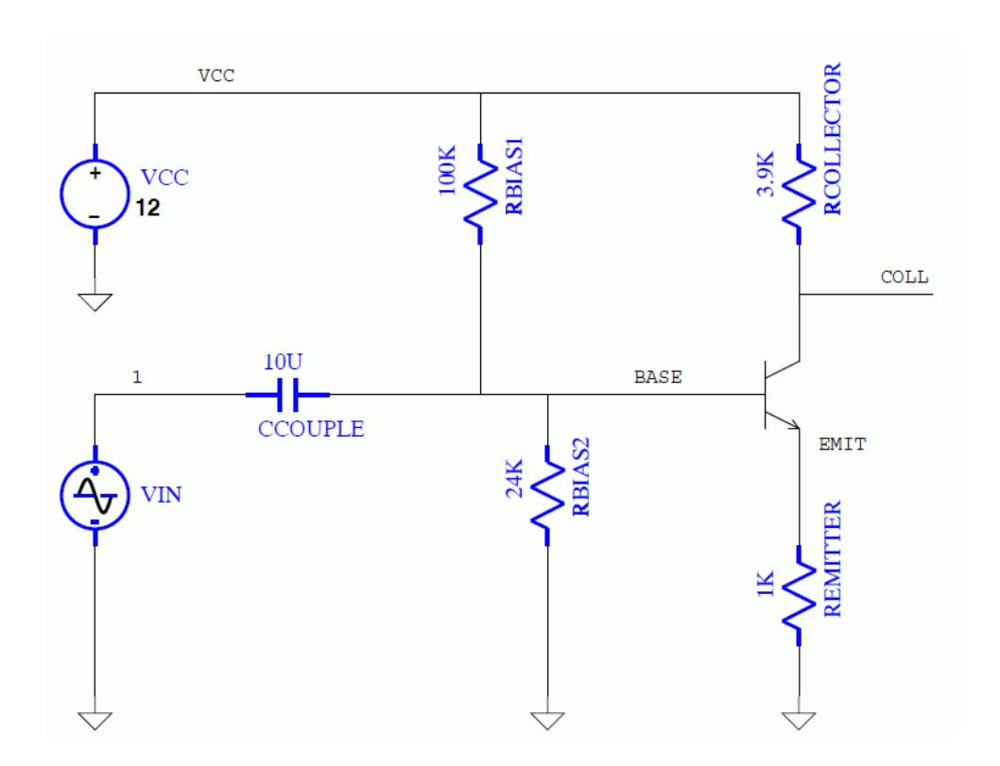

<span id="page-529-0"></span>Figure 17.1: Transistor Amplifier Simulation Example

#### Example:

```
A Berkeley SPICE3 compatible circuit
*
* This circuit contains only Berkeley SPICE3 components.
*
* The circuit is an AC coupled transistor amplifier with
* a sinewave input at node "1", a gain of approximately -3.9,
* and output on node "coll".
*
.tran 1e-5 2e-3
*
vcc vcc 0 12.0
vin 1 0 0.0 ac 1.0 sin(0 1 1k)
ccouple 1 base 10uF
rbias1 vcc base 100k
rbias2 base 0 24k
q1 coll base emit generic
rcollector vcc coll 3.9k
remitter emit 0 1k
*
.model generic npn
*
.end
```

To simulate this circuit, move into a directory under your user account and copy the file xspice\_c1.cir

from directory /examples/xspice/. This file stems from the original XSPICE introduction, therefore its name, but you do not need to have a version of ngspice with the XSPICE option to run it.

```
$ cp /examples/xspice/xspice_c1.cir xspice_c1.cir
```

Now invoke the simulator on this circuit as follows:

```
$ ngspice xspice_c1.cir
```

After a few moments, you should see the ngspice prompt:

```
ngspice 1 ->
```

At this point, ngspice has read-in the circuit description and checked it for errors. If any errors had been encountered, messages describing them would have been output to your terminal. Since no messages were printed for this circuit, the syntax of the circuit description was correct.

To see the circuit description read by the simulator you can issue the following command:

```
ngspice 1 -> listing
```

The simulator shows you the circuit description currently in memory:

```
a berkeley spice3 compatible circuit
```

1 : a berkeley spice3 compatible circuit

2 : .global gnd

10 : .tran 1e-5 2e-3

12 : vcc vcc 0 12.0

13 : vin 1 0 0.0 ac 1.0 sin(0 1 1k)

14 : ccouple 1 base 10uf

15 : rbias1 vcc base 100k

16 : rbias2 base 0 24k

17 : q1 coll base emit generic

18 : rcollector vcc coll 3.9k

19 : remitter emit 0 1k

21 : .model generic npn

24 : .end

The title of this circuit is 'A Berkeley SPICE3 compatible circuit'. The circuit description contains a transient analysis control command .TRAN 1E-5 2E-3 requesting a total simulated time of 2ms with a maximum time-step of 10us. The remainder of the lines in the circuit description describe the circuit of Fig. [17.1.](#page-529-0)

Now, execute the simulation by entering the run command:

```
ngspice 1 -> run
```

The simulator will run the simulation and when execution is completed, will return with the ngspice prompt. When the prompt returns, issue the rusage command again to see how much time and memory has been used now.

To examine the results of this transient analysis, we can use the plot command. First we will plot the nodes labeled '1' and 'base'.

ngspice 
$$2 \rightarrow plot v(1)$$
 base

The simulator responds by displaying an X Window System plot similar to that shown in Fig. [17.2.](#page-531-0)

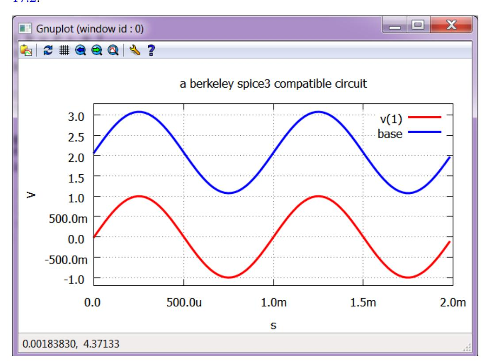

<span id="page-531-0"></span>Figure 17.2: node 1 and node 'base' versus time

Notice that we have named one of the nodes in the *circuit description* with a number ('1'), while the others are words ('base'). This was done to illustrate ngspice's special requirements for plotting nodes labeled with numbers. Numeric labels are allowed in ngspice for backwards compatibility with SPICE2. However, they require special treatment in some commands such as plot. The plot command is designed to allow expressions in its argument list in addition to names of results data to be plotted. For example, the expression plot (base - 1) would plot the result of subtracting 1 from the value of node 'base'.

If we had desired to plot the difference between the voltage at node 'base' and node '1', we would need to enclose the node name '1' in the construction v( ) producing a command such as plot (base - v(1)).

Now, issue the following command to examine the voltages on two of the internal nodes of the transistor amplifier circuit:

ngspice 3 -> plot vcc coll emit

The plot shown in Fig. [17.3](#page-532-0) should appear. Notice in the circuit description that the power supply voltage source and the node it is connected to both have the name 'vcc'. The plot command above has plotted the node voltage 'vcc'. However, it is also possible to plot branch currents through voltage sources in a circuit. ngspice always adds the special suffix #branch to voltage source names. Hence, to plot the current into the voltage source named vcc, we would use a command such as plot vcc#branch.

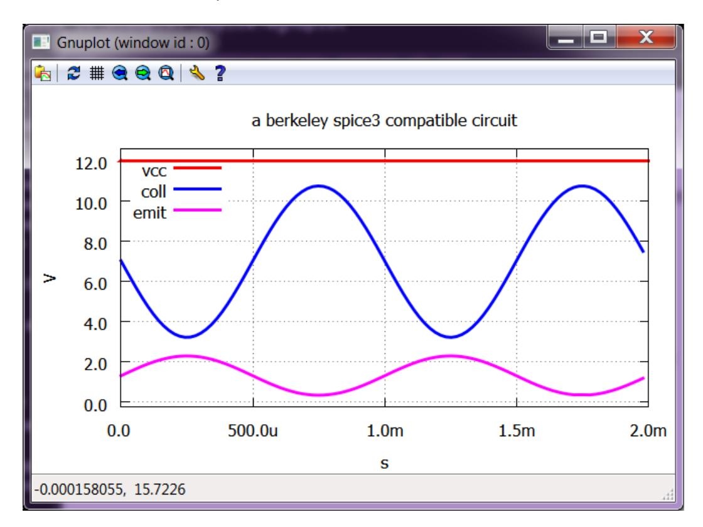

<span id="page-532-0"></span>Figure 17.3: VCC, Collector and Emitter Voltages

Now let's run a simple DC simulation of this circuit and examine the bias voltages with the print command. One way to do this is to quit the simulator using the quit command, edit the input file to change the .tran line to .op (for 'operating point analysis'), re-invoke the simulator, and then issue the run command. However, ngspice allows analysis mode changes directly from the ngspice prompt. All that is required is to enter the control line, e.g. op (without the leading '.'). ngspice will interpret the information on the line and start the new analysis run immediately, without the need to enter a new run command.

To run the DC simulation of the transistor amplifier, issue the following command:

ngspice 4 -> op

After a moment the ngspice prompt returns. Now issue the print command to examine the emitter, base, and collector DC bias voltages.

ngspice 5 -> print emit base coll

ngspice responds with:

```
emit = 1.293993e+00 base = 2.074610e+00 coll = 7.003393e+00
```

To run an AC analysis, enter the following command:

```
ngspice 6 -> ac dec 10 0.01 100
```

This command runs a small-signal swept AC analysis of the circuit to compute the magnitude and phase responses. In this example, the sweep is logarithmic with 'decade' scaling, 10 points per decade, and lower and upper frequencies of 0.01 Hz and 100 Hz. Since the command sweeps through a range of frequencies, the results are vectors of values and are examined with the plot command. Issue to the following command to plot the response curve at node 'coll':

```
ngspice 7 -> plot coll
```

This plot shows the AC gain from input to the collector. (Note that our input source in the circuit description 'vin' contained parameters of the form 'AC 1.0' designating that a unit-amplitude AC signal was applied at this point.) For plotting data from an AC analysis, ngspice chooses automatically a logarithmic scaling for the frequency (x) axis.

To produce a more traditional 'Bode' gain phase plot (again with automatic logarithmic scaling on the frequency axis), we use the expression capability of the plot command and the built-in ngspice functions db( ) and ph( ):

```
ngspice 8 -> plot db(coll) ph(coll)
```

The last analysis supported by ngspice is a swept DC analysis. To perform this analysis, issue the following command:

```
ngspice 9 -> dc vcc 0 15 0.1
```

This command sweeps the supply voltage 'vcc' from 0 to 15 volts in 0.1 volt increments. To plot the results, issue the command:

```
ngspice 10 -> plot emit base coll
```

Finally, to exit the simulator, use the quit command, and you will be returned to the operating system prompt.

```
ngspice 11 -> quit
```

So long.

# <span id="page-534-0"></span>17.2 Differential Pair

The following deck determines the dc operating point of a simple differential pair. In addition, the ac small-signal response is computed over the frequency range 1Hz to 100MEGHz.

Example:

```
SIMPLE DIFFERENTIAL PAIR
VCC 7 0 12
VEE 8 0 -12
VIN 1 0 AC 1
RS1 1 2 1K
RS2 6 0 1K
Q1 3 2 4 MOD1
Q2 5 6 4 MOD1
RC1 7 3 10K
RC2 7 5 10K
RE 4 8 10K
.MODEL MOD1 NPN BF=50 VAF=50 IS=1.E-12 RB=100 CJC=.5PF TF=.6NS
.TF V(5) VIN
.AC DEC 10 1 100MEG
.END
```

# <span id="page-534-1"></span>17.3 MOSFET Characterization

The following deck computes the output characteristics of a MOSFET device over the range 0-10V for VDS and 0-5V for VGS.

Example:

```
MOS OUTPUT CHARACTERISTICS
.OPTIONS NODE NOPAGE
VDS 3 0
VGS 2 0
M1 1 2 0 0 MOD1 L=4U W=6U AD=10P AS=10P
* VIDS MEASURES ID, WE COULD HAVE USED VDS,
* BUT ID WOULD BE NEGATIVE
VIDS 3 1
.MODEL MOD1 NMOS VTO=-2 NSUB=1.0E15 UO=550
.DC VDS 0 10 .5 VGS 0 5 1
.END
```

# <span id="page-534-2"></span>17.4 RTL Inverter

The following deck determines the dc transfer curve and the transient pulse response of a simple RTL inverter. The input is a pulse from 0 to 5 Volts with delay, rise, and fall times of 2ns and a pulse width of 30ns. The transient interval is 0 to 100ns, with printing to be done every nanosecond.

#### Example:

```
SIMPLE RTL INVERTER
VCC 4 0 5
VIN 1 0 PULSE 0 5 2NS 2NS 2NS 30NS
RB 1 2 10K
Q1 3 2 0 Q1
RC 3 4 1K
.MODEL Q1 NPN BF 20 RB 100 TF .1NS CJC 2PF
.DC VIN 0 5 0.1
.TRAN 1NS 100NS
.END
```

# <span id="page-535-0"></span>17.5 Four-Bit Binary Adder (Bipolar)

The following deck simulates a four-bit binary adder, using several subcircuits to describe various pieces of the overall circuit.

#### Example:

```
ADDER - 4 BIT ALL-NAND-GATE BINARY ADDER
*** SUBCIRCUIT DEFINITIONS
.SUBCKT NAND 1 2 3 4
* NODES: INPUT(2), OUTPUT, VCC
Q1 9 5 1 QMOD
D1CLAMP 0 1 DMOD
Q2 9 5 2 QMOD
D2CLAMP 0 2 DMOD
RB 4 5 4K
R1 4 6 1.6K
Q3 6 9 8 QMOD
R2 8 0 1K
RC 4 7 130
Q4 7 6 10 QMOD
DVBEDROP 10 3 DMOD
Q5 3 8 0 QMOD
.ENDS NAND
```

#### Continue 4 Bit adder:

.END

```
.SUBCKT ONEBIT 1 2 3 4 5 6
* NODES: INPUT(2), CARRY-IN, OUTPUT, CARRY-OUT, VCC
X1 1 2 7 6 NAND
X2 1 7 8 6 NAND
X3 2 7 9 6 NAND
X4 8 9 10 6 NAND
X5 3 10 11 6 NAND
X6 3 11 12 6 NAND
X7 10 11 13 6 NAND
X8 12 13 4 6 NAND
X9 11 7 5 6 NAND
.ENDS ONEBIT
.SUBCKT TWOBIT 1 2 3 4 5 6 7 8 9
* NODES: INPUT - BIT0(2) / BIT1(2), OUTPUT - BIT0 / BIT1,
* CARRY-IN, CARRY-OUT, VCC
X1 1 2 7 5 10 9 ONEBIT
X2 3 4 10 6 8 9 ONEBIT
.ENDS TWOBIT
.SUBCKT FOURBIT 1 2 3 4 5 6 7 8 9 10 11 12 13 14 15
* NODES: INPUT - BIT0(2) / BIT1(2) / BIT2(2) / BIT3(2),
* OUTPUT - BIT0 / BIT1 / BIT2 / BIT3, CARRY-IN, CARRY-OUT, VCC
X1 1 2 3 4 9 10 13 16 15 TWOBIT
X2 5 6 7 8 11 12 16 14 15 TWOBIT
.ENDS FOURBIT
*** DEFINE NOMINAL CIRCUIT
.MODEL DMOD D
.MODEL QMOD NPN(BF=75 RB=100 CJE=1PF CJC=3PF)
VCC 99 0 DC 5V
VIN1A 1 0 PULSE(0 3 0 10NS 10NS 10NS 50NS)
VIN1B 2 0 PULSE(0 3 0 10NS 10NS 20NS 100NS)
VIN2A 3 0 PULSE(0 3 0 10NS 10NS 40NS 200NS)
VIN2B 4 0 PULSE(0 3 0 10NS 10NS 80NS 400NS)
VIN3A 5 0 PULSE(0 3 0 10NS 10NS 160NS 800NS)
VIN3B 6 0 PULSE(0 3 0 10NS 10NS 320NS 1600NS)
VIN4A 7 0 PULSE(0 3 0 10NS 10NS 640NS 3200NS)
VIN4B 8 0 PULSE(0 3 0 10NS 10NS 1280NS 6400NS)
X1 1 2 3 4 5 6 7 8 9 10 11 12 0 13 99 FOURBIT
RBIT0 9 0 1K
RBIT1 10 0 1K
RBIT2 11 0 1K
RBIT3 12 0 1K
RCOUT 13 0 1K
*** (FOR THOSE WITH MONEY (AND MEMORY) TO BURN)
.TRAN 1NS 6400NS
```

# <span id="page-537-0"></span>17.6 Four-Bit Binary Adder (MOS)

The following deck simulates a four-bit binary adder, using several subcircuits to describe various pieces of the overall circuit.

#### Example:

```
ADDER - 4 BIT ALL-NAND-GATE BINARY ADDER
*** SUBCIRCUIT DEFINITIONS
.SUBCKT NAND in1 in2 out VDD
* NODES: INPUT(2), OUTPUT, VCC
M1 out in2 Vdd Vdd p1 W=7.5u L=0.35u pd=13.5u ad=22.5p
+ ps=13.5u as=22.5p
M2 net.1 in2 0 0 n1 W=3u L=0.35u pd=9u ad=9p
+ ps=9u as=9p
M3 out in1 Vdd Vdd p1 W=7.5u L=0.35u pd=13.5u ad=22.5p
+ ps=13.5u as=22.5p
M4 out in1 net.1 0 n1 W=3u L=0.35u pd=9u ad=9p
+ ps=9u as=9p
.ENDS NAND
.SUBCKT ONEBIT 1 2 3 4 5 6 AND
X2 1 7 8 6 NAND
X3 2 7 9 6 NAND
X4 8 9 10 6 NAND
X5 3 10 11 6 NAND
X6 3 11 12 6 NAND
X7 10 11 13 6 NAND
X8 12 13 4 6 NAND
X9 11 7 5 6 NAND
.ENDS ONEBIT
.SUBCKT TWOBIT 1 2 3 4 5 6 7 8 9
* NODES: INPUT - BIT0(2) / BIT1(2), OUTPUT - BIT0 / BIT1,
* CARRY-IN, CARRY-OUT, VCC
X1 1 2 7 5 10 9 ONEBIT
X2 3 4 10 6 8 9 ONEBIT
.ENDS TWOBIT
.SUBCKT FOURBIT 1 2 3 4 5 6 7 8 9 10 11 12 13 14 15
*NODES: INPUT - BIT0(2) / BIT1(2) / BIT2(2) / BIT3(2),
* OUTPUT - BIT0 / BIT1 / BIT2 / BIT3, CARRY-IN,
* CARRY-OUT, VCC
X1 1 2 3 4 9 10 13 16 15 TWOBIT
X2 5 6 7 8 11 12 16 14 15 TWOBIT
.ENDS FOURBIT
```

Continue 4 Bit adder MOS:

```
*** POWER
VCC 99 0 DC 3.3V
*** INPUTS
VIN1A 1 0 DC 0 PULSE(0 3 0 5NS 5NS 20NS 50NS)
VIN1B 2 0 DC 0 PULSE(0 3 0 5NS 5NS 30NS 100NS)
VIN2A 3 0 DC 0 PULSE(0 3 0 5NS 5NS 50NS 200NS)
VIN2B 4 0 DC 0 PULSE(0 3 0 5NS 5NS 90NS 400NS)
VIN3A 5 0 DC 0 PULSE(0 3 0 5NS 5NS 170NS 800NS)
VIN3B 6 0 DC 0 PULSE(0 3 0 5NS 5NS 330NS 1600NS)
VIN4A 7 0 DC 0 PULSE(0 3 0 5NS 5NS 650NS 3200NS)
VIN4B 8 0 DC 0 PULSE(0 3 0 5NS 5NS 1290NS 6400NS)
*** DEFINE NOMINAL CIRCUIT
X1 1 2 3 4 5 6 7 8 9 10 11 12 0 13 99 FOURBIT
.option acct
.save V(1) V(2) V(3) V(4) V(5) V(6) V(7) V(8) $ INPUTS
.save V(9) V(10) V(11) V(12) V(13) $ OUTPUTS
.TRAN 1NS 6400NS
* use BSIM3 model with default parameters
.model n1 nmos level=49 version=3.3.0
.model p1 pmos level=49 version=3.3.0
.END
```

# <span id="page-538-0"></span>17.7 Transmission-Line Inverter

The following deck simulates a transmission-line inverter. Two transmission-line elements are required since two propagation modes are excited. In the case of a coaxial line, the first line (T1) models the inner conductor with respect to the shield, and the second line (T2) models the shield with respect to the outside world.

### Example:

Transmission-line inverter

v1 1 0 pulse(0 1 0 0.1n) r1 1 2 50 x1 2 0 0 4 tline r2 4 0 50

.subckt tline 1 2 3 4 t1 1 2 3 4 z0=50 td=1.5ns t2 2 0 4 0 z0=100 td=1ns .ends tline

.tran 0.1ns 20ns .end

# <span id="page-540-0"></span>Chapter 18

# Statistical circuit analysis

# <span id="page-540-1"></span>18.1 Introduction

Real circuits do not operate in a world with fixed values of device parameters, power supplies and environmental data. Even if a ngspice output offers 5 digits or more of precision, this should not mislead you thinking that your circuits will behave exactly the same. All physical parameters influencing a circuit (e.g. MOS Source/drain resistance, threshold voltage, transconductance) are distributed parameters, often following a Gaussian distribution with a mean value µand a standard deviation σ.

To obtain circuits operating reliably under varying parameters, it might be necessary to simulate them taking certain parameter spreads into account. ngspice offers several methods supporting this task. A powerful random number generator is working in the background. It is not providing true random numbers, but a long sequence of pseudo random numbers. This sequence depends on a seed value. The same seed value will deliver the same sequence of random numbers.

ngspice offers several methods to set this seed value. If no input is given, then ngspice sets the seed (stored in variable rndseed) to 1 upon start up. With the option SEED you may either set a value to rndseed upon start up of ngspice (option SEED=nn, nn is an integer greater than 0), or obtain a "random" number as seed, that is the number of seconds since 01.01.1970 (option SEED=random). This command is best set in .spiceinit [\(12.6\)](#page-363-0). With the command setseed (see chapt[.13.5.76\)](#page-432-2) you may choose any other seed value (integer greater than 0).

The following three chapters offer a short introduction to the statistical methods available in ngspice. The diversity of approaches stems from historical reasons, and from some efforts to make ngspice compatible to other simulators.

# <span id="page-540-2"></span>18.2 Using random param(eters)

The ngspice frontend (with its 'numparam' parser) contains the .param (see Chapt. [2.11.1\)](#page-58-2) and .func (see Chapt. [2.12\)](#page-64-2) commands. Among the built-in functions supported (see [2.11.5\)](#page-61-1) you will find the following statistical functions:

| Built-in function        | Notes                                                       |  |
|--------------------------|-------------------------------------------------------------|--|
| gauss(nom, rvar, sigma)  | nominal value plus variation drawn from Gaussian            |  |
|                          | distribution with mean 0 and standard deviation rvar        |  |
|                          | (relative to nominal), divided by sigma                     |  |
| agauss(nom, avar, sigma) | nominal value plus variation drawn from Gaussian            |  |
|                          | distribution with mean 0 and standard deviation avar        |  |
|                          | (absolute), divided by sigma                                |  |
| unif(nom, rvar)          | nominal value plus relative variation (to nominal)          |  |
|                          | uniformly distributed between +/-rvar                       |  |
| aunif(nom, avar)         | nominal value plus absolute variation uniformly distributed |  |
|                          | between +/-avar                                             |  |
| limit(nom, avar)         | nominal value +/-avar, depending on random number in        |  |
|                          | [-1, 1] being<br>0 or<br>><br><<br>0                        |  |

The frontend parser evaluates all .param or .func statements upon start-up of ngspice, before the circuit is evaluated. The parameters aga, aga2, lim obtain their numerical values once. If the random function appears in a device card (e.g. v11 11 0 'agauss(1,2,3)'), a new random number is generated.

Random number example using parameters:

```
* random number tests
.param aga = agauss(1,2,3)
.param aga2='2*aga'
.param lim=limit(0,1.2)
.func rgauss(a,b,c) '5*agauss(a,b,c)'
* always same value as defined above
v1 1 0 'lim'
v2 2 0 'lim'
* may be a different value
v3 3 0 'limit(0,1.2)'
* always new random values
v11 11 0 'agauss(1,2,3)'
v12 12 0 'agauss(1,2,3)'
v13 13 0 'agauss(1,2,3)'
* same value as defined above
v14 14 0 'aga'
v15 15 0 'aga'
v16 16 0 'aga2'
* using .func, new random values
v17 17 0 'rgauss(0,2,3)'
v18 18 0 'rgauss(0,2,3)'
.op
.control
run
print v(1) v(2) v(3) v(11) v(12) v(13)
print v(14) v(15) v(16) v(17) v(18)
.endc
.end
```

So v1, v2, and v3 will get the same value, whereas v4 might differ. v11, v12, and v13 will get different values, v14, v15, and v16 will obtain the values set above in the .param statements. .func will start its replacement algorithm, rgauss(a,b,c) will be replaced everywhere by 5\*agauss(a,b,c).

Thus device and model parameters may obtain statistically distributed starting values. You simply set a model parameter not to a fixed numerical value, but insert a 'parameter' instead, which may consist of a token defined in a .param card, by calling .func or by using a builtin function, including the statistical functions described above. The parameter values will be evaluated once immediately after reading the input file.

# <span id="page-542-0"></span>18.3 Behavioral sources (B, E, G, R, L, C) with random control

All sources listed in the section header may contain parameters, which will be evaluated before simulation starts, as described in the previous section [\(18.2\)](#page-540-2). In addition the nonlinear voltage or current sources (B-source, Chapt. [5\)](#page-104-0) as well as their derivatives E and G, but also the behavioral R, L, and C may be controlled during simulation by a random independent voltage source V with TRRANDOM option (Chapt. [4.1.8\)](#page-98-0).

An example circuit, a Wien bridge oscillator from input file /examples/Monte\_Carlo/OpWien.sp is distributed with ngspice or available at Git. The two frequency determining pairs of R and C are varied statistically using four independent Gaussian voltage sources as the controlling units. An excerpt of this command sequence is shown below. The total simulation time ttime is divided into 100 equally spaced blocks. Each block will get a new set of control voltages, e.g. VR2, which is Gaussian distributed, mean 0 and absolute deviation 1. The resistor value is calculated with ±10% spread, the factor 0.033 will set this 10% to be a deviation of 1 sigma from nominal value.

Examples for control of a behavioral resistor:

```
* random resistor
.param res = 10k
.param ttime=12000m
.param varia=100
.param ttime10 = 'ttime/varia'
* random control voltage (Gaussian distribution)
VR2 r2 0 dc 0 trrandom (2 'ttime10' 0 1)
* behavioral resistor
R2 4 6 R = 'res + 0.033 * res*V(r2)'
```

So within a single simulation run you will obtain 100 different frequency values issued by the Wien bridge oscillator. The voltage sequence VR2 is shown below.

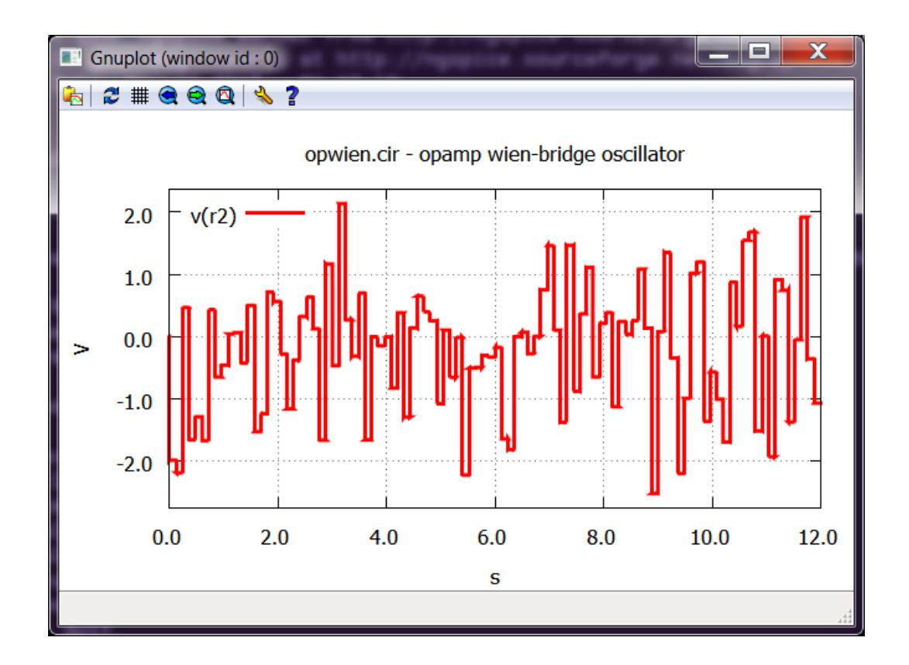

# <span id="page-543-0"></span>18.4 ngspice control language

The ngspice control language is described in detail in Chapt. [13.8.](#page-460-0) Simple or complex scripts may be generated. All commands listed in Chapt. [13.5](#page-392-0) are available, as well as the builtin functions described in Chapt. [13.2,](#page-385-0) the control structures listed in Chapt. [13.6,](#page-447-1) and the predefined variables from Chapt. [13.7.](#page-451-2) Variables and functions are typically evaluated after a simulation run. You may created loops with several simulation runs and change device and model parameters with the alter [\(13.5.3\)](#page-393-1) or altermod [\(13.5.4\)](#page-395-0) commands, as shown in the next section [18.5.](#page-544-0) You may even interrupt a simulation run by proper usage of the stop [\(13.5.89\)](#page-438-2) and resume [\(13.5.66\)](#page-426-1) commands. After stop you may change device or model parameters and then go on with resume, continuing the simulation with the new parameter values.

The statistical functions provided for scripting are listed in the following table:

| Name                | Function                                                     |
|---------------------|--------------------------------------------------------------|
| rnd(vector)         | A vector with each component a random integer between 0      |
|                     | and the absolute value of the input vector's corresponding   |
|                     | integer element value.                                       |
| sgauss(vector)      | Returns a vector of random numbers drawn from a              |
|                     | Gaussian distribution (real value, mean = 0 , standard       |
|                     | deviation = 1). The length of the vector returned is         |
|                     | determined by the input vector. The contents of the input    |
|                     | vector will not be used. A call to sgauss(0) will return a   |
|                     | single value of a random number as a vector of length 1      |
| sunif(vector)       | Returns a vector of random real numbers uniformly            |
|                     | distributed in the interval [-1 1]. The length of the vector |
|                     | returned is determined by the input vector. The contents of  |
|                     | the input vector will not be used. A call to sunif(0) will   |
|                     | return a single value of a random number as a vector of      |
|                     | length 1.                                                    |
| poisson(vector)     | Returns a vector with its elements being integers drawn      |
|                     | from a Poisson distribution. The elements of the input       |
|                     | vector (real numbers) are the expected numbers<br>λ.         |
|                     | Complex vectors are allowed, real and imaginary values       |
|                     | are treated separately.                                      |
| exponential(vector) | Returns a vector with its elements (real numbers) drawn      |
|                     | from an exponential distribution. The elements of the input  |
|                     | vector are the respective mean values (real numbers).        |
|                     | Complex vectors are allowed, real and imaginary values       |
|                     | are treated separately.                                      |

# <span id="page-544-0"></span>18.5 Monte-Carlo Simulation

Statistically varying device or model parameters are the basis for Monte-Carlo simulation. The statistical functions described in chapter [18.2](#page-540-2) may be used on the device instance line or in a device model (see chapter [18.5.1\)](#page-545-0).

An alternative is using the ngspice control language to run Monte-Carlo simulations (see [18.5.2\)](#page-545-1). Calls to the functions sgauss(0) or sunif(0) (see [13.2\)](#page-385-0) will return Gaussian or uniform distributed random numbers (real numbers), stored in a vector. You may define (see [13.5.19\)](#page-402-2) your own function using sgauss or sunif, e.g. to change the mean or range. In a loop (see [13.6\)](#page-447-1) then you may call the alter [\(13.5.3\)](#page-393-1) or altermod [\(13.5.4\)](#page-395-0) statements with random parameters followed by an analysis like op, dc, ac, tran or other.

## <span id="page-545-0"></span>18.5.1 Varying model or instance parameters

Monte-Carlo example, instance and model

```
* monte carlo
V1 1 0 1
R1 1 0 rmod
.model rmod res (r={gauss(2, 0.03, 1)} TC1=3.3e-3)
R2 1 0 rmod
R3 1 0 R = {gauss(2, 0.03, 1)}
R4 1 0 R = {gauss(2, 0.03, 1)}
.save @R1[i] @R2[i] @R3[i] @R4[i]
```

In the example shown above all resistance values (nominally 2 Ohms) will be determined during parsing the netlist. R1 and R2 will always get the same resistance, as they both are using the same model rmod. R3 and R4 are set individually according to the gauss function (see chapter [18.2\)](#page-540-2). Thus a typical result of an operating point simulation may look like:

Operating point result of the example given above

```
* monte carlo result (current through R)
@r1[i] = 5.044575e-01
@r2[i] = 5.044575e-01
@r3[i] = 5.418674e-01
@r4[i] = 4.942051e-01
```

Several ngspice runs are required to obtain a statistical distribution of the circuit performance.

## <span id="page-545-1"></span>18.5.2 Using the ngspice control language

#### <span id="page-545-2"></span>18.5.2.1 Example 1

The first examples is a LC band pass filter, where L and C device parameters will be changed 100 times. Each change is followed by an ac analysis. All graphs of output voltage versus frequency are plotted. The file is available in the distribution as/examples/Monte\_Carlo/MonteCarlo.sp as well as from the [git repository](https://sourceforge.net/p/ngspice/ngspice/ci/master/tree/examples/Monte_Carlo/MonteCarlo.sp) .

#### Monte-Carlo example 1

```
Perform Monte Carlo simulation in ngspice
V1 N001 0 AC 1 DC 0
R1 N002 N001 141
*
C1 OUT 0 1e-09
L1 OUT 0 10e-06
C2 N002 0 1e-09
L2 N002 0 10e-06
L3 N003 N002 40e-06
C3 OUT N003 250e-12
*
R2 0 OUT 141
*
.control
  let mc_runs = 100
  let run = 1
  set curplot = new $ create a new plot
  set scratch = $curplot $ store its name to 'scratch'
*
  define unif(nom, var) (nom + nom*var * sunif(0))
  define aunif(nom, avar) (nom + avar * sunif(0))
  define gauss(nom, var, sig) (nom + nom*var/sig * sgauss(0))
  define agauss(nom, avar, sig) (nom + avar/sig * sgauss(0))
*
  dowhile run <= mc_runs
* alter c1 = unif(1e-09, 0.1)
* alter l1 = aunif(10e-06, 2e-06)
* alter c2 = aunif(1e-09, 100e-12)
* alter l2 = unif(10e-06, 0.2)
* alter l3 = aunif(40e-06, 8e-06)
* alter c3 = unif(250e-12, 0.15)
    alter c1 = gauss(1e-09, 0.1, 3)
    alter l1 = agauss(10e-06, 2e-06, 3)
    alter c2 = agauss(1e-09, 100e-12, 3)
    alter l2 = gauss(10e-06, 0.2, 3)
    alter l3 = agauss(40e-06, 8e-06, 3)
    alter c3 = gauss(250e-12, 0.15, 3)
    ac oct 100 250K 10Meg
    set run ="$&run" $ create a variable from the vector
    set dt = $curplot $ store the current plot to dt
    setplot $scratch $ make 'scratch' the active plot
* store the output vector to plot 'scratch'
    let vout{$run}={$dt}.v(out)
    setplot $dt $ go back to the previous plot
    let run = run + 1
  end
  plot db({$scratch}.all)
.endc
```

#### 18.5.2.2 Example 2

A more sophisticated input file for Monte Carlo simulation is distributed with the file /examples/Monte\_Carlo/MC\_ring.sp [\(or git repository\)](https://sourceforge.net/p/ngspice/ngspice/ci/master/tree/examples/Monte_Carlo/MC_ring.sp). Due to its length it is not reproduced here, but some comments on its enhancements over example 1 [\(18.5.2.1\)](#page-545-2) are presented in the following.

A 25-stage ring oscillator is the circuit used with a transient simulation. It comprises of CMOS inverters, modeled with BSIM3. Several model parameters (vth, u0, tox, L, and W) shall be varied statistically between each simulation run. The frequency of oscillation will be measured by a fft and stored. Finally a histogram of all measured frequencies will be plotted.

The function calls to sunif(0) and sgauss(0) return uniformly or Gaussian distributed random numbers. A function unif, defined by the line

```
define unif(nom, var) (nom + (nom*var) * sunif(0))
```

will return a value with mean nom and deviation var relative to nom.

The line

```
set n1vth0=@n1[vth0]
```

will store the threshold voltage vth0, given by the model parameter set, into a variable n1vth0, ready to be used by unif, aunif, gauss, or agauss function calls.

In the simulation loop the altermod command changes the model parameters before a call to tran. After the transient simulation the resulting vector is linearized, a fft is calculated, and the maximum of the fft signal is measured by the meas command and stored in a vector maxffts. Finally the contents of the vector maxffts is plotted in a histogram.

For more details, please have a look at the strongly commented input file MC\_ring.sp.

#### 18.5.2.3 Example 3

The next example is contained in the files [MC\\_2\\_control.sp](https://sourceforge.net/p/ngspice/ngspice/ci/master/tree/examples/Monte_Carlo/MC_2_control.sp) and [MC\\_2\\_circ.sp](https://sourceforge.net/p/ngspice/ngspice/ci/master/tree/examples/Monte_Carlo/MC_2_circ.sp) from folder /examples/Monte\_Carlo/. MC\_2\_control.sp is a ngspice script (see [13.8\)](#page-460-0). It starts a loop by setting the random number generator seed value to the value of the loop counter, sources the circuit file MC\_2\_circ.sp, runs the simulation, stores a raw file, makes an fft, saves the oscillator frequency thus measured, deletes all outputs, increases the loop counter and restarts the loop. The netlist file MC\_2\_circ.sp contains the circuit, which is the same ring oscillator as of example 2. However, now the MOS model parameter set, which is included with this netlist file, inherits some AGAUSS functions (see [2.11.5\)](#page-61-1) to vary threshold voltage, mobility and gate oxide thickness of the NMOS and PMOS transistors. This is an approach similar to what commercial foundries deliver within their device libraries. So this example may be your source for running Monte Carlo with commercial libs. Start example 3 by calling

```
ngspice -o MC_2_control.log MC_2_control.sp
```

# <span id="page-547-0"></span>18.6 Data evaluation with Gnuplot

Run the example file /examples/Monte\_Carlo/OpWien.sp, described in Chapt. [18.3.](#page-542-0) Generate a plot with Gnuplot by the ngspice command

gnuplot pl4mag v4mag xlimit 500 1500

Open and run the command file in the Gnuplot command line window by

```
load 'pl-v4mag.p'
```

A Gaussian curve will be fitted to the simulation data. The mean oscillator frequency and its deviation are printed in the curve fitting log in the Gnuplot window.

Gnuplot script for data evaluation:

```
# This file: pl-v4mag.p
# ngspice file OpWien.sp
# ngspice command:
# gnuplot pl4mag v4mag xlimit 500 1500
# a gnuplot manual:
# http://www.duke.edu/~hpgavin/gnuplot.html
# Gauss function to be fitted
f1(x)=(c1/(a1*sqrt(2*3.14159))*exp(-((x-b1)**2)/(2*a1**2)))
# Gauss function to plot start graph
f2(x)=(c2/(a2*sqrt(2*3.14159))*exp(-((x-b2)**2)/(2*a2**2)))
# start values
a1=50 ; b1=900 ; c1=50
# keep start values in a2, b2, c2
a2=a1 b2=b1 ; c2=c1
# curve fitting
fit f1(x) 'pl4mag.data' using 1:2 via a1, b1, c1
# plot original and fitted curves with new a1, b1, c1
plot "pl4mag.data" using 1:2 with lines, f1(x), f2(x)
```

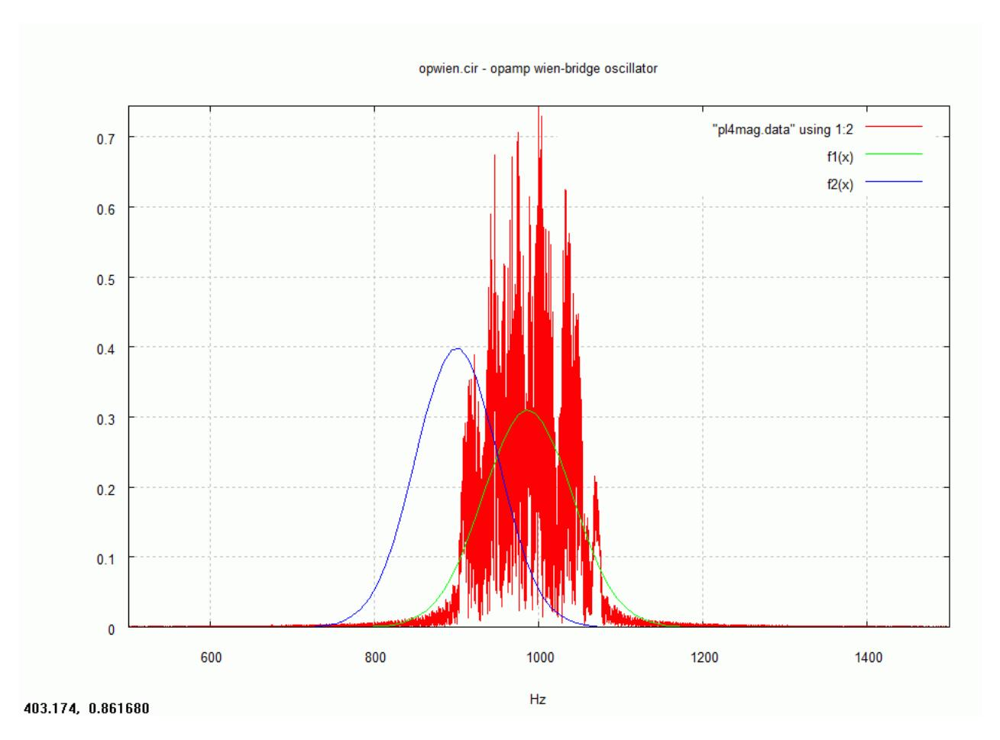

pl4mag.data is the simulation data, f2(x) the starting curve, f1(x) the fitted Gaussian distribution. This is just a simple example. You might explore the powerful built-in functions of Gnuplot to do a much more sophisticated statistical data analysis.

# <span id="page-550-0"></span>Chapter 19

# Circuit optimization with ngspice

# <span id="page-550-1"></span>19.1 Optimization of a circuit

Your circuit design (analog, maybe mixed-signal) has already the best circuit topology. There might be still some room for parameter selection, e.g. the geometries of transistors or values of passive elements, to best fit the specific purpose. This is, what (automatic) circuit optimization will deliver. In addition you may fine-tune, optimize and verify the circuit over voltage, process or temperature corners. So circuit optimization is a valuable tool in the hands of an experienced designer. It will relieve you from the routine task of 'endless' repetitions of re-simulating your design.

You have to choose circuit variables as parameters to be varied during optimization (e.g. device size, component values, bias inputs etc.). Then you may pose performance constraints onto you circuits (e.g. Vnode < 1.2V, gain > 50 etc.). Optimization objectives are the variables to be minimized or maximized. The n objectives and m constraints are assembled into a cost function.

The optimization flow is now the following: The circuit is loaded. Several (perhaps only one) simulations are started with a suitable starter set of variables. Measurements are done on the simulator output to check for the performance constraints and optimization objectives. These data are fed into the optimizer to evaluate the cost function. A sophisticated algorithm now determines a new set of circuit variables for the next simulator run(s). Stop conditions have to be defined by the user to tell the simulator when to finish (e.g. fall below a cost function value, parameter changes fall below a certain threshold, number of iterations exceeded).

The optimizer algorithms, its parameters and the starting point influence the convergence behavior. The algorithms have to provide measures to reaching the global optimum, not to stick to a local one, and thus are tantamount for the quality of the optimizer.

ngspice does not have an integral optimization processor. Thus this chapter will rely on work done by third parties to introduce ngspice optimization capability. ngspice provides the simulation engine, a script or program controls the simulator and provides the optimizer functionality.

Four optimizers are presented here, using ngspice scripting language, using tclspice, using a Python script, and using ASCO, a c-coded optimization program.

# <span id="page-551-0"></span>19.2 ngspice optimizer using ngspice scripts

Friedrich Schmidt (see [his web site\)](http://members.aon.at/fschmid7/page_2_1.html) has intensively used circuit optimization during his development of Nonlinear loadflow computation with Spice based simulators. He has provided an optimizer using the internal ngspice scripting language (see Chapt. [13.8\)](#page-460-0). His original scripts are found [here.](https://web.archive.org/web/20060926170917/http://members.aon.at/fschmid7/examples_new.zip) A slightly modified and concentrated set of his scripts is available from the [ngspice optimizer directory.](http://ngspice.sourceforge.net/optimizers/ngspice-optimizer.7z)

The simple example given in the scripts is OK with current ngspice. Real circuits have still to be tested.

# <span id="page-551-1"></span>19.3 ngspice optimizer using tclspice

ngspice offers another scripting capability, namely the tcl/tk based tclspice option (see Chapt. [16\)](#page-516-0). An optimization procedure may be written using a tcl script. An example is provided in Chapt. [16.5.2.](#page-520-0)

# <span id="page-551-2"></span>19.4 ngspice optimizer using a Python script

Werner Hoch has developed a ngspice optimization procedure based on the 'differential evolution' algorithm [\[21\]](#page-561-7). On his [web page](http://www.h-renrew.de/h/python_spice/optimisation.html) he provides a Python script containing the control flow and algorithms.

# <span id="page-551-3"></span>19.5 ngspice optimizer using ASCO

The [ASCO optimizer,](http://asco.sourceforge.net/index.html) developed by Joao Ramos, also applies the 'differential evolution' algorithm [\[21\]](#page-561-7). An enhanced version 0.4.7.1, adding ngspice as a simulation engine, may be downloaded [here](http://ngspice.sourceforge.net/optimizers/asco-dist.7z) (7z archive format). Included are executable files (asco, asco-mpi, ngspice-c for MS Windows). The source code should also compile and function under Linux (not yet tested).

ASCO is a standalone executable, which communicates with ngspice via ngspice input and output files. Several optimization examples, originally provided by J. Ramos for other simulators, are prepared for use with ngspice. Parallel processing on a multi-core computer has been tested using MPI [\(MPICH2\)](http://www.mcs.anl.gov/research/projects/mpich2/) under MS Windows. A processor network will be supported as well. A MS Windows console application ngspice\_c.exe is included in the archive. Several stand alone tools are provided, but not tested yet.

Setting up an optimization project with ASCO requires advanced know-how of using ngspice. There are several sources of information. First of all the examples provided with the distribution give hints how to start with ASCO. The original ASCO manual is provided as well, or is available [here.](http://asco.sourceforge.net/manual.html) It elaborates on the examples, using a commercial simulator, and provides a detailed description how to set up ASCO. Installation of ASCO and MPI (under Windows) is described in a file INSTALL.

Some remarks on how to set up ASCO for ngspice are given in the following sections (more to be added). These a meant not as a complete description, but are an addition the the ASCO manual.

## <span id="page-552-0"></span>19.5.1 Three stage operational amplifier

This example is taken from Chapt. 6.2.2 'Tutorial #2' from the ASCO manual. The directory examples /ngspice/amp3 contains four files:

amp3.cfg This file contains all configuration data for this optimization. Of special interest is the following section, which sets the required measurements and the constraints on the measured parameters:

```
# Measurements #
ac_power:VDD:MIN:0
dc_gain:VOUT:GE:122
unity_gain_frequency:VOUT:GE:3.15E6
phase_margin:VOUT:GE:51.8
phase_margin:VOUT:LE:70
amp3_slew_rate:VOUT:GE:0.777E6
#
```

Each of these entries is linked to a file in the /extract subdirectory, having exactly the same names as given here, e.g. ac\_power, dc\_gain, unity\_gain, phase\_margin, and amp3\_slew\_rate. Each of these files contains an # Info # section, which is currently not used. The # Commands # section may contain a measurement command (including ASCO parameter #SYMBOL#, see file /extract/unity\_gain\_frequency). It also may contain a .control section (see file /extract/phase\_margin\_min). During set-up #SYMBOL# is replaced by the file name, a leading 'z', and a trailing number according to the above sequence, starting with 0.

amp3.sp This is the basic circuit description. Entries like #LM2# are ASCO-specific, defined in the # Parameters # section of file amp3.cfg. ASCO will replace these parameter placeholders with real values for simulation, determined by the optimization algorithm. The .control ... .endc section is specific to ngspice. Entries to this section may deliver workarounds of some commands not available in ngspice, but used in other simulators. You may also define additional measurements, get access to variables and vectors, or define some data manipulation. In this example the .control section contains an op measurement, required later for slew rate calculation, as well as the ac simulation, which has to occur before any further data evaluation. Data from the op simulation are stored in a plot op1. Its name is saved in variable dt. The ac measurements sets another plot ac1. To retrieve op data from the former plot, you have to use the {\$dt}.<vector> notation (see file /extract/amp3\_slew\_rate).

n.typ, p.typ MOSFET parameter files, to be included by amp3.sp.

#### Testing the set-up

Copy asco-test.exe and ngspice\_c.exe (console executable of ngspice) into the directory, and run

```
$ asco-test -ngspice amp3
```

from the console window. Several files will be created during checking. If you look at <computername>.sp: this is the input file for ngspice\_c, generated by ASCO. You will find the additional .measure commands and .control sections. The quit command will be added automatically just before the .endc command in its own .control section. asco-test will display error messages on the console, if the simulation or communication with ASCO is not ok. The output file <computer-name>.out, generated by ngspice during each simulation, contains symbols like zac\_power0, zdc\_gain1, zunity\_gain\_frequency2, zphase\_margin3, zphase\_margin4, and zamp3\_slew\_rate5. These are used to communicate the ngspice output data to ASCO. ASCO is searching for something like zdc\_gain1 =, and then takes the next token as the input value. Calling phase\_margin twice in amp3.cfg has lead to two measurements in two .control sections with different symbols (zphase\_margin3, zphase\_margin4).

A failing test may result in an error message from ASCO. Sometimes, however, ASCO freezes after some output statements. This may happen if ngspice issues an error message that cannot be handled by ASCO. Here it may help calling ngspice directly with the input file generated by ASCO:

```
$ ngspice_c <computer-name>.sp
```

Thus you may evaluate the ngspice messages directly.

#### Running the simulation

Copy (w)asco.exe, (w)asco-mpi.exe and ngspice\_c.exe (console executable of ngspice) into the directory, and run

```
$ asco -ngspice amp3
or alternatively (if MPICH is installed)
$ mpiexec -n 7 asco-mpi -ngspice amp3
```

The following graph [19.1](#page-554-0) shows the acceleration of the optimization simulation on a multi-core processor (i7 with 4 real or 8 virtual cores), 500 generations, if -n is varied. Speed is tripled, a mere 15 min suffices to optimize 21 parameters of the amplifier.

## <span id="page-553-0"></span>19.5.2 Digital inverter

This example is taken from Chapt. 6.2.1 Tutorial #1 from the ASCO manual. In addition to the features already mentioned above, it adds Monte-Carlo and corner simulations. The file inv.cfg contains the following section:

```
#Optimization Flow#
Alter:yes $ do we want to do corner analysis?
MonteCarlo:yes $ do we want to do MonteCarlo analysis?
```

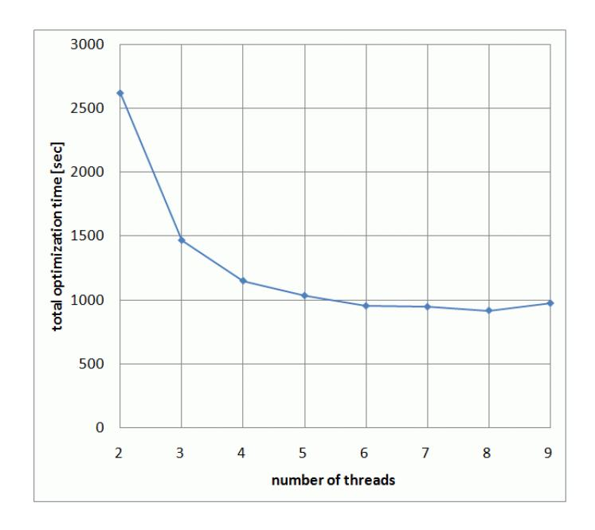

<span id="page-554-0"></span>Figure 19.1: Optimization speed

```
AlterMC cost:3.00 $ point at which we want to start ALTER and/or
                 $ MONTECARLO
ExecuteRF:no $ Execute or no the RF module to add RF parasitics?
SomethingElse:
#
```

Monte Carlo is switched on. It uses the AGAUSS function (see Chapt. [18.2\)](#page-540-2). Its parameters are generated by ASCO from the data supplied by the inv.cfg section #Monte Carlo#. According to the paper by Pelgrom on MOS transistor matching [\[22\]](#page-561-8) the AGAUSS parameters are calculated as

$$W = AGAUSS\left(W, \frac{ABeta}{\sqrt{2 \cdot W \cdot L \cdot m}} \cdot \frac{W}{100} \cdot 10^{-6}, 1\right)$$
(19.1)

$$delvto = AGAUSS\left(0, \frac{AVT}{\sqrt{2 \cdot W \cdot L \cdot m}} \cdot 10^{-9}, 1\right)$$
 (19.2)

The .ALTER command is not available in ngspice. However, a new option in ngspice to the altermod command [\(13.5.4\)](#page-395-0) enables the simulation of design corners. The #Alter# section in inv.cfg gives details. Specific to ngspice, again several .control section are used.

```
# ALTER #
.control
* gate oxide thickness varied
altermod nm pm file [b3.min b3.typ b3.max]
.endc
.control
* power supply variation
alter vdd=[2.0 2.1 2.2]
.endc
.control
```

```
run
.endc
#
```

NMOS (nm) and PMOS (pm) model parameter sets are loaded from three different model files, each containing both NMOS and PMOS sets. b3.typ is assembled from the original parameter files n.typ and p.typ, provided with original ASCO, with some adaptation to ngspice BSIM3. The min and max sets are artificially created in that only the gate oxide thickness deviates ±1 nm from what is found in model file b3.typ. In addition the power supply voltage is varied, so in total you will find 3 x 3 simulation combinations in the input file <computer-name>.sp (after running asco-test).

## <span id="page-555-0"></span>19.5.3 Bandpass

This example is taken from Chapt. 6.2.4 Tutorial #4 from the ASCO manual. S11 in the passband is to be maximised. S21 is used to extract side lobe parameters. The .net command is not available in ngspice, so S11 and S21 are derived with a script in file bandpass.sp as described in Chapt. [13.9.](#page-471-0) The measurements requested in bandpass.cfg as

```
# Measurements #
Left_Side_Lobe:---:LE:-20
Pass_Band_Ripple:---:GE:-1
Right_Side_Lobe:---:LE:-20
S11_In_Band:---:MAX:---
#
```

are realized as 'measure' commands inside of control sections (see files in directory extract). The result of a measure statement is a vector, which may be processed by commands in the following lines. In file extract/S1\_In\_Band #Symbol# is made available only after a short calculation (inversion of sign), using the print command. quit has been added to this entry because it will become the final control section in <computer-name>.sp. A disadvantage of measure inside of a .control section is that parameters from .param statements may not be used (as is done in example [19.5.4\)](#page-555-1).

The bandpass example includes the calculation of RF parasitic elements defined in rfmodule.cfg (see Chapt. 7.5 of the ASCO manual). This calculation is invoked by setting

```
ExecuteRF:yes $Execute or no the RF module to add RF parasitics?
```

in bandpass.cfg. The two subcircuits LBOND\_sub and CSMD\_sub are generated in <computername>.sp to simulate these effects.

## <span id="page-555-1"></span>19.5.4 Class-E power amplifier

This example is taken from Chapt. 6.2.3 Tutorial #3 from the ASCO manual. In this example the ASCO post processing is applied in file extract/P\_OUT (see Chapt. 7.4 of the ASCO manual.). In this example .measure statements are used. They allow using parameters from .param statements, because they will be located outside of .control sections, but do not allow doing data post processing inside of ngspice. You may use ASCO post processing instead.

# <span id="page-556-0"></span>Chapter 20

# Notes

# <span id="page-556-1"></span>20.1 Glossary

- card A logical SPICE input line. A card may be extended through the use of the '+' sign in SPICE, thereby allowing it to take up multiple lines in a SPICE deck.
- code model A model of a device, function, component, etc. which is based solely on a C programming language-based function. In addition to the code models included with the XSPICE option of the ngspice simulator, you can use code models that you develop for circuit modeling.
- deck A collection of SPICE cards that together specify all input information required in order to perform an analysis. A 'deck' of 'cards' will in fact be contained within a file on the host computer system.
- element card A single, logical line in an ngspice circuit deck that describes a circuit element. Circuit elements are connected to each other to form circuits (e.g., a logical card that describes a resistor, such as R1 2 0 10K, is an element card).
- instance A unique occurrence of a circuit element. See 'element card', in which the instance R1 is specified as a unique element (instance) in a hypothetical circuit description.
- macro A macro, in the context of this document, refers to a C language macro that supports the construction of user-defined models by simplifying input/output and parameter-passing operations within the Model Definition File.
- .mod Refers to the Model Definition File in XSPICE. The file suffix reflects the file-name of the model definition file: cfunc.mod.
- .model Refers to a model card associated with an element card in ngspice. A model card allows for data defining an instance to be conveniently located in the ngspice deck such that the general layout of the elements is more readable.
- Nutmeg The ngspice post-processor (now obsolete). This provides a simple stand-alone simulator interface that can be used with the ngspice simulator to display and plot simulator raw files.
- subcircuit A 'device' within an ngspice deck that is defined in terms of a group of element cards and that can be referenced in other parts of the ngspice deck through element cards.

# <span id="page-557-0"></span>20.2 Acronyms and Abbreviations

ATE Automatic Test Equipment

CAE Computer-Aided Engineering

CCCS Current Controlled Current Source.

CCVS Current Controlled Voltage Source.

FET Field Effect Transistor

IDD Interface Design Document

IFS Refers to the Interface Specification File. The abbreviation reflects the file name of the Interface Specification File: ifspec.ifs.

MNA Modified Nodal Analysis

MOSFET Metal Oxide Semiconductor Field Effect Transistor

PWL Piece-Wise Linear

RAM Random Access Memory

ROM Read Only Memory

SDD Software Design Document

SI Simulator Interface

SPICE Simulation Program with Integrated Circuit Emphasis. This program was developed at the University of California at Berkeley and is the origin of ngspice.

SPICE3 Version 3 of SPICE.

SRS Software Requirements Specification

SUM Software User's Manual

UCB University of California at Berkeley

UDN User-Defined Node(s)

VCCS Voltage Controlled Current Source.

VCVS Voltage Controlled Voltage Source

XSPICE Extended SPICE; option to ngspice, integrating predefined or user defined code models for event-driven mixed-signal simulation.

20.3. TO DO 559

# <span id="page-558-0"></span>20.3 To Do

- 1. Review of Chapt. 1.3
- 2. hfet1,2 model descriptions
- 3. MOS level 9 description

# Bibliography

- [1] A. Vladimirescu and S. Liu, *'The Simulation of MOS Integrated Circuits Using SPICE2'* ERL Memo No. ERL M80/7, Electronics Research Laboratory University of California, Berkeley, October 1980
- <span id="page-560-0"></span>[2] T. Sakurai and A. R. Newton, *'A Simple MOSFET Model for Circuit Analysis and its application to CMOS gate delay analysis and series-connected MOSFET Structure*' [ERL](http://www.eecs.berkeley.edu/Pubs/TechRpts/1990/1429.html) [Memo No. ERL M90/19,](http://www.eecs.berkeley.edu/Pubs/TechRpts/1990/1429.html) Electronics Research Laboratory, University of California, Berkeley, March 1990
- <span id="page-560-1"></span>[3] B. J. Sheu, D. L. Scharfetter, and P. K. Ko, '*SPICE2 Implementation of BSIM'* ERL Memo No. ERL M85/42, Electronics Research Laboratory University of California, Berkeley, May 1985
- <span id="page-560-2"></span>[4] J. R. Pierret, *'A MOS Parameter Extraction Program for the BSIM Model'* ERL Memo Nos. ERL M84/99 and M84/100, Electronics Research Laboratory University of California, Berkeley, November 1984
- <span id="page-560-3"></span>[5] Min-Chie Jeng, '*Design and Modeling of Deep Submicrometer MOSFETSs'* [ERL Memo](http://www.eecs.berkeley.edu/Pubs/TechRpts/1990/1601.html) [Nos. ERL M90/90,](http://www.eecs.berkeley.edu/Pubs/TechRpts/1990/1601.html) Electronics Research Laboratory, University of California, Berkeley, October 1990
- <span id="page-560-4"></span>[6] Soyeon Park, '*Analysis and SPICE implementation of High Temperature Effects on MOS-FET*', Master's thesis, University of California, Berkeley, December 1986.
- <span id="page-560-5"></span>[7] Clement Szeto, '*Simulation of Temperature Effects in MOSFETs (STEIM)*', Master's thesis, University of California, Berkeley, May 1988.
- [8] J.S. Roychowdhury and D.O. Pederson, *'Efficient Transient Simulation of Lossy Interconnect*', Proc. of the 28th ACM/IEEE Design Automation Conference, June 17-21 1991, San Francisco
- <span id="page-560-6"></span>[9] A. E. Parker and D. J. Skellern, '*An Improved FET Model for Computer Simulators*', IEEE Trans CAD, vol. 9, no. 5, pp. 551-553, May 1990.
- [10] R. Saleh and A. Yang, Editors, '*Simulation and Modeling*', IEEE Circuits and Devices, vol. 8, no. 3, pp. 7-8 and 49, May 1992.
- <span id="page-560-7"></span>[11] H.Statz et al., '*GaAs FET Device and Circuit Simulation in SPICE*', IEEE Transactions on Electron Devices, V34, Number 2, February 1987, pp160-169.
- [12] Weidong Liu et al.: '*BSIM3v3.2.2 MOSFET Model User's Manual*', [BSIM3v3.2.2](http://ngspice.sourceforge.net/external-documents/models/bsim322_manual.pdf)

562 BIBLIOGRAPHY

- [13] Weidong Lui et al.: '*BSIM3.v3.3.0 MOSFET Model User's Manual*', [BSIM3v3.3.0](http://ngspice.sourceforge.net/external-documents/models/bsim330_manual.pdf)
- [14] 'SPICE3.C1 *Nutmeg Programmer's Manual*', Department of Electrical Engineering and Computer Sciences, University of California, Berkeley, California, April, 1987.
- [15] Thomas L. Quarles: [SPICE3 Version 3C1 User's Guide,](http://www.eecs.berkeley.edu/Pubs/TechRpts/1989/ERL-89-46.pdf) Department of Electrical Engineering and Computer Sciences, University of California, Berkeley, California, April, 1989.
- [16] Brian Kernighan and Dennis Ritchie: '*The C Programming Language*', Second Edition, Prentice-Hall, Englewood Cliffs, New Jersey, 1988.
- [17] '*Code-Level Modeling in XSPICE*', F.L. Cox, W.B. Kuhn, J.P. Murray, and S.D. Tynor, published in the Proceedings of the 1992 International Symposium on Circuits and Systems, San Diego, CA, May 1992, vol 2, pp. 871-874.
- <span id="page-561-2"></span>[18] '*A Physically Based Compact Model of Partially Depleted SOI MOSFETs for Analog Circuit Simulation*', Mike S. L. Lee, Bernard M. Tenbroek, William Redman-White, James Benson, and Michael J. Uren, IEEE JOURNAL OF SOLID-STATE CIRCUITS, VOL. 36, NO. 1, JANUARY 2001, pp. 110-121
- <span id="page-561-4"></span>[19] '*A Realistic Large-signal MESFET Model for SPICE*', A. E. Parker, and D. J. Skellern, IEEE Transactions on Microwave Theory and Techniques, vol. 45, no. 9, Sept. 1997, pp. 1563-1571.
- <span id="page-561-6"></span>[20] '*Integrating RTS Noise into Circuit Analysis*', T. B. Tang and A. F. Murray, IEEE ISCAS, 2009, Proc. of IEEE ISCAS, Taipei, Taiwan, May 2009, pp 585-588
- <span id="page-561-7"></span>[21] R. Storn, and K. Price: '*Differential Evolution*', technical report TR-95-012, ICSI, March 1995, see [report download,](http://www.icsi.berkeley.edu/~storn/TR-95-012.pdf) or the [DE web page](http://www.icsi.berkeley.edu/~storn/code.html)
- <span id="page-561-8"></span>[22] M. J. M. Pelgrom e.a.: '*Matching Properties of MOS Transistors*', IEEE J. Sol. State Circ, vol. 24, no. 5, Oct. 1989, pp. 1433-1440
- <span id="page-561-5"></span>[23] Y. V. Pershin, M. Di Ventra: 'SPICE *model of memristive devices with threshold*', arXiv:1204.2600v1 [physics.comp-ph] 12 Apr 2012, <http://arxiv.org/pdf/1204.2600.pdf>
- <span id="page-561-3"></span>[24] George M. Kull e.a. 'A Unified Circuit Model for Bipolar Transistors Including Quasi-Saturation Effects', IEEE TRANSACTIONS ON ELECTRON DEVICES, VOL. ED-32, NO. 6, JUNE 1985
- [25] Matthias Bucher, Christophe Lallement, Christian Enz, Fabien Théodoloz, François Krummenacher, 'The EPFL-EKV MOSFET Model Equations for Simulation', Technical Report, Revision II, July 1998, Electronics Laboratories, Swiss Federal Institute of Technology (EPFL), Lausanne, Switzerland
- <span id="page-561-0"></span>[26] Kenneth Kundert, Sparse Matrix Techniques, in Circuit Analysis, Simulation and Design, Albert Ruehli (Ed.), North-Holland, 1986
- <span id="page-561-1"></span>[27] T. A. Davis and Ekanathan Palamadai Natarajan. 2010. Algorithm 907: KLU, A Direct Sparse Solver for Circuit Simulation Problems. ACM Trans. Math. Softw. 37, 3, Article 36 (September 2010), 17 pages. <https://dl.acm.org/doi/abs/10.1145/1824801.1824814>

BIBLIOGRAPHY 563

<span id="page-562-0"></span>[28] F. Lannutti, P. Nenzi and M. Olivieri, "KLU sparse direct linear solver implementation into NGSPICE," Proceedings of the 19th International Conference Mixed Design of Integrated Circuits and Systems - MIXDES 2012, Warsaw, Poland, 2012, pp. 69-73.

BIBLIOGRAPHY

# <span id="page-564-0"></span>Part II XSPICE Software User's Manual

# <span id="page-566-0"></span>Chapter 21

# XSPICE Basics

# <span id="page-566-1"></span>21.1 ngspice with the XSPICE option

The XSPICE option allows you to add event-driven simulation capabilities to ngspice. ngspice now is the main software program that performs mathematical simulation of a circuit specified by you, the user. It takes input in the form of commands and circuit descriptions and produces output data (e.g. voltages, currents, digital states, and waveforms) that describe the circuit's behavior.

Plain ngspice is designed for analog simulation and is based exclusively on matrix solution techniques. The XSPICE option adds even-driven simulation capabilities. Thus, designs that contain significant portions of digital circuitry can be efficiently simulated together with analog components. ngspice with XSPICE option also includes a 'User-Defined Node' capability that allows event-driven simulations to be carried out with any type of data.

The XSPICE option has been developed by the Computer Science and Information Technology Laboratory at Georgia Tech Research Institute of the Georgia Institute of Technology, Atlanta, Georgia 30332 at around 1990 and enhanced by the ngspice team. The manual is based on the original XSPICE user's manual, no longer available from Georgia Tech, but from the [ngspice](http://ngspice.sourceforge.net/literature.html) [web site.](http://ngspice.sourceforge.net/literature.html)

In the following, the term 'XSPICE' may be read as 'ngspice with XSPICE code model subsystem enabled'. You may enable the option by adding --enable-xspice to the ./configure command. The MS Windows distribution already contains the XSPICE option.

# <span id="page-566-2"></span>21.2 The XSPICE Code Model Subsystem

The new component of ngspice, the Code Model Subsystem, provides the tools needed to model the various parts of your system. While ngspice is targeted primarily at integrated circuit (IC) analysis, XSPICE includes features to model and simulate board-level and system-level designs as well. The Code Model Subsystem is central to this new capability, providing XSPICE with an extensive set of models to use in designs and allowing you to add your own models to this model set.

The ngspice simulator at the core of XSPICE includes built-in models for discrete components commonly found within integrated circuits. These 'model primitives' include components such as resistors, capacitors, diodes, and transistors. The XSPICE Code Model Subsystem extends this set of primitives in two ways. First, it provides a library of over 40 additional primitives, including summers, integrators, digital gates, controlled oscillators, s-domain transfer functions, and digital state machines. See Chapt. [8](#page-176-0) for a description of the library entries. Second, it adds a code model generator to ngspice that provides a set of programming utilities to make it easy for you to create your own models by writing them in the C programming language.

The code models are generated upon compiling ngspice. They are stored in shared libraries, which may be distributed independently from the ngspice sources. During runtime initialization, ngspice will load the code model libraries and make the code model instances available for simulation.

# <span id="page-567-0"></span>21.3 XSPICE Top-Level Diagram

A top-level diagram of the XSPICE system integrated into ngspice is shown in Fig. [21.1.](#page-567-1) The XSPICE Simulator is made up of the ngspice core, the event-driven algorithm, circuit description syntax parser extensions, a loading routine for code models, and the ngspice control language user interface. The XSPICE Code Model Subsystem consists of the Code Model Generator, 5 standard code model library sources with more than 40 code models, the sources for Node Type Libraries, and all the interfaces to User-Defined Code Models and to User-Defined Node Types.

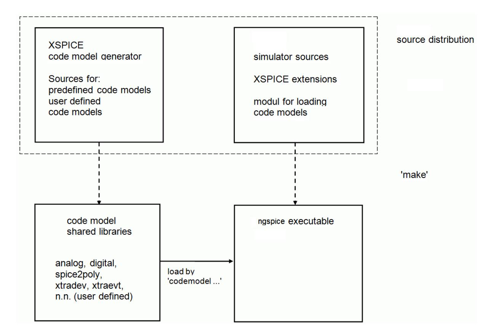

<span id="page-567-1"></span>Figure 21.1: ngspice/XSPICE Top-Level Diagram

# <span id="page-568-0"></span>Chapter 22

# Execution Procedures

This chapter covers operation of the XSPICE simulator and the Code Model Subsystem. It begins with background material on simulation and modeling and then discusses the analysis modes supported in XSPICE and the circuit description syntax used for modeling. Detailed descriptions of the predefined Code Models and Node Types provided in the XSPICE libraries are also included.

# <span id="page-568-1"></span>22.1 Simulation and Modeling Overview

This section introduces the concepts of circuit simulation and modeling. It is intended primarily for users who have little or no previous experience with circuit simulators, and also for those who have not used circuit simulators recently. However, experienced SPICE users may wish to scan the material presented here since it provides background for new Code Model and User-Defined Node capabilities of the XSPICE option.

## <span id="page-568-2"></span>22.1.1 Describing the Circuit

This section provides an overview of the circuit description syntax expected by the XSPICE simulator. A general understanding of circuit description syntax will be helpful to you should you encounter problems with your circuit and need to examine the simulator's error messages, or should you wish to develop your own models.

This section will introduce you to the creation of circuit description input files using the control language user interface. Note that this material is presented in an overview form. Details of circuit description syntax are given later in this chapter and in the previous chapters of this manual.

#### 22.1.1.1 Example Circuit Description Input

Although different SPICE-based simulators may include various enhancements to the basic version from the University of California at Berkeley, most use a similar approach in describing circuits. This approach involves capturing the information present in a circuit schematic in the form of a text file that follows a defined format. This format requires the assignment of

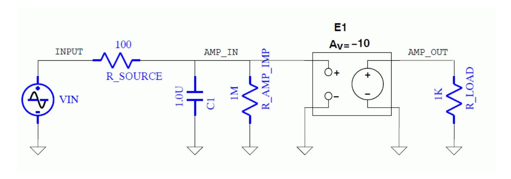

<span id="page-569-0"></span>Figure 22.1: Example Circuit 1

alphanumeric identifiers to each circuit node, the assignment of component identifiers to each circuit device, and the definition of the significant parameters for each device. For example, the circuit description below shows the equivalent input file for the circuit shown in Fig. [22.1.](#page-569-0)

Examples for control of a behavioral resistor:

```
Small Signal Amplifier
*
* This circuit simulates a simple small signal amplifier.
*
Vin Input 0 0 SIN(0 .1 500Hz)
R_source Input Amp_In 100
C1 Amp_In 0 1uF
R_Amp_Input Amp_In 0 1MEG
E1 (Amp_Out 0) (Amp_In 0) -10
R_Load Amp_Out 0 1000
.Tran 1.0u 0.01
.end
```

This file exhibits many of the most important properties common to all SPICE circuit description files including the following:

- The first line of the file is always interpreted as the title of the circuit. The title may consist of any text string.
- Lines that provide user comments, but no circuit information, are begun by an asterisk.
- A circuit device is specified by a device name, followed by the node(s) to which it is connected, and then by any required parameter information.
- The first character of a device name tells the simulator what kind of device it is (e.g. R = resistor, C = capacitor, E = voltage controlled voltage source).
- Nodes may be labeled with any alphanumeric identifier. The only specific labeling requirement is that 0 must be used for ground.

- A line that begins with a dot is a 'control directive' Control directives are used most frequently for specifying the type of analysis the simulator is to carry out.
- An .end statement must be included at the end of the file.
- With the exception of the Title and .end statements, the order in which the circuit file is defined is arbitrary.
- All identifiers are case insensitive the identifier 'npn' is equivalent to 'NPN' and to 'nPn'.
- Spaces and parenthesis are treated as white space.
- Long lines may be continued on a succeeding line by beginning the next line with a '+' in the first column.

In this example, the title of the circuit is 'Small Signal Amplifier'. Three comment lines are included before the actual circuit description begins. The first device in the circuit is voltage source Vin, which is connected between node Input and '0' (ground). The parameters after the nodes specify that the source has an initial value of 0, a wave shape of SIN, and a DC offset, amplitude, and frequency of 0, .1, and 500 respectively. The next device in the circuit is resistor R\_Source, which is connected between nodes Input and Amp\_In, with a value of 100 Ohms. The remaining device lines in the file are interpreted similarly.

The control directive that begins with .tran specifies that the simulator should carry out a simulation using the Transient analysis mode. In this example, the parameters to the transient analysis control directive specify that the maximum time-step allowed is 1 microsecond and that the circuit should be simulated for 0.01 seconds of circuit time.

Other control cards are used for other analysis modes. For example, if a frequency response plot is desired, perhaps to determine the effect of the capacitor in the circuit, the following statement will instruct the simulator to perform a frequency analysis from 100 Hz to 10 MHz in decade intervals with ten points per decade.

```
.ac dec 10 100 10meg
```

To determine the quiescent operating point of the circuit, the following statement may be inserted in the file.

.op

A fourth analysis type supported by ngspice is swept DC analysis. An example control statement for the analysis mode is

```
.dc Vin -0.1 0.2 .05
```

This statement specifies a DC sweep that varies the source Vin from -100 millivolts to +200 millivolts in steps of 50 millivolts.

#### 22.1.1.2 Models and Subcircuits

The file discussed in the previous section illustrated the most basic syntax rules of a circuit description file. However, ngspice (and other SPICE-based simulators) include many other features that allow for accurate modeling of semiconductor devices such as diodes and transistors and for grouping elements of a circuit into a macro or 'subcircuit' description that can be reused throughout a circuit description. For instance, the file shown below is a representation of the schematic shown in Fig. [22.2.](#page-572-0)

Examples for control of a behavioral resistor:

```
Small Signal Amplifier with Limit Diodes
*
* This circuit simulates a small signal amplifier
* with a diode limiter.
*
.dc Vin -1 1 .05
Vin Input 0 DC 0
R_source Input Amp_In 100
D_Neg 0 Amp_In 1n4148
D_Pos Amp_In 0 1n4148
C1 Amp_In 0 1uF
X1 Amp_In 0 Amp_Out Amplifier
R_Load Amp_Out 0 1000
.model 1n4148 D (is=2.495e-09 rs=4.755e-01 n=1.679e+00
+ tt=3.030e-09 cjo=1.700e-12 vj=1 m=1.959e-01 bv=1.000e+02
+ ibv=1.000e-04)
.subckt Amplifier Input Common Output
E1 (Output Common) (Input Common) -10
R_Input Input Common 1meg
.ends Amplifier
.end
```

This is the same basic circuit as in the initial example, with the addition of two components and some changes to the simulation file. The two diodes have been included to illustrate the use of device models, and the amplifier is implemented with a subcircuit. Additionally, this file shows the use of the swept DC control card.

Device Models Device models allow you to specify, when required, many of the parameters of the devices being simulated. In this example, model statements are used to define the silicon diodes. Electrically, the diodes serve to limit the voltage at the amplifier input to values between about ±700 millivolts. The diode is simulated by first declaring the 'instance' of each diode with a device statement. Instead of attempting to provide parameter information separately for both diodes, the label '1n4148' alerts the simulator that a separate model statement is included

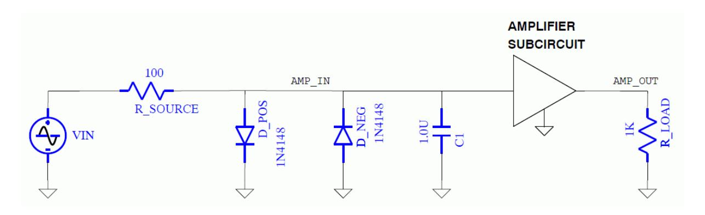

<span id="page-572-0"></span>Figure 22.2: Example Circuit 2

in the file that provides the necessary electrical specifications for the device ('1n4148' is the part number for the type of diode the model is meant to simulate).

The model statement that provides this information is:

```
.model 1n4148 D (is=2.495e-09 rs=4.755e-01 n=1.679e+00
+ tt=3.030e-09 cjo=1.700e-12 vj=1 m=1.959e-01
+ bv=1.000e+02 ibv=1.000e-04)
```

The model statement always begins with the string .model followed by an identifier and the model type (D for diode, NPN for NPN transistors, etc).

The optional parameters ('is', 'rs', 'n', . . . ) shown in this example configure the simulator's mathematical model of the diode to match the specific behavior of a particular part (e.g. a '1n4148').

Subcircuits In some applications, describing a device by embedding the required elements in the main circuit file, as is done for the amplifier in Fig. [22.1,](#page-569-0) is not desirable. A hierarchical approach may be taken by using subcircuits. An example of a subcircuit statement is shown in the second circuit file:

```
X1 Amp_In 0 Amp_Out
```

Amplifier Subcircuits are always identified by a device label beginning with 'X'. Just as with other devices, all of the connected nodes are specified. Notice, in this example, that three nodes are used. Finally, the name of the subcircuit is specified. Elsewhere in the circuit file, the simulator looks for a statement of the form:

```
.subckt <Name> <Node1> <Node2> <Node3> ...
```

This statement specifies that the lines that follow are part of the Amplifier subcircuit, and that the three nodes listed are to be treated wherever they occur in the subcircuit definition as referring, respectively, to the nodes on the main circuit from which the subcircuit was called. Normal device, model, and comment statements may then follow. The subcircuit definition is concluded with a statement of the form:

.ends <Name>

#### 22.1.1.3 XSPICE Code Models

In the previous example, the specification of the amplifier was accomplished by using a ngspice Voltage Controlled Voltage Source device. This is an idealization of the actual amplifier. Practical amplifiers include numerous non-ideal effects, such as offset error voltages and non-ideal input and output impedances. The accurate simulation of complex, real-world components can lead to cumbersome subcircuit files, long simulation run times, and difficulties in synthesizing the behavior to be modeled from a limited set of internal devices known to the simulator.

To address these problems, XSPICE allows you to create Code Models that simulate complex, non-ideal effects without the need to develop a subcircuit design. For example, the following file provides simulation of the circuit in Fig. [22.2,](#page-572-0) but with the subcircuit amplifier replaced with a Code Model called 'Amp' that models several non-ideal effects including input and output impedance and input offset voltage.

```
Small Signal Amplifier
*
* This circuit simulates a small signal amplifier
* with a diode limiter.
*
.dc Vin -1 1 .05
Vin Input 0 DC 0
R_source Input Amp_In 100
D_Neg 0 Amp_In 1n4148
D_Pos Amp_In 0 1n4148
C1 Amp_In 0 1uF
A1 Amp_In 0 Amp_Out Amplifier
R_Load Amp_Out 0 1000
.model 1n4148 D (is=2.495e-09 rs=4.755e-01 n=1.679e+00
+ tt=3.030e-09 cjo=1.700e-12 vj=1 m=1.959e-01 bv=1.000e+02
+ ibv=1.000e-04)
.model Amplifier Amp (gain = -10 in_offset = 1e-3
+ rin = 1meg rout = 0.4)
.end
```

A statement with a device label beginning with 'A' alerts the simulator that the device uses a Code Model. The model statement is similar in form to the one used to specify the diode. The model label 'Amp' directs XSPICE to use the code model with that name. Parameter information has been added to specify a gain of -10, an input offset of 1 millivolt, an input impedance of 1 meg ohm, and an output impedance of 0.4 ohm. Subsequent sections of this document detail the steps required to create such a Code Model and include it in the XSPICE simulator.

#### 22.1.1.4 Node Bridge Models

When a mixed-mode simulator is used, some method must be provided for translating data between the different simulation algorithms. XSPICE's Code Model support allows you to develop models that work under the analog simulation algorithm, the event-driven simulation algorithm, or both at once.

In XSPICE, models developed for the express purpose of translating between the different algorithms or between different User-Defined Node types are called 'Node Bridge' models. For translations between the built-in analog and digital types, predefined node bridge models are included in the XSPICE Code Model Library.

#### 22.1.1.5 Practical Model Development

In practice, developing models often involves using a combination of ngspice passive devices, device models, subcircuits, and XSPICE Code Models. XSPICE's Code Models may be seen as an extension to the set of device models offered in standard ngspice. The collection of over 40 predefined Code Models included with XSPICE provides you with an enriched set of modeling primitives with which to build subcircuit models. In general, you should first attempt to construct your models from these available primitives. This is often the quickest and easiest method.

If you find that you cannot easily design a subcircuit to accomplish your goal using the available primitives, then you should turn to the code modeling approach. Because they are written in a general purpose programming language (C), code models enable you to simulate virtually any behavior for which you can develop a set of equations or algorithms.

# <span id="page-574-0"></span>22.2 Circuit Description Syntax

If you need to debug a simulation, if you are planning to develop your own models, or if you are using the XSPICE simulator through the control language user interface, you will need to become familiar with the circuit description language.

The previous sections presented example circuit description input files. The following sections provide more detail on XSPICE circuit descriptions with particular emphasis on the syntax for creating and using models. First, the language and syntax of the ngspice simulator are described and references to additional information are given. Next, XSPICE extensions to the ngspice syntax are detailed. Finally, various enhancements to ngspice operation are discussed including polynomial sources, arbitrary phase sources, supply ramping, matrix conditioning, convergence options, and debugging support.

## <span id="page-574-1"></span>22.2.1 XSPICE Syntax Extensions

In the preceding discussion, ngspice syntax was reviewed, and those features of ngspice that are specifically supported by the XSPICE simulator were enumerated. In addition to these features, there exist extensions to the ngspice capabilities that provide much more flexibility in describing and simulating a circuit. The following sections describe these capabilities, as well as the syntax required to make use of them.

#### 22.2.1.1 Convergence Debugging Support

When a simulation is failing to converge, the simulator can be asked to return convergence diagnostic information that may be useful in identifying the areas of the circuit in which convergence problems are occurring. When running through the interactive user interface, these messages are written directly to the terminal.

#### 22.2.1.2 Digital Nodes

Support is included for digital nodes that are simulated by an event-driven algorithm. Because the event-driven algorithm is faster than the standard SPICE matrix solution algorithm, and because all digital, real, int and User-Defined Node types make use of the event-driven algorithm, reduced simulation time for circuits that include these models can be anticipated compared to simulation of the same circuit using analog code models and nodes.

#### 22.2.1.3 User-Defined Nodes

Support is provided for User Defined Nodes that operate with the event-driven algorithm. These nodes allow the passing of arbitrary data structures among models. The real and integer node types supplied with XSPICE are actually predefined User-Defined Node types.

#### 22.2.1.4 Supply Ramping

A supply ramping function is provided by the simulator as an option to a transient analysis to simulate the turn-on of power supplies to a board level circuit. To enable this option, the compile time flag XSPICE\_EXP has to be set, e.g. by adding CFLAGS="-DXSPICE\_EXP" to the ./configure command line. The supply ramping function linearly ramps the values of all independent sources and the capacitor and inductor code models (code model extension) with initial conditions toward their final value at a rate that you define. A complete ngspice deck example of usage of the **ramptime** option is shown below.

```
Example:
Supply ramping option
*
* This circuit demonstrates the use of the option
* "ramptime" that ramps independent sources and the
* capacitor and inductor initial conditions from
* zero to their final value during the time period
* specified.
*
*
.tran 0.1 5
.option ramptime=0.2
* a1 1 0 cap
.model cap capacitor (c=1000uf ic=1)
r1 1 0 1k
*
a2 2 0 ind
.model ind inductor (l=1H ic=1)
r2 2 0 1.0
*
v1 3 0 1.0
r3 3 0 1k
*
i1 4 0 1e-3
r4 4 0 1k
*
v2 5 0 0.0 sin(0 1 0.3 0 0 45.0)
r5 5 0 1k
*
.end
```

# <span id="page-576-0"></span>22.3 How to create code models

The following instruction to create an additional code model uses the ngspice infrastructure and some 'intelligent' copy and paste. As an example an extra code model d\_xxor is created in the xtradev shared library, reusing the existing d\_xor model from the digital library. More detailed information will be made available in Chapt. [24.](#page-590-0)

You should have downloaded ngspice, either the most recent distribution or from the Git repository, and compiled and installed it properly according to your operating system and the instructions given in Chapt. [28](#page-728-0) of the Appendix, especially Chapt. [28.1.4](#page-731-0) (for Linux users), or Chapt. [28.2.2](#page-740-0) for MINGW and MS Windows. (MS Visual Studio will not do, because we have not yet integrated the code model generator into this compiler! You may however use all code models later with any ngspice executable.) Then change into directory ngspice/src/xspice/icm/xtradev.

```
Create a new directory
mkdir d_xxor
```

Copy the two files cfunc.mod and ifspec.ifs from ngspice/src/xspice/icm/digital/d\_xor to ngspice/src/xspice/icm/xtradev/d\_xxor. These two files may serve as a template for your new model!

For simplicity reasons we do only a very simple editing to these files here, in fact the functionality is not changed, just the name translated to a new model. Edit the new cfunc.mod: In lines 5, 28, 122, 138, 167, 178 replace the old name (d\_xor) by the new name d\_xxor. Edit the new ifspec.ifs: In lines 16, 23, 24 replace cm\_d\_xor by cm\_d\_xxor and d\_xor by d\_xxor.

Make ngspice aware of the new code model by editing file ngspice/src/xspice/icm/xtradev/modpath.lst:

Add a line with the new model name d\_xxor.

Redo ngspice by entering directory ngspice/release, and issuing the commands:

make

sudo make install

And that's it! In ngspice/release/src/xspice/icm/xtradev/ you now will find cfunc.c and ifspec.c and the corresponding object files. The new code model d\_xxor resides in the shared library xtradev.cm, and is available after ngspice is started. As a test example you may edit ngspice/src/xspice/examples/digital\_models1.deck, and change line 60 to the new model:

.model d\_xor1 d\_xxor (rise\_delay=1.0e-6 fall\_delay=2.0e-6 input\_load=1.0e-12)

The complete input file follows:

```
Code Model Test: new xxor
*** analysis type ***
.tran .01s 4s
*** input sources ***
v2 200 0 DC PWL( (0 0.0) (2 0.0) (2.0000000001 1.0) (3 1.0) )
v1 100 0 DC PWL( (0 0.0) (1.0 0.0) (1.0000000001 1.0) (2 1.0)
      (2.0000000001\ 0.0)\ (3\ 0.0)\ (3.0000000001\ 1.0)\ (4\ 1.0)\ )
*** resistors to ground ***
r1 100 0 1k
r2 200 0 1k
*** adc_bridge blocks ***
aconverter [200 100] [2 1] adc_bridge1
.model adc_bridge1 adc_bridge (in_low=0.1 in_high=0.9
                   rise_delay=1.0e-12 fall_delay=1.0e-12)
*** xor block ***
a7 [1 2] 70 d_xor1
.model d_xor1 d_xxor (rise_delay=1.0e-6 fall_delay=2.0e-6
                     input_load=1.0e-12)
*** dac_bridge blocks ****
abridge1 [70] [out] dac1
.model dac1 dac_bridge(out_low = 0.7 out_high = 3.5
+ out_undef = 2.2 input_load = 5.0e-12 t_rise = 50e-9
+ t_fall = 20e-9)
*** simulation and plotting ***
.control
run
plot allv
.endc
.end
```

An analog input, delivered by the pwl voltage sources, is transformed into the digital domain by an adc\_bridge, processed by the new code model d\_xxor, and then translated back into the analog domain.

If you want to change the functionality of the new model, you have to edit ifspec.ifs for the code model interface and cfunc.mod for the detailed functionality of the new model. Please see Chapt. 24, especially Chapt. 24.6 ff. for any details. And of course you may take the existing

analog, digital, mixed signal and other existing code models (to be found in the subdirectories to ngspice/release/src/xspice/icm) as stimulating examples for your work.

# <span id="page-580-2"></span><span id="page-580-0"></span>Chapter 23

# Example circuits

The following chapter is designed to demonstrate XSPICE features. The first example circuit models the circuit of Fig. [22.2](#page-572-0) using the XSPICE gain block code model to substitute for the more complex and computationally expensive ngspice transistor model. This example illustrates one way in which XSPICE code models can be used to raise the level of abstraction in circuit modeling to improve simulation speed.

The next example, shown in Fig. [23.1,](#page-583-0) illustrates many of the more advanced features offered by XSPICE. This circuit is a mixed-mode design incorporating digital data, analog data, and User-Defined Node data together in the same simulation. Some of the important features illustrated include:

- Creating and compiling Code Models
- Creating an XSPICE executable that incorporates these new models
- The use of 'node bridge' models to translate data between the data types in the simulation
- Plotting analog and event-driven (digital and User-Defined Node) data
- Using the eprint command to print event-driven data

Throughout these examples, we assume that ngspice with XSPICE option has already been installed on your system and that your user account has been set up with the proper search path and environment variable data.

The examples also assume that you are running under Linux and will use standard Linux commands such as cp for copying files, etc. If you are using a different set up, with different operating system command names, you should be able to translate the commands shown into those suitable for your installation. Finally, file system path-names given in the examples assume that ngspice + XSPICE has been installed on your system in directory /usr/local/xspice-1-0. If your installation is different, you should substitute the appropriate root path-name where appropriate.

# <span id="page-580-1"></span>23.1 Amplifier with XSPICE model 'gain'

The circuit, as has been shown in Fig. [22.2,](#page-572-0) is extended here by using the XSPICE code model gain. The ngspice circuit description for this circuit is shown below.

#### Example:

```
A transistor amplifier circuit
*
.tran 1e-5 2e-3
*
vin 1 0 0.0 ac 1.0 sin(0 1 1k)
*
ccouple 1 in 10uF
rzin in 0 19.35k
*
aamp in aout gain_block
.model gain_block gain (gain = -3.9 out_offset = 7.003)
*
rzout aout coll 3.9k
rbig coll 0 1e12
*
.end
```

Notice the component 'aamp'. This is an XSPICE code model device. All XSPICE code model devices begin with the letter 'a' to distinguish them from other ngspice devices. The actual code model used is referenced through a user-defined identifier at the end of the line - in this case gain\_block. The type of code model used and its parameters appear on the associated .model card. In this example, the gain has been specified as -3.9 to approximate the gain of the transistor amplifier, and the output offset (out\_offset) has been set to 7.003 according to the DC bias point information obtained from the DC analysis in Example 1 from Chapter [22.](#page-568-0)

Notice also that input and output impedances of the one-transistor amplifier circuit are modeled with the resistors 'rzin' and 'rzout', since the gain code model defaults to an ideal voltageinput, voltage-output device with infinite input impedance and zero output impedance.

Lastly, note that a special resistor 'rbig' with value '1e12' has been included at the opposite side of the output impedance resistor 'rzout'. This resistor is required by ngspice's matrix solution formula. Without it, the resistor 'rzout' would have only one connection to the circuit, and an ill-formed matrix could result. One way to avoid such problems without adding resistors explicitly is to use the ngspice 'rshunt' option described in this document under ngspice Syntax Extensions/General Enhancements.

To simulate this circuit, copy the file xspice\_c2.cir from the directory /src/xspice/examples into a directory in your account.

```
$ cp /examples/xspice/xspice_c2.cir xspice_c2.cir
```

Invoke the simulator on this circuit:

```
$ ngspice xspice_c2.cir
```

After a few moments, you should see the ngspice prompt:

```
ngspice 1 ->
```

Now issue the run command and when the prompt returns, issue the plot command to examine the voltage at the node 'coll'.

```
ngspice 1 -> run
ngspice 2 -> plot coll
```

The resulting waveform closely matches that from the original transistor amplifier circuit simulated in Example 1.

When you are done, enter the quit command to leave the simulator and return to the command line.

```
ngspice 3 -> quit
```

Using the rusage command, you can verify that this abstract model of the transistor amplifier runs somewhat faster than the full circuit of Example 1. This is because the code model is less complex computationally. This demonstrates one important use of XSPICE code models - to reduce run time by modeling circuits at a higher level of abstraction. Speed improvements vary and are most pronounced when a large amount of low-level circuitry can be replaced by a small number of code models and additional components.

# <span id="page-582-0"></span>23.2 XSPICE advanced usage

## <span id="page-582-1"></span>23.2.1 Circuit example C3

An equally important use of code models is in creating models for circuits and systems that do not easily lend themselves to synthesis using standard ngspice primitives (resistors, capacitors, diodes, transistors, etc.). This occurs often when trying to create models of ICs for use in simulating board-level designs. Creating models of operational amplifiers such as an LM741 or timer ICs such as an LM555 is greatly simplified through the use of XSPICE code models. Another example of code model use is shown in the next example where a complete sampled-data system is simulated using XSPICE analog, digital, and User-Defined Node types simultaneously.

The circuit shown in Fig. [23.1](#page-583-0) is designed to demonstrate several of the more advanced features of XSPICE. In this example, you will be introduced to the process of creating code models and linking them into ngspice. You will also learn how to print and plot the results of event-driven analysis data. The ngspice/XSPICE circuit description for this example is shown below.

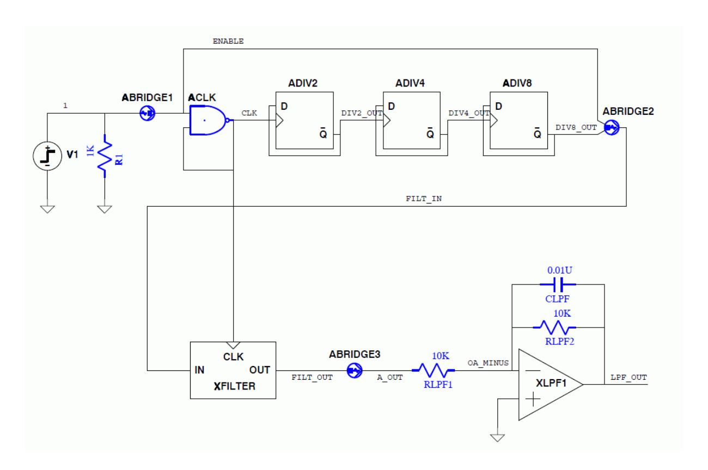

<span id="page-583-0"></span>Figure 23.1: Example Circuit C3

#### Example:

```
Mixed IO types
* This circuit contains a mixture of IO types, including
* analog, digital, user-defined (real), and 'null'.
*
* The circuit demonstrates the use of the digital and
* user-defined node capability to model system-level designs
* such as sampled-data filters. The simulated circuit
* contains a digital oscillator enabled after 100us. The
* square wave oscillator output is divided by 8 with a
* ripple counter. The result is passed through a digital
* filter to convert it to a sine wave.
*
.tran 1e-5 1e-3
*
v1 1 0 0.0 pulse(0 1 1e-4 1e-6)
r1 1 0 1k
*
abridge1 [1] [enable] atod
.model atod adc_bridge
*
aclk [enable clk] clk nand
.model nand d_nand (rise_delay=1e-5 fall_delay=1e-5)
*
adiv2 div2_out clk NULL NULL NULL div2_out dff
adiv4 div4_out div2_out NULL NULL NULL div4_out dff
adiv8 div8_out div4_out NULL NULL NULL div8_out dff
.model dff d_dff
```

#### Example (continued):

```
abridge2 div8_out enable filt_in node_bridge2
.model node_bridge2 d_to_real (zero=-1 one=1)
*
xfilter filt_in clk filt_out dig_filter
*
abridge3 filt_out a_out node_bridge3
.model node_bridge3 real_to_v
*
rlpf1 a_out oa_minus 10k
*
xlpf 0 oa_minus lpf_out opamp
*
rlpf2 oa_minus lpf_out 10k
clpf lpf_out oa_minus 0.01uF
***************************************
.subckt dig_filter filt_in clk filt_out
.model n0 real_gain (gain=1.0)
.model n1 real_gain (gain=2.0)
.model n2 real_gain (gain=1.0)
.model g1 real_gain (gain=0.125)
.model zm1 real_delay
.model d0a real_gain (gain=-0.75)
.model d1a real_gain (gain=0.5625)
.model d0b real_gain (gain=-0.3438)
.model d1b real_gain (gain=1.0)
*
an0a filt_in x0a n0
an1a filt_in x1a n1
an2a filt_in x2a n2
*
az0a x0a clk x1a zm1
az1a x1a clk x2a zm1
*
ad0a x2a x0a d0a
ad1a x2a x1a d1a
*
az2a x2a filt1_out g1
az3a filt1_out clk filt2_in zm1
*
an0b filt2_in x0b n0
an1b filt2_in x1b n1
an2b filt2_in x2b n2
*
az0b x0b clk x1b zm1
az1b x1b clk x2b zm1
*
ad0 x2b x0b d0b
ad1 x2b x1b d1b
*
az2b x2b clk filt_out zm1
.ends dig_filter
```

Example (continued):

```
.subckt opamp plus minus out
*
r1 plus minus 300k
a1 %vd (plus minus) outint lim
.model lim limit (out_lower_limit = -12 out_upper_limit = 12
+ fraction = true limit_range = 0.2 gain=300e3)
r3 outint out 50.0
r2 out 0 1e12
*
.ends opamp
*
.end
```

This circuit is a high-level design of a sampled-data filter. An analog step waveform (created from a ngspice pulse waveform) is introduced as 'v1' and converted to digital by code model instance 'abridge'. This digital data is used to enable a Nand-Gate oscillator ('aclk') after a short delay. The Nand-Gate oscillator generates a square-wave clock signal with a period of approximately two times the gate delay, which is specified as 1e-5 seconds. This 50 kHz clock is divided by a series of D Flip Flops ('adiv2', 'adiv4', 'adiv8') to produce a square-wave at approximately 6.25 kHz. Note particularly the use of the reserved word 'NULL' for certain nodes on the D Flip Flops. This tells the code model that there is no node connected to these ports of the flip flop.

The divide-by-8 and enable waveforms are converted by the instance 'abridge2' to the format required by the User-Defined Node type 'real', which expected real-valued data. The output of this instance on node filt\_in is a real valued square wave that oscillates between values of -1 and 1. Note that the associated code model d\_to\_real is not part of the original XSPICE code model library but has been added later to ngspice.

This signal is then passed through subcircuit 'xfilter' that contains a digital low-pass filter clocked by node 'clk'. The result of passing this square-wave through the digital low-pass filter is the production of a sampled sine wave (the filter passes only the fundamental of the square-wave input) on node filt\_out. This signal is then converted back to ngspice analog data on node a\_out by node bridge instance 'abridge3'.

The resulting analog waveform is then passed through an op-amp-based low-pass analog filter constructed around subcircuit 'xlpf' to produce the final output at analog node 'lpf\_out'.

## <span id="page-585-0"></span>23.2.2 Running example C3

Now copy the file xspice\_c3.cir from directory /examples/xspice/ into the current directory:

```
$ cp /examples/xspice/xspice_c3.cir xspice_c3.cir
```

and invoke the new simulator executable as you did in the previous examples.

```
$ ngspice xspice_c3.cir
```

Execute the simulation with the run command.

ngspice 1 -> run

After a short time, the ngspice prompt should return. Results of this simulation are examined in the manner illustrated in the previous two examples. You can use the plot command to plot either analog nodes, event-driven nodes, or both. For example, you can plot the values of the sampled-data filter input node and the analog low-pass filter output node as follows:

ngspice 2 -> plot filt\_in lpf\_out

The plot shown in Fig. [23.2](#page-586-0) should appear.

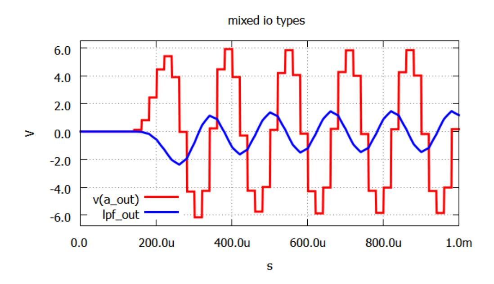

<span id="page-586-0"></span>Figure 23.2: Plot of Filter Input and Output

You can also plot data from nodes inside a subcircuit. For example, to plot the data on node 'x1a' in subcircuit 'xfilter', create a pathname to this node with a dot separator.

ngspice 3 -> plot xfilter.x1a

The output from this command is shown in Fig. [23.3.](#page-587-0) Note that the waveform contains vertical segments. These segments are caused by the non-zero delays in the 'real gain' models used within the subcircuit. Each vertical segment is actually a step with a width equal to the model delay (1e-9 seconds).

Plotting nodes internal to subcircuits works for both analog and event-driven nodes.

To examine data such as the closely spaced events inside the subcircuit at node 'xfilter.x1a', it is often convenient to use the eprint command to produce a tabular listing of events. Try this by entering the following command:

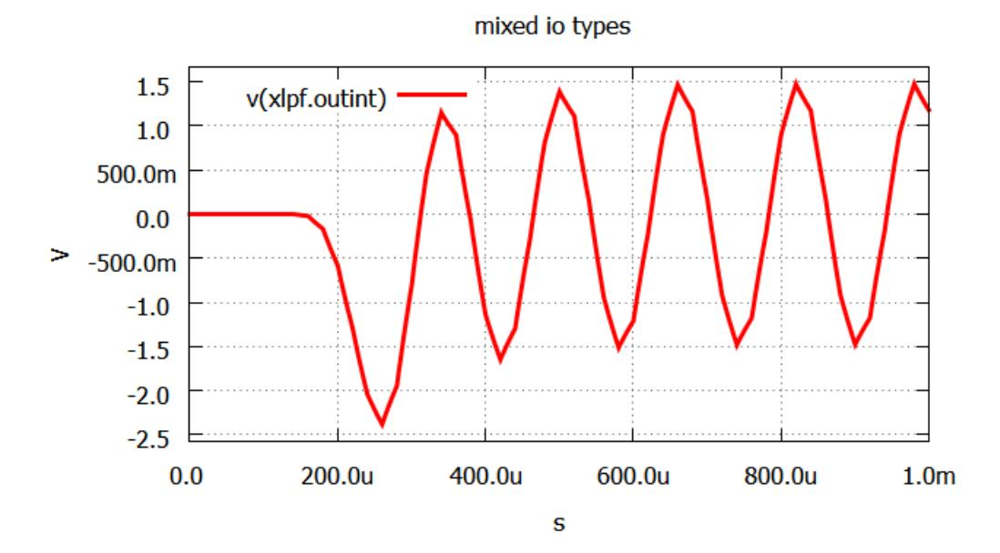

<span id="page-587-0"></span>Figure 23.3: Plot of Subcircuit Internal Node

```
ngspice 4 -> eprint xfilter.x1a
**** Results Data ****
Time or Step
xfilter.x1a
0.000000000e+000 0.000000e+000 1.010030000e-004 2.000000e+000
1.010040000e-004 2.562500e+000 1.210020000e-004 2.812500e+000
1.210030000e-004 4.253906e+000 1.410020000e-004 2.332031e+000
1.410030000e-004 3.283447e+000 1.610020000e-004 2.014893e+000
1.610030000e-004 1.469009e+000 1.810020000e-004 2.196854e+000
1.810030000e-004 1.176232e+000
...
9.610030000e-004 3.006294e-001 9.810020000e-004 2.304755e+000
9.810030000e-004 9.506230e-001 9.810090000e-004 -3.049377e+000
9.810100000e-004 -4.174377e+000
**** Messages ****
**** Statistics ****
Operating point analog/event alternations: 1
Operating point load calls: 37
Operating point event passes: 2
Transient analysis load calls: 4299
Transient analysis timestep backups: 87
```

This command produces a tabular listing of event-times in the first column and node values in the second column. The 1 ns delays can be clearly seen in the fifth decimal place of the event times.

Note that the eprint command also gives statistics from the event-driven algorithm portion of XSPICE. For this example, the simulator alternated between the analog solution algorithm and the event-driven algorithm one time while performing the initial DC operating point solution prior to the start of the transient analysis. During this operating point analysis, 37 total calls were made to event-driven code model functions, and two separate event passes or iterations were required before the event nodes obtained stable values. Once the transient analysis commenced, there were 4299 total calls to event-driven code model functions. Lastly, the analog simulation algorithm performed 87 time-step backups that forced the event-driven simulator to backup its state data and its event queues.

A similar output is obtained when printing the values of digital nodes. For example, print the values of the node 'div8 out' as follows:

```
ngspice 5 -> eprint div8_out
**** Results Data ****
Time or Step
div8_out
0.000000000e+000 1s
1.810070000e-004 0s
2.610070000e-004 1s
...
9.010070000e-004 1s
9.810070000e-004 0s
**** Messages ****
**** Statistics ****
Operating point analog/event alternations: 1
Operating point load calls: 37
Operating point event passes: 2
Transient analysis load calls: 4299
Transient analysis timestep backups: 87
```

From this printout, we see that digital node values are composed of a two character string. The first character (0, 1, or U) gives the state of the node (logic zero, logic one, or unknown logic state). The second character (s, r, z, u) gives the 'strength' of the logic state (strong, resistive, hi-impedance, or undetermined).

If you wish, examine other nodes in this circuit with either the plot or eprint commands. When you are done, enter the quit command to exit the simulator and return to the operating system prompt:

```
ngspice 6 -> quit
```

So long.

# <span id="page-590-0"></span>Chapter 24

# Code Models and User-Defined Nodes

The following sections explain the steps required to create code models and User-Defined Nodes (UDNs), store them in shared libraries and load them into the simulator at runtime. The ngspice simulator already includes XSPICE libraries of predefined models and node types that span the analog and digital domains. These have been detailed earlier in this document (see Sections [8.2,](#page-182-0) [8.3,](#page-235-1) and [8.4\)](#page-247-0). However, the real power of the XSPICE is in its support for extending these libraries with new models written by users. ngspice includes an XSPICE code model generator. Adding code models to ngspice will require a model definition plus some simple file operations, which are explained in this chapter.

The original manual cited an XSPICE 'Code Model Toolkit' that enabled one to define new models and node data types to be passed between them offline, independent from ngspice. Whereas this Toolkit is still available in the original source code distribution at the [XSPICE](https://web.archive.org/web/20161030172156/http://users.ece.gatech.edu/~mrichard/Xspice/) [web page,](https://web.archive.org/web/20161030172156/http://users.ece.gatech.edu/~mrichard/Xspice/) it is neither required nor supported any more.

So we make use of the existing XSPICE infrastructure provided with ngspice to create new code models. With an 'intelligent' copy and paste, and the many available code models serving as a guide you will be quickly able to create your own models. You have to have a compiler (gcc) available under Linux, MS Windows (Cygwin, MINGW), maybe also for other OSs, including supporting software (Flex, Bison, and the autotools if you start from Git sources). The compilation procedures for ngspice are described in detail in Chapt. [28.](#page-728-0) Adding a code model may then require defining the functionality, interface, and eventually user defined nodes. Compiling into a shared library is only a simple 'make', loading the shared lib(s) into ngspice is done by the ngspice command codemodel... (see Chapt. [13.5.15\)](#page-400-0). This will allow you to either add some code model to an existing library, or you may generate a new library with your own code models. The latter is of interest if you want to distribute your code models independently from the ngspice sources or executables.

These new code models are handled by ngspice in a manner analogous to its treating of SPICE devices and XSPICE Predefined Code Models. The basic steps required to create sources for new code models or User-Defined Nodes, compile them and load them into ngspice are similar. They consist of 1) creating the code model or UserDefined Node (UDN) directory and its associated model or data files, 2) inform ngspice about the code model or UDN directories that have to be compiled and linked into ngspice, 3) compile them into a shared lib, and 4) load them into the ngspice simulator upon runtime. All code models finally reside in dynamically linkable shared libraries (\*.cm), which in fact are .so files under Linux or dlls under MS Windows. Currently we have 5 of them (analog.cm, digital.cm, spice2poly.cm, xtradev.cm, <span id="page-591-2"></span>xtraevt.cm). Upon start up of ngspice they are dynamically loaded into the simulator by the ngspice codemodel command (which is located in file spinit (see Chapt. [12.5\)](#page-361-0) for the standard code models). Once you have added your new code model into one of these libraries (or have created a new library file, e.g. my-own.cm), instances of the model can be placed into any simulator deck that describes a circuit of interest and simulated along with all of the other components in that circuit.

A quick entry to get a new code model has already been presented in Chapt. [22.3.](#page-576-0) You may find the details of the XSPICE language in Chapt. [24.6](#page-594-0) ff.

# <span id="page-591-0"></span>24.1 Code Model Data Type Definitions

There are several data types that you can incorporate into a model. These have already been used extensively in the code model library included with the simulator. They are detailed below:

Boolean\_t The Boolean type is an enumerated type that can take on values of FALSE (integer value 0) or TRUE (integer value 1). Alternative names for these enumerations are MIF FALSE and MIF TRUE, respectively.

Complex\_t The Complex type is a structure composed of two double values. The first of these is the .real field, and the second is the .imag field. Typically these values are accessed as shown:

For complex value 'data', the real portion is 'data.real', and the imaginary portion is 'data.imag'.

Digital\_State\_t The Digital State type is an enumerated value that can be either ZERO (integer value 0), ONE (integer value 1), or UNKNOWN (integer value 2).

Digital\_Strength\_t The Digital Strength type is an enumerated value that can be either STRONG (integer value 0), RESISTIVE (integer value 1), HI IMPEDANCE (integer value 2) or UNDETERMINED (integer value 3).

Digital\_t The Digital type is a composite of the Digital\_State\_t and Digital\_Strength\_t enumerated data types. The actual variable names within the Digital type are .state and .strength and are accessed as shown below:

For Digital\_t value 'data', the state portion is 'data.state', and the strength portion is 'data.strength'.

# <span id="page-591-1"></span>24.2 Creating Code Models

The following description deals with extending one of the five existing code model libraries. Adding a new library is described in Chapt. [24.4.](#page-593-0) The first step in creating a new code model within XSPICE is to create a model directory inside of the selected library directory. The new directory name is the name of the new code model. As an example you may add a directory d\_counter to the library directory digital.

cd ngspice/src/xspice/icm/digital mkdir d\_counter

Into this new directory you copy the following template files:

- Interface Specification File (ifspec.ifs)
- Model Definition File (cfunc.mod)

You may choose existing files that are similar to the new code model you intend to integrate. The template Interface Specification File (ifspec.ifs) is edited to define the model's inputs, outputs, parameters, etc (see Chapt. [24.6\)](#page-594-0). You then edit the template Model Definition File (cfunc.mod) to include the C-language source code that defines the model behavior (see Chapt. [24.7\)](#page-601-0). As a final step you have to notify ngspice of the new code model. You have to edit the file modpath.lst that resides in the library directory ngspice/src/xspice/icm/digital. Just add the entry d\_counter to this file.

The Interface Specification File is a text file that describes, in a tabular format, information needed for the code model to be properly interpreted by the simulator when it is placed with other circuit components into a SPICE deck. This information includes such things as the parameter names, parameter default values, and the name of the model itself. The specific format presented to you in the Interface Specification File template must be followed exactly, but is quite straightforward. A detailed description of the required syntax, along with numerous examples, is included in Section [24.6.](#page-594-0)

The Model Definition File contains a C programming language function definition. This function specifies the operations to be performed within the model on the data passed to it by the simulator. Special macros are provided that allow the function to retrieve input data and return output data. Similarly, macros are provided to allow for such things as storage of information between iteration time-points and sending of error messages. Section [24.7](#page-601-0) describes the form and function of the Model Definition File in detail and lists the support macros provided within the simulator for use in code models.

To allow compiling and linking (see Chapt. [24.5\)](#page-593-1) you have at least to adapt the names of the functions inside of the two copied files to get unique function and model names. If for example you have chosen ifspec.ifs and cfunc.mod from model d\_fdiv as your template, simply replace all entries d\_fdiv by d\_counter inside of the two files.

# <span id="page-592-0"></span>24.3 Creating User-Defined Nodes

In addition to providing the capability of adding new models to the simulator, a facility exists that allows node types other than those found in standard SPICE to be created. Models may be constructed that pass information back and forth via these nodes. Such models are constructed in the manner described in the previous sections, with appropriate changes to the Interface Specification and Model Definition Files.

Because of the need of electrical engineers to have ready access to both digital and analog simulation capabilities, the digital node type is provided as a built-in node type along with standard SPICE analog nodes. For digital nodes, extensive support is provided in the form of macros and functions so that you can treat this node type as a standard type analogous to standard SPICE analog nodes when creating and using code models. In addition to analog and digital nodes, the node types real and int are also provided with the simulator. These were created using the User-Defined Node (UDN) creation facilities described below and may serve as a template for further node types.

The first step in creating a new node type within XSPICE is to set up a node type directory along with the appropriate template files needed.

```
cd ngspice/src/xspice/icm/xtraevt
mkdir <directory name>
```

<directory name> should be the name of the new type to be defined. Copy file udnfunc.c from /icm/xtraevt/int into the new directory. Edit this file according to the new type you want to create.

Notify ngspice about this new UDN directory by editing ngspice/src/xspice/icm/xtraevt/udnpath.lst. Add a new line containing <directory name>. For compiling and linking see Chapt. [24.5.](#page-593-1)

The UDN Definition File contains a set of C language functions. These functions perform operations such as allocating space for data structures, initializing them, and comparing them to each other. Section [24.8](#page-620-0) describes the form and function of the User-Defined Node Definition File in detail and includes an example UDN Definition File.

# <span id="page-593-0"></span>24.4 Adding a new code model library

A group of code models may be assembled into a library. A new library is a means to distribute new code models, independently from the existing ones. This is the way to generate a new code model library:

```
cd ngspice/src/xspice/icm/
mkdir <directory name>
```

<directory name> is the name of the new library. Copy empty files modpath.lst and udnpath.lst into this directory.

Edit file ngspice/src/xspice/icm/GNUmakefile.in, add <directory name> to the end of line 10, which starts with CMDIRS = ... .

That's all you have to do about a new library! Of course it is empty right now, so you have to define at least one code model according to the procedure described in Chapt. [24.2.](#page-591-1)

# <span id="page-593-1"></span>24.5 Compiling and loading the new code model (library)

Compiling is now as simple as issuing the commands

cd ngspice/release make sudo make install

if you have installed ngspice according to Chapt. [28.1.4.](#page-731-0) This procedure will install the code model libraries into a directory <prefix>/lib/spice/, e.g. C:/Spice/lib/spice/ for standard Windows install or /usr/local/lib/spice/ for Linux.

Thus the code model libraries are not linked into ngspice at compile time, but may be loaded at runtime using the codemodel command (see Chapt. [13.5.15\)](#page-400-0). This is done automatically for the predefined code model libraries upon starting ngspice. The appropriate commands are provided in the start up file spinit (see Chapt. [12.5\)](#page-361-0). So if you have added a new code model inside of one of the existing libraries, nothing has to be done, you will have immediate access to your new model.

If you have generated a new code model library, e.g. new\_lib.cm, then you have to add the line

```
@XSPICEINIT@ codemodel @prefix@/@libname@/spice/new_lib.cm
```

to spinit.in in ngspice/src. This will create a new spinit if ngspice is recompiled from scratch. To avoid the need for recompilation of ngspice, you also may directly edit the file spinit by adding the line

```
codemodel C:/Spice/lib/spice/new_lib.cm
```

(OS MS Windows) or the appropriate Linux equivalent. Upon starting ngspice, the new library will be loaded and you have access to the new code model(s). The codemodel command has to be executed upon start-up of ngspice, so that the model information is available as soon as the circuit is parsed. Failing to do so will lead to an error message of a model missing. So spinit (or .spiceinit for personal code model libraries) is the correct place for codemodel.

# <span id="page-594-0"></span>24.6 Interface Specification File

The Interface Specification (IFS) file is a text file that describes the model's naming information, its expected input and output ports, its expected parameters, and any variables within the model that are to be used for storage of data across an entire simulation. These four types of data are described to the simulator in IFS file sections labeled NAME\_TABLE, PORT\_TABLE, PARAMETER\_TABLE and STATIC\_VAR\_TABLE, respectively. An example IFS file is given below. The example is followed by detailed descriptions of each of the entries, what they signify, and what values are acceptable for them. Keywords are case insensitive.

NAME\_TABLE:

C\_Function\_Name: ucm\_xfer Spice\_Model\_Name: xfer

Description: "arbitrary transfer function"

PORT\_TABLE:

Port\_Name: in out Description: "input" "output" Direction: in out Default\_Type: v v

Allowed\_Types: [v,vd,i,id] [v,vd,i,id]

Vector: no no Vector\_Bounds: - - Null\_Allowed: no no

PARAMETER\_TABLE:

Parameter\_Name: in\_offset gain Description: "input offset" "gain" Data\_Type: real real Default\_Value: 0.0 1.0 Limits: - - Vector: no no Vector\_Bounds: - - Null\_Allowed: yes yes

PARAMETER\_TABLE:

Parameter\_Name: num\_coeff

Description: "numerator polynomial coefficients"

Data\_Type: real Default\_Value: - Limits: - Vector: yes Vector\_Bounds: [1 -] Null\_Allowed: no

PARAMETER\_TABLE:

Parameter\_Name: den\_coeff

Description: "denominator polynomial coefficients"

Data\_Type: real Default\_Value: - Limits: - Vector: yes Vector\_Bounds: [1 -] Null\_Allowed: no

PARAMETER\_TABLE:

Parameter\_Name: int\_ic

Description: "integrator stage initial conditions"

Data\_Type: real Default\_Value: 0.0 Limits: - Vector: yes

Vector\_Bounds: den\_coeff

Null\_Allowed: yes

STATIC\_VAR\_TABLE: Static\_Var\_Name: x

Data\_Type: pointer

Description: "x-coefficient array"

## <span id="page-596-0"></span>24.6.1 The Name Table

The name table is introduced by the Name\_Table: keyword. It defines the code model's C function name, the name used on a .MODEL card, and an optional textual description. The following sections define the valid fields that may be specified in the Name Table.

#### 24.6.1.1 C Function Name

The C function name is a valid C identifier that is the name of the function for the code model. It is introduced by the C\_Function\_Name: keyword followed by a valid C identifier. To reduce the chance of name conflicts, it is recommended that user-written code model names use the prefix ucm\_ for this entry. Thus, in the example given above, the model name is xfer, but the C function is ucm\_xfer. Note that when you subsequently write the model function in the Model Definition File, this name must agree with that of the function (i.e., ucm\_xfer), or an error will result in the linking step.

#### 24.6.1.2 SPICE Model Name

The SPICE model name is a valid SPICE identifier that will be used on SPICE .MODEL cards to refer to this code model. It may or may not be the same as the C function name. It is introduced by the Spice\_Model\_Name: keyword followed by a valid SPICE identifier.

Description The description string is used to describe the purpose and function of the code model. It is introduced by the Description: keyword followed by a C string literal.

## <span id="page-596-1"></span>24.6.2 The Port Table

The port table is introduced by the Port\_Table: keyword. It defines the set of valid ports available to the code model. The following sections define the valid fields that may be specified in the port table.

#### 24.6.2.1 Port Name

The port name is a valid SPICE identifier. It is introduced by the Port\_Name: keyword followed by the name of the port. Note that this port name will be used to obtain and return input and output values within the model function. This will be discussed in more detail in the next section.

#### 24.6.2.2 Description

The description string is used to describe the purpose and function of the port. It is introduced by the Description: keyword followed by a C string literal.

|                           | Default Types                     |                  |  |  |  |
|---------------------------|-----------------------------------|------------------|--|--|--|
| Type                      | Description                       | Valid Directions |  |  |  |
| d                         | digital                           | any              |  |  |  |
| g                         | conductance (VCCS)                | inout            |  |  |  |
| gd                        | differential conductance (VCCS)   | inout            |  |  |  |
| h                         | resistance (CCVS)                 | inout            |  |  |  |
| hd                        | differential resistance (CCVS)    | inout            |  |  |  |
| i                         | current                           | in or out        |  |  |  |
| id                        | differential current              | in or out        |  |  |  |
| v                         | voltage                           | in or out        |  |  |  |
| vd                        | differential voltage<br>in or out |                  |  |  |  |
| <identifier></identifier> | user-defined type                 | any              |  |  |  |

<span id="page-597-0"></span>Table 24.1: Port Types

#### 24.6.2.3 Direction

The direction of a port specifies the data flow direction through the port. A direction must be one of n, out, or inout. It is introduced by the Direction: keyword followed by a valid direction value.

#### 24.6.2.4 Default Type

The Default\_Type field specifies the type of a port. These types are identical to those used to define the port types on a SPICE deck instance card (see Table [8.1\)](#page-179-0), but without the percent sign (%) preceding them. Table [24.1](#page-597-0) summarizes the allowable types.

#### 24.6.2.5 Allowed Types

A port must specify the types it is allowed to assume. An allowed type value must be a list of type names (a blank or comma separated list of names delimited by square brackets, e.g. [v vd i id] or [d]). The type names must be taken from those listed in Table [24.1.](#page-597-0)

#### 24.6.2.6 Vector

A port that is a vector can be thought of as a bus. The Vector field is introduced with the Vector: keyword followed by a Boolean value: YES, TRUE, NO or FALSE.

The values YES and TRUE are equivalent and specify that this port is a vector. Likewise, NO and FALSE specify that the port is not a vector. Vector ports must have a corresponding vector bounds field that specifies valid sizes of the vector port.

#### <span id="page-597-1"></span>24.6.2.7 Vector Bounds

If a port is a vector, limits on its size must be specified in the vector bounds field. The Vector Bounds field specifies the upper and lower bounds on the size of a vector. The Vector Bounds field is usually introduced by the Vector\_Bounds: keyword followed by a range of integers (e.g. '[1 7]' or '[3, 20]'). The lower bound of the vector specifies the minimum number of elements in the vector; the upper bound specifies the maximum number of elements. If the range is unconstrained, or the associated port is not a vector, the vector bounds may be specified by a hyphen ('-'). Using the hyphen convention, partial constraints on the vector bound may be defined (e.g., '[2, -]' indicates that the least number of port elements allowed is two, but there is no maximum number).

#### 24.6.2.8 Null Allowed

In some cases, it is desirable to permit a port to remain unconnected to any electrical node in a circuit. The Null\_Allowed field specifies whether this constitutes an error for a particular port. The Null\_Allowed field is introduced by the 'Null\_Allowed:' keyword and is followed by a boolean constant: 'YES', 'TRUE', 'NO' or 'FALSE'. The values 'YES' and 'TRUE' are equivalent and specify that it is legal to leave this port unconnected. 'NO' or 'FALSE' specify that the port must be connected.

## <span id="page-598-0"></span>24.6.3 The Parameter Table

The parameter table is introduced by the Parameter\_Table: keyword. It defines the set of valid parameters available to the code model. The following sections define the valid fields that may be specified in the parameter table.

#### 24.6.3.1 Parameter Name

A parameter name is a valid SPICE identifier that will be used on SPICE .MODEL cards to refer to this parameter. It is introduced by the Parameter\_Name: keyword followed by a valid SPICE identifier.

#### 24.6.3.2 Description

The description string is used to describe the purpose and function of the parameter. It is introduced by the 'Description:' keyword followed by a string literal.

#### 24.6.3.3 Data Type

The parameter's data type is specified by the Data Type field. The Data Type field is introduced by the keyword 'Data\_Type:' and is followed by a valid data type. Valid data types include boolean, complex, int, real, and string.

#### 24.6.3.4 Null Allowed

The Null\_Allowed field is introduced by the 'Null\_Allowed:' keyword and is followed by a boolean literal. A value of 'TRUE' or 'YES' specify that it is valid for the corresponding SPICE .MODEL card to omit a value for this parameter. If the parameter is omitted, the default value is used. If there is no default value, an undefined value is passed to the code model, and the PARAM\_NULL( ) macro will return a value of 'TRUE' so that defaulting can be handled within the model itself. If the value of Null\_Allowed is 'FALSE' or 'NO', then the simulator will flag an error if the SPICE .MODEL card omits a value for this parameter.

#### 24.6.3.5 Default Value

If the Null\_Allowed field specifies 'TRUE' for this parameter, then a default value may be specified. This value is supplied for the parameter in the event that the SPICE .MODEL card does not supply a value for the parameter. The default value must be of the correct type. The Default Value field is introduced by the 'Default\_Value:' keyword and is followed by a numeric, boolean, complex, or string literal, as appropriate.

#### 24.6.3.6 Limits

Integer and real parameters may be constrained to accept a limited range of values. The following range syntax is used whenever such a range of values is required. A range is specified by a square bracket followed by a value representing a lower bound separated by space from another value representing an upper bound and terminated with a closing square bracket (e.g."[0 10]"). The lower and upper bounds are inclusive. Either the lower or the upper bound may be replaced by a hyphen ('-') to indicate that the bound is unconstrained (e.g. '[10 -]' is read as 'the range of values greater than or equal to 10'). For a totally unconstrained range, a single hyphen with no surrounding brackets may be used. The parameter value limit is introduced by the 'Limits:' keyword and is followed by a range.

#### 24.6.3.7 Vector

The Vector field is used to specify whether a parameter is a vector or a scalar. Like the PORT TABLE Vector field, it is introduced by the 'Vector:' keyword and followed by a boolean value. 'TRUE' or 'YES' specify that the parameter is a vector. 'FALSE' or 'NO' specify that it is a scalar.

#### 24.6.3.8 Vector Bounds

The valid sizes for a vector parameter are specified in the same manner as are port sizes (see Section [24.6.2.7\)](#page-597-1). However, in place of using a numeric range to specify valid vector bounds it is also possible to specify the name of a port. When a parameter's vector bounds are specified in this way, the size of the vector parameter must be the same as the associated vector port.

## <span id="page-599-0"></span>24.6.4 Static Variable Table

The Static Variable table is introduced by the 'Static\_Var\_Table:' keyword. It defines the set of valid static variables available to the code model. These are variables whose values are retained between successive invocations of the code model by the simulator. The following sections define the valid fields that may be specified in the Static Variable Table.

#### 24.6.4.1 Name

The Static variable name is a valid C identifier that will be used in the code model to refer to this static variable. It is introduced by the 'Static\_Var\_Name:' keyword followed by a valid C identifier.

#### 24.6.4.2 Description

The description string is used to describe the purpose and function of the static variable. It is introduced by the 'Description:' keyword followed by a string literal.

#### 24.6.4.3 Data Type

The static variable's data type is specified by the Data Type field. The Data Type field is introduced by the keyword Data\_Type: and is followed by a valid data type. Valid data types include boolean, complex, int, real, string and pointer.

Note that pointer types are used to specify vector values; in such cases, the allocation of memory for vectors must be handled by the code model through the use of the malloc() or calloc() C function. Such allocation must only occur during the initialization cycle of the model (which is identified in the code model by testing the INIT macro for a value of TRUE). Otherwise, memory will be unnecessarily allocated each time the model is called.

Following is an example of the method used to allocate memory to be referenced by a static pointer variable 'x' and subsequently use the allocated memory. The example assumes that the value of 'size' is at least 2, else an error would result. The references to STATIC\_VAR(x) that appear in the example illustrate how to set the value of, and then access, a static variable named 'x'. In order to use the variable 'x' in this manner, it must be declared in the Static Variable Table of the code model's Interface Specification File.

```
/* Define local pointer variable */
double *local.x;
/* Allocate storage to be referenced by the static variable x. */
/* Do this only if this is the initial call of the code model. */
if (INIT == TRUE) {
    STATIC_VAR(x) = calloc(size, sizeof(double));
}
/* Assign the value from the static pointer value to the local */
/* pointer variable. */
local_x = STATIC_VAR(x);
/* Assign values to first two members of the array */
local_x[0] = 1.234;
local_x[1] = 5.678;
```

# <span id="page-601-0"></span>24.7 Model Definition File

The Model Definition File is a C source code file that defines a code model's behavior given input values that are passed to it by the simulator. The file itself is always given the name cfunc.mod. In order to allow for maximum flexibility, passing of input, output, and simulatorspecific information is handled through accessor macros, which are described below. These are not ordinary C preprocesor macros; they are expanded by a dedicated program that checks them against the interface specification file. In addition, certain predefined library functions (e.g. smoothing interpolators, complex arithmetic routines) are included in the simulator in order to ease the burden of the code model programmer. These are also described below.

## <span id="page-601-1"></span>24.7.1 Macros

The use of the accessor macros is illustrated in the following example. Note that the argument to most accessor macros is the name of a parameter or port as defined in the Interface Specification File. Note also that all accessor macros except 'ARGS' resolve to an lvalue (C language terminology for something that can be assigned a value). Accessor macros do not implement expressions or assignments.

```
void code.model(ARGS) /* private structure accessed by
                         accessor macros */
{
/* The following code fragments are intended to show how
   information in the argument list is accessed. The reader
   should not attempt to relate one fragment to another.
   Consider each fragment as a separate example.
*/
   double p,/* variable for use in the following code fragments */
       x, /* variable for use in the following code fragments */
       y; /* variable for use in the following code fragments */
   int i, /* indexing variable for use in the following */
       j; /* indexing variable for use in the following */
   UDN_Example_Type *a_ptr, /* A pointer used to access a
                                User-Defined Node type */
                    *y_ptr; /* A pointer used to access a
                                User-Defined Node type */
   /* Initializing and outputting a User-Defined Node result */
   if(INIT) {
      OUTPUT(y) = malloc(sizeof(user.defined.struct));
      y_ptr = OUTPUT(y);
      y_ptr->component1 = 0.0;
      y_ptr->component2 = 0.0;
```

```
}
 else {
    y_ptr = OUTPUT(y);
    y_ptr->component1 = x1;
    y_ptr->component2 = x2;
 }
 /* Determining analysis type */
 if(ANALYSIS == AC) {
     /* Perform AC analysis-dependent operations here */
 }
 /* Accessing a parameter value from the .model card */
 p = PARAM(gain);
 /* Accessing a vector parameter from the .model card */
 for(i = 0; i < PARAM_SIZE(in_offset); i++)
    p = PARAM(in_offset[i]);
 /* Accessing the value of a simple real-valued input */
 x = INPUT(a);
 /* Accessing a vector input and checking for null port */
 if( ! PORT_NULL(a))
    for(i = 0; i < PORT_SIZE(a); i++)
       x = INPUT(a[i]);
 /* Accessing a digital input */
 x = INPUT(a);
 /* Accessing the value of a User-Defined Node input... */
 /* This node type includes two elements in its definition. */
 a_ptr = INPUT(a);
 x = a_ptr->component1;
 y = a_ptr->component2;
 /* Outputting a simple real-valued result */
 OUTPUT(out1) = 0.0;
 /* Outputting a vector result and checking for null */
 if( ! PORT_NULL(a))
    for(i = 0; i < PORT_SIZE(a); i++)
       OUTPUT(a[i]) = 0.0;
 /* Outputting the partial of output out1 w.r.t. input a */
 PARTIAL(out1,a) = PARAM(gain);
/* Outputting the partial of output out2(i) w.r.t. input b(j) */
```

```
for(i = 0; i < PORT_SIZE(out2); i++) {
      for(j = 0; j < PORT_SIZE(b); j++) {
         PARTIAL(out2[i],b[j]) = 0.0;
      }
   }
  /* Outputting gain from input c to output out3 in an
     AC analysis */
   complex_gain_real = 1.0;
   complex_gain_imag = 0.0;
   AC_GAIN(out3,c) = complex_gain;
   /* Outputting a digital result */
   OUTPUT_STATE(out4) = ONE;
   /* Outputting the delay for a digital or user-defined output */
   OUTPUT_DELAY(out5) = 1.0e-9;
}
```

#### 24.7.1.1 Macro Definitions

The full set of accessor macros is listed below. Arguments shown in parenthesis are examples only. Explanations of the accessor macros are provided in the subsections below.

```
Circuit Data:
    ARGS
    CALL_TYPE
    INIT
    ANALYSIS
    NEW_TIMEPOINT
    TIME
    T(n)
    RAD_FREQ
    TEMPERATURE
    CALLBACK
Parameter Data:
    PARAM(gain)
    PARAM_SIZE(gain)
    PARAM_NULL(gain)
Port Data:
    PORT_SIZE(a)
    PORT_NULL(a)
    LOAD(a)
    TOTAL_LOAD(a)
Input Data:
    INPUT(a)
    INPUT_STATE(a)
```

```
INPUT_STRENGTH(a)
Output Data:
    OUTPUT(y)
    OUTPUT_CHANGED(a)
    OUTPUT_DELAY(y)
    OUTPUT_STATE(a)
    OUTPUT_STRENGTH(a)
Partial Derivatives:
    PARTIAL(y,a)
AC Gains:
    AC_GAIN(y,a)
Static Variable:
    STATIC_VAR(x)
```

#### 24.7.1.2 Macro arguments for vector ports and parameters

When a port or parameter has been defined as a vector in the interface specification, some macros require an argument that includes the vector index, as in OUTPUT(y[i]), while others accept only the simple port or parameter name. The first kind are identified as "indexed" in the descriptions below. The index may be any C expression that specifies a valid index for the vector.

#### 24.7.1.3 Circuit Data

ARGS CALL\_TYPE INIT ANALYSIS NEW\_TIMEPOINT TIME T(n) RAD\_FREQ TEMPERATURE CALLBACK

ARGS is a macro that is passed in the argument list of every code model. It is there to provide a way of referencing each model to all of the remaining macro values. It must be present in the argument list of every code model; it must also be the only argument present in the argument list of every code model.

CALL\_TYPE is a macro that returns one of two possible symbolic constants. These are EVENT and ANALOG. Testing may be performed by a model using CALL TYPE to determine whether it is being called by the analog simulator or the event-driven simulator. This will, in general, only be of value to a hybrid model such as the adc bridge or the dac bridge. Some expected behaviours of the code model, such as setting output values, depend on the CALL TYPE. For code models that request it (see [24.7.2.7\)](#page-616-0) a third value, STEP\_PENDING, is used when the call indicates that the simulator is about to complete an analog time step.

INIT is an integer (int) that takes the value 1 or 0 depending on whether this is the first call to the code model instance or not, respectively.

ANALYSIS is an enumerated integer that takes values of DC, AC, or TRANSIENT.

NEW\_TIMEPOINT is an integer that takes the value 1 or 0 depending on whether this is the first call for this instance at the current analysis step (i.e., time-point) or not, respectively.

TIME is a double representing the current analysis time in a transient analysis. T(n) is a double vector giving the analysis time for a specific analog time-point in a transient analysis, where n takes the value 0 or 1. T(0) is equal to TIME in ANALOG calls, but in EVENT calls TIME lies between T(1) and T(0). T(1) is the last accepted time-point. (T(0) - T(1)) is the time-step (i.e., the delta-time value) associated with the current time. The difference between the TIME values in two successive calls to a code model function may be zero, or even negative if the analog simulator reduces the time-step while seeking convergence. TIME will never be less than any current or previous valid T(1).

RAD\_FREQ is a double representing the current analysis frequency in an AC analysis expressed in units of radians per second.

TEMPERATURE is a double representing the current analysis temperature.

CALLBACK is a variable of type Mif\_Callback\_t, a function pointer defined in the header file miftypes.h. A function may be supplied by assigning to CALLBACK in the INIT call to the code model. That function will then be called during reset or deletion of instances of the code model. It is expected to release any extra resources such as dynamic memory or open files that have been allocated during simulation. Most code models will not need this as storage for variables allocated through the library are released automatically. When the function is called, the first argument is ARGS and the second is a reason code: currently the only value is MIF\_CB\_DESTROY. That should be checked in case new call reasons are introduced. The set of macros that can be used in the function is restricted to those for ports, parameters and static variables.

#### 24.7.1.4 Parameter Data

PARAM(gain) PARAM\_SIZE(gain) PARAM\_NULL(gain)

PARAM(gain) (indexed) resolves to the value of the scalar (i.e., non-vector) parameter 'gain' that was defined in the Interface Specification File tables. The macro evaluation has the type given in the ifspec.ifs file and can be used regardless of type. If 'gain' is a string, then PARAM(gain) resolves to a read-only character pointer.

PARAM\_SIZE(gain) resolves to an integer (int) representing the size of the 'gain' vector (which was dynamically determined when the SPICE deck was read). PARAM\_SIZE(gain) is undefined if 'gain' is a scalar.

PARAM\_NULL(gain) resolves to an integer with value 0 or 1 depending on whether a value was specified for gain, or whether the value is defaulted, respectively.

#### <span id="page-606-0"></span>24.7.1.5 Port Data

PORT\_SIZE(a) PORT\_NULL(a) LOAD(a) TOTAL\_LOAD(a)

- PORT\_SIZE(a) resolves to an integer (int) representing the size of the 'a' vector port (which was dynamically determined when the SPICE deck was read). PORT\_SIZE(a) is undefined if gain is a scalar.
- PORT\_NULL(a) resolves to an integer (int) with value 0 or 1 depending on whether the SPICE deck has a node specified for this port, or has specified that the port is null, respectively.
- LOAD(a) (indexed) is used in a digital model to post a capacitive load value to a particular input or output port during the INIT pass of the simulator. All values posted for a particular event-driven node using the LOAD() macro are summed, producing a total load value.
- TOTAL\_LOAD(a) (indexed) returns a double value that represents the total capacitive load seen on a specified node to which a digital code model is connected. This information may be used after the INIT pass by the code model to modify the delays it posts with its output states and strengths. Note that this macro can also be used by non-digital eventdriven code models (see LOAD(), above).

#### 24.7.1.6 Input Data

```
INPUT(a)
INPUT_STATE(a)
INPUT_STRENGTH(a)
```

The input data macros are all indexed.

- INPUT(a) resolves to the value of the scalar input a that was defined in the Interface Specification File tables. The macro evaluates to a real (double) value for analog ports and a pointer to the internal representation for event ports (digital, integer, real or user-defined). The same accessor macro can be used regardless of type.
- INPUT\_STATE(a) resolves to the state value defined for digital node types. These will be one of the symbolic constants ZERO, ONE, or UNKNOWN.
- INPUT\_STRENGTH(a) resolves to the strength with which a digital input node is being driven. This is determined by a resolution algorithm that looks at all outputs to a node and determines its final driven strength. This value in turn is passed to a code model when requested by this macro. Possible strength values are
  - 1. STRONG
  - 2. RESISTIVE
  - 3. HI\_IMPEDANCE
  - 4. UNDETERMINED

#### 24.7.1.7 Output Data

OUTPUT(y) OUTPUT\_CHANGED(a) OUTPUT\_DELAY(y) OUTPUT\_STATE(a) OUTPUT\_STRENGTH(a)

The output data macros are all indexed.

- OUTPUT(y) resolves to the value of the scalar output 'y' that was defined in the Interface Specification File tables. The macro evaluates to a real l-value (it can be assigned to) for analog ports and a pointer to the internal representation (dereference before assigning a value) for event ports (digital, integer, real or user-defined). The same accessor macro can be used regardless of type. Event simulator port values must only be set in EVENT calls. All analog simulator ports should be set in ANALOG calls, otherwise the value reverts to zero. Setting analog ports in an EVENT call does nothing. To handle the case where a new output for the"other" simulator is produced, schedule a re-entry to that simulator using cm\_event\_queue() or cm\_analog\_set\_temp\_breakpoint(), as appropriate, passing TIME as the argument.
- OUTPUT\_CHANGED(a) may be assigned one of two values for any particular output to an event simulator port. If assigned the value TRUE (the default), then an output state, strength (if digital) and delay must be posted by the model during the call. If, on the other hand, no change has occurred during that pass, the OUTPUT\_CHANGED(a) value for an output can be set to FALSE. In this case, no state, strength or delay values need be posted by the model. Remember that this macro applies to a single output port. If a model has multiple outputs that have not changed, OUTPUT\_CHANGED(a) must be set to FALSE for each of them.
- OUTPUT\_DELAY(y) may be assigned a double value representing a delay associated with a particular event simulator port. Note that this macro must be set for each digital or User-Defined Node output from a model during each pass, unless the OUTPUT\_CHANGED(a) macro is set to FALSE. Note also that a positive value must be assigned to OUTPUT\_DELAY(). Assigning a value of zero (or a negative value) will cause an error.
- OUTPUT\_STATE(a) may be assigned a state value for a digital output node. Valid values are ZERO, ONE, and UNKNOWN. This is the normal way of posting an output state from a digital code model. This is a convenient alternative to constructing a full digital value (state and strength) and assigning to \*OUTPUT(a).
- OUTPUT\_STRENGTH(a) may be assigned a strength value for a digital output node. This is the normal way of posting an output strength from a digital code model. Valid values are
  - 1. STRONG
  - 2. RESISTIVE
  - 3. HI\_IMPEDANCE
  - 4. UNDETERMINED

#### 24.7.1.8 Partial Derivatives

```
PARTIAL(y,a)
PARTIAL(y[n],a)
PARTIAL(y,a[m])
PARTIAL(y[n],a[m])
```

PARTIAL(y,a) (indexed) resolves to the value of the partial derivative of scalar output 'y' with respect to scalar input 'a'. The type is always double since partial derivatives are only defined for nodes with real valued quantities (i.e., analog nodes).

The remaining uses of PARTIAL are shown for the cases in which either the output, the input, or both are vectors.

Partial derivatives are required by the simulator to allow it to solve the non-linear equations that describe circuit behavior for analog nodes. Since coding of partial derivatives can become difficult and error-prone for complex analog models, you may wish to consider using the cm\_analog\_auto\_partial() code model support function instead of using this macro.

PARTIAL(a, a) is valid for an inout port and its use may greatly improve convergence.

#### 24.7.1.9 AC Gains

```
AC_GAIN(y,a)
AC_GAIN(y[n],a)
AC_GAIN(y,a[m])
AC_GAIN(y[n],a[m])
```

AC\_GAIN(y,a) (indexed) resolves to the value of the AC analysis gain of scalar output 'y' from scalar input 'a'. The type is always a structure (Complex\_t) defined in the standard code model header file:

```
typedef struct Complex_s {
    double real; /* The real part of the complex number */
    double imag; /* The imaginary part of the complex number */
} Complex_t;
```

The remaining uses of AC\_GAIN are shown for the cases in which either the output, the input, or both are vectors.

#### 24.7.1.10 Static Variables

```
STATIC_VAR(x)
```

STATIC\_VAR(x) resolves to an lvalue for a scalar or pointer as defined in the Interface Specification File. Unlike C language static and global variables, these values are local to a specific instance of the code model. The type of 'x' is that given in the Interface Specification File. The same accessor macro can be used regardless of type since it simply resolves to an lvalue. To store a C structure or vector, the declared type should be 'pointer' and the code model is responsible for allocating storage and assigning the pointer to the allocated storage to STATIC\_VAR(x). That is usually done in the INIT call. The code model is also responsible for freeing the storage, in a function that is declared by the CALLBACK macro.

#### 24.7.1.11 Accessor Macros

Table [24.3](#page-610-1) describes the accessor macros available to the Model Definition File programmer and their C types. The PARAM and STATIC\_VAR macros, whose types are labeled CD (context dependent), return the type defined in the Interface Specification File. Arguments listed with '[i]' take an optional square bracket delimited index if the corresponding port or parameter is a vector. The index may be any C expression - possibly involving calls to other accessor macros (e.g.," OUTPUT(out[PORT\_SIZE(out)-1])")

| Name           | Type                 | Args          | Description                                                                                     |
|----------------|----------------------|---------------|-------------------------------------------------------------------------------------------------|
| AC_GAIN        | Complex_t            | y[i],x[i]     | AC gain of output y with respect to<br>input x.                                                 |
| ANALYSIS       | enum                 | <none></none> | Type of analysis: DC, AC,<br>TRANSIENT.                                                         |
| ARGS           | Mif_Private_t        | <none></none> | Standard argument to all code<br>model function.                                                |
| CALLBACK       | Mif_Callback_t       | <none></none> | Pointer to callback function                                                                    |
| CALL_TYPE      | enum                 | <none></none> | Type of model evaluation call:<br>ANALOG or EVENT.                                              |
| INIT           | Boolean_t            | <none></none> | Is this the first call to the model?                                                            |
| INPUT          | double, int or void* | name[i]       | Value of analog input port, or value<br>of structure pointer for<br>User-Defined Node port.     |
| INPUT_STATE    | enum                 | name[i]       | State of a digital input: ZERO,<br>ONE, or UNKNOWN.                                             |
| INPUT_STRENGTH | enum                 | name[i]       | Strength of digital input:<br>STRONG, RESISTIVE, HI<br>IMPEDANCE, or<br>UNDETERMINED.           |
| INPUT_TYPE     | char*                | name[i]       | The port type of the input.                                                                     |
| LOAD           | double               | name[i]       | The digital load value placed on a<br>port by this model.                                       |
| MESSAGE        | char*                | name[i]       | A message output by a model on<br>an event-driven node.                                         |
| OUTPUT         | double, int or void* | name[i]       | Value of the analog output port or<br>value of structure pointer for<br>User-Defined Node port. |
| OUTPUT_CHANGED | Boolean_t            | name[i]       | Has a new value been assigned to<br>this event-driven output by the<br>model?                   |

<span id="page-610-1"></span>Table 24.3: Accessor macros

| OUTPUT_STATE<br>enum<br>name[i]<br>State of a digital output: ZERO,<br>ONE, or UNKNOWN.<br>OUTPUT_STRENGTH<br>enum<br>name[i]<br>Strength of digital output:<br>STRONG, RESISTIVE,<br>HI_IMPEDANCE, or<br>UNDETERMINED.<br>OUTPUT_TYPE<br>char*<br>name[i]<br>The port type of the output.<br>PARAM<br>CD<br>name[i]<br>Value of the parameter.<br>PARAM_NULL<br>Boolean_t<br>name[i]<br>Was the parameter not included on<br>the SPICE<br>.model card ?<br>PARAM_SIZE<br>int<br>name<br>Size of parameter vector.<br>PARTIAL<br>double<br>y[i],x[i]<br>Partial derivative of output y with<br>respect to input x.<br>PORT_NULL<br>Mif_Boolean_t<br>name<br>Has this port been specified as<br>unconnected?<br>PORT_SIZE<br>int<br>name<br>Size of port vector.<br>RAD_FREQ<br>double<br><none><br/>Current analysis frequency in<br/>radians per second.<br/>STATIC_VAR<br/>CD<br/>name<br/>Value of a static variable.<br/>STATIC_VAR_SIZE<br/>int<br/>name<br/>Size of static var vector (currently<br/>unused).<br/>T(n)<br/>int<br/>index<br/>Current and previous analysis<br/>times (T(0) = current analysis time,<br/>T(1) = previous analysis time).<br/>TEMPERATURE<br/>double<br/><none><br/>Current analysis temperature.<br/>TIME<br/>double<br/><none><br/>Current analysis time (same as<br/>T(0) for ANALOG calls). In<br/>EVENT calls it is the event time<br/>and may lie between T(1) and T(0).<br/>TOTAL_LOAD<br/>double<br/>name[i]<br/>The total of all loads on the node</none></none></none> | OUTPUT_DELAY | double | name[i] | Delay in seconds for an             |
|----------------------------------------------------------------------------------------------------------------------------------------------------------------------------------------------------------------------------------------------------------------------------------------------------------------------------------------------------------------------------------------------------------------------------------------------------------------------------------------------------------------------------------------------------------------------------------------------------------------------------------------------------------------------------------------------------------------------------------------------------------------------------------------------------------------------------------------------------------------------------------------------------------------------------------------------------------------------------------------------------------------------------------------------------------------------------------------------------------------------------------------------------------------------------------------------------------------------------------------------------------------------------------------------------------------------------------------------------------------------------------------------------------------------------------------------------------------------------------------------------------------------|--------------|--------|---------|-------------------------------------|
|                                                                                                                                                                                                                                                                                                                                                                                                                                                                                                                                                                                                                                                                                                                                                                                                                                                                                                                                                                                                                                                                                                                                                                                                                                                                                                                                                                                                                                                                                                                      |              |        |         | event-driven output.                |
|                                                                                                                                                                                                                                                                                                                                                                                                                                                                                                                                                                                                                                                                                                                                                                                                                                                                                                                                                                                                                                                                                                                                                                                                                                                                                                                                                                                                                                                                                                                      |              |        |         |                                     |
|                                                                                                                                                                                                                                                                                                                                                                                                                                                                                                                                                                                                                                                                                                                                                                                                                                                                                                                                                                                                                                                                                                                                                                                                                                                                                                                                                                                                                                                                                                                      |              |        |         |                                     |
|                                                                                                                                                                                                                                                                                                                                                                                                                                                                                                                                                                                                                                                                                                                                                                                                                                                                                                                                                                                                                                                                                                                                                                                                                                                                                                                                                                                                                                                                                                                      |              |        |         |                                     |
|                                                                                                                                                                                                                                                                                                                                                                                                                                                                                                                                                                                                                                                                                                                                                                                                                                                                                                                                                                                                                                                                                                                                                                                                                                                                                                                                                                                                                                                                                                                      |              |        |         |                                     |
|                                                                                                                                                                                                                                                                                                                                                                                                                                                                                                                                                                                                                                                                                                                                                                                                                                                                                                                                                                                                                                                                                                                                                                                                                                                                                                                                                                                                                                                                                                                      |              |        |         |                                     |
|                                                                                                                                                                                                                                                                                                                                                                                                                                                                                                                                                                                                                                                                                                                                                                                                                                                                                                                                                                                                                                                                                                                                                                                                                                                                                                                                                                                                                                                                                                                      |              |        |         |                                     |
|                                                                                                                                                                                                                                                                                                                                                                                                                                                                                                                                                                                                                                                                                                                                                                                                                                                                                                                                                                                                                                                                                                                                                                                                                                                                                                                                                                                                                                                                                                                      |              |        |         |                                     |
|                                                                                                                                                                                                                                                                                                                                                                                                                                                                                                                                                                                                                                                                                                                                                                                                                                                                                                                                                                                                                                                                                                                                                                                                                                                                                                                                                                                                                                                                                                                      |              |        |         |                                     |
|                                                                                                                                                                                                                                                                                                                                                                                                                                                                                                                                                                                                                                                                                                                                                                                                                                                                                                                                                                                                                                                                                                                                                                                                                                                                                                                                                                                                                                                                                                                      |              |        |         |                                     |
|                                                                                                                                                                                                                                                                                                                                                                                                                                                                                                                                                                                                                                                                                                                                                                                                                                                                                                                                                                                                                                                                                                                                                                                                                                                                                                                                                                                                                                                                                                                      |              |        |         |                                     |
|                                                                                                                                                                                                                                                                                                                                                                                                                                                                                                                                                                                                                                                                                                                                                                                                                                                                                                                                                                                                                                                                                                                                                                                                                                                                                                                                                                                                                                                                                                                      |              |        |         |                                     |
|                                                                                                                                                                                                                                                                                                                                                                                                                                                                                                                                                                                                                                                                                                                                                                                                                                                                                                                                                                                                                                                                                                                                                                                                                                                                                                                                                                                                                                                                                                                      |              |        |         |                                     |
|                                                                                                                                                                                                                                                                                                                                                                                                                                                                                                                                                                                                                                                                                                                                                                                                                                                                                                                                                                                                                                                                                                                                                                                                                                                                                                                                                                                                                                                                                                                      |              |        |         |                                     |
|                                                                                                                                                                                                                                                                                                                                                                                                                                                                                                                                                                                                                                                                                                                                                                                                                                                                                                                                                                                                                                                                                                                                                                                                                                                                                                                                                                                                                                                                                                                      |              |        |         |                                     |
|                                                                                                                                                                                                                                                                                                                                                                                                                                                                                                                                                                                                                                                                                                                                                                                                                                                                                                                                                                                                                                                                                                                                                                                                                                                                                                                                                                                                                                                                                                                      |              |        |         |                                     |
|                                                                                                                                                                                                                                                                                                                                                                                                                                                                                                                                                                                                                                                                                                                                                                                                                                                                                                                                                                                                                                                                                                                                                                                                                                                                                                                                                                                                                                                                                                                      |              |        |         |                                     |
|                                                                                                                                                                                                                                                                                                                                                                                                                                                                                                                                                                                                                                                                                                                                                                                                                                                                                                                                                                                                                                                                                                                                                                                                                                                                                                                                                                                                                                                                                                                      |              |        |         |                                     |
|                                                                                                                                                                                                                                                                                                                                                                                                                                                                                                                                                                                                                                                                                                                                                                                                                                                                                                                                                                                                                                                                                                                                                                                                                                                                                                                                                                                                                                                                                                                      |              |        |         |                                     |
|                                                                                                                                                                                                                                                                                                                                                                                                                                                                                                                                                                                                                                                                                                                                                                                                                                                                                                                                                                                                                                                                                                                                                                                                                                                                                                                                                                                                                                                                                                                      |              |        |         |                                     |
|                                                                                                                                                                                                                                                                                                                                                                                                                                                                                                                                                                                                                                                                                                                                                                                                                                                                                                                                                                                                                                                                                                                                                                                                                                                                                                                                                                                                                                                                                                                      |              |        |         |                                     |
|                                                                                                                                                                                                                                                                                                                                                                                                                                                                                                                                                                                                                                                                                                                                                                                                                                                                                                                                                                                                                                                                                                                                                                                                                                                                                                                                                                                                                                                                                                                      |              |        |         |                                     |
|                                                                                                                                                                                                                                                                                                                                                                                                                                                                                                                                                                                                                                                                                                                                                                                                                                                                                                                                                                                                                                                                                                                                                                                                                                                                                                                                                                                                                                                                                                                      |              |        |         |                                     |
|                                                                                                                                                                                                                                                                                                                                                                                                                                                                                                                                                                                                                                                                                                                                                                                                                                                                                                                                                                                                                                                                                                                                                                                                                                                                                                                                                                                                                                                                                                                      |              |        |         |                                     |
|                                                                                                                                                                                                                                                                                                                                                                                                                                                                                                                                                                                                                                                                                                                                                                                                                                                                                                                                                                                                                                                                                                                                                                                                                                                                                                                                                                                                                                                                                                                      |              |        |         |                                     |
|                                                                                                                                                                                                                                                                                                                                                                                                                                                                                                                                                                                                                                                                                                                                                                                                                                                                                                                                                                                                                                                                                                                                                                                                                                                                                                                                                                                                                                                                                                                      |              |        |         |                                     |
|                                                                                                                                                                                                                                                                                                                                                                                                                                                                                                                                                                                                                                                                                                                                                                                                                                                                                                                                                                                                                                                                                                                                                                                                                                                                                                                                                                                                                                                                                                                      |              |        |         |                                     |
|                                                                                                                                                                                                                                                                                                                                                                                                                                                                                                                                                                                                                                                                                                                                                                                                                                                                                                                                                                                                                                                                                                                                                                                                                                                                                                                                                                                                                                                                                                                      |              |        |         |                                     |
|                                                                                                                                                                                                                                                                                                                                                                                                                                                                                                                                                                                                                                                                                                                                                                                                                                                                                                                                                                                                                                                                                                                                                                                                                                                                                                                                                                                                                                                                                                                      |              |        |         |                                     |
|                                                                                                                                                                                                                                                                                                                                                                                                                                                                                                                                                                                                                                                                                                                                                                                                                                                                                                                                                                                                                                                                                                                                                                                                                                                                                                                                                                                                                                                                                                                      |              |        |         |                                     |
|                                                                                                                                                                                                                                                                                                                                                                                                                                                                                                                                                                                                                                                                                                                                                                                                                                                                                                                                                                                                                                                                                                                                                                                                                                                                                                                                                                                                                                                                                                                      |              |        |         |                                     |
|                                                                                                                                                                                                                                                                                                                                                                                                                                                                                                                                                                                                                                                                                                                                                                                                                                                                                                                                                                                                                                                                                                                                                                                                                                                                                                                                                                                                                                                                                                                      |              |        |         | attached to this event driven port. |

## <span id="page-610-0"></span>24.7.2 Function Library

#### 24.7.2.1 Overview

Aside from the accessor macros, the simulator also provides a library of functions callable from within code models. The header file containing prototypes to these functions is automatically inserted into the Model Definition File for you. The complete list of available functions follows:

#### **Smoothing Functions:**

```
void cm_smooth_corner
         void cm_smooth_discontinuity
         double cm_smooth_pwl
    Model State Storage Functions:
         void cm_analog_alloc
         void cm_event_alloc
         void *cm_analog_get_ptr
         void *cm_event_get_ptr
    Integration and Convergence Functions:
         int cm_analog_integrate
         int cm_analog_converge
         void cm_analog_not_converged
         void cm_analog_auto_partial
         double cm_analog_ramp_factor
    Message Handling Functions:
         char *cm_message_get_errmsg
         void cm_message_send
         int cm_message_printf
    Breakpoint Handling Functions:
         int cm_analog_set_temp_bkpt
         int cm_analog_set_perm_bkpt
         int cm_event_queue
    Special Purpose Functions:
         void cm_climit_fcn
         double cm_netlist_get_c
         double cm_netlist_get_l
         char *cm_get_path
         const char *cm_get_node_name
         const char *cm_get_neg_node_name
         bool cm_probe_node
         bool cm_schedule_output
         bool cm_getvar
         void cm_cexit
         void cm_irreversible
     Complex Math Functions:
         complex_t cm_complex_set
         complex_t cm_complex_add
         complex_t cm_complex_sub
         complex_t cm_complex_mult
         complex_t cm_complex_div
24.7.2.2 Smoothing Functions
     void
     cm_smooth_corner(x_input, x_center, y_center, domain,
```

```
lower_slope, upper_slope, y_output, dy_dx)
double x_input; /* The value of the x input */
```

```
/* The x intercept of the two slopes */
    double x_center;
    double y_center;
                       /* The y intercept of the two slopes */
    double domain;
                       /* The smoothing domain */
    double lower_slope; /* The lower slope */
    double upper_slope; /* The upper slope */
    double *y_output; /* The smoothed y output */
    double *dv_dx;
                       /* The partial of y wrt x */
void
cm_smooth_discontinuity(x_input, x_lower, y_lower, x_upper, y_upper
                       y_output, dy_dx)
    double x_{input}; /* The x value at which to compute y */
    double x_lower; /* The x value of the lower corner */
    double y_lower; /* The y value of the lower corner */
    double x_upper; /* The x value of the upper corner */
    double y_upper; /* The y value of the upper corner */
    double *y_output; /* The computed smoothed y value */
    double *dy_dx; /* The partial of y wrt x */
double
cm_smooth_pwl(x_input, x, y, size, input_domain, dout_din)
                        /* The x input value */
    double x_input;
                        /* The vector of x values */
    double *x;
    double *y;
                        /* The vector of y values */
                        /* The size of the xy vectors */
    int size;
    double input_domain; /* The smoothing domain */
    double *dout_din; /* The partial of the output wrt the input */
```

cm\_smooth\_corner() automates smoothing between two arbitrarily-sloped lines that meet at a single center point. You specify the center point (x\_center, y\_center), plus a domain (x-valued delta) above and below x\_center. This defines a smoothing region about the center point. Then, the slopes of the meeting lines outside of this smoothing region are specified (lower\_slope, upper\_slope). The function then interpolates a smoothly-varying output (\*y\_output) and its derivative (\*dy\_dx) for the x\_input value. This function helps to automate the smoothing of piecewise-linear functions, for example. Such smoothing aids the simulator in achieving convergence.

**cm\_smooth\_discontinuity()** allows you to obtain a smoothly-transitioning output ( $*y_output$ ) that varies between two static values ( $y_lower, y_upper$ ) as an independent variable ( $x_iput$ ) transitions between two values ( $x_lower, x_upper$ ). This function is useful in interpolating between resistances or voltage levels that change abruptly between two values.

cm\_smooth\_pwl() duplicates much of the functionality of the predefined pwl code model. The cm smooth pwl() takes an input value plus x-coordinate and y-coordinate vector values along with the total number of coordinate points used to describe the piecewise linear transfer function and returns the interpolated or extrapolated value of the output based on that transfer function. More detail is available by looking at the description of the pwl code model. Note that the output value is the function's returned value.

#### 24.7.2.3 Model State Storage Functions

```
void cm_analog_alloc(tag, size)
    int tag; /* The user-specified tag for this block of memory */
    int size; /* The number of bytes to allocate */
void cm_event_alloc(tag, size)
    int tag; /* The user-specified tag for the memory block */
    int size; /* The number of bytes to be allocated */
void *cm_analog_get_ptr(tag, timepoint
    int tag; /* The user-specified tag for this block of memory */
    int timepoint; /* The timepoint of interest - 0=current 1=previous */
void *cm_event_get_ptr(tag, timepoint)
    int tag; /* The user-specified tag for the memory block */
    int timepoint; /* The timepoint - 0=current, 1=previous */
```

cm\_analog\_alloc() and cm\_event\_alloc() allow you to allocate storage space for analog and event-driven model state information. The storage space is not static, but rather represents a storage vector of two values that rotate with each accepted simulator time-point evaluation. This is explained more fully below. The 'tag' parameter allows you to specify an integer tag when allocating space. This allows more than one rotational storage location per model to be allocated. The 'size' parameter specifies the size in bytes of the storage (computed by the C language sizeof() operator). Both cm\_analog\_alloc() and cm\_event\_alloc() will *not* return pointers to the allocated space, as has been available (and buggy) from the original XSPICE code. cm\_analog\_alloc() should be used by an analog model; cm\_event\_alloc() should be used by an event-driven model.

cm\_analog\_get\_ptr() and cm\_event\_get\_ptr() retrieve the pointer location of the rotational storage space previously allocated by cm\_analog\_alloc() or cm\_event\_alloc(). Important notice: These functions must be called only after all memory allocation (all calls to cm\_analog\_alloc() or cm\_event\_alloc()) have been done. All pointers returned between calls to memory allocation will become obsolete (point to freed memory because of an internal realloc). The functions take the integer 'tag' used to allocate the space, and an integer from 0 to 1 that specifies the time-point with which the desired state variable is associated (e.g. timepoint = 0 will retrieve the address of storage for the current time-point; timepoint = 1 will retrieve the address of storage for the last accepted time-point). Note that once a model is exited, storage to the current time-point state storage location (i.e., timepoint = 0) will, upon the next time-point iteration, be rotated to the previous location (i.e., timepoint = 1). When rotation is done, a copy of the old 'timepoint = 0' storage value is placed in the new 'timepoint = 1' storage location. Thus, if a value does not change for a particular iteration, specific writing to 'timepoint = 0' storage is not required. These features allow a model coder to constantly know which piece of state information is being dealt with within the model function at each time-point.

Rotation and copying for cm\_analog\_get\_ptr() occurs when the circuit state converges and

the simulator accepts the new timepoint. Rotation and copying are done for cm\_event\_get\_ptr() before each EVENT call. When simulation time moves backward, newer EVENT data is discarded and the next copy is made from the oldest data with time-stamp less than TIME.

#### 24.7.2.4 Integration and Convergence Functions

```
int cm_analog_integrate(integrand, integral, partial)
    double integrand; /* The integrand */
    double *integral; /* The current and returned value of integral */
    double *partial; /* The partial derivative of integral wrt integrand */
int cm_analog_converge(state)
    double *state; /* The state to be converged */
void cm_analog_not_converged()
void cm_analog_auto_partial()
double cm_ramp_factor()
```

**cm\_analog\_integrate()** takes as input the integrand (the input to the integrator) and produces as output the integral value and the partial of the integral with respect to the integrand. The integration itself is with respect to time, and the pointer to the integral value must have been previously allocated using cm\_analog\_alloc() and \*cm\_analog\_get\_ptr(). This is required because of the need for the integrate routine itself to have access to previously-computed values of the integral.

**cm\_analog\_converge()** takes as an input the address of a state variable that was previously allocated using cm\_analog\_alloc() and \*cm\_analog\_get\_ptr(). The function itself serves to notify the simulator that for each time-step taken, that variable must be iterated upon until it converges.

**cm\_analog\_not\_converged()** is a function that can and should be called by an analog model whenever it performs internal limiting of one or more of its inputs to aid in reaching convergence. This causes the simulator to call the model again at the current time-point and continue solving the circuit matrix. A new time-point will not be attempted until the code model returns without calling the cm\_analog\_not\_converged() function. For circuits that have trouble reaching a converged state (often due to multiple inputs changing too quickly for the model to react in a reasonable fashion), the use of this function is virtually mandatory.

**cm\_analog\_auto\_partial()** may be called at the end of a code model function in lieu of calculating the values of partial derivatives explicitly in the function. When this function is called, no values should be assigned to the PARTIAL macro since these values will be computed automatically by the simulator. The automatic calculation of partial derivatives can save considerable time in designing and coding a model, since manual computation of partial derivatives can become very complex and error-prone for some models. However, the automatic evaluation may also increase simulation run time significantly. Function cm\_analog\_auto\_partial() causes the model to be called N additional times (for a model with N inputs) with each input varied by a small amount (1e-6 for voltage inputs and 1e-12 for current inputs). The values of the partial derivatives of the outputs with respect to the inputs are then approximated by the simulator through divided difference calculations.

**cm\_analog\_ramp\_factor()** will then return a value from 0.0 to 1.0 that indicates whether or not a ramp time value requested in the SPICE analysis deck (with the use of .option ramptime=<duration>) has elapsed. If the RAMPTIME option is used, then cm\_analog\_ramp\_factor returns a 0.0 value during the DC operating point solution and a value that is between 0.0 and 1.0 during the ramp. A 1.0 value is returned after the ramp is over or if the RAMPTIME option is not used. This value is intended as a multiplication factor to be used with all model outputs that would ordinarily experience a 'power-up' transition. Currently, all sources within the simulator are automatically ramped to the 'final' time-zero value if a RAMPTIME option is specified.

#### 24.7.2.5 Message Handling Functions

```
char *cm_message_get_errmsg()
int cm_message_send(char *msg)
char *msg; /* The message to output. */
int cm_message_printf(char *fmt, ...);
```

**\*cm\_message\_get\_errmsg()** is a function designed to be used with other library functions to provide a way for models to handle error situations. More specifically, whenever a library function that returns type int is executed from a model, it will return an integer value, n. If this value is not equal to zero (0), then an error condition has occurred (likewise, functions that return pointers will return a NULL value if an error has occurred). At that point, the model can invoke \*cm\_message\_get\_errmsg to obtain a pointer to an error message. This can then in turn be displayed to the user or passed to the simulator interface through the cm\_message\_send() function. The C code required for this is as follows:

```
err = cm_analog_integrate(in, &out, &dout_din);
if (err) {
     cm_message_send(cm_message_get_errmsg());
}
else { ...
```

**cm\_message\_send()** sends messages to either the standard output screen or to the simulator interface, depending on which is in use. The instance name and a new line are added to the message.

**cm\_message\_printf()** formats a message like sprintf() and passes it to cm\_message\_send().

#### 24.7.2.6 Breakpoint Handling Functions

```
int cm_analog_set_perm_bkpt(time)
    double time; /* The time of the breakpoint to be set */
int cm_analog_set_temp_bkpt(time)
```

```
double time; /* The time of the breakpoint to be set */\nint cm_event_queue(time)

double time; /* The time of the event to be queued */
```

cm\_analog\_set\_perm\_bkpt() takes as input a time value. This value is posted to the analog simulator algorithm and is used to force the simulator to choose that value as a breakpoint at some time in the future. The simulator may choose as the next time-point a value less than the input, but not greater. Also, regardless of how many time-points pass before the breakpoint is reached, it will not be removed from posting. Thus, a breakpoint is guaranteed at the passed time value. Note that a breakpoint may also be set for a time prior to the current time, but this will result in an error if the posted breakpoint is prior to the last accepted time (i.e., T(1)).

cm\_analog\_set\_temp\_bkpt() takes as input a time value. This value is posted to the simulator and is used to force the simulator, for the next time-step only, to not exceed the passed time value. The simulator may choose as the next time-point a value less than the input, but not greater. In addition, once the next time-step is chosen, the posted value is removed regardless of whether it caused the break at the given time-point. This function is useful in the event that a time-point needs to be retracted after its first posting in order to recalculate a new breakpoint based on new input data (for controlled oscillators, controlled one-shots, etc), since temporary breakpoints automatically 'go away' if not reposted each time-step. Note that a breakpoint may also be set for a time prior to the current time, but this will result in an error if the posted breakpoint is prior to the last accepted time (i.e., T(1)).

It is not certain that a future call will be made with TIME exactly equal to the function argument, but there will be a close match. Arithmetic rounding may occur and the simulator may make only one call when requests are very closely spaced. The closeness depends on the minimum timestep of the simulation.

**cm\_event\_queue()** is similar to cm\_analog\_set\_perm\_bkpt(), but functions with event-driven models. When invoked, this function causes the model to be queued for calling at the specified time, with CALL\_TYPE == EVENT. There is no combining of closly-spaced events. All other details applicable to cm\_analog\_set\_perm\_bkpt() apply to this function as well.

All three functions return 0 when a breakpoint or queued event has been created. Otherwise the return value is non-zero and an error message has been set for cm\_message\_get\_errmsg().

#### <span id="page-616-0"></span>24.7.2.7 Special Purpose Functions

```
void
cm_climit_fcn(in, in_offset, cntl_upper, cntl_lower, lower_delta, upper_delta,
```

double lower\_delta; /\* The delta from control to limit value \*/

```
double upper_delta; /* The delta from control to limit value */
    double limit_range; /* The limiting range */
                       /* The gain from input to output */
    double gain:
                       /* The fraction vs. absolute range flag */
    int percent;
    double *out_final; /* The output value */
    double *pout_pin_final; /* The partial of output wrt input */
    double *pout_pcntl_lower_final; /* The partial of output wrt lower
                                       control input */
    double *pout_pcntl_upper:final; /* The partial of output wrt upper
                                       control input */
double cm_netlist_get_c()
double cm_netlist_get_l()
char* cm_get_path()
CKTcircuit *cm_get_circuit()
const char *cm_get_node_name(const char *port_name, unsigned int index)
bool cm_probe_node(conn_index, port_index, value)
    unsigned int conn_index; /* Connection index */
    unsigned int port_index; /* Port index within connection */
    void
                               /* Pointer to event value, input and return */
                 *value:
bool cm_schedule_output(unsigned int conn_index, unsigned int port_index, double
    unsigned int conn_index; /* Connection index */
    unsigned int port_index; /* Port index within connection */
    double
                               /* Delay time, similar to OUTPUT_DELAY */
                  delay;
                               /* Pointer to the event value, like OUTPUT */
    void
                 *vp;
bool cm_getvar(char *name, enum cp_types type, void *retval, size_t rsize)
                               /* Variable name */
    char
                 *name:
                               /* Type of data requested */
    enum cp_types type;
                               /* Buffer for data returned */
    void
                 *retval;
                              /* Buffer size */
    size t
                   rsize:
void cm_cexit(int exitcode)
                               /* Number returned upon exiting */
                  exitcode;
void cm_irreversible(unsigned int priority)
    unsigned int priority;
                               /* Relative priority of code model instance */
```

cm\_climit\_fcn() is a very specific function that mimics the behavior of the climit code model (see the Predefined Models section). In brief, the cm\_climit\_fcn() takes as input an in value, an offset, and controlling upper and lower values. Parameter values include delta values for the controlling inputs, a smoothing range, gain, and fraction switch values. Outputs include the final value, plus the partial derivatives of the output with respect to signal input, and both control inputs. These all operate identically to the similarly-named inputs and parameters of the climit model.

The function performs a limit on the in value, holding it to within some delta of the controlling inputs, and handling smoothing, etc. The cm\_climit\_fcn() was originally used in the ilimit code model to handle much of the primary limiting in that model, and can be used by a code model developer to take care of limiting in larger models that require it. See the detailed description of the climit model a for more in-depth description.

**cm\_netlist\_get\_c()** and **cm\_netlist\_get\_l()** functions search the analog circuitry to which their input is connected, and total the capacitance or inductance, respectively, found at that node. The functions, as they are currently written, assume they are called by a model that has only one single-ended analog input port.

**cm\_get\_path()** fetches the path of the first netlist input file found on the ngspice command line or in the source command, which ngspice saves to the global variable Infile\_Path.

**cm\_get\_circuit()** returns a pointer to the (fundamental) ngspice circuit structure. This allows accessing a wealth of data, as defined by CKTcircuit structure in cktdefs.h. To build complex custom-built XSPICE-models, access to such parameters (e.g. maximum step size) may be needed to get reasonable results from a simulation. This may be necessary when SPICE interacts with an external sensor-simulator and the results of that external simulator do not have a direct impact on the SPICE circuit. Then, modifying the maximum step size on the fly may help to improve the simulation results.

**cm\_get\_node\_name()** returns the name of the node attached to a port. The second argument is the index for vector ports.

**cm\_get\_neg\_node\_name()** returns the name of the 'negative' node of a differential node pair attached to a port. The second argument is the index for vector ports. **cm\_get\_node\_name**() will then get the 'positive' node's name.

**cm\_probe\_node()** performs a speculative resolution of a node attached to a port. Given a port and an event value, it returns what the value on the attached node would be, if the port was attempting to output the original value. It is used by the bidi\_bridge to discover how the node is being driven by the other attached digital ports.

**cm\_schedule\_output()** queues an output event for a port, with the same effect as assigning to the OUTPUT\_DELAY and OUPUT macros, but without returning from the code model function. It allows more than one event to be queued to a port in a single call. To prevent one event overriding another on the same port they should be queued with increasing delays.

**cm\_getvar()** obtains the value of a command interpreter variable. It has the same interface as the internal function cp\_getvar() as defined in the header file src/include/ngspice/cpextern.h.

**cm\_cexit()** calls function controlled\_exit(), which exits the simulator gracefully.

A call to **cm\_irreversible()**has several effects that work together to support code models that contain a sub-simulation. Such a sub-simulation will usually be irreversible: in transient analysis it will not store enough data to allow a completed time step to be abandoned. However, analog simulation in Ngspice frequently abandons time steps so that they can be retried with a shorter period to achieve convergence. If the inputs to the sub-simulation are different in the final analog solution and the original attempt, the sub-simulation may be permanently left in an incorrect state.

A solution to this problem is to delay advancing time in the sub-simulation until Ngspice is committed to the current timestep. This can work fully only for a single instance, but under some conditions it may be possible to support several irreversible sub-simulations in one circuit.

The effects of a call are: the code model instance is added to the hybrids list if it is not already a member; its position in the list is adjusted using the passed priority; and just before a time step is accepted a special call is made to the code model. The hybrids list initially contains all code model instances that have both analog and event ports. Code models instances on the list receive an event call just before a time step is accepted. Setting priority to 1 ensures that an instance will be called last, an instance with priority 2 will be called just before that, and so on. Each instance must use a separate priority value, but the values used need not be consecutive. The final effect of cm\_irreversible() is that when the call is made, CALL\_TYPE will have the special value STEP\_PENDING, not the usual value, EVENT.

A code model using cm\_irreversible() may schedule an analog breakpoint in such calls, so that the current time step does not proceed, although it was acceptable to the simulator core. In that case no further STEP\_PENDING calls are made for the step.

#### 24.7.2.8 Complex Math Functions

```
Complex_t cm_complex_set (real_part, imag_part)
    double real_part; /* The real part of the complex number */
    double imag_part; /* The imaginary part of the complex number */
Complex_t cm_complex_add (x, y)
    Complex_t x; /* The first operand of x + y */
    Complex_t y; /* The second operand of x + y */
Complex_t cm_complex_sub (x, y)
    Complex_t x; /* The first operand of x - y (minuend) */
    Complex_t y; /* The second operand of x - y (subtrahend) */
Complex_t cm_complex_mult (x, y)
    Complex_t x; /* The first operand of x * y */
    Complex_t y; /* The second operand of x * y */
Complex_t cm_complex_div (x, y)
    Complex_t x; /* The first operand of x / y (dividend) */
    Complex_t y; /* The second operand of x / y (divisor) */
```

cm\_complex\_set() takes as input two doubles, and converts these to a Complex\_t. The first double is taken as the real part, and the second is taken as the imaginary part of the resulting complex value.

**cm\_complex\_add()**, **cm\_complex\_sub()**, **cm\_complex\_mult()**, and **cm\_complex\_div()** each take two complex values as inputs and return the result of a complex addition, subtraction, multiplication, or division, respectively.

# <span id="page-620-0"></span>24.8 User-Defined Node Definition File

The User-Defined Node Definition File (udnfunc.c) defines the C functions that implement basic operations on user-defined nodes such as data structure creation, initialization, copying, and comparison. Unlike the Model Definition File that uses the Code Model Preprocessor to translate Accessor Macros, the User-Defined Node Definition file is a pure C language file. This file uses macros to isolate you from data structure definitions, but the macros are defined in a standard header file (EVTudn.h), and translations are performed by the standard C Preprocessor.

When you create a directory for a new User-Defined Node, e.g. /ngspice/src/xspice/icm/xtraevt/new\_type/, add a new User-Defined Node Definition File udnfunc.c (see the example in Chapt. [24.8.3\)](#page-623-0), and place a structure of type 'Evt\_Udn\_Info\_t' at its bottom.

This structure contains the type name for the node, a description string, and pointers to each of the functions that define the node. This structure is complete except for a text string that describes the node type. This string is stubbed out and may be edited by you if desired.

## <span id="page-620-1"></span>24.8.1 Macros

| Name                        | Type          | Description                             |
|-----------------------------|---------------|-----------------------------------------|
| MALLOCED_PTR                | void *        | Assign pointer to allocated structure   |
|                             |               | to this macro                           |
| STRUCT_PTR                  | void *        | A pointer to a structure of the defined |
|                             |               | type                                    |
| STRUCT_PTR_1                | void *        | A pointer to a structure of the defined |
|                             |               | type                                    |
| STRUCT_PTR_2                | void *        | A pointer to a structure of the defined |
|                             |               | type                                    |
| EQUAL                       | Mif_Boolean_t | Assign TRUE or FALSE to this macro      |
|                             |               | according to the results of structure   |
|                             |               | comparison                              |
| INPUT_STRUCT_PTR            | void *        | A pointer to a structure of the defined |
|                             |               | type                                    |
| OUTPUT_STRUCT_PTR           | void *        | A pointer to a structure of the defined |
|                             |               | type                                    |
| INPUT_STRUCT_PTR_ARRAY      | void **       | An array of pointers to structures of   |
|                             |               | the defined type                        |
| INPUT_STRUCT_PTR_ARRAY_SIZE | int           | The size of the array                   |
| STRUCT_MEMBER_ID            | char *        | A string naming some part of the        |
|                             |               | structure                               |
| PLOT_VAL                    | double        | The value of the specified structure    |
|                             |               | member for plotting purposes            |
| PRINT_VAL                   | char *        | The value of the specified structure    |
|                             |               | member for printing purposes            |

<span id="page-620-2"></span>Table 24.4: User-Defined Node Macros

You must code the functions described in the following section using the macros appropriate for the particular function. You may elect whether not to provide the optional functions.

It is an error to use a macro not defined for a function. Note that a review of the sample directories for the real and int UDN types will make the function usage clearer.

The macros used in the User-Defined Node Definition File to access and assign data values are defined in Table [24.4.](#page-620-2) The translations of the macros and of macros used in the function argument lists are defined in the [Interface Design Document for the XSPICE Simulator.](https://web.archive.org/web/20161030172156/http://users.ece.gatech.edu/~mrichard/Xspice/)

## <span id="page-621-0"></span>24.8.2 Function Library

The functions (required and optional) that define a User-Defined Node are listed below. For optional functions not used, the pointer in the Evt\_Udn\_Info\_t structure can be changed to NULL.

Required functions:

**create** Allocate data structure used as inputs and outputs to

code models.

**initialize** Set structure to appropriate initial value for first use as

model input.

**copy** Make a copy of the contents into created but possibly

uninitialized structure.

**compare** Determine if two structures are equal in value.

Optional functions:

**dismantle** Free allocations inside structure (but not structure itself).

**invert** Invert logical value of structure.

**resolve** Determine the resultant when multiple outputs are connected

to a node.

**plot\_val** Output a real value for specified structure component for

plotting purposes.

**print\_val** Output a string value for specified structure component for

printing.

**ipc\_val** Output a binary representation of the structure suitable

for sending over the IPC channel.

The required actions for each of these functions are described in the following subsections. In each function, you have to replace the XXX with the node type name specified. The macros used in implementing the functions are described in a later section.

#### 24.8.2.1 Function udn\_XXX\_create

Allocate space for the data structure defined for the User-Defined Node to pass data between models. Then assign pointer created by the storage allocator (e.g. malloc) to MALLOCED\_PTR.

#### 24.8.2.2 Function udn\_XXX\_initialize

Assign STRUCT\_PTR to a pointer variable of defined type and then initialize the value of the structure.

#### 24.8.2.3 Function udn\_XXX\_compare

Assign STRUCT\_PTR\_1 and STRUCT\_PTR\_2 to pointer variables of the defined type. Compare the two structures and assign either TRUE or FALSE to EQUAL.

#### 24.8.2.4 Function udn\_XXX\_copy

Assign INPUT\_STRUCT\_PTR and OUTPUT\_STRUCT\_PTR to pointer variables of the defined type and then copy the elements of the input structure to the output structure.

#### 24.8.2.5 Function udn\_XXX\_dismantle

Assign STRUCT\_PTR to a pointer variable of defined type and then free any allocated substructures (but not the structure itself!). If there are no substructures, the body of this function may be left null.

#### 24.8.2.6 Function udn\_XXX\_invert

Assign STRUCT\_PTR to a pointer variable of the defined type, and then invert the logical value of the structure.

#### 24.8.2.7 Function udn\_XXX\_resolve

Assign INPUT\_STRUCT\_PTR\_ARRAY to a variable declared as an array of pointers of the defined type - e.g.:

```
<type> **struct_array;
struct_array = INPUT_STRUCT_PTR_ARRAY;
```

Then, the number of elements in the array may be determined from the integer valued IN-PUT\_STRUCT\_PTR\_ARRAY\_SIZE macro.

Assign OUTPUT\_STRUCT\_PTR to a pointer variable of the defined type. Scan through the array of structures, compute the resolved value, and assign it into the output structure.

#### 24.8.2.8 Function udn\_XXX\_plot\_val

Assign STRUCT\_PTR to a pointer variable of the defined type. Then, access the member of the structure specified by the string in STRUCT\_MEMBER\_ID and assign some real valued quantity for this member to PLOT\_VALUE.

#### 24.8.2.9 Function udn\_XXX\_print\_val

Assign STRUCT\_PTR to a pointer variable of the defined type. Then, access the member of the structure specified by the string in STRUCT\_MEMBER\_ID and assign some string valued quantity for this member to PRINT\_VALUE.

If the string is not static, a new string should be allocated on each call. Do not free the allocated strings.

#### 24.8.2.10 Function udn\_XXX\_ipc\_val

Use STRUCT\_PTR to access the value of the node data. Assign to IPC\_VAL a binary representation of the data. Typically this can be accomplished by simply assigning STRUCT\_PTR to IPC\_VAL.

Assign to IPC\_VAL\_SIZE an integer representing the size of the binary data in bytes.

## <span id="page-623-0"></span>24.8.3 Example UDN Definition File

The following is an example UDN Definition File that is included with the XSPICE system. It illustrates the definition of the functions described above for a User-Defined Node type int (for integer node type), to be found in file /ngspice/src/xspice/icm/xtraevt/int/udnfunc.c.

```
#include <stdio.h>
#include "ngspice/cm.h"
#include "ngspice/evtudn.h"
void *tmalloc(size_t);
#define TMALLOC(t,n) (t*) tmalloc(sizeof(t)*(size_t)(n))
/* macro to ignore unused variables and parameters */
#define NG_IGNORE(x) (void)x
/* ************************************************* */
static void udn_int_create(CREATE_ARGS)
{
    /* Malloc space for an int */
    MALLOCED_PTR = TMALLOC(int, 1);
}
```

```
/* ************************************
static void udn_int_dismantle(DISMANTLE_ARGS)
   NG_IGNORE(STRUCT_PTR);
   /* Do nothing. There are no internally malloc'ed
      things to dismantle */
}
/* ************************************
static void udn_int_initialize(INITIALIZE_ARGS)
   int *int_struct = (int *) STRUCT_PTR;
   /* Initialize to zero */
   *int_struct = 0;
}
/* ************************************
static void udn_int_invert(INVERT_ARGS)
{
            *int_struct = (int *) STRUCT_PTR;
   int
   /* Invert the state */
   *int_struct = -(*int_struct);
}
/* ***********************************
static void udn_int_copy(COPY_ARGS)
   int *int_from_struct = (int *) INPUT_STRUCT_PTR;
   int *int_to_struct = (int *) OUTPUT_STRUCT_PTR;
   /* Copy the structure */
   *int_to_struct = *int_from_struct;
}
/* ************************************
static void udn_int_resolve(RESOLVE_ARGS)
   int **array
                = (int**)INPUT_STRUCT_PTR_ARRAY;
                = (int *) OUTPUT_STRUCT_PTR;
   int num_struct = INPUT_STRUCT_PTR_ARRAY_SIZE;
```

```
int
               sum;
   int
               i;
   /* Sum the values */
    for(i = 0, sum = 0; i < num\_struct; i++)
       sum += *(array[i]);
   /* Assign the result */
   *out = sum;
}
/* ************************************
static void udn_int_compare(COMPARE_ARGS)
    int *int_struct1 = (int *) STRUCT_PTR_1;
    int *int_struct2 = (int *) STRUCT_PTR_2;
   /* Compare the structures */
   if((*int_struct1) == (*int_struct2))
       EQUAL = TRUE;
   else
       EQUAL = FALSE;
}
/* ************************************
static void udn_int_plot_val(PLOT_VAL_ARGS)
{
         *int_struct = (int *) STRUCT_PTR;
   NG_IGNORE(STRUCT_MEMBER_ID);
   /* Output a value for the int struct */
   PLOT_VAL = *int_struct:
}
/* ***********************************
static void udn_int_print_val(PRINT_VAL_ARGS)
{
         *int_struct = (int *) STRUCT_PTR;
   NG_IGNORE(STRUCT_MEMBER_ID);
   /* Allocate space for the printed value */
   PRINT_VAL = TMALLOC(char, 30);
   /* Print the value into the string */
    sprintf(PRINT_VAL, "%8d", *int_struct);
```

```
}
/* ***********************************
static void udn_int_ipc_val(IPC_VAL_ARGS)
{
    /* Simply return the structure and its size */
    IPC_VAL = STRUCT_PTR;
    IPC_VAL_SIZE = sizeof(int);
}
Evt_Udn_Info_t udn_int_info = {
    "int",
    "integer valued data",
   NULL,
    udn_int_create,
    udn_int_dismantle,
    udn_int_initialize,
    udn_int_invert,
    udn_int_copy,
    udn_int_resolve,
    udn_int_compare,
    udn_int_plot_val,
    udn_int_print_val,
    udn_int_ipc_val
};
```

# <span id="page-628-0"></span>Chapter 25

# Error Messages

Error messages may be subdivided into three categories. These are

- 1. Error messages generated during the development of a code model (Preprocessor Error Messages).
- 2. Error messages generated by the simulator during a simulation run (Simulator Error Messages).
- 3. Error messages generated by individual code models (Code Model Error Messages).

These messages will be explained in detail in the following subsections.

# <span id="page-628-1"></span>25.1 Preprocessor Error Messages

The following is a list of error messages that may be encountered when invoking the directorycreation and code modeling preprocessor tools. These are listed individually, and explanations follow the name/listing.

```
Usage: cmpp [-ifs] [-mod [<filename>]] [-lst]
```

The Code Model Preprocessor (cmpp) command was invoked incorrectly.

```
ERROR - Too few arguments
```

The Code Model Preprocessor (cmpp) command was invoked with too few arguments.

```
ERROR - Too many arguments
```

The Code Model Preprocessor (cmpp) command was invoked with too many arguments.

```
ERROR - Unrecognized argument
```

The Code Model Preprocessor (cmpp) command was invoked with an invalid argument.

```
ERROR - File not found: s<filename>
```

The specified file was not found, or could not be opened for read access.

```
ERROR - Line <line number> of <filename> exceeds XX characters
```

The specified line was too long.

```
ERROR - Pathname on line <line number> of <filename>
        exceeds XX characters.
```

The specified line was too long.

```
ERROR - No pathnames found in file: <filename>
```

The indicated modpath.lst file does not have pathnames properly listed.

```
ERROR - Problems reading ifspec.ifs in directory <pathname>
```

The Interface Specification File (ifspec.ifs) for the code model could not be read.

```
ERROR - Model name <model name> is same as internal SPICE model name
```

A model has been given the same name as an intrinsic SPICE device.

```
ERROR - Model name '<model name>' in directory: <pathname>
        is same as
        model name '<model name>' in directory: <pathname>
```

Two models in different directories have the same name.

```
ERROR - C function name '<function name>' in directory: <pathname>,
        is same as
        C function name '<function name>' in directory: <pathname>
```

Two C language functions in separate model directories have the same names; these would cause a collision when linking the final executable.

```
ERROR - Problems opening CMextrn.h for write
```

The temporary file CMextern.h used in building the XSPICE simulator executable could not be created or opened. Check permissions on directory.

```
ERROR - Problems opening CMinfo.h for write
```

The temporary file CMinfo.h used in building the XSPICE simulator executable could not be created or opened. Check permissions on directory.

```
ERROR - Problems opening objects.inc file for write
```

The temporary file objects.inc used in building the XSPICE simulator executable could not be created or opened. Check permissions on directory.

```
ERROR - Could not open input .mod file: <filename>
```

The Model Definition File that contains the definition of the Code Model's behavior (usually cfunc.mod) was not found or could not be read.

```
ERROR - Could not open output .c: <filename>
```

The indicated C language file that the preprocessor creates could not be created or opened. Check permissions on directory.

```
Error parsing .mod file: <filename>
```

Problems were encountered by the preprocessor in interpreting the indicated Model Definition File.

```
ERROR - File not found: <filename>
```

The indicated file was not found or could not be opened.

```
Error parsing interface specification file
```

Problems were encountered by the preprocessor in interpreting the indicated Interface Specification File.

```
ERROR - Can't create file: <filename>
```

The indicated file could not be created or opened. Check permissions on directory.

```
ERROR - write.port.info() - Number of allowed types cannot be zero
```

There must be at least one port type specified in the list of allowed types.

```
illegal quoted character in string (expected "\" or "\\")
```

A string was found with an illegal quoted character in it.

```
unterminated string literal
```

A string was found that was not terminated.

```
Unterminated comment
```

A comment was found that was not terminated.

```
Port '<port name>' not found
```

The indicated port name was not found in the Interface Specification File.

```
Port type 'vnam' is only valid for 'in' ports
```

The port type vnam was used for a port with direction out or inout. This type is only allowed on in ports.

```
Port types 'g', 'gd', 'h', 'hd' are only valid for 'inout' ports
```

Port type g, gd, h, or hd was used for a port with direction out or in. These types are only allowed on inout ports.

```
Invalid parameter type - POINTER type valid only for STATIC_VARs
```

The type POINTER was used in a section of the Interface Specification file other than the STATIC\_VAR section.

```
Port default type is not an allowed type
```

A default type was specified that is not one of the allowed types for the port.

```
Incompatible port types in 'allowed_types' clause
```

Port types listed under 'Allowed\_Types' in the Interface Specification File must all have the same underlying data type. It is illegal to mix analog and event driven types in a list of allowed types.

```
Invalid parameter type (saw <parameter type 1> - expected <parameter type 2>)
```

A parameter value was not compatible with the specified type for the parameter.

```
Named range not allowed for limits
```

A name was found where numeric limits were expected.

```
Direction of port '<port number>' in <port name>()
 is not <IN or OUT> or INOUT
```

A problem exists with the direction of one of the elements of a port vector.

```
Port '<port name>' is an array - subscript required
```

A port was referenced that is specified as an array (vector) in the Interface Specification File. A subscript is required (e.g. myport[i])

```
Parameter '<parameter name>' is an array - subscript required
```

A parameter was referenced that is specified as an array (vector) in the Interface Specification File. A subscript is required (e.g. myparam[i])

```
Port '<port name>' is not an array - subscript prohibited
```

A port was referenced that is not specified as an array (vector) in the Interface Specification File. A subscript is not allowed.

```
Parameter '<parameter name>' is not an array - subscript prohibited
```

A parameter was referenced that is not specified as an array (vector) in the Interface Specification File. A subscript is not allowed.

Static variable '<static variable name>' is not an array - subscript prohibited Array static variables are not supported. Use a POINTER type for the static variable.

Buffer overflow - try reducing the complexity of CM-macro array subscripts The argument to a code model accessor macro was too long.

```
Unmatched )
```

An open ( was found with no corresponding closing ).

```
Unmatched ]
```

An open [ was found with no corresponding closing ].

# <span id="page-633-0"></span>25.2 Simulator Error Messages

The following is a list of error messages that may be encountered while attempting to run a simulation (with the exception of those error messages generated by individual code models). Most of these errors are generated by the simulator while attempting to parse a SPICE deck. These are listed individually, and explanations follow the name/listing.

```
ERROR - Scalar port expected, [ found
```

A scalar connection was expected for a particular port on the code model, but the symbol [ , which is used to begin a vector connection list, was found.

```
ERROR - Unexpected ]
```

A ] was found where not expected. Most likely caused by a missing [.

```
ERROR - Unexpected [ - Arrays of arrays not allowed
```

A [ character was found within an array list already begun with another [ character.

```
ERROR - Tilde not allowed on analog nodes
```

The tilde character ~ was found on an analog connection. This symbol, which performs state inversion, is only allowed on digital nodes and on User-Defined Nodes only if the node type definition allows it.

```
ERROR - Not enough ports
```

An insufficient number of node connections was supplied on the instance line. Check the Interface Specification File for the model to determine the required connections and their types.

```
ERROR - Expected node/instance identifier
```

A special token (e.g. [ ] < > ...) was found when not expected.

```
ERROR - Expected node identifier
```

A special token (e.g. [ ] < > ...) was found when not expected.

```
ERROR - unable to find definition of model <name>
```

A .model line for the referenced model was not found.

```
ERROR - model: %s - Array parameter expected - No array delimiter found
```

An array (vector) parameter was expected on the .model card, but enclosing [ ] characters were not found to delimit its values.

```
ERROR - model: %s - Unexpected end of model card
```

The end of the indicated .model line was reached before all required information was supplied.

```
ERROR - model: %s - Array parameter must have at least one value
```

An array parameter was encountered that had no values.

```
ERROR - model: %s - Bad boolean value
```

A bad values was supplied for a Boolean. Value used must be TRUE, FALSE, T, or F.

```
ERROR - model: %s - Bad integer, octal, or hex value
```

A badly formed integer value was found.

```
ERROR - model: %s - Bad real value
```

A badly formed real value was found.

```
ERROR - model: %s - Bad complex value
```

A badly formed complex number was found. Complex numbers must be enclosed in < > delimiters.

# <span id="page-634-0"></span>25.3 Code Model Error Messages

The following is a list of error messages that may be encountered while attempting to run a simulation with certain code models. These are listed alphabetically based on the name of the code model, and explanations follow the name and listing.

## <span id="page-634-1"></span>25.3.1 Code Model aswitch

```
cntl_error:
    *****ERROR*****
    ASWITCH: CONTROL voltage delta less than 1.0e-12
```

This message occurs as a result of the cntl\_off and cntl\_on values being less than 1.0e-12 volts/amperes apart.

## <span id="page-635-0"></span>25.3.2 Code Model climit

```
climit_range_error:
    **** ERROR ****
    * CLIMIT function linear range less than zero. *
```

This message occurs whenever the difference between the upper and lower control input values are close enough that there is no effective room for proper limiting to occur; this indicates an error in the control input values.

## <span id="page-635-1"></span>25.3.3 Code Model core

```
allocation_error:
    ***ERROR***
    CORE: Allocation calloc failed!
```

This message is a generic message related to allocating sufficient storage for the H and B array values.

```
limit_error:
   ***ERROR***
   CORE: Violation of 50% rule in breakpoints!
```

This message occurs whenever the input domain value is an absolute value and the H coordinate points are spaced too closely together (overlap of the smoothing regions will occur unless the H values are redefined).

## <span id="page-635-2"></span>25.3.4 Code Model d\_osc

```
d_osc_allocation_error:
    **** Error ****
    D_OSC: Error allocating VCO block storage
```

Generic block storage allocation error.

```
d_osc_array_error:
    **** Error ****
    D_OSC: Size of control array different than frequency array
```

Error occurs when there is a different number of control array members than frequency array members.

```
d_osc_negative_freq_error:
    **** Error ****
    D_OSC: The extrapolated value for frequency
    has been found to be negative...
     Lower frequency level has been clamped to 0.0 Hz.
```

Occurs whenever a control voltage is input to a model that would ordinarily (given the specified control/freq coordinate points) cause that model to attempt to generate an output oscillating at zero frequency. In this case, the output will be clamped to some DC value until the control voltage returns to a more reasonable value.

## <span id="page-636-0"></span>25.3.5 Code Model d\_source

```
loading_error:
    ***ERROR***
    D_SOURCE: source.txt file was not read successfully.
```

This message occurs whenever the d source model has experienced any difficulty in loading the source.txt (or user-specified) file. This will occur with any of the following problems:

- Width of a vector line of the source file is incorrect.
- A time-point value is duplicated or is otherwise not monotonically increasing.
- One of the output values was not a valid 12-State value (0s, 1s, Us, 0r, 1r, Ur, 0z, 1z, Uz, 0u, 1u, Uu).

## <span id="page-636-1"></span>25.3.6 Code Model d\_state

```
loading_error:
    ***ERROR***
    D_STATE: state.in file was not read successfully.
    The most common cause of this problem is a trailing
    blank line in the state.in file
```

This error occurs when the state.in file (or user-named state machine input file) has not been read successfully. This is due to one of the following:

- The counted number of tokens in one of the file's input lines does not equal that required to define either a state header or a continuation line (Note that all comment lines are ignored, so these will never cause the error to occur).
- An output state value was defined using a symbol that was invalid (i.e., it was not one of the following: 0s, 1s, Us, 0r, 1r, Ur, 0z, 1z, Uz, 0u, 1u, Uu).
- An input value was defined using a symbol that was invalid (i.e., it was not one of the following: 0, 1, X, or x).

```
index_error:
   ***ERROR***
   D_STATE: An error exists in the ordering of states values
   in the states->state[] array. This is usually caused
   by non-contiguous state definitions in the state.in file
```

This error is caused by the different state definitions in the input file being non-contiguous. In general, it will refer to the different states not being defined uniquely, or being 'broken up' in some fashion within the state.in file.

## <span id="page-637-0"></span>25.3.7 Code Model oneshot

```
oneshot_allocation_error:
    **** Error ****
    ONESHOT: Error allocating oneshot block storage
```

Generic storage allocation error.

```
oneshot_array_error:
    **** Error ****
    ONESHOT: Size of control array different than pulse-width array
```

This error indicates that the control array and pulse-width arrays are of different sizes.

```
oneshot_pw_clamp:
    **** Warning ****
    ONESHOT: Extrapolated Pulse-Width Limited to zero
```

This error indicates that for the current control input, a pulse-width of less than zero is indicated. The model will consequently limit the pulse width to zero until the control input returns to a more reasonable value.

## <span id="page-637-1"></span>25.3.8 Code Model pwl

```
allocation_error:
    ***ERROR***
    PWL: Allocation calloc failed!
```

Generic storage allocation error.

```
limit_error:
    ***ERROR***
    PWL: Violation of 50% rule in breakpoints!
```

This error message indicates that the pwl model has an absolute value for its input domain, and that the x\_array coordinates are so close together that the required smoothing regions would overlap. To fix the problem, you can either spread the x\_array coordinates out or make the input domain value smaller.

## <span id="page-637-2"></span>25.3.9 Code Model s\_xfer

```
num_size_error:
    ***ERROR***
    S_XFER: Numerator coefficient array size greater than
    denominator coefficient array size.
```

This error message indicates that the order of the numerator polynomial specified is greater than that of the denominator. For the s\_xfer model, the orders of numerator and denominator polynomials must be equal, or the order of the denominator polynomial must be greater than that or the numerator.

## <span id="page-638-0"></span>25.3.10 Code Model sine

```
allocation_error:
    **** Error ****
    SINE: Error allocating sine block storage
```

Generic storage allocation error.

```
sine_freq_clamp:
    **** Warning ****
    SINE: Extrapolated frequency limited to 1e-16 Hz
```

This error occurs whenever the controlling input value is such that the output frequency ordinarily would be set to a negative value. Consequently, the output frequency has been clamped to a near-zero value.

```
array_error:
    **** Error ****
    SINE: Size of control array different than frequency array
```

This error message normally occurs whenever the controlling input array and the frequency array are different sizes.

## <span id="page-638-1"></span>25.3.11 Code Model square

```
square_allocation_error:
    **** Error ****
    SQUARE: Error allocating square block storage
```

Generic storage allocation error.

```
square_freq_clamp:
    **** WARNING ****
    SQUARE: Frequency extrapolation limited to 1e-16
```

This error occurs whenever the controlling input value is such that the output frequency ordinarily would be set to a negative value. Consequently, the output frequency has been clamped to a near-zero value.

```
square_array_error:
    **** Error ****
    SQUARE: Size of control array different than frequency array
```

This error message normally occurs whenever the controlling input array and the frequency array are different sizes.

## <span id="page-639-0"></span>25.3.12 Code Model triangle

```
triangle_allocation_error:
    **** Error ****
    TRIANGLE: Error allocating triangle block storage
```

Generic storage allocation error.

```
triangle_freq_clamp:
    **** Warning ****
    TRIANGLE: Extrapolated Minimum Frequency Set to 1e-16 Hz
```

This error occurs whenever the controlling input value is such that the output frequency ordinarily would be set to a negative value. Consequently, the output frequency has been clamped to a near-zero value.

```
triangle_array_error:
    **** Error ****
    TRIANGLE: Size of control array different than frequency array
```

This error message normally occurs whenever the controlling input array and the frequency array are different sizes.

<span id="page-640-0"></span>Part III

CIDER

# <span id="page-642-0"></span>Chapter 26

# CIDER User's Manual

The CIDER User's Manual that follows is derived from the original manual being part of the [PhD thesis](http://www.eecs.berkeley.edu/Pubs/TechRpts/1993/2382.html) from David A. Gates from UC Berkeley. Unfortunately the manual here is not yet complete, so please refer to the thesis for detailed information. Literature on CODECS, the predecessor of CIDER, is available here from UCB: [TechRpt ERL-90-96](http://www.eecs.berkeley.edu/Pubs/TechRpts/1990/1611.html) and [TechRpt ERL-](http://www.eecs.berkeley.edu/Pubs/TechRpts/1988/1118.htmlTechRpt%20)[88-71.](http://www.eecs.berkeley.edu/Pubs/TechRpts/1988/1118.htmlTechRpt%20)

# <span id="page-642-1"></span>26.1 SPECIFICATION

Overview of numerical-device specification

The input to CIDER consists of a SPICE-like description of a circuit, its analyses and its compact device models, and PISCES-like descriptions of numerically analyzed device models. For a description of the SPICE input format, consult the SPICE3 Users Manual [JOHN92]. The KLU matrix solver [\(11.1.1\)](#page-315-0) is not supported.

To simulate devices numerically, two types of input must be added to the input file. The first is a model description in which the common characteristics of a device class are collected. In the case of numerical models, this provides all the information needed to construct a device cross-section, such as, for example, the doping profile. The second type of input consists of one or more element lines that specify instances of a numerical model, describe their connection to the rest of the circuit, and provide additional element-specific information such as device layout dimensions ans initial bias information.

The format of a numerical device model description differs from the standard approach used for SPICE3 compact models. It begins the same way with one line containing the .MODEL keyword followed by the name of the model, device type and modeling level. However, instead of providing a single long list of parameters and their values, numerical model parameters are grouped onto cards. Each type of card has its own set of valid parameters. In all cases, the relative ordering of different types of cards is unimportant. However, for cards of the same type (such as mesh-specification cards), their order in the input file can be important in determining the device structure.

Each card begins on a separate line of the input file. In order to let CIDER know that card lines are continuations of a numerical model description, each must begin with the continuation character '+'. If there are too many parameters on a given card to allow it fit on a single line, the card can be continued by adding a second '+' to the beginning of the next line. However, the name and value of a parameter should always appear on the same line.

Several features are provided to make the numerical model format more convenient.

Blank space can follow the initial '+' to separate it from the name of a card or the card continuation '+'. Blank lines are also permitted, as long as they also begin with an initial '+'. Parentheses and commas can be used to visually group or separate parameter definitions. In addition, while it is common to add an equal sign between a parameter and its value, this is not strictly necessary.

The name of any card can be abbreviated, provided that the abbreviation is unique. Parameter name abbreviations can also be used if they are unique in the list of a card's parameters. Numeric parameter values are treated identically as in SPICE3, so exponential notation, engineering scale factors and units can be attached to parameter values: tau=10ns, nc=3.0e19cm^-3. In SPICE3, the value of a FLAG model parameter is changed to TRUE simply by listing its name on the model line. In CIDER, the value of a numerical model FLAG parameter can be turned back to FALSE by preceding it by a caret '^'. This minimizes the amount of input change needed when features such as debugging are turned on and off. In certain cases it is necessary to include file names in the input description and these names may contain capital letters. If the file name is part of an element line, the inout parser will convert these capitals to lowercase letters. To protect capitalization at any time, simply enclose the string in double quotes '"'.

The remainder of this manual describes how numerically analyzed elements and models can be used in CIDER simulations. The manual consists of three parts. First, all of the model cards and their parameters are described. This is followed by a section describing the three basic types of numerical models and their corresponding element lines. In the final section, several complete examples of CIDER simulations are presented.

Several conventions are used in the card descriptions. In the card synopses, the name of a card is followed by a list of parameter classes. Each class is represented by a section in the card parameter table, in the same order as it appears in the synopsis line. Classes that contain optional parameters are surrounded by brackets: [...]. Sometimes it only makes sense for a single parameter to take effect. (For example, a material can not simultaneously be both Si and SiO2.) In such cases, the various choices are listed sequentially, separated by colons. The same parameter often has a number of different acceptable names, some of which are listed in the parameter tables.[1](#page-643-1) These aliases are separated by vertical bars: '|'. Finally, in the card examples, the model continuation pluses have been removed from the card lines for clarity's sake.

## <span id="page-643-0"></span>26.1.1 Examples

The model description for a two-dimensional numerical diode might look something like what follows. This example demonstrates many of the features of the input format described above. Notice how the .MODEL line and the leading pluses form a border around the model description:

<span id="page-643-1"></span><sup>1</sup>Some of the possibilities are not listed in order to shorten the lengths of the parameter tables. This makes the use of parameter abbreviations somewhat troublesome since an unlisted parameter may abbreviate to the same name as one that is listed. CIDER will produce a warning when this occurs. Many of the undocumented parameter names are the PISCES names for the same parameters. The adventurous soul can discover these names by delving through the 'cards' directory of the source code distribution looking for the C parameter tables.

Example: Numerical diode

```
.MODEL M_NUMERICAL NUPD LEVEL=2
+ cardnamel numberl=val1 (number2 val2), (number3 = val3)
+ cardname2 numberl=val1 string1 = name1
+
+ cardname3 numberl=val1, flag1, ^flag2
+ + number2=val2, flag3
```

The element line for an instance of this model might look something like the following. Double quotes are used to protect the file name from decapitalization:

```
dl 1 2 M_NUMERICAL area=lOOpm^2 ic.file = "diode.IC"
```

# <span id="page-644-0"></span>26.2 BOUNDARY, INTERFACE

Specify properties of a domain boundary or the interface between two boundaries.

SYNOPSIS

```
boundary domain [bounding-box] [properties]
interface domain neighbor [bounding-box] [properties]
```

## <span id="page-644-1"></span>26.2.1 DESCRIPTION

The boundary and interface cards are used to set surface physics parameters along the boundary of a specified domain. Normally, the parameters apply to the entire boundary, but there are two ways to restrict the area of interest. If a neighboring domain is also specified, the parameters are only set on the interface between the two domains. In addition, if a bounding box is given, only that portion of the boundary or interface inside the bounding box will be set.

If a semiconductor-insulator interface is specified, then an estimate of the width of any inversion or accumulation layer that may form at the interface can be provided. If the surface mobility model (cf. models card) is enabled, then the model will apply to all semiconductor portions of the device within this estimated distance of the interface. If a point lies within the estimated layer width of more than one interface, it belong to the interface specified first in the input file. If the layer width given is less than or equal to zero, it is automatically replaced by an estimate calculated from the doping near the interface. As a consequence, if the doping varies so will the layer width estimate.

Each edge of the bounding box can be specified in terms of its location or its mesh-index in the relevant dimension, or defaulted to the respective boundary of the simulation mesh.

## <span id="page-645-0"></span>26.2.2 PARAMETERS

| Name        | Type    | Description                                | Units |
|-------------|---------|--------------------------------------------|-------|
| Domain      | Integer | ID number of primary domain                |       |
| Neighbor    | Integer | ID number of neighboring domain            |       |
| X.Low       | Real    | Lowest X location of bounding box          | µm    |
| : IX.Low    | Integer | Lowest X mesh-index of bounding box        |       |
| X.High      | Real    | Highest X location of bounding box         | µm    |
| : IX.High   | Integer | Highest X mesh-index of bounding box       |       |
| Y.Low       | Real    | Lowest Y location of bounding box          | µm    |
| : IY.Low    | Integer | Lowest Y mesh-index of bounding box        |       |
| Y.High      | Real    | Highest Y location of bounding box         | µm    |
| : IY.High   | Integer | Highest Y mesh-index of bounding box       |       |
| Qf          | Real    | Fixed interface charge                     | C/cm2 |
| SN          | Real    | Surface recombination velocity - electrons | cm/s  |
| SP          | Real    | Surface recombination velocity - holes     | cm/s  |
| Layer.Width | Real    | Width of surface layer                     | µm    |

## <span id="page-645-1"></span>26.2.3 EXAMPLES

The following shows how the surface recombination velocities at an Si-SiO2 interface might be set:

```
interface dom=l neigh=2 sn=l.Oe4 sp=l.Oe4
```

In a MOSFET with a 2.0µ*m* gate width and 0.1µ*m* source and drain overlap, the surface channel can be restricted to the region between the metallurgical junctions and within 100*A*˙ (0.01 µ*m*) of the interface:

```
interface dom=l neigh=2 x.l=l.l x.h=2.9 layer.w=0.01
```

The inversion layer width in the previous example can be automatically determined by setting the estimate to 0.0:

interface dom=l neigh=% x.l=l.l x.h=2.9 layer.w=0.0

# <span id="page-645-2"></span>26.3 COMMENT

Add explanatory comments to a device definition.

SYNOPSIS

```
comment [text]
```

- \* [text]
- \$ [text]
- # [text]

26.4. CONTACT 647

## <span id="page-646-0"></span>26.3.1 DESCRIPTION

Annotations can be added to a device definition using the comment card. All text on a comment card is ignored. Several popular commenting characters are also supported as aliases: '\*' from SPICE, '\$' from PISCES, and '#' from Linux shell scripts.

## <span id="page-646-1"></span>26.3.2 EXAMPLES

A SPICE-like comment is followed by a PISCES-like comment and shell script comment:

- \* CIDER and SPICE would ignore this input line
- \$ CIDER and PISCES would ignore this , but SPICE wouldn't
- # CIDER and Linux Shell scripts would ignore this input line

# <span id="page-646-2"></span>26.4 CONTACT

Specify properties of an electrode

SYNOPSIS

contact number [workfunction]

## <span id="page-646-3"></span>26.4.1 DESCRIPTION

The properties of an electrode can be set using the contact card. The only changeable property is the work-function of the electrode material and this only affects contacts made to an insulating material. All contacts to semiconductor material are assumed to be ohmic in nature.

## <span id="page-646-4"></span>26.4.2 PARAMETERS

| Name          | Type    | Description                                 |
|---------------|---------|---------------------------------------------|
| Number        | Integer | ID number of the electrode                  |
| Work-function | Real    | Work-function of electrode material. ( eV ) |

## <span id="page-646-5"></span>26.4.3 EXAMPLES

The following shows how the work-function of the gate contact of a MOSFET might be changed to a value appropriate for a P+ polysilicon gate:

contact num=2 workf=5.29

## <span id="page-647-0"></span>26.4.4 SEE ALSO

electrode, material

# <span id="page-647-1"></span>26.5 DOMAIN, REGION

Identify material-type for section of a device SYNOPSIS

```
domain number material [position]
region number material [position]
```

## <span id="page-647-2"></span>26.5.1 DESCRIPTION

A device is divided into one or more rectilinear domains, each of which has a unique identification number and is composed of a particular material.

Domain (aka region) cards are used to build up domains by associating a material type with a box-shaped section of the device. A single domain may be the union of multiple boxes. When multiple domain cards overlap in space, the one occurring last in the input file will determine the ID number and material type of the overlapped region.

Each edge of a domain box can be specified in terms of its location or mesh-index in the relevant dimension, or defaulted to the respective boundary of the simulation mesh.

<span id="page-647-3"></span>

| 26.5.2 | PARAMETERS |
|--------|------------|
|--------|------------|

| Name      | Type    | Description                                    |
|-----------|---------|------------------------------------------------|
| Number    | Integer | ID number of this domain                       |
| Material  | Integer | ID number of material used by this domain      |
| X.Low     | Real    | Lowest X location of domain box, (<br>µm<br>)  |
| : IX.Low  | Integer | Lowest X mesh-index of domain box              |
| X.High    | Real    | Highest X location of domain box, (<br>µm<br>) |
| : IX-High | Integer | Highest X mesh-index of domain box             |
| Y.Low     | Real    | µm<br>Lowest Y location of domain box, (<br>)  |
| : IY.Low  | Integer | Lowest Y mesh-index of domain box              |
| Y.High    | Real    | Highest Y location of domain box, (<br>µm<br>) |
| : IY.High | Integer | Highest Y mesh-index of domain box             |

## <span id="page-647-4"></span>26.5.3 EXAMPLES

Create a 4.0 pm wide by 2.0 pm high domain out of material #1:

domain num=l material=l x.l=O.O x.h=4.0 y.l=O.O y.h=2.0

26.6. DOPING 649

The next example defines the two domains that would be typical of a planar MOSFET simulation. One occupies all of the mesh below y = 0 and the other occupies the mesh above y = 0. Because the x values are left unspecified, the low and high x boundaries default to the edges of the mesh:

```
domain n=l m=l y.l=O.O
domain n=2 m=2 y.h=O.O
```

## <span id="page-648-0"></span>26.5.4 SEE ALSO

x.mesh, material

# <span id="page-648-1"></span>26.6 DOPING

Add dopant to regions of a device SYNOPSIS

```
doping [domains] profile-type [lateral-profile-type] [axis]
    [impurity-type1 [constant-box] [profile-specifications]
```

## <span id="page-648-2"></span>26.6.1 DESCRIPTION

Doping cards are used to add impurities to the various domains of a device. Initially each domain is dopant-free. Each new doping card creates a new doping profile that defines the dopant concentration as a function of position. The doping at a particular location is then the sum over all profiles of the concentration values at that position. Each profile can be restricted to a subset of a device's domains by supplying a list of the desired domains.

Otherwise, all domains are doped by each profile.

A profile has uniform concentration inside the constant box. Outside this region, it varies according to the primary an lateral profile shapes. In 1D devices the lateral shape is unused and in 2D devices the y-axis is the default axis for the primary profile. Several analytic functions can be used to define the primary profile shape. Alternatively, empirical or simulated profile data can be extracted from a file. For the analytic profiles, the doping is the product of a profile function (e.g. Gaussian) and a reference concentration, which is either the constant concentration of a uniform profile, or the peak concentration for any of the other functions. If concentration data is used instead take from an ASCII file containing a list of location-concentration pairs or a SUPREM3 exported file, the name of the file must be provided. If necessary, the final concentration at a point is then found by multiplying the primary profile concentration by the value of the lateral profile function at that point. Empirical profiles must first be normalized by the value at 0.0 to provide a usable profile functions. Alternatively, the second dimension can be included by assigning the same concentration to all points equidistant from the edges of the constant box. The contours of the profile are the circular.

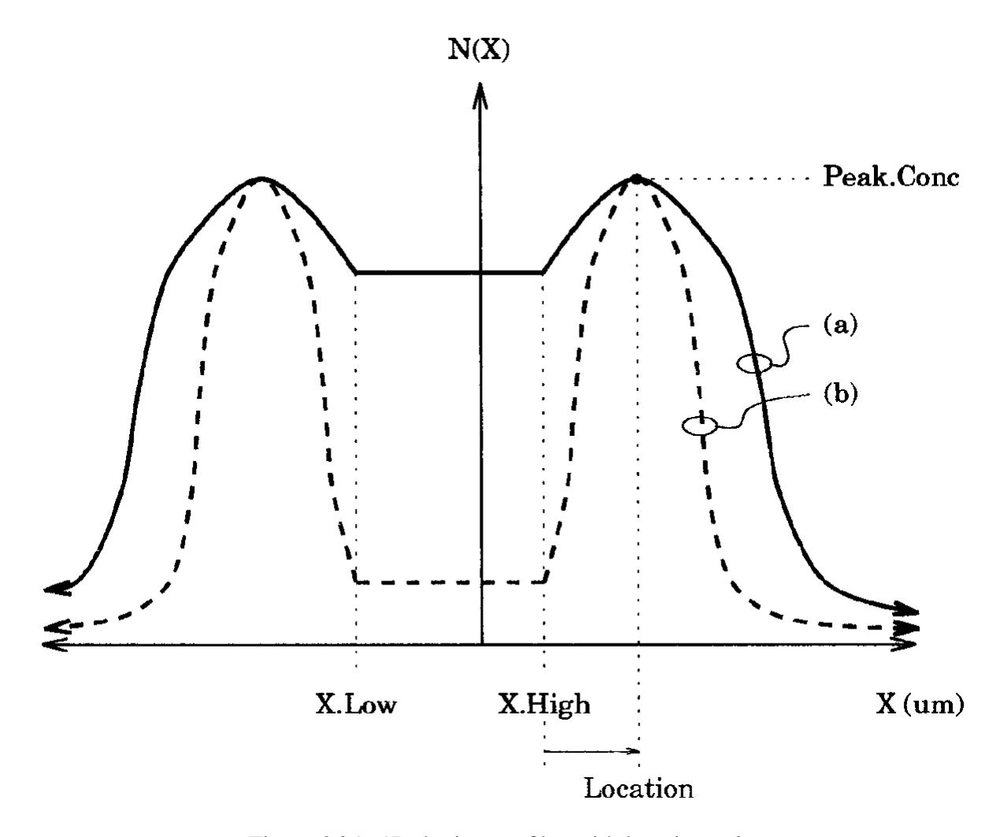

<span id="page-649-0"></span>Figure 26.1: 1D doping profiles with location > 0.

Unless otherwise specified, the added impurities are assumes to be N type. However, the name of a specific dopant species is needed when extracting concentration information for that impurity from a SUPREM3 exported file.

Several parameters are used to adjust the basic shape of a profile functions so that the final, constructed profile, matches the doping profile in the real device. The constant box region should coincide with a region of constant concentration in the device. For uniform profiles its boundaries default to the mesh boundaries. For the other profiles the constant box starts as a point and only acquires width or height if both the appropriate edges are specified. The location of the peak of the primary profile can be moved away from the edge of the constant box. A positive location places the peak outside the constant box (cf. Fig. [26.1\)](#page-649-0), and a negative value puts it inside the constant box (cf. Fig. [26.2\)](#page-650-0). The concentration in the constant box is then equal to the value of the profile when it intersects the edge of the constant box. The argument of the profile function is a distance expressed in terms of the characteristic length (by default equal to 1µ*m*). The longer this length, the more gradually the profile will change. For example, in Fig. [26.1](#page-649-0) and Fig. [26.2,](#page-650-0) the profiles marked (a) have characteristic lengths twice those of the profiles marked (b). The location and characteristic length for the lateral profile are multiplied by the lateral ratio. This allows the use of different length scales for the primary and lateral profiles. For rotated profiles, this scaling is taken into account, and the profile contours are elliptical rather than circular.

26.6. DOPING 651

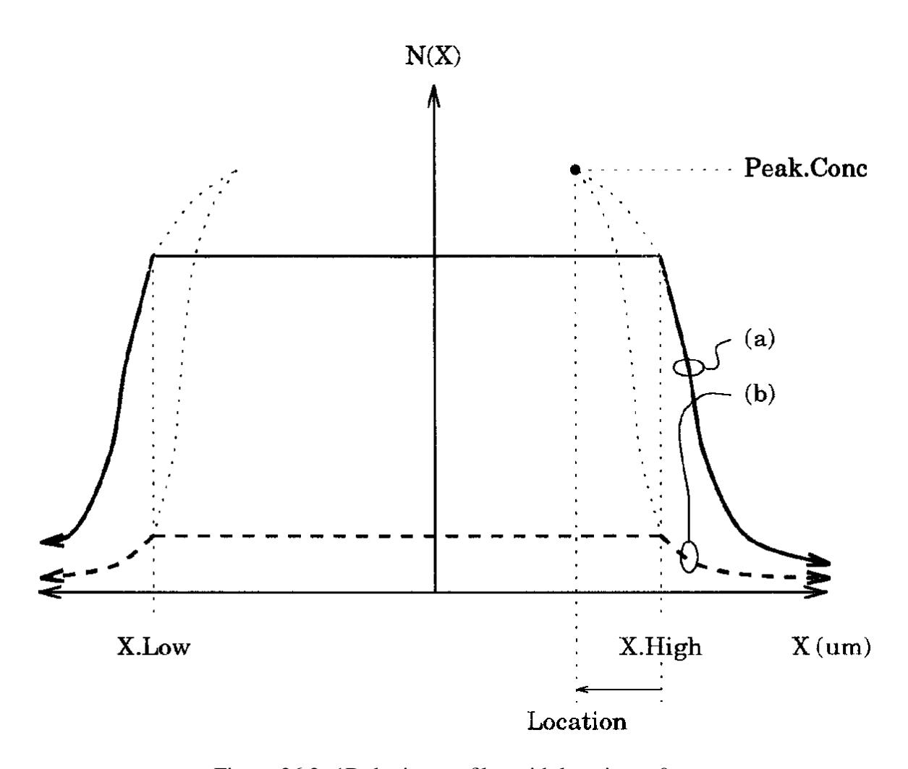

<span id="page-650-0"></span>Figure 26.2: 1D doping profiles with location < 0.

## <span id="page-651-0"></span>26.6.2 PARAMETERS

| Name               | Type     | Description                                        |
|--------------------|----------|----------------------------------------------------|
| Domains            | Int List | List of domains to dope                            |
| Uniform :          | Flag     | Primary profile type                               |
| Linear :           |          |                                                    |
| Erfc :             |          |                                                    |
| Exponential :      |          |                                                    |
| Suprem3 :          |          |                                                    |
| Ascii :            |          |                                                    |
| Ascii Suprem3      |          |                                                    |
| InFile             | String   | Name of Suprem3, Ascii or Ascii Suprem3 input file |
| Lat.Rotate :       | Flag     | Lateral profile type                               |
| Lat.Unif :         |          |                                                    |
| Lat.Lin :          |          |                                                    |
| Lat.Gauss :        |          |                                                    |
| Lat.Erfc :         |          |                                                    |
| Lat.Exp            |          |                                                    |
| X.Axis:Y.Axis      | Flag     | Primary profile direction                          |
| N.Type : P.Type :  | Flag     | Impurity type                                      |
| Donor : Acceptor : |          |                                                    |
| Phosphorus :       |          |                                                    |
| Arsenic :          |          |                                                    |
| Antimony :         |          |                                                    |
| Boron              |          |                                                    |
| X.Low              | Real     | Lowest X location of constant box, (µm)            |
| X.High             | Real     | Highest X location of constant box, (µm)           |
| Y.Low              | Real     | Lowest Y location of constant box, (µm)            |
| Y.High             | Real     | Highest Y location of constant box, (µm)           |
| Conic   Peak.conic | Real     | Dopant concentration, (cm−3<br>)                   |
| Location   Range   | Real     | Location of profile edge/peak, (µm)                |
| Char.Length        | Real     | Characteristic length of profile, (µm)             |
| Ratio.Lat          | Real     | Ratio of lateral to primary distances              |

## <span id="page-651-1"></span>26.6.3 EXAMPLES

This first example adds a uniform background P-type doping of 1.0 × 1016*cm*−<sup>3</sup> to an entire device:

```
doping uniform p.type conc=l.0el6
```

A Gaussian implantation with rotated lateral falloff, such as might be used for a MOSFET source, is then added:

```
doping gauss lat.rotate n.type conc=l.0el9
+ x.l=0.0 x.h=0.5 y.l=0.0 y.h=0.2 ratio=0.7
```

26.7. ELECTRODE 653

Alternatively, an error-function falloff could be used:

```
doping gauss lat.erfc conc=l.0el9
+ x.l=0.0 x.h=0.5 y.l=0.0 y.h=0.2 ratio=0.7
```

Finally, the MOSFET channel implant is extracted from an ASCII-format SUPREM3 file. The lateral profile is uniform, so that the implant is confined between *X* = 1µ*m* and *X* = 3µ*m*. The profile begins at *Y* = 0µ*m* (the high Y value defaults equal to the low Y value):

```
doping ascii suprem3 infile=implant.s3 lat.unif boron
+ x.l=1.0 x.h=3.0 y.l=0.0
```

## <span id="page-652-0"></span>26.6.4 SEE ALSO

domain, mobility, contact, boundary

# <span id="page-652-1"></span>26.7 ELECTRODE

Set location of a contact to the device SYNOPSIS

electrode [number] [position]

## <span id="page-652-2"></span>26.7.1 DESCRIPTION

Each device has several electrodes that are used to connect the device to the rest of the circuit. The number of electrodes depends on the type of device. For example, a MOSFET needs 4 electrodes. A particular electrode can be identified by its position in the list of circuit nodes on the device element line. For example, the drain node of a MOSFET is electrode number 1, while the bulk node is electrode number 4. Electrodes for which an ID number has not been specified are assigned values sequentially in the order they appear in the input file.

For lD devices, the positions of two of the electrodes are predefined to be at the ends of the simulation mesh. The first electrode is at the low end of the mesh, and the last electrode is at the high end. The position of the special lD BJT base contact is set on the options card. Thus, electrode cards are used exclusively for 2D devices.

Each card associates a portion of the simulation mesh with a particular electrode. In contrast to domains, which are specified only in terms of boxes, electrodes can also be specified in terms of line segments. Boxes and segments for the same electrode do not have to overlap. If they don't, it is assumed that the electrode is wired together outside the area covered by the simulation mesh. However, pieces of different electrodes must not overlap, since this would represent a short circuit. Each electrode box or segment can be specified in terms of the locations or mesh-indices of its boundaries. A missing value defaults to the corresponding mesh boundary.

## <span id="page-653-0"></span>26.7.2 PARAMETERS

| Name      | Type    | Description                           |
|-----------|---------|---------------------------------------|
| Number    | Integer | ID number of this domain              |
| X.Low     | Real    | Lowest X location of electrode, (µm)  |
| : IX.Low  | Integer | Lowest X mesh-index of electrode      |
| X.High    | Real    | Highest X location of electrode, (µm) |
| : IX.High | Integer | Highest X mesh-index of electrode     |
| Y.Low     | Real    | Lowest Y location of electrode, (µm)  |
| : IY.Low  | Integer | Lowest Y mesh-index of electrode      |
| Y.High    | Real    | Highest Y location of electrode, (µm) |
| : IY.High | Integer | Highest Y mesh-index of electrode     |

## <span id="page-653-1"></span>26.7.3 EXAMPLES

The following shows how the four contacts of a MOSFET might be specified:

```
* DRAIN
electrode x.l=0.0 x.h=0.5 y.l=0.0 y.h=0.0
* GATE
electrode x.l=1.0 x.h=3.0 iy.l=0 iy.h=0
* SOURCE
electrode x.l=3.0 x.h=4.0 y.l=0.0 y.h=0.0
* BULK
electrode x.l=0.0 x.h=4.0 y.l=2.0 y.h=2.0
```

The numbering option can be used when specifying bipolar transistors with dual base contacts:

```
* EMITTER
electrode num=3 x.l=1.0 x.h=2.0 y.l=0.0 y.h=0.0
* BASE
electrode num=2 x.l=0.0 x.h=0.5 y.l=0.0 y.h=0.0
electrode num=2 x.l=2.5 x.h=3.0 y.l=0.0 y.h=0.0
* COLLECTOR
electrode num=1 x.l=0.0 x.h=3.0 y.l=1.0 y.h=1.0
```

## <span id="page-653-2"></span>26.7.4 SEE ALSO

domain, contact

# <span id="page-653-3"></span>26.8 END

Terminate processing of a device definition

26.9. MATERIAL 655

SYNOPSIS

end

## <span id="page-654-0"></span>26.8.1 DESCRIPTION

The end card stops processing of a device definition. It may appear anywhere within a definition. Subsequent continuation lines of the definition will be ignored. If no end card is supplied, all the cards will be processed.

# <span id="page-654-1"></span>26.9 MATERIAL

Specify physical properties of a material

SYNOPSIS

material number type [physical-constants]

## <span id="page-654-2"></span>26.9.1 DESCRIPTION

The material card is used to create an entry in the list of materials used in a device. Each entry needs a unique identification number and the type of the material. Default values are assigned to the physical properties of the material. Most material parameters are accessible either here or on the mobility or contact cards. However, some parameters remain inaccessible (e.g. the ionization coefficient parameters). Parameters for most physical effect models are collected here. Mobility parameters are handled separately by the mobility card. Properties of electrode materials are set using the contact card.

#### <span id="page-655-0"></span>26.9.2 PARAMETERS

| Name                   | Type    | Description                                                            |
|------------------------|---------|------------------------------------------------------------------------|
| Number                 | Integer | ID number of this material                                             |
| Semiconductor: Silicon | Flag    | Type of this material                                                  |
| : Polysilicon : GaAs   |         |                                                                        |
| : Insulator : Oxide    |         |                                                                        |
| : Nitride              |         |                                                                        |
| Affinity               | Real    | Electron affinity (eV)                                                 |
| Permittivity           | Real    | Dielectric permittivity $(F/cm)$                                       |
| Nc                     | Real    | Conduction band density $(cm^{-3})$                                    |
| Nv                     | Real    | Valence band density $(cm^{-3})$                                       |
| Eg                     | Real    | Energy band gap (eV)                                                   |
| dEg.dT                 | Real    | Bandgap narrowing with temperature $(eV/^{\circ}K)$                    |
| Eg.Tref                | Real    | Bandgap reference temperature, ( °K )                                  |
| dEg.dN                 | Real    | Bandgap narrowing with N doping, $(eV/cm^{-3})$                        |
| Eg.Nref                | Real    | Bandgap reference concentration - N type, $(cm^{-3})$                  |
| dEg.dP                 | Real    | Bandgap narrowing with P doping, $(eV/cm^{-3})$                        |
| Eg.Pref                | Real    | Bandgap reference concentration - P type, $(cm^{-3})$                  |
| TN                     | Real    | SRH lifetime - electrons, (sec)                                        |
| SRH.Nref               | Real    | SRH reference concentration - electrons $(cm^{-3})$                    |
| TP                     | Real    | SRH lifetime - holes, (sec)                                            |
| SRH.Pref               | Real    | SRH reference concentration - holes $(cm^{-3})$                        |
| CN                     | Real    | Auger coefficient - electrons (cm <sup>6</sup> /sec)                   |
| СР                     | Real    | Auger coefficient - holes (cm <sup>6</sup> /sec)                       |
| ARichN                 | Real    | Richardson constant - electrons, $\left(\frac{A}{c_{\kappa}^2}\right)$ |
| ARichP                 | Real    | Richardson constant - holes, $(A/\frac{cm^2}{\circ \kappa^2})$         |

#### <span id="page-655-1"></span>**26.9.3 EXAMPLES**

Set the type of material #1 to silicon, then adjust the values of the temperature-dependent bandgap model parameters:

material num=1 silicon eg=1.12 deg.dt=4.7e-4 eg.tref=640.0

The recombination lifetimes can be set to extremely short values to simulate imperfect semiconductor material:

material num=2 silicon tn=1ps tp=1ps

#### <span id="page-655-2"></span>**26.9.4 SEE ALSO**

domain, mobility, contact, boundary

26.10. METHOD 657

# <span id="page-656-0"></span>26.10 METHOD

Choose types and parameters of numerical methods SYNOPSIS

method [types] [parameters]

## <span id="page-656-1"></span>26.10.1 DESCRIPTION

The method card controls which numerical methods are used during a simulation and the parameters of these methods. Most of these methods are optimizations that reduce run time, but may sacrifice accuracy or reliable convergence.

For majority-carrier devices such as MOSFETs, one carrier simulations can be used to save simulation time. The systems of equations in AC analysis may be solved using either direct or successive-over-relaxation techniques. Successive-over-relaxation is faster, but at high frequencies, it may fail to converge or may converge to the wrong answer. In some cases, it is desirable to obtain AC parameters as functions of DC bias conditions. If necessary, a one-point AC analysis is performed at a predefined frequency in order to obtain these small-signal parameters. The default for this frequency is 1 Hz. The Jacobian matrix for DC and transient analyses can be simplified by ignoring the derivatives of the mobility with respect to the solution variables. However, the resulting analysis may have convergence problems. Additionally, if they are ignored during AC analyses, incorrect results may be obtained.

A damped Newton method is used as the primary solution technique for the device-level partial differential equations. This algorithm is based on an iterative loop that terminates when the error in the solution is small enough or the iteration limit is reached. Error tolerances are used when determining if the error is 'small enough'. The tolerances are expressed in terms of an absolute, solution-independent error and a relative, solution-dependent error. The absolute-error limit can be set on this card. The relative error is computed by multiplying the size of the solution by the circuit level SPICE parameter RELTOL.

<span id="page-656-2"></span>

| 26.10.2 | Parameters |
|---------|------------|
|         |            |

| Name        | Type    | Description                                 |
|-------------|---------|---------------------------------------------|
| OneCarrier  | Flag    | Solve for majority carriers only            |
| AC analysis | String  | AC analysis method, ( either DIRECT or SOR) |
| NoMobDeriv  | Flag    | Ignore mobility derivatives                 |
| Frequency   | Real    | AC analysis frequency, ( Hz )               |
| ItLim       | Integer | Newton iteration limit                      |
| DevTol      | Real    | Maximum residual error in device equations  |

## <span id="page-656-3"></span>26.10.3 Examples

Use one carrier simulation for a MOSFET, and choose direct method AC analysis to ensure accurate, high frequency results:

method onec ac.an=direct

Tolerate no more than 10−<sup>10</sup> as the absolute error in device-level equations, and perform no more than 15 Newton iterations in any one loop:

method devtol=1e-10 itlim=15

# <span id="page-657-0"></span>26.11 Mobility

Specify types and parameters of mobility models SYNOPSIS

mobility material [carrier] [parameters] [models] [initialize]

## <span id="page-657-1"></span>26.11.1 Description

The mobility model is one of the most complicated models of a material's physical properties. As a result, separate cards are needed to set up this model for a given material.

Mobile carriers in a device are divided into a number of different classes, each of which has different mobility modeling. There are three levels of division. First, electrons and holes are obviously handled separately. Second, carriers in surface inversion or accumulation layers are treated differently than carriers in the bulk. Finally, bulk carriers can be either majority or minority carriers.

For surface carriers, the normal-field mobility degradation model has three user-modifiable parameters. For bulk carriers, the ionized impurity scattering model has four controllable parameters. Different sets of parameters are maintained for each of the four bulk carrier types: majority-electron, minority-electron, majority-hole and minority-hole. Velocity saturation modeling can be applied to both surface and bulk carriers. However, only two sets of parameters are maintained: one for electrons and one for holes. These must be changed on a majority carrier card (i.e. when the majority flag is set).

Several models for the physical effects are available, along with appropriate default values. Initially, a universal set of default parameters usable with all models is provided. These can be overridden by defaults specific to a particular model by setting the initialization flag. These can then be changed directly on the card itself. The bulk ionized impurity models are the Caughey-Thomas (CT) model and the Scharfetter-Gummel (SG) model [CAUG671, [SCHA69]. Three alternative sets of defaults are available for the Caughey-Thomas expression. They are the Arora (AR) parameters for Si [AROR82], the University of Florida (UF) parameters for minority carriers in Si [SOLL90], and a set of parameters appropriate for GaAs (GA). The velocitysaturation models are the Caughey-Thomas (CT) and Scharfetter-Gummel (SG) models for Si, and the PISCES model for GaAs (GA). There is also a set of Arora (AR) parameters for the Caughey-Thomas model.

26.11. MOBILITY 659

## <span id="page-658-0"></span>26.11.2 Parameters

| Name                | Type    | Description                                                |
|---------------------|---------|------------------------------------------------------------|
| Material            | Integer | ID number of material                                      |
| Electron : Hole     | Flag    | Mobile carrier                                             |
| Majority : Minority | Flag    | Mobile carrier type                                        |
| MUS                 | Real    | Maximum surface mobility, ( cm2/Vs )                       |
| EC.A                | Real    | Surface mobility 1st-order critical field, ( V/cm )        |
| EC.B                | Real    | Real Surface mobility 2nd-order critical field, ( V2/cm2 ) |
| MuMax               | Real    | Maximum bulk mobility, ( cm2/Vs )                          |
| MuMin               | Real    | Minimum bulk mobility, ( cm2/Vs)                           |
| NtRef               | Real    | Ionized impurity reference concentration, ( cm-3 )         |
| NtExp               | Real    | Ionized impurity exponent                                  |
| Vsat                | Real    | Saturation velocity, ( cm/s )                              |
| Vwarm               | Real    | Warm carrier reference velocity, ( cm/s )                  |
| ConcModel           | String  | Ionized impurity model, ( CT, AR, UF, SG, Dr GA )          |
| FieldModel          | String  | Velocity saturation model, ( CT, AR, SG, or GA )           |
| Init                | Flag    | Copy model-specific defaults                               |

## <span id="page-658-1"></span>26.11.3 Examples

The following set of cards completely updates the bulk mobility parameters for material #1:

```
mobility mat=l concmod=sg fieldmod=sg
mobility mat=l elec major mumax=1000.0 mumin=l00.0
+ ntref=l.0el6 ntexp=0.8 vsat=l.0e7 vwarm=3.0e6
mobility mat=l elec minor mumax=1000.0 mumin=200.O
+ ntref=l.0el7 ntexp=0.9
mobility mat=l hole major mumax=500.0 mumin=50.0
+ ntref=l.0el6 ntexp=0.7 vsat=8.0e6 vwarm=l.0e6
mobility mat=l hole minor mumax=500.0 mumin=150.0
+ ntref=l.0el7 ntexp=0.8
```

The electron surface mobility is changed by the following:

```
mobility mat=l elec mus=800.0 ec.a=3.0e5 ec.b=9.0e5
```

Finally, the default Scharfetter-Gummel parameters can be used in Si with the GaAs velocitysaturation model (even though it doesn't make physical sense!):

```
mobility mat=l init elec major fieldmodel=sg
mobility mat=l init hole major fieldmodel=sg
mobility mat=l fieldmodel=ga
```

## <span id="page-658-2"></span>26.11.4 SEE ALSO

material

## <span id="page-659-0"></span>26.11.5 BUGS

The surface mobility model does not include temperature-dependence for the transverse-field parameters. Those parameters will need to be adjusted by hand.

# <span id="page-659-1"></span>26.12 MODELS

Specify which physical models should be simulated SYNOPSIS

models [model flags]

## <span id="page-659-2"></span>26.12.1 DESCRIPTION

The models card indicates which physical effects should be modeled during a simulation. Initially, none of the effects are included. A flag can be set false by preceding by a caret.

## <span id="page-659-3"></span>26.12.2 Parameters

| Name      | Type | Description                                 |
|-----------|------|---------------------------------------------|
| BGN       | Flag | Bandgap narrowing                           |
| SRH       | Flag | Shockley-Reed-Hall recombination            |
| ConcTau   | Flag | Concentration-dependent SRH lifetimes       |
| Auger     | Flag | Auger recombination                         |
| Avalanche | Flag | Local avalanche generation                  |
| TempMob   | Flag | Temperature-dependent mobility              |
| ConcMob   | Flag | Concentration-dependent mobility            |
| FieldMob  | Flag | Lateral-field-dependent mobility            |
| TransMob  | Flag | Transverse-field-dependent surface mobility |
| SurfMob   | Flag | Activate surface mobility model             |

## <span id="page-659-4"></span>26.12.3 Examples

Turn on bandgap narrowing, and all of the generation-recombination effects:

models bgn srh conctau auger aval

Amend the first card by turning on lateral- and transverse-field-dependent mobility in surface charge layers, and lateral-field-dependent mobility in the bulk. Also, this line turns avalanche generation modeling off.

models surfmob transmob fieldmob ^aval

26.13. OPTIONS 661

## <span id="page-660-0"></span>26.12.4 See also

material, mobility

## <span id="page-660-1"></span>26.12.5 Bugs

The local avalanche generation model for 2D devices does not compute the necessary contributions to the device-level Jacobian matrix. If this model is used, it may cause convergence difficulties and it will cause AC analyses to produce incorrect results.

# <span id="page-660-2"></span>26.13 OPTIONS

Provide optional device-specific information

SYNOPSIS

options [device-type] [initial-state] [dimensions] [measurement-temperature]

## <span id="page-660-3"></span>26.13.1 DESCRIPTION

The options card functions as a catch-all for various information related to the circuit-device interface. The type of a device can be specified here, but will be defaulted if none is given. Device type is used primarily to determine how to limit the changes in voltage between the terminals of a device. It also helps determine what kind of boundary conditions are used as defaults for the device electrodes.

A previously calculated state, stored in the named initial-conditions file, can be loaded at the beginning of an analysis. If it is necessary for each instance of a numerical model to start in a different state, then the unique flag can be used to generate unique filenames for each instance by appending the instance name to the given filename. This is the same method used by CIDER to generate unique filenames when the states are originally saved. If a particular state file does not fit. this pattern, the filename can be entered directly on the instance line.

Mask dimension defaults can be set so that device sizes can be specified in terms of area or width. Dimensions for the special lD BJT base contact can also be controlled. The measurement temperature of material parameters, normally taken to be the circuit default, can be overridden.

<span id="page-661-0"></span>

| 26.13.2 | Parameters |
|---------|------------|
|         |            |

| Name          | Type   | Description                               |
|---------------|--------|-------------------------------------------|
| Resistor      | Flag   | Resistor                                  |
| : Capacitor   | Flag   | Capacitor                                 |
| : Diode       | Flag   | Diode                                     |
| : Bipolar BJT | Flag   | Bipolar transistor                        |
| : MOSFET      | Flag   | MOS field-effect transistor               |
| : JFET        | Flag   | Junction field-effect transistor          |
| : MESFET      | Flag   | MES field-effect transistor               |
| IC.File       | String | Initial-conditions filename               |
| Unique        | Flag   | Append instance name to filename          |
| DefA          | Real   | Default Mask Area, (m²)                   |
| DefW          | Real   | Default Mask Width, (m)                   |
| DefL          | Real   | Default Mask Length, (m)                  |
| Base.Area     | Real   | lD BJT base area relative to emitter area |
| Base.Length   | Real   | Real lD BJT base contact length, (µm)     |
| Base.Depth    | Real   | lD BJT base contact depth, (µm)           |
| TNom          | Real   | Nominal measurement temperature, (°C)     |

## <span id="page-661-1"></span>26.13.3 Examples

Normally, a 'numos' device model is used for MOSFET devices. However, it can be changed into a bipolar-with-substrate-contact model, by specifying a bipolar structure using the other cards, and indicating the device-structure type as shown here. The default length is set to 1.0 µm so that when mask area is specified on the element line it can be divided by this default to obtain the device width.

```
options bipolar defl=1.0
```

Specify that a 1D BJT has base area 1/10th that of the emitter, has an effective depth of 0.2 µm and a length between the internal and external base contacts

```
options base.area=0.1 base.depth=0.2 base.len=1.5
```

If a circuit contains two instances of a bipolar transistor model named 'q1' and 'q2', the following line tells the simulator to look for initial conditions in the 'OP1.q2', respectively. The period in the middle of the names is added automatically:

options unique ic.file="OP1"

## <span id="page-661-2"></span>26.13.4 See also

numd, nbjt, numos

26.14. OUTPUT 663

# <span id="page-662-0"></span>26.14 OUTPUT

Identify information to be printed or saved

SYNOPSIS

output [debugging-flags] [general-info] [saved-solutions]

## <span id="page-662-1"></span>26.14.1 DESCRIPTION

The output card is used to control the amount of information that is either presented to or saved for the user. Three types of information are available. Debugging information is available as a means to monitor program execution. This is useful during long simulations when one is unsure about whether the program has become trapped at some stage of the simulation. General information about a device such as material parameters and resource usage can be obtained. Finally, information about the internal and external states of a device is available. Since this data is best interpreted using a post-processor, a facility is available for saving device solutions in auxiliary output files. Solution filenames are automatically generated by the simulator. If the named file already exists, the file will be overwritten. A filename unique to a particular circuit or run can be generated by providing a root filename. This root name will be added onto the beginning of the automatically generated name. This feature can be used to store solutions in a directory other than the current one by specifying the root filename as the path of the desired directory. Solutions are only saved for those devices that specify the 'save' parameter on their instance lines.

The various physical values that can be saved are named below. By default, the following values are saved: the doping, the electron and hole concentrations, the potential, the electric field, the electron and hole current densities, and the displacement current density. Values can be added to or deleted from this list by turning the appropriate flag on or off. For vector-valued quantities in two dimensions, both the X and Y components are saved. The vector magnitude can be obtained during post-processing.

Saved solutions can be used in conjunction with the options card and instance lines to reuse previously calculated solutions as initial guesses for new solutions. For example, it is typical to initialize the device to a known state prior to beginning any DC transfer curve or operating point analysis. This state is an ideal candidate to be saved for later use when it is known that many analyses will be performed on a particular device structure.

Depending on the global variable filetype the outputs may be stored as (compact) binary or text processor readable ascii formatted data.

## <span id="page-663-0"></span>26.14.2 Parameters

| Name                   | Type   | Description                              |
|------------------------|--------|------------------------------------------|
| All.Debug              | Flag   | Debug all analyses                       |
| OP.Debug               | Flag   | .OP analyses                             |
| DC.Debug               | Flag   | .DC analyses                             |
| TRAN.Debug             | Flag   | .TRAN analyses                           |
| AC.Debug               | Flag   | .AC analyses                             |
| PZ.Debug               | Flag   | .PZ analyses                             |
| Material               | Flag   | Physical material information            |
| Statistics   Resources | Flag   | Resource usage information               |
| RootFile               | String | Root of output file names                |
| Psi                    | Flag   | Potential ( V )                          |
| Equ.Psi                | Flag   | Equilibrium potential ( V )              |
| Vac.Psi                | Flag   | Vacuum potential ( V )                   |
| Doping                 | Flag   | Net doping ( cm³ )                       |
| N.Conc                 | Flag   | Electron concentration ( cm³ )           |
| P.Conc                 | Flag   | Hole concentration ( cm³ )               |
| PhiN                   | Flag   | Electron quasi-fermi potential ( V )     |
| PhiP                   | Flag   | Hole quasi-fermi potential ( V )         |
| PhiC                   | Flag   | Conduction band potential ( V )          |
| PhiV                   | Flag   | Valence band potential ( V )             |
| E.Field                | Flag   | Electric field ( V/cm )                  |
| JC                     | Flag   | Conduction current density ( A/cm² )     |
| JD                     | Flag   | Displacement current density ( A/cm² )   |
| JN                     | Flag   | Electron current density ( A/cm² )       |
| JP                     | Flag   | Hole current density ( A/cm² )           |
| JT                     | Flag   | Total current density ( A/cm² )          |
| Unet                   | Flag   | Net recombination ( 1/cm³ s )            |
| MuN                    | Flag   | Electron mobility (low-field) ( cm²/Vs ) |
| MuP                    | Flag   | Hole mobility (low-field) ( cm²/Vs )     |

## <span id="page-663-1"></span>26.14.3 Examples

The following example activates all potentially valuable diagnostic output:

```
output all.debug mater stat
```

Energy band diagrams generally contain the potential, the quasi-fermi levels, the energies and the vacuum energy. The following example enables saving of the r values needed to make energy band diagrams:

```
output phin phjp phic phiv vac.psi
```

Sometimes it is desirable to save certain key solutions, and then reload them for use in subsequent simulations. In such cases only the essential values ( Ψ, n, and p ) need to be saved. This example turns off the nonessential default values (and indicates the essential ones explicitly):

26.15. TITLE 665

output psi n.conc p.conc ^e.f ^jn ^jp ^jd

## <span id="page-664-0"></span>26.14.4 SEE ALSO

options, numd, nbjt, numos

# <span id="page-664-1"></span>26.15 TITLE

Provide a label for this device's output SYNOPSIS

title [text]

## <span id="page-664-2"></span>26.15.1 DESCRIPTION

The title card provides a label for use as a heading in various output files. The text can be any length, but titles that fit on a single line will produce more aesthetically pleasing output.

## <span id="page-664-3"></span>26.15.2 EXAMPLES

Set the title for a minimum gate length NMOSFET in a 1.0µm BiCMOS process

title L=1.0um NMOS Device, 1.0um BiCMOS Process

## <span id="page-664-4"></span>26.15.3 BUGS

The title is currently treated like a comment.

# <span id="page-664-5"></span>26.16 X.MESH, Y.MESH

Define locations of lines and nodes in a mesh

SYNOPSIS

```
x.mesh position numbering-method [spacing-parameters]
y.mesh position numbering-method [spacing-parameters]
```

## <span id="page-665-0"></span>26.16.1 DESCRIPTION

The domains of a device are discretized onto a rectangular finite-difference mesh using x.mesh cards for 1D devices, or x.mesh and y.mesh cards for 2D devices. Both uniform and nonuniform meshes can be specified.

A typical mesh for a 2D device is shown in Fig. [26.3.](#page-665-1)

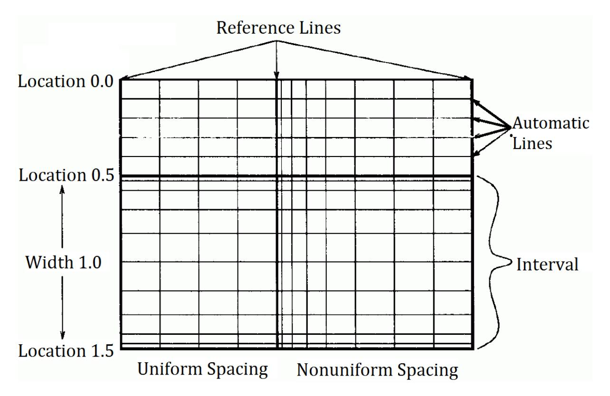

<span id="page-665-1"></span>Figure 26.3: Typical mesh for 2D devices

The mesh is divided into intervals by the *reference* lines. The other lines in each interval are automatically generated by CIDER using the mesh spacing parameters. In general, each new mesh card adds one reference line and multiple automatic lines to the mesh. Conceptually, a 1D mesh is similar to a 2D mesh except that there are no reference or automatic lines needed in the second dimension.

The location of a reference line in the mesh must either be given explicitly (using *Location*) or defined implicitly relative to the location of the previous reference line (by using *Width*). (If the first card in either direction is specified using *Width*, an initial reference line is automatically generated at location 0.0.) The line number of the reference line can be given explicitly, in which case the automatic lines are evenly spaced within the interval, and the number of lines is determined from the difference between the current line number and that of the previous reference line. However, if the interval width is given, then the line number is interpreted directly as the number of additional lines to add to the mesh.

For a nonuniformly spaced interval, the number of automatic lines has to be determined using the mesh spacing parameters. Nonuniform spacing is triggered by providing a desired ratio for the lengths of the spaces between adjacent pairs of lines. This ratio should always be greater than one, indicating the ratio of larger spaces to smaller spaces. In addition to the ratio, one or both of the space widths at the ends of the interval must be provided. If only one is given, it will be the smallest space and the largest space will be at the opposite end of the interval. If both are given, the largest space will be in the middle of the interval. In certain cases it is desirable to limit the growth of space widths in order to control the solution accuracy. This can be accomplished by specifying a maximum space size, but this option is only available when one of the two end lengths is given. Note that once the number of new lines is determined using the desired ratio, the actual spacing ratio may be adjusted so that the spaces exactly fill the interval.

## <span id="page-666-0"></span>26.16.2 Parameters

| Name          | Type    | Description                                        |
|---------------|---------|----------------------------------------------------|
| Location      | Real    | Location of this mesh line, ( µm )                 |
| :Width        | Real    | Width between this and previous mesh lines, ( µm ) |
| Number   Node | Integer | Number of this mesh line                           |
| :Ratio        | Real    | Ratio of sizes of adjacent spaces                  |
| H.Start   H1  | Real    | Space size at start of interval, ( µm )            |
| H.End   H2    | Real    | Space size at end of interval, ( µm )              |
| H.Max   H3    | Real    | Maximum space size inside interval, ( µm )         |

## <span id="page-666-1"></span>26.16.3 EXAMPLES

A 50 node, uniform mesh for a 5 µm long semiconductor resistor can be specified as:

```
x.mesh loc=0.0 n=1
x.mesh loc=5.0 n=50
```

An accurate mesh for a 1D diode needs fine spacing near the junction. In this example, the junction is assumed to be 0.75 µm deep. The spacing near the diode ends is limited to a maximum of 0.1 µm:

```
x.mesh w=0.75 h.e=0.001 h.m=0.l ratio=1.5
x.mesh w=2.25 h.s=0.001 h.m=0.l ratio=1.5
```

The vertical mesh spacing of a MOSFET can generally be specified as uniform through the gate oxide, very fine for the surface inversion layer, moderate down to the so source/drain junction depth, and then increasing all the way to the bulk contact:

```
y.mesh loc=-0.04 node=1
y.mesh loc=0.0 node=6
y.mesh width=0.5 h.start=0.001 h.max=.05 ratio=2.0
y.mesh width=2.5 h.start=0.05 ratio=2.0
```

## <span id="page-666-2"></span>26.16.4 SEE ALSO

domain

# <span id="page-667-0"></span>26.17 NUMD

Diode / two-terminal numerical models and elements

SYNOPSIS Model:

```
.MODEL model-name NUMD [level]
+ ...
```

SYNOPSIS Element:

```
DXXXXXXX nl n2 model-name [geometry] [temperature] [initial-conditions]
```

SYNOPSIS Output:

```
.SAVE [small-signal values]
```

## <span id="page-667-1"></span>26.17.1 DESCRIPTION

NUMD is the name for a diode numerical model. In addition, this same model can be used to simulate other two-terminal structures such as semiconductor resistors and MOS capacitors. See the options card for more information on how to customize the device type.

Both 1D and 2D devices are supported. These correspond to the LEVEL=l and LEVEL=2 models, respectively. If left unspecified, it is assumed that the device is one-dimensional.

All numerical two-terminal element names begin with the letter 'D. The element name is then followed by the names of the positive (n1) and negative (n2) nodes. After this must come the name of the model used for the element. The remaining information can come in any order. The layout dimensions of an element are specified relative to the geometry of a default device. For 1D devices, the default device has an area of 1m², and for 2D devices, the default device has a width of 1 m. However, these defaults can be overridden on an options card. The operating temperature of a device can be set independently from that of the rest of the circuit in order to simulate non-isothermal circuit operation. Finally, the name of a file containing an initial state for the device can be specified. Remember that if the filename contains capital letters, they must be protected by surrounding the filename with double quotes. Alternatively, the device can be placed in an OFF state (thermal equilibrium) at the beginning of the analysis. For more information on the use of initial conditions, see the ngspice User's Manual, Chapt. [7.2.](#page-131-0)

In addition to the element input parameters, there are output-only parameters that can be shown using the ngspice show command [\(13.5.80\)](#page-434-0) or captured using the save/.SAVE ([13.5.69](#page-428-0)/[11.6.1](#page-346-2)) command. These parameters are the elements of the indefinite conductance (G), capacitance (C), and admittance (Y) matrices where *Y* = *G* + *j*ω*C*. By default, the parameters are computed at 1 Hz. Each element is accessed using the name of the matrix (g, c or y) followed by the node indices of the output terminal and the input terminal (e.g. g11). Beware that names are case-sensitive for save/show, so lower-case letters must be used.

26.17. NUMD 669

## <span id="page-668-0"></span>26.17.2 Parameters

| Name    | Type    | Description                           |
|---------|---------|---------------------------------------|
| Level   | Integer | Dimensionality of numerical model     |
| Area    | Real    | Multiplicative area factor            |
| W       | Real    | Multiplicative width factor           |
| Temp    | Real    | Element operating temperature         |
| IC.File | String  | Initial-conditions filename           |
| Off     | Flag    | Device initially in OFF state         |
| gIJ     | Flag    | Conductance element<br>Gi j, (<br>Ω ) |
| cIJ     | Flag    | Capacitance element<br>Ci j, ( F )    |
| yIJ     | Flag    | Yi j, (<br>Admittance element<br>Ω )  |

## <span id="page-668-1"></span>26.17.3 EXAMPLES

A one-dimensional numerical switching-diode element/model pair with an area twice that of the default device (which has a size of l µm x 1 µm) can be specified using:

```
DSWITCH 1 2 M_SWITCH_DIODE AREA=2
.MODEL M_SWITCH_DIODE NUMD
+ options defa=1p ...
+ ...
```

A two-dimensional two-terminal MOS capacitor with a width of 20 µm and an initial condition of 3 V is created by:

```
DMOSCAP 11 12 M_MOSCAP W=20um IC=3v
.MODEL M_MOSCAP NUMD LEVEL=2
+ options moscap defw=1m
+ ...
```

The next example shows how both the width and area factors can be used to create a power diode with area twice that of a 6µm-wide device (i.e. a 12µm-wide device). The device is assumed to be operating at a temperature of 100°C:

```
D1 POSN NEGN POWERMOD AREA=2 W=6um TEMP=100.0
.MODEL POWERMOD NUMD LEVEL=2
+ ...
```

This example saves all the small-signal parameters of the previous diode:

```
.SAVE @d1[g11] @d1[g12] @d1[g21] @d1[g22]
.SAVE @d1[c11] @d1[c12] @d1[c21] @d1[c22]
.SAVE @d1[y11] @d1[y12] @d1[y21] @d1[y22]
```

## <span id="page-669-0"></span>26.17.4 SEE ALSO

options, output

## <span id="page-669-1"></span>26.17.5 BUGS

Convergence problems may be experienced when simulating MOS capacitors due to singularities in the current-continuity equations.

# <span id="page-669-2"></span>26.18 NBJT

Bipolar / three-terminal numerical models and elements SYNOPSIS Model:

```
.MODEL model-name NBJT [level]
+ ...
```

SYNOPSIS Element:

```
QXXXXXXX nl n2 n3 model-name [geometry]
+ [temperature] [initial-conditions]
```

SYNOPSIS Output:

```
.SAVE [small-signal values]
```

## <span id="page-669-3"></span>26.18.1 DESCRIPTION

NBJT is the name for a bipolar transistor numerical model. In addition, the 2D model can be used to simulate other three-terminal structures such as a JFET or MESFET. However, the 1D model is customized with a special base contact, and cannot be used for other purposes. See the options card for more information on how to customize the device type and setup the 1D base contact.

Both 1"and 2D devices are supported. These correspond to the LEVEL=l and models, respectively. If left unspecified, it is assumed that the device is one-dimensional.

All numerical three-terminal element names begin with the letter 'Q'. If the device is a bipolar transistor, then the nodes are specified in the order: collector (nl), base (n2), emitter (n3). For a JFET or MESFET, the node order is: drain (n1), gate (n2), source (n3). After this must come the name of the model used for the element. The remaining information can come in any order. The layout dimensions of an element are specified relative to the geometry of a default device. For the 1D BJT, the default device has an area of lm², and for 2D devices, the default device has a width of lm. In addition, it is assumed that the default 1D BJT has a base contact with area equal to the emitter area, length of 1µm and a depth automatically determined from the device doping profile. However, all these defaults can be overridden on an options card.

26.18. NBJT 671

The operating temperature of a device can be set independently from the rest of that of the circuit in order to simulate non-isothermal circuit operation. Finally, the name of a file containing an initial state for the device can be specified. Remember that if the filename contains capital letters, they must be protected by surrounding the filename with double quotes. Alternatively, the device can be placed in an OFF state (thermal equilibrium) at the beginning of the analysis. For more information on the use of initial conditions, see the ngspice User's Manual.

In addition to the element input parameters, there are output-only parameters that can be shown using the SPICE show command or captured using the save/.SAVE command. These parameters are the elements of the indefinite conductance (G), capacitance (C), and admittance (Y) matrices where *Y* = *G*+ *j*ω*C*. By default, the parameters are computed at 1Hz. Each element is accessed using the name of the matrix (g, c or y) followed by the node indices of the output terminal and the input terminal (e.g. g11). Beware that parameter names are case-sensitive for save/show, so lower-case letters must be used.

<span id="page-670-0"></span>

| 26.18.2 | Parameters |
|---------|------------|
|         |            |

| Name    | Type    | Description                           |
|---------|---------|---------------------------------------|
| Level   | Integer | Dimensionality of numerical model     |
| Area    | Real    | Multiplicative area factor            |
| W       | Real    | Multiplicative width factor           |
| Temp    | Real    | Element operating temperature         |
| IC.File | String  | Initial-conditions filename           |
| Off     | Flag    | Device initially in OFF state         |
| gIJ     | Flag    | Conductance element<br>Gi j, (<br>Ω ) |
| cIJ     | Flag    | Ci j, ( F )<br>Capacitance element    |
| yIJ     | Flag    | Yi j, (<br>Admittance element<br>Ω )  |

## <span id="page-670-1"></span>26.18.3 EXAMPLES

A one-dimensional numerical bipolar transistor with an emitter stripe 4 times as wide as the default device is created using:

#### Q2 1 2 3 M\_BJT AREA=4

This example saves the output conductance (go), transconductance (gm) and input conductance (gpi) of the previous transistor in that order:

```
.SAVE @q2[g11] @q2[g12] @q2[g22]
```

The second example is for a two-dimensional JFET with a width of 5pm and initial conditions obtained from file IC.jfet:

```
QJ1 11 12 13 M_JFET W=5um IC.FILE="IC.jfet"
.MODEL M_JFET NBJT LEVEL=2
+ options jfet
+ ...
```

A final example shows how to use symmetry to simulate half of a 2D BJT, avoiding having the user double the area of each instance:

```
Q2 NC2 NB2 NE2 BJTMOD AREA=1
Q3 NC3 NB3 NE3 BJTMOD AREA=1
.MODEL BJTMOD NBJT LEVEL=2
+ options defw=2um
+ * Define half of the device now
+ ...
```

## <span id="page-671-0"></span>26.18.4 SEE ALSO

options, output

## <span id="page-671-1"></span>26.18.5 BUGS

MESFETs cannot be simulated properly yet because Schottky contacts have not been implemented.

# <span id="page-671-2"></span>26.19 NUMOS

MOSFET / four-terminal numerical models and elements SYNOPSIS Model:

```
.MODEL model-name NUMOS [level]
+ ...
```

SYNOPSIS Element:

```
MXXXXXXX nl n2 n3 n4 model-name [geometry]
+ [temperature] [initial-conditions]
```

SYNOPSIS Output:

```
.SAVE [small-signal values]
```

## <span id="page-671-3"></span>26.19.1 DESCRIPTION

NUMOS is the name for a MOSFET numerical model. In addition, the 2D model can be used to simulate other four-terminal structures such as integrated bipolar and JFET devices with substrate contacts. However, silicon controlled rectifiers (SCRs) cannot be simulated because of the snapback in the transfer characteristic. See the options card for more information on how to customize the device type. The LEVEL parameter of two- and three-terminal devices is 26.19. NUMOS 673

not needed, because only 2D devices are supported. However, it will accepted and ignored if provided.

All numerical four-terminal element names begin with the letter 'M'. If the device is a MOSFET, or JFET with a bulk contact, then the nodes are specified in the order: drain (n1), gate (n2), source (n3), bulk (n4). If the device is a BJT, the node order is: collector (n1), base (n2), emitter (n3), substrate (n4). After this must come the name of the model 1used for the element. The remaining information can come in any order. The layout dimensions of an element are specified relative to the geometry of a default device. The default device has a width of lm. However, this default can be overridden on an options card. In addition, the element line will accept a length parameter, L, but does not use it in any calculations. This is provided to enable somewhat greater compatibility between numerical MOSFET models and the standard SPICE3 compact MOSFET models.

The operating temperature of a device can be set independently from that of the rest of the circuit in order to simulate non-isothermal circuit operation. Finally, the name of a file containing an initial state for the device can be specified. Remember that if the filename contains capital letters, they must be protected by surrounding the filename with double quotes. Alternatively, the device can be placed in an OFF state (thermal equilibrium) at the beginning of the analysis. For more information on the use of initial conditions, see the ngspice User's Manual.

In addition to the element input parameters, there are output-only parameters that can be shown using the SPICE show command or captured using the save/.SAVE command.

These parameters are the elements of the indefinite conductance (G), capacitance (C), and admittance (Y) matrices where *Y* = *G*+ *j*ω*C*. By default, the parameters are computed at 1 Hz. Each element is accessed using the name of the matrix (g, c or y) followed by the node indices of the output terminal and the input terminal (e.g. g11). Beware that parameter names are case-sensitive for save/show, so lower-case letters must be used.

<span id="page-672-0"></span>

| Name    | Type    | Description                           |
|---------|---------|---------------------------------------|
| Level   | Integer | Dimensionality of numerical model     |
| Area    | Real    | Multiplicative area factor            |
| W       | Real    | Multiplicative width factor           |
| L       | Real    | Unused length factor                  |
| Temp    | Real    | Element operating temperature         |
| IC.File | String  | Initial-conditions filename           |
| Off     | Flag    | Device initially in OFF state         |
| gIJ     | Flag    | Conductance element<br>Gi j, (<br>Ω ) |
| cIJ     | Flag    | Capacitance element<br>Ci j, ( F )    |
| yIJ     | Flag    | Admittance element<br>Yi j, (<br>Ω )  |

## <span id="page-672-1"></span>26.19.3 EXAMPLES

A numerical MOSFET with a gate width of 5µm and length of 1µm is described below. However, the model can only be used for lµm length devices, so the length parameter is redundant. The device is initially biased near its threshold by taking an initial state from the file NM1.vth.

```
M1 1 2 3 4 M_NMOS_1UM W=5um L=1um IC.FILE="NM1.vth"
.MODEL MNMOS_1UM NUMOS
+ * Description of a lum device
+ ...
```

This example saves the definite admittance matrix of the previous MOSFET where the source terminal (3) is used as the reference. (The definite admittance matrix is formed by deleting the third row and column from the indefinite admittance matrix.)

```
.SAVE @m1[y11] @m1[y12] @ml[y14]
.SAVE @m1[y21] @m1[y22] @ml[y24]
.SAVE @m1[y41] @m1[y42] @ml[y44]
```

Bipolar transistors are usually specified in terms of their area relative to a unit device. The following example creates a unit-sized device:

```
MQ1 NC NB NE NS N_BJT
.MODEL M_BJT NUMOS LEVEL=2
+ options bipolar defw=5um
+ ...
```

## <span id="page-673-0"></span>26.19.4 SEE ALSO

options, output

# <span id="page-673-1"></span>26.20 2D contour plots

2D contour plots of CIDER simulation results are available via Gnuplot (see [14.7.2\)](#page-490-0).

# <span id="page-673-2"></span>26.21 Cider examples

The original [Cider User's manual,](http://www.eecs.berkeley.edu/Pubs/TechRpts/1993/2382.html) in its Appendix A, lists a lot of examples, starting at page 226. We do not reproduce these pages here, but ask you to refer to the original document. If you experience any difficulties downloading it, please send a note to the [ngspice users' mailing](http://sourceforge.net/mailarchive/forum.php?forum_name=ngspice-users) [list.](http://sourceforge.net/mailarchive/forum.php?forum_name=ngspice-users)

# <span id="page-674-0"></span>Part IV Miscellaneous

# <span id="page-676-0"></span>Chapter 27

# Model and Device Parameters

The following tables summarize the parameters available on each of the devices and models in ngspice. There are two tables for each type of device supported by ngspice. Input parameters to instances and models are parameters that can occur on an instance or model definition line in the form keyword=value where keyword is the parameter name as given in the tables. Default input parameters (such as the resistance of a resistor or the capacitance of a capacitor) obviously do not need the keyword specified.

# <span id="page-676-1"></span>27.1 Accessing internal device parameters

Output parameters are those additional parameters that are available for many types of instances for the output of operating point and debugging information. These parameters are specified as @device[keyword] and are available for the most recent point computed or, if specified in a .save statement, for an entire simulation as a normal output vector. Thus, to monitor the gate-to-source capacitance of a MOSFET, a command

```
save @m1[cgs]
```

given before a transient simulation causes the specified capacitance value to be saved at each time-point, and a subsequent command such as

```
plot @m1[cgs]
```

produces the desired plot. (Note that the show command does not use this format).

Some variables are listed as both input and output, and their output simply returns the previously input value, or the default value after the simulation has been run. Some parameters are input only because the output system can not handle variables of the given type yet, or the need for them as output variables has not been apparent. Many such input variables are available as output variables in a different format, such as the initial condition vectors that can be retrieved as individual initial condition values. Finally, internally derived values are output only and are provided for debugging and operating point output purposes.

If you want to access a device parameter of a device used inside of a subcircuit, you may use the syntax as shown below.

#### General form:

```
@device_identifier.subcircuit_name.<subcircuit_name_nn>
+.device_name[parameter]
```

#### Example input file:

```
* transistor output characteristics
* two nested subcircuits
vdd d1 0 2.0
vss vsss 0 0
vsig g1 vsss 0
xmos1 d1 g1 vsss level1
.subckt level1 d3 g3 v3
xmos2 d3 g3 v3 level2
.ends
.subckt level2 d4 g4 v4
m1 d4 g4 v4 v4 nmos w=1e-5 l=3.5e-007
.ends
.dc vdd 0 5 0.1 vsig 0 5 1
.control
save all @m.xmos1.xmos2.m1[vdsat]
run
plot vss#branch $ current measured at the top level
plot @m.xmos1.xmos2.m1[vdsat]
.endc
.MODEL NMOS NMOS LEVEL = 8
+VERSION = 3.2.4 TNOM = 27 TOX = 7.4E-9
.end
```

The device identifier is the first letter extracted from the device name, e.g. m for a MOS transistor.

Please note that the parameter tables presented below do not provide the detailed information available about the parameters provided in the section on each device and model, but are provided as a quick reference guide.

# <span id="page-678-1"></span><span id="page-678-0"></span>27.2 Elementary Devices

## 27.2.1 Resistor

#### 27.2.1.1 Resistor instance parameters

| #   | Name           | Direction | Type    | Description                        |
|-----|----------------|-----------|---------|------------------------------------|
| 1   | resistance (r) | InOut     | real    | Resistance                         |
| 10  | ac             | InOut     | real    | AC resistance value                |
| 8   | temp           | InOut     | real    | Instance operating temperature     |
| 14  | dtemp          | InOut     | real    | Instance temperature difference    |
|     |                |           |         | with the rest of the circuit       |
| 3   | l              | InOut     | real    | Length                             |
| 2   | w              | InOut     | real    | Width                              |
| 12  | m              | InOut     | real    | Multiplication factor              |
| 16  | tc             | InOut     | real    | First order temp. coefficient      |
| 16  | tc1            | InOut     | real    | First order temp. coefficient      |
| 17  | tc2            | InOut     | real    | Second order temp. coefficient     |
| 13  | scale          | InOut     | real    | Scale factor                       |
| 15  | noisy (noise)  | InOut     | integer | Resistor generate noise            |
| 5   | sens_resist    | In        | flag    | flag to request sensitivity WRT    |
|     |                |           |         | resistance                         |
| 6   | i              | Out       | real    | Current                            |
| 7   | p              | Out       | real    | Power                              |
| 206 | sens_dc        | Out       | real    | dc sensitivity                     |
| 201 | sens_real      | Out       | real    | dc sensitivity and real part of ac |
|     |                |           |         | sensitivity                        |
| 202 | sens_imag      | Out       | real    | dc sensitivity and imag part of ac |
|     |                |           |         | sensitivity                        |
| 203 | sens_mag       | Out       | real    | ac sensitivity of magnitude        |
| 204 | sens_ph        | Out       | real    | ac sensitivity of phase            |
| 205 | sens_cplx      | Out       | complex | ac sensitivity                     |

#### 27.2.1.2 Resistor model parameters

| #   | Name   | Direction | Type | Description                       |
|-----|--------|-----------|------|-----------------------------------|
| 103 | rsh    | InOut     | real | Sheet resistance                  |
| 106 | narrow | InOut     | real | Narrowing of resistor             |
| 106 | dw     | InOut     | real |                                   |
| 109 | short  | InOut     | real | Shortening of resistor            |
| 109 | dlr    | InOut     | real |                                   |
| 101 | tc1    | InOut     | real | First order temp. coefficient     |
| 102 | tc2    | InOut     | real | Second order temp. coefficient    |
| 104 | defw   | InOut     | real | Default device width              |
| 104 | w      | InOut     | real | Default device width              |
| 105 | l      | InOut     | real | Default device length             |
| 110 | kf     | InOut     | real | Flicker noise coefficient         |
| 111 | af     | InOut     | real | Flicker noise exponent            |
| 108 | tnom   | InOut     | real | Parameter measurement temperature |
| 107 | r      | InOut     | real | Resistance                        |
| 107 | res    | InOut     | real | Resistance                        |
|     | wf     | InOut     | real | Flicker noise width exponent      |
|     | lf     | InOut     | real | Flicker noise length exponent     |
|     | ef     | InOut     | real | Flicker noise frequency exponent  |
|     | r      | In        | flag | Device is a resistor model        |

## <span id="page-680-0"></span>27.2.2 Capacitor - Fixed capacitor

#### 27.2.2.1 Capacitor instance parameters

| #   | Name        | Direction | Type    | Description                      |
|-----|-------------|-----------|---------|----------------------------------|
| 1   | capacitance | InOut     | real    | Device capacitance               |
| 1   | cap         | InOut     | real    | Device capacitance               |
| 1   | c           | InOut     | real    | Device capacitance               |
| 2   | ic          | InOut     | real    | Initial capacitor voltage        |
| 8   | temp        | InOut     | real    | Instance operating temperature   |
| 9   | dtemp       | InOut     | real    | Instance temperature difference  |
|     |             |           |         | from the rest of the circuit     |
| 3   | w           | InOut     | real    | Device width                     |
| 4   | l           | InOut     | real    | Device length                    |
| 11  | m           | InOut     | real    | Parallel multiplier              |
| 10  | scale       | InOut     | real    | Scale factor                     |
| 5   | sens_cap    | In        | flag    | flag to request sens. WRT cap.   |
| 6   | i           | Out       | real    | Device current                   |
| 7   | p           | Out       | real    | Instantaneous device power       |
| 206 | sens_dc     | Out       | real    | dc sensitivity                   |
| 201 | sens_real   | Out       | real    | real part of ac sensitivity      |
| 202 | sens_imag   | Out       | real    | dc sens. & imag part of ac sens. |
| 203 | sens_mag    | Out       | real    | sensitivity of ac magnitude      |
| 204 | sens_ph     | Out       | real    | sensitivity of ac phase          |
| 205 | sens_cplx   | Out       | complex | ac sensitivity                   |

#### 27.2.2.2 Capacitor model parameters

| #   | Name   | Direction | Type | Description                       |
|-----|--------|-----------|------|-----------------------------------|
| 112 | cap    | InOut     | real | Model capacitance                 |
| 101 | cj     | InOut     | real | Bottom Capacitance per area       |
| 102 | cjsw   | InOut     | real | Sidewall capacitance per meter    |
| 103 | defw   | InOut     | real | Default width                     |
| 113 | defl   | InOut     | real | Default length                    |
| 105 | narrow | InOut     | real | width correction factor           |
| 106 | short  | InOut     | real | length correction factor          |
| 107 | tc1    | InOut     | real | First order temp. coefficient     |
| 108 | tc2    | InOut     | real | Second order temp. coefficient    |
| 109 | tnom   | InOut     | real | Parameter measurement temperature |
| 110 | di     | InOut     | real | Relative dielectric constant      |
| 111 | thick  | InOut     | real | Insulator thickness               |
| 104 | c      | In        | flag | Capacitor model                   |

## <span id="page-681-0"></span>27.2.3 Inductor - Fixed inductor

#### 27.2.3.1 Inductor instance parameters

| #   | Name       | Direction | Type    | Description                              |
|-----|------------|-----------|---------|------------------------------------------|
| 1   | inductance | InOut     | real    | Inductance of inductor                   |
| 2   | ic         | InOut     | real    | Initial current through inductor         |
| 5   | sens_ind   | In        | flag    | flag to request sensitivity WRT          |
|     |            |           |         | inductance                               |
| 9   | temp       | InOut     | real    | Instance operating temperature           |
| 10  | dtemp      | InOut     | real    | Instance temperature difference with the |
|     |            |           |         | rest of the circuit                      |
| 8   | m          | InOut     | real    | Multiplication Factor                    |
| 11  | scale      | InOut     | real    | Scale factor                             |
| 12  | nt         | InOut     | real    | Number of turns                          |
| 3   | flux       | Out       | real    | Flux through inductor                    |
| 4   | v          | Out       | real    | Terminal voltage of inductor             |
| 4   | volt       | Out       | real    |                                          |
| 6   | i          | Out       | real    | Current through the inductor             |
| 6   | current    | Out       | real    |                                          |
| 7   | p          | Out       | real    | instantaneous power dissipated by the    |
|     |            |           |         | inductor                                 |
| 206 | sens_dc    | Out       | real    | dc sensitivity sensitivity               |
| 201 | sens_real  | Out       | real    | real part of ac sensitivity              |
| 202 | sens_imag  | Out       | real    | dc sensitivity and imag part of ac       |
|     |            |           |         | sensitivty                               |
| 203 | sens_mag   | Out       | real    | sensitivity of AC magnitude              |
| 204 | sens_ph    | Out       | real    | sensitivity of AC phase                  |
| 205 | sens_cplx  | Out       | complex | ac sensitivity                           |

#### 27.2.3.2 Inductor model parameters

| #   | Name   | Direction | Type | Description                       |
|-----|--------|-----------|------|-----------------------------------|
| 100 | ind    | InOut     | real | Model inductance                  |
| 101 | tc1    | InOut     | real | First order temp. coefficient     |
| 102 | tc2    | InOut     | real | Second order temp. coefficient    |
| 103 | tnom   | InOut     | real | Parameter measurement temperature |
| 104 | csect  | InOut     | real | Inductor cross section            |
| 105 | length | InOut     | real | Inductor length                   |
| 106 | nt     | InOut     | real | Model number of turns             |
| 107 | mu     | InOut     | real | Relative magnetic permeability    |
| 108 | l      | In        | flag | Inductor model                    |

## <span id="page-682-0"></span>27.2.4 Mutual - Mutual Inductor

#### 27.2.4.1 Mutual instance parameters

| #   | Name        | Direction | Type     | Description                                     |
|-----|-------------|-----------|----------|-------------------------------------------------|
| 401 | k           | InOut     | real     | Mutual inductance                               |
| 401 | coefficient | InOut     | real     |                                                 |
| 402 | inductor1   | InOut     | instance | First coupled inductor                          |
| 403 | inductor2   | InOut     | instance | Second coupled inductor                         |
| 404 | sens_coeff  | In        | flag     | flag to request sensitivity WRT coupling factor |
| 606 | sens_dc     | Out       | real     | dc sensitivity                                  |
| 601 | sens_real   | Out       | real     | real part of ac sensitivity                     |
| 602 | sens_imag   | Out       | real     | dc sensitivity and imag part of ac sensitivty   |
| 603 | sens_mag    | Out       | real     | sensitivity of AC magnitude                     |
| 604 | sens_ph     | Out       | real     | sensitivity of AC phase                         |
| 605 | sens_cplx   | Out       | complex  | mutual model parameters:                        |

# <span id="page-683-1"></span><span id="page-683-0"></span>27.3 Voltage and current sources

## 27.3.1 Bxxxx - Arbitrary source (ASRC)

#### 27.3.1.1 ASRC instance parameters

| # | Name     | Direction | Type      | Description            |
|---|----------|-----------|-----------|------------------------|
| 2 | i        | In        | parsetree | Current source         |
| 1 | v        | In        | parsetree | Voltage source         |
| 7 | i        | Out       | real      | Current through source |
| 6 | v        | Out       | real      | Voltage across source  |
| 3 | pos_node | Out       | integer   | Positive Node          |
| 4 | neg_node | Out       | integer   | Negative Node          |

## <span id="page-684-0"></span>27.3.2 Isource - Independent current source

#### 27.3.2.1 Isource instance parameters

| #  | Name     | Direction | Type        | Description                      |
|----|----------|-----------|-------------|----------------------------------|
| 1  | dc       | InOut     | real        | DC value of source               |
| 2  | acmag    | InOut     | real        | AC magnitude                     |
| 3  | acphase  | InOut     | real        | AC phase                         |
| 5  | pulse    | In        | real vector | Pulse description                |
| 6  | sine     | In        | real vector | Sinusoidal source description    |
| 6  | sin      | In        | real vector | Sinusoidal source description    |
| 7  | exp      | In        | real vector | Exponential source description   |
| 8  | pwl      | In        | real vector | Piecewise linear description     |
| 9  | sffm     | In        | real vector | Single freq. FM description      |
| 21 | am       | In        | real vector | Amplitude modulation description |
| 10 | neg_node | Out       | integer     | Negative node of source          |
| 11 | pos_node | Out       | integer     | Positive node of source          |
| 12 | acreal   | Out       | real        | AC real part                     |
| 13 | acimag   | Out       | real        | AC imaginary part                |
| 14 | function | Out       | integer     | Function of the source           |
| 15 | order    | Out       | integer     | Order of the source function     |
| 16 | coeffs   | Out       | real vector | Coefficients of the source       |
| 20 | v        | Out       | real        | Voltage across the supply        |
| 17 | p        | Out       | real        | Power supplied by the source     |
| 4  | ac       | In        | real vector | AC magnitude,phase vector        |
| 1  | c        | In        | real        | Current through current source   |
| 22 | current  | Out       | real        | Current in DC or Transient mode  |
| 18 | distof1  | In        | real vector | f1 input for distortion          |
| 19 | distof2  | In        | real vector | f2 input for distortion          |

## <span id="page-685-0"></span>27.3.3 Vsource - Independent voltage source

#### 27.3.3.1 Vsource instance parameters

| #  | Name     | Direction | Type        | Description                     |
|----|----------|-----------|-------------|---------------------------------|
| 1  | dc       | InOut     | real        | D.C. source value               |
| 3  | acmag    | InOut     | real        | A.C. Magnitude                  |
| 4  | acphase  | InOut     | real        | A.C. Phase                      |
| 5  | pulse    | In        | real vector | Pulse description               |
| 6  | sine     | In        | real vector | Sinusoidal source description   |
| 6  | sin      | In        | real vector | Sinusoidal source description   |
| 7  | exp      | In        | real vector | Exponential source description  |
| 8  | pwl      | In        | real vector | Piecewise linear description    |
| 9  | sffm     | In        | real vector | Single freq. FM descripton      |
| 22 | am       | In        | real vector | Amplitude modulation descripton |
| 16 | pos_node | Out       | integer     | Positive node of source         |
| 17 | neg_node | Out       | integer     | Negative node of source         |
| 11 | function | Out       | integer     | Function of the source          |
| 12 | order    | Out       | integer     | Order of the source function    |
| 13 | coeffs   | Out       | real vector | Coefficients for the function   |
| 14 | acreal   | Out       | real        | AC real part                    |
| 15 | acimag   | Out       | real        | AC imaginary part               |
| 2  | ac       | In        | real vector | AC magnitude, phase vector      |
| 18 | i        | Out       | real        | Voltage source current          |
| 19 | p        | Out       | real        | Instantaneous power             |
| 20 | distof1  | In        | real vector | f1 input for distortion         |
| 21 | distof2  | In        | real vector | f2 input for distortion         |
| 23 | r        | In        | real        | pwl repeat start time value     |
| 24 | td       | In        | real        | pwl delay time value            |

## <span id="page-686-0"></span>27.3.4 Fxxxx: Current-Controlled Current Source (CCCS)

#### 27.3.4.1 CCCS instance parameters

| #   | Name      | Direction | Type     | Description                          |
|-----|-----------|-----------|----------|--------------------------------------|
| 1   | gain      | InOut     | real     | Gain of source                       |
| 2   | control   | InOut     | instance | Name of controlling source           |
| 6   | sens_gain | In        | flag     | flag to request sensitivity WRT gain |
| 4   | neg_node  | Out       | integer  | Negative node of source              |
| 3   | pos_node  | Out       | integer  | Positive node of source              |
| 7   | i         | Out       | real     | CCCS output current                  |
| 9   | v         | Out       | real     | CCCS voltage at output               |
| 8   | p         | Out       | real     | CCCS power                           |
| 206 | sens_dc   | Out       | real     | dc sensitivity                       |
| 201 | sens_real | Out       | real     | real part of ac sensitivity          |
| 202 | sens_imag | Out       | real     | imag part of ac sensitivity          |
| 203 | sens_mag  | Out       | real     | sensitivity of ac magnitude          |
| 204 | sens_ph   | Out       | real     | sensitivity of ac phase              |
| 205 | sens_cplx | Out       | complex  | ac sensitivity                       |

## <span id="page-686-1"></span>27.3.5 Hxxxx: Current-Controlled Voltage Source (CCVS)

#### 27.3.5.1 CCVS instance parameters

| #   | Name       | Direction | Type     | Description                              |
|-----|------------|-----------|----------|------------------------------------------|
| 1   | gain       | InOut     | real     | Transresistance (gain)                   |
| 2   | control    | InOut     | instance | Controlling voltage source               |
| 7   | sens_trans | In        | flag     | flag to request sens. WRT transimpedance |
| 3   | pos_node   | Out       | integer  | Positive node of source                  |
| 4   | neg_node   | Out       | integer  | Negative node of source                  |
| 8   | i          | Out       | real     | CCVS output current                      |
| 10  | v          | Out       | real     | CCVS output voltage                      |
| 9   | p          | Out       | real     | CCVS power                               |
| 206 | sens_dc    | Out       | real     | dc sensitivity                           |
| 201 | sens_real  | Out       | real     | real part of ac sensitivity              |
| 202 | sens_imag  | Out       | real     | imag part of ac sensitivity              |
| 203 | sens_mag   | Out       | real     | sensitivity of ac magnitude              |
| 204 | sens_ph    | Out       | real     | sensitivity of ac phase                  |
| 205 | sens_cplx  | Out       | complex  | ac sensitivity                           |

## <span id="page-687-0"></span>27.3.6 Gxxxx: Voltage-Controlled Current Source (VCCS)

#### 27.3.6.1 VCCS instance parameters

| #   | Name        | Direction | Type    | Description                                      |
|-----|-------------|-----------|---------|--------------------------------------------------|
| 1   | gain        | InOut     | real    | Transconductance of source (gain)                |
| 8   | sens_trans  | In        | flag    | flag to request sensitivity WRT transconductance |
| 3   | pos_node    | Out       | integer | Positive node of source                          |
| 4   | neg_node    | Out       | integer | Negative node of source                          |
| 5   | cont_p_node | Out       | integer | Positive node of contr. source                   |
| 6   | cont_n_node | Out       | integer | Negative node of contr. source                   |
| 2   | ic          | In        | real    | Initial condition of controlling source          |
| 9   | i           | Out       | real    | Output current                                   |
| 11  | v           | Out       | real    | Voltage across output                            |
| 10  | p           | Out       | real    | Power                                            |
| 206 | sens_dc     | Out       | real    | dc sensitivity                                   |
| 201 | sens_real   | Out       | real    | real part of ac sensitivity                      |
| 202 | sens_imag   | Out       | real    | imag part of ac sensitivity                      |
| 203 | sens_mag    | Out       | real    | sensitivity of ac magnitude                      |
| 204 | sens_ph     | Out       | real    | sensitivity of ac phase                          |
| 205 | sens_cplx   | Out       | complex | ac sensitivity                                   |

## <span id="page-687-1"></span>27.3.7 Exxxx: Voltage-Controlled Voltage Source (VCVS)

#### 27.3.7.1 VCVS instance parameters

| #   | Name        | Direction | Type    | Description                             |
|-----|-------------|-----------|---------|-----------------------------------------|
| 1   | gain        | InOut     | real    | Voltage gain                            |
| 9   | sens_gain   | In        | flag    | flag to request sensitivity WRT gain    |
| 2   | pos_node    | Out       | integer | Positive node of source                 |
| 3   | neg_node    | Out       | integer | Negative node of source                 |
| 4   | cont_p_node | Out       | integer | Positive node of contr. source          |
| 5   | cont_n_node | Out       | integer | Negative node of contr. source          |
| 7   | ic          | In        | real    | Initial condition of controlling source |
| 10  | i           | Out       | real    | Output current                          |
| 12  | v           | Out       | real    | Output voltage                          |
| 11  | p           | Out       | real    | Power                                   |
| 206 | sens_dc     | Out       | real    | dc sensitivity                          |
| 201 | sens_real   | Out       | real    | real part of ac sensitivity             |
| 202 | sens_imag   | Out       | real    | imag part of ac sensitivity             |
| 203 | sens_mag    | Out       | real    | sensitivity of ac magnitude             |
| 204 | sens_ph     | Out       | real    | sensitivity of ac phase                 |
| 205 | sens_cplx   | Out       | complex | ac sensitivity                          |

# <span id="page-688-1"></span><span id="page-688-0"></span>27.4 Transmission Lines

## 27.4.1 CplLines - Simple Coupled Multiconductor Lines

#### 27.4.1.1 CplLines instance parameters

| # | Name      | Direction | Type          | Description             |
|---|-----------|-----------|---------------|-------------------------|
| 1 | pos_nodes | InOut     | string vector | in nodes                |
| 2 | neg_nodes | InOut     | string vector | out nodes               |
| 3 | dimension | InOut     | integer       | number of coupled lines |
| 4 | length    | InOut     | real          | length of lines         |

#### 27.4.1.2 CplLines model parameters

| #   | Name   | Direction | Type        | Description            |
|-----|--------|-----------|-------------|------------------------|
| 101 | r      | InOut     | real vector | resistance per length  |
| 104 | l      | InOut     | real vector | inductance per length  |
| 102 | c      | InOut     | real vector | capacitance per length |
| 103 | g      | InOut     | real vector | conductance per length |
| 105 | length | InOut     | real        | length                 |
| 106 | cpl    | In        | flag        | Device is a cpl model  |

## <span id="page-689-0"></span>27.4.2 LTRA - Lossy transmission line

#### 27.4.2.1 LTRA instance parameters

| #  | Name      | Direction | Type        | Description                          |
|----|-----------|-----------|-------------|--------------------------------------|
| 6  | v1        | InOut     | real        | Initial voltage at end 1             |
| 8  | v2        | InOut     | real        | Initial voltage at end 2             |
| 7  | i1        | InOut     | real        | Initial current at end 1             |
| 9  | i2        | InOut     | real        | Initial current at end 2             |
| 10 | ic        | In        | real vector | Initial condition vector:v1,i1,v2,i2 |
| 13 | pos_node1 | Out       | integer     | Positive node of end 1 of t-line     |
| 14 | neg_node1 | Out       | integer     | Negative node of end 1 of t.line     |
| 15 | pos_node2 | Out       | integer     | Positive node of end 2 of t-line     |
| 16 | neg_node2 | Out       | integer     | Negative node of end 2 of t-line     |

#### 27.4.2.2 LTRA model parameters

| #  | Name         | Direction | Type | Description                                        |
|----|--------------|-----------|------|----------------------------------------------------|
| 0  | ltra         | InOut     | flag | LTRA model                                         |
| 1  | r            | InOut     | real | Resistance per meter                               |
| 2  | l            | InOut     | real | Inductance per meter                               |
| 3  | g            | InOut     | real |                                                    |
| 4  | c            | InOut     | real | Capacitance per meter                              |
| 5  | len          | InOut     | real | length of line                                     |
| 11 | rel          | Out       | real | Rel. rate of change of deriv. for bkpt             |
| 12 | abs          | Out       | real | Abs. rate of change of deriv. for bkpt             |
| 28 | nocontrol    | InOut     | flag | No timestep control                                |
| 32 | steplimit    | InOut     | flag | always limit timestep to 0.8*(delay of line)       |
| 33 | nosteplimit  | InOut     | flag | don't always limit timestep to 0.8*(delay of       |
|    |              |           |      | line)                                              |
| 34 | lininterp    | InOut     | flag | use linear interpolation                           |
| 35 | quadinterp   | InOut     | flag | use quadratic interpolation                        |
| 36 | mixedinterp  | InOut     | flag | use linear interpolation if quadratic results look |
|    |              |           |      | unacceptable                                       |
| 46 | truncnr      | InOut     | flag | use N-R iterations for step calculation in         |
|    |              |           |      | LTRAtrunc                                          |
| 47 | truncdontcut | InOut     | flag | don't limit timestep to keep impulse response      |
|    |              |           |      | calculation errors low                             |
| 42 | compactrel   | InOut     | real | special reltol for straight line checking          |
| 43 | compactabs   | InOut     | real | special abstol for straight line checking          |

## <span id="page-690-0"></span>27.4.3 Tranline - Lossless transmission line

#### 27.4.3.1 Tranline instance parameters

| #  | Name      | Direction | Type        | Description                            |
|----|-----------|-----------|-------------|----------------------------------------|
| 1  | z0        | InOut     | real        | Characteristic impedance               |
| 1  | zo        | InOut     | real        |                                        |
| 4  | f         | InOut     | real        | Frequency                              |
| 2  | td        | InOut     | real        | Transmission delay                     |
| 3  | nl        | InOut     | real        | Normalized length at frequency given   |
| 5  | v1        | InOut     | real        | Initial voltage at end 1               |
| 7  | v2        | InOut     | real        | Initial voltage at end 2               |
| 6  | i1        | InOut     | real        | Initial current at end 1               |
| 8  | i2        | InOut     | real        | Initial current at end 2               |
| 9  | ic        | In        | real vector | Initial condition vector:v1,i1,v2,i2   |
| 10 | rel       | Out       | real        | Rel. rate of change of deriv. for bkpt |
| 11 | abs       | Out       | real        | Abs. rate of change of deriv. for bkpt |
| 12 | pos_node1 | Out       | integer     | Positive node of end 1 of t. line      |
| 13 | neg_node1 | Out       | integer     | Negative node of end 1 of t. line      |
| 14 | pos_node2 | Out       | integer     | Positive node of end 2 of t. line      |
| 15 | neg_node2 | Out       | integer     | Negative node of end 2 of t. line      |
| 18 | delays    | Out       | real vector | Delayed values of excitation           |

## <span id="page-691-0"></span>27.4.4 TransLine - Simple Lossy Transmission Line

#### 27.4.4.1 TransLine instance parameters

| # | Name     | Direction | Type    | Description          |
|---|----------|-----------|---------|----------------------|
| 1 | pos_node | In        | integer | Positive node of txl |
| 2 | neg_node | In        | integer | Negative node of txl |
| 3 | length   | InOut     | real    | length of line       |

#### 27.4.4.2 TransLine model parameters

| #   | Name   | Direction | Type | Description            |
|-----|--------|-----------|------|------------------------|
| 101 | r      | InOut     | real | resistance per length  |
| 104 | l      | InOut     | real | inductance per length  |
| 102 | c      | InOut     | real | capacitance per length |
| 103 | g      | InOut     | real | conductance per length |
| 105 | length | InOut     | real | length                 |
| 106 | txl    | In        | flag | Device is a txl model  |

## <span id="page-692-0"></span>27.4.5 URC - Uniform R. C. line

#### 27.4.5.1 URC instance parameters

| # | Name     | Direction | Type    | Description                 |
|---|----------|-----------|---------|-----------------------------|
| 1 | l        | InOut     | real    | Length of transmission line |
| 2 | n        | InOut     | real    | Number of lumps             |
| 3 | pos_node | Out       | integer | Positive node of URC        |
| 4 | neg_node | Out       | integer | Negative node of URC        |
| 5 | gnd      | Out       | integer | Ground node of URC          |

#### 27.4.5.2 URC model parameters

| #   | Name   | Direction | Type | Description                   |
|-----|--------|-----------|------|-------------------------------|
| 101 | k      | InOut     | real | Propagation constant          |
| 102 | fmax   | InOut     | real | Maximum frequency of interest |
| 103 | rperl  | InOut     | real | Resistance per unit length    |
| 104 | cperl  | InOut     | real | Capacitance per unit length   |
| 105 | isperl | InOut     | real | Saturation current per length |
| 106 | rsperl | InOut     | real | Diode resistance per length   |
| 107 | urc    | In        | flag | Uniform R.C. line model       |

# <span id="page-693-0"></span>27.5 BJTs

## <span id="page-693-1"></span>27.5.1 BJT - Bipolar Junction Transistor

#### 27.5.1.1 BJT instance parameters

| #   | Name          | Direction | Type        | Description                              |
|-----|---------------|-----------|-------------|------------------------------------------|
| 2   | off           | InOut     | flag        | Device initially off                     |
| 3   | icvbe         | InOut     | real        | Initial B-E voltage                      |
| 4   | icvce         | InOut     | real        | Initial C-E voltage                      |
| 1   | area          | InOut     | real        | (Emitter) Area factor                    |
| 10  | areab         | InOut     | real        | Base area factor                         |
| 11  | areac         | InOut     | real        | Collector area factor                    |
| 9   | m             | InOut     | real        | Parallel Multiplier                      |
| 5   | ic            | In        | real vector | Initial condition vector                 |
| 6   | sens_area     | In        | flag        | flag to request sensitivity WRT area     |
| 202 | colnode       | Out       | integer     | Number of collector node                 |
| 203 | basenode      | Out       | integer     | Number of base node                      |
| 204 | emitnode      | Out       | integer     | Number of emitter node                   |
| 205 | substnode     | Out       | integer     | Number of substrate node                 |
| 206 | colprimenode  | Out       | integer     | Internal collector node                  |
| 207 | baseprimenode | Out       | integer     | Internal base node                       |
| 208 | emitprimenode | Out       | integer     | Internal emitter node                    |
| 211 | ic            | Out       | real        | Current at collector node                |
| 212 | ib            | Out       | real        | Current at base node                     |
| 236 | ie            | Out       | real        | Emitter current                          |
| 237 | is            | Out       | real        | Substrate current                        |
| 209 | vbe           | Out       | real        | B-E voltage                              |
| 210 | vbc           | Out       | real        | B-C voltage                              |
| 215 | gm            | Out       | real        | Small signal transconductance            |
| 213 | gpi           | Out       | real        | Small signal input conductance - pi      |
| 214 | gmu           | Out       | real        | Small signal conductance - mu            |
| 225 | gx            | Out       | real        | Conductance from base to internal base   |
| 216 | go            | Out       | real        | Small signal output conductance          |
| 227 | geqcb         | Out       | real        | d(Ibe)/d(Vbc)                            |
| 228 | gcsub         | Out       | real        | Internal Subs. cap. equiv. cond.         |
| 243 | gdsub         | Out       | real        | Internal Subs. Diode equiv. cond.        |
| 229 | geqbx         | Out       | real        | Internal C-B-base cap. equiv. cond.      |
| 239 | cpi           | Out       | real        | Internal base to emitter capactance      |
| 240 | cmu           | Out       | real        | Internal base to collector capactiance   |
| 241 | cbx           | Out       | real        | Base to collector capacitance            |
| 242 | csub          | Out       | real        | Substrate capacitance                    |
| 218 | cqbe          | Out       | real        | Cap. due to charge storage in B-E jct.   |
| 220 | cqbc          | Out       | real        | Cap. due to charge storage in B-C jct.   |
| 222 | cqsub         | Out       | real        | Cap. due to charge storage in Subs. jct. |
| 224 | cqbx          | Out       | real        | Cap. due to charge storage in B-X jct.   |

27.5. BJTS 695

| 226 | cexbc     | Out   | real    | Total Capacitance in B-X junction       |
|-----|-----------|-------|---------|-----------------------------------------|
| 217 | qbe       | Out   | real    | Charge storage B-E junction             |
| 219 | qbc       | Out   | real    | Charge storage B-C junction             |
| 221 | qsub      | Out   | real    | Charge storage Subs. junction           |
| 223 | qbx       | Out   | real    | Charge storage B-X junction             |
| 238 | p         | Out   | real    | Power dissipation                       |
| 235 | sens_dc   | Out   | real    | dc sensitivity                          |
| 230 | sens_real | Out   | real    | real part of ac sensitivity             |
| 231 | sens_imag | Out   | real    | dc sens. & imag part of ac sens.        |
| 232 | sens_mag  | Out   | real    | sensitivity of ac magnitude             |
| 233 | sens_ph   | Out   | real    | sensitivity of ac phase                 |
| 234 | sens_cplx | Out   | complex | ac sensitivity                          |
| 7   | temp      | InOut | real    | instance temperature                    |
| 8   | dtemp     | InOut | real    | instance temperature delta from circuit |

#### 27.5.1.2 BJT model parameters

| #   | Name | Direction | Type    | Description                            |
|-----|------|-----------|---------|----------------------------------------|
| 309 | type | Out       | string  | NPN or PNP                             |
| 101 | npn  | InOut     | flag    | NPN type device                        |
| 102 | pnp  | InOut     | flag    | PNP type device                        |
| 147 | subs | InOut     | integer | Vertical or Lateral device             |
| 103 | is   | InOut     | real    | Saturation Current                     |
| 146 | iss  | InOut     | real    | Substrate Jct. Saturation Current      |
| 104 | bf   | InOut     | real    | Ideal forward beta                     |
| 105 | nf   | InOut     | real    | Forward emission coefficient           |
| 106 | vaf  | InOut     | real    | Forward Early voltage                  |
| 106 | va   | InOut     | real    |                                        |
| 107 | ikf  | InOut     | real    | Forward beta roll-off corner current   |
| 107 | ik   | InOut     | real    |                                        |
| 108 | ise  | InOut     | real    | B-E leakage saturation current         |
| 110 | ne   | InOut     | real    | B-E leakage emission coefficient       |
| 111 | br   | InOut     | real    | Ideal reverse beta                     |
| 112 | nr   | InOut     | real    | Reverse emission coefficient           |
| 113 | var  | InOut     | real    | Reverse Early voltage                  |
| 113 | vb   | InOut     | real    |                                        |
| 114 | ikr  | InOut     | real    | reverse beta roll-off corner current   |
| 115 | isc  | InOut     | real    | B-C leakage saturation current         |
| 117 | nc   | InOut     | real    | B-C leakage emission coefficient       |
| 118 | rb   | InOut     | real    | Zero bias base resistance              |
| 119 | irb  | InOut     | real    | Current for base resistance=(rb+rbm)/2 |
| 120 | rbm  | InOut     | real    | Minimum base resistance                |
| 121 | re   | InOut     | real    | Emitter resistance                     |
| 122 | rc   | InOut     | real    | Collector resistance                   |
| 123 | cje  | InOut     | real    | Zero bias B-E depletion capacitance    |

| 124 | vje               | InOut | real | B-E built in potential                 |
|-----|-------------------|-------|------|----------------------------------------|
| 124 | pe                | InOut | real |                                        |
| 125 | mje               | InOut | real | B-E junction grading coefficient       |
| 125 | me                | InOut | real |                                        |
| 126 | tf                | InOut | real | Ideal forward transit time             |
| 127 | xtf               | InOut | real | Coefficient for bias dependence of TF  |
| 128 | vtf               | InOut | real | Voltage giving VBC dependence of TF    |
| 129 | itf               | InOut | real | High current dependence of TF          |
| 130 | ptf               | InOut | real | Excess phase                           |
| 131 | cjc               | InOut | real | Zero bias B-C depletion capacitance    |
| 132 | vjc               | InOut | real | B-C built in potential                 |
| 132 | pc                | InOut | real |                                        |
| 133 | mjc               | InOut | real | B-C junction grading coefficient       |
| 133 | mc                | InOut | real |                                        |
| 134 | xcjc              | InOut | real | Fraction of B-C cap to internal base   |
| 135 | tr                | InOut | real | Ideal reverse transit time             |
| 136 | cjs               | InOut | real | Zero bias Substrate capacitance        |
| 136 | csub              | InOut | real |                                        |
| 137 | vjs               | InOut | real | Substrate junction built in potential  |
| 137 | ps                | InOut | real |                                        |
| 138 | mjs               | InOut | real | Substrate junction grading coefficient |
| 138 | ms                | InOut | real |                                        |
| 139 | xtb               | InOut | real | Forward and reverse beta temp. exp.    |
| 140 | eg                | InOut | real | Energy gap for IS temp. dependency     |
| 141 | xti               | InOut | real | Temp. exponent for IS                  |
| 148 | tre1              | InOut | real | Temp. coefficient 1 for RE             |
| 149 | tre2              | InOut | real | Temp. coefficient 2 for RE             |
| 150 | trc1              | InOut | real | Temp. coefficient 1 for RC             |
| 151 | trc2              | InOut | real | Temp. coefficient 2 for RC             |
| 152 | trb1              | InOut | real | Temp. coefficient 1 for RB             |
| 153 | trb2              | InOut | real | Temp. coefficient 2 for RB             |
| 154 | trbm1             | InOut | real | Temp. coefficient 1 for RBM            |
| 155 | trbm2             | InOut | real | Temp. coefficient 2 for RBM            |
| 142 | fc                | InOut | real | Forward bias junction fit parameter    |
| 301 | invearlyvoltf     | Out   | real | Inverse early voltage:forward          |
| 302 | invearlyvoltr     | Out   | real | Inverse early voltage:reverse          |
| 303 | invrollofff       | Out   | real | Inverse roll off - forward             |
| 304 | invrolloffr       | Out   | real | Inverse roll off - reverse             |
| 305 | collectorconduct  | Out   | real | Collector conductance                  |
| 306 | emitterconduct    | Out   | real | Emitter conductance                    |
| 307 | transtimevbcfact  | Out   | real | Transit time VBC factor                |
| 308 | excessphasefactor | Out   | real | Excess phase fact.                     |
| 143 | tnom              | InOut | real | Parameter measurement temperature      |
| 145 | kf                | InOut | real | Flicker Noise Coefficient              |
| 144 | af                | InOut | real | Flicker Noise Exponent                 |

27.5. BJTS 697

## <span id="page-696-0"></span>27.5.2 VBIC - Vertical Bipolar Inter-Company Model

#### 27.5.2.1 VBIC instance parameters

| #   | Name       | Direction | Type        | Description                              |
|-----|------------|-----------|-------------|------------------------------------------|
| 1   | area       | InOut     | real        | Area factor                              |
| 2   | off        | InOut     | flag        | Device initially off                     |
| 3   | ic         | In        | real vector | Initial condition vector                 |
| 4   | icvbe      | InOut     | real        | Initial B-E voltage                      |
| 5   | icvce      | InOut     | real        | Initial C-E voltage                      |
| 6   | temp       | InOut     | real        | Instance temperature                     |
| 7   | dtemp      | InOut     | real        | Instance delta temperature               |
| 8   | m          | InOut     | real        | Multiplier                               |
| 212 | collnode   | Out       | integer     | Number of collector node                 |
| 213 | basenode   | Out       | integer     | Number of base node                      |
| 214 | emitnode   | Out       | integer     | Number of emitter node                   |
| 215 | subsnode   | Out       | integer     | Number of substrate node                 |
| 216 | collCXnode | Out       | integer     | Internal collector node                  |
| 217 | collCInode | Out       | integer     | Internal collector node                  |
| 218 | baseBXnode | Out       | integer     | Internal base node                       |
| 219 | baseBInode | Out       | integer     | Internal base node                       |
| 220 | baseBPnode | Out       | integer     | Internal base node                       |
| 221 | emitEInode | Out       | integer     | Internal emitter node                    |
| 222 | subsSInode | Out       | integer     | Internal substrate node                  |
| 223 | vbe        | Out       | real        | B-E voltage                              |
| 224 | vbc        | Out       | real        | B-C voltage                              |
| 225 | ic         | Out       | real        | Collector current                        |
| 226 | ib         | Out       | real        | Base current                             |
| 227 | ie         | Out       | real        | Emitter current                          |
| 228 | is         | Out       | real        | Substrate current                        |
| 229 | gm         | Out       | real        | Small signal transconductance dIc/dVbe   |
| 230 | go         | Out       | real        | Small signal output conductance dIc/dVbc |
| 231 | gpi        | Out       | real        | Small signal input conductance dIb/dVbe  |
| 232 | gmu        | Out       | real        | Small signal conductance dIb/dVbc        |
| 233 | gx         | Out       | real        | Conductance from base to internal base   |
| 247 | cbe        | Out       | real        | Internal base to emitter capacitance     |
| 248 | cbex       | Out       | real        | External base to emitter capacitance     |
| 249 | cbc        | Out       | real        | Internal base to collector capacitance   |
| 250 | cbcx       | Out       | real        | External Base to collector capacitance   |
| 251 | cbep       | Out       | real        | Parasitic Base to emitter capacitance    |
| 252 | cbcp       | Out       | real        | Parasitic Base to collector capacitance  |
| 259 | p          | Out       | real        | Power dissipation                        |
| 243 | geqcb      | Out       | real        | Internal C-B-base cap. equiv. cond.      |
| 246 | geqbx      | Out       | real        | External C-B-base cap. equiv. cond.      |
| 234 | qbe        | Out       | real        | Charge storage B-E junction              |
| 235 | cqbe       | Out       | real        | Cap. due to charge storage in B-E jct.   |

| 236 | qbc       | Out | real    | Charge storage B-C junction            |
|-----|-----------|-----|---------|----------------------------------------|
| 237 | cqbc      | Out | real    | Cap. due to charge storage in B-C jct. |
| 238 | qbx       | Out | real    | Charge storage B-X junction            |
| 239 | cqbx      | Out | real    | Cap. due to charge storage in B-X jct. |
| 258 | sens_dc   | Out | real    | DC sensitivity                         |
| 253 | sens_real | Out | real    | Real part of AC sensitivity            |
| 254 | sens_imag | Out | real    | DC sens. & imag part of AC sens.       |
| 255 | sens_mag  | Out | real    | Sensitivity of AC magnitude            |
| 256 | sens_ph   | Out | real    | Sensitivity of AC phase                |
| 257 | sens_cplx | Out | complex | AC sensitivity                         |

#### 27.5.2.2 VBIC model parameters

| #   | Name        | Direction | Type   | Description                          |
|-----|-------------|-----------|--------|--------------------------------------|
| 305 | type        | Out       | string | NPN or PNP                           |
| 101 | npn         | InOut     | flag   | NPN type device                      |
| 102 | pnp         | InOut     | flag   | PNP type device                      |
| 103 | tnom (tref) | InOut     | real   | Parameter measurement temperature    |
| 104 | rcx         | InOut     | real   | Extrinsic coll resistance            |
| 105 | rci         | InOut     | real   | Intrinsic coll resistance            |
| 106 | vo          | InOut     | real   | Epi drift saturation voltage         |
| 107 | gamm        | InOut     | real   | Epi doping parameter                 |
| 108 | hrcf        | InOut     | real   | High current RC factor               |
| 109 | rbx         | InOut     | real   | Extrinsic base resistance            |
| 110 | rbi         | InOut     | real   | Intrinsic base resistance            |
| 111 | re          | InOut     | real   | Intrinsic emitter resistance         |
| 112 | rs          | InOut     | real   | Intrinsic substrate resistance       |
| 113 | rbp         | InOut     | real   | Parasitic base resistance            |
| 114 | is          | InOut     | real   | Transport saturation current         |
| 115 | nf          | InOut     | real   | Forward emission coefficient         |
| 116 | nr          | InOut     | real   | Reverse emission coefficient         |
| 117 | fc          | InOut     | real   | Fwd bias depletion capacitance limit |
| 118 | cbeo        | InOut     | real   | Extrinsic B-E overlap capacitance    |
| 119 | cje         | InOut     | real   | Zero bias B-E depletion capacitance  |
| 120 | pe          | InOut     | real   | B-E built in potential               |
| 121 | me          | InOut     | real   | B-E junction grading coefficient     |
| 122 | aje         | InOut     | real   | B-E capacitance smoothing factor     |
| 123 | cbco        | InOut     | real   | Extrinsic B-C overlap capacitance    |
| 124 | cjc         | InOut     | real   | Zero bias B-C depletion capacitance  |
| 125 | qco         | InOut     | real   | Epi charge parameter                 |
| 126 | cjep        | InOut     | real   | B-C extrinsic zero bias capacitance  |
| 127 | pc          | InOut     | real   | B-C built in potential               |
| 128 | mc          | InOut     | real   | B-C junction grading coefficient     |
| 129 | ajc         | InOut     | real   | B-C capacitance smoothing factor     |
| 130 | cjcp        | InOut     | real   | Zero bias S-C capacitance            |

27.5. BJTS 699

| 131 | ps    | InOut | real | S-C junction built in potential             |
|-----|-------|-------|------|---------------------------------------------|
| 132 | ms    | InOut | real | S-C junction grading coefficient            |
| 133 | ajs   | InOut | real | S-C capacitance smoothing factor            |
| 134 | ibei  | InOut | real | Ideal B-E saturation current                |
| 135 | wbe   | InOut | real | Portion of IBEI from Vbei, 1-WBE from Vbex  |
| 136 | nei   | InOut | real | Ideal B-E emission coefficient              |
| 137 | iben  | InOut | real | Non-ideal B-E saturation current            |
| 138 | nen   | InOut | real | Non-ideal B-E emission coefficient          |
| 139 | ibci  | InOut | real | Ideal B-C saturation current                |
| 140 | nci   | InOut | real | Ideal B-C emission coefficient              |
| 141 | ibcn  | InOut | real | Non-ideal B-C saturation current            |
| 142 | ncn   | InOut | real | Non-ideal B-C emission coefficient          |
| 143 | avc1  | InOut | real | B-C weak avalanche parameter 1              |
| 144 | avc2  | InOut | real | B-C weak avalanche parameter 2              |
| 145 | isp   | InOut | real | Parasitic transport saturation current      |
| 146 | wsp   | InOut | real | Portion of ICCP                             |
| 147 | nfp   | InOut | real | Parasitic fwd emission coefficient          |
| 148 | ibeip | InOut | real | Ideal parasitic B-E saturation current      |
| 149 | ibenp | InOut | real | Non-ideal parasitic B-E saturation current  |
| 150 | ibcip | InOut | real | Ideal parasitic B-C saturation current      |
| 151 | ncip  | InOut | real | Ideal parasitic B-C emission coefficient    |
| 152 | ibcnp | InOut | real | Nonideal parasitic B-C saturation current   |
| 153 | ncnp  | InOut | real | Nonideal parasitic B-C emission coefficient |
| 154 | vef   | InOut | real | Forward Early voltage                       |
| 155 | ver   | InOut | real | Reverse Early voltage                       |
| 156 | ikf   | InOut | real | Forward knee current                        |
| 157 | ikr   | InOut | real | Reverse knee current                        |
| 158 | ikp   | InOut | real | Parasitic knee current                      |
| 159 | tf    | InOut | real | Ideal forward transit time                  |
| 160 | qtf   | InOut | real | Variation of TF with base-width modulation  |
| 161 | xtf   | InOut | real | Coefficient for bias dependence of TF       |
| 162 | vtf   | InOut | real | Voltage giving VBC dependence of TF         |
| 163 | itf   | InOut | real | High current dependence of TF               |
| 164 | tr    | InOut | real | Ideal reverse transit time                  |
| 165 | td    | InOut | real | Forward excess-phase delay time             |
| 166 | kfn   | InOut | real | B-E Flicker Noise Coefficient               |
| 167 | afn   | InOut | real | B-E Flicker Noise Exponent                  |
| 168 | bfn   | InOut | real | B-E Flicker Noise 1/f dependence            |
| 169 | xre   | InOut | real | Temperature exponent of RE                  |
| 170 | xrb   | InOut | real | Temperature exponent of RB                  |
| 171 | xrbi  | InOut | real | Temperature exponent of RBI                 |
| 172 | xrc   | InOut | real | Temperature exponent of RC                  |
| 173 | xrci  | InOut | real | Temperature exponent of RCI                 |
| 174 | xrs   | InOut | real | Temperature exponent of RS                  |
| 175 | xvo   | InOut | real | Temperature exponent of VO                  |
| 176 | ea    | InOut | real | Activation energy for IS                    |

| 177 | eaie   | InOut | real | Activation energy for IBEI                     |
|-----|--------|-------|------|------------------------------------------------|
| 179 | eaic   | InOut | real | Activation energy for IBCI/IBEIP               |
| 179 | eais   | InOut | real | Activation energy for IBCIP                    |
| 180 | eane   | InOut | real | Activation energy for IBEN                     |
| 181 | eanc   | InOut | real | Activation energy for IBCN/IBENP               |
| 182 | eans   | InOut | real | Activation energy for IBCNP                    |
| 183 | xis    | InOut | real | Temperature exponent of IS                     |
| 184 | xii    | InOut | real | Temperature exponent of IBEI,IBCI,IBEIP,IBCIP  |
| 185 | xin    | InOut | real | Temperature exponent of IBEN,IBCN,IBENP,IBCNP  |
| 186 | tnf    | InOut | real | Temperature exponent of NF                     |
| 187 | tavc   | InOut | real | Temperature exponent of AVC2                   |
| 188 | rth    | InOut | real | Thermal resistance                             |
| 189 | cth    | InOut | real | Thermal capacitance                            |
| 190 | vrt    | InOut | real | Punch-through voltage of internal B-C junction |
| 191 | art    | InOut | real | Smoothing parameter for reach-through          |
| 192 | ccso   | InOut | real | Fixed C-S capacitance                          |
| 193 | qbm    | InOut | real | Select SGP qb formulation                      |
| 194 | nkf    | InOut | real | High current beta rolloff                      |
| 195 | xikf   | InOut | real | Temperature exponent of IKF                    |
| 196 | xrcx   | InOut | real | Temperature exponent of RCX                    |
| 197 | xrbx   | InOut | real | Temperature exponent of RBX                    |
| 198 | xrbp   | InOut | real | Temperature exponent of RBP                    |
| 199 | isrr   | InOut | real | Separate IS for fwd and rev                    |
| 200 | xisr   | InOut | real | Temperature exponent of ISR                    |
| 201 | dear   | InOut | real | Delta activation energy for ISRR               |
| 202 | eap    | InOut | real | Exitivation energy for ISP                     |
| 203 | vbbe   | InOut | real | B-E breakdown voltage                          |
| 204 | nbbe   | InOut | real | B-E breakdown emission coefficient             |
| 205 | ibbe   | InOut | real | B-E breakdown current                          |
| 206 | tvbbe1 | InOut | real | Linear temperature coefficient of VBBE         |
| 207 | tvbbe2 | InOut | real | Quadratic temperature coefficient of VBBE      |
| 208 | tnbbe  | InOut | real | Temperature coefficient of NBBE                |
| 209 | ebbe   | InOut | real | exp(-VBBE/(NBBE*Vtv))                          |
| 210 | dtemp  | InOut | real | Locale Temperature difference                  |
| 211 | vers   | InOut | real | Revision Version                               |
| 212 | vref   | InOut | real | Reference Version                              |

27.6. MOSFETS 701

# <span id="page-700-0"></span>27.6 MOSFETs

## <span id="page-700-1"></span>27.6.1 MOS1 - Level 1 MOSFET model with Meyer capacitance model

#### 27.6.1.1 MOS1 instance parameters

| #   | Name        | Direction | Type        | Description                            |
|-----|-------------|-----------|-------------|----------------------------------------|
| 21  | m           | InOut     | real        | Multiplier                             |
| 2   | l           | InOut     | real        | Length                                 |
| 1   | w           | InOut     | real        | Width                                  |
| 4   | ad          | InOut     | real        | Drain area                             |
| 3   | as          | InOut     | real        | Source area                            |
| 6   | pd          | InOut     | real        | Drain perimeter                        |
| 5   | ps          | InOut     | real        | Source perimeter                       |
| 8   | nrd         | InOut     | real        | Drain squares                          |
| 7   | nrs         | InOut     | real        | Source squares                         |
| 9   | off         | In        | flag        | Device initially off                   |
| 12  | icvds       | InOut     | real        | Initial D-S voltage                    |
| 13  | icvgs       | InOut     | real        | Initial G-S voltage                    |
| 11  | icvbs       | InOut     | real        | Initial B-S voltage                    |
| 20  | temp        | InOut     | real        | Instance temperature                   |
| 22  | dtemp       | InOut     | real        | Instance temperature difference        |
| 10  | ic          | In        | real vector | Vector of D-S, G-S, B-S voltages       |
| 15  | sens_l      | In        | flag        | flag to request sensitivity WRT length |
| 14  | sens_w      | In        | flag        | flag to request sensitivity WRT width  |
| 215 | id          | Out       | real        | Drain current                          |
| 18  | is          | Out       | real        | Source current                         |
| 17  | ig          | Out       | real        | Gate current                           |
| 16  | ib          | Out       | real        | Bulk current                           |
| 217 | ibd         | Out       | real        | B-D junction current                   |
| 216 | ibs         | Out       | real        | B-S junction current                   |
| 231 | vgs         | Out       | real        | Gate-Source voltage                    |
| 232 | vds         | Out       | real        | Drain-Source voltage                   |
| 230 | vbs         | Out       | real        | Bulk-Source voltage                    |
| 229 | vbd         | Out       | real        | Bulk-Drain voltage                     |
| 203 | dnode       | Out       | integer     | Number of the drain node               |
| 204 | gnode       | Out       | integer     | Number of the gate node                |
| 205 | snode       | Out       | integer     | Number of the source node              |
| 206 | bnode       | Out       | integer     | Number of the node                     |
| 207 | dnodeprime  | Out       | integer     | Number of int. drain node              |
| 208 | snodeprime  | Out       | integer     | Number of int. source node             |
| 211 | von         | Out       | real        |                                        |
| 212 | vdsat       | Out       | real        | Saturation drain voltage               |
| 213 | sourcevcrit | Out       | real        | Critical source voltage                |
| 214 | drainvcrit  | Out       | real        | Critical drain voltage                 |
| #   | Name        | Direction | Type        | Description                            |

| #   | Name              | Direction | Type    | Description                                   |
|-----|-------------------|-----------|---------|-----------------------------------------------|
| 258 | rs                | Out       | real    | Source resistance                             |
| 209 | sourceconductance | Out       | real    | Conductance of source                         |
| 259 | rd                | Out       | real    | Drain conductance                             |
| 210 | drainconductance  | Out       | real    | Conductance of drain                          |
| 219 | gm                | Out       | real    | Transconductance                              |
| 220 | gds               | Out       | real    | Drain-Source conductance                      |
| 218 | gmb               | Out       | real    | Bulk-Source transconductance                  |
| 218 | gmbs              | Out       | real    |                                               |
| 221 | gbd               | Out       | real    | Bulk-Drain conductance                        |
| 222 | gbs               | Out       | real    | Bulk-Source conductance                       |
| 223 | cbd               | Out       | real    | Bulk-Drain capacitance                        |
| 224 | cbs               | Out       | real    | Bulk-Source capacitance                       |
| 233 | cgs               | Out       | real    | Gate-Source capacitance                       |
| 236 | cgd               | Out       | real    | Gate-Drain capacitance                        |
| 239 | cgb               | Out       | real    | Gate-Bulk capacitance                         |
| 235 | cqgs              | Out       | real    | Capacitance due to gate-source charge storage |
| 238 | cqgd              | Out       | real    | Capacitance due to gate-drain charge storage  |
| 241 | cqgb              | Out       | real    | Capacitance due to gate-bulk charge storage   |
| 243 | cqbd              | Out       | real    | Capacitance due to bulk-drain charge storage  |
| 245 | cqbs              | Out       | real    | Capacitance due to bulk-source charge storage |
| 225 | cbd0              | Out       | real    | Zero-Bias B-D junction capacitance            |
| 226 | cbdsw0            | Out       | real    |                                               |
| 227 | cbs0              | Out       | real    | Zero-Bias B-S junction capacitance            |
| 228 | cbssw0            | Out       | real    |                                               |
| 234 | qgs               | Out       | real    | Gate-Source charge storage                    |
| 237 | qgd               | Out       | real    | Gate-Drain charge storage                     |
| 240 | qgb               | Out       | real    | Gate-Bulk charge storage                      |
| 242 | qbd               | Out       | real    | Bulk-Drain charge storage                     |
| 244 | qbs               | Out       | real    | Bulk-Source charge storage                    |
| 19  | p                 | Out       | real    | Instaneous power                              |
| 256 | sens_l_dc         | Out       | real    | dc sensitivity wrt length                     |
| 246 | sens_l_real       | Out       | real    | real part of ac sensitivity wrt length        |
| 247 | sens_l_imag       | Out       | real    | imag part of ac sensitivity wrt length        |
| 248 | sens_l_mag        | Out       | real    | sensitivity wrt l of ac magnitude             |
| 249 | sens_l_ph         | Out       | real    | sensitivity wrt l of ac phase                 |
| 250 | sens_l_cplx       | Out       | complex | ac sensitivity wrt length                     |
| 257 | sens_w_dc         | Out       | real    | dc sensitivity wrt width                      |
| 251 | sens_w_real       | Out       | real    | real part of ac sensitivity wrt width         |
| 252 | sens_w_imag       | Out       | real    | imag part of ac sensitivity wrt width         |
| 253 | sens_w_mag        | Out       | real    | sensitivity wrt w of ac magnitude             |
| 254 | sens_w_ph         | Out       | real    | sensitivity wrt w of ac phase                 |
| 255 | sens_w_cplx       | Out       | complex | ac sensitivity wrt width                      |
| #   | Name              | Direction | Type    | Description                                   |

#### 27.6.1.2 MOS1 model parameters

27.6. MOSFETS 703

| #   | Name   | Direction | Type    | Description                       |
|-----|--------|-----------|---------|-----------------------------------|
| 133 | type   | Out       | string  | N-channel or P-channel MOS        |
| 101 | vto    | InOut     | real    | Threshold voltage                 |
| 101 | vt0    | InOut     | real    |                                   |
| 102 | kp     | InOut     | real    | Transconductance parameter        |
| 103 | gamma  | InOut     | real    | Bulk threshold parameter          |
| 104 | phi    | InOut     | real    | Surface potential                 |
| 105 | lambda | InOut     | real    | Channel length modulation         |
| 106 | rd     | InOut     | real    | Drain ohmic resistance            |
| 107 | rs     | InOut     | real    | Source ohmic resistance           |
| 108 | cbd    | InOut     | real    | B-D junction capacitance          |
| 109 | cbs    | InOut     | real    | B-S junction capacitance          |
| 110 | is     | InOut     | real    | Bulk junction sat. current        |
| 111 | pb     | InOut     | real    | Bulk junction potential           |
| 112 | cgso   | InOut     | real    | Gate-source overlap cap.          |
| 113 | cgdo   | InOut     | real    | Gate-drain overlap cap.           |
| 114 | cgbo   | InOut     | real    | Gate-bulk overlap cap.            |
| 122 | rsh    | InOut     | real    | Sheet resistance                  |
| 115 | cj     | InOut     | real    | Bottom junction cap per area      |
| 116 | mj     | InOut     | real    | Bottom grading coefficient        |
| 117 | cjsw   | InOut     | real    | Side junction cap per area        |
| 118 | mjsw   | InOut     | real    | Side grading coefficient          |
| 119 | js     | InOut     | real    | Bulk jct. sat. current density    |
| 120 | tox    | InOut     | real    | Oxide thickness                   |
| 121 | ld     | InOut     | real    | Lateral diffusion                 |
| 123 | u0     | InOut     | real    | Surface mobility                  |
| 123 | uo     | InOut     | real    |                                   |
| 124 | fc     | InOut     | real    | Forward bias jct. fit parm.       |
| 128 | nmos   | In        | flag    | N type MOSfet model               |
| 129 | pmos   | In        | flag    | P type MOSfet model               |
| 125 | nsub   | InOut     | real    | Substrate doping                  |
| 126 | tpg    | InOut     | integer | Gate type                         |
| 127 | nss    | InOut     | real    | Surface state density             |
| 130 | tnom   | InOut     | real    | Parameter measurement temperature |
| 131 | kf     | InOut     | real    | Flicker noise coefficient         |
| 132 | af     | InOut     | real    | Flicker noise exponent            |

## <span id="page-703-0"></span>27.6.2 MOS2 - Level 2 MOSFET model with Meyer capacitance model

#### 27.6.2.1 MOS 2 instance parameters

| #  | Name        | Direction | Type        | Description                      |
|----|-------------|-----------|-------------|----------------------------------|
| 80 | m           | InOut     | real        | Multiplier                       |
| 2  | l           | InOut     | real        | Length                           |
| 1  | w           | InOut     | real        | Width                            |
| 4  | ad          | InOut     | real        | Drain area                       |
| 3  | as          | InOut     | real        | Source area                      |
| 6  | pd          | InOut     | real        | Drain perimeter                  |
| 5  | ps          | InOut     | real        | Source perimeter                 |
| 34 | id          | Out       | real        | Drain current                    |
| 34 | cd          | Out       | real        |                                  |
| 36 | ibd         | Out       | real        | B-D junction current             |
| 35 | ibs         | Out       | real        | B-S junction current             |
| 18 | is          | Out       | real        | Source current                   |
| 17 | ig          | Out       | real        | Gate current                     |
| 16 | ib          | Out       | real        | Bulk current                     |
| 50 | vgs         | Out       | real        | Gate-Source voltage              |
| 51 | vds         | Out       | real        | Drain-Source voltage             |
| 49 | vbs         | Out       | real        | Bulk-Source voltage              |
| 48 | vbd         | Out       | real        | Bulk-Drain voltage               |
| 8  | nrd         | InOut     | real        | Drain squares                    |
| 7  | nrs         | InOut     | real        | Source squares                   |
| 9  | off         | In        | flag        | Device initially off             |
| 12 | icvds       | InOut     | real        | Initial D-S voltage              |
| 13 | icvgs       | InOut     | real        | Initial G-S voltage              |
| 11 | icvbs       | InOut     | real        | Initial B-S voltage              |
| 77 | temp        | InOut     | real        | Instance operating temperature   |
| 81 | dtemp       | InOut     | real        | Instance temperature difference  |
| 10 | ic          | In        | real vector | Vector of D-S, G-S, B-S voltages |
| 15 | sens_l      | In        | flag        | flag to request sensitivity WRT  |
|    |             |           |             | length                           |
| 14 | sens_w      | In        | flag        | flag to request sensitivity WRT  |
|    |             |           |             | width                            |
| 22 | dnode       | Out       | integer     | Number of drain node             |
| 23 | gnode       | Out       | integer     | Number of gate node              |
| 24 | snode       | Out       | integer     | Number of source node            |
| 25 | bnode       | Out       | integer     | Number of bulk node              |
| 26 | dnodeprime  | Out       | integer     | Number of internal drain node    |
| 27 | snodeprime  | Out       | integer     | Number of internal source node   |
| 30 | von         | Out       | real        |                                  |
| 31 | vdsat       | Out       | real        | Saturation drain voltage         |
| 32 | sourcevcrit | Out       | real        | Critical source voltage          |
| 33 | drainvcrit  | Out       | real        | Critical drain voltage           |

27.6. MOSFETS 705

| 78 | rs                | Out | real    | Source resistance                      |
|----|-------------------|-----|---------|----------------------------------------|
| 28 | sourceconductance | Out | real    | Source conductance                     |
| 79 | rd                | Out | real    | Drain resistance                       |
|    |                   |     |         |                                        |
| 29 | drainconductance  | Out | real    | Drain conductance                      |
| 38 | gm                | Out | real    | Transconductance                       |
| 39 | gds               | Out | real    | Drain-Source conductance               |
| 37 | gmb               | Out | real    | Bulk-Source transconductance           |
| 37 | gmbs              | Out | real    |                                        |
| 40 | gbd               | Out | real    | Bulk-Drain conductance                 |
| 41 | gbs               | Out | real    | Bulk-Source conductance                |
| 42 | cbd               | Out | real    | Bulk-Drain capacitance                 |
| 43 | cbs               | Out | real    | Bulk-Source capacitance                |
| 52 | cgs               | Out | real    | Gate-Source capacitance                |
| 55 | cgd               | Out | real    | Gate-Drain capacitance                 |
| 58 | cgb               | Out | real    | Gate-Bulk capacitance                  |
| 44 | cbd0              | Out | real    | Zero-Bias B-D junction                 |
|    |                   |     |         | capacitance                            |
| 45 | cbdsw0            | Out | real    |                                        |
| 46 | cbs0              | Out | real    | Zero-Bias B-S junction capacitance     |
| 47 | cbssw0            | Out | real    |                                        |
| 54 | cqgs              | Out | real    | Capacitance due to gate-source         |
|    |                   |     |         | charge storage                         |
| 57 | cqgd              | Out | real    | Capacitance due to gate-drain          |
|    |                   |     |         | charge storage                         |
| 60 | cqgb              | Out | real    | Capacitance due to gate-bulk           |
|    |                   |     |         | charge storage                         |
| 62 | cqbd              | Out | real    | Capacitance due to bulk-drain          |
|    |                   |     |         | charge storage                         |
| 64 | cqbs              | Out | real    | Capacitance due to bulk-source         |
|    |                   |     |         | charge storage                         |
| 53 | qgs               | Out | real    | Gate-Source charge storage             |
| 56 | qgd               | Out | real    | Gate-Drain charge storage              |
| 59 | qgb               | Out | real    | Gate-Bulk charge storage               |
| 61 | qbd               | Out | real    | Bulk-Drain charge storage              |
| 63 | qbs               | Out | real    | Bulk-Source charge storage             |
| 19 | p                 | Out | real    | Instantaneous power                    |
| 75 | sens_l_dc         | Out | real    | dc sensitivity wrt length              |
| 70 | sens_l_real       | Out | real    | real part of ac sensitivity wrt length |
| 71 | sens_l_imag       | Out | real    | imag part of ac sensitivity wrt        |
|    |                   |     |         | length                                 |
| 74 | sens_l_cplx       | Out | complex | ac sensitivity wrt length              |
| 72 | sens_l_mag        | Out | real    | sensitivity wrt l of ac magnitude      |
| 73 | sens_l_ph         | Out | real    | sensitivity wrt l of ac phase          |
| 76 | sens_w_dc         | Out | real    | dc sensitivity wrt width               |
| 65 | sens_w_real       | Out | real    | dc sensitivity and real part of ac     |
|    |                   |     |         | sensitivity wrt width                  |
|    |                   |     |         |                                        |

| 66 | sens_w_imag | Out | real    | imag part of ac sensitivity wrt   |
|----|-------------|-----|---------|-----------------------------------|
|    |             |     |         | width                             |
| 67 | sens_w_mag  | Out | real    | sensitivity wrt w of ac magnitude |
| 68 | sens_w_ph   | Out | real    | sensitivity wrt w of ac phase     |
| 69 | sens_w_cplx | Out | complex | ac sensitivity wrt width          |

#### 27.6.2.2 MOS2 model parameters

| #   | Name   | Direction | Type    | Description                      |
|-----|--------|-----------|---------|----------------------------------|
| 141 | type   | Out       | string  | N-channel or P-channel MOS       |
| 101 | vto    | InOut     | real    | Threshold voltage                |
| 101 | vt0    | InOut     | real    |                                  |
| 102 | kp     | InOut     | real    | Transconductance parameter       |
| 103 | gamma  | InOut     | real    | Bulk threshold parameter         |
| 104 | phi    | InOut     | real    | Surface potential                |
| 105 | lambda | InOut     | real    | Channel length modulation        |
| 106 | rd     | InOut     | real    | Drain ohmic resistance           |
| 107 | rs     | InOut     | real    | Source ohmic resistance          |
| 108 | cbd    | InOut     | real    | B-D junction capacitance         |
| 109 | cbs    | InOut     | real    | B-S junction capacitance         |
| 110 | is     | InOut     | real    | Bulk junction sat. current       |
| 111 | pb     | InOut     | real    | Bulk junction potential          |
| 112 | cgso   | InOut     | real    | Gate-source overlap cap.         |
| 113 | cgdo   | InOut     | real    | Gate-drain overlap cap.          |
| 114 | cgbo   | InOut     | real    | Gate-bulk overlap cap.           |
| 122 | rsh    | InOut     | real    | Sheet resistance                 |
| 115 | cj     | InOut     | real    | Bottom junction cap per area     |
| 116 | mj     | InOut     | real    | Bottom grading coefficient       |
| 117 | cjsw   | InOut     | real    | Side junction cap per area       |
| 118 | mjsw   | InOut     | real    | Side grading coefficient         |
| 119 | js     | InOut     | real    | Bulk jct. sat. current density   |
| 120 | tox    | InOut     | real    | Oxide thickness                  |
| 121 | ld     | InOut     | real    | Lateral diffusion                |
| 123 | u0     | InOut     | real    | Surface mobility                 |
| 123 | uo     | InOut     | real    |                                  |
| 124 | fc     | InOut     | real    | Forward bias jct. fit parm.      |
| 135 | nmos   | In        | flag    | N type MOSfet model              |
| 136 | pmos   | In        | flag    | P type MOSfet model              |
| 125 | nsub   | InOut     | real    | Substrate doping                 |
| 126 | tpg    | InOut     | integer | Gate type                        |
| 127 | nss    | InOut     | real    | Surface state density            |
| 129 | delta  | InOut     | real    | Width effect on threshold        |
| 130 | uexp   | InOut     | real    | Crit. field exp for mob. deg.    |
| 134 | ucrit  | InOut     | real    | Crit. field for mob. degradation |
| 131 | vmax   | InOut     | real    | Maximum carrier drift velocity   |

27.6. MOSFETS 707

| 132 | xj   | InOut | real | Junction depth                    |
|-----|------|-------|------|-----------------------------------|
| 133 | neff | InOut | real | Total channel charge coeff.       |
| 128 | nfs  | InOut | real | Fast surface state density        |
| 137 | tnom | InOut | real | Parameter measurement temperature |
| 139 | kf   | InOut | real | Flicker noise coefficient         |
| 140 | af   | InOut | real | Flicker noise exponent            |

## <span id="page-707-0"></span>27.6.3 MOS3 - Level 3 MOSFET model with Meyer capacitance model

#### 27.6.3.1 MOS3 instance parameters

| #  | Name              | Direction | Type        | Description                            |
|----|-------------------|-----------|-------------|----------------------------------------|
| 80 | m                 | InOut     | real        | Multiplier                             |
| 2  | l                 | InOut     | real        | Length                                 |
| 1  | w                 | InOut     | real        | Width                                  |
| 4  | ad                | InOut     | real        | Drain area                             |
| 3  | as                | InOut     | real        | Source area                            |
| 6  | pd                | InOut     | real        | Drain perimeter                        |
| 5  | ps                | InOut     | real        | Source perimeter                       |
| 34 | id                | Out       | real        | Drain current                          |
| 34 | cd                | Out       | real        | Drain current                          |
| 36 | ibd               | Out       | real        | B-D junction current                   |
| 35 | ibs               | Out       | real        | B-S junction current                   |
| 18 | is                | Out       | real        | Source current                         |
| 17 | ig                | Out       | real        | Gate current                           |
| 16 | ib                | Out       | real        | Bulk current                           |
| 50 | vgs               | Out       | real        | Gate-Source voltage                    |
| 51 | vds               | Out       | real        | Drain-Source voltage                   |
| 49 | vbs               | Out       | real        | Bulk-Source voltage                    |
| 48 | vbd               | Out       | real        | Bulk-Drain voltage                     |
| 8  | nrd               | InOut     | real        | Drain squares                          |
| 7  | nrs               | InOut     | real        | Source squares                         |
| 9  | off               | In        | flag        | Device initially off                   |
| 12 | icvds             | InOut     | real        | Initial D-S voltage                    |
| 13 | icvgs             | InOut     | real        | Initial G-S voltage                    |
| 11 | icvbs             | InOut     | real        | Initial B-S voltage                    |
| 10 | ic                | InOut     | real vector | Vector of D-S, G-S, B-S voltages       |
| 77 | temp              | InOut     | real        | Instance operating temperature         |
| 81 | dtemp             | InOut     | real        | Instance temperature difference        |
| 15 | sens_l            | In        | flag        | flag to request sensitivity WRT length |
| 14 | sens_w            | In        | flag        | flag to request sensitivity WRT width  |
| 22 | dnode             | Out       | integer     | Number of drain node                   |
| 23 | gnode             | Out       | integer     | Number of gate node                    |
| 24 | snode             | Out       | integer     | Number of source node                  |
| 25 | bnode             | Out       | integer     | Number of bulk node                    |
| 26 | dnodeprime        | Out       | integer     | Number of internal drain node          |
| 27 | snodeprime        | Out       | integer     | Number of internal source node         |
| 30 | von               | Out       | real        | Turn-on voltage                        |
| 31 | vdsat             | Out       | real        | Saturation drain voltage               |
| 32 | sourcevcrit       | Out       | real        | Critical source voltage                |
| 33 | drainvcrit        | Out       | real        | Critical drain voltage                 |
| 78 | rs                | Out       | real        | Source resistance                      |
| 28 | sourceconductance | Out       | real        | Source conductance                     |

27.6. MOSFETS 709

| 79 | rd               | Out | real    | Drain resistance                              |
|----|------------------|-----|---------|-----------------------------------------------|
| 29 | drainconductance | Out | real    | Drain conductance                             |
| 38 | gm               | Out | real    | Transconductance                              |
| 39 | gds              | Out | real    | Drain-Source conductance                      |
| 37 | gmb              | Out | real    | Bulk-Source transconductance                  |
| 37 | gmbs             | Out | real    | Bulk-Source transconductance                  |
| 40 | gbd              | Out | real    | Bulk-Drain conductance                        |
| 41 | gbs              | Out | real    | Bulk-Source conductance                       |
| 42 | cbd              | Out | real    | Bulk-Drain capacitance                        |
| 43 | cbs              | Out | real    | Bulk-Source capacitance                       |
| 52 | cgs              | Out | real    | Gate-Source capacitance                       |
| 55 | cgd              | Out | real    | Gate-Drain capacitance                        |
| 58 | cgb              | Out | real    | Gate-Bulk capacitance                         |
| 54 | cqgs             | Out | real    | Capacitance due to gate-source charge storage |
| 57 | cqgd             | Out | real    | Capacitance due to gate-drain charge storage  |
| 60 | cqgb             | Out | real    | Capacitance due to gate-bulk charge storage   |
| 62 | cqbd             | Out | real    | Capacitance due to bulk-drain charge storage  |
| 64 | cqbs             | Out | real    | Capacitance due to bulk-source charge storage |
| 44 | cbd0             | Out | real    | Zero-Bias B-D junction capacitance            |
| 45 | cbdsw0           | Out | real    | Zero-Bias B-D sidewall capacitance            |
| 46 | cbs0             | Out | real    | Zero-Bias B-S junction capacitance            |
| 47 | cbssw0           | Out | real    | Zero-Bias B-S sidewall capacitance            |
| 63 | qbs              | Out | real    | Bulk-Source charge storage                    |
| 53 | qgs              | Out | real    | Gate-Source charge storage                    |
| 56 | qgd              | Out | real    | Gate-Drain charge storage                     |
| 59 | qgb              | Out | real    | Gate-Bulk charge storage                      |
| 61 | qbd              | Out | real    | Bulk-Drain charge storage                     |
| 19 | p                | Out | real    | Instantaneous power                           |
| 76 | sens_l_dc        | Out | real    | dc sensitivity wrt length                     |
| 70 | sens_l_real      | Out | real    | real part of ac sensitivity wrt length        |
| 71 | sens_l_imag      | Out | real    | imag part of ac sensitivity wrt length        |
| 74 | sens_l_cplx      | Out | complex | ac sensitivity wrt length                     |
| 72 | sens_l_mag       | Out | real    | sensitivity wrt l of ac magnitude             |
| 73 | sens_l_ph        | Out | real    | sensitivity wrt l of ac phase                 |
| 75 | sens_w_dc        | Out | real    | dc sensitivity wrt width                      |
| 65 | sens_w_real      | Out | real    | real part of ac sensitivity wrt width         |
| 66 | sens_w_imag      | Out | real    | imag part of ac sensitivity wrt width         |
| 67 | sens_w_mag       | Out | real    | sensitivity wrt w of ac magnitude             |
| 68 | sens_w_ph        | Out | real    | sensitivity wrt w of ac phase                 |
| 69 | sens_w_cplx      | Out | complex | ac sensitivity wrt width                      |

27.6. MOSFETS 711

#### 27.6.3.2 MOS3 model parameters

| #   | Name        | Direction | Type    | Description                         |
|-----|-------------|-----------|---------|-------------------------------------|
| 144 | type        | Out       | string  | N-channel or P-channel MOS          |
|     |             |           |         |                                     |
| 133 | nmos        | In        | flag    | N type MOSfet model                 |
| 134 | pmos        | In        | flag    | P type MOSfet model                 |
| 101 | vto         | InOut     | real    | Threshold voltage                   |
| 101 | vt0         | InOut     | real    |                                     |
| 102 | kp          | InOut     | real    | Transconductance parameter          |
| 103 | gamma       | InOut     | real    | Bulk threshold parameter            |
| 104 | phi         | InOut     | real    | Surface potential                   |
| 105 | rd          | InOut     | real    | Drain ohmic resistance              |
| 106 | rs          | InOut     | real    | Source ohmic resistance             |
| 107 | cbd         | InOut     | real    | B-D junction capacitance            |
| 108 | cbs         | InOut     | real    | B-S junction capacitance            |
| 109 | is          | InOut     | real    | Bulk junction sat. current          |
| 110 | pb          | InOut     | real    | Bulk junction potential             |
| 111 | cgso        | InOut     | real    | Gate-source overlap cap.            |
| 112 | cgdo        | InOut     | real    | Gate-drain overlap cap.             |
| 113 | cgbo        | InOut     | real    | Gate-bulk overlap cap.              |
| 114 | rsh         | InOut     | real    | Sheet resistance                    |
| 115 | cj          | InOut     | real    | Bottom junction cap per area        |
| 116 | mj          | InOut     | real    | Bottom grading coefficient          |
| 117 | cjsw        | InOut     | real    | Side junction cap per area          |
| 118 | mjsw        | InOut     | real    | Side grading coefficient            |
| 119 | js          | InOut     | real    | Bulk jct. sat. current density      |
| 120 | tox         | InOut     | real    | Oxide thickness                     |
| 121 | ld          | InOut     | real    | Lateral diffusion                   |
| 145 | xl          | InOut     | real    | Length mask adjustment              |
| 146 | wd          | InOut     | real    | Width Narrowing (Diffusion)         |
| 147 | xw          | InOut     | real    | Width mask adjustment               |
| 148 | delvto      | InOut     | real    | Threshold voltage Adjust            |
| 148 | delvt0      | InOut     | real    |                                     |
| 122 | u0          | InOut     | real    | Surface mobility                    |
| 122 | uo          | InOut     | real    |                                     |
| 123 | fc          | InOut     | real    | Forward bias jct. fit parm.         |
| 124 | nsub        | InOut     | real    | Substrate doping                    |
| 125 | tpg         | InOut     | integer | Gate type                           |
| 126 | nss         | InOut     | real    | Surface state density               |
| 131 | vmax        | InOut     | real    | Maximum carrier drift velocity      |
| 135 | xj          | InOut     | real    | Junction depth                      |
| 129 | nfs         | InOut     | real    | Fast surface state density          |
| 138 | xd          | InOut     | real    | Depletion layer width               |
| 139 | alpha       | InOut     | real    | Alpha                               |
| 127 | eta         | InOut     | real    | Vds dependence of threshold voltage |
| 128 | delta       | InOut     | real    | Width effect on threshold           |
| 140 | input_delta | InOut     | real    |                                     |
| 130 | theta       | InOut     | real    | Vgs dependence on mobility          |
| 132 | kappa       | InOut     | real    | Kappa                               |
| 141 | tnom        | InOut     | real    | Parameter measurement temperature   |
| 142 | kf          | InOut     | real    | Flicker noise coefficient           |
| 143 | af          | InOut     | real    | Flicker noise exponent              |
|     |             |           |         |                                     |

## <span id="page-711-0"></span>27.6.4 MOS6 - Level 6 MOSFET model with Meyer capacitance model

#### 27.6.4.1 MOS6 instance parameters

| #   | Name              | Direction | Type        | Description                            |
|-----|-------------------|-----------|-------------|----------------------------------------|
| 2   | l<br>InOut        |           | real        | Length                                 |
| 1   | w                 | InOut     | real        | Width                                  |
| 22  | m                 | InOut     | real        | Parallel Multiplier                    |
| 4   | ad                | InOut     | real        | Drain area                             |
| 3   | as                | InOut     | real        | Source area                            |
| 6   | pd                | InOut     | real        | Drain perimeter                        |
| 5   | ps                | InOut     | real        | Source perimeter                       |
| 215 | id                | Out       | real        | Drain current                          |
| 215 | cd                | Out       | real        | Drain current                          |
| 18  | is                | Out       | real        | Source current                         |
| 17  | ig                | Out       | real        | Gate current                           |
| 16  | ib                | Out       | real        | Bulk current                           |
| 216 | ibs               | Out       | real        | B-S junction capacitance               |
| 217 | ibd               | Out       | real        | B-D junction capacitance               |
| 231 | vgs               | Out       | real        | Gate-Source voltage                    |
| 232 | vds               | Out       | real        | Drain-Source voltage                   |
| 230 | vbs               | Out       | real        | Bulk-Source voltage                    |
| 229 | vbd               | Out       | real        | Bulk-Drain voltage                     |
| 8   | nrd               | InOut     | real        | Drain squares                          |
| 7   | nrs               | InOut     | real        | Source squares                         |
| 9   | off               | In        | flag        | Device initially off                   |
| 12  | icvds             | InOut     | real        | Initial D-S voltage                    |
| 13  | icvgs             | InOut     | real        | Initial G-S voltage                    |
| 11  | icvbs             | InOut     | real        | Initial B-S voltage                    |
| 20  | temp              | InOut     | real        | Instance temperature                   |
| 21  | dtemp             | InOut     | real        | Instance temperature difference        |
| 10  | ic                | In        | real vector | Vector of D-S, G-S, B-S voltages       |
| 15  | sens_l            | In        | flag        | flag to request sensitivity WRT length |
| 14  | sens_w            | In        | flag        | flag to request sensitivity WRT width  |
| 203 | dnode             | Out       | integer     | Number of the drain node               |
| 204 | gnode             | Out       | integer     | Number of the gate node                |
| 205 | snode             | Out       | integer     | Number of the source node              |
| 206 | bnode             | Out       | integer     | Number of the node                     |
| 207 | dnodeprime        | Out       | integer     | Number of int. drain node              |
| 208 | snodeprime        | Out       | integer     | Number of int. source node             |
| 258 | rs                | Out       | real        | Source resistance                      |
| 209 | sourceconductance | Out       | real        | Source conductance                     |
| 259 | rd                | Out       | real        | Drain resistance                       |
| 210 | drainconductance  | Out       | real        | Drain conductance                      |
| 211 | von               | Out       | real        | Turn-on voltage                        |
| 212 | vdsat             | Out       | real        | Saturation drain voltage               |

27.6. MOSFETS 713

| 213 | sourcevcrit | Out | real    | Critical source voltage                       |
|-----|-------------|-----|---------|-----------------------------------------------|
| 214 | drainvcrit  | Out | real    | Critical drain voltage                        |
| 218 | gmbs        | Out | real    | Bulk-Source transconductance                  |
| 219 | gm          | Out | real    | Transconductance                              |
| 220 | gds         | Out | real    | Drain-Source conductance                      |
| 221 | gbd         | Out | real    | Bulk-Drain conductance                        |
| 222 | gbs         | Out | real    | Bulk-Source conductance                       |
| 233 | cgs         | Out | real    | Gate-Source capacitance                       |
| 236 | cgd         | Out | real    | Gate-Drain capacitance                        |
| 239 | cgb         | Out | real    | Gate-Bulk capacitance                         |
| 223 | cbd         | Out | real    | Bulk-Drain capacitance                        |
| 224 | cbs         | Out | real    | Bulk-Source capacitance                       |
| 225 | cbd0        | Out | real    | Zero-Bias B-D junction capacitance            |
| 226 | cbdsw0      | Out | real    |                                               |
| 227 | cbs0        | Out | real    | Zero-Bias B-S junction capacitance            |
| 228 | cbssw0      | Out | real    |                                               |
| 235 | cqgs        | Out | real    | Capacitance due to gate-source charge storage |
| 238 | cqgd        | Out | real    | Capacitance due to gate-drain charge storage  |
| 241 | cqgb        | Out | real    | Capacitance due to gate-bulk charge storage   |
| 243 | cqbd        | Out | real    | Capacitance due to bulk-drain charge storage  |
| 245 | cqbs        | Out | real    | Capacitance due to bulk-source charge storage |
| 234 | qgs         | Out | real    | Gate-Source charge storage                    |
| 237 | qgd         | Out | real    | Gate-Drain charge storage                     |
| 240 | qgb         | Out | real    | Gate-Bulk charge storage                      |
| 242 | qbd         | Out | real    | Bulk-Drain charge storage                     |
| 244 | qbs         | Out | real    | Bulk-Source charge storage                    |
| 19  | p           | Out | real    | Instaneous power                              |
| 256 | sens_l_dc   | Out | real    | dc sensitivity wrt length                     |
| 246 | sens_l_real | Out | real    | real part of ac sensitivity wrt length        |
| 247 | sens_l_imag | Out | real    | imag part of ac sensitivity wrt length        |
| 248 | sens_l_mag  | Out | real    | sensitivity wrt l of ac magnitude             |
| 249 | sens_l_ph   | Out | real    | sensitivity wrt l of ac phase                 |
| 250 | sens_l_cplx | Out | complex | ac sensitivity wrt length                     |
| 257 | sens_w_dc   | Out | real    | dc sensitivity wrt width                      |
| 251 | sens_w_real | Out | real    | real part of ac sensitivity wrt width         |
| 252 | sens_w_imag | Out | real    | imag part of ac sensitivity wrt width         |
| 253 | sens_w_mag  | Out | real    | sensitivity wrt w of ac magnitude             |
| 254 | sens_w_ph   | Out | real    | sensitivity wrt w of ac phase                 |
| 255 | sens_w_cplx | Out | complex | ac sensitivity wrt width                      |

#### 27.6.4.2 MOS6 model parameters

| #   | Name    | Direction | Type    | Description                        |
|-----|---------|-----------|---------|------------------------------------|
| 140 | type    | Out       | string  | N-channel or P-channel MOS         |
| 101 | vto     | InOut     | real    | Threshold voltage                  |
| 101 | vt0     | InOut     | real    |                                    |
| 102 | kv      | InOut     | real    | Saturation voltage factor          |
| 103 | nv      | InOut     | real    | Saturation voltage coeff.          |
| 104 | kc      | InOut     | real    | Saturation current factor          |
| 105 | nc      | InOut     | real    | Saturation current coeff.          |
| 106 | nvth    | InOut     | real    | Threshold voltage coeff.           |
| 107 | ps      | InOut     | real    | Sat. current modification par.     |
| 108 | gamma   | InOut     | real    | Bulk threshold parameter           |
| 109 | gamma1  | InOut     | real    | Bulk threshold parameter 1         |
| 110 | sigma   | InOut     | real    | Static feedback effect par.        |
| 111 | phi     | InOut     | real    | Surface potential                  |
| 112 | lambda  | InOut     | real    | Channel length modulation param.   |
| 113 | lambda0 | InOut     | real    | Channel length modulation param. 0 |
| 114 | lambda1 | InOut     | real    | Channel length modulation param. 1 |
| 115 | rd      | InOut     | real    | Drain ohmic resistance             |
| 116 | rs      | InOut     | real    | Source ohmic resistance            |
| 117 | cbd     | InOut     | real    | B-D junction capacitance           |
| 118 | cbs     | InOut     | real    | B-S junction capacitance           |
| 119 | is      | InOut     | real    | Bulk junction sat. current         |
| 120 | pb      | InOut     | real    | Bulk junction potential            |
| 121 | cgso    | InOut     | real    | Gate-source overlap cap.           |
| 122 | cgdo    | InOut     | real    | Gate-drain overlap cap.            |
| 123 | cgbo    | InOut     | real    | Gate-bulk overlap cap.             |
| 131 | rsh     | InOut     | real    | Sheet resistance                   |
| 124 | cj      | InOut     | real    | Bottom junction cap per area       |
| 125 | mj      | InOut     | real    | Bottom grading coefficient         |
| 126 | cjsw    | InOut     | real    | Side junction cap per area         |
| 127 | mjsw    | InOut     | real    | Side grading coefficient           |
| 128 | js      | InOut     | real    | Bulk jct. sat. current density     |
| 130 | ld      | InOut     | real    | Lateral diffusion                  |
| 129 | tox     | InOut     | real    | Oxide thickness                    |
| 132 | u0      | InOut     | real    | Surface mobility                   |
| 132 | uo      | InOut     | real    |                                    |
| 133 | fc      | InOut     | real    | Forward bias jct. fit parm.        |
| 137 | nmos    | In        | flag    | N type MOSfet model                |
| 138 | pmos    | In        | flag    | P type MOSfet model                |
| 135 | tpg     | InOut     | integer | Gate type                          |
| 134 | nsub    | InOut     | real    | Substrate doping                   |
| 136 | nss     | InOut     | real    | Surface state density              |
| 139 | tnom    | InOut     | real    | Parameter measurement temperature  |

27.6. MOSFETS 715

## <span id="page-714-0"></span>27.6.5 MOS9 - Modified Level 3 MOSFET model

#### 27.6.5.1 MOS9 instance parameters

| #  | Name              | Direction | Type        | Description                               |
|----|-------------------|-----------|-------------|-------------------------------------------|
| 80 | m                 | InOut     | real        | Multiplier                                |
| 2  | l                 | InOut     | real        | Length                                    |
| 1  | w                 | InOut     | real        | Width                                     |
| 4  | ad                | InOut     | real        | Drain area                                |
| 3  | as                | InOut     | real        | Source area                               |
| 6  | pd                | InOut     | real        | Drain perimeter                           |
| 5  | ps                | InOut     | real        | Source perimeter                          |
| 34 | id                | Out       | real        | Drain current                             |
| 34 | cd                | Out       | real        | Drain current                             |
| 36 | ibd               | Out       | real        | B-D junction current                      |
| 35 | ibs               | Out       | real        | B-S junction current                      |
| 18 | is                | Out       | real        | Source current                            |
| 17 | ig                | Out       | real        | Gate current                              |
| 16 | ib                | Out       | real        | Bulk current                              |
| 50 | vgs               | Out       | real        | Gate-Source voltage                       |
| 51 | vds               | Out       | real        | Drain-Source voltage                      |
| 49 | vbs               | Out       | real        | Bulk-Source voltage                       |
| 48 | vbd               | Out       | real        | Bulk-Drain voltage                        |
| 8  | nrd               | InOut     | real        | Drain squares                             |
| 7  | nrs               | InOut     | real        | Source squares                            |
| 9  | off               | In        | flag        | Device initially off                      |
| 12 | icvds             | InOut     | real        | Initial D-S voltage                       |
| 13 | icvgs             | InOut     | real        | Initial G-S voltage                       |
| 11 | icvbs             | InOut     | real        | Initial B-S voltage                       |
| 10 | ic                | InOut     | real vector | Vector of D-S, G-S, B-S voltages          |
| 77 | temp              | InOut     | real        | Instance operating temperature            |
| 81 | dtemp             | InOut     | real        | Instance operating temperature difference |
| 15 | sens_l            | In        | flag        | flag to request sensitivity WRT length    |
| 14 | sens_w            | In        | flag        | flag to request sensitivity WRT width     |
| 22 | dnode             | Out       | integer     | Number of drain node                      |
| 23 | gnode             | Out       | integer     | Number of gate node                       |
| 24 | snode             | Out       | integer     | Number of source node                     |
| 25 | bnode             | Out       | integer     | Number of bulk node                       |
| 26 | dnodeprime        | Out       | integer     | Number of internal drain node             |
| 27 | snodeprime        | Out       | integer     | Number of internal source node            |
| 30 | von               | Out       | real        | Turn-on voltage                           |
| 31 | vdsat             | Out       | real        | Saturation drain voltage                  |
| 32 | sourcevcrit       | Out       | real        | Critical source voltage                   |
| 33 | drainvcrit        | Out       | real        | Critical drain voltage                    |
| 78 | rs                | Out       | real        | Source resistance                         |
| 28 | sourceconductance | Out       | real        | Source conductance                        |

| 79 | rd               | Out | real    | Drain resistance                              |
|----|------------------|-----|---------|-----------------------------------------------|
| 29 | drainconductance | Out | real    | Drain conductance                             |
| 38 | gm               | Out | real    | Transconductance                              |
| 39 | gds              | Out | real    | Drain-Source conductance                      |
| 37 | gmb              | Out | real    | Bulk-Source transconductance                  |
| 37 | gmbs             | Out | real    | Bulk-Source transconductance                  |
| 40 | gbd              | Out | real    | Bulk-Drain conductance                        |
| 41 | gbs              | Out | real    | Bulk-Source conductance                       |
| 42 | cbd              | Out | real    | Bulk-Drain capacitance                        |
| 43 | cbs              | Out | real    | Bulk-Source capacitance                       |
| 52 | cgs              | Out | real    | Gate-Source capacitance                       |
| 55 | cgd              | Out | real    | Gate-Drain capacitance                        |
| 58 | cgb              | Out | real    | Gate-Bulk capacitance                         |
| 54 | cqgs             | Out | real    | Capacitance due to gate-source charge storage |
| 57 | cqgd             | Out | real    | Capacitance due to gate-drain charge storage  |
| 60 | cqgb             | Out | real    | Capacitance due to gate-bulk charge storage   |
| 62 | cqbd             | Out | real    | Capacitance due to bulk-drain charge storage  |
| 64 | cqbs             | Out | real    | Capacitance due to bulk-source charge storage |
| 44 | cbd0             | Out | real    | Zero-Bias B-D junction capacitance            |
| 45 | cbdsw0           | Out | real    | Zero-Bias B-D sidewall capacitance            |
| 46 | cbs0             | Out | real    | Zero-Bias B-S junction capacitance            |
| 47 | cbssw0           | Out | real    | Zero-Bias B-S sidewall capacitance            |
| 63 | qbs              | Out | real    | Bulk-Source charge storage                    |
| 53 | qgs              | Out | real    | Gate-Source charge storage                    |
| 56 | qgd              | Out | real    | Gate-Drain charge storage                     |
| 59 | qgb              | Out | real    | Gate-Bulk charge storage                      |
| 61 | qbd              | Out | real    | Bulk-Drain charge storage                     |
| 19 | p                | Out | real    | Instantaneous power                           |
| 76 | sens_l_dc        | Out | real    | dc sensitivity wrt length                     |
| 70 | sens_l_real      | Out | real    | real part of ac sensitivity wrt length        |
| 71 | sens_l_imag      | Out | real    | imag part of ac sensitivity wrt length        |
| 74 | sens_l_cplx      | Out | complex | ac sensitivity wrt length                     |
| 72 | sens_l_mag       | Out | real    | sensitivity wrt l of ac magnitude             |
| 73 | sens_l_ph        | Out | real    | sensitivity wrt l of ac phase                 |
| 75 | sens_w_dc        | Out | real    | dc sensitivity wrt width                      |
| 65 | sens_w_real      | Out | real    | real part of ac sensitivity wrt width         |
| 66 | sens_w_imag      | Out | real    | imag part of ac sensitivity wrt width         |
| 67 | sens_w_mag       | Out | real    | sensitivity wrt w of ac magnitude             |
| 68 | sens_w_ph        | Out | real    | sensitivity wrt w of ac phase                 |
| 69 | sens_w_cplx      | Out | complex | ac sensitivity wrt width                      |

27.6. MOSFETS 717

#### 27.6.5.2 MOS9 model parameters

| #   | Name        | Direction | Type    | Description                         |
|-----|-------------|-----------|---------|-------------------------------------|
| 144 | type        | Out       | string  | N-channel or P-channel MOS          |
|     |             |           |         |                                     |
| 133 | nmos        | In        | flag    | N type MOSfet model                 |
| 134 | pmos        | In        | flag    | P type MOSfet model                 |
| 101 | vto         | InOut     | real    | Threshold voltage                   |
| 101 | vt0         | InOut     | real    |                                     |
| 102 | kp          | InOut     | real    | Transconductance parameter          |
| 103 | gamma       | InOut     | real    | Bulk threshold parameter            |
| 104 | phi         | InOut     | real    | Surface potential                   |
| 105 | rd          | InOut     | real    | Drain ohmic resistance              |
| 106 | rs          | InOut     | real    | Source ohmic resistance             |
| 107 | cbd         | InOut     | real    | B-D junction capacitance            |
| 108 | cbs         | InOut     | real    | B-S junction capacitance            |
| 109 | is          | InOut     | real    | Bulk junction sat. current          |
| 110 | pb          | InOut     | real    | Bulk junction potential             |
| 111 | cgso        | InOut     | real    | Gate-source overlap cap.            |
| 112 | cgdo        | InOut     | real    | Gate-drain overlap cap.             |
| 113 | cgbo        | InOut     | real    | Gate-bulk overlap cap.              |
| 114 | rsh         | InOut     | real    | Sheet resistance                    |
| 115 | cj          | InOut     | real    | Bottom junction cap per area        |
| 116 | mj          | InOut     | real    | Bottom grading coefficient          |
| 117 | cjsw        | InOut     | real    | Side junction cap per area          |
| 118 | mjsw        | InOut     | real    | Side grading coefficient            |
| 119 | js          | InOut     | real    | Bulk jct. sat. current density      |
| 120 | tox         | InOut     | real    | Oxide thickness                     |
| 121 | ld          | InOut     | real    | Lateral diffusion                   |
| 145 | xl          | InOut     | real    | Length mask adjustment              |
| 146 | wd          | InOut     | real    | Width Narrowing (Diffusion)         |
| 147 | xw          | InOut     | real    | Width mask adjustment               |
| 148 | delvto      | InOut     | real    | Threshold voltage Adjust            |
| 148 | delvt0      | InOut     | real    |                                     |
| 122 | u0          | InOut     | real    | Surface mobility                    |
| 122 | uo          | InOut     | real    |                                     |
| 123 | fc          | InOut     | real    | Forward bias jct. fit parm.         |
| 124 | nsub        | InOut     | real    | Substrate doping                    |
| 125 | tpg         | InOut     | integer | Gate type                           |
| 126 | nss         | InOut     | real    | Surface state density               |
| 131 | vmax        | InOut     | real    | Maximum carrier drift velocity      |
| 135 | xj          | InOut     | real    | Junction depth                      |
| 129 | nfs         | InOut     | real    | Fast surface state density          |
| 138 | xd          | InOut     | real    | Depletion layer width               |
| 139 | alpha       | InOut     | real    | Alpha                               |
| 127 | eta         | InOut     | real    | Vds dependence of threshold voltage |
| 128 | delta       | InOut     | real    | Width effect on threshold           |
| 140 | input_delta | InOut     | real    |                                     |
| 130 | theta       | InOut     | real    | Vgs dependence on mobility          |
| 132 | kappa       | InOut     | real    | Kappa                               |
| 141 | tnom        | InOut     | real    | Parameter measurement temperature   |
| 142 | kf          | InOut     | real    | Flicker noise coefficient           |
| 143 | af          | InOut     | real    | Flicker noise exponent              |
|     |             |           |         |                                     |

27.6. MOSFETS 719

## <span id="page-718-0"></span>27.6.6 BSIM1 - Berkeley Short Channel IGFET Model

#### 27.6.6.1 BSIM1 instance parameters

| #  | Name | Direction | Type           | Description                         |
|----|------|-----------|----------------|-------------------------------------|
| 2  | l    | InOut     | real           | Length                              |
| 1  | w    | InOut     | real           | Width                               |
| 14 | m    | InOut     | real           | Parallel Multiplier                 |
| 4  | ad   | InOut     | real           | Drain area                          |
| 3  | as   | InOut     | real           | Source area                         |
| 6  | pd   | InOut     | real           | Drain perimeter                     |
| 5  | ps   | InOut     | real           | Source perimeter                    |
| 8  | nrd  | InOut     | real           | Number of squares in drain          |
| 7  | nrs  | InOut     | real           | Number of squares in source         |
| 9  | off  | InOut     | flag           | Device is initially off             |
| 11 | vds  | InOut     | real           | Initial D-S voltage                 |
| 12 | vgs  | InOut     | real           | Initial G-S voltage                 |
| 10 | vbs  | InOut     | real           | Initial B-S voltage                 |
| 13 | ic   | In        | unknown vector | Vector of DS,GS,BS initial voltages |

#### 27.6.6.2 BSIM1 Model Parameters

| #   | Name | Direction | Type | Description                         |
|-----|------|-----------|------|-------------------------------------|
| 101 | vfb  | InOut     | real | Flat band voltage                   |
| 102 | lvfb | InOut     | real | Length dependence of vfb            |
| 103 | wvfb | InOut     | real | Width dependence of vfb             |
| 104 | phi  | InOut     | real | Strong inversion surface potential  |
| 105 | lphi | InOut     | real | Length dependence of phi            |
| 106 | wphi | InOut     | real | Width dependence of phi             |
| 107 | k1   | InOut     | real | Bulk effect coefficient 1           |
| 108 | lk1  | InOut     | real | Length dependence of k1             |
| 109 | wk1  | InOut     | real | Width dependence of k1              |
| 110 | k2   | InOut     | real | Bulk effect coefficient 2           |
| 111 | lk2  | InOut     | real | Length dependence of k2             |
| 112 | wk2  | InOut     | real | Width dependence of k2              |
| 113 | eta  | InOut     | real | VDS dependence of threshold voltage |
| 114 | leta | InOut     | real | Length dependence of eta            |
| 115 | weta | InOut     | real | Width dependence of eta             |
| 116 | x2e  | InOut     | real | VBS dependence of eta               |
| 117 | lx2e | InOut     | real | Length dependence of x2e            |
| 118 | wx2e | InOut     | real | Width dependence of x2e             |
| 119 | x3e  | InOut     | real | VDS dependence of eta               |
| 120 | lx3e | InOut     | real | Length dependence of x3e            |
| 121 | wx3e | InOut     | real | Width dependence of x3e             |
| 122 | dl   | InOut     | real | Channel length reduction in um      |

| 124<br>muz<br>InOut<br>real<br>Zero field mobility at VDS=0 VGS=VTH<br>125<br>x2mz<br>InOut<br>real<br>VBS dependence of muz<br>126<br>lx2mz<br>InOut<br>real<br>Length dependence of x2mz<br>127<br>wx2mz<br>InOut<br>real<br>Width dependence of x2mz<br>128<br>mus<br>InOut<br>real<br>Mobility at VDS=VDD VGS=VTH, channel length modulation<br>129<br>lmus<br>InOut<br>real<br>Length dependence of mus<br>130<br>wmus<br>InOut<br>real<br>Width dependence of mus<br>131<br>x2ms<br>InOut<br>real<br>VBS dependence of mus<br>132<br>lx2ms<br>InOut<br>real<br>Length dependence of x2ms<br>133<br>wx2ms<br>InOut<br>real<br>Width dependence of x2ms<br>134<br>x3ms<br>InOut<br>real<br>VDS dependence of mus<br>135<br>lx3ms<br>InOut<br>real<br>Length dependence of x3ms<br>136<br>wx3ms<br>InOut<br>real<br>Width dependence of x3ms<br>137<br>u0<br>InOut<br>real<br>VGS dependence of mobility<br>138<br>lu0<br>InOut<br>real<br>Length dependence of u0<br>139<br>wu0<br>InOut<br>real<br>Width dependence of u0<br>140<br>x2u0<br>InOut<br>real<br>VBS dependence of u0<br>141<br>lx2u0<br>InOut<br>real<br>Length dependence of x2u0<br>142<br>wx2u0<br>InOut<br>real<br>Width dependence of x2u0<br>143<br>u1<br>InOut<br>real<br>VDS depence of mobility, velocity saturation<br>144<br>lu1<br>InOut<br>real<br>Length dependence of u1<br>145<br>wu1<br>InOut<br>real<br>Width dependence of u1<br>146<br>x2u1<br>InOut<br>real<br>VBS depence of u1<br>147<br>lx2u1<br>InOut<br>real<br>Length depence of x2u1<br>148<br>wx2u1<br>InOut<br>real<br>Width depence of x2u1<br>149<br>x3u1<br>InOut<br>real<br>VDS depence of u1<br>150<br>lx3u1<br>InOut<br>real<br>Length dependence of x3u1<br>151<br>wx3u1<br>InOut<br>real<br>Width depence of x3u1<br>152<br>n0<br>InOut<br>real<br>Subthreshold slope<br>153<br>ln0<br>InOut<br>real<br>Length dependence of n0<br>154<br>wn0<br>InOut<br>real<br>Width dependence of n0<br>155<br>nb<br>InOut<br>real<br>VBS dependence of subthreshold slope<br>156<br>lnb<br>InOut<br>real<br>Length dependence of nb<br>157<br>wnb<br>InOut<br>real<br>Width dependence of nb<br>158<br>nd<br>InOut<br>real<br>VDS dependence of subthreshold slope<br>159<br>lnd<br>InOut<br>real<br>Length dependence of nd<br>160<br>wnd<br>InOut<br>real<br>Width dependence of nd<br>161<br>tox<br>InOut<br>real<br>Gate oxide thickness in um<br>162<br>temp<br>InOut<br>real<br>Temperature in degree Celcius<br>163<br>vdd<br>InOut<br>real<br>Supply voltage to specify mus<br>164<br>cgso<br>InOut<br>real<br>Gate source overlap capacitance per unit channel width(m)<br>165<br>cgdo<br>InOut<br>real<br>Gate drain overlap capacitance per unit channel width(m)<br>166<br>cgbo<br>InOut<br>real<br>Gate bulk overlap capacitance per unit channel length(m)<br>167<br>xpart<br>InOut<br>real<br>Flag for channel charge partitioning | 123 | dw  | InOut | real | Channel width reduction in um                             |
|------------------------------------------------------------------------------------------------------------------------------------------------------------------------------------------------------------------------------------------------------------------------------------------------------------------------------------------------------------------------------------------------------------------------------------------------------------------------------------------------------------------------------------------------------------------------------------------------------------------------------------------------------------------------------------------------------------------------------------------------------------------------------------------------------------------------------------------------------------------------------------------------------------------------------------------------------------------------------------------------------------------------------------------------------------------------------------------------------------------------------------------------------------------------------------------------------------------------------------------------------------------------------------------------------------------------------------------------------------------------------------------------------------------------------------------------------------------------------------------------------------------------------------------------------------------------------------------------------------------------------------------------------------------------------------------------------------------------------------------------------------------------------------------------------------------------------------------------------------------------------------------------------------------------------------------------------------------------------------------------------------------------------------------------------------------------------------------------------------------------------------------------------------------------------------------------------------------------------------------------------------------------------------------------------------------------------------------------------------------------------------------------------------------------------------------------------------------------------------------------------------------------------------------------------------------------------------------------------------------------------------------------------------------------------------------------------------------------------------------------------------------------------------------------------------------------------------------------------------------------------------------------|-----|-----|-------|------|-----------------------------------------------------------|
|                                                                                                                                                                                                                                                                                                                                                                                                                                                                                                                                                                                                                                                                                                                                                                                                                                                                                                                                                                                                                                                                                                                                                                                                                                                                                                                                                                                                                                                                                                                                                                                                                                                                                                                                                                                                                                                                                                                                                                                                                                                                                                                                                                                                                                                                                                                                                                                                                                                                                                                                                                                                                                                                                                                                                                                                                                                                                                |     |     |       |      |                                                           |
|                                                                                                                                                                                                                                                                                                                                                                                                                                                                                                                                                                                                                                                                                                                                                                                                                                                                                                                                                                                                                                                                                                                                                                                                                                                                                                                                                                                                                                                                                                                                                                                                                                                                                                                                                                                                                                                                                                                                                                                                                                                                                                                                                                                                                                                                                                                                                                                                                                                                                                                                                                                                                                                                                                                                                                                                                                                                                                |     |     |       |      |                                                           |
|                                                                                                                                                                                                                                                                                                                                                                                                                                                                                                                                                                                                                                                                                                                                                                                                                                                                                                                                                                                                                                                                                                                                                                                                                                                                                                                                                                                                                                                                                                                                                                                                                                                                                                                                                                                                                                                                                                                                                                                                                                                                                                                                                                                                                                                                                                                                                                                                                                                                                                                                                                                                                                                                                                                                                                                                                                                                                                |     |     |       |      |                                                           |
|                                                                                                                                                                                                                                                                                                                                                                                                                                                                                                                                                                                                                                                                                                                                                                                                                                                                                                                                                                                                                                                                                                                                                                                                                                                                                                                                                                                                                                                                                                                                                                                                                                                                                                                                                                                                                                                                                                                                                                                                                                                                                                                                                                                                                                                                                                                                                                                                                                                                                                                                                                                                                                                                                                                                                                                                                                                                                                |     |     |       |      |                                                           |
|                                                                                                                                                                                                                                                                                                                                                                                                                                                                                                                                                                                                                                                                                                                                                                                                                                                                                                                                                                                                                                                                                                                                                                                                                                                                                                                                                                                                                                                                                                                                                                                                                                                                                                                                                                                                                                                                                                                                                                                                                                                                                                                                                                                                                                                                                                                                                                                                                                                                                                                                                                                                                                                                                                                                                                                                                                                                                                |     |     |       |      |                                                           |
|                                                                                                                                                                                                                                                                                                                                                                                                                                                                                                                                                                                                                                                                                                                                                                                                                                                                                                                                                                                                                                                                                                                                                                                                                                                                                                                                                                                                                                                                                                                                                                                                                                                                                                                                                                                                                                                                                                                                                                                                                                                                                                                                                                                                                                                                                                                                                                                                                                                                                                                                                                                                                                                                                                                                                                                                                                                                                                |     |     |       |      |                                                           |
|                                                                                                                                                                                                                                                                                                                                                                                                                                                                                                                                                                                                                                                                                                                                                                                                                                                                                                                                                                                                                                                                                                                                                                                                                                                                                                                                                                                                                                                                                                                                                                                                                                                                                                                                                                                                                                                                                                                                                                                                                                                                                                                                                                                                                                                                                                                                                                                                                                                                                                                                                                                                                                                                                                                                                                                                                                                                                                |     |     |       |      |                                                           |
|                                                                                                                                                                                                                                                                                                                                                                                                                                                                                                                                                                                                                                                                                                                                                                                                                                                                                                                                                                                                                                                                                                                                                                                                                                                                                                                                                                                                                                                                                                                                                                                                                                                                                                                                                                                                                                                                                                                                                                                                                                                                                                                                                                                                                                                                                                                                                                                                                                                                                                                                                                                                                                                                                                                                                                                                                                                                                                |     |     |       |      |                                                           |
|                                                                                                                                                                                                                                                                                                                                                                                                                                                                                                                                                                                                                                                                                                                                                                                                                                                                                                                                                                                                                                                                                                                                                                                                                                                                                                                                                                                                                                                                                                                                                                                                                                                                                                                                                                                                                                                                                                                                                                                                                                                                                                                                                                                                                                                                                                                                                                                                                                                                                                                                                                                                                                                                                                                                                                                                                                                                                                |     |     |       |      |                                                           |
|                                                                                                                                                                                                                                                                                                                                                                                                                                                                                                                                                                                                                                                                                                                                                                                                                                                                                                                                                                                                                                                                                                                                                                                                                                                                                                                                                                                                                                                                                                                                                                                                                                                                                                                                                                                                                                                                                                                                                                                                                                                                                                                                                                                                                                                                                                                                                                                                                                                                                                                                                                                                                                                                                                                                                                                                                                                                                                |     |     |       |      |                                                           |
|                                                                                                                                                                                                                                                                                                                                                                                                                                                                                                                                                                                                                                                                                                                                                                                                                                                                                                                                                                                                                                                                                                                                                                                                                                                                                                                                                                                                                                                                                                                                                                                                                                                                                                                                                                                                                                                                                                                                                                                                                                                                                                                                                                                                                                                                                                                                                                                                                                                                                                                                                                                                                                                                                                                                                                                                                                                                                                |     |     |       |      |                                                           |
|                                                                                                                                                                                                                                                                                                                                                                                                                                                                                                                                                                                                                                                                                                                                                                                                                                                                                                                                                                                                                                                                                                                                                                                                                                                                                                                                                                                                                                                                                                                                                                                                                                                                                                                                                                                                                                                                                                                                                                                                                                                                                                                                                                                                                                                                                                                                                                                                                                                                                                                                                                                                                                                                                                                                                                                                                                                                                                |     |     |       |      |                                                           |
|                                                                                                                                                                                                                                                                                                                                                                                                                                                                                                                                                                                                                                                                                                                                                                                                                                                                                                                                                                                                                                                                                                                                                                                                                                                                                                                                                                                                                                                                                                                                                                                                                                                                                                                                                                                                                                                                                                                                                                                                                                                                                                                                                                                                                                                                                                                                                                                                                                                                                                                                                                                                                                                                                                                                                                                                                                                                                                |     |     |       |      |                                                           |
|                                                                                                                                                                                                                                                                                                                                                                                                                                                                                                                                                                                                                                                                                                                                                                                                                                                                                                                                                                                                                                                                                                                                                                                                                                                                                                                                                                                                                                                                                                                                                                                                                                                                                                                                                                                                                                                                                                                                                                                                                                                                                                                                                                                                                                                                                                                                                                                                                                                                                                                                                                                                                                                                                                                                                                                                                                                                                                |     |     |       |      |                                                           |
|                                                                                                                                                                                                                                                                                                                                                                                                                                                                                                                                                                                                                                                                                                                                                                                                                                                                                                                                                                                                                                                                                                                                                                                                                                                                                                                                                                                                                                                                                                                                                                                                                                                                                                                                                                                                                                                                                                                                                                                                                                                                                                                                                                                                                                                                                                                                                                                                                                                                                                                                                                                                                                                                                                                                                                                                                                                                                                |     |     |       |      |                                                           |
|                                                                                                                                                                                                                                                                                                                                                                                                                                                                                                                                                                                                                                                                                                                                                                                                                                                                                                                                                                                                                                                                                                                                                                                                                                                                                                                                                                                                                                                                                                                                                                                                                                                                                                                                                                                                                                                                                                                                                                                                                                                                                                                                                                                                                                                                                                                                                                                                                                                                                                                                                                                                                                                                                                                                                                                                                                                                                                |     |     |       |      |                                                           |
|                                                                                                                                                                                                                                                                                                                                                                                                                                                                                                                                                                                                                                                                                                                                                                                                                                                                                                                                                                                                                                                                                                                                                                                                                                                                                                                                                                                                                                                                                                                                                                                                                                                                                                                                                                                                                                                                                                                                                                                                                                                                                                                                                                                                                                                                                                                                                                                                                                                                                                                                                                                                                                                                                                                                                                                                                                                                                                |     |     |       |      |                                                           |
|                                                                                                                                                                                                                                                                                                                                                                                                                                                                                                                                                                                                                                                                                                                                                                                                                                                                                                                                                                                                                                                                                                                                                                                                                                                                                                                                                                                                                                                                                                                                                                                                                                                                                                                                                                                                                                                                                                                                                                                                                                                                                                                                                                                                                                                                                                                                                                                                                                                                                                                                                                                                                                                                                                                                                                                                                                                                                                |     |     |       |      |                                                           |
|                                                                                                                                                                                                                                                                                                                                                                                                                                                                                                                                                                                                                                                                                                                                                                                                                                                                                                                                                                                                                                                                                                                                                                                                                                                                                                                                                                                                                                                                                                                                                                                                                                                                                                                                                                                                                                                                                                                                                                                                                                                                                                                                                                                                                                                                                                                                                                                                                                                                                                                                                                                                                                                                                                                                                                                                                                                                                                |     |     |       |      |                                                           |
|                                                                                                                                                                                                                                                                                                                                                                                                                                                                                                                                                                                                                                                                                                                                                                                                                                                                                                                                                                                                                                                                                                                                                                                                                                                                                                                                                                                                                                                                                                                                                                                                                                                                                                                                                                                                                                                                                                                                                                                                                                                                                                                                                                                                                                                                                                                                                                                                                                                                                                                                                                                                                                                                                                                                                                                                                                                                                                |     |     |       |      |                                                           |
|                                                                                                                                                                                                                                                                                                                                                                                                                                                                                                                                                                                                                                                                                                                                                                                                                                                                                                                                                                                                                                                                                                                                                                                                                                                                                                                                                                                                                                                                                                                                                                                                                                                                                                                                                                                                                                                                                                                                                                                                                                                                                                                                                                                                                                                                                                                                                                                                                                                                                                                                                                                                                                                                                                                                                                                                                                                                                                |     |     |       |      |                                                           |
|                                                                                                                                                                                                                                                                                                                                                                                                                                                                                                                                                                                                                                                                                                                                                                                                                                                                                                                                                                                                                                                                                                                                                                                                                                                                                                                                                                                                                                                                                                                                                                                                                                                                                                                                                                                                                                                                                                                                                                                                                                                                                                                                                                                                                                                                                                                                                                                                                                                                                                                                                                                                                                                                                                                                                                                                                                                                                                |     |     |       |      |                                                           |
|                                                                                                                                                                                                                                                                                                                                                                                                                                                                                                                                                                                                                                                                                                                                                                                                                                                                                                                                                                                                                                                                                                                                                                                                                                                                                                                                                                                                                                                                                                                                                                                                                                                                                                                                                                                                                                                                                                                                                                                                                                                                                                                                                                                                                                                                                                                                                                                                                                                                                                                                                                                                                                                                                                                                                                                                                                                                                                |     |     |       |      |                                                           |
|                                                                                                                                                                                                                                                                                                                                                                                                                                                                                                                                                                                                                                                                                                                                                                                                                                                                                                                                                                                                                                                                                                                                                                                                                                                                                                                                                                                                                                                                                                                                                                                                                                                                                                                                                                                                                                                                                                                                                                                                                                                                                                                                                                                                                                                                                                                                                                                                                                                                                                                                                                                                                                                                                                                                                                                                                                                                                                |     |     |       |      |                                                           |
|                                                                                                                                                                                                                                                                                                                                                                                                                                                                                                                                                                                                                                                                                                                                                                                                                                                                                                                                                                                                                                                                                                                                                                                                                                                                                                                                                                                                                                                                                                                                                                                                                                                                                                                                                                                                                                                                                                                                                                                                                                                                                                                                                                                                                                                                                                                                                                                                                                                                                                                                                                                                                                                                                                                                                                                                                                                                                                |     |     |       |      |                                                           |
|                                                                                                                                                                                                                                                                                                                                                                                                                                                                                                                                                                                                                                                                                                                                                                                                                                                                                                                                                                                                                                                                                                                                                                                                                                                                                                                                                                                                                                                                                                                                                                                                                                                                                                                                                                                                                                                                                                                                                                                                                                                                                                                                                                                                                                                                                                                                                                                                                                                                                                                                                                                                                                                                                                                                                                                                                                                                                                |     |     |       |      |                                                           |
|                                                                                                                                                                                                                                                                                                                                                                                                                                                                                                                                                                                                                                                                                                                                                                                                                                                                                                                                                                                                                                                                                                                                                                                                                                                                                                                                                                                                                                                                                                                                                                                                                                                                                                                                                                                                                                                                                                                                                                                                                                                                                                                                                                                                                                                                                                                                                                                                                                                                                                                                                                                                                                                                                                                                                                                                                                                                                                |     |     |       |      |                                                           |
|                                                                                                                                                                                                                                                                                                                                                                                                                                                                                                                                                                                                                                                                                                                                                                                                                                                                                                                                                                                                                                                                                                                                                                                                                                                                                                                                                                                                                                                                                                                                                                                                                                                                                                                                                                                                                                                                                                                                                                                                                                                                                                                                                                                                                                                                                                                                                                                                                                                                                                                                                                                                                                                                                                                                                                                                                                                                                                |     |     |       |      |                                                           |
|                                                                                                                                                                                                                                                                                                                                                                                                                                                                                                                                                                                                                                                                                                                                                                                                                                                                                                                                                                                                                                                                                                                                                                                                                                                                                                                                                                                                                                                                                                                                                                                                                                                                                                                                                                                                                                                                                                                                                                                                                                                                                                                                                                                                                                                                                                                                                                                                                                                                                                                                                                                                                                                                                                                                                                                                                                                                                                |     |     |       |      |                                                           |
|                                                                                                                                                                                                                                                                                                                                                                                                                                                                                                                                                                                                                                                                                                                                                                                                                                                                                                                                                                                                                                                                                                                                                                                                                                                                                                                                                                                                                                                                                                                                                                                                                                                                                                                                                                                                                                                                                                                                                                                                                                                                                                                                                                                                                                                                                                                                                                                                                                                                                                                                                                                                                                                                                                                                                                                                                                                                                                |     |     |       |      |                                                           |
|                                                                                                                                                                                                                                                                                                                                                                                                                                                                                                                                                                                                                                                                                                                                                                                                                                                                                                                                                                                                                                                                                                                                                                                                                                                                                                                                                                                                                                                                                                                                                                                                                                                                                                                                                                                                                                                                                                                                                                                                                                                                                                                                                                                                                                                                                                                                                                                                                                                                                                                                                                                                                                                                                                                                                                                                                                                                                                |     |     |       |      |                                                           |
|                                                                                                                                                                                                                                                                                                                                                                                                                                                                                                                                                                                                                                                                                                                                                                                                                                                                                                                                                                                                                                                                                                                                                                                                                                                                                                                                                                                                                                                                                                                                                                                                                                                                                                                                                                                                                                                                                                                                                                                                                                                                                                                                                                                                                                                                                                                                                                                                                                                                                                                                                                                                                                                                                                                                                                                                                                                                                                |     |     |       |      |                                                           |
|                                                                                                                                                                                                                                                                                                                                                                                                                                                                                                                                                                                                                                                                                                                                                                                                                                                                                                                                                                                                                                                                                                                                                                                                                                                                                                                                                                                                                                                                                                                                                                                                                                                                                                                                                                                                                                                                                                                                                                                                                                                                                                                                                                                                                                                                                                                                                                                                                                                                                                                                                                                                                                                                                                                                                                                                                                                                                                |     |     |       |      |                                                           |
|                                                                                                                                                                                                                                                                                                                                                                                                                                                                                                                                                                                                                                                                                                                                                                                                                                                                                                                                                                                                                                                                                                                                                                                                                                                                                                                                                                                                                                                                                                                                                                                                                                                                                                                                                                                                                                                                                                                                                                                                                                                                                                                                                                                                                                                                                                                                                                                                                                                                                                                                                                                                                                                                                                                                                                                                                                                                                                |     |     |       |      |                                                           |
|                                                                                                                                                                                                                                                                                                                                                                                                                                                                                                                                                                                                                                                                                                                                                                                                                                                                                                                                                                                                                                                                                                                                                                                                                                                                                                                                                                                                                                                                                                                                                                                                                                                                                                                                                                                                                                                                                                                                                                                                                                                                                                                                                                                                                                                                                                                                                                                                                                                                                                                                                                                                                                                                                                                                                                                                                                                                                                |     |     |       |      |                                                           |
|                                                                                                                                                                                                                                                                                                                                                                                                                                                                                                                                                                                                                                                                                                                                                                                                                                                                                                                                                                                                                                                                                                                                                                                                                                                                                                                                                                                                                                                                                                                                                                                                                                                                                                                                                                                                                                                                                                                                                                                                                                                                                                                                                                                                                                                                                                                                                                                                                                                                                                                                                                                                                                                                                                                                                                                                                                                                                                |     |     |       |      |                                                           |
|                                                                                                                                                                                                                                                                                                                                                                                                                                                                                                                                                                                                                                                                                                                                                                                                                                                                                                                                                                                                                                                                                                                                                                                                                                                                                                                                                                                                                                                                                                                                                                                                                                                                                                                                                                                                                                                                                                                                                                                                                                                                                                                                                                                                                                                                                                                                                                                                                                                                                                                                                                                                                                                                                                                                                                                                                                                                                                |     |     |       |      |                                                           |
|                                                                                                                                                                                                                                                                                                                                                                                                                                                                                                                                                                                                                                                                                                                                                                                                                                                                                                                                                                                                                                                                                                                                                                                                                                                                                                                                                                                                                                                                                                                                                                                                                                                                                                                                                                                                                                                                                                                                                                                                                                                                                                                                                                                                                                                                                                                                                                                                                                                                                                                                                                                                                                                                                                                                                                                                                                                                                                |     |     |       |      |                                                           |
|                                                                                                                                                                                                                                                                                                                                                                                                                                                                                                                                                                                                                                                                                                                                                                                                                                                                                                                                                                                                                                                                                                                                                                                                                                                                                                                                                                                                                                                                                                                                                                                                                                                                                                                                                                                                                                                                                                                                                                                                                                                                                                                                                                                                                                                                                                                                                                                                                                                                                                                                                                                                                                                                                                                                                                                                                                                                                                |     |     |       |      |                                                           |
|                                                                                                                                                                                                                                                                                                                                                                                                                                                                                                                                                                                                                                                                                                                                                                                                                                                                                                                                                                                                                                                                                                                                                                                                                                                                                                                                                                                                                                                                                                                                                                                                                                                                                                                                                                                                                                                                                                                                                                                                                                                                                                                                                                                                                                                                                                                                                                                                                                                                                                                                                                                                                                                                                                                                                                                                                                                                                                |     |     |       |      |                                                           |
|                                                                                                                                                                                                                                                                                                                                                                                                                                                                                                                                                                                                                                                                                                                                                                                                                                                                                                                                                                                                                                                                                                                                                                                                                                                                                                                                                                                                                                                                                                                                                                                                                                                                                                                                                                                                                                                                                                                                                                                                                                                                                                                                                                                                                                                                                                                                                                                                                                                                                                                                                                                                                                                                                                                                                                                                                                                                                                |     |     |       |      |                                                           |
|                                                                                                                                                                                                                                                                                                                                                                                                                                                                                                                                                                                                                                                                                                                                                                                                                                                                                                                                                                                                                                                                                                                                                                                                                                                                                                                                                                                                                                                                                                                                                                                                                                                                                                                                                                                                                                                                                                                                                                                                                                                                                                                                                                                                                                                                                                                                                                                                                                                                                                                                                                                                                                                                                                                                                                                                                                                                                                |     |     |       |      |                                                           |
|                                                                                                                                                                                                                                                                                                                                                                                                                                                                                                                                                                                                                                                                                                                                                                                                                                                                                                                                                                                                                                                                                                                                                                                                                                                                                                                                                                                                                                                                                                                                                                                                                                                                                                                                                                                                                                                                                                                                                                                                                                                                                                                                                                                                                                                                                                                                                                                                                                                                                                                                                                                                                                                                                                                                                                                                                                                                                                |     |     |       |      |                                                           |
|                                                                                                                                                                                                                                                                                                                                                                                                                                                                                                                                                                                                                                                                                                                                                                                                                                                                                                                                                                                                                                                                                                                                                                                                                                                                                                                                                                                                                                                                                                                                                                                                                                                                                                                                                                                                                                                                                                                                                                                                                                                                                                                                                                                                                                                                                                                                                                                                                                                                                                                                                                                                                                                                                                                                                                                                                                                                                                |     |     |       |      |                                                           |
|                                                                                                                                                                                                                                                                                                                                                                                                                                                                                                                                                                                                                                                                                                                                                                                                                                                                                                                                                                                                                                                                                                                                                                                                                                                                                                                                                                                                                                                                                                                                                                                                                                                                                                                                                                                                                                                                                                                                                                                                                                                                                                                                                                                                                                                                                                                                                                                                                                                                                                                                                                                                                                                                                                                                                                                                                                                                                                | 168 | rsh | InOut | real | Source drain diffusion sheet resistance in ohm per square |

27.6. MOSFETS 721

| 169 | js   | InOut | real | Source drain junction saturation current per unit area       |
|-----|------|-------|------|--------------------------------------------------------------|
| 170 | pb   | InOut | real | Source drain junction built in potential                     |
| 171 | mj   | InOut | real | Source drain bottom junction capacitance grading coefficient |
| 172 | pbsw | InOut | real | Source drain side junction capacitance built in potential    |
| 173 | mjsw | InOut | real | Source drain side junction capacitance grading coefficient   |
| 174 | cj   | InOut | real | Source drain bottom junction capacitance per unit area       |
| 175 | cjsw | InOut | real | Source drain side junction capacitance per unit area         |
| 176 | wdf  | InOut | real | Default width of source drain diffusion in um                |
| 177 | dell | InOut | real | Length reduction of source drain diffusion                   |
| 180 | kf   | InOut | real | Flicker noise coefficient                                    |
| 181 | af   | InOut | real | Flicker noise exponent                                       |
| 178 | nmos | In    | flag | Flag to indicate NMOS                                        |
| 179 | pmos | In    | flag | Flag to indicate PMOS                                        |

## <span id="page-721-0"></span>27.6.7 BSIM2 - Berkeley Short Channel IGFET Model

#### 27.6.7.1 BSIM2 instance parameters

| #  | Name | Direction | Type           | Description                         |
|----|------|-----------|----------------|-------------------------------------|
| 2  | l    | InOut     | real           | Length                              |
| 1  | w    | InOut     | real           | Width                               |
| 14 | m    | InOut     | real           | Parallel Multiplier                 |
| 4  | ad   | InOut     | real           | Drain area                          |
| 3  | as   | InOut     | real           | Source area                         |
| 6  | pd   | InOut     | real           | Drain perimeter                     |
| 5  | ps   | InOut     | real           | Source perimeter                    |
| 8  | nrd  | InOut     | real           | Number of squares in drain          |
| 7  | nrs  | InOut     | real           | Number of squares in source         |
| 9  | off  | InOut     | flag           | Device is initially off             |
| 11 | vds  | InOut     | real           | Initial D-S voltage                 |
| 12 | vgs  | InOut     | real           | Initial G-S voltage                 |
| 10 | vbs  | InOut     | real           | Initial B-S voltage                 |
| 13 | ic   | In        | unknown vector | Vector of DS,GS,BS initial voltages |

#### 27.6.7.2 BSIM2 model parameters

| #   | Name  | Direction | Type | Description                                  |
|-----|-------|-----------|------|----------------------------------------------|
| 101 | vfb   | InOut     | real | Flat band voltage                            |
| 102 | lvfb  | InOut     | real | Length dependence of vfb                     |
| 103 | wvfb  | InOut     | real | Width dependence of vfb                      |
| 104 | phi   | InOut     | real | Strong inversion surface potential           |
| 105 | lphi  | InOut     | real | Length dependence of phi                     |
| 106 | wphi  | InOut     | real | Width dependence of phi                      |
| 107 | k1    | InOut     | real | Bulk effect coefficient 1                    |
| 108 | lk1   | InOut     | real | Length dependence of k1                      |
| 109 | wk1   | InOut     | real | Width dependence of k1                       |
| 110 | k2    | InOut     | real | Bulk effect coefficient 2                    |
| 111 | lk2   | InOut     | real | Length dependence of k2                      |
| 112 | wk2   | InOut     | real | Width dependence of k2                       |
| 113 | eta0  | InOut     | real | VDS dependence of threshold voltage at VDD=0 |
| 114 | leta0 | InOut     | real | Length dependence of eta0                    |
| 115 | weta0 | InOut     | real | Width dependence of eta0                     |
| 116 | etab  | InOut     | real | VBS dependence of eta                        |
| 117 | letab | InOut     | real | Length dependence of etab                    |
| 118 | wetab | InOut     | real | Width dependence of etab                     |
| 119 | dl    | InOut     | real | Channel length reduction in um               |
| 120 | dw    | InOut     | real | Channel width reduction in um                |
| 121 | mu0   | InOut     | real | Low-field mobility, at VDS=0 VGS=VTH         |
| 122 | mu0b  | InOut     | real | VBS dependence of low-field mobility         |
| 123 | lmu0b | InOut     | real | Length dependence of mu0b                    |

27.6. MOSFETS 723

| 124 | wmu0b | InOut | real | Width dependence of mu0b             |
|-----|-------|-------|------|--------------------------------------|
| 125 | mus0  | InOut | real | Mobility at VDS=VDD VGS=VTH          |
| 126 | lmus0 | InOut | real | Length dependence of mus0            |
| 127 | wmus0 | InOut | real | Width dependence of mus              |
| 128 | musb  | InOut | real | VBS dependence of mus                |
| 129 | lmusb | InOut | real | Length dependence of musb            |
| 130 | wmusb | InOut | real | Width dependence of musb             |
| 131 | mu20  | InOut | real | VDS dependence of mu in tanh term    |
| 132 | lmu20 | InOut | real | Length dependence of mu20            |
| 133 | wmu20 | InOut | real | Width dependence of mu20             |
| 134 | mu2b  | InOut | real | VBS dependence of mu2                |
| 135 | lmu2b | InOut | real | Length dependence of mu2b            |
| 136 | wmu2b | InOut | real | Width dependence of mu2b             |
| 137 | mu2g  | InOut | real | VGS dependence of mu2                |
| 138 | lmu2g | InOut | real | Length dependence of mu2g            |
| 139 | wmu2g | InOut | real | Width dependence of mu2g             |
| 140 | mu30  | InOut | real | VDS dependence of mu in linear term  |
| 141 | lmu30 | InOut | real | Length dependence of mu30            |
| 142 | wmu30 | InOut | real | Width dependence of mu30             |
| 143 | mu3b  | InOut | real | VBS dependence of mu3                |
| 144 | lmu3b | InOut | real | Length dependence of mu3b            |
| 145 | wmu3b | InOut | real | Width dependence of mu3b             |
| 146 | mu3g  | InOut | real | VGS dependence of mu3                |
| 147 | lmu3g | InOut | real | Length dependence of mu3g            |
| 148 | wmu3g | InOut | real | Width dependence of mu3g             |
| 149 | mu40  | InOut | real | VDS dependence of mu in linear term  |
| 150 | lmu40 | InOut | real | Length dependence of mu40            |
| 151 | wmu40 | InOut | real | Width dependence of mu40             |
| 152 | mu4b  | InOut | real | VBS dependence of mu4                |
| 153 | lmu4b | InOut | real | Length dependence of mu4b            |
| 154 | wmu4b | InOut | real | Width dependence of mu4b             |
| 155 | mu4g  | InOut | real | VGS dependence of mu4                |
| 156 | lmu4g | InOut | real | Length dependence of mu4g            |
| 157 | wmu4g | InOut | real | Width dependence of mu4g             |
| 158 | ua0   | InOut | real | Linear VGS dependence of mobility    |
| 159 | lua0  | InOut | real | Length dependence of ua0             |
| 160 | wua0  | InOut | real | Width dependence of ua0              |
| 161 | uab   | InOut | real | VBS dependence of ua                 |
| 162 | luab  | InOut | real | Length dependence of uab             |
| 163 | wuab  | InOut | real | Width dependence of uab              |
| 164 | ub0   | InOut | real | Quadratic VGS dependence of mobility |
| 165 | lub0  | InOut | real | Length dependence of ub0             |
| 166 | wub0  | InOut | real | Width dependence of ub0              |
| 167 | ubb   | InOut | real | VBS dependence of ub                 |
| 168 | lubb  | InOut | real | Length dependence of ubb             |
| 169 | wubb  | InOut | real | Width dependence of ubb              |

| 171<br>lu10<br>InOut<br>real<br>Length dependence of u10<br>172<br>wu10<br>InOut<br>real<br>Width dependence of u10<br>173<br>u1b<br>InOut<br>real<br>VBS depence of u1<br>174<br>lu1b<br>InOut<br>real<br>Length depence of u1b<br>175<br>wu1b<br>InOut<br>real<br>Width depence of u1b<br>176<br>u1d<br>InOut<br>real<br>VDS depence of u1<br>177<br>lu1d<br>InOut<br>real<br>Length depence of u1d<br>178<br>wu1d<br>InOut<br>real<br>Width depence of u1d<br>179<br>n0<br>InOut<br>real<br>Subthreshold slope at VDS=0 VBS=0<br>180<br>ln0<br>InOut<br>real<br>Length dependence of n0<br>181<br>wn0<br>InOut<br>real<br>Width dependence of n0<br>182<br>nb<br>InOut<br>real<br>VBS dependence of n<br>183<br>lnb<br>InOut<br>real<br>Length dependence of nb<br>184<br>wnb<br>InOut<br>real<br>Width dependence of nb<br>185<br>nd<br>InOut<br>real<br>VDS dependence of n<br>186<br>lnd<br>InOut<br>real<br>Length dependence of nd<br>187<br>wnd<br>InOut<br>real<br>Width dependence of nd<br>188<br>vof0<br>InOut<br>real<br>Threshold voltage offset AT VDS=0 VBS=0<br>189<br>lvof0<br>InOut<br>real<br>Length dependence of vof0<br>190<br>wvof0<br>InOut<br>real<br>Width dependence of vof0<br>191<br>vofb<br>InOut<br>real<br>VBS dependence of vof<br>192<br>lvofb<br>InOut<br>real<br>Length dependence of vofb<br>193<br>wvofb<br>InOut<br>real<br>Width dependence of vofb<br>194<br>vofd<br>InOut<br>real<br>VDS dependence of vof<br>195<br>lvofd<br>InOut<br>real<br>Length dependence of vofd<br>196<br>wvofd<br>InOut<br>real<br>Width dependence of vofd<br>197<br>ai0<br>InOut<br>real<br>Pre-factor of hot-electron effect.<br>198<br>lai0<br>InOut<br>real<br>Length dependence of ai0<br>199<br>wai0<br>InOut<br>real<br>Width dependence of ai0<br>200<br>aib<br>InOut<br>real<br>VBS dependence of ai<br>201<br>laib<br>InOut<br>real<br>Length dependence of aib<br>202<br>waib<br>InOut<br>real<br>Width dependence of aib<br>203<br>bi0<br>InOut<br>real<br>Exponential factor of hot-electron effect.<br>204<br>lbi0<br>InOut<br>real<br>Length dependence of bi0<br>205<br>wbi0<br>InOut<br>real<br>Width dependence of bi0<br>206<br>bib<br>InOut<br>real<br>VBS dependence of bi<br>207<br>lbib<br>InOut<br>real<br>Length dependence of bib<br>208<br>wbib<br>InOut<br>real<br>Width dependence of bib<br>209<br>vghigh<br>InOut<br>real<br>Upper bound of the cubic spline function.<br>210<br>lvghigh<br>InOut<br>real<br>Length dependence of vghigh<br>211<br>wvghigh<br>InOut<br>real<br>Width dependence of vghigh<br>212<br>vglow<br>InOut<br>real<br>Lower bound of the cubic spline function.<br>213<br>lvglow<br>InOut<br>real<br>Length dependence of vglow<br>214<br>wvglow<br>InOut<br>real<br>Width dependence of vglow | 170 | u10 | InOut | real | VDS depence of mobility    |
|------------------------------------------------------------------------------------------------------------------------------------------------------------------------------------------------------------------------------------------------------------------------------------------------------------------------------------------------------------------------------------------------------------------------------------------------------------------------------------------------------------------------------------------------------------------------------------------------------------------------------------------------------------------------------------------------------------------------------------------------------------------------------------------------------------------------------------------------------------------------------------------------------------------------------------------------------------------------------------------------------------------------------------------------------------------------------------------------------------------------------------------------------------------------------------------------------------------------------------------------------------------------------------------------------------------------------------------------------------------------------------------------------------------------------------------------------------------------------------------------------------------------------------------------------------------------------------------------------------------------------------------------------------------------------------------------------------------------------------------------------------------------------------------------------------------------------------------------------------------------------------------------------------------------------------------------------------------------------------------------------------------------------------------------------------------------------------------------------------------------------------------------------------------------------------------------------------------------------------------------------------------------------------------------------------------------------------------------------------------------------------------------------------------------------------------------------------------------------------------------------------------------------------------------------------------------------------------------------------------------------------------------------------------------------------------------------------------------------------------------------------------------------|-----|-----|-------|------|----------------------------|
|                                                                                                                                                                                                                                                                                                                                                                                                                                                                                                                                                                                                                                                                                                                                                                                                                                                                                                                                                                                                                                                                                                                                                                                                                                                                                                                                                                                                                                                                                                                                                                                                                                                                                                                                                                                                                                                                                                                                                                                                                                                                                                                                                                                                                                                                                                                                                                                                                                                                                                                                                                                                                                                                                                                                                                              |     |     |       |      |                            |
|                                                                                                                                                                                                                                                                                                                                                                                                                                                                                                                                                                                                                                                                                                                                                                                                                                                                                                                                                                                                                                                                                                                                                                                                                                                                                                                                                                                                                                                                                                                                                                                                                                                                                                                                                                                                                                                                                                                                                                                                                                                                                                                                                                                                                                                                                                                                                                                                                                                                                                                                                                                                                                                                                                                                                                              |     |     |       |      |                            |
|                                                                                                                                                                                                                                                                                                                                                                                                                                                                                                                                                                                                                                                                                                                                                                                                                                                                                                                                                                                                                                                                                                                                                                                                                                                                                                                                                                                                                                                                                                                                                                                                                                                                                                                                                                                                                                                                                                                                                                                                                                                                                                                                                                                                                                                                                                                                                                                                                                                                                                                                                                                                                                                                                                                                                                              |     |     |       |      |                            |
|                                                                                                                                                                                                                                                                                                                                                                                                                                                                                                                                                                                                                                                                                                                                                                                                                                                                                                                                                                                                                                                                                                                                                                                                                                                                                                                                                                                                                                                                                                                                                                                                                                                                                                                                                                                                                                                                                                                                                                                                                                                                                                                                                                                                                                                                                                                                                                                                                                                                                                                                                                                                                                                                                                                                                                              |     |     |       |      |                            |
|                                                                                                                                                                                                                                                                                                                                                                                                                                                                                                                                                                                                                                                                                                                                                                                                                                                                                                                                                                                                                                                                                                                                                                                                                                                                                                                                                                                                                                                                                                                                                                                                                                                                                                                                                                                                                                                                                                                                                                                                                                                                                                                                                                                                                                                                                                                                                                                                                                                                                                                                                                                                                                                                                                                                                                              |     |     |       |      |                            |
|                                                                                                                                                                                                                                                                                                                                                                                                                                                                                                                                                                                                                                                                                                                                                                                                                                                                                                                                                                                                                                                                                                                                                                                                                                                                                                                                                                                                                                                                                                                                                                                                                                                                                                                                                                                                                                                                                                                                                                                                                                                                                                                                                                                                                                                                                                                                                                                                                                                                                                                                                                                                                                                                                                                                                                              |     |     |       |      |                            |
|                                                                                                                                                                                                                                                                                                                                                                                                                                                                                                                                                                                                                                                                                                                                                                                                                                                                                                                                                                                                                                                                                                                                                                                                                                                                                                                                                                                                                                                                                                                                                                                                                                                                                                                                                                                                                                                                                                                                                                                                                                                                                                                                                                                                                                                                                                                                                                                                                                                                                                                                                                                                                                                                                                                                                                              |     |     |       |      |                            |
|                                                                                                                                                                                                                                                                                                                                                                                                                                                                                                                                                                                                                                                                                                                                                                                                                                                                                                                                                                                                                                                                                                                                                                                                                                                                                                                                                                                                                                                                                                                                                                                                                                                                                                                                                                                                                                                                                                                                                                                                                                                                                                                                                                                                                                                                                                                                                                                                                                                                                                                                                                                                                                                                                                                                                                              |     |     |       |      |                            |
|                                                                                                                                                                                                                                                                                                                                                                                                                                                                                                                                                                                                                                                                                                                                                                                                                                                                                                                                                                                                                                                                                                                                                                                                                                                                                                                                                                                                                                                                                                                                                                                                                                                                                                                                                                                                                                                                                                                                                                                                                                                                                                                                                                                                                                                                                                                                                                                                                                                                                                                                                                                                                                                                                                                                                                              |     |     |       |      |                            |
|                                                                                                                                                                                                                                                                                                                                                                                                                                                                                                                                                                                                                                                                                                                                                                                                                                                                                                                                                                                                                                                                                                                                                                                                                                                                                                                                                                                                                                                                                                                                                                                                                                                                                                                                                                                                                                                                                                                                                                                                                                                                                                                                                                                                                                                                                                                                                                                                                                                                                                                                                                                                                                                                                                                                                                              |     |     |       |      |                            |
|                                                                                                                                                                                                                                                                                                                                                                                                                                                                                                                                                                                                                                                                                                                                                                                                                                                                                                                                                                                                                                                                                                                                                                                                                                                                                                                                                                                                                                                                                                                                                                                                                                                                                                                                                                                                                                                                                                                                                                                                                                                                                                                                                                                                                                                                                                                                                                                                                                                                                                                                                                                                                                                                                                                                                                              |     |     |       |      |                            |
|                                                                                                                                                                                                                                                                                                                                                                                                                                                                                                                                                                                                                                                                                                                                                                                                                                                                                                                                                                                                                                                                                                                                                                                                                                                                                                                                                                                                                                                                                                                                                                                                                                                                                                                                                                                                                                                                                                                                                                                                                                                                                                                                                                                                                                                                                                                                                                                                                                                                                                                                                                                                                                                                                                                                                                              |     |     |       |      |                            |
|                                                                                                                                                                                                                                                                                                                                                                                                                                                                                                                                                                                                                                                                                                                                                                                                                                                                                                                                                                                                                                                                                                                                                                                                                                                                                                                                                                                                                                                                                                                                                                                                                                                                                                                                                                                                                                                                                                                                                                                                                                                                                                                                                                                                                                                                                                                                                                                                                                                                                                                                                                                                                                                                                                                                                                              |     |     |       |      |                            |
|                                                                                                                                                                                                                                                                                                                                                                                                                                                                                                                                                                                                                                                                                                                                                                                                                                                                                                                                                                                                                                                                                                                                                                                                                                                                                                                                                                                                                                                                                                                                                                                                                                                                                                                                                                                                                                                                                                                                                                                                                                                                                                                                                                                                                                                                                                                                                                                                                                                                                                                                                                                                                                                                                                                                                                              |     |     |       |      |                            |
|                                                                                                                                                                                                                                                                                                                                                                                                                                                                                                                                                                                                                                                                                                                                                                                                                                                                                                                                                                                                                                                                                                                                                                                                                                                                                                                                                                                                                                                                                                                                                                                                                                                                                                                                                                                                                                                                                                                                                                                                                                                                                                                                                                                                                                                                                                                                                                                                                                                                                                                                                                                                                                                                                                                                                                              |     |     |       |      |                            |
|                                                                                                                                                                                                                                                                                                                                                                                                                                                                                                                                                                                                                                                                                                                                                                                                                                                                                                                                                                                                                                                                                                                                                                                                                                                                                                                                                                                                                                                                                                                                                                                                                                                                                                                                                                                                                                                                                                                                                                                                                                                                                                                                                                                                                                                                                                                                                                                                                                                                                                                                                                                                                                                                                                                                                                              |     |     |       |      |                            |
|                                                                                                                                                                                                                                                                                                                                                                                                                                                                                                                                                                                                                                                                                                                                                                                                                                                                                                                                                                                                                                                                                                                                                                                                                                                                                                                                                                                                                                                                                                                                                                                                                                                                                                                                                                                                                                                                                                                                                                                                                                                                                                                                                                                                                                                                                                                                                                                                                                                                                                                                                                                                                                                                                                                                                                              |     |     |       |      |                            |
|                                                                                                                                                                                                                                                                                                                                                                                                                                                                                                                                                                                                                                                                                                                                                                                                                                                                                                                                                                                                                                                                                                                                                                                                                                                                                                                                                                                                                                                                                                                                                                                                                                                                                                                                                                                                                                                                                                                                                                                                                                                                                                                                                                                                                                                                                                                                                                                                                                                                                                                                                                                                                                                                                                                                                                              |     |     |       |      |                            |
|                                                                                                                                                                                                                                                                                                                                                                                                                                                                                                                                                                                                                                                                                                                                                                                                                                                                                                                                                                                                                                                                                                                                                                                                                                                                                                                                                                                                                                                                                                                                                                                                                                                                                                                                                                                                                                                                                                                                                                                                                                                                                                                                                                                                                                                                                                                                                                                                                                                                                                                                                                                                                                                                                                                                                                              |     |     |       |      |                            |
|                                                                                                                                                                                                                                                                                                                                                                                                                                                                                                                                                                                                                                                                                                                                                                                                                                                                                                                                                                                                                                                                                                                                                                                                                                                                                                                                                                                                                                                                                                                                                                                                                                                                                                                                                                                                                                                                                                                                                                                                                                                                                                                                                                                                                                                                                                                                                                                                                                                                                                                                                                                                                                                                                                                                                                              |     |     |       |      |                            |
|                                                                                                                                                                                                                                                                                                                                                                                                                                                                                                                                                                                                                                                                                                                                                                                                                                                                                                                                                                                                                                                                                                                                                                                                                                                                                                                                                                                                                                                                                                                                                                                                                                                                                                                                                                                                                                                                                                                                                                                                                                                                                                                                                                                                                                                                                                                                                                                                                                                                                                                                                                                                                                                                                                                                                                              |     |     |       |      |                            |
|                                                                                                                                                                                                                                                                                                                                                                                                                                                                                                                                                                                                                                                                                                                                                                                                                                                                                                                                                                                                                                                                                                                                                                                                                                                                                                                                                                                                                                                                                                                                                                                                                                                                                                                                                                                                                                                                                                                                                                                                                                                                                                                                                                                                                                                                                                                                                                                                                                                                                                                                                                                                                                                                                                                                                                              |     |     |       |      |                            |
|                                                                                                                                                                                                                                                                                                                                                                                                                                                                                                                                                                                                                                                                                                                                                                                                                                                                                                                                                                                                                                                                                                                                                                                                                                                                                                                                                                                                                                                                                                                                                                                                                                                                                                                                                                                                                                                                                                                                                                                                                                                                                                                                                                                                                                                                                                                                                                                                                                                                                                                                                                                                                                                                                                                                                                              |     |     |       |      |                            |
|                                                                                                                                                                                                                                                                                                                                                                                                                                                                                                                                                                                                                                                                                                                                                                                                                                                                                                                                                                                                                                                                                                                                                                                                                                                                                                                                                                                                                                                                                                                                                                                                                                                                                                                                                                                                                                                                                                                                                                                                                                                                                                                                                                                                                                                                                                                                                                                                                                                                                                                                                                                                                                                                                                                                                                              |     |     |       |      |                            |
|                                                                                                                                                                                                                                                                                                                                                                                                                                                                                                                                                                                                                                                                                                                                                                                                                                                                                                                                                                                                                                                                                                                                                                                                                                                                                                                                                                                                                                                                                                                                                                                                                                                                                                                                                                                                                                                                                                                                                                                                                                                                                                                                                                                                                                                                                                                                                                                                                                                                                                                                                                                                                                                                                                                                                                              |     |     |       |      |                            |
|                                                                                                                                                                                                                                                                                                                                                                                                                                                                                                                                                                                                                                                                                                                                                                                                                                                                                                                                                                                                                                                                                                                                                                                                                                                                                                                                                                                                                                                                                                                                                                                                                                                                                                                                                                                                                                                                                                                                                                                                                                                                                                                                                                                                                                                                                                                                                                                                                                                                                                                                                                                                                                                                                                                                                                              |     |     |       |      |                            |
|                                                                                                                                                                                                                                                                                                                                                                                                                                                                                                                                                                                                                                                                                                                                                                                                                                                                                                                                                                                                                                                                                                                                                                                                                                                                                                                                                                                                                                                                                                                                                                                                                                                                                                                                                                                                                                                                                                                                                                                                                                                                                                                                                                                                                                                                                                                                                                                                                                                                                                                                                                                                                                                                                                                                                                              |     |     |       |      |                            |
|                                                                                                                                                                                                                                                                                                                                                                                                                                                                                                                                                                                                                                                                                                                                                                                                                                                                                                                                                                                                                                                                                                                                                                                                                                                                                                                                                                                                                                                                                                                                                                                                                                                                                                                                                                                                                                                                                                                                                                                                                                                                                                                                                                                                                                                                                                                                                                                                                                                                                                                                                                                                                                                                                                                                                                              |     |     |       |      |                            |
|                                                                                                                                                                                                                                                                                                                                                                                                                                                                                                                                                                                                                                                                                                                                                                                                                                                                                                                                                                                                                                                                                                                                                                                                                                                                                                                                                                                                                                                                                                                                                                                                                                                                                                                                                                                                                                                                                                                                                                                                                                                                                                                                                                                                                                                                                                                                                                                                                                                                                                                                                                                                                                                                                                                                                                              |     |     |       |      |                            |
|                                                                                                                                                                                                                                                                                                                                                                                                                                                                                                                                                                                                                                                                                                                                                                                                                                                                                                                                                                                                                                                                                                                                                                                                                                                                                                                                                                                                                                                                                                                                                                                                                                                                                                                                                                                                                                                                                                                                                                                                                                                                                                                                                                                                                                                                                                                                                                                                                                                                                                                                                                                                                                                                                                                                                                              |     |     |       |      |                            |
|                                                                                                                                                                                                                                                                                                                                                                                                                                                                                                                                                                                                                                                                                                                                                                                                                                                                                                                                                                                                                                                                                                                                                                                                                                                                                                                                                                                                                                                                                                                                                                                                                                                                                                                                                                                                                                                                                                                                                                                                                                                                                                                                                                                                                                                                                                                                                                                                                                                                                                                                                                                                                                                                                                                                                                              |     |     |       |      |                            |
|                                                                                                                                                                                                                                                                                                                                                                                                                                                                                                                                                                                                                                                                                                                                                                                                                                                                                                                                                                                                                                                                                                                                                                                                                                                                                                                                                                                                                                                                                                                                                                                                                                                                                                                                                                                                                                                                                                                                                                                                                                                                                                                                                                                                                                                                                                                                                                                                                                                                                                                                                                                                                                                                                                                                                                              |     |     |       |      |                            |
|                                                                                                                                                                                                                                                                                                                                                                                                                                                                                                                                                                                                                                                                                                                                                                                                                                                                                                                                                                                                                                                                                                                                                                                                                                                                                                                                                                                                                                                                                                                                                                                                                                                                                                                                                                                                                                                                                                                                                                                                                                                                                                                                                                                                                                                                                                                                                                                                                                                                                                                                                                                                                                                                                                                                                                              |     |     |       |      |                            |
|                                                                                                                                                                                                                                                                                                                                                                                                                                                                                                                                                                                                                                                                                                                                                                                                                                                                                                                                                                                                                                                                                                                                                                                                                                                                                                                                                                                                                                                                                                                                                                                                                                                                                                                                                                                                                                                                                                                                                                                                                                                                                                                                                                                                                                                                                                                                                                                                                                                                                                                                                                                                                                                                                                                                                                              |     |     |       |      |                            |
|                                                                                                                                                                                                                                                                                                                                                                                                                                                                                                                                                                                                                                                                                                                                                                                                                                                                                                                                                                                                                                                                                                                                                                                                                                                                                                                                                                                                                                                                                                                                                                                                                                                                                                                                                                                                                                                                                                                                                                                                                                                                                                                                                                                                                                                                                                                                                                                                                                                                                                                                                                                                                                                                                                                                                                              |     |     |       |      |                            |
|                                                                                                                                                                                                                                                                                                                                                                                                                                                                                                                                                                                                                                                                                                                                                                                                                                                                                                                                                                                                                                                                                                                                                                                                                                                                                                                                                                                                                                                                                                                                                                                                                                                                                                                                                                                                                                                                                                                                                                                                                                                                                                                                                                                                                                                                                                                                                                                                                                                                                                                                                                                                                                                                                                                                                                              |     |     |       |      |                            |
|                                                                                                                                                                                                                                                                                                                                                                                                                                                                                                                                                                                                                                                                                                                                                                                                                                                                                                                                                                                                                                                                                                                                                                                                                                                                                                                                                                                                                                                                                                                                                                                                                                                                                                                                                                                                                                                                                                                                                                                                                                                                                                                                                                                                                                                                                                                                                                                                                                                                                                                                                                                                                                                                                                                                                                              |     |     |       |      |                            |
|                                                                                                                                                                                                                                                                                                                                                                                                                                                                                                                                                                                                                                                                                                                                                                                                                                                                                                                                                                                                                                                                                                                                                                                                                                                                                                                                                                                                                                                                                                                                                                                                                                                                                                                                                                                                                                                                                                                                                                                                                                                                                                                                                                                                                                                                                                                                                                                                                                                                                                                                                                                                                                                                                                                                                                              |     |     |       |      |                            |
|                                                                                                                                                                                                                                                                                                                                                                                                                                                                                                                                                                                                                                                                                                                                                                                                                                                                                                                                                                                                                                                                                                                                                                                                                                                                                                                                                                                                                                                                                                                                                                                                                                                                                                                                                                                                                                                                                                                                                                                                                                                                                                                                                                                                                                                                                                                                                                                                                                                                                                                                                                                                                                                                                                                                                                              |     |     |       |      |                            |
|                                                                                                                                                                                                                                                                                                                                                                                                                                                                                                                                                                                                                                                                                                                                                                                                                                                                                                                                                                                                                                                                                                                                                                                                                                                                                                                                                                                                                                                                                                                                                                                                                                                                                                                                                                                                                                                                                                                                                                                                                                                                                                                                                                                                                                                                                                                                                                                                                                                                                                                                                                                                                                                                                                                                                                              |     |     |       |      |                            |
|                                                                                                                                                                                                                                                                                                                                                                                                                                                                                                                                                                                                                                                                                                                                                                                                                                                                                                                                                                                                                                                                                                                                                                                                                                                                                                                                                                                                                                                                                                                                                                                                                                                                                                                                                                                                                                                                                                                                                                                                                                                                                                                                                                                                                                                                                                                                                                                                                                                                                                                                                                                                                                                                                                                                                                              |     |     |       |      |                            |
|                                                                                                                                                                                                                                                                                                                                                                                                                                                                                                                                                                                                                                                                                                                                                                                                                                                                                                                                                                                                                                                                                                                                                                                                                                                                                                                                                                                                                                                                                                                                                                                                                                                                                                                                                                                                                                                                                                                                                                                                                                                                                                                                                                                                                                                                                                                                                                                                                                                                                                                                                                                                                                                                                                                                                                              |     |     |       |      |                            |
|                                                                                                                                                                                                                                                                                                                                                                                                                                                                                                                                                                                                                                                                                                                                                                                                                                                                                                                                                                                                                                                                                                                                                                                                                                                                                                                                                                                                                                                                                                                                                                                                                                                                                                                                                                                                                                                                                                                                                                                                                                                                                                                                                                                                                                                                                                                                                                                                                                                                                                                                                                                                                                                                                                                                                                              |     |     |       |      |                            |
|                                                                                                                                                                                                                                                                                                                                                                                                                                                                                                                                                                                                                                                                                                                                                                                                                                                                                                                                                                                                                                                                                                                                                                                                                                                                                                                                                                                                                                                                                                                                                                                                                                                                                                                                                                                                                                                                                                                                                                                                                                                                                                                                                                                                                                                                                                                                                                                                                                                                                                                                                                                                                                                                                                                                                                              |     |     |       |      |                            |
|                                                                                                                                                                                                                                                                                                                                                                                                                                                                                                                                                                                                                                                                                                                                                                                                                                                                                                                                                                                                                                                                                                                                                                                                                                                                                                                                                                                                                                                                                                                                                                                                                                                                                                                                                                                                                                                                                                                                                                                                                                                                                                                                                                                                                                                                                                                                                                                                                                                                                                                                                                                                                                                                                                                                                                              | 215 | tox | InOut | real | Gate oxide thickness in um |

27.6. MOSFETS 725

| 216 | temp  | InOut | real | Temperature in degree Celcius                                |
|-----|-------|-------|------|--------------------------------------------------------------|
| 217 | vdd   | InOut | real | Maximum Vds                                                  |
| 218 | vgg   | InOut | real | Maximum Vgs                                                  |
| 219 | vbb   | InOut | real | Maximum Vbs                                                  |
| 220 | cgso  | InOut | real | Gate source overlap capacitance per unit channel width(m)    |
| 221 | cgdo  | InOut | real | Gate drain overlap capacitance per unit channel width(m)     |
| 222 | cgbo  | InOut | real | Gate bulk overlap capacitance per unit channel length(m)     |
| 223 | xpart | InOut | real | Flag for channel charge partitioning                         |
| 224 | rsh   | InOut | real | Source drain diffusion sheet resistance in ohm per square    |
| 225 | js    | InOut | real | Source drain junction saturation current per unit area       |
| 226 | pb    | InOut | real | Source drain junction built in potential                     |
| 227 | mj    | InOut | real | Source drain bottom junction capacitance grading coefficient |
| 228 | pbsw  | InOut | real | Source drain side junction capacitance built in potential    |
| 229 | mjsw  | InOut | real | Source drain side junction capacitance grading coefficient   |
| 230 | cj    | InOut | real | Source drain bottom junction capacitance per unit area       |
| 231 | cjsw  | InOut | real | Source drain side junction capacitance per unit area         |
| 232 | wdf   | InOut | real | Default width of source drain diffusion in um                |
| 233 | dell  | InOut | real | Length reduction of source drain diffusion                   |
| 236 | kf    | InOut | real | Flicker noise coefficient                                    |
| 237 | af    | InOut | real | Flicker noise exponent                                       |
| 234 | nmos  | In    | flag | Flag to indicate NMOS                                        |
| 235 | pmos  | In    | flag | Flag to indicate PMOS                                        |

## <span id="page-725-0"></span>27.6.8 BSIM3

The accessible device parameters (see Chapt. [27.1](#page-676-1) for the syntax) are listed here.

#### BSIM3 accessible instance parameters

| #  | Name  | Direction | Type | Description                  |
|----|-------|-----------|------|------------------------------|
| 1  | id    | Out       | real | Drain current                |
| 2  | vgs   | Out       | real | Gate-Source voltage          |
| 3  | vds   | Out       | real | Drain-Source voltage         |
| 4  | vbs   | Out       | real | Bulk-Source voltage          |
| 5  | gm    | Out       | real | Transconductance             |
| 6  | gds   | Out       | real | Drain-Source conductance     |
| 7  | gmbs  | Out       | real | Bulk-Source transconductance |
| 8  | vdsat | Out       | real | Saturation voltage           |
| 9  | vth   | Out       | real | Threshold voltage            |
| 10 | ibd   | Out       | real |                              |
| 11 | ibs   | Out       | real |                              |
| 12 | gbd   | Out       | real |                              |
| 13 | gbs   | Out       | real |                              |
| 14 | qb    | Out       | real | Qbulk                        |
| 15 | cqb   | Out       | real |                              |
| 16 | qg    | Out       | real | Qgate                        |
| 17 | cqg   | Out       | real |                              |
| 18 | qd    | Out       | real | Qdrain                       |
| 19 | cqd   | Out       | real |                              |
| 20 | cgg   | Out       | real |                              |
| 21 | cgd   | Out       | real |                              |
| 22 | cgs   | Out       | real |                              |
| 23 | cdg   | Out       | real |                              |
| 24 | cdd   | Out       | real |                              |
| 25 | cds   | Out       | real |                              |
| 26 | cbg   | Out       | real |                              |
| 27 | cbd   | Out       | real |                              |
| 28 | cbs   | Out       | real |                              |
| 29 | capbd | Out       | real | Diode capacitance            |
| 30 | capbs | Out       | real | Diode capacitance            |

The parameters are available in the BSIM3 models (level=8 or level=49) version=3.2.4 and version=3.3.0 only. Negative capacitance values may occur, depending on the internal calculation. Please see the note in Chapt. [27.6.9.](#page-726-1)

BSIM3 manual Further detailed descriptions will not be given here. Unfortunately the details on these parameters are not documented, even not in the otherwise excellent [pdf manual](https://ngspice.sourceforge.io/external-documents/models/bsim330_manual.pdf) issued by University of California at Berkeley.

27.6. MOSFETS 727

## <span id="page-726-0"></span>27.6.9 BSIM4

The accessible device parameters (see Chapt. [27.1](#page-676-1) for the syntax) are listed here.

#### <span id="page-726-1"></span>BSIM4 accessible instance parameters

| # | Name  | Direction | Type | Description                              |
|---|-------|-----------|------|------------------------------------------|
|   | gmbs  | Out       | real | Body effect (Back gate) transconductance |
|   | gm    | Out       | real | Transconductance                         |
|   | gds   | Out       | real | Drain-Source conductance                 |
|   | vdsat | Out       | real | Saturation voltage                       |
|   | vth   | Out       | real | Threshold voltage                        |
|   | id    | Out       | real | Drain current                            |
|   | ibd   | Out       | real | Bulk-Drain junction current              |
|   | ibs   | Out       | real | Bulk-Source junction current             |
|   | gbd   | Out       | real | Bulk-Drain junction conductance          |
|   | gbs   | Out       | real | Bulk-Source junction conductance         |
|   | isub  | Out       | real | Substrate current                        |
|   | igidl | Out       | real | Gate-Induced Drain Leakage current       |
|   | igisl | Out       | real | Gate-Induced Source Leakage current      |
|   | igs   | Out       | real | Gate-Source tunneling current            |
|   | igd   | Out       | real | Gate-Drain tunneling current             |
|   | igb   | Out       | real | Gate-Bulk tunneling current              |
|   | igcs  | Out       | real | Gate-Channel-Source tunneling current    |
|   | igcd  | Out       | real | Gate-Channel-Drain tunneling current     |
|   | vbs   | Out       | real | Bulk-Source voltage                      |
|   | vgs   | Out       | real | Gate-Source voltage                      |
|   | vds   | Out       | real | Drain-Source voltage                     |
|   | cgg   | Out       | real | Intrinsic Gate capacitance               |
|   | cgs   | Out       | real | Intrinsic Gate-Source transcapacitance   |
|   | cgd   | Out       | real | Intrinsic Gate-Drain transcapacitance    |
|   | cbg   | Out       | real | Intrinsic Bulk-Gate transcapacitance     |
|   | cbd   | Out       | real | Intrinsic Bulk-Drain transcapacitance    |
|   | cbs   | Out       | real | Intrinsic Bulk-Source transcapacitance   |
|   | cdg   | Out       | real | Intrinsic Drain-Gate transcapacitance    |
|   | cdd   | Out       | real | Intrinsic Drain capacitance              |
|   | cds   | Out       | real | Intrinsic Drain-Source transcapacitance  |
|   | csg   | Out       | real | Intrinsic Source-Gate transcapacitance   |
|   | csd   | Out       | real | Intrinsic Source-Drain transcapacitance  |
|   | css   | Out       | real | Intrinsic Source capacitance             |
|   | cgb   | Out       | real | Intrinsic Gate-Bulk transcapacitance     |
|   | cdb   | Out       | real | Intrinsic Drain-Bulk transcapacitance    |
|   | csb   | Out       | real | Intrinsic Source-Bulk transcapacitance   |
|   | cbb   | Out       | real | Intrinsic Bulk capacitance               |
|   | capbd | Out       | real | Drain-Bulk junction capacitance          |
|   | capbs | Out       | real | Drain-Source junction capacitance        |

| qg   |         | Out | real | Gate charge                                  |
|------|---------|-----|------|----------------------------------------------|
| qb   |         | Out | real | Bulk charge                                  |
| qd   |         | Out | real | Drain charge                                 |
| qs   |         | Out | real | Source charge                                |
|      | qinv    | Out | real | Channel charge                               |
|      | qdef    | Out | real |                                              |
|      | gcrg    | Out | real |                                              |
|      | gtau    | Out | real |                                              |
|      | vgsteff | Out | real | Effective Gate-Source voltage                |
|      | vdseff  | Out | real | Effective Drain-Source voltage               |
|      | cgso    | Out | real | Gate-Source overlap and fringing capacitance |
|      | cgdo    | Out | real | Gate-Drain overlap and fringing capacitance  |
|      | cgbo    | Out | real | Gate-Bulk overlap and fringing capacitance   |
|      | weff    | Out | real | Effective width                              |
| leff |         | Out | real | Effective length                             |

The parameters are available in all BSIM4 models (level=14 or level=54) version=4.2.1 to version=4.8.

Negative capacitance values may occur, depending on the internal calculation. To compare with measured data, please just use the absolute values of the capacitance data. For an explanation of negative values and the basics on how capacitance values are evaluated in a BSIM model, please refer to the book [BSIM4 and MOSFET Modeling for IC Simulation by Liu and Hu,](http://ngspice.sourceforge.net/books.html) Chapt. 5.2.

BSIM4 manual Detailed descriptions will not be given here. Unfortunately the details on these parameters are not documented, even not in the otherwise excellent [pdf manual](https://ngspice.sourceforge.io/external-documents/models/BSIM480_Manual.pdf) issued by University of California at Berkeley.

# <span id="page-728-0"></span>Chapter 28

# Compilation notes

This file describes the procedures to install ngspice from sources.

Some special considerations are required when Verilog-A models are to be included (see chapter [9.2\)](#page-302-2).

# <span id="page-728-1"></span>28.1 Ngspice Installation under Linux (and other 'UNIXes')

## <span id="page-728-2"></span>28.1.1 Prerequisites

Ngspice is written in C and thus a complete C compilation environment is needed. Ngspice is developed on GNU/Linux with autotools, gcc, and GNU make.

The following software must be installed in your system to compile ngspice: bison, flex, and X11 (and Xaw, Xmu, Xext, Xft, FontConfig, Xrender, and freetype) headers (e.g. libX11 devel) and libs (e.g. libX11-6).

The X11 headers and libraries are typically available in an X11 development package from your Linux distribution.

If you want to compile the source code from Git, you will need additional software: autoconf, automake, libtool.

For your convenience you always should add readline (or editline) libs and headers.

If you intend to make tclspice (see chapt. [16\)](#page-516-0), you will need tcl/tk and blt.

If you want to have high performance and accurate FFT's you should install: fftw-3. The ngspice configure script will find the library and will induce the build process to link against it.

## <span id="page-728-3"></span>28.1.2 Install from Git

This section describes how to install from source code taken direct from Git. This will give you access to the most recent enhancements and corrections. However be careful as the code in Git may be under development and thus still unstable. For user install instructions using source from released distributions, please see the sections titled 'Install from tarball' [\(28.1.3\)](#page-730-0) and 'Advanced Install' [\(28.1.8\)](#page-732-1).

Download source from Git as described on the [sourceforge ngspice Git page.](http://sourceforge.net/scm/?type=git&group_id=38962) Define and enter a directory of your choice, e.g. /home/myname/software/. Download the complete ngspice repository from Git, for example by anonymous access issuing the command

```
git clone git://git.code.sf.net/p/ngspice/ngspice
```

or via http protocol

```
git clone http://git.code.sf.net/p/ngspice/ngspice
```

You will find the sources in directory /home/myname/software/ngspice. Now enter the ngspice top level directory ngspice (where the installation instruction file INSTALL can be found).

The project uses the GNU build process. You should be able to do the following:

```
$ ./compile_linux.sh
```

This script will run autogen.sh, create a release directory, run ../configure, clean, make and make install, all with suitable parameters to compile a 64 bit version of ngspice, including the XSPICE code models.

A suitable manual approach for compiling (without release directory) might be:

```
$ ./autogen.sh
```

```
$ ./configure --with-x CFLAGS="-m64 -O2" LDFLAGS="-m64 -s"
```

\$ make clean

\$ make

\$ sudo make install

See the section titled 'Advanced Install' [\(28.1.8\)](#page-732-1) for instructions about arguments that can be passed to ./configure to customize the build and installation. CIDER is optional, as well as the X11 plot interface. Both are included and used in ./compile\_linux.sh:

```
--enable-cider Include CIDER numerical device simulator (see Chapt. 26).
```

```
--with-x Include the X11 graphics interface.
```

Starting with ngspice-43, the following options are included automatically: XSPICE (for XSPICE extensions, see chapters [8](#page-176-0) and [24\)](#page-590-0), KLU (KLU matrix solver in addition to Sparse 1.3), readline, OpenMP (parallel model evaluation for selected device models), FFTW3 (use the fftw3 fast Fourier library) and OSDI (interface for loading Verilog-A compact device models compiled by OpenVAF (see [9.2\)](#page-302-2)). These options may be de-selected, if not required:

```
--disable-xspice
```

- **--disable-klu**
- **--with-readline=no** If readline is not available, editline may be used.
- **--disable-openmp**
- **--disable-osdi**
- **--with-fftw3=no**

It is however recommended to keep the options, as they enhance ngspice capabilities significantly.

CFLAGS="-m64 -O2" LDFLAGS="-m64 -s" will enable a 64 bit build (-m64) and stress the optmisation (-O2). -s will yield a minimum size executable (debug information stripped). On most systems --disable-debug will have the same effect. A 32bit build can be made if all 32 bit tools (compiler etc.) are installed and -m32 is given instead of -m64. This is however not tested anymore, as 64 bit system prevail.

\$make clean may sometimes help avoiding mixing up old and newly created object files.

For your convenience a shell script compile\_linux.sh is available in ngspice directory. to be started with ./compile\_linux.sh <d> (d is optional for the debug build).

If a problem is found with the build process, please submit a report to the Ngspice development team. Please provide information about your system and any ./configure arguments you are using, together with any error messages. Ideally you would have tried to fix the problem yourself first. If you have fixed the problem then the development team will love to hear from you.

If you need updating your local source code tree from Git, just enter the ngspice directory and issue the command

```
git pull
```

git pull will not overwrite modified files in your working directory. To drop your local changes first, you can run

```
git reset --hard
```

To learn more about Git, which can be both powerful and difficult to master, please consult [http://git-scm.com/,](http://git-scm.com/) especially: [http://git-scm.com/documentation,](http://git-scm.com/documentation) which has links to documentation and tutorials.

## <span id="page-730-0"></span>28.1.3 Install from a tarball, e.g. from ngspice-44.tar.gz

This covers installation from a tarball (for example ngspice-39.tar.gz, to be found at http://sourceforge.net/projects/ngspice/files/ngspice-rework/43/). After downloading the tar ball to a local directory unpack it using:

```
$ tar -zxvf ngspice-44.tar.gz
```

Now change directories in to the top-level source directory (where this text from the INSTALL file can be found).

You should be able to do:

```
$ ./configure --with-x11
```

\$ make clean

\$ make

\$ sudo make install

The default install dir is /usr/local/bin

See the section titled 'Advanced Install' [\(28.1.8\)](#page-732-1) for instructions about arguments that can be passed to ./configure to customize the build and installation.

## <span id="page-731-0"></span>28.1.4 Compilation using an user defined directory tree for object files

The procedures described above will store the \*.o files (output of the compilation step) into the directories where the sources (\*.c) are located. This may not be the best option if you want for example to maintain a debug version and in parallel a release version of ngspice (./configure --disable-debug). So if you intend to create a separate object file tree like ngspice/ngbuild/release, you may do the following, starting from the default directory ngspice:

```
mkdir -p release
cd release
../configure --with-x11 <more options>
make install
```

This will create an object file directory tree, similar to the source file directory tree, the object files are now separated from the source files. For the debug version, you may do the same as described above, replacing 'release' by 'debug', and obtain another separated object file directory tree. If you already have run ./configure in ngspice, you have to do a maintainer-clean, before the above procedure will work. The script ./compile\_linux.sh is made according to the procedure described above.

## <span id="page-731-1"></span>28.1.5 ngspice as a shared library

From the tarball (for example ngspice-44.tar.gz, see above), with the GNU build process and the following options selected:

```
$ ./configure --with-ngshared --enable-cider
$ make clean
$ make
```

you will get the ngspice shared library. A file ngspice.pc for pkg-config is generated.

\$make clean may sometimes help avoiding mixing up old and newly created object files. It is required if you make both shared and standard ngspice from the same setup.

With sources from git you have to do:

\$ sudo make install

```
$ ./autogen.sh
$ ./configure --with-ngshared --enable-cider
$ make clean
$ make
$ sudo make install
```

## <span id="page-731-2"></span>28.1.6 Relative paths for spinit and code models

```
The ./configure option
$ ./configure --enable-relpath
```

deserves some extra mentioning:

It sets relative search paths for the file spinit and the XSPICE code models \*.cm. spinit will be look up in ../share/ngspice/scripts. The search path for the code models (as set by the parameter to the codemodel command in spinit) is set to ../lib/ngspice. The binary is found in ../bin. All these paths are relative to the current directory. Under MS Windows, this is the directory of ngspice.exe as per default, but may be set to any other directory with the cd (chapt. [13.5.12\)](#page-398-2) command.

The install path for the ngspice executable is determined by the --prefix flag of ./configure.

The current directory for the ngspice shared library is determined by the calling program.

## <span id="page-732-0"></span>28.1.7 Installation on Red Hat or Oracle Linux (and similar, e.g. Centos)

These OSs, widely distributed among commercial users, require some special considerations. There is an extra document, NGSPICE on Red Hat Like Distributions.pdf, provided by Justin Fisher, available with the ngspice distribution.

## <span id="page-732-1"></span>28.1.8 Advanced Install

Some extra options can be provided to ./configure. To get all available options do:

\$ ./configure --help

Some of these options are generic to the GNU build process that is used by Ngspice, other are specific to Ngspice.

The following sections provide some guidance and descriptions for many, but not all, of these options.

#### <span id="page-732-2"></span>28.1.8.1 Options Specific to Using Ngspice

Already included options:

- **--enable-openmp** Compile ngspice for multi-core processors. Paralleling is done by OpenMP (see Chapt. [12.10\)](#page-366-0).
- **--enable-xspice** Enable XSPICE enhancements, yielding a mixed signal simulator integrated into ngspice with codemodel dynamic loading support. See Chapt. [8](#page-176-0) and section [II](#page-564-0) for details.
- **--enable-osdi** Enable the OSDI interface for loading Verilog-A compact device models compiled by OpenVAF (see [9.2\)](#page-302-2)
- **--enable-klu** Enable the KLU matrix solver
- **--with-readline=yes** Enable [GNU readline support](http://tiswww.case.edu/php/chet/readline/rltop.html) for the command line interface.

User-selectable options:

**--enable-cider** Cider is a mixed-level simulator that couples Spice3 and DSIM to simulate devices from their technological parameters. This part of the simulator is not compiled in by default.

- **--with-editline=yes** Enables the use of the BSD editline library (libedit). See [http://www.thrysoee.dk/editline/.](http://www.thrysoee.dk/editline/) To be used in addition with switching off readline by **--with-readline=no.**
- **--without-x** Disable the X-Windows graphical system. Compile without needing X headers and X libraries. The plot command [\(13.5.55\)](#page-421-0) is now disabled. You may use Gnuplot [\(13.5.38\)](#page-411-2) instead.
- **--with-tcl=tcldir** When configured with this option the tcl module 'tclspice' is compiled and installed instead of plain ngspice.
- **--with-ngshared** This option will create a shared library (\*.so in Linux) or dynamic link library (\*.dll) instead of plain ngspice.
- **--enable-relpath** This options introduces a search path for spinit relative to the calling executable (ngspice or the caller using the ngspice shared library) as ../share/ngspice. In spinit the search path for code models is also set as relative as ../lib. This option may be effective especially when not using standard installation paths in Linux, but especially for ngspice.dll under MS Windows, if to be installed in other directories than in C:\Spice64.
- **--disable-debug** This option will remove the '-g' option passed to the compiler. This speeds up execution time, creates a small executable, and is recommended for normal use. If you want to run ngspice in a debugger (e.g. gdb), you should not select this option.
- **--enable-pss** This is an experimental feature to enable Periodic Steady State Analysis.
- **--enable-oldapps** Beginning with ngspice-28, only ngspice executable is made. If you need old apps like ngmakeidx, ngmultidec, ngproc2mod, ngsconvert, use this ./configure flag. ngnutmeg is no longer made due to incompatibilities, its functions are available by plain ngspice.
- **--with-fftw3=no** Do not check for and use the fftw fast fourier transform library [\(www.fftw.org\)](http://www.fftw.org). Use an internal fft algorithm instead. Default is **yes**.
- **--disable-utf8** Switch off UNICODE support, use extended ASCII with Western character support instead.
- **--disable-sp** Switch off RF support: no integrated S-parameter simulation, no RF noise simulation [\(11.3.8\)](#page-329-0).
- **--enable-shortcheck** Enables a 'make check' with strongly reduced runtime. Besides some regression tests only BSIM3 and BSM4 devices are checked.

#### 28.1.8.2 Options for experimental usage only

The following options are seldom used today, not tested, some may even no longer be implemented (correctly) and lead to errors.

- **--enable-capbypass** Bypass calculation of cbd/cbs in the mosfets if the vbs/vbd voltages are unchanged.
- **--enable-capzerobypass** Bypass all the cbd/cbs calculations if Czero is zero. This is enabled by default since rework-18.
- **--enable-cluster** Clustering code for distributed simulation. This is a contribution never tested. This code comes from TCLspice implementation and is implemented for transient analysis only.

- **--enable-expdevices** Enable experimental devices. This option is used by developers to mask devices under development. Almost useless for users.
- **--enable-experimental** This may be used to enable some experimental code. The code has to be encapsuated into #ifdef EXPERIMENTAL\_CODE ... #endif constructs. Currently there is no such code available.
- **--enable-help** Force building nghelp. This is deprecated.
- **--enable-newpred** Enable the NEWPRED symbol in the code.
- **--enable-newtrunc** Enable the newtrunc option
- **--enable-nodelimiting** Experimental damping scheme
- **--enable-nobypass** Don't bypass recalculations of slowly changing variables
- **--enable-nosqrt** Use always log/exp for non-linear capacitances --enable-predictor Enable a predictor method for convergence
- **--enable-sense2** Use spice2 sensitivity analysis

#### 28.1.8.3 Options useful only for debugging specific issues in ngspice

The following options are seldom used today, not tested, some may even no longer be implemented. Only experienced users should switch on these options, often they are effective only in conjunction with looking at the respective source code.

- **--enable-ansi** Configure will try to find an option for your compiler so that it expects ansi-C.
- **--enable-asdebug** Debug sensitivity code \*ASDEBUG\*.
- **--enable-blktmsdebug** Debug distortion code \*BLOCKTIMES\*
- **--enable-checkergcc** Option for compilation with checkergcc.
- **--enable-cpdebug** Enable ngspice shell code debug.
- **--enable-ftedebug** Enable ngspice frontend debug.
- **--enable-gc** Enable the Boehm-Weiser Conservative Garbage Collector.
- **--enable-pzdebug** Debug pole/zero code.
- **--enable-sensdebug** Debug sensitivity code \*SENSDEBUG\*.
- **--enable-smltmsdebug** Debug distortion code \*SMALLTIMES\*
- **--enable-smoketest** Enable smoketest compile.
- **--enable-stepdebug** Turns on debugging of convergence steps in transient analysis

#### 28.1.8.4 Compilers and Options

Some systems require unusual options for compilation or linking that the configure script does not know about. You can give configure initial values for variables by setting them in the environment. Using a Bourne-compatible shell, you can do that on the command line like this:

CC=c89

CFLAGS=-O2

```
LIBS=-lposix
./configure
Or on systems that have the env program, you can do it like this:
env CPPFLAGS=-I/usr/local/include
LDFLAGS=-s
./configure
```

#### 28.1.8.5 Compiling For Multiple Architectures

You can compile the package for more than one kind of computer at the same time, by placing the object files for each architecture in their own directory. To do this, you must use a version of make that supports the VPATH variable, such as GNU make. cd to the directory where you want the object files and executables to go and run the configure script. configure automatically checks for the source code in the directory that configure is in and in '..'.

If you have to use a make that does not supports the VPATH variable, you have to compile the package for one architecture at a time in the source code directory. After you have installed the package for one architecture, use make distclean before reconfiguring for another architecture.

#### 28.1.8.6 Installation Names

By default, make install will install the package's files in /usr/local/bin, /usr/local/man, etc. You can specify an installation prefix other than /usr/local by giving configure the option –prefix=PATH.

You can specify separate installation prefixes for architecture-specific files and architectureindependent files. If you give configure the option –exec-prefix=PATH, the package will use PATH as the prefix for installing programs and libraries. Documentation and other data files will still use the regular prefix.

In addition, if you use an unusual directory layout you can give options like –bindir=PATH to specify different values for particular kinds of files. Run configure –help for a list of the directories you can set and what kinds of files go in them.

If the package supports it, you can cause programs to be installed with an extra prefix or suffix on their names by giving configure the option –program-prefix=PREFIX or –programsuffix=SUFFIX.

When installed on MinGW with MSYS alternative paths are not fully supported. See 'How to make ngspice with MINGW and MSYS' [\(28.2.2\)](#page-740-0) for details.

#### 28.1.8.7 Optional Features

Some packages pay attention to –enable-FEATURE options to configure, where FEATURE indicates an optional part of the package. They may also pay attention to –with-PACKAGE options, where PACKAGE is something like gnu-as or 'x' (for the X Window System). The README should mention any –enable- and –with- options that the package recognizes.

For packages that use the X Window System, configure can usually find the X include and library files automatically, but if it doesn't, you can use the configure options –x-includes=DIR and –x-libraries=DIR to specify their locations.

#### 28.1.8.8 Specifying the System Type

There may be some features configure can not figure out automatically, but needs to determine by the type of host the package will run on. Usually configure can figure that out, but if it prints a message saying it can not guess the host type, give it the –host=TYPE option. TYPE can either be a short name for the system type, such as 'sun4', or a canonical name with three fields: CPU-COMPANY-SYSTEM

See the file config.sub for the possible values of each field. If config.sub isn't included in this package, then this package doesn't need to know the host type.

If you are building compiler tools for cross-compiling, you can also use the –target=TYPE option to select the type of system they will produce code for and the –build=TYPE option to select the type of system on which you are compiling the package.

#### 28.1.8.9 Sharing Defaults

If you want to set default values for configure scripts to share, you can create a site shell script called config.site that gives default values for variables like CC, cache\_file, and prefix. configure looks for PREFIX/share/config.site if it exists, then PREFIX/etc/config.site if it exists. Or, you can set the CONFIG\_SITE environment variable to the location of the site script. A warning: not all configure scripts look for a site script.

#### 28.1.8.10 Operation Controls

configure recognizes the following options to control how it operates.

- **--cache-file=FILE** Use and save the results of the tests in FILE instead of ./config.cache. Set FILE to /dev/null to disable caching, for debugging configure.
- **--help** Print a summary of the options to configure, and exit.
- **--quiet --silent -q** Do not print messages saying which checks are being made. To suppress all normal output, redirect it to /dev/null (any error messages will still be shown).
- **--srcdir=DIR** Look for the package's source code in directory DIR. Usually configure can determine that directory automatically.
- **--version** Print the version of Autoconf used to generate the configure script, and exit. configure also accepts some other, not widely useful, options.

# <span id="page-736-0"></span>28.2 Ngspice Compilation under Windows OS

## <span id="page-736-1"></span>28.2.1 Building ngspice with MS Visual Studio 2022

ngspice may be compiled and linked with MS Visual Studio 2022. Version 2019 is not compatible with the new OSDI interface. A free version is offered by Microsoft as the Visual Studio Community Edition. XSPICE project files are located in visualc/XSPICE and are automatically invoked if you start the build procedure. The projects are in the format for Visual Studio 2022, but any later version of Visual Studio can upgrade the projects to its newer version. In addition you will need to install FLEX and BISON (see below). Using FFTW-3 is optional and requires a special VS project file (see below).

OSDI, KLU, CIDER, OpenMP and XSPICE are included, as well as the code models for XSPICE (\*.cm).

After compilation the executable, code models and initialization files are available in directory C:\ as C:\Spice, C:\Spice64, C:\Spice64, or C:\Spice64d, depending on 32 or 64 bit and release or debug. However, 32-bit is no longer supported, compilation may fail in future releases. A typical installation tree (64-bit, release) is shown below. A true Windows installer is however not yet available. The project's 'home' directory for Windows OS (ngspice/visualc) with its files vngspice.sln (solution) and vngspice.vcxproj (project) allows compiling and linking ngspice with MS Visual Studio.

On Windows 10 with its strict security model, some complications will arise. A normal user is not allowed to create directories in C:\. You will need admin access rights. So how to cope with this situation? Three different methods are listed below:

- Open and run Visual Studio as admin.
- Create the directories C:\Spice64, or C:\Spice64d as admin and give them full access rights for the ordinary user.
- Select another storage place (e.g. D:\) to install the ngspice tree. To allow this, edit files make-install-vngspice.bat (for 32 and 64 bit release) or make-install-vngspiced.bat (for 32 or 64 bit debug), found in ngspice\visualc, and change lines 10 (set dst=c:\Spice) and 40 to the new destination.

/visualc/src/include/ngspice contains a dedicated config.h file with the preprocessor definitions required to properly compile the code.

Install Microsoft Visual Studio 2022 with its C/C++ option. The MS Visual Studio Community Edition (which is available at no cost from [https://www.visualstudio.com/\)](https://www.visualstudio.com/) is fully adequate. It will generate a 64 bit Release with or without OpenMP support and a Debug version of ngspice, using the x64 flag. In addition you may select a console version without graphics interface. Making ngspice with 32 bit is still possible, but is not recommended. 32 bit is available with flag Win32. Standard for everyday use are the ReleaseOMP variants (GUI or console) for 64 bit.

Compilation of the ngspice and XSPICE codes requires the installation of FLEX and BISON. They may be downloaded as Windows executables from [winflexbison.](https://sourceforge.net/projects/winflexbison/files/win_flex_bison-latest.zip/download) Please unzip the zip file and copy its content into a directory named flex-bison at the same level as the ngspice directory. The resulting source tree then is:

```
D:\MySpiceSources\
  ngspice\
     visualc\
     ...
  flex-bison\
     ...
```

Table 28.1: ngspice source tree under MS Windows

#### Procedure:

Download ngspice. You may obtain a snapshot from [ngspice git page](https://sourceforge.net/p/ngspice/ngspice/ci/master/tree/) at SourceForge, where you will find on top of the page a link named 'Download Snapshot'. On the left you may select any of the branches which are of interest. Branch 'master' is the most mature code selection, branch 'pre-master' is an actual development branch. Another approach is to install 'git' from [git for Windows](https://git-for-windows.github.io/) and installing ngspice source code with the command

```
git clone git://git.code.sf.net/p/ngspice/ngspice
```

as described in chapter [28.1.2.](#page-728-3)

Go to directory /ngspice/visualc.

Start MS Visual Studio as admin if you need to create C:\Spice64 etc and open the input file vngspice.sln. Or start MS Visual Studio by double click on vngspice.sln if C:\Spice64 etc. already exist or your have selected any other accessible stroage location (see comment from above). After MS Visual Studio opens, select the debug or release version (with or without OpenMP support) by checking Build, Configuration-Manager, Debug, Release or ReleaseOMP. Start making ngspice.exe by selecting Build and Build Solution. The executable will be created and stored in visualc/vngspice/<configuration.platform>. Object files will be stored to visualc/vngspice/<configuration.platform>/obj. The debug version of the executable (and code models) are made available in C:\Spice64d.

A simplified installation tree is created in parallel:

```
C:\Spice64\
  bin\
     ngspice.exe
     vcomp14xx.dll
  lib\
     ngspice\
       analog.cm
       digital.cm
       spice2poly.cm
       extradev.cm
       extravt.cm
       table.cm
  share\
     ngspice\
       scripts\
          spinit
          MSVC.CMD
          vlnggen
```

Table 28.2: ngspice Visual Studio installation tree under MS Windows

The exact directory names depend on the configuration and platform you have selected (C:\Spice, C:\Spice64, C:\Spiced, C:\Spice64d). If you intend to install ngspice into another directory, e.g. D:\MySpice, you may simply copy the contents from C:\Spice to the new location. This becomes possible because the paths to the code models or spinit are set relative to ngspice.exe. As an alternative, you may edit make-install-vngspice.bat and alter the following entries from:

```
set dst=c:\Spice
set dst=c:\Spice64
to
set dst=D:\MySpice
set dst=D:\MySpice64
```

To use the FFTW-3 library for a 'calibrated' fast Fourier analysis with the fft command (see [13.5.33\)](#page-407-2), download the precompiled MS Windows FFTW distribution (either 32 bit or 64 bit) from [http://www.fftw.org/install/windows.html.](http://www.fftw.org/install/windows.html) Extract at least the files fftw3.h, libfftw3-3.def, and libfftw3-3.dll to directory ../../fftw-3.3-dll32 (from 32 bit fftw3 for ngspice 32 bit), or to directory ../../fftw-3.3-dll64 (from 64 bit fftw3 for ngspice 64 bit). So both directories are at the same level as the ngspice directory. Then select the MS VC++ project file visualc/vngspicefftw.vcxproj for starting VC++, select the appropriate configuration and platform, and off you go. This is how the installed directory tree looks like:

```
D:\MySpiceSources\
  ngspice\
     visualc\
     ...
  flex-bison\
     ...
  fftw-3.3-dll32\
     ...
  fftw-3.3-dll64\
     ...
```

-j8

Table 28.3: ngspice source tree under MS Windows (including fftw)

If you use the debugging features of Visual Studio, ngspice is started with a special spinit file located in visualc\vngspice\share\ngspice\scripts. Your user-defined start-up commands are best addressed in a .spiceinit file located in C:\users\<username>.

For compiling ngspice as a dll (shared library) there is a dedicated project file coming with the source code to generate ngspice.dll. Go to the directory **visualc** and start the project with double clicking on **sharedspice.vcxproj**.

## <span id="page-740-0"></span>28.2.2 How to make ngspice with MINGW and MSYS2

Creating ngspice with MINGW is a straightforward procedure, if you have MSYS2 and MINGW installed properly. Go to <https://www.msys2.org/> and install the 64-bit version of MSYS2, e.g. to C:\msys64. There are now several ways to move on. A very nice description of the installation procedure for all the tools required to compile some source code is given in this [link.](https://github.com/orlp/dev-on-windows/wiki/Installing-GCC--&-MSYS2) In addition to the compiler gcc you will need the packages libtool, autoconf, automake, bison, git, and make.

64-bit ngspice is now the standard, making 32-bit ngspice is still possible if a suitable gcc is installed, but is not tested any more. The procedure of compiling a distribution (for example, the most recent stable distribution from the ngspice website, e.g. ngspice-44.tar.gz), is as follows:

```
$ cd ngspice
$ mkdir release
$ cd release
$ ../configure --with-wingui ...and other options (28.1.8.1)
$ make
$ make install
The useful options to ../configure are
--enable-cider
--disable-debug (-O2 optimization, no debug information), as XSPICE, OSDI, KLU, OpenMP
are already included.
An option to make is
```

If you have a processor with 4 real (or 8 logical) cores, this will speed up compilation considerably.

A complete ngspice (release version, no debug info, 64-bit optimized executable) may be made available just by

```
$ cd ngspice
```

\$ ./compile\_min.sh

A debug version without optimization will be available by

```
$ ./compile_min.sh d
```

Options used in the script:

CIDER may be selected, XSPICE, KLU, and OpenMP deselected (only if really necessary).

–disable-debug will give O2 optimization (versus O0 for debug) and removes all debugging info.

The install script will copy all files to C:\Spice64, the code models for XSPICE will be stored in C:\Spice64\lib\spice.

If you don't use the tarball, you may download the ngspice source code from the ngspice Git distribution as described on the [sourceforge ngspice Git page.](https://sourceforge.net/p/ngspice/ngspice/ci/master/tree/) Define and enter a directory of your choice, e.g. /d/spice/. Download the complete ngspice repository from Git, for example by anonymous access issuing the command

```
git clone git://git.code.sf.net/p/ngspice/ngspice
```

You will find the sources in directory /d/spice/ngspice/. Now enter the ngspice top level directory ngspice. For compilation using

```
$ ./compile_min.sh
```

you have to edit this script and uncomment the two lines enabling ./autogen.sh. If you want to compile ngspice manually, follow the procedure described below:

```
$ cd ngspice
$ ./autogen.sh
$ mkdir release
$ cd release
$ ../configure --with-wingui ...and other options (28.1.8.1)
$ make -j8
```

The user defined build tree saves the object files, instead of putting them into the source tree, in a release (and a debug) tree. Please see Chapt. [28.1.4](#page-731-0) for instructions.

If you need updating your local source code tree from Git, just enter ngspice directory and issue the command

```
git pull
```

\$ make install

git pull will not overwrite modified files in your working directory. To drop your local changes first, you can run

```
git reset --hard
```

To learn more about Git, which can be both powerful and difficult to master, please consult [http://git-scm.com/,](http://git-scm.com/) especially: [http://git-scm.com/documentation,](http://git-scm.com/documentation) which has pointers to documentation and tutorials.

The script ./compile\_min.sh or the command make install will create a directory tree with 64-bit ngspice as shown below:

```
C:\Spice64\
  bin\
     ngspice.exe
     cmpp.exe
  lib\
     ngspice\
       analog.cm
       digital.cm
       spice2poly.cm
       extradev.cm
       extravt.cm
  share\
     info\
       dir
       ngspice.info
       ngspice.info-1
       ..
       ngspice.info-10
     man\
       man1\
          ngspice.1
     ngspice\
       scripts\
          ciderinit
          devaxis
          devload
          setplot
          spectrum
          spinit
          MSVC.CMD
          vlnggen
```

Table 28.4: ngspice standard installation tree under MS Windows

The ./configure flag --enable-relpath may be useful if the install path (e.g. C:\Spice64) is only preliminary, because a Windows installer is preferred. Then all search paths for spinit and code models are made relative to the executable (either ngspice.exe or the caller to ngspice.dll), see [28.1.8.](#page-732-1)

For compiling ngspice as a dll (shared library) use the configure option **--with-ngshared** instead of **--with-wingui**. In addition you might add (optionally) **--enable-relpath** to avoid absolute paths when searching for code models. You may edit compile\_min.sh accordingly and compile using this script in the MSYS2 window.

## <span id="page-743-0"></span>28.2.3 make ngspice with pure CYGWIN

The procedure of compiling is the same as with Linux (see Chapt. [28.1\)](#page-728-1). After you have moved to the ngspice directory, the following command sequence may do the work for you:

```
$ ./autogen.sh
$ mkdir release-cyg
$ cd release-cyg
$ ../configure --with-x --enable-pss --enable-cider
$ make clean 2>&1 | tee make_clean.log
$ make 2>&1 -j8 | tee make.log
$ make install 2>&1 | tee make_install.log
```

The (optional) statement -j8 (or -jn, n is the number of logical cores available) will speed up compilation considerably.

The CYGWIN console executable you have been creating is an X11 application. This is a not a Windows native environment. So you have to add an X11 graphics interface by installing the XServer from the CYGWIN project. Before starting ngspice, you have to start the XServer by the following commands within the CYGWIN window:

```
$ export DISPLAY=:0.0
$ xwin -multiwindow -clipboard &
If you don't have libdl.a you may need to link libcygwin.a to libdl.a symbolically, for example:
$ cd /lib $ ln -s libcygwin.a libdl.a.
```

## <span id="page-743-1"></span>28.2.4 ngspice mingw or cygwin console executable w/o graphics

If you omit the configure flag –with-wingui or –with-x, you will obtain a console application without graphics interface.

```
./configure --enable-xspice --enable-cider --enable-openmp
 --enable-osdi --disable-debug CFLAGS=-m32 LDFLAGS=-m32 prefix=C:/Spice
```

is an example for TDM mingw, 32 Bit ngspice console. No graphics interface is provided. A warning message will be issued upon starting ngspice. However, you may invoke Gnuplot for plotting (see [13.5.38\)](#page-411-2).

## <span id="page-744-0"></span>28.2.5 ngspice for MS Windows, cross compiled from Linux

The ngspice main directory contains two scripts that provide cross compiling ngspice.exe or ngspice.dll from a Linux setup. For details and prerequisites please have a look at cross-compile.sh or cross-compile-shared.sh.

# <span id="page-744-1"></span>28.3 Ngspice Compilation under macOS

Basically compiling for macOS is similar to compiling for Linux. But one has to take the many special features of the Apple world into account. The following is just a coarse description of a setup and compiling, tested under Big Sur (macOS 11) on an Apple MacBook-Air with Intel i5 chip. I reflects my (H. Vogt) setup for achieving a complete compile, including all relevant ngspice options. This setup has grown over time. Please check, and if something is missing if you do a fresh install and compile, please let me know.

## <span id="page-744-2"></span>28.3.1 Prerequisites

Ngspice is written in C and thus a complete C/C++ compilation environment is needed. Ngspice is developed with autotools, gcc, and GNU make. The graphics interface is using X11. Several additional libraries have to be installed. As a first step install the [Xquartz](https://www.xquartz.org/index.html) system, which enables X11 support. Sevral additional tools and libraries need to by downloaded and installed, either from [Brew](https://brew.sh/) or [MacPorts.](https://www.macports.org/)

Required tools are autoconf, automake, libtool, bison.

Libraries are: readline, Xft2, Freetype, ncurses, fftw (optional), and several X11 extensions: Xaw, Xmu, Xt, Xext, Xrender, SM, ICE.

The standard gcc provided by [Apple Xcode](https://developer.apple.com/xcode/) (in fact a link to a clang/llvm compiler) does not (yet?) support OpenMP, so you may use gcc-11 from Homebrew.

The following table lists the libraries required by ngspice. Libs located in /usr/local/opt/ and the compiler gcc-11 stem from Homebrewrew, the other libs are from macPorts.

List of standard ngspice dependencies (acquired with command otool -L /usr/local/bin/ngspice ):

```
/usr/local/opt/ncurses/lib/libncursesw.6.dylib
/usr/local/opt/gcc/lib/gcc/11/libstdc++.6.dylib
/usr/local/opt/fftw/lib/fftw3.3.dylib
/usr/local/opt/readline/lib/libreadline.8.dylib
/opt/local/lib/libXaw.7.dylib
/opt/local/lib/libXmu.6.dylib
/opt/local/lib/libXt.6.dylib
/opt/local/lib/libXext.6.dylib
/opt/local/lib/libX11.6.dylib
/opt/local/lib/libfontconfig.1.dylib
/opt/local/lib/libXrender.1.dylib
/opt/local/lib/libfreetype.6.dylib
/opt/local/lib/libSM.6.dylib
/opt/local/lib/libICE.6.dylib
/usr/local/opt/gcc/lib/gcc/11/libgomp.1.dylib
/usr/lib/libSystem.B.dylib
/usr/local/lib/gcc/11/libgcc_s.1.dylib
```

## <span id="page-745-0"></span>28.3.2 Compiling ngspice

A compile script is provided, supporting gcc-11 from Homebrew, see [https://sourceforge.net/p/ngspice/ngspice/ci/master/tree/compile\\_macos\\_gcc.sh.](https://sourceforge.net/p/ngspice/ngspice/ci/master/tree/compile_macos_gcc.sh)

ngspice is also available from MacPorts, Homebrew or Fink, partially as source code, partially as an executable. ngspice from Homebrew for example currently does not offer the graphics interface to X11 (thus not needing the above mentioned Quartz installation and X11 runtime libraries).

## <span id="page-745-1"></span>28.3.3 Compiling ngspice shared library

The ngspice shared library does not have any command line or graphics interface, thus neither needing X11 (Quartz) nor readline nor ncurses. Compilation (with gcc-11) is as straightforward as running the [compile script.](https://sourceforge.net/p/ngspice/ngspice/ci/master/tree/compile_macos_shared.sh) The list of depencencies now is shorter than before:

List of shared ngspice dependencies (acquired with command otool -L /usr/local/lib/libngspice.0.dylib ):

```
/usr/local/opt/gcc/lib/gcc/11/libstdc++.6.dylib
/usr/local/opt/fftw/lib/libfftw3.3.dylib
/usr/local/opt/gcc/lib/gcc/11/libgomp.1.dylib
/usr/lib/libSystem.B.dylib
/usr/local/lib/gcc/11/libgcc_s.1.dylib
```

Currently no work has been done to create a package and have the package certified by Apple.

## <span id="page-746-0"></span>28.3.4 Compiling with Apple M2

Compiling on a MAC mini with Apple M2 chip and Sonoma 13.2.1 has been tested: Install

• xcode command line tools,

Install from Homebrew:

- libtool. autoconf, automake readline
- ngspice (this provides a lot of dependencies, so helps with the overall install)
- gnuplot
- bison 3.8.2
- m4
- XQuartz
- ncurses

Install from mac.r-project.org

• openMP

Setting some paths in front of the path variable may be required (e.g. for bison, m4 ...). Two new compile scripts are provied with ngspice: compile\_macos\_clang\_M2.sh and compile\_macos\_clang\_M2\_shared.sh.

# <span id="page-746-1"></span>28.4 Reporting errors

Setting up ngspice is a complex task. The source code contains over 1500 files. ngspice should run on various operating systems. Therefore errors may be found, some still evolving from the original spice3f5 code, others introduced during the ongoing code enhancements.

If you happen to experience an error during compilation of ngspice, please send a report to the development team. Ngspice is hosted on SourceForge, the preferred place to post a bug report is the [ngspice bug tracker.](http://sourceforge.net/tracker/?group_id=38962&atid=423915) We would prefer to have your bug tested against the actual source code available at Git, but of course a report using the most recent ngspice release is welcome! Please provide the following information with your report: Ngspice version, Operating system, Small input file to reproduce the bug (if to report a runtime error), Actual output versus the expected output.

# <span id="page-748-0"></span>Chapter 29

# Copyrights and licenses

# <span id="page-748-1"></span>29.1 Documentation license

The license for this document is covered by the [Creative Commons Attribution Share-Alike](https://creativecommons.org/licenses/by-sa/4.0/) [\(CC-BY-SA\) v4.0.](https://creativecommons.org/licenses/by-sa/4.0/)

See [here](https://creativecommons.org/licenses/by-sa/4.0/legalcode) for details of the legal code.

Parts of chapters 12 and 25-27 are in the public domain.

Chapter 30 is covered by the 3-clause BSD (modified BSD).

# <span id="page-748-2"></span>29.2 ngspice license

The SPICE license is the 'Modified' BSD license, (see [29.3.2](#page-749-0) and [Spice link at UCB\)](http://embedded.eecs.berkeley.edu/pubs/downloads/spice/index.htm).

ngspice adopts this 'Modified' BSD license for all of its source code except for tclspice, and numparam that are under LGPLv2, and XSPICE, which is in the public domain. The ngspice licences are compliant with the DFSG (Debian Free Software Guidelines).

# <span id="page-748-3"></span>29.3 Some license details

## <span id="page-748-4"></span>29.3.1 CC-BY-SA

This is a human-readable summary of (and not a substitute for) the license [CC-BY-SA.](https://creativecommons.org/licenses/by-sa/4.0/)

#### You are free to:

Share — copy and redistribute the material in any medium or format Adapt — remix, transform, and build upon the material for any purpose, even commercially.

This license is acceptable for Free Cultural Works.

The licensor cannot revoke these freedoms as long as you follow the license terms.

#### Under the following terms:

Attribution — You must give appropriate credit, provide a link to the license, and indicate if changes were made. You may do so in any reasonable manner, but not in any way that suggests the licensor endorses you or your use.

ShareAlike — If you remix, transform, or build upon the material, you must distribute your contributions under the same license as the original.

No additional restrictions — You may not apply legal terms or technological measures that legally restrict others from doing anything the license permits.

#### Notices:

You do not have to comply with the license for elements of the material in the public domain or where your use is permitted by an applicable exception or limitation. No warranties are given. The license may not give you all of the permissions necessary for your intended use. For example, other rights such as publicity, privacy, or moral rights may limit how you use the material.

#### Disclaimer:

This deed highlights only some of the key features and terms of the [actual license.](https://creativecommons.org/licenses/by-sa/4.0/legalcode) It is not a license and has no legal value. You should carefully review all of the terms and conditions of the [actual license](https://creativecommons.org/licenses/by-sa/4.0/legalcode) before using the licensed material.

## <span id="page-749-0"></span>29.3.2 'Modified' BSD license

Copyright 1985 - 2017, Regents of the University of California and others

Redistribution and use in source and binary forms, with or without modification, are permitted provided that the following conditions are met:

- 1. Redistributions of source code must retain the above copyright notice, this list of conditions and the following disclaimer.
- 2. Redistributions in binary form must reproduce the above copyright notice, this list of conditions and the following disclaimer in the documentation and/or other materials provided with the distribution.
- 3. Neither the name of the copyright holder nor the names of its contributors may be used to endorse or promote products derived from this software without specific prior written permission.

THIS SOFTWARE IS PROVIDED BY THE COPYRIGHT HOLDERS AND CONTRIBU-TORS "AS IS" AND ANY EXPRESS OR IMPLIED WARRANTIES, INCLUDING, BUT NOT LIMITED TO, THE IMPLIED WARRANTIES OF MERCHANTABILITY AND FIT-NESS FOR A PARTICULAR PURPOSE ARE DISCLAIMED. IN NO EVENT SHALL THE COPYRIGHT HOLDER OR CONTRIBUTORS BE LIABLE FOR ANY DIRECT, INDIRECT, INCIDENTAL, SPECIAL, EXEMPLARY, OR CONSEQUENTIAL DAMAGES (INCLUD-ING, BUT NOT LIMITED TO, PROCUREMENT OF SUBSTITUTE GOODS OR SERVICES; LOSS OF USE, DATA, OR PROFITS; OR BUSINESS INTERRUPTION) HOWEVER CAUSED AND ON ANY THEORY OF LIABILITY, WHETHER IN CONTRACT, STRICT LIABIL-ITY, OR TORT (INCLUDING NEGLIGENCE OR OTHERWISE) ARISING IN ANY WAY OUT OF THE USE OF THIS SOFTWARE, EVEN IF ADVISED OF THE POSSIBILITY OF SUCH DAMAGE.

[\(Source\)](https://opensource.org/licenses/BSD-3-Clause)

# <span id="page-750-0"></span>29.4 On the historical evolvement of the ngspice licenses

The SPICE license is the 'Modified' BSD license, (see [Spice link at UCB\)](http://embedded.eecs.berkeley.edu/pubs/downloads/spice/index.htm). The original Spice3f5 had been released under the 4-clause BSD (the original BSD license), which has been modified by UCB towards the now commonn 3-clause BSD. ngspice adopts this 'Modified' BSD license for all of its source code (except for tclspice, and numparam that are under LGPLv2, and XSPICE, which is in the public domain (see [29.4.4\)](#page-751-1)).

## <span id="page-750-1"></span>29.4.1 XSPICE SOFTWARE (documentation) copyright

Code added to SPICE3 to create the XSPICE Simulator and the XSPICE Code Model Subsystem was developed at the Computer Science and Information Technology Laboratory, Georgia Tech Research Institute, Atlanta GA, and is covered by license agreement the following copyright:

Copyright © 1992 Georgia Tech Research Corporation All Rights Reserved. This material may be reproduced by or for the U.S. Government pursuant to the copyright license under the clause at DFARS 252.227-7013 (Oct. 1988)

Refer to U.C. Berkeley and Georgia Tech license agreements for additional information.

This license is now superseded by Chapt. [29.4.4](#page-751-1)

## <span id="page-750-2"></span>29.4.2 CIDER RESEARCH SOFTWARE AGREEMENT (superseded by [29.4.3\)](#page-751-0)

This chapter specifies the terms under which the CIDER software and documentation coming with the original distribution are provided. This agreement is superseded by [29.4.3,](#page-751-0) the 'modified' BSD license.

Software is distributed as is, completely without warranty or service support. The University of California and its employees are not liable for the condition or performance of the software.

The University does not warrant that it owns the copyright or other proprietary rights to all software and documentation provided under this agreement, notwithstanding any copyright notice, and shall not be liable for any infringement of copyright or proprietary rights brought by third parties against the recipient of the software and documentation provided under this agreement.

THE UNIVERSITY OF CALIFORNIA HEREBY DISCLAIMS ALL IMPLIED WARRANTIES, INCLUDING THE IMPLIED WARRANTIES OF MERCHANTABILITY AND FITNESS FOR A PARTICULAR PURPOSE. THE UNIVERSITY IS NOT LIABLE FOR ANY DAM-AGES INCURRED BY THE RECIPIENT IN USE OF THE SOFTWARE AND DOCUMEN-TATION, INCLUDING DIRECT, INDIRECT, SPECIAL, INCIDENTAL, OR CONSEQUEN-TIAL DAMAGES.

The University of California grants the recipient the right to modify, copy, and redistribute the software and documentation, both within the recipient's organization and externally, subject to the following restrictions:

(a) The recipient agrees not to charge for the University of California code itself. The recipient may, however, charge for additions, extensions, or support.

- (b) In any product based on the software, the recipient agrees to acknowledge the research group that developed the software. This acknowledgment shall appear in the product documentation.
- (c) The recipient agrees to obey all U.S. Government restrictions governing redistribution or export of the software and documentation.

All BSD licenses have been changed to the 'modified' BSD license by UCB in 1999 (see Chapt. [29.4.3\)](#page-751-0).

## <span id="page-751-0"></span>29.4.3 'Modified' BSD license

All 'old' BSD licenses (of SPICE or CIDER) have been changed to the 'modified' BSD license according to the following publication

(see [ftp://ftp.cs.berkeley.edu/pub/4bsd/README.Impt.License.Change\)](ftp://ftp.cs.berkeley.edu/pub/4bsd/README.Impt.License.Change):

July 22, 1999

To All Licensees, Distributors of Any Version of BSD:

As you know, certain of the Berkeley Software Distribution ('BSD') source code files require that further distributions of products containing all or portions of the software, acknowledge within their advertising materials that such products contain software developed by UC Berkeley and its contributors.

Specifically, the provision reads:

'3. All advertising materials mentioning features or use of this software must display the following acknowledgment: This product includes software developed by the University of California, Berkeley and its contributors.'

Effective immediately, licensees and distributors are no longer required to include the acknowledgment within advertising materials. Accordingly, the foregoing paragraph of those BSD Unix files containing it is hereby deleted in its entirety.

William Hoskins

Director, Office of Technology Licensing

University of California, Berkeley

## <span id="page-751-1"></span>29.4.4 XSPICE

According to [https://web.archive.org/web/20161030172156/http://users.ece.gatech.edu/](https://web.archive.org/web/20161030172156/http://users.ece.gatech.edu/~mrichard/Xspice/)∼mrichard/Xspice/ (as of Feb. 2012) the XSPICE source code and documentation have been put into the public domain by the Georgia Institute of Technology.

## <span id="page-751-2"></span>29.4.5 OSDI

The OSDI interface to OpenVAF-compiled device models is licensed according to the Mozilla Public License, v. 2.0.(see [https://mozilla.org/MPL/2.0/\)](https://mozilla.org/MPL/2.0/).

## <span id="page-752-0"></span>29.4.6 tclspice, numparam

Both software packages are copyrighted and are released under LGPLv2 (see [http://www.gnu.org/licenses/lgpl-2.1.html\)](http://www.gnu.org/licenses/lgpl-2.1.html).

## <span id="page-752-1"></span>29.4.7 Linking to GPLd libraries (e.g. readline, fftw, table.cm):

The readline manual at <http://tiswww.case.edu/php/chet/readline/rltop.html> states: Readline is free software, distributed under the terms of the GNU General Public License, version 3. This means that if you want to use Readline in a program that you release or distribute to anyone, the program must be free software and have a GPL-compatible license.

According to [http://www.gnu.org/licenses/license-list.html,](http://www.gnu.org/licenses/license-list.html) the modified BSD license, thus also the ngspice license, belongs to the family of GPL-Compatible Free Software Licenses. Therefore the linking restrictions to readline, which have existed with the old BSD license, are no longer in effect.

# Index

<span id="page-754-0"></span>

| C<br>Code models,<br>177<br>analog models,<br>183<br>creating code models,<br>592<br>digital models,<br>248<br>example circuits,<br>581<br>hybrid models,<br>236<br>netlist syntax,<br>177<br>D<br>Device models,<br>131<br>BJT,<br>142<br>Diode,<br>132<br>HICUM,<br>150<br>JFET,<br>152<br>MESFET,<br>157<br>MOSFET,<br>160<br>transmission lines,<br>123<br>VBIC,<br>148<br>VDMOS,<br>170                                           | Output: graphical<br>gnuplot,<br>490<br>plotting internally,<br>477<br>P<br>Parameters<br>instance parameters,<br>75<br>model parameters,<br>55,<br>71<br>numparam parameters,<br>59,<br>69<br>Parsers for expressions,<br>65<br>B source parser,<br>105<br>control language parser,<br>386<br>parametric netlists, numparam parser,<br>59<br>V<br>Verilog digital modules,<br>311<br>Verilog-A device models,<br>303<br>X<br>XSPICE, see Code models,<br>177 |
|----------------------------------------------------------------------------------------------------------------------------------------------------------------------------------------------------------------------------------------------------------------------------------------------------------------------------------------------------------------------------------------------------------------------------------------|---------------------------------------------------------------------------------------------------------------------------------------------------------------------------------------------------------------------------------------------------------------------------------------------------------------------------------------------------------------------------------------------------------------------------------------------------------------|
| Dot commands,<br>49<br>N<br>Netlists,<br>47,<br>71<br>comments,<br>54<br>.control sections,<br>69,<br>385<br>devices instances,<br>51<br>dot commands,<br>49<br>syntax conventions,<br>48<br>title line,<br>47<br>O<br>Output to file<br>PNG,<br>485<br>postscript,<br>483<br>print,<br>489<br>redirection of command output,<br>488<br>spice rawfile,<br>487<br>SVG,<br>481<br>tabulated,<br>488<br>touchstone,<br>488<br>VCD,<br>486 |                                                                                                                                                                                                                                                                                                                                                                                                                                                               |